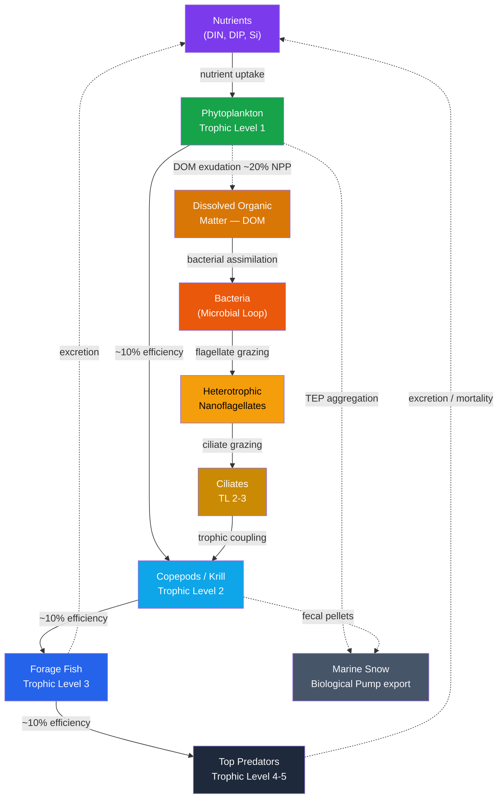

# Zooplankton and Marine Food Webs

> [!abstract] TL;DR
> The marine food web converts photosynthetically fixed carbon into fish and whale biomass through a cascade of predator–prey relationships, but at each trophic step roughly 90% of the energy is lost to respiration and excretion — so only ~0.01% of the original sunlight survives as top-predator flesh. Zooplankton (copepods, krill, salps) form the critical intermediate layer that bridges phytoplankton and fish; they also perform daily vertical migrations between surface and deep water that actively pump carbon into the mesopelagic zone. A second parallel pathway, the **microbial loop** (Azam et al. 1983), channels dissolved organic matter through bacteria and flagellates back into the classical food web, accounting for 10–50% of primary production in oligotrophic waters. **Marine snow** — sinking aggregates of dead cells, fecal pellets, and mucus — carries the food web's waste products to the deep ocean, linking upper-ocean ecology directly to global carbon sequestration.

---

## Intuition

**Analogy:** The marine food web is like a city's economy — phytoplankton are the farmers who grow all the food from raw materials (sunlight and nutrients), zooplankton are the working middle class consuming and re-packaging that food, and everything from anchovies to blue whales occupies successively higher floors of an economic tower. But unlike a city economy where wealth can be invested and compounded, in a food web roughly 90% of the energy at every floor gets burned just to keep the occupants alive and moving. A blue whale sits on the fourth or fifth floor: the original solar energy has passed through phytoplankton → copepods → krill → maybe a forage fish → whale, and at each step nine-tenths was incinerated as metabolic heat. By the time you reach the whale, only about 0.01% of the original sunlight captured at the ocean surface remains as whale flesh.

This brutal energy tax is called **trophic efficiency** (~10%, the "10:1 rule"), and it explains why the ocean supports billions of tonnes of phytoplankton but only a few hundred thousand blue whales. It also explains a puzzle: enormous quantities of dissolved organic carbon (DOC) released by phytoplankton and animal excretion evade capture by large grazers entirely — unless marine bacteria first condense that diffuse energy into tiny microbial biomass that a flagellate can eat. This bypass route — the **microbial loop** — is the ocean's economic underground, recycling material that would otherwise be permanently lost as dilute dissolved carbon.

---

## How It Works

### Core Mechanics

**1. Trophic Efficiency and the 10:1 Rule**

Raymond Lindeman (1942) formalised the concept that only a fraction of energy consumed at one trophic level is converted into biomass at the next. The canonical value is 10%, meaning:

- 1 000 g phytoplankton → 100 g copepods → 10 g small fish → 1 g tuna → 0.1 g dolphin

This sets a hard ceiling on top-predator biomass: every additional link in the food chain reduces the available energy by 90%. The practical consequence is that food chains rarely exceed 5–6 trophic levels — not enough energy survives longer chains to sustain a population. Actual trophic efficiencies range from 5% to 20% depending on prey quality, predator body size, and temperature; herbivory (grazing on plants) is consistently more efficient than carnivory.

**2. The Classical Food Web**

The classical (or "herbivore") food web runs: dissolved nutrients → large phytoplankton (diatoms, dinoflagellates) → mesozooplankton (copepods, euphausiids) → planktivorous fish (sardine, anchovy, herring) → piscivorous fish (mackerel, tuna) → apex predators (sharks, dolphins, seabirds). This chain is highly productive where nutrient upwelling sustains large-celled phytoplankton because the energy transfer from phytoplankton to fish requires only 2–3 steps (high efficiency). Coastal upwelling zones and productive shelf seas run on this classical pathway.

**3. The Microbial Loop (Azam et al. 1983)**

Farooq Azam and colleagues recognised that 10–50% of gross primary production leaks out of phytoplankton cells as dissolved organic matter (DOM) — through exudation, viral lysis, and sloppy feeding by zooplankton. This DOM was long thought to be unavailable to higher trophic levels (because fish cannot eat dissolved molecules). In reality, heterotrophic bacteria (0.2–2 µm) assimilate DOM and rebuild it into particulate bacterial biomass. Heterotrophic nanoflagellates (2–20 µm) then graze the bacteria; ciliates (20–200 µm) graze the flagellates; and ciliates feed directly into the mesozooplankton of the classical web. The loop thus "rescues" a large fraction of primary production that would otherwise be unavailable to fish. However, each additional step (bacteria → flagellate → ciliate → copepod) carries another ~10% efficiency penalty, making the microbial pathway energetically costlier than direct herbivory.

**4. Diel Vertical Migration (DVM)**

Many zooplankton species — copepods, euphausiids, amphipods, myctophid fish — perform a twice-daily vertical migration of 200–600 m: ascending to the surface at dusk to feed on phytoplankton and descending at dawn to the mesopelagic twilight zone (200–1 000 m). The cues are optical (UV radiation, twilight irradiance thresholds), chemical (predator kairomones), and circadian. The adaptive benefit is refuge from visual predators during the day while still accessing the productive surface layer at night.

The carbon consequence is significant: zooplankton feed in the sunlit zone, then respire, defecate, and excrete dissolved organic carbon at depth. This **active transport** has been estimated at 2–40% of the passive sinking flux (marine snow) in various ocean basins, making DVM a quantitatively important component of the biological carbon pump that is poorly captured by sediment traps.

**5. Marine Snow (Alldredge & Silver 1988)**

Alice Alldredge and Mary Silver coined the term for the continuous "snowfall" of organic aggregates observed by SCUBA divers in the 1980s. Marine snow particles (>0.5 mm) form primarily through:
- **Coagulation of transparent exopolymer particles (TEP)** — gel-like polymers exuded by diatoms during blooms that act as glue, aggregating cells and detritus.
- **Fecal pellets** from copepods and salps, which are dense, carbon-rich, and sink rapidly.
- **Mucus feeding webs** of giant appendicularians (*Oikopleura* spp.) that are discarded after clogging.

Sinking rates are 50–200 m day⁻¹, depending on density and size. As aggregates sink, bacteria colonise and remineralise them, returning nutrients to the water column. Only a small fraction (1–10% in open ocean, up to ~40% in highly productive regions) survives to reach the deep-sea floor.

**6. Copepod Ecology: *Calanus finmarchicus***

Copepods are the most abundant multi-cellular animals on Earth and the dominant link between phytoplankton and fish in mid- and high-latitude seas. *Calanus finmarchicus* (North Atlantic) exemplifies the strategy: it undergoes 6 naupliar and 5 copepodite stages (CI–CV) before moulting to the adult stage. The CV stage is unique — it enters **diapause** at 500–2 000 m depth during autumn and winter, storing up to 60% of its body carbon as wax esters (lipid droplets). This deep dormancy sequesters carbon below the ventilation horizon for months and functions as a "lipid shunt" in the biological pump that is distinct from sinking particles. Diapause termination in late winter triggers ascent to spawn, synchronising the copepod lifecycle with the spring phytoplankton bloom.

**7. Antarctic Krill: *Euphausia superba***

Antarctic krill are the keystone species of the Southern Ocean food web. Their estimated biomass is ~380 million tonnes (Mt) — comparable to all of humanity. They graze directly on sea-ice algae and phytoplankton, forming dense swarms (up to 30 000 individuals m⁻³) that can colour the surface water red. Every major Southern Ocean predator — blue whales, humpback whales, crabeater seals, Adélie penguins, fur seals, Antarctic petrels — depends on krill directly or via one additional trophic step. Sea ice provides essential under-ice habitat for krill during winter; sea-ice loss due to climate warming is the principal threat to the krill-based food web.

### Flow / Architecture



*Solid arrows = classical food web (direct trophic transfer). Dashed arrows = microbial loop pathways and export routes. Node colour groups: green = primary production; orange-amber = microbial loop; blue = classical secondary/tertiary consumers; grey = carbon export.*

---

## Key Concepts / Details

### Secondary Level

- **Food chain vs food web.** A food chain is a single linear sequence (algae → shrimp → fish → seal). A food web is the full network of all feeding relationships in an ecosystem. Real ecosystems have food webs, not simple chains — most predators eat multiple prey, and most prey are eaten by multiple predators.
- **Why big fish are rare.** The 10:1 rule means each floor up reduces biomass by 90%. Starting with 1 000 tonnes of phytoplankton, you can support 100 t of copepods, 10 t of herring, and 1 t of tuna. The ocean is literally running out of energy by the time you reach the top. Tuna are rare not because they are persecuted (though overfishing accelerates this) but because physics allows only a tiny fraction of primary production to reach them.
- **Krill as the foundation of Antarctic food webs.** In the Southern Ocean, *Euphausia superba* bridges the ~380 Mt of phytoplankton production directly to every major predator. Remove the krill layer and every charismatic Antarctic species — blue whales, crabeater seals, penguins — collapses within years. No other species plays this role; the Southern Ocean has an unusually short food chain (phytoplankton → krill → top predator, only 2 steps) which is why it supports such large apex predator populations.
- **Zooplankton as grazers and population regulators.** Zooplankton do not passively eat whatever phytoplankton produce. They exert **top-down control**: high copepod grazing rates in early spring can suppress or terminate phytoplankton blooms even when nutrients are still available. Where zooplankton populations are low (e.g. after a warm winter that kills overwintering populations), phytoplankton blooms can be excessively large and lead to oxygen-depleted dead zones when the uneaten biomass sinks and decomposes.
- **Jellyfish.** Jellyfish (true medusae and ctenophores) are carnivorous zooplankton that eat both phytoplankton and larval fish. Their bodies are ~95% water, low caloric density, and largely indigestible by most top predators. A jellyfish-dominated food web represents an energetic "dead end" compared to a krill-dominated one.

### Undergraduate Level

**Trophic Efficiency — Quantifying the 10:1 Rule**

Lindeman's (1942) ecological efficiency $\lambda_n$ between trophic level $n$ and $n+1$ is:

$$\lambda_n = \frac{P_{n+1}}{P_n}$$

where $P$ is net production (g C m⁻² yr⁻¹). Herbivore efficiencies typically run 10–20%; carnivore efficiencies 5–15%. In size-structured pelagic models, gross growth efficiency (GGE) of zooplankton on phytoplankton averages ~30% for assimilation but only ~10% for production after accounting for respiration.

**Size-Spectrum Theory**

In a well-mixed pelagic ecosystem, biomass is approximately constant per logarithmic body-size class — plot log(abundance) vs log(body mass) and the result is a straight line with slope ≈ −1.0 to −1.2 (Sheldon et al. 1972). This means: there is roughly as much biomass in bacteria as in zooplankton as in fish, but distributed over a body-size range spanning 12 orders of magnitude. The spectrum predicts which size classes dominate under different productivity regimes and underpins size-resolved fishery models.

**DVM Energetics and Active Carbon Flux**

A copepod migrating 400 m twice daily must spend roughly 20–30% of its ingested energy on swimming costs. The payoff is a predation mortality reduction of ~40–80% compared to surface residence. The carbon budget of active transport:

- **Respiratory flux:** CO₂ exhaled at mesopelagic depth (200–600 m) after feeding at the surface. Estimated at 5–25 mg C m⁻² day⁻¹ in the North Atlantic.
- **Excretion/mortality flux:** dissolved organic carbon and fecal pellets released at depth. Estimated at 1–10 mg C m⁻² day⁻¹.
- **Active + passive flux combined** is 2–40% of the passive sinking (marine snow) flux in various ocean basins; the proportion is highest in oligotrophic gyres where passive flux is low.

**Marine Snow Formation — TEP and Aggregation Kinetics**

Transparent exopolymer particles (TEP) are gel-like polysaccharides released primarily by diatoms during bloom senescence and nutrient stress. They have a sticky surface and act as a bridging polymer, causing phytoplankton cells to coagulate into large aggregates. The collision rate between particles follows Smoluchowski coagulation theory:

$$\frac{dN}{dt} = -K_\text{coag} \cdot N^2$$

where $N$ is particle number concentration and $K_\text{coag}$ is a turbulence- and size-dependent rate constant. Once aggregates exceed ~0.5 mm, their sinking velocity follows Stokes' law: $v_s \propto d^2 (\rho_p - \rho_w)$, giving rates of 50–200 m day⁻¹ for marine snow.

**The Microbial Loop Shunt — Why DOM Does Not Reach Fish**

Roughly 10–50% of gross primary production is released as DOM. Were it all to be channelled through bacteria → nanoflagellates → ciliates → copepods, each step incurs a ~10% transfer efficiency. By the time DOM-derived energy reaches copepods (3 microbial steps), only (0.1)³ = 0.1% of the original DOM energy is available. This "microbial shunt" means DOM production in oligotrophic systems effectively drains energy from the fish-supporting food chain. Warm, nutrient-poor ocean gyres (e.g. the Pacific subtropical gyre) are dominated by picophytoplankton and the microbial loop — they are "blue deserts" with low fish production per unit of primary production.

**Grazing Control of Phytoplankton Blooms**

In temperate shelf seas, the spring phytoplankton bloom follows a predictable pattern:
1. Winter mixing brings nutrients to the surface; phytoplankton grow exponentially once light is sufficient.
2. Copepod populations are small (overwintered at low food levels); they cannot graze as fast as phytoplankton grow initially — the bloom is **bottom-up driven**.
3. As copepod populations build up (egg → nauplii → copepodite: ~10–20 days at 5–15°C), grazing rate catches up and eventually exceeds phytoplankton growth — **top-down control** terminates the bloom.
4. Meanwhile, ciliates and heterotrophic flagellates (generation time 1–3 days) respond much faster and can graze 60–80% of daily phytoplankton production during steady-state summer conditions.

### Graduate Level

**Allometric Scaling and the Size Spectrum**

Metabolic rate scales as $B \propto M^{0.75}$ (Kleiber's law), implying that mass-specific metabolic rate scales as $B/M \propto M^{-0.25}$. Abundance in a community scales as $N \propto M^{-1.0}$ (the Damuth rule). The combination means that large organisms metabolise more slowly per unit mass, live longer, and cycle nutrients more slowly than small ones. This underpins the size-based trophic transfer models (e.g. Blanchard et al. 2012) used in IPCC fisheries projections: climate warming shifts the size spectrum toward smaller phytoplankton, reducing the trophic pathway efficiency to fish.

**Warming-Driven Shift from Classical to Microbial Food Web**

Under ocean warming (+2–4°C by 2100 in upper 200 m), stronger thermal stratification suppresses nutrient upwelling, selecting for smaller phytoplankton (picophytoplankton 0.2–2 µm; cyanobacteria *Prochlorococcus*, *Synechococcus*) with high surface:volume ratios optimised for nutrient uptake at low concentrations. These cells are too small to be efficiently grasped by copepod feeding appendages (which have minimum prey size ~5–10 µm). The energy flow increasingly routes through the microbial loop — several additional trophic steps with 10% efficiency each. Model projections (Lotze et al. 2019) suggest a 5–15% reduction in fish production per degree of warming in sub-tropical gyres through this mechanism.

**Jellyfish Blooms and the Gelatinous Shunt**

Jellyfish (*Aurelia*, *Mnemiopsis*, *Chrysaora*) have experienced documented increases in bloom frequency in the Mediterranean, Black Sea, Yellow Sea, and northeast US Atlantic margin. Mechanisms are debated: overfishing removes competitor fish and jellyfish predators (large tunas, leatherback turtles); eutrophication stimulates phytoplankton that feed jellyfish larvae; warming expands the thermal range of warm-water species. Trophic significance: jellyfish consume the same copepod prey as planktivorous fish, short-circuiting the fish production pathway. Dead jellyfish sink rapidly as **jelly falls** — dense, nitrogen-rich carcasses that are remineralised by bacteria at depth, creating a pulse of carbon and nutrient export but bypassing the fish trophic pathway entirely.

**Mesopelagic Communities and the Biological Pump**

The mesopelagic zone (200–1 000 m) hosts an estimated **1–10 billion tonnes** of fish (mostly myctophids and bristlemouths) and large populations of gelatinous zooplankton and crustaceans. These organisms are almost invisible to traditional trawl surveys (avoidance behaviour) but are detected acoustically. Their biomass uncertainty ranges over an order of magnitude; resolving this is a major goal of the MALASPINA expedition (2010–2011) and the ongoing GO-SHIP programme.

Mesopelagic fish contribute to the biological pump via:
- **Active DVM flux** (respiration and excretion at depth after feeding near the surface) — estimated 15–40% of passive flux in some regions.
- **Vertical migration of deep scattering layer** organisms (myctophids, siphonophores, euphausiids) consuming shallow-produced organic matter and remineralising it at 300–700 m.

**Acoustic Detection of DVM — The Deep Scattering Layer (DSL)**

The DSL was discovered during World War II when sonar operators reported a false seafloor that disappeared at night and moved toward the surface. It is a dense aggregation of organisms at 200–700 m during the day that ascends to 0–100 m at night. The primary acoustic scatterers are:
- **Myctophid swim bladders** — resonate at frequencies that depend on bladder size and depth pressure (38–200 kHz).
- **Siphonophore pneumatophores** — gas-filled floats of colonial siphonophores.
- **Euphausiid bodies** — less strong but present at 120–200 kHz.

DSL data from Simrad EK60 and EK80 echosounders on ocean survey vessels provide the primary basin-scale estimate of mesopelagic fish biomass. The discrepancy between acoustic estimates (~10 Gt) and net-based estimates (~1 Gt) is attributed to net avoidance and aggregation patchiness.

---

## Python Demo

```python
# Nutrient-Phytoplankton-Zooplankton-Fish (NPZF) food web model
# Holling Type II grazing/predation; Michaelis-Menten nutrient uptake
# Demonstrates how N depletion feeds back through the entire trophic chain
import numpy as np
from scipy.integrate import solve_ivp
import matplotlib.pyplot as plt

# ── Parameters ─────────────────────────────────────────────────
mu_max = 1.5     # phytoplankton max growth rate (day^-1)
K_N    = 0.5     # half-saturation constant for nutrient uptake (µmol/L N)
m_P    = 0.05    # phytoplankton mortality rate (day^-1)

g_max  = 0.8     # copepod max grazing rate on phytoplankton (day^-1)
K_P    = 1.0     # half-saturation for copepod grazing (µmol/L P)
eps_ZP = 0.10    # trophic efficiency: copepods from phytoplankton (10%)
m_Z    = 0.10    # copepod mortality (day^-1)

p_max  = 0.30    # fish max predation rate on copepods (day^-1)
K_Z    = 0.50    # half-saturation for fish predation (µmol/L Z)
eps_FZ = 0.10    # trophic efficiency: fish from copepods (10%)
m_F    = 0.04    # fish mortality (day^-1)

recycle = 0.60   # fraction of dead biomass remineralised to inorganic N

# ── ODE system ─────────────────────────────────────────────────
def npzf(t, y):
    N, P, Z, F = [max(v, 0.0) for v in y]

    mu   = mu_max * N / (K_N + N)         # Michaelis-Menten nutrient uptake
    graz = g_max  * P / (K_P + P)         # Holling Type II copepod grazing
    pred = p_max  * Z / (K_Z + Z)         # Holling Type II fish predation

    # Nutrient: consumed by phytoplankton growth; replenished by mortality recycling
    dN = -mu * P + recycle * (m_P * P + m_Z * Z + m_F * F)
    # Phytoplankton: grow on N; lost to mortality and copepod grazing
    dP =  mu * P - m_P * P - graz * Z
    # Copepods: assimilate 10% of grazed P; lost to mortality and fish predation
    dZ =  eps_ZP * graz * Z - m_Z * Z - pred * F
    # Fish: assimilate 10% of eaten copepods; lost to natural mortality
    dF =  eps_FZ * pred * F - m_F * F
    return [dN, dP, dZ, dF]

# ── Integrate 500 days from a nutrient-replete initial state ────
y0 = [8.0, 0.5, 0.05, 0.005]   # initial N, P, Z, F in µmol N-equiv/L
sol = solve_ivp(
    npzf, (0, 500), y0,
    t_eval=np.linspace(0, 500, 5000),
    method="RK45", max_step=0.05, rtol=1e-8
)
N_s, P_s, Z_s, F_s = sol.y

# ── Diagnose equilibrium trophic ratios ─────────────────────────
tail = slice(-500, None)    # last 50 days (500 points at 0.1-day resolution)
print("Equilibrium (mean over last 50 days):")
print(f"  N = {N_s[tail].mean():.3f}  P = {P_s[tail].mean():.3f}  "
      f"Z = {Z_s[tail].mean():.4f}  F = {F_s[tail].mean():.5f}  µmol/L")
print(f"  Realised Z/P ratio: {Z_s[tail].mean()/P_s[tail].mean():.3f}  (expected ~0.10)")
print(f"  Realised F/Z ratio: {F_s[tail].mean()/Z_s[tail].mean():.3f}  (expected ~0.10)")

# ── Plot all four time series ────────────────────────────────────
fig, axes = plt.subplots(2, 2, figsize=(12, 8), sharex=True)
panels = [
    (axes[0, 0], N_s, "Nutrients  N",            "#7c3aed"),
    (axes[0, 1], P_s, "Phytoplankton  P",         "#16a34a"),
    (axes[1, 0], Z_s, "Copepods / Zooplankton  Z","#0ea5e9"),
    (axes[1, 1], F_s, "Fish  F",                  "#dc2626"),
]
for ax, series, label, color in panels:
    ax.plot(sol.t, series, color=color, lw=2)
    ax.set_title(label, fontsize=11)
    ax.set_ylabel("µmol N-equiv / L")
    ax.set_xlabel("Time (days)")
    ax.grid(alpha=0.25)

plt.suptitle(
    "NPZF Food Web — Holling II Grazing, 10% Trophic Efficiency at Each Step",
    fontsize=12
)
plt.tight_layout()
plt.savefig("npzf_food_web.png", dpi=120)
plt.show()
```

**What to observe.** Nutrients (N, purple) drop from 8 to ~1–2 µmol/L as phytoplankton bloom in the first 30–50 days. Phytoplankton (P, green) peaks first (~days 15–30), followed by copepods (Z, blue, ~days 30–60), followed by fish (F, red, ~days 60–120) — each lag reflects the time needed to build population biomass. At equilibrium, the Z/P and F/Z biomass ratios both approach ~0.10, demonstrating the 10:1 trophic efficiency rule emerging from the coupled ODE dynamics. Nutrient depletion is the master control: when N is low, phytoplankton growth slows, and the reduction propagates up to limit copepods and then fish — a bottom-up cascade visible in the suppressed oscillation amplitudes after day 150.

---

## Real-World Notes

- **Collapse of the Newfoundland Grand Banks cod fishery (1992).** Atlantic cod (*Gadus morhua*) at the Grand Banks occupied trophic level 3.5–4.0 (preying on capelin, sand lance, herring, and invertebrates). By 1992 the stock had been reduced by ~99% through overfishing. The "trophic cascade" consequence: removal of cod released capelin from predation pressure, but simultaneously removed a key predator that kept shrimp and crab populations in check. The result was a food web reorganisation — a "regime shift" — that persists 30+ years after the moratorium, suggesting the food web reached an alternative stable state.
- **Jellyfish blooms in Chesapeake Bay.** *Chrysaora quinquecirrha* (sea nettle) blooms in the Chesapeake Bay reach peak densities of hundreds of individuals per 100 m³ in summer. They consume larval fish and compete directly with juvenile Atlantic menhaden (*Brevoortia tyrannus*) for copepod prey. Both overfishing and eutrophication-driven hypoxia (which kills bottom fish that would otherwise compete with jellyfish) are implicated. The blooms suppress the menhaden fishery, which historically supported the entire mid-Atlantic coast's fish and bird food web.
- **Antarctic krill decline and sea-ice loss.** Satellite and net-survey data since the 1970s suggest a ~40–80% decline in krill density in the Southwest Atlantic sector of the Southern Ocean, correlated with a ~40% reduction in winter sea-ice extent. Krill juveniles depend on sea-ice under-surface algae as their winter food source; without sufficient sea ice, recruitment fails. The projected further loss of sea ice under RCP8.5 threatens the viability of the entire Southern Ocean food web by the late 21st century.
- **Mesopelagic fish biomass — the hidden food web.** Acoustic surveys suggest mesopelagic fish (primarily myctophids and bristlemouths) may have a global biomass of 1–10 billion tonnes — 10× the current global commercial fish catch per year. These fish perform DVM and are critical intermediaries between surface production and deep-sea consumers. They are virtually unexploited commercially but are being prospected as a future protein source; any large-scale harvest would alter the biological carbon pump's active flux component.
- **Deep scattering layer and submarine warfare.** The DSL's discovery during WWII illustrates the direct consequences of food web structure for acoustics. Modern submarine detection uses the DSL as a reference layer for acoustic calibration. DSL depth and intensity provide a real-time index of zooplankton and mesopelagic fish abundance across ocean basins accessible from ships of opportunity.

---

## Common Pitfalls

- **Treating trophic efficiency as exactly 10%.** The 10:1 rule is a useful heuristic, not a physical law. Efficiencies range from ~5% (warm, nutrient-poor gyres, carnivore steps) to ~20% (cold, productive shelf seas, herbivore steps). Using exactly 10% in quantitative biomass calculations can produce factor-of-2 to factor-of-4 errors in top-predator stock estimates. Always specify whether you mean ecological efficiency (production ratio), gross growth efficiency (assimilation × production:assimilation), or trophic transfer efficiency, as these differ systematically.
- **Treating the microbial loop as isolated from the classical web.** The microbial loop is not a separate parallel food web — it is coupled to the classical web at multiple nodes. Ciliates graze both bacteria/flagellates (microbial) and small phytoplankton (classical); copepods consume both ciliates and phytoplankton directly. DOM released by copepod sloppy feeding immediately enters the microbial loop. Conceptually isolating the two webs produces incorrect flux estimates; models that omit the coupling underestimate grazing on bacteria and overestimate carbon export.
- **Attributing DVM solely to predator avoidance.** Diel vertical migration is often presented as a simple anti-predator behaviour. In reality, the migration signal integrates multiple cues: absolute light intensity (ultraviolet inhibition of DNA at the surface), rate of light change (the twilight signal that triggers ascent/descent transitions), chemical kairomones released by fish predators dissolved in the water column, and endogenous circadian rhythms that persist in constant darkness. Disruption of any one cue — by artificial light from ship lighting, by UV-absorbing CDOM, or by hypoxia blocking descent routes — alters the migration timing independently of predator density.
- **Assuming marine snow flux equals biological pump export.** Marine snow (particles >0.5 mm) is only one component of vertical carbon flux. The other components are: (i) small sinking particles (<0.5 mm) that sediment traps catch but SCUBA observers miss; (ii) active DVM transport by zooplankton and mesopelagic fish; (iii) subduction of dissolved organic carbon (DOC) by winter convection and downwelling. Studies that measure only sediment-trap particle flux systematically underestimate total biological pump export by 20–100% in regions with strong DVM or high DOC production.
- **Misinterpreting jellyfish blooms as evidence of ecosystem collapse.** Jellyfish have always been part of marine food webs and undergo natural inter-annual to decadal cycles. The claim that global jellyfish biomass is increasing is contested — long time-series (LTER, CPR survey) show no consistent global trend, though regional increases are documented. Care is needed to distinguish genuine trend from sampling artefact (jellyfish avoid and damage nets; only systematic acoustic or camera surveys are unbiased).

---

## Related Concepts

**Same vault:**
- [[Marine_Primary_Production_and_Phytoplankton]] — the autotrophic base that zooplankton graze; phytoplankton size structure and bloom timing directly control food web efficiency and the classical vs microbial pathway split.
- [[The_Biological_Pump_and_Carbon_Export]] — marine snow and active DVM transport are the two main limbs of the biological pump; food web structure determines the efficiency and depth horizon of carbon export.
- [[Deep_Sea_Ecology]] — mesopelagic and bathypelagic communities are fuelled by sinking marine snow and migrating zooplankton; food web trophodynamics link surface production to deep-sea biomass.
- [[Marine_Fisheries_and_Ocean_Resources]] — commercial fisheries harvest from the top 2–3 trophic levels built on the zooplankton base; trophic-level indicators (mean trophic level of catch) are standard fisheries assessment metrics.
- [[Harmful_Algal_Blooms_and_Dead_Zones]] — zooplankton grazing failure to control phytoplankton contributes to bloom formation; dead zones form when ungrazed bloom biomass sinks and is decomposed by bacteria, consuming oxygen.
- [[Ocean_Optics_and_Light_Penetration]] — the euphotic zone depth and light attenuation set the spatial boundaries within which primary production and surface-feeding zooplankton operate; DVM endpoints are defined by absolute irradiance thresholds.
- [[Ekman_Transport_and_Coastal_Upwelling]] — coastal upwelling delivers nutrients that fuel the phytoplankton base of classical food webs; the world's most productive fisheries (Peru, California, Benguela) depend on the upwelling → diatom → anchovy → predator chain.
- [[Ocean_Acoustics_and_Underwater_Sound]] — the deep scattering layer (DSL) is detected and its DVM tracked by hull-mounted echosounders; acoustic backscatter provides the primary large-scale method for estimating zooplankton and mesopelagic fish biomass.
- [[_MOC_Biological_Oceanography]] — section map for the biological oceanography sub-vault; entry point for phytoplankton, zooplankton, food webs, fisheries, and biological pump notes.

**Cross-vault:**
- [[Chemical_Kinetics]] — Michaelis-Menten enzyme kinetics underpins phytoplankton nutrient uptake kinetics and bacterial DOM assimilation rates; Holling Type II functional response in grazing is structurally identical to Michaelis-Menten enzyme saturation.
- [[Nutrient_Cycles_and_Trace_Elements]] — nitrogen, phosphorus, and silica cycling drives the nutrient limitation that controls food web base production; remineralisation by bacteria in the microbial loop returns nutrients to the inorganic pool.
- [[_MOC_Chemistry_Master]] — broader chemistry context for marine biogeochemistry, redox cycles, and dissolved gas dynamics that underpin food web energetics and carbon export.

---

## Review Questions

### Secondary

1. A tonne of phytoplankton is produced in the surface ocean. Using the 10:1 rule, how much blue whale biomass could ultimately be supported if the food chain runs phytoplankton → copepods → krill → baleen whale? How does your answer change if you add an extra step (copepods → sardine → whale)?
2. Why does the Southern Ocean support such large populations of whales, seals, and penguins despite being far from land? What single species makes this possible, and what physical factor most threatens it?
3. A marine biologist dives at night in the tropics and observes dense swarms of small shrimp-like animals near the surface. The same dive site at noon shows almost no animals in the top 100 m. What phenomenon explains this pattern, and why does it happen?

### Undergraduate

1. Explain the difference between the classical food web and the microbial loop. Under what oceanographic conditions (oligotrophic vs eutrophic; warm vs cold) does each pathway dominate, and what are the implications for fish production per unit of primary production?
2. *Calanus finmarchicus* enters diapause in autumn, descending to 800 m depth and remaining dormant until late winter. Explain (a) the adaptive benefit of this behaviour, (b) its carbon biogeochemical significance, and (c) why it represents a form of "active" biological pump export distinct from sinking particles.
3. A sediment trap deployed at 200 m depth measures a carbon flux of 50 mg C m⁻² day⁻¹. A parallel study using ¹³C labelling estimates total export from the euphotic zone at 120 mg C m⁻² day⁻¹. Identify the pathways that could explain the discrepancy between the two measurements.

### Graduate

1. Ocean warming is projected to increase thermal stratification and reduce mixed-layer nutrient supply, favouring picophytoplankton over diatoms. Trace the mechanistic pathway through which this shift in phytoplankton size structure would reduce fish production per unit primary production, quantifying the expected efficiency loss at each step using allometric and trophic efficiency arguments.
2. A jellyfish bloom of *Mnemiopsis leidyi* has colonised the Black Sea after ballast-water introduction. The bloom collapses anchovy populations. Using trophic cascade theory, predict the effects on: (a) copepod abundance, (b) phytoplankton biomass, (c) dissolved oxygen in bottom waters. What management intervention could theoretically restore the pre-invasion food web?
3. Acoustic data from a North Atlantic transect show a deep scattering layer (DSL) at 400–600 m depth during the day that ascends to 0–80 m at night. Describe how you would use a combination of echosounders (38, 120, 200 kHz), net trawls, MOCNESS, and stable isotope analysis (δ¹³C, δ¹⁵N) to: (a) identify the species composition of the DSL, (b) quantify the active carbon flux contributed by DVM, and (c) determine how that active flux compares to the passive particle flux measured by a co-deployed sediment trap.

---

## Sources

- Azam, F., Fenchel, T., Field, J. G., Gray, J. S., Meyer-Reil, L. A., & Thingstad, F. (1983). "The ecological role of water-column microbes in the sea." *Marine Ecology Progress Series*, 10, 257–263. — foundational paper naming and quantifying the microbial loop.
- Alldredge, A. L., & Silver, M. W. (1988). "Characteristics, dynamics and significance of marine snow." *Progress in Oceanography*, 20(1), 41–82. — definitive description of marine snow formation, composition, and sinking.
- Lindeman, R. L. (1942). "The trophic-dynamic aspect of ecology." *Ecology*, 23(4), 399–415. — original trophic efficiency concept and the 10:1 rule.
- Longhurst, A. (2007). *Ecological Geography of the Sea*, 2nd ed. Academic Press. — authoritative synthesis of plankton biogeography, trophic structure, and DVM across ocean provinces.
- Mann, K. H., & Lazier, J. R. N. (2006). *Dynamics of Marine Ecosystems: Biological–Physical Interactions in the Oceans*, 3rd ed. Blackwell. — standard graduate text covering trophic dynamics, upwelling food webs, and the microbial loop.
- Sheldon, R. W., Prakash, A., & Sutcliffe, W. H. (1972). "The size distribution of particles in the ocean." *Limnology and Oceanography*, 17(3), 327–340. — original size-spectrum description.
- Atkinson, A., Siegel, V., Pakhomov, E., & Rothery, P. (2004). "Long-term decline in krill stock and increase in salps within the Southern Ocean." *Nature*, 432, 100–103. — krill decline and sea-ice linkage.
- [NOAA Fisheries — Zooplankton and Marine Food Webs](https://www.fisheries.noaa.gov/national/bycatch/zooplankton) — overview of zooplankton ecology and fisheries connections.

---

#Oceanography #BiologicalOceanography #Zooplankton #FoodWeb #DielVerticalMigration
