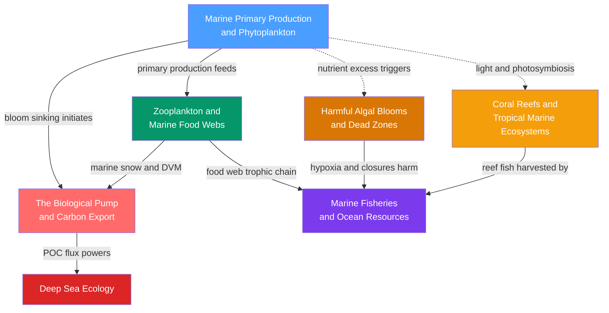

# Biological Oceanography — Map of Content

> [!info] How to use this map
> Start with **Marine Primary Production**, follow the arrows, and use the Learning Path below as your guide.
> Each node links to a full note. Come back to this map when you feel lost.

---

## Overview

Biological oceanography is the study of how life organises itself in the ocean — from the microscopic photosynthesis that fuels the entire system to the deepest trench communities that receive only a whisper of that energy. Phytoplankton in the sunlit euphotic zone fix roughly 50 GtC of carbon per year and produce half of Earth's atmospheric oxygen; the nutrients available to them, controlled by mixing and upwelling, set a hard ceiling on everything above. Zooplankton — copepods, krill, salps — graze that primary production and convert it upward through successive trophic levels toward fish and apex predators, with each step consuming roughly 90% of the energy as metabolic heat. A fraction of this biological production escapes the surface layer as sinking particles — the **biological pump** — which transfers carbon from atmosphere to deep ocean on timescales of centuries to millennia, with the Martin curve describing how steeply that flux attenuates through the twilight zone. At the ocean floor the biological pump's residue powers an alien community adapted to crushing pressure, perpetual darkness, and extreme food scarcity, while chemosynthetic ecosystems at hydrothermal vents and cold seeps operate entirely independently of sunlight. Running in parallel, coral reefs represent a radically different biological strategy: symbiotic photosynthesis packed into a carbonate framework in the oligotrophic tropics, generating the ocean's richest biodiversity from nutrient-poor water. Threading across all these systems is the human dimension — fisheries that harvest from trophic levels 3–5 and whose sustainability depends on the same food-web dynamics studied in the laboratory — and the increasingly urgent problem of coastal eutrophication, where agricultural nutrients overwhelm the ecosystem's capacity to process algal growth and trigger toxic blooms and oxygen-depleted dead zones.

---

## Concept Map

*(Blue = fundamental entry point, Red = advanced deep-dive, arrows = "leads to" or "requires", dashed = conditional branch)*

---

## Learning Path

*Recommended order for a first pass through this section:*

1. [[Marine_Primary_Production_and_Phytoplankton]] — Start here: phytoplankton biology, the P-I curve, Sverdrup critical depth, the spring bloom, and Redfield-ratio stoichiometry establish the energy source and nutrient logic for everything else in the section.
2. [[Zooplankton_and_Marine_Food_Webs]] — Builds directly on the phytoplankton base; introduces the 10:1 trophic efficiency rule, the microbial loop, diel vertical migration, and marine snow as the conduits that move energy and carbon up and down the water column.
3. [[The_Biological_Pump_and_Carbon_Export]] — Requires the food web picture from step 2 to understand how both passive sinking and active DVM transport export carbon; the Martin curve, e-ratio, and ballast hypothesis are fully grounded in what you learned in steps 1 and 2.
4. [[Deep_Sea_Ecology]] — Natural end-point of the biological pump: the depth zones, pressure physiology, chemosynthetic vent and cold-seep ecosystems, whale falls, and hadal trenches only make sense once you understand the food supply raining down from above.
5. [[Coral_Reefs_and_Tropical_Marine_Ecosystems]] — A deliberate pivot to a structurally distinct system; requires the light and nutrient context from step 1 but is largely self-contained; covers zooxanthellae symbiosis, DHW bleaching mechanics, ocean acidification, and the tropical triad of reefs, seagrasses, and mangroves.
6. [[Harmful_Algal_Blooms_and_Dead_Zones]] — Returns to coastal waters and shows how nutrient overload disrupts the ecosystem; the eutrophication cascade, HAB toxins, and dead zone formation make full sense after understanding normal phytoplankton ecology from step 1.
7. [[Marine_Fisheries_and_Ocean_Resources]] — Capstone human-impact note; the Schaefer MSY model, overfishing dynamics, and ecosystem-based management draw on trophic structure from step 2, HAB and dead zone threats from step 6, and the coral reef fishery context from step 5.

---

## All Notes in This Section

| Note | Key Concept | Level Range |
|------|-------------|-------------|
| [[Marine_Primary_Production_and_Phytoplankton]] | Sverdrup critical depth, P-I curve, spring bloom, Redfield ratio, satellite chlorophyll | Secondary to Graduate |
| [[Zooplankton_and_Marine_Food_Webs]] | 10:1 trophic efficiency, microbial loop, diel vertical migration, marine snow, copepod lifecycle | Secondary to Graduate |
| [[The_Biological_Pump_and_Carbon_Export]] | Martin curve, e-ratio, DVM active transport, ballast hypothesis, 234Th export method | Secondary to Graduate |
| [[Deep_Sea_Ecology]] | Depth zones, hydrostatic pressure, TMAO piezolytes, chemosynthetic vents, whale falls, hadal trenches | Secondary to Graduate |
| [[Coral_Reefs_and_Tropical_Marine_Ecosystems]] | Zooxanthellae symbiosis, calcification, Degree Heating Weeks, coral bleaching, ocean acidification | Secondary to Graduate |
| [[Marine_Fisheries_and_Ocean_Resources]] | MSY, logistic growth, Schaefer model, Beverton-Holt recruitment, overfishing, aquaculture | Secondary to Graduate |
| [[Harmful_Algal_Blooms_and_Dead_Zones]] | Eutrophication cascade, saxitoxin, brevetoxin, domoic acid, Gulf of Mexico dead zone, Baltic hypoxia | Secondary to Graduate |

---

## Key Questions This Section Answers

- What physical and chemical conditions trigger the explosive spring phytoplankton bloom, and why does the ocean appear green from space during this event?
- How does energy move from microscopic algae through copepods and krill to fish and apex predators, and what limits the number of trophic levels in a marine food chain?
- What fraction of surface primary production is exported to the deep ocean, how does it attenuate with depth, and why does this matter for atmospheric CO₂?
- How do organisms survive in the perpetually dark, freezing, high-pressure deep ocean, and what alternative to sunlight powers hydrothermal vent communities?
- Why do coral reefs sustain 25% of all marine species despite covering less than 0.1% of the ocean floor, and why is a 1°C warming above the seasonal maximum so catastrophic for them?
- How does agricultural nutrient runoff cascade through coastal waters to create toxic algal blooms and oxygen-depleted dead zones hundreds of kilometres from any farm?

---

## Connections to Other Topics

- [[_MOC_Oceanography_Master]] — Parent vault entry point; physical oceanography context for mixed layers, upwelling, and circulation that drive biological patterns in this section.
- [[_MOC_Chemistry_Master]] — Nutrient stoichiometry and the Redfield ratio, carbonate chemistry underlying coral calcification and ocean acidification, carbon cycle thermodynamics, and 234Th radiochemistry used to measure export flux.
- [[_MOC_Physics_Master]] — Light penetration and the euphotic depth that constrains primary production; turbulence and stratification that control mixed-layer depth; hydrostatic pressure governing deep-sea physiology.
- [[_MOC_Earth_Science_Master]] — Seafloor geology and mid-ocean ridge spreading that create hydrothermal vent habitats; sediment records that preserve biological pump signals; subduction zones that form hadal trenches.
- [[_MOC_Meteorology_Master]] — Climate forcing on biological productivity via ENSO-driven upwelling cycles; marine heatwaves as the proximal cause of mass coral bleaching; atmospheric CO₂ trajectories that determine the future of reefs and the biological pump.

---

#MOC #Oceanography #BiologicalOceanography
