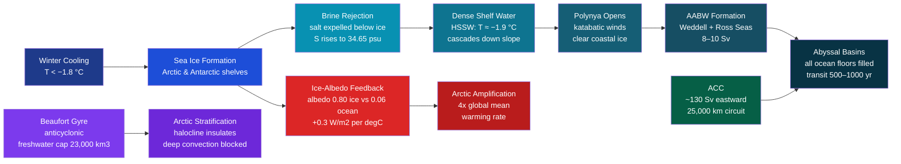

# Arctic and Antarctic Oceans

> [!abstract] TL;DR
> The **Arctic Ocean** (14 Mkm²) is a nearly landlocked polar sea covered seasonally by sea ice, while the **Antarctic** is a continent ringed by the **Southern Ocean**, through which the **Antarctic Circumpolar Current (ACC, ~130 Sv)** connects all three major ocean basins in an unbroken 25,000 km loop. Sea ice formation drives **brine rejection** — expelling salt into shelf waters to create the extremely dense **Antarctic Bottom Water (AABW, ~8–10 Sv)** that ventilates the global abyss. As Arctic September sea ice retreats from 7.8 Mkm² in 1980 to 3.8 Mkm² in 2023 (a trend of −13%/decade), the **ice-albedo feedback** replaces reflective ice (albedo ≈ 0.8) with dark ocean (albedo ≈ 0.06), amplifying Arctic warming at **~4× the global mean rate** — a phenomenon called Arctic amplification. These cascading changes are altering global ocean circulation, deep-water formation, the Southern Ocean carbon sink, and sea level projections for the 21st century and beyond.

---

## Intuition

**Analogy:** Think of the polar oceans as Earth's two air conditioners. In summer they radiate excess planetary heat to space from their open-water margins; in winter they freeze over and cover themselves with a brilliant white roof of sea ice that reflects sunlight back before it can warm the planet. Now imagine gradually painting that white roof black: the house absorbs more solar radiation, heats faster than the rest of the neighbourhood, and the black paint keeps spreading as the ice melts further. That runaway process — dark ocean absorbing where reflective ice once reflected — is the **ice-albedo feedback**, and it explains why the Arctic is warming four times faster than the global average while simultaneously pumping out the world's densest ocean water from beneath its ice-covered shelves.

The Antarctic counterpart works slightly differently: its sea ice is a vast seasonal ring (reaching 18 Mkm² in September) around a continent buried under 3 km of glacial ice. When that sea ice freezes each winter, it expels salt into the shelf waters below, creating water so cold (−1.9 °C) and dense that it sinks to the ocean floor, travels along the abyss for centuries, and eventually upwells back to the surface — closing the slow loop of the global thermohaline conveyor. Wrapped around all of this, the ACC acts as the Southern Ocean's distribution ring, sharing this cold, newly ventilated water with every ocean basin on the planet.

---

## How It Works

### Core Mechanics

**1. Sea ice formation and brine rejection.**
Seawater freezes at approximately −1.8 °C (lower than pure water because dissolved salts lower the freezing point). As ice crystals grow, the crystal lattice ejects most of the dissolved salt, expelling it as concentrated **brine** into the water column immediately below. Each unit of new ice formation raises the salinity and density of the sub-ice water. On Antarctic continental shelves, this process is amplified by intense winter cooling (air temperatures −20 to −40 °C) to produce **High Salinity Shelf Water (HSSW)**: T ≈ −1.9 °C, S ≈ 34.62–34.65 psu. This water reaches densities of σ₄ > 46.1 kg m⁻³ — the highest density of any open-ocean water mass on Earth — and cascades down the continental slope as the precursor of AABW.

The rate of first-year ice thickening in a quiescent slab of water follows **Stefan's Law**:

$$h(t) = \sqrt{\frac{2\, k_\text{ice}}{\rho_\text{ice}\, L_f}} \cdot \sqrt{\Sigma\, \text{FDD}}$$

where $k_\text{ice} \approx 2.1$ W m⁻¹ K⁻¹ is ice thermal conductivity, $\rho_\text{ice} = 917$ kg m⁻³, $L_f = 334{,}000$ J kg⁻¹ is the latent heat of fusion, and $\Sigma \text{FDD}$ is accumulated **freezing degree-days** (degree-days below the freezing point). The square-root dependence means ice grows rapidly at first but progressively insulates itself, slowing further thickening. A sustained +2 °C warming reduces FDD accumulation by ~10%, cutting end-of-winter ice thickness by ~5%; +4 °C reduces FDD by ~20%, cutting thickness by ~11%.

**2. Ice-albedo feedback.**
Sea ice has a broadband shortwave albedo of α_ice ≈ 0.80: 80% of incoming solar energy is reflected back to space. Open ocean has α_ocean ≈ 0.06 — a contrast of 0.74. When ice retreats and exposes dark ocean, the newly uncovered surface absorbs approximately **8× more solar radiation** per unit area. The net feedback strength is approximately **+0.3 W m⁻² °C⁻¹** of Arctic warming in summer — one of the strongest positive feedbacks in the climate system. Each degree of warming melts more ice, each patch of new open ocean absorbs more heat, driving further warming. This self-amplifying loop is the principal reason the Arctic warms so much faster than the global mean.

**3. Arctic sea ice decline.**
Arctic September (end-of-melt-season) sea ice extent has declined steeply over the satellite record:
- 1980: ~7.8 Mkm² (NSIDC passive microwave)
- 2012: ~3.4 Mkm² (record minimum as of 2024)
- 2023: ~3.8 Mkm²
- **Trend: −13% per decade** relative to the 1981–2010 climatological mean
- Sea ice **volume** (thickness × area) has declined even faster, as thick multi-year ice is replaced by thin, fragile first-year ice

Under IPCC SSP2-4.5 (medium emissions), an Arctic September with extent < 1 Mkm² — effectively **ice-free** — is likely at least once before 2050. Under SSP5-8.5, ice-free September conditions become near-annual by the 2040s.

**4. Polynya formation and AABW production.**
A **polynya** is a persistent patch of open water enclosed by sea ice. **Coastal (latent heat) polynyas** form when strong **katabatic winds** — cold, dense air draining off the Antarctic plateau at speeds of 30–50 m s⁻¹ — blow offshore and push sea ice away from the coast, maintaining a strip of open ocean even in mid-winter. Heat is rapidly extracted from this open water, driving intense sea ice formation, brine rejection, and HSSW accumulation on the shelf. The **Weddell Sea Polynya** (near Coats Land) and **Ross Sea Polynya** together account for most of the world's AABW production (~8–10 Sv combined). HSSW from these polynyas mixes with **Circumpolar Deep Water (CDW)** near the shelf break to form AABW, which then sinks and spreads equatorward along the ocean floor.

An anomalous **open-ocean polynya** appeared in the central Weddell Sea from 1974 to 1976, an ice-free area of ~300,000 km² maintained by upwelling of warm CDW that supplied enough heat to melt the overlying ice. Its sudden disappearance — and a partial recurrence in 2016–2017 — remains one of polar oceanography's unsolved mysteries, with implications for how the Southern Ocean may respond to future forcing.

**5. Beaufort Gyre and Arctic freshwater reservoir.**
The **Beaufort Gyre** is a large anticyclonic (clockwise when viewed from above) surface circulation in the Canada Basin of the Arctic Ocean, driven by the semi-permanent **Beaufort High** atmospheric pressure centre. Ekman convergence at the gyre centre accumulates a thick **freshwater lens** (the Arctic halocline) drawn from three sources: river runoff from the Siberian and North American drainage basins (~3,300 km³/yr total — the Ob, Yenisey, Lena, and Mackenzie are the largest inputs), Pacific Water inflow through Bering Strait (~0.8 Sv, relatively fresh), and meltwater from sea ice. The gyre currently holds ~23,000 km³ of freshwater anomaly relative to a reference salinity of 34.8 psu.

This freshwater cap strongly stratifies the upper Arctic Ocean, maintaining a halocline that insulates the sea ice from a lens of warm Atlantic Water (T > 0 °C) at 200–800 m depth. Under anthropogenic forcing, Arctic Ocean freshwater storage has been increasing (gyre spin-up due to strengthened Beaufort High). Episodic gyre spin-down could release a pulse of freshwater into the Labrador Sea, potentially weakening AMOC deep convection and further disrupting global thermohaline circulation.

**6. Antarctic Circumpolar Current (ACC).**
The ACC is the largest ocean current on Earth by volume transport: **~130 Sv** (range 125–135 Sv) flows continuously **eastward** around Antarctica, driven by the relentless **Southern Ocean westerlies** acting on a basin with no continental barrier. The current encircles the planet over a **25,000 km** circumference, passing through the **Drake Passage** between South America and the Antarctic Peninsula — the narrowest chokepoint at ~850 km wide — where transport is best measured. The ACC connects the Atlantic, Indian, and Pacific Oceans, functioning as the global ocean's distribution ring: AABW, Subantarctic Mode Water (SAMW), and Antarctic Intermediate Water (AAIW) are all shared between basins via the ACC's circumpolar transport.

The ACC is not a single coherent jet but a system of **three to five quasi-permanent fronts** — the Subantarctic Front (SAF), Polar Front (PF), and Southern ACC Front (SACCF) — each a band of concentrated horizontal density gradient and eastward velocity. These fronts are baroclinically unstable, spawning mesoscale eddies that carry heat and carbon southward across the frontal barrier. A key feature is **eddy saturation**: in theory, stronger wind forcing should increase ACC transport, but because eddies intensify proportionally, the time-mean transport remains relatively insensitive to wind changes — a counterintuitive property with implications for Southern Ocean heat and carbon uptake in a warming world.

**7. Southern Ocean carbon sink.**
Cold polar water dissolves more CO₂ than warm water (Henry's Law: gas solubility increases at lower temperatures). The Southern Ocean — defined as south of 35°S — is the world's largest oceanic CO₂ sink, absorbing approximately **1.5–2.3 Pg C yr⁻¹** (~40% of total ocean CO₂ uptake). The uptake is driven by both the biological pump (diatom blooms that fix CO₂ and export carbon to depth as organic matter) and the physical solubility pump (cold, dense water subducting as AAIW and SAMW, carrying dissolved CO₂ to intermediate depths). Upwelling of CDW in the ACC zone — water that has accumulated dissolved inorganic carbon (DIC) from centuries of deep storage — partially offsets this sink by outgassing CO₂ at the surface. The balance is sensitive to Southern Ocean wind forcing: stronger westerlies drive more CDW upwelling, weakening the sink, as was observed in the 1990s–2000s before the sink partially recovered.

**8. Arctic amplification.**
"Arctic amplification" describes the empirical observation that the Arctic surface warms **2–4× faster** than the global mean under greenhouse gas forcing. Key mechanisms contributing to this amplification include:
- **Ice-albedo feedback** (primary driver): sea ice and snow loss replaces high-albedo surfaces with dark ocean and tundra
- **Lapse-rate feedback** (Arctic-specific): in the tropics, warming extends throughout the troposphere (the atmosphere radiates heat to space efficiently from altitude); in the Arctic, surface inversions trap warming close to the surface, reducing the efficiency of outgoing longwave radiation — a unique positive feedback
- **Poleward heat transport**: increased meridional temperature gradient at the surface drives more atmospheric and oceanic heat transport to the pole
- **Sea-ice loss in autumn**: open ocean stores summer heat and releases it to the atmosphere in autumn/winter, warming the lower Arctic troposphere substantially above what CO₂ forcing alone would produce

Observed trend: Arctic surface air temperatures have warmed at approximately **+0.7 °C/decade** (1979–present) versus a global mean of **+0.18 °C/decade** — a factor of ~**4×**. The Arctic has already warmed by ~3 °C above the late 19th century baseline against a global mean of ~1.1 °C. CMIP6 models project that by 2100 under SSP5-8.5, the Arctic will warm by 10–14 °C relative to the 1850–1900 mean, versus ~4–5 °C globally.

### Flow / Architecture



---

## Key Concepts / Details

### Secondary Level

- **Arctic vs Antarctic geography.** The Arctic is an **ocean** (14 Mkm²) surrounded by land (North America, Eurasia, Greenland); its sea ice is floating. The Antarctic is a **continent** (14 Mkm²) surrounded by the Southern Ocean; its land ice is a glacial ice sheet 2–4 km thick. These are fundamentally different systems: floating Arctic sea ice does not contribute to sea level rise if it melts (it is already displacing water); melting Antarctic land ice does raise sea level.
- **Sea ice is nearly fresh.** Although sea ice forms from salty ocean water, the lattice expels most salt during freezing. First-year sea ice has a salinity of ~5–8 psu (versus seawater at ~34 psu). Multi-year sea ice that has undergone summer melt is even fresher (~2–4 psu), making it a source of freshwater when it melts.
- **Polar bears depend on Arctic sea ice.** Sea ice is a hunting platform — polar bears (Ursus maritimus) hunt ringed seals at breathing holes. Earlier ice breakup and later freeze-up is reducing their on-ice hunting season, leading to increased fasting periods, declining body condition, and reduced cub survival in populations such as Western Hudson Bay.
- **The Southern Ocean connects all ocean basins.** All deep and intermediate water masses produced in the Arctic and Antarctic regions circulate globally via the ACC. Every parcel of AABW that sinks in the Weddell Sea eventually reaches the North Pacific floor — centuries later.
- **Polar amplification is a thermometer.** The ratio of Arctic to global warming — the "amplification factor" — is a key metric for evaluating climate models. Models that correctly simulate ice-albedo and lapse-rate feedbacks tend to better represent both Arctic change and global climate sensitivity.

### Undergraduate Level

- **Stefan's Law ice growth.** The conduction of heat through growing sea ice follows Fourier's Law: the flux through ice of thickness $h$ is $F = k_\text{ice} \Delta T / h$, where $\Delta T = T_\text{freeze} - T_\text{air}$ (ocean-to-air temperature difference). Setting this equal to the latent heat release per unit volume per unit time ($\rho_\text{ice} L_f \cdot \dot{h}$) and integrating gives Stefan's Law. The accumulated FDD quantifies the total thermal forcing available for freezing. The law breaks down for thin ice (<0.1 m, turbulent convection dominates), for snow-covered ice (snow is a poor conductor, $k_\text{snow} \approx 0.3$ W m⁻¹ K⁻¹), and when brine channels within the ice allow saline convection to transport heat.
- **Ice-albedo feedback parameterisation.** In energy balance models, the ice-albedo feedback is represented as a surface albedo that decreases above a threshold temperature: $\alpha(T) = \alpha_\text{ice}$ for $T < T_\text{melt}$, $\alpha_\text{ocean}$ for $T > T_\text{melt}$, with a smooth transition in between. The feedback parameter $\lambda_\alpha = \partial R / \partial T$ (change in net radiation with temperature) enters the climate sensitivity equation $\Delta T = -F_0 / (\lambda_\text{BB} + \lambda_\alpha + \ldots)$ as a positive (destabilising) term. Its magnitude (+0.3 W m⁻² K⁻¹) is comparable to the water vapour feedback and significantly larger than the surface-temperature blackbody feedback alone.
- **AABW formation mechanism.** The thermodynamic path to AABW on the Antarctic shelf: (1) katabatic wind clears polynya, (2) open water loses ~200–400 W m⁻² of heat to the atmosphere, (3) rapid sea ice formation with brine rejection raises shelf water salinity and density, (4) HSSW accumulates on the ~500 m deep continental shelf, (5) at the shelf break, HSSW overflows onto the continental slope, mixing with overlying CDW (T ≈ 2 °C, S ≈ 34.7 psu) to form AABW (T ≈ −0.5 °C, S ≈ 34.65 psu), (6) AABW spreads equatorward along the ocean floor as a dense bottom gravity current. Estimates from inverse models place total AABW formation at ~8–10 Sv with interannual variability linked to polynya size and katabatic wind intensity.
- **Beaufort Gyre freshwater budget.** The gyre holds ~23,000 km³ of freshwater anomaly (the freshwater content relative to S_ref = 34.8 psu integrated over the upper 200 m). Inputs: Arctic river runoff (~3,300 km³/yr), Pacific Water inflow (~2,000 km³/yr freshwater equivalent), precipitation minus evaporation (~1,000 km³/yr). Outputs: export through Fram Strait to the North Atlantic (~2,500 km³/yr via sea ice and surface currents), export through Canadian Archipelago (~900 km³/yr). The gyre is spinning up (ocean surface stress increasing under faster anticyclonic winds), storing more freshwater each decade.
- **ACC baroclinic transport estimate.** The ACC transport through Drake Passage is estimated from moored current meter arrays (e.g., DRAKE array) and from geostrophic calculations using hydrographic sections. The baroclinic transport (relative to a deep reference level) is ~115 Sv; barotropic (depth-independent) flow adds ~15–20 Sv, giving the canonical ~130 Sv total. Unlike western boundary currents, the ACC has no eastern or western boundary to pin it; its path is steered by topography — the Scotia Ridge, Kerguelen Plateau, and Campbell Plateau all deflect the ACC northward.

### Graduate Level

- **Atlantic Meridional Mode and Arctic warming asymmetry.** The Arctic warms more strongly on its Atlantic (European) side than its Pacific side. Atlantic Water (AW) intruding into the Arctic Ocean at 200–800 m is warming and freshening ("Atlantification"), thinning the cold halocline and moving the sub-surface heat source closer to the ice base. This Atlantic-driven subsurface warming destabilises the halocline, promotes ice thinning from below, and is thought to drive the observed asymmetry in sea ice loss — greater losses in the Barents and Kara Seas than in the Chukchi and Beaufort. Projections suggest Atlantification will intensify as AMOC weakening reduces northward heat transport partially, but direct AW warming of the Arctic increases.
- **Arctic Ocean freshwater budget and tipping.** Freshwater accumulation in the Beaufort Gyre is partially reversible through decadal atmospheric variability. The concern is a potential tipping behaviour: if the Beaufort High weakens (as occurred in the 2000s, slowing gyre spin-up), accumulated freshwater drains rapidly through Fram Strait and the Canadian Archipelago into the North Atlantic. Model experiments (e.g., Jahn & Holland 2013) suggest that a release of 5,000–10,000 km³ of freshwater could weaken Labrador Sea convection for decades. The tipping risk is compounded by future freshwater additions from Greenland Ice Sheet melt (already ~300 km³/yr liquid runoff and growing).
- **The Weddell Sea Polynya mystery.** The 1974–1976 Weddell Polynya (~300,000 km²) was an open-ocean polynya sustained by upwelling of warm CDW triggered by deep convection reaching ~3,000 m — the only documented case of this scale in the satellite era. Its mechanism is debated: the most accepted explanation involves a positive feedback between sea ice absence (more buoyancy loss from cooling), deep convection, and upwelling of warm CDW that sustains the polynya against refreezing. The partial recurrence in 2016–2017 was linked to anomalously strong storm activity and preconditioning by low sea ice cover. Understanding this mechanism matters because similar deep convection events would dramatically increase AABW production and ventilate deep Southern Ocean waters, releasing stored CO₂.
- **Southern Ocean eddy saturation.** The ACC transport is theorised to be in an "eddy-saturated" state: Southern Ocean westerlies have strengthened by ~15–20% since the 1980s (due to ozone depletion and greenhouse warming shifting the jet southward), yet ACC transport through Drake Passage shows no clear trend (Meredith & Hogg 2006; Böning et al. 2008). The explanation is that stronger wind forcing is compensated by increased eddy activity: baroclinic instabilities of the ACC fronts produce more and larger mesoscale eddies that restratify the water column and limit the build-up of the density gradient needed to drive more transport. Eddy saturation has profound implications for Southern Ocean heat and carbon uptake: eddies carry warm CDW southward, promoting basal melting of ice shelves, and the eddy-driven MOC in the Southern Ocean may be increasingly important as wind-driven overturning saturates.
- **Antarctic basal melting from warm CDW intrusions.** The Southern Ocean is warming, particularly in the Amundsen Sea sector, where warm CDW reaches the grounding lines of Pine Island Glacier, Thwaites Glacier, and other West Antarctic Ice Sheet outlets. CDW is ~3–4 °C above the in-situ melting point of ice, delivering enormous heat fluxes (~3 W m⁻² basal melt ≈ 50–100 Gt yr⁻¹ from Thwaites alone). As CDW intruding onto the continental shelf freshens the sub-ice-shelf cavity and erodes the ice from below, the grounding line retreats — a process that may be **irreversible** (marine ice sheet instability, MISI) once it reaches reverse-sloping bedrock inland. Continued CDW intrusion driven by strengthening westerlies and ice shelf thinning is the leading mechanism for potential WAIS collapse on century-to-millennium timescales.

---

## Python Demo

```python
"""
Two-panel demonstration of polar sea ice science:

Panel 1 — Stefan's Law ice growth model:
  h(t) = A_FDD * sqrt(FDD(t))
  where A_FDD = sqrt(2*k_ice / (rho_ice * L_f)) * sqrt(86400)
  Compare baseline Arctic winter cooling vs +2 C and +4 C warming scenarios.

Panel 2 — Arctic September sea ice extent trend:
  Synthetic data reproducing the observed -13%/decade decline (1980-2023).
"""

import numpy as np
import matplotlib.pyplot as plt

# ─── Physical constants for Stefan's Law ─────────────────────────────────────
k_ice    = 2.1        # thermal conductivity of sea ice  [W m-1 K-1]
rho_ice  = 917.0      # density of sea ice               [kg m-3]
L_f      = 334_000.0  # latent heat of fusion            [J kg-1]
T_freeze = -1.8       # seawater freezing point          [deg C]

# Stefan coefficient: h = A_FDD * sqrt(FDD)
# FDD in degree-days; factor sqrt(86400) converts days -> seconds
A_stefan = np.sqrt(2.0 * k_ice / (rho_ice * L_f))
A_FDD    = A_stefan * np.sqrt(86400.0)
print(f"Stefan coefficient  A  = {A_stefan:.4e}  m / sqrt(K·s)")
print(f"Stefan coefficient  A  = {A_FDD:.5f}   m / sqrt(FDD)")

# ─── Freeze season: 150 days ─────────────────────────────────────────────────
days = np.linspace(0.0, 150.0, 600)

T_air_base  = -20.0                   # baseline mean winter air temperature  [deg C]
T_air_warm2 = T_air_base + 2.0        # +2 C warming scenario
T_air_warm4 = T_air_base + 4.0        # +4 C warming scenario

def fdd_accum(days, T_air):
    """Accumulated FDD for constant air temperature below freezing."""
    dt_above_freeze = max(0.0, T_freeze - T_air)   # positive if T_air < T_freeze
    return dt_above_freeze * days                   # FDD = |DeltaT| * days

FDD_base  = np.array([fdd_accum(d, T_air_base)  for d in days])
FDD_warm2 = np.array([fdd_accum(d, T_air_warm2) for d in days])
FDD_warm4 = np.array([fdd_accum(d, T_air_warm4) for d in days])

h_base  = A_FDD * np.sqrt(FDD_base)    # ice thickness [m]
h_warm2 = A_FDD * np.sqrt(FDD_warm2)
h_warm4 = A_FDD * np.sqrt(FDD_warm4)

h_end_base  = h_base[-1]
h_end_warm2 = h_warm2[-1]
h_end_warm4 = h_warm4[-1]

print(f"\nEnd-of-season ice thickness (150 days):")
print(f"  Baseline (T_air = {T_air_base} C): FDD = {FDD_base[-1]:.0f} deg-days,"
      f" h = {h_end_base*100:.1f} cm")
print(f"  +2 C    (T_air = {T_air_warm2} C): FDD = {FDD_warm2[-1]:.0f} deg-days,"
      f" h = {h_end_warm2*100:.1f} cm"
      f"  ({(h_end_warm2 - h_end_base)/h_end_base*100:+.1f}%)")
print(f"  +4 C    (T_air = {T_air_warm4} C): FDD = {FDD_warm4[-1]:.0f} deg-days,"
      f" h = {h_end_warm4*100:.1f} cm"
      f"  ({(h_end_warm4 - h_end_base)/h_end_base*100:+.1f}%)")

# ─── Arctic September extent trend 1980-2023 ─────────────────────────────────
years = np.arange(1980, 2024)          # 44-year record

extent_1980    = 7.8                   # Mkm2 in 1980
slope_per_dec  = -0.13 * extent_1980  # -13%/decade of the 1980 baseline
slope_per_yr   = slope_per_dec / 10.0

extent_trend   = extent_1980 + slope_per_yr * (years - 1980)

np.random.seed(42)
noise          = np.random.normal(0.0, 0.38, len(years))   # interannual variability
extent_synth   = np.clip(extent_trend + noise, 2.0, 9.5)   # bound to physical range

# Approximate record minimum (2012) and 2023 value
extent_synth[32] = 3.41   # 2012 record minimum
extent_synth[43] = 3.82   # 2023

print(f"\nArctic September extent trend:")
print(f"  Slope = {slope_per_yr:.3f} Mkm2/yr"
      f"  = {slope_per_dec:.3f} Mkm2/decade"
      f"  = {slope_per_dec/extent_1980*100:.1f}%/decade")
print(f"  1980 value = {extent_1980:.1f} Mkm2")
print(f"  2023 value = {extent_trend[-1]:.2f} Mkm2 (trend) /"
      f" {extent_synth[-1]:.2f} Mkm2 (synthetic observation)")

# ─── Figure ──────────────────────────────────────────────────────────────────
fig, (ax1, ax2) = plt.subplots(1, 2, figsize=(14, 5))

# Panel 1: Stefan's Law ice growth
ax1.plot(days, h_base  * 100, color='#1d4ed8', lw=2.5,
         label=f"Baseline  T_air = {T_air_base} °C")
ax1.plot(days, h_warm2 * 100, color='#dc2626', lw=2.5, ls='--',
         label=f"+2 °C warming  T_air = {T_air_warm2} °C")
ax1.plot(days, h_warm4 * 100, color='#b45309', lw=2.5, ls=':',
         label=f"+4 °C warming  T_air = {T_air_warm4} °C")

ax1.set_xlabel("Days since freeze-up", fontsize=12)
ax1.set_ylabel("Sea ice thickness  [cm]", fontsize=12)
ax1.set_title("Stefan's Law — Sea Ice Growth\n"
              r"$h \propto \sqrt{\Sigma\,\mathrm{FDD}}$", fontsize=12)
ax1.legend(fontsize=9)
ax1.grid(True, alpha=0.3)
info_text = (f"End-of-winter thickness (150 d):\n"
             f"Baseline: {h_end_base*100:.0f} cm\n"
             f"+2 °C: {h_end_warm2*100:.0f} cm"
             f" ({(h_end_warm2-h_end_base)/h_end_base*100:+.0f}%)\n"
             f"+4 °C: {h_end_warm4*100:.0f} cm"
             f" ({(h_end_warm4-h_end_base)/h_end_base*100:+.0f}%)")
ax1.text(0.97, 0.05, info_text, transform=ax1.transAxes, ha='right', fontsize=8,
         bbox=dict(boxstyle='round,pad=0.4', facecolor='lightyellow', alpha=0.9))

# Panel 2: Arctic September extent
ax2.scatter(years, extent_synth, s=22, color='#0284c7', alpha=0.85, zorder=3,
            label="Sep extent (synthetic obs)")
ax2.plot(years, extent_trend, color='#dc2626', lw=2.5,
         label=f"Linear trend: {slope_per_dec:.2f} Mkm²/decade")
ax2.fill_between(years, extent_synth, extent_trend, alpha=0.12, color='#0284c7')
ax2.axhline(extent_1980, color='gray', ls=':', lw=1.2, alpha=0.8,
            label=f"1980 value ({extent_1980} Mkm²)")
ax2.axhline(3.82, color='orange', ls='--', lw=1.2, alpha=0.8,
            label="2023 minimum (~3.8 Mkm²)")

ax2.annotate("2012 record\n~3.4 Mkm²", xy=(2012, 3.41), xytext=(2005, 2.4),
             arrowprops=dict(arrowstyle='->', color='#7c3aed', lw=1.5),
             fontsize=8, color='#7c3aed')

ax2.set_xlabel("Year", fontsize=12)
ax2.set_ylabel("September sea ice extent  [Mkm²]", fontsize=12)
ax2.set_title("Arctic September Sea Ice Extent  1980–2023\n"
              "Observed trend: −13% per decade", fontsize=12)
ax2.legend(fontsize=8, loc='upper right')
ax2.grid(True, alpha=0.3)
ax2.set_ylim(1.0, 9.5)

plt.suptitle("Polar Sea Ice: Stefan Growth Model  &  Arctic Extent Decline",
             fontsize=11, fontweight='bold')
plt.tight_layout()
plt.savefig("polar_sea_ice_model.png", dpi=150, bbox_inches='tight')
plt.show()
```

---

## Real-World Notes

> **Arctic Shipping Routes Opening.** The loss of Arctic sea ice is opening commercially viable shipping routes across the top of the world. The **Northern Sea Route (NSR)** along the Siberian coast was navigable only with icebreaker escort for a few weeks in peak summer; by the late 2010s it was open for 3–4 months per year with ice-strengthened vessels and is projected to be commercially open for 6+ months per year by mid-century under high-emission scenarios. The NSR saves roughly **20,000 km** on a Rotterdam-to-Yokohama transit compared to the Suez Canal route — cutting shipping time from ~30 days to ~20 days. Russia operates nuclear-powered icebreakers to maintain year-round NSR service. Geopolitical tensions over transit rights, environmental regulations, and search-and-rescue infrastructure in the high Arctic are intensifying as these routes become economically significant.

> **Greenland Freshwater Pulse and AMOC.** The Greenland Ice Sheet is losing mass at an accelerating rate: from ~150 Gt yr⁻¹ in the early 2000s to ~280 Gt yr⁻¹ by the 2010s (GRACE/GRACE-FO satellite gravity). This freshwater — primarily liquid runoff down meltwater rivers and solid ice discharge from marine-terminating glaciers — enters the North Atlantic and Labrador Sea near AMOC deep-water formation zones. Freshwater reduces surface salinity, stratifies the water column, and suppresses deep convection, contributing to AMOC weakening already detected in 20th century SST fingerprints (Caesar et al. 2018). Future Greenland mass loss projections (IPCC AR6) range from ~100 to ~230 mm of sea level equivalent contribution by 2100, with associated freshwater forcing substantially exceeding the volumes implicated in paleoclimate AMOC disruptions.

> **Southern Ocean CO₂ Undersaturation and Wind Changes.** The Southern Ocean south of the Polar Front is chronically undersaturated in CO₂ relative to the atmosphere in austral summer, making it a persistent biological sink. However, in the 1990s–2000s the sink weakened dramatically: strengthened Southern Ocean westerlies (driven by both the positive Southern Annular Mode trend from stratospheric ozone depletion and greenhouse gas forcing) increased upwelling of CDW carrying ancient, CO₂-rich deep water, partially overwhelming the biological drawdown. After ozone depletion stabilised (~2002 onwards), the westerlies levelled off and the sink partially recovered. Future projections suggest the competition between strengthened biological production (a warmer, longer growing season) and increased CDW upwelling will determine whether the Southern Ocean remains a net sink under high-emission scenarios.

> **Antarctic Krill Fishery Under Sea Ice Stress.** Antarctic krill (*Euphausia superba*) are the keystone species of the Southern Ocean food web — the primary food source for penguins, seals, and baleen whales. Krill overwinter under sea ice, feeding on ice algae growing on the underside of the ice pack. Sea ice retreat in the southwest Atlantic sector (Antarctic Peninsula region, where warming has been most intense — ~3 °C since 1950) has reduced the extent and duration of krill nursery habitat. Simultaneously, commercial krill fishing (primarily for aquaculture feed and omega-3 supplements) has increased. CCAMLR (Commission for the Conservation of Antarctic Marine Living Resources) manages the fishery via precautionary catch limits, but the combination of habitat loss and fishing pressure is a significant conservation concern.

> **Permafrost Carbon Release from Arctic Warming.** Arctic and sub-Arctic permafrost soils contain an estimated **1,300–1,600 Pg C** (as much carbon as is currently in the atmosphere, accumulated from millennia of plant litter preserved in frozen ground). As Arctic warming thaws the active layer and degrads permafrost, this organic carbon is decomposed by microbes into CO₂ (in aerobic conditions) or CH₄ (in waterlogged, anaerobic conditions). CH₄ is ~80× more potent than CO₂ over a 20-year horizon. Current estimates of permafrost carbon release are 0.3–0.6 Pg C yr⁻¹ and accelerating. This is a major **climate-carbon feedback** not fully incorporated in CMIP6 models — meaning current projections may underestimate 21st-century warming.

---

## Common Pitfalls

- **Confusing Arctic Ocean with Antarctic continent.** The Arctic is an **ocean** with sea ice floating on water; the Antarctic is a **continent** with a 3-km-thick land ice sheet sitting on bedrock. This distinction is critical for sea level: when Arctic sea ice melts, it does not raise sea level (Archimedes' principle — the ice was already displacing water). When Antarctic land ice melts or calves into the ocean, it adds water mass to the ocean and does raise sea level. Students frequently conflate these, leading to wrong intuitions about where sea level risk comes from.
- **Assuming floating sea ice loss does not affect global processes.** Although floating sea ice does not directly raise sea level, its loss has enormous indirect consequences: the ice-albedo feedback amplifies global warming; loss of sea ice over Arctic shelves promotes permafrost thaw; freshwater release from melting multi-year ice freshens the surface ocean; and loss of sea ice exposes the ocean to more evaporation, potentially affecting precipitation patterns far from the poles. "It doesn't contribute to sea level rise" does not mean "it doesn't matter."
- **Thinking the ACC is a single coherent jet.** Popular descriptions of the ACC as "the world's mightiest ocean current" imply a single powerful stream. In reality, the ACC is a system of **three to five quasi-permanent fronts** (SAF, PF, SACCF) separated by relatively quiescent inter-frontal zones. Each front is a band of concentrated baroclinic velocity, frequently meandering by hundreds of kilometres around topographic obstacles (the Scotia Arc, Kerguelen Plateau, Campbell Plateau). Mesoscale eddies fill the inter-frontal regions. Representing the ACC as a single jet leads to misunderstanding of how heat and carbon cross it (predominantly by eddies rather than mean flow) and how its transport responds to wind forcing (eddy saturation rather than linear scaling).
- **Treating Arctic amplification as purely due to sea ice loss.** Ice-albedo feedback is the most frequently cited driver, but the **lapse-rate feedback** (unique to the Arctic in its sign and magnitude) and **increased poleward heat transport** each make comparable contributions. Removing sea ice in model experiments does not produce the full observed amplification; the Arctic boundary layer response and changes in cloud cover and atmospheric circulation also matter. This has implications for interpreting model projections: a model that gets ice-albedo feedback right but has a poor Arctic boundary layer scheme may still misrepresent Arctic amplification.

---

## Related Concepts

**Same vault:**
- [[Thermohaline_Circulation_and_AMOC]] — the global conveyor belt whose sinking limb (AABW, NADW) is produced in polar seas; AMOC strength is directly sensitive to Arctic freshwater forcing from sea ice and Greenland melt
- [[Deep_Ocean_Circulation_and_Abyssal_Flow]] — AABW formed in the Weddell and Ross Sea polynyas is the densest water mass in the ocean and fills all abyssal basins; Stommel-Arons theory governs its subsequent interior spreading
- [[Temperature_Salinity_Diagrams_and_Water_Masses]] — T-S diagrams are the primary tool for identifying AABW, AAIW, and Subantarctic Mode Water by their characteristic temperature-salinity signatures originating from polar formation zones
- [[Sea_Level_Rise_and_Ocean_Mass_Change]] — Antarctic land ice melt is the dominant future source of sea level rise; Greenland melt and WAIS marine instability drive high-end 21st century projections
- [[Paleoceanography_and_Ocean_Sediment_Records]] — benthic foraminiferal δ¹³C and δ¹⁸O records constrain AABW production and deep-water circulation changes on glacial-interglacial timescales; Antarctic ice cores record atmospheric CO₂ and temperature over 800,000 years
- [[_MOC_Ocean_and_Climate]] — section map of content for the Ocean and Climate section of this vault

**Cross-vault:**
- [[Glaciers_and_Glacial_Landscapes]] — the Antarctic Ice Sheet and Greenland Ice Sheet are the world's largest glaciers; marine ice sheet instability and calving glacier dynamics connect directly to ocean forcing by CDW and sea level consequences
- [[Paleoclimatology_and_Ice_Cores]] — the Vostok and EPICA ice cores from Antarctica provide 800,000-year records of atmospheric CO₂, CH₄, and Antarctic temperature that underpin our understanding of ice-age cycles driven by Milankovitch forcing and greenhouse feedback
- [[Climate_Sensitivity_and_Feedbacks]] — ice-albedo and lapse-rate feedbacks operating in polar regions are two of the largest amplifying feedbacks in the Earth's climate sensitivity estimate; polar amplification is a key emergent constraint on equilibrium climate sensitivity
- [[Anthropogenic_Climate_Change]] — Arctic and Antarctic changes (sea ice loss, ice sheet melt, permafrost thaw, Arctic amplification) are among the most clearly detectable anthropogenic signals and amplify global warming through carbon and albedo feedbacks
- [[_MOC_Meteorology_Master]] — the atmospheric circulation driving katabatic winds, Southern Ocean westerlies, and Beaufort High variability that modulate sea ice and AABW formation
- [[_MOC_Earth_Science_Master]] — glacial geology, isostasy, and bedrock topography beneath the WAIS and Greenland that determine marine ice sheet stability thresholds

---

## Review Questions

### Secondary Level

1. Explain why the Arctic is warming roughly four times faster than the global average. What property of sea ice is responsible for the feedback that drives this amplification, and what does it mean for the future of Arctic summer sea ice?
2. Sea ice melting does not raise sea level, yet scientists are deeply concerned about it. Describe two indirect consequences of Arctic sea ice loss that matter for global climate beyond the local Arctic region.
3. Why does sea ice formation in the Weddell Sea lead to the deepest, coldest water in the global ocean ending up at the bottom of the Pacific Ocean? Trace the water parcel's journey.

### Undergraduate Level

4. Using Stefan's Law, derive how end-of-winter ice thickness changes when mean winter air temperature increases by 4 °C. Assume baseline conditions of T_air = −20 °C, T_freeze = −1.8 °C, and a 150-day freeze season. What percentage reduction in FDD and ice thickness does this produce?
5. The Beaufort Gyre holds ~23,000 km³ of freshwater anomaly relative to S = 34.8 psu. If the gyre were to release all this freshwater into the Labrador Sea over 5 years, estimate the freshwater flux in Sv (1 Sv = 10⁶ m³ s⁻¹). Compare this to the freshwater forcing (~0.05–0.1 Sv) that hosing experiments typically use to weaken AMOC in climate models. Is this release physically plausible as a trigger for AMOC weakening?
6. The Antarctic Circumpolar Current transports ~130 Sv through Drake Passage, yet its transport does not increase despite 15–20% strengthening of Southern Ocean westerlies since 1980. Explain "eddy saturation" and why this matters for projecting future Southern Ocean heat uptake.

### Graduate Level

7. Marine ice sheet instability (MISI) is described as a potentially irreversible tipping point for the West Antarctic Ice Sheet. Explain the bedrock slope geometry that makes WAIS susceptible, the role of warm Circumpolar Deep Water in triggering retreat, and why model projections show such wide uncertainty (0.1 m to >1 m WAIS contribution by 2100 under high emissions).
8. Permafrost soils contain ~1,500 Pg C, yet most CMIP6 climate models do not include a permafrost carbon feedback. Using CMIP6-projected Arctic warming (~10 °C by 2100 under SSP5-8.5) and an estimate of 0.5–1.0 Pg C/yr release at sustained thaw, estimate the additional CO₂-equivalent forcing this adds by 2100. How does this compare to the remaining carbon budget for 1.5 °C, and what does this imply for climate projections that exclude this feedback?
9. The 1974–1976 Weddell Polynya opened a ~300,000 km² patch of open ocean in the middle of the winter sea ice pack, an event not reproduced reliably in current climate models. What observational evidence would you need to distinguish between (a) a CDW upwelling trigger, (b) a preconditioning by anomalously low sea ice the previous summer, and (c) a stochastic deep convection event? What are the implications for projecting future AABW production under climate warming?

---

## Sources

- [Serreze, M.C. & Barry, R.G. (2014) *The Arctic Climate System*, 2nd ed. Cambridge University Press.](https://www.cambridge.org/core/books/arctic-climate-system/33E72C51F18E9278DFDB42E04F48AFC8)
- [Talley, L.D. et al. (2011) *Descriptive Physical Oceanography: An Introduction*, 6th ed. Elsevier Academic Press.](https://www.elsevier.com/books/descriptive-physical-oceanography/talley/978-0-7506-4552-2)
- [IPCC Special Report on the Ocean and Cryosphere in a Changing Climate (SROCC). (2019). Chapters 3 (Polar Regions) and 4 (Sea Level Rise). IPCC.](https://www.ipcc.ch/srocc/)
- [Parkinson, C.L. (2019) "A 40-y record reveals gradual Antarctic sea ice increases followed by decreases at rates far exceeding the rates seen in the Arctic." *PNAS*, 116(29), 14414–14423.](https://doi.org/10.1073/pnas.1906556116)
- [Rintoul, S.R. (2018) "The global influence of localized dynamics in the Southern Ocean." *Nature*, 558, 209–218.](https://doi.org/10.1038/s41586-018-0182-3)
- [Jacobs, S.S. et al. (2002) "Freshening of the Ross Sea during the late 20th century." *Science*, 297, 386–389.](https://doi.org/10.1126/science.1069574)
- [Screen, J.A. & Simmonds, I. (2010) "The central role of diminishing sea ice in recent Arctic temperature amplification." *Nature*, 464, 1334–1337.](https://doi.org/10.1038/nature09051)

---

#Oceanography #OceanClimate #ArcticOcean #AntarcticOcean #SeaIce #PolarOceanography
