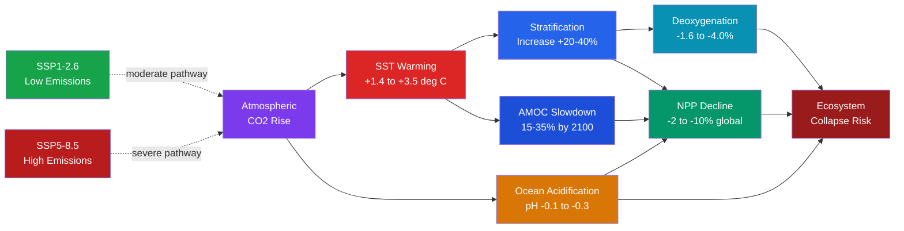

# Future Ocean Climate Projections

> [!abstract] TL;DR
> By 2100, CMIP6 multi-model ensembles project a global ocean that is warmer (+1.4 to +3.5°C SST), more stratified (+20–40% upper-ocean buoyancy frequency), more acidic (surface pH decline of 0.1–0.3 units), and substantially deoxygenated (global dissolved oxygen inventory −1.6 to −4.0%) relative to the late 20th-century baseline — the precise magnitude depending critically on which greenhouse-gas emission pathway humanity follows. Net primary production is projected to fall 2–10% globally, driven by nutrient starvation beneath a strengthening pycnocline, with tropical and subtropical oceans bearing the largest declines. The Atlantic Meridional Overturning Circulation (AMOC) is projected to weaken 15–35% by 2100, amplifying regional warming disparities and disrupting nutrient recycling. Several tipping points — most urgently the functional collapse of tropical coral reef ecosystems above +1.5°C — are now considered high-confidence outcomes under moderate and high emission scenarios.

---

## Intuition

**Analogy:** Projecting the future ocean is like predicting how a pot of soup will change when you slowly turn up the heat. The surface layer warms and floats above the cooler base — the soup stratifies, just as you see in a heated pot before you stir it. Nutrients that were once stirred up from depth now stay locked below the heated lid, so the surface broth becomes thin and depleted: primary producers starve. Meanwhile, you are dissolving CO₂ into the soup as you cook (like carbonating a drink), gradually acidifying the broth and dissolving the shells of anything that lives in it. In the background, the slow convective column that drives circulation — the soup's "stirring mechanism" — weakens as the density contrast that powered it erodes. And the pot has enormous thermal inertia: changes set in motion today will play out over centuries even if you turn the heat off tomorrow.

Technically, CMIP6 Earth System Models (ESMs) couple the ocean, atmosphere, land, and sea ice into a common simulation framework and are run under Shared Socioeconomic Pathway (SSP) emission scenarios. The ocean response to CO₂ forcing is governed by four compound stressors — warming, stratification, acidification, and deoxygenation — that interact non-linearly and are projected with different confidence levels. High-emission scenarios (SSP5-8.5) push several ocean subsystems beyond the regime of projected recovery on human timescales, triggering tipping-point behaviours that CMIP6 ensembles can identify in probability but cannot precisely time.

---

## How It Works

### Core Mechanics

**1. Sea-surface temperature and ocean heat uptake.**
Global mean SST is projected to increase +1.4°C (SSP1-2.6) to +3.5°C (SSP5-8.5) by 2100 relative to the 1995–2014 CMIP6 baseline. The ocean absorbs ~93% of the excess energy added to the Earth system by greenhouse forcing. Upper-ocean heat content (0–700 m) has already increased by ~14 × 10²² J over 1970–2020 (IPCC AR6). SST change is regionally heterogeneous: the tropical Atlantic and Indo-Pacific warm faster than the global mean, while the subpolar North Atlantic shows a warming "hole" tied to AMOC weakening. The Southern Ocean warms more slowly than the global average owing to its large heat capacity and upwelling of cold deep water.

**2. Upper-ocean stratification increase.**
Thermal expansion of the surface layer increases the squared buoyancy frequency (N²):

$$N^2 = -\frac{g}{\rho_0}\frac{\partial \rho}{\partial z}$$

CMIP6 projects a 20–40% increase in N² averaged over 0–200 m by 2100 under SSP5-8.5. This sharpened pycnocline suppresses vertical mixing, reducing the upward flux of cold, nutrient-rich water from below the thermocline. In the subtropical gyres — already nutrient deserts — the mixed layer deepens less in winter, further restricting the seasonal nutrient replenishment that supports phytoplankton blooms. Polar oceans (especially the Arctic) show particularly large stratification increases as freshwater input from sea-ice melt and precipitation adds a strong halocline on top of the thermocline.

**3. Net primary production changes.**
The competing effects of stratification (nutrient limitation), warming (faster metabolism but also increased stratification), and CO₂ fertilization (modest for most marine phytoplankton) net out to a projected global NPP decline of 2–10% by 2100 (Bopp et al. 2013; Kwiatkowski et al. 2020). This global average conceals strong regional asymmetry:

| Region | Projected NPP change (SSP5-8.5) | Dominant driver |
|--------|--------------------------------|-----------------|
| Tropical/subtropical gyres | −10 to −20% | Increased stratification → nutrient limitation |
| Equatorial upwelling zones | −5 to −15% | SST rise reducing productivity; stratification |
| Temperate Northern Hemisphere | −5 to +5% | Mixed: poleward shift of productive zones |
| Sub-Arctic and Arctic | +10 to +30% | Sea-ice retreat opens new productive waters |
| Southern Ocean | −2 to +5% | Uncertain; wind-driven mixing vs warming |

The poleward expansion of subtropical gyres (already observed via ocean-color satellites) will progressively reduce the area of productive mid-latitude waters.

**4. Ocean deoxygenation.**
Warming reduces O₂ solubility (~2% per °C, Weiss equation), and increased stratification suppresses ventilation — both driving oxygen decline throughout the water column. Bopp et al. (2013) synthesised CMIP5 projections (consistent with CMIP6 updates) estimating a global dissolved O₂ inventory decline of −1.6% (SSP1-2.6) to −4.0% (SSP5-8.5) by 2100. Oxygen minimum zones (OMZs) are projected to expand in volume by 7–15% under SSP5-8.5. The tropical thermocline, already the most hypoxic open-ocean zone, will see the most severe deoxygenation. This threatens aerobic organisms throughout the mesopelagic layer and reduces the habitat for large fish that avoid hypoxic waters.

**5. Ocean acidification.**
Surface ocean pH has already fallen by ~0.1 units since the pre-industrial era (from 8.21 to ~8.10), a 26% increase in [H⁺]. CMIP6 projects further declines of:
- **−0.1 pH units** by 2100 under SSP1-2.6 (total −0.2 from pre-industrial; remaining below +2°C)
- **−0.3 pH units** by 2100 under SSP5-8.5 (total −0.4 from pre-industrial; unprecedented in 56 million years)

The Southern Ocean and Arctic will experience aragonite undersaturation (Ω_arag < 1) within decades under moderate emissions, threatening pteropods, cold-water corals, and shell-forming organisms at the base of polar food webs.

**6. AMOC slowdown.**
CMIP6 models project AMOC weakening of 15–35% by 2100 under SSP5-8.5, driven by: (a) surface freshening from Greenland and Arctic sea-ice melt reducing the salinity-driven component of deep convection; and (b) surface warming reducing the density contrast between tropical and polar surface water. No CMIP6 model produces a complete AMOC collapse within the 21st century, but Stommel-type bistability implies models may systematically underestimate collapse risk. AMOC weakening has cascading effects: reduced northward heat transport cooling Northern Europe relative to global mean; disruption of North Atlantic nutrient recycling; and a 20–30 cm sea-level rise along the US East Coast relative to the global mean due to reduced "pile-up" of water in the North Atlantic.

**7. Sea level rise.**
Total sea level rise by 2100 is projected at +0.4 m (SSP1-2.6) to +1.0 m (SSP5-8.5) in the IPCC AR6 likely range, with low-probability high-end scenarios reaching +1.5–2.0 m if marine ice sheet instabilities (West Antarctic Ice Sheet) are triggered. Ocean thermal expansion contributes ~30–40% of the total; mass loss from glaciers and ice sheets accounts for the remainder. Sea level rise is non-uniform: AMOC weakening increases rise along the US Atlantic coast; ice-sheet mass loss produces geodetically complex regional signals via gravitational and rotational effects.

**8. Tipping points and high-impact low-probability outcomes.**

| Tipping element | Threshold | Confidence | Impact |
|-----------------|-----------|------------|--------|
| Tropical coral reef ecosystem collapse | >1.5°C above pre-industrial | **High** — 90% of reefs at high risk by 2050 under SSP2-4.5 | Destruction of habitat for 25% of marine species; ~1 billion people losing coastal protection |
| Arctic summer sea-ice-free conditions | ~+1.5–2°C, possibly by 2050 | **Medium–high** | Albedo feedback amplifying Arctic warming; disruption of polar ecosystems and AMOC freshwater input |
| AMOC collapse | Freshwater hosing threshold ~0.1–0.3 Sv equivalent | **Low in 21st century but non-negligible** | Regional cooling (5–8°C) in NW Europe; drought in Sahel; sea-level rise on US East Coast; disruption of global monsoon systems |
| Southern Ocean carbon sink saturation | SSP5-8.5, ~2060–2080 | **Medium** | Accelerated atmospheric CO₂ rise; reduced effective carbon removal |
| Tipping cascade (Lenton et al. 2018) | Multiple elements triggering each other | **Low but rising** | AMOC → Greenland melt → further AMOC weakening; Amazon dieback → reduced moisture recycling; destabilisation at lower global temperatures than individual tipping points |

### Flow / Architecture



---

## Key Concepts / Details

### Secondary Level

- **The ocean will be warmer, more acidic, and have less oxygen by 2100 under all emission scenarios.** Even the lowest-emission pathway (SSP1-2.6) commits the ocean to multi-decadal changes already in the pipeline from past emissions, because the ocean absorbs heat and CO₂ with century-scale inertia.
- **Coral reefs are the most threatened large ecosystem.** Above +1.5°C of global warming, 90% of coral reefs are projected to experience annual bleaching conditions that exceed their recovery capacity. Above +2°C, functionally intact tropical coral reef ecosystems are expected to disappear globally, removing the habitat for roughly 25% of all marine species.
- **Fish will shift poleward.** As warm-water conditions expand, suitable habitat for many commercial fish species (cod, tuna, anchovy) will shift hundreds of kilometres toward the poles. Cheung et al. (2010) projected a median poleward shift of fish distributions of ~70 km per decade under high emissions, with tropical fisheries losing species richness while high-latitude fisheries temporarily gain.
- **Sea-level rise is uneven.** A 1-metre global average rise means 0.8 m in some places and 1.5 m in others, depending on local subsidence, gravitational effects of ice sheet melt, and AMOC weakening. Low-lying nations — Bangladesh, Pacific island states, the Maldives — face disproportionate exposure.
- **Carbon emissions today lock in ocean change for centuries.** Because of deep-ocean thermal inertia and the century-scale residence time of CO₂ in the atmosphere, the ocean will continue warming and acidifying for centuries after emissions cease. Choices made in the next two decades determine the long-term trajectory.

### Undergraduate Level

- **CMIP6 and SSP scenarios.** CMIP6 (Coupled Model Intercomparison Project Phase 6) coordinates simulations across ~30 ESMs from institutions worldwide, using standardised SSP-RCP forcing pathways: SSP1-2.6 (strong mitigation, ~2°C), SSP2-4.5 (intermediate), SSP3-7.0, and SSP5-8.5 (fossil-fuel intensive, ~4–5°C by 2100). Ocean projections span a wide range between models even at the same forcing level — "model spread" — which represents genuine scientific uncertainty in parameterisations of mixing, eddy activity, and biological feedbacks, not measurement error. Ensemble mean projections should be treated as the central estimate of a probability distribution, not a single prediction.
- **Detection-attribution framework.** Observed ocean changes (warming, deoxygenation, pH decline) are attributed to anthropogenic forcing by comparing observed trends against the distribution of natural variability in control runs and the distribution of forced trends in historical simulations. For global mean SST, surface pH, and upper-ocean heat content, the attribution signal now exceeds 5-sigma — effectively certain. For regional NPP trends and OMZ expansion, the signal-to-noise ratio is lower because internal variability (ENSO, PDO, NAO) is large relative to the forced trend on decadal timescales.
- **Compound risk index.** Individual stressors (warming, acidification, deoxygenation, NPP decline) rarely act in isolation on marine ecosystems. Compound risk indices (e.g., Mora et al. 2013; Lotze et al. 2019) assign numerical scores to each stressor at each grid point, weighted by organism sensitivity, and sum them. Tropical coral reef habitats receive the highest compound risk scores across all CMIP6 scenarios because they are simultaneously hit by the stressors they are most sensitive to: temperature (bleaching), acidification (dissolution of aragonite skeletons), and deoxygenation.
- **The SST warming-hole and AMOC fingerprint.** In the subpolar North Atlantic (50–65°N), CMIP6 models project slower warming — or even cooling — relative to surrounding oceans. This "warming hole" is an AMOC fingerprint: weakening overturning reduces northward heat transport, cooling the subpolar gyre. Satellite SST records since the 1980s already show this pattern. The warming hole provides observational evidence that AMOC weakening is already underway.
- **Overshoot scenarios and reversibility.** SSP1-2.6 involves temporary overshoot past 1.5°C before CDR (carbon dioxide removal) brings temperatures back down. However, ocean changes — especially acidification, deep-ocean deoxygenation, and sea-level rise from ice-sheet destabilisation — are not instantaneously reversible. An overshoot above +2°C even for a few decades may trigger coral bleaching that cannot recover within human timescales, regardless of subsequent cooling.

### Graduate Level

- **Ocean model resolution and eddy sensitivity.** Standard CMIP6 ocean models run at 0.5–1° horizontal resolution — "non-eddying" — and parameterise mesoscale eddy fluxes using the Gent-McWilliams (GM) scheme. Eddy-resolving (0.1°) ocean models demonstrate that GM parameterisation underestimates the eddy-driven component of Southern Ocean carbon uptake and the eddy-driven heat transport that moderates stratification. In eddying models, the projected stratification increase is 5–15% smaller than in non-eddying CMIP6 models, leading to more optimistic NPP projections. At the same time, western boundary current systems (Gulf Stream, Kuroshio) sharpen significantly in eddying models, affecting regional heat distribution and deep convection sites in ways that non-eddying models cannot capture. This resolution bias is a known systematic error in current CMIP6 projections.
- **Parametric uncertainty: mixing and gas exchange.** Upper-ocean mixing parameterisations (KPP, Mellor-Yamada) determine the depth of the mixed layer and therefore the rate of nutrient supply to the euphotic zone. A factor-of-2 uncertainty in vertical diffusivity translates into substantial uncertainty in projected NPP and deoxygenation trends. Gas exchange velocity parameterisation (Wanninkhof 2014 vs Nightingale et al. 2000) introduces a ~10% uncertainty in projected air-sea CO₂ flux, which compounds into a 0.02–0.03 pH unit uncertainty in projected surface acidification by 2100. These parametric uncertainties are quantified via perturbed-parameter ensembles (PPE) in models like HadGEM3-GC3.1 and are comparable in magnitude to the scenario uncertainty at mid-century.
- **Tipping element cascade (Lenton et al. 2019).** Lenton et al. identified nine major tipping elements — coupled components of the Earth system that can transition abruptly past a threshold — and argued that cross-tipping interactions create a risk of **cascading**: AMOC weakening reduces freshwater transport to the Labrador Sea, potentially affecting the formation of North Atlantic Deep Water; Greenland ice sheet melting adds freshwater to the North Atlantic, further weakening AMOC; Amazon deforestation reduces transpirational moisture recycling, potentially tipping parts of the Amazon to savanna, releasing carbon that accelerates warming. Importantly, cascades can be initiated at lower global temperatures (~2°C) than any individual tipping point threshold if the system is already near multiple tipping points simultaneously. This fundamentally changes the risk calculus: avoiding one tipping point is not sufficient if others are approached.
- **Deep uncertainty in AMOC collapse timing.** CMIP6 models do not collapse AMOC in the 21st century, yet the Stommel bistability framework and paleoclimate evidence (Younger Dryas) confirm that AMOC can collapse. The discrepancy may arise from: (a) insufficient freshwater forcing — CMIP6 models underestimate Greenland Ice Sheet mass loss rates compared to recent observations; (b) model biases in the mean AMOC state — models with a weaker mean AMOC may be closer to the tipping threshold; (c) multi-century committed freshwater forcing not yet captured in 21st-century runs. Ditlevsen & Ditlevsen (2023)'s critical-slowing-down analysis suggests AMOC may be closer to its tipping point than CMIP6 implies, though the methodology is contested. The IPCC AR6 assessed AMOC collapse as "unlikely but not ruled out" in the 21st century — a formulation that masks potentially enormous economic and humanitarian tail risk.
- **GFDL-ESM4, ACCESS-ESM1-5, and MPI-ESM1-2-HR biases.** GFDL-ESM4 tends to overestimate tropical Pacific NPP due to an overly strong biological pump, leading to an optimistic baseline NPP but similar fractional declines under forcing. ACCESS-ESM1-5 (used in Australian CMIP6 submissions) shows a cold bias in the Southern Ocean mixed layer depth, potentially underestimating Southern Ocean carbon uptake. MPI-ESM1-2-HR (high-resolution, 0.4° ocean) better captures North Atlantic deep-water formation variability, but its AMOC sensitivity to freshwater forcing may be underestimated because it lacks explicit Greenland melt parameterisation. Awareness of these model-specific biases is essential when interpreting ensemble statistics — a model with a strong bias in one component will skew the ensemble mean even with equal weighting.
- **Inverse ocean modelling for projection constraint.** Green's function methods and adjoint models can use observed present-day ocean property distributions (T, S, O₂, DIC, tracers) to constrain poorly known model parameters, thereby narrowing the spread of 2100 projections. For example, constraining CMIP6 models by their ability to reproduce observed 20th-century ocean heat uptake reduces the spread of projected 2100 SST warming by ~20% (Tokarska et al. 2020). Similarly, emergent constraints (statistical relationships between present-day observable diagnostics and future projections across CMIP6 models) have been identified for tropical NPP decline, equatorial Pacific stratification, and Southern Ocean CO₂ flux, offering a pathway to observationally-constrained probabilistic projections.

---

## Python Demo

```python
"""
Three-box ocean-atmosphere model for CMIP6-style projections (2020-2100).

Boxes:
  ATM  -- atmosphere: CO2 concentration (ppm), following SSP1-2.6 and SSP5-8.5
  SURF -- surface ocean (0-200 m): temperature anomaly, stratification, NPP anomaly
  DEEP -- deep ocean (200-3000 m): temperature anomaly (slow thermal inertia)

CO2 forcing follows CMIP6 SSP trajectory waypoints.
Surface warming uses a simple energy-balance equation with ocean thermal inertia.
Stratification increase is proportional to surface warming (thermal expansion).
NPP anomaly responds to stratification-driven nutrient limitation and direct warming effects.
"""

import numpy as np
import matplotlib.pyplot as plt
from scipy.interpolate import interp1d

# ── SSP CO2 trajectories (key waypoints, ppm) ────────────────────────────────
# Rounded from IPCC AR6 / RCMIP (Nicholls et al. 2020)
ssp_years  = np.array([2020, 2030, 2040, 2050, 2060, 2070, 2080, 2090, 2100])
co2_ssp126 = np.array([412,  430,  443,  447,  440,  430,  420,  410,  400])
co2_ssp585 = np.array([412,  448,  492,  543,  601,  660,  727,  795,  867])

years = np.arange(2020, 2101)
f126 = interp1d(ssp_years, co2_ssp126, kind='cubic')
f585 = interp1d(ssp_years, co2_ssp585, kind='cubic')
co2_126 = np.clip(f126(years), 380.0, 900.0)
co2_585 = f585(years)

# ── Model parameters ─────────────────────────────────────────────────────────
CO2_REF     = 412.0   # ppm  -- 2020 reference CO2
ECS         = 3.0     # K    -- equilibrium climate sensitivity per CO2 doubling
TAU_SURF    = 10.0    # yr   -- surface ocean thermal adjustment timescale
TAU_DEEP    = 250.0   # yr   -- deep ocean thermal adjustment timescale
KAPPA_SD    = 0.03    # yr-1 -- surface-to-deep heat exchange (scaled)

# Stratification: delta-N2 / N2_0 proportional to surface warming
ALPHA_STRAT = 0.045   # fractional increase in N2 per deg C of surface warming

# NPP response (net fractional change):
#   negative term: nutrient starvation beneath strengthened pycnocline
#   positive term: small thermal stimulation (high-latitude offsetting effect)
A_STRAT     = 0.22    # NPP loss per unit stratification increase
A_TEMP      = 0.004   # direct thermal benefit (globally minor)

# ── Three-box integration ─────────────────────────────────────────────────────
def run_model(co2_forcing):
    n = len(co2_forcing)
    T_surf = np.zeros(n)
    T_deep = np.zeros(n)
    strat  = np.zeros(n)
    npp    = np.zeros(n)

    for i in range(1, n):
        # Radiative forcing from CO2 (Myhre et al. 1998 formula)
        dF = 5.35 * np.log(co2_forcing[i] / CO2_REF)

        # Equilibrium surface temperature change
        dT_eq = ECS * dF / (5.35 * np.log(2.0))

        # Surface ocean temperature (Euler forward, 1-year step)
        T_surf[i] = (T_surf[i-1]
                     + (dT_eq - T_surf[i-1]) / TAU_SURF
                     - KAPPA_SD * (T_surf[i-1] - T_deep[i-1]))

        # Deep ocean temperature (slow lag)
        T_deep[i] = (T_deep[i-1]
                     + KAPPA_SD * (T_surf[i-1] - T_deep[i-1]) * TAU_SURF / TAU_DEEP)

        # Stratification anomaly (fractional increase in N2)
        strat[i] = ALPHA_STRAT * T_surf[i]

        # NPP anomaly (fraction of 2020 baseline)
        npp[i] = -A_STRAT * strat[i] + A_TEMP * T_surf[i]

    return T_surf, T_deep, strat, npp

T126, Td126, S126, N126 = run_model(co2_126)
T585, Td585, S585, N585 = run_model(co2_585)

# ── Summary table ─────────────────────────────────────────────────────────────
print("=" * 56)
print(f"{'Three-Box Model Projections at 2100':^56}")
print("=" * 56)
header = f"{'Variable':<34} {'SSP1-2.6':>9} {'SSP5-8.5':>11}"
print(header)
print("-" * 56)
rows = [
    ("Atmospheric CO2 (ppm)",         co2_126[-1],    co2_585[-1],    ".0f"),
    ("Surface warming (deg C)",        T126[-1],       T585[-1],       ".2f"),
    ("Deep ocean warming (deg C)",     Td126[-1],      Td585[-1],      ".2f"),
    ("Stratification increase (%)",    S126[-1]*100,   S585[-1]*100,   ".1f"),
    ("NPP anomaly (% of baseline)",    N126[-1]*100,   N585[-1]*100,   ".1f"),
]
for label, v126, v585, fmt in rows:
    print(f"{label:<34} {v126:>9{fmt}} {v585:>11{fmt}}")

# ── Plot ──────────────────────────────────────────────────────────────────────
fig, axes = plt.subplots(2, 2, figsize=(13, 9))
fig.suptitle(
    "Three-Box Ocean-Atmosphere Projections (2020-2100)\n"
    "SSP1-2.6 vs SSP5-8.5 (CMIP6-consistent forcing)",
    fontsize=13, fontweight='bold'
)

C126 = '#16a34a'
C585 = '#dc2626'
LW   = 2.2

# Panel 1: CO2 trajectories
ax = axes[0, 0]
ax.plot(years, co2_126, color=C126, lw=LW, label='SSP1-2.6')
ax.plot(years, co2_585, color=C585, lw=LW, label='SSP5-8.5')
ax.axhline(CO2_REF, ls='--', color='gray', lw=1, label=f'2020 baseline ({CO2_REF} ppm)')
ax.set_ylabel('CO2 (ppm)', fontsize=11)
ax.set_title('Atmospheric CO2 Forcing', fontsize=11)
ax.legend(fontsize=9)
ax.grid(True, alpha=0.3)

# Panel 2: Surface and deep warming
ax = axes[0, 1]
ax.plot(years, T126,  color=C126, lw=LW,       label='Surf SSP1-2.6')
ax.plot(years, T585,  color=C585, lw=LW,       label='Surf SSP5-8.5')
ax.plot(years, Td585, color=C585, lw=LW, ls=':', label='Deep SSP5-8.5')
ax.plot(years, Td126, color=C126, lw=LW, ls=':', label='Deep SSP1-2.6')
ax.axhline(0, ls='--', color='gray', lw=1)
ax.set_ylabel('Temperature anomaly (deg C)', fontsize=11)
ax.set_title('Surface and Deep Ocean Warming', fontsize=11)
ax.legend(fontsize=8)
ax.grid(True, alpha=0.3)

# Panel 3: Stratification
ax = axes[1, 0]
ax.plot(years, S126 * 100, color=C126, lw=LW, label='SSP1-2.6')
ax.plot(years, S585 * 100, color=C585, lw=LW, label='SSP5-8.5')
ax.axhline(0, ls='--', color='gray', lw=1)
ax.set_ylabel('N2 increase (% of 2020 baseline)', fontsize=11)
ax.set_title('Upper-Ocean Stratification Anomaly', fontsize=11)
ax.legend(fontsize=9)
ax.grid(True, alpha=0.3)

# Panel 4: NPP anomaly
ax = axes[1, 1]
ax.plot(years, N126 * 100, color=C126, lw=LW, label='SSP1-2.6')
ax.plot(years, N585 * 100, color=C585, lw=LW, label='SSP5-8.5')
ax.axhline(0, ls='--', color='gray', lw=1)
ax.fill_between(years, N585 * 100, 0.0,
                where=(np.array(N585) * 100 < 0),
                alpha=0.15, color=C585, label='NPP loss (SSP5-8.5)')
ax.fill_between(years, N126 * 100, 0.0,
                where=(np.array(N126) * 100 < 0),
                alpha=0.15, color=C126)
ax.set_ylabel('NPP anomaly (% of 2020 baseline)', fontsize=11)
ax.set_title('Net Primary Production Change', fontsize=11)
ax.legend(fontsize=9)
ax.grid(True, alpha=0.3)

for ax in axes.flat:
    ax.set_xlabel('Year', fontsize=10)

plt.tight_layout()
plt.savefig('future_ocean_projections_3box.png', dpi=150)
plt.show()
print("\nFigure saved to future_ocean_projections_3box.png")
```

---

## Real-World Notes

**IPCC SROCC (2019) — first dedicated ocean and cryosphere assessment.** The Special Report on the Ocean and Cryosphere in a Changing Climate (SROCC) by the IPCC, published September 2019, was the first comprehensive IPCC report devoted entirely to the ocean and cryosphere. It synthesised ~7,000 cited papers and concluded with high confidence that the ocean has warmed, deoxygenated, and acidified since the mid-20th century, and that these trends will intensify under all emission scenarios. SROCC introduced the concept of "compound risks" to marine ecosystems — the simultaneous exposure to multiple stressors that interact non-linearly — as a primary framework for assessing ocean change through 2100. IPCC AR6 (2021, Working Group I, Chapter 9) updated and extended these ocean projections with CMIP6 models.

**CMIP6/OMIP-2 ocean intercomparison.** The Ocean Model Intercomparison Project Phase 2 (OMIP-2) ran CMIP6-era ocean-ice models under a common atmospheric forcing dataset (JRA55-do reanalysis), enabling diagnosis of model biases in isolation from atmospheric coupling. OMIP-2 revealed systematic biases in Southern Ocean stratification, North Atlantic convection depth, and equatorial Pacific biological production that propagate into future projections. The intercomparison identified that models agreeing best with observed 20th-century ocean heat uptake tend to project less warming by 2100, providing an emergent constraint on projection spread.

**GFDL-ESM4 tropical Pacific fisheries projection.** The GFDL ESM4 model (one of the highest-rated CMIP6 models for ocean biogeochemistry) projects a 25% reduction in tropical Pacific net primary production by 2100 under SSP5-8.5, driven by intensified stratification reducing nutrient supply to the surface euphotic zone. Since phytoplankton production underpins the entire marine food web, a 25% NPP reduction translates into substantial fisheries yield declines for tuna and related apex predators that depend on tropical Pacific productivity, with severe implications for food security across Pacific Island nations.

**Cheung et al. (2010, 2016) — fisheries redistribution.** Using species distribution models coupled to CMIP3 (2010) and CMIP5 (2016) projections, Cheung et al. found that maximum catch potential will shift poleward by ~70 km per decade under high emissions, with tropical regions (60°S–30°N) losing 10–40% of their maximum sustainable yield by the mid-21st century while high-latitude fisheries temporarily gain. By 2100, more than 70% of commercial fish species are projected to have shifted their distributions beyond current national exclusive economic zones, creating enormous governance challenges.

**Lotze et al. (2019) — compound risks to marine biodiversity.** Lotze et al. assembled a comprehensive global database of marine species responses to individual stressors, then computed compound vulnerability scores under CMIP5 SSP scenarios. They found that 46% of marine species face high compound climate risk by 2100 under high emissions, concentrated in tropical and subtropical ecosystems. Critically, the compound risk score grew super-linearly with the number of stressors acting simultaneously — two moderate stressors imposed together produced greater biodiversity loss than the sum of their individual effects, confirming that non-linear interactions amplify ecosystem impacts beyond what single-stressor models predict.

---

## Common Pitfalls

- **Assuming all ocean regions respond similarly** — Projected changes vary enormously by region. Tropical and subtropical oceans will see the greatest NPP declines (−10 to −20%) driven by stratification-induced nutrient starvation, while high-latitude oceans (Arctic, sub-Antarctic) experience NPP increases as sea-ice retreat opens new productive waters. Deep-water formation regions (Labrador Sea, Weddell Sea) are uniquely vulnerable to small freshwater perturbations. Applying global mean statistics to any specific marine ecosystem management decision will systematically misrepresent local exposure.

- **Treating the CMIP6 ensemble mean as the "truth"** — The multi-model ensemble mean smooths out model-specific structural differences and produces an answer that no single model actually simulates. The ensemble spread represents real physical uncertainty, not random noise. For tail-risk decisions — such as whether AMOC crosses a tipping threshold or whether Arctic summer sea ice disappears before 2050 — the tails of the distribution matter more than the mean. Equally, known systematic biases (cold Southern Ocean, non-eddying dynamics, insufficient Greenland melt forcing) may coherently shift the entire ensemble in a direction that is still wrong.

- **Ignoring overshoot scenarios and non-linear tipping dynamics** — SSP1-2.6 is sometimes described as a "safe" scenario because it stays near 1.5–2°C, but it typically involves a temperature overshoot above 1.5°C for decades before CDR deployment brings temperatures back down. Ocean systems with slow recovery timescales — coral reef ecosystems, AMOC state, deep-ocean oxygen content — do not recover synchronously with atmospheric CO₂ drawdown. An overshoot that triggers coral bleaching or begins to push AMOC toward its tipping threshold may cause committed change that persists for centuries even after atmospheric CO₂ is reduced, making "peak and decline" scenarios less safe than their temperature headline suggests.

---

## Related Concepts

**Same vault — 06_Ocean_and_Climate (planned sister notes):**
- [[Ocean_Heat_Content_and_Marine_Heatwaves]] — the observational foundation for ocean warming projections; marine heatwaves are the extreme-event expression of the mean SST rise projected here
- [[Sea_Level_Rise_and_Ocean_Mass_Change]] — thermosteric and mass contributions to projected sea-level rise; connects to AMOC-driven regional sea-level signals
- [[Ocean_Acidification]] — the chemistry and ecological consequences of the pH decline projected under SSP scenarios; detailed carbonate system mechanics underlying the projections summarised here
- [[Arctic_and_Antarctic_Oceans]] — the polar ocean systems most sensitive to AMOC slowdown, stratification increase, and ice-melt feedbacks; the source regions for freshwater forcing on AMOC
- [[_MOC_Ocean_and_Climate]] — section map for all Ocean and Climate notes in this vault

**Same vault — other sections:**
- [[Thermohaline_Circulation_and_AMOC]] — AMOC mechanics and Stommel bistability underlying the AMOC slowdown projections; paleoclimate analogue for collapse from the Younger Dryas
- [[Density_Stratification_and_Mixing]] — the physical oceanographic basis for stratification increase projections; buoyancy frequency and pycnocline dynamics governing nutrient supply
- [[Dissolved_Oxygen_and_Redox_Chemistry]] — oxygen minimum zone formation and AOU; the deoxygenation projections here build directly on this dissolved-oxygen framework
- [[The_Oceanic_Carbon_Cycle]] — Revelle factor evolution and CMIP6 carbon-cycle feedbacks (beta and gamma) that determine how the ocean sink fraction changes under SSP scenarios
- [[Marine_Primary_Production_and_Phytoplankton]] — the biological foundation for NPP projections; phytoplankton community composition shifts under warming and acidification
- [[Coral_Reefs_and_Tropical_Marine_Ecosystems]] — the highest-confidence tipping-point ecosystem discussed in this note; bleaching thresholds and calcification responses to acidification
- [[Marine_Fisheries_and_Ocean_Resources]] — the socioeconomic consequences of NPP decline and poleward species redistribution projected here; Cheung et al. fisheries modelling
- [[The_Biological_Pump_and_Carbon_Export]] — how stratification-driven NPP changes alter the biological pump's efficiency and the ocean's capacity to sequester carbon at depth

**Cross-vault:**
- [[Anthropogenic_Climate_Change]] — the atmospheric forcing side of ocean projections; global carbon budget, emission scenarios, and climate sensitivity underlying SSP trajectories
- [[Climate_Models_and_Projections]] — CMIP6 architecture, model evaluation, and multi-model ensemble methodology applied throughout this note
- [[Climate_Sensitivity_and_Feedbacks]] — ECS and TCR values used in projection scaling; ocean carbon-cycle feedback decomposition (beta and gamma terms)
- [[Sea_Level_Rise_and_the_Cryosphere]] — cryospheric contributions to sea-level projections; marine ice sheet instability and low-probability high-impact tail scenarios
- [[_MOC_Meteorology_Master]] — entry point for the atmospheric climate system coupled to the ocean projections described here

---

## Review Questions

### Secondary Level

1. The ocean is projected to become both warmer and more stratified by 2100. Why does surface warming tend to reduce — rather than increase — biological productivity in tropical ocean regions?
2. Coral reefs are described as a "high-confidence" tipping point above +1.5°C. What does tipping point mean in this context, and why is recovery difficult even if warming is subsequently reversed?
3. A country's fishing industry relies on tuna that spawn in tropical Pacific waters. Under SSP5-8.5, what three ocean changes (from this note) would most directly threaten that fishery, and what adaptation might be possible?

### Undergraduate Level

4. CMIP6 projects both AMOC weakening and sea-level rise. Explain the mechanistic link between AMOC weakening and the additional sea-level rise experienced along the US East Coast, distinguishing this from the global thermosteric component.
5. The "compound risk" framework shows that multiple simultaneous stressors produce non-linear ecosystem impacts. Using dissolved oxygen, temperature, and pH as your three stressors, construct a mechanistic argument for why their combined effect on a coral reef fish population would exceed the sum of individual effects.
6. You are given CMIP6 model projections for 2100 SST from 25 ESMs. The ensemble mean is +2.8°C (SSP2-4.5) but the standard deviation is ±0.8°C. Discuss three reasons why the ensemble spread represents genuine physical uncertainty, and explain why simply averaging the ensemble to produce a "best estimate" is insufficient for marine ecosystem management decisions at the regional scale.

### Graduate Level

7. Lenton et al. (2019) argue that tipping cascades can be triggered at lower global temperatures than the threshold of any individual tipping element. Construct a physically plausible cascade chain starting with Greenland Ice Sheet melt, passing through AMOC weakening, and ending with impacts on the Amazon system and the global carbon cycle. At each step, identify the physical mechanism and the timescale of response.
8. GFDL-ESM4 runs at 0.5° ocean resolution while MOM6-based eddying experiments run at 0.1°. Explain two specific ways in which non-eddying CMIP6 models are likely to misrepresent (a) Southern Ocean carbon uptake and (b) North Atlantic deep-water formation and their respective effects on projected NPP and AMOC trends.
9. An emergent constraint approach uses the present-day observable relationship between a diagnostic (e.g., observed 20th-century ocean heat uptake) and a future projection metric (e.g., 2100 SST anomaly) across the CMIP6 ensemble. Describe the statistical methodology, explain why this constraint is only valid if the observable is physically linked to the projection metric through the same process, and identify one potential failure mode where the emergent constraint would give a biased answer.

---

## Sources

- [IPCC (2019) *Special Report on the Ocean and Cryosphere in a Changing Climate (SROCC)*. Cambridge University Press.](https://www.ipcc.ch/srocc/)
- [Bopp, L. et al. (2013) "Multiple stressors of ocean ecosystems in the 21st century: projections with CMIP5 models." *Biogeosciences*, 10, 6225–6245.](https://doi.org/10.5194/bg-10-6225-2013)
- [Kwiatkowski, L. et al. (2020) "Twenty-first century ocean warming, acidification, deoxygenation, and upper-ocean nutrient and primary production decline from CMIP6 model projections." *Biogeosciences*, 17, 3439–3470.](https://doi.org/10.5194/bg-17-3439-2020)
- [Cheung, W.W.L. et al. (2010) "Large-scale redistribution of maximum fisheries catch potential in the global ocean under climate change." *Global Change Biology*, 16, 24–35.](https://doi.org/10.1111/j.1365-2486.2009.01995.x)
- [Cheung, W.W.L. et al. (2016) "Large benefits to marine fisheries of meeting the 1.5°C global warming target." *Science*, 354, 1591–1594.](https://doi.org/10.1126/science.aag2331)
- [Lotze, H.K. et al. (2019) "Global ensemble projections reveal trophic amplification of ocean biomass declines with climate change." *Proceedings of the National Academy of Sciences*, 116(26), 12907–12912.](https://doi.org/10.1073/pnas.1900194116)
- [Lenton, T.M. et al. (2019) "Climate tipping points — too risky to bet against." *Nature*, 575, 592–595.](https://doi.org/10.1038/d41586-019-03595-0)
- [Fox-Kemper, B. et al. (2021) "Ocean, Cryosphere and Sea Level Change." In *IPCC AR6 WGI*, Chapter 9. Cambridge University Press.](https://www.ipcc.ch/report/ar6/wg1/chapter/chapter-9/)
- [Tokarska, K.B. et al. (2020) "Past warming trend constrains future warming in CMIP6 models." *Science Advances*, 6, eaaz9549.](https://doi.org/10.1126/sciadv.aaz9549)

---

#Oceanography #OceanClimate #OceanProjections #CMIP6 #ClimateChange
