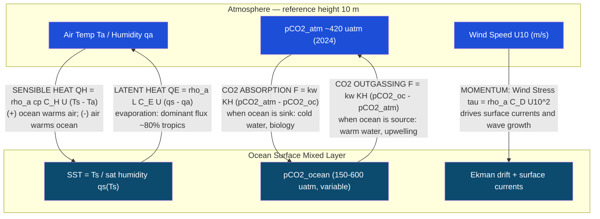

# Ocean-Atmosphere Exchange and Air-Sea Fluxes

> [!abstract] TL;DR
> The ocean-atmosphere interface is the engine of Earth's climate: momentum, sensible heat, latent heat, moisture, and trace gases (principally CO₂) are continuously exchanged across the millimetre-thin viscous sublayer at the sea surface. Bulk aerodynamic formulae — derived from Monin-Obukhov similarity theory — parameterise these fluxes in terms of wind speed and air-sea differences in temperature and humidity, using empirical transfer coefficients (C_H, C_E, C_D) calibrated by field programmes such as TOGA-COARE. CO₂ gas exchange is governed by the piston velocity k_w, which scales approximately as k_w = 0.31 u₁₀² (Wanninkhof 1992) in cm/hr, meaning doubling the wind speed quadruples the exchange rate. Together these fluxes determine whether the ocean is a CO₂ sink or source, drive the Hadley and Walker circulations via tropical latent heat release, and fuel tropical cyclone intensification when sea-surface temperatures exceed ~26°C.

---

## Intuition

**Analogy:** Think of the ocean surface as a two-way revolving door between two enormous reservoirs. On the ocean side: vast amounts of heat, water vapour, and dissolved CO₂ are queued to pass upward into the atmosphere. On the atmospheric side: wind-driven momentum and, depending on the season and location, sensible heat push back down. The rate at which the door spins is set by wind speed — a calm day means slow exchange; a gale means the door is spinning so fast that enormous quantities of latent heat, moisture, and CO₂ are hurled across in hours. The direction each substance moves is set by the gradient: heat flows from the warm side to the cool side, CO₂ moves from high partial pressure to low, and momentum is always delivered downward from the faster-moving atmosphere into the slower-moving ocean.

Technically: the interface is a viscous sublayer only millimetres thick. Turbulent eddies driven by wind shear bring warm, moist ocean surface water and cold, dry atmospheric air to within molecular-diffusion range of each other. The bulk formulas collapse the complexity of this turbulent boundary layer into three transfer coefficients — C_D (drag/momentum), C_H (sensible heat), and C_E (latent heat/moisture) — determined empirically via the COARE algorithm. The same momentum transfer that drives Ekman currents and gyres, the same latent heat release that feeds tropical convection and hurricanes, and the same gas exchange that makes the ocean absorb ~30% of anthropogenic CO₂ all stem from this one thin interface.

---

## How It Works

### Core Mechanics

**1. Bulk aerodynamic formulae.**

All four major air-sea flux components share the same structural form: a product of air density, a transfer coefficient, the reference-height wind speed, and the relevant air-sea difference.

**Sensible heat flux** (W m⁻²):

$$Q_H = \rho_a \, c_p \, C_H \, U_{10} \, (T_s - T_a)$$

- Q_H > 0: ocean warms the atmosphere (tropical / summertime)
- Q_H < 0: atmosphere warms the ocean (rare; e.g., cold maritime air over a warm current)
- Typical values: ±10 to ±150 W m⁻²

**Latent heat flux** (W m⁻²):

$$Q_E = \rho_a \, L_v \, C_E \, U_{10} \, (q_s - q_a)$$

where q_s is the saturation specific humidity at SST and q_a is the actual specific humidity at 10 m. Since SST generally exceeds the dew-point temperature of the overlying air, q_s > q_a almost everywhere and Q_E is nearly always positive (ocean evaporates into atmosphere).

- Typical tropics: Q_E ~ 100–200 W m⁻²; globally averaged ~90 W m⁻²
- Q_E dominates over Q_H in the tropics (~80% of total turbulent heat flux)

**Wind stress (momentum flux)** (N m⁻²):

$$\vec{\tau} = \rho_a \, C_D \, U_{10}^2 \, \hat{U}$$

where U_hat is the unit vector in the direction of the 10-m wind. Note that wind stress scales as U², not U — doubling wind speed quadruples momentum transfer. This stress drives Ekman transport, western boundary currents, and surface wave generation.

**Typical coefficient values** (neutral stability, 10 m reference; COARE 3.5 / Edson et al. 2013):

| Coefficient | Symbol | Typical value | Physical meaning |
|-------------|--------|--------------|------------------|
| Drag | C_D | 1.0–1.5 × 10⁻³ | Momentum transfer; rises with U (sea-state effect) |
| Stanton number | C_H | ~1.0–1.2 × 10⁻³ | Sensible heat exchange |
| Dalton number | C_E | ~1.1–1.3 × 10⁻³ | Latent heat / moisture exchange |

The Bowen ratio B = Q_H / Q_E gives the partitioning of turbulent heat loss:

$$B = \frac{c_p \, C_H \, \Delta T}{L_v \, C_E \, \Delta q} \approx \frac{c_p \, \Delta T}{L_v \, \Delta q}$$

B ~ 0.1–0.2 over tropical warm pools (latent dominant); B ~ 0.5–2 over sub-polar / winter oceans (sensible becomes comparable).

**2. CO₂ gas exchange: piston velocity.**

Air-sea CO₂ flux (mol m⁻² s⁻¹) is:

$$F_{CO_2} = k_w \, K_H \, (pCO_{2,ocean} - pCO_{2,atm})$$

where:
- k_w = gas transfer velocity ("piston velocity") in m s⁻¹
- K_H = CO₂ solubility (Henry's law constant) in mol m⁻³ atm⁻¹, strongly temperature-dependent
- Sign convention: F > 0 means ocean emits CO₂ (source); F < 0 means ocean absorbs CO₂ (sink)

**Wanninkhof (1992) quadratic parameterisation:**

$$k_w = 0.31 \, u_{10}^2 \left(\frac{Sc}{660}\right)^{-1/2} \quad \text{[cm hr}^{-1}\text{]}$$

where Sc is the Schmidt number (Sc = ν/D, kinematic viscosity / molecular diffusivity of CO₂ in seawater). The reference Sc = 660 is for CO₂ at 20°C in seawater. At 25°C, Sc(CO₂) ≈ 600. The Schmidt number scaling:

$$k_w(\text{gas}) = k_w(\text{CO}_2, \text{ref}) \times \left(\frac{Sc(\text{gas})}{660}\right)^{-n}$$

with n = 0.5 under breaking-wave (high-wind) conditions and n = 2/3 for a smooth molecular surface. The exponent matters at low wind speeds.

**Why quadratic?** Higher wind → more turbulence at the surface → thinner viscous sublayer → faster diffusion across the interface. The quadratic scaling arises because both the turbulence intensity and the surface renewal rate scale with wind speed squared.

**Wanninkhof (2014) update:** Global best-fit gives k_w = 0.251 u₁₀² (cm hr⁻¹), slightly lower than the 1992 value, recalibrated using global ocean ¹⁴C inventories and dual tracer (³He/SF₆) measurements.

**3. Monin-Obukhov similarity theory (MOST).**

The bulk coefficients C_H, C_E, C_D are not truly constant — they depend on atmospheric stability via the Obukhov length L:

$$L = \frac{-u_*^3 \, \bar{T}_v}{\kappa \, g \, \overline{w'T_v'}}$$

where u* is friction velocity, T_v is virtual temperature, κ = 0.40 is the von Kármán constant, and g is gravity. Under unstable conditions (warm ocean heating the air: L < 0), turbulent mixing is enhanced and transfer coefficients increase; under stable conditions (cool ocean below warm air: L > 0), turbulence is suppressed and coefficients decrease. The COARE algorithm iteratively solves for u*, the stability parameter z/L, and corrected flux coefficients — essential for accurate flux estimates in the sub-tropics and polar regions where stability effects are large.

Additionally, COARE accounts for:
- **Cool-skin effect:** The ocean's radiative cooling creates a ~1 mm skin temperature ~0.2–0.3°C cooler than the bulk surface temperature (SST). This reduces Q_H and Q_E by a few percent but matters for accurate satellite SST interpretation.
- **Warm-layer effect:** Solar heating of the calm upper ocean (< 1 m) can raise near-surface temperature by 1–3°C under low-wind, high-insolation conditions (e.g., West Pacific Warm Pool), substantially enhancing evaporation.

**4. Tropical cyclone intensification.**

The critical air-sea flux positive feedback that drives hurricane intensification:

1. Warm SST (> 26°C) and deep warm mixed layer → large Q_E and Q_H → warm, moist air enters the storm's convective columns
2. Latent heat release in deep convection → lowers central pressure → increases wind speeds
3. Higher winds → larger τ, Q_E, Q_H → self-reinforcing intensification loop

**Rapid intensification** (RI): defined as ≥ 35 kt wind speed increase in 24 hours. Requires:
- SST > 26°C with a deep oceanic heat content (OHC > 50 kJ cm⁻²), so wind mixing does not bring up cold water quickly
- Low vertical wind shear in the atmosphere
- Pre-existing moist atmospheric column

**Cold wake effect:** As a tropical cyclone passes, wind mixing deepens the mixed layer and entrains cold thermocline water, cooling SST by 2–5°C behind the storm track. This cold wake reduces Q_E and Q_H, weakening subsequent intensification. Slow-moving storms entrain more cold water (longer dwell time over any surface patch), which can self-limit intensification — a key reason some slow-moving storms do not rapidly intensify despite initially warm SSTs.

### Flow / Architecture



---

## Key Concepts / Details

### Secondary Level

- **The ocean is the planet's latent heat engine.** Evaporation from the sea surface transfers roughly 430,000 km³ of water per year to the atmosphere, carrying an energy flux of ~90 W m⁻² globally averaged. This latent heat — released when the water vapour eventually condenses to form clouds and rain — drives nearly all tropical convection, including the Hadley cell, monsoons, and hurricanes. Remove ocean evaporation and rainfall collapses.

- **Wind creates currents as well as waves.** The wind stress τ = ρ_a C_D U₁₀² is not just a surface drag — it is the primary driver of the large-scale ocean circulation. The Ekman layer (upper 50–100 m) spirals with depth in response to wind stress, and the depth-integrated Ekman transport is proportional to τ. This is why trade winds piling up water in the tropical West Pacific and roaring forties driving the Southern Ocean gyre are ultimately traceable to air-sea momentum exchange at a 10 m reference height.

- **CO₂ flux depends on the temperature of the ocean, not just the amount of CO₂.** Cold water dissolves CO₂ far more readily than warm water (higher Henry's law solubility K_H at low temperatures). Polar seas and cold currents are net CO₂ sinks; warm tropical upwelling zones and warm currents are net CO₂ sources. If global ocean temperatures rise, the ocean takes up less CO₂ per unit pCO₂ gradient — a climate feedback that is already measurable.

- **Hurricanes literally eat the ocean.** A tropical cyclone extracts latent and sensible heat from the warm sea surface — analogous to a heat engine running between the ocean (hot reservoir) and the upper troposphere (cold reservoir). An average hurricane releases approximately 5–20 × 10¹³ W of latent heat — comparable to the global electricity generating capacity of humanity at any one time.

- **Even a thin film matters.** The viscous sublayer at the air-sea interface is only ~0.01–0.1 mm thick, yet it controls the exchange of CO₂, O₂, and other sparingly soluble gases. In this thin film, molecular diffusion is the rate-limiting step. Anything that thins or breaks this film — waves, turbulence, surfactants — directly controls the piston velocity and hence the ocean's capacity to absorb or emit gases.

### Undergraduate Level

- **Bulk formula derivation from MOST.** Monin-Obukhov similarity theory begins with the observation that in the atmospheric surface layer, the turbulent fluxes of momentum, heat, and moisture are approximately constant with height (the "constant-flux layer"). The mean profiles of wind speed u, potential temperature θ, and specific humidity q then take the form:

$$\frac{\partial \bar{u}}{\partial z} = \frac{u_*}{\kappa z} \phi_m(z/L), \qquad \frac{\partial \bar{\theta}}{\partial z} = \frac{\theta_*}{\kappa z} \phi_h(z/L)$$

where φ_m and φ_h are dimensionless stability functions (= 1 under neutral conditions, < 1 unstable, > 1 stable). Integrating from a roughness length z₀ to a reference height z_r = 10 m gives the familiar log-wind profile with stability corrections. The bulk transfer coefficients emerge naturally: C_D = [κ / (ln(z_r/z₀) − ψ_m(z_r/L))]², and C_H, C_E analogously. Under neutral stability and z_r = 10 m: C_D ~ (1.0–1.5) × 10⁻³ at moderate wind speeds (5–15 m/s). The key practical point: C_D increases with wind speed at high winds because the aerodynamic roughness of the sea surface (set by the height and sharpness of breaking waves) grows with U₁₀.

- **Bowen ratio and regional heat flux partitioning.** The Bowen ratio B = Q_H/Q_E ~ c_p ΔT / (L Δq) quantifies which turbulent heat flux dominates. Over the tropical West Pacific Warm Pool (SST ~ 29°C, SST-T_air ~ 1–2°C, high relative humidity ~85%): B ~ 0.05–0.10, so latent heat is 90–95% of the turbulent heat loss. Over the wintertime Labrador Sea (cold air over warm current, ΔT ~ 10–20°C, dry air): B ~ 0.5–1.5. This regional variation shapes where the ocean drives atmospheric convection (tropics, via latent heat) versus deep mixing and cyclogenesis (sub-polar, via sensible heat and buoyancy flux into AMOC).

- **CO₂ gas exchange: Schmidt number physics.** The Schmidt number Sc = ν_w / D_CO₂ (kinematic viscosity / molecular diffusivity in seawater) governs how quickly CO₂ molecules can diffuse across the viscous sublayer once turbulence delivers them to the surface. At 20°C and S=35: Sc(CO₂) = 660; at 25°C, Sc(CO₂) ≈ 600; at 5°C, Sc(CO₂) ≈ 1000. A higher Sc means slower molecular diffusion. The k_w scaling k_w ∝ Sc^(-n) captures this: colder, more viscous, higher-Sc water has lower gas exchange efficiency even at the same wind speed. For N₂O and CH₄, which have different Sc, the same k_w measurements made for CO₂ must be scaled accordingly before computing their fluxes.

- **North Atlantic as atmospheric heat source.** In winter, the North Atlantic (especially the Gulf Stream extension and the Labrador Sea) loses approximately 100–150 W m⁻² of heat to the atmosphere — predominantly as latent heat and sensible heat driven by cold continental air masses sweeping off North America over the warm ocean. This heat flux (integrated over the sub-polar North Atlantic) is comparable to the total poleward heat transport by the AMOC (~1.2 PW at 26°N) and is the primary reason why Northwest Europe is 10–15°C warmer than equivalent latitudes on the North American east coast. The same buoyancy loss drives winter deep convection, forming North Atlantic Deep Water and sustaining the AMOC.

- **TOGA-COARE: the field programme that built the bulk formula.** The Tropical Ocean-Global Atmosphere Coupled Ocean-Atmosphere Response Experiment (TOGA-COARE, 1992–1993) deployed research ships, aircraft, moorings, and drifters in the West Pacific Warm Pool to directly measure air-sea fluxes via eddy covariance, inertial dissipation, and bulk methods. The resulting dataset enabled Fairall et al. (1996, 2003) to develop and validate the COARE 3.0 bulk algorithm, which remains the standard for global ocean modelling and reanalyses. COARE is not just a formula — it includes iterative routines to converge on the Obukhov length, cool-skin corrections, and wave-state-dependent drag coefficients.

### Graduate Level

- **COARE algorithm versions and uncertainties.** COARE 2.6 (Fairall et al. 1996) established the basic structure. COARE 3.0 (Fairall et al. 2003) added: improved stability functions from stable BL theory, warm-layer parameterisation, and better treatment of the roughness Reynolds number transition. COARE 3.5 (Edson et al. 2013) incorporated direct covariance measurements from buoys and aircraft spanning wind speeds of 0–25 m/s, refining C_D at high winds (a 10% reduction relative to COARE 3.0 above 15 m/s). COARE 4.0 addresses sea-spray-mediated heat flux — at winds > 15 m/s, spray droplets ejected from breaking crests can carry significant additional sensible and latent heat (spray fluxes may equal or exceed the interfacial fluxes at U₁₀ > 20 m/s), which is critical for hurricane intensity prediction. Current uncertainty in global annual air-sea heat flux (from bulk formulas applied to ERA5 fields) is approximately ±10 W m⁻² in the mean, with larger regional errors.

- **Wave-coherent stress and the drag coefficient at high winds.** The bulk drag coefficient C_D is not a simple function of wind speed alone — it depends on wave age (cp/u*, where cp is the phase speed of dominant waves). For young, steep waves (e.g., in fetch-limited coastal seas), C_D is higher than for old, long swell. At very high wind speeds (hurricane-force, U₁₀ > 30 m/s), direct measurements from stepped-frequency microwave radiometers and GPS dropsondes reveal that C_D appears to level off or even decrease at extreme winds — a result attributed to the production of foam and sea spray that aerodynamically smooths the surface. The implication for hurricane models: they must cap the drag coefficient at extreme wind speeds to avoid over-predicting wind-induced mixing and cold wake formation.

- **Microscale wave breaking and gas transfer (Zappa et al.).** Zappa et al. (2004) showed using infrared imaging and active thermography that the gas transfer velocity k_w correlates more strongly with the rate of turbulent kinetic energy dissipation ε in the near-surface layer than with wind speed alone. Microscale wave breaking (short waves breaking without visible whitecapping at moderate winds) creates localized patches of enhanced surface renewal, accounting for 50–75% of the total gas transfer. This explains why k_w can be significantly elevated under conditions of moderate wind + strong surface cooling or swell-forced orbital motions even when whitecapping is absent. Parameterising k_w directly via near-surface turbulence (k_w = A ε^(1/4) ν^(1/4) Sc^(-1/2)) is physically more rigorous than the bulk wind-speed formula but requires subsurface turbulence measurements.

- **Eddy covariance vs inertial dissipation vs bulk: comparison of methods.** Three approaches for direct flux measurement at sea:
  (1) **Eddy covariance (direct):** simultaneously measures vertical wind fluctuations w' and scalar fluctuations θ', q', c' via fast-response sensors (sonic anemometers at 20 Hz, LI-COR CO₂ analysers). Flux = w'θ'_bar. Most accurate but requires ship motion correction and is sensitive to flow distortion.
  (2) **Inertial dissipation:** measures TKE dissipation rate ε from the inertial subrange of velocity spectra (assuming local isotropy), then recovers friction velocity u* via: ε = u*³/(κz)(1 + z/L). Less affected by ship motion; standard on UK RAPID/COARE cruises.
  (3) **Bulk formulae:** simplest, applicable to any platform with standard 10-m wind, SST, and air T/q measurements. Accuracy depends on transfer coefficient quality. Uncertainty in globally integrated ocean heat flux from bulk formulae is dominated by sparse polar observations and the warm-layer/cool-skin corrections.

- **k_w uncertainty and the global CO₂ budget.** The quadratic Wanninkhof k_w formula applied to wind fields and surface ocean pCO₂ observations gives a global ocean CO₂ uptake of ~2.5 GtC yr⁻¹. However, the coefficient in the quadratic formula (0.31 in the 1992 version, 0.251 in the 2014 revision) carries an uncertainty of ~±20%, propagating to a ~±0.4 GtC yr⁻¹ uncertainty in the global ocean sink — roughly 15% of the total. This matters for the global carbon budget. Southern Ocean winds are particularly important because that region contributes ~30–40% of global uptake, yet has the sparsest k_w calibration data (few ³He/SF₆ dual-tracer experiments at high latitudes). ERA5 and CCMP wind-field reanalysis biases in the Southern Ocean are an additional uncertainty source.

---

## Python Demo

```python
"""
Bulk aerodynamic air-sea flux demo.
Computes:
  (1) Sensible heat QH, latent heat QE, and wind stress tau
      vs SST-Tair difference and wind speed using bulk aerodynamic formulae.
  (2) CO2 air-sea gas exchange flux via Wanninkhof (1992) quadratic k_w
      vs pCO2 gradient and wind speed.
"""

import numpy as np
import matplotlib.pyplot as plt

# ── Physical constants ─────────────────────────────────────────────────────────
RHO_A = 1.225       # kg/m3  near-surface air density
CP    = 1004.5      # J/(kg K)  specific heat of dry air
L_E   = 2.44e6      # J/kg  latent heat of vaporisation at 25 C
P_ATM = 101325.0    # Pa  reference sea-level pressure
EPS   = 0.622       # ratio of molecular weights: water / dry air

# Bulk transfer coefficients (neutral stability, 10 m reference; COARE 3.5 typical)
C_H = 1.1e-3        # Stanton number  (sensible heat)
C_E = 1.1e-3        # Dalton number   (latent heat / moisture)
C_D = 1.2e-3        # drag coefficient (momentum)


def sat_vap_pressure(T_K):
    """
    Bolton (1980) saturation vapour pressure (Pa) at temperature T_K (kelvin).
    Accurate to ~0.1% for -30 to 35 C.
    """
    T_C = T_K - 273.15
    return 610.94 * np.exp(17.625 * T_C / (243.04 + T_C))


def spec_humidity(e_Pa, P_Pa=P_ATM):
    """Specific humidity (kg/kg) from vapour pressure e_Pa (Pa)."""
    return EPS * e_Pa / (P_Pa - (1.0 - EPS) * e_Pa)


# ── Part 1: Bulk fluxes vs delta_T and wind speed ─────────────────────────────
T_air_K  = 298.15       # K (25 C) baseline air temperature
RH_air   = 0.78         # relative humidity of air above sea surface
q_a      = spec_humidity(RH_air * sat_vap_pressure(T_air_K))

delta_T   = np.linspace(-5, 5, 300)    # SST - T_air  (K)
U_vals    = [3, 7, 12]                  # 10 m wind speeds (m/s)
colors    = ['#2563eb', '#16a34a', '#dc2626']

fig, axes = plt.subplots(1, 3, figsize=(15, 4.5))

for U, clr in zip(U_vals, colors):
    T_s = T_air_K + delta_T                        # SST array (K)
    q_s = spec_humidity(sat_vap_pressure(T_s))     # saturation q at SST

    Q_H = RHO_A * CP  * C_H * U * (T_s - T_air_K)  # sensible heat  (W/m2)
    Q_E = RHO_A * L_E * C_E * U * (q_s - q_a)       # latent heat    (W/m2)
    tau = RHO_A * C_D * U**2                          # wind stress    (N/m2; scalar)

    axes[0].plot(delta_T, Q_H, lw=2, color=clr, label=f'U = {U} m/s')
    axes[1].plot(delta_T, Q_E, lw=2, color=clr, label=f'U = {U} m/s')
    axes[2].axhline(tau, lw=2.5, color=clr,
                    label=f'U = {U} m/s -> tau = {tau:.4f} N/m2')

for ax in axes[:2]:
    ax.axhline(0, color='k', lw=0.8, ls='--')
    ax.set_xlabel('SST - T_air  (K)', fontsize=11)
    ax.legend(fontsize=9)
    ax.grid(True, alpha=0.3)

axes[0].set_ylabel('Q_H  (W/m2)', fontsize=11)
axes[0].set_title('Sensible Heat Flux\nQ_H = rho_a cp C_H U dT', fontsize=10)
axes[1].set_ylabel('Q_E  (W/m2)', fontsize=11)
axes[1].set_title('Latent Heat Flux\nQ_E = rho_a L C_E U dq (from dT)', fontsize=10)
axes[2].set_ylabel('tau  (N/m2)', fontsize=11)
axes[2].set_title('Wind Stress\ntau = rho_a C_D U^2  (independent of dT)', fontsize=10)
axes[2].set_xlabel('SST - T_air  (K)', fontsize=11)
axes[2].set_ylim(0, 0.25)
axes[2].legend(fontsize=9)
axes[2].grid(True, alpha=0.3)

plt.suptitle('Bulk Aerodynamic Air-Sea Fluxes  |  C_H = C_E = 1.1e-3, C_D = 1.2e-3',
             fontsize=12, y=1.02)
plt.tight_layout()
plt.savefig('airsea_bulk_fluxes.png', dpi=150)
plt.show()
print("Saved: airsea_bulk_fluxes.png")


# ── Part 2: CO2 flux using Wanninkhof (1992) ────────────────────────────────────
# k_w (cm/hr) = 0.31 * u10^2  (for CO2 at 20 C, Sc = 660 normalised)
# F = k_w * K_0 * delta_pCO2
# K_0 (Weiss 1974) at 20 C, S=35: ~3.97e-2 mol / (L atm)  = 39.7 mol / (m3 atm)

K0_mol_m3_atm = 3.97e-2 * 1000.0    # mol m-3 atm-1  (CO2 solubility at 20 C, S=35)

dpCO2_uatm  = np.linspace(-100, 100, 300)   # pCO2_ocean - pCO2_atm  (uatm)
dpCO2_atm   = dpCO2_uatm * 1.0e-6           # convert to atm

fig2, ax2 = plt.subplots(figsize=(8, 5))

for U, clr in zip(U_vals, colors):
    kw_cm_hr       = 0.31 * U**2               # cm/hr  (Wanninkhof 1992)
    kw_m_day       = kw_cm_hr * 24.0 / 100.0   # m/day
    # F (mol m-2 hr-1) = kw (m/hr) * K0 (mol m-3 atm-1) * dpCO2 (atm)
    # -> convert to mmol m-2 day-1
    F_mmol_m2_day  = kw_m_day * K0_mol_m3_atm * dpCO2_atm * 1000.0
    ax2.plot(dpCO2_uatm, F_mmol_m2_day, lw=2, color=clr,
             label=f'U = {U} m/s  (k_w = {kw_cm_hr:.1f} cm/hr)')

ax2.axhline(0, color='k', lw=0.8, ls='--')
ax2.axvline(0, color='k', lw=0.8, ls=':')
ax2.axvspan(-100, 0, alpha=0.06, color='#059669')
ax2.axvspan(0, 100, alpha=0.06, color='#dc2626')
ax2.text(-95, ax2.get_ylim()[1] * 0.85 if ax2.get_ylim()[1] > 0 else -28,
         'Ocean SINK\n(absorbs CO2)', color='#059669', fontsize=9)
ax2.text(5, 25, 'Ocean SOURCE\n(emits CO2)', color='#dc2626', fontsize=9)

ax2.set_xlim(-100, 100)
ax2.set_xlabel('delta_pCO2 = pCO2_ocean - pCO2_atm  (uatm)', fontsize=11)
ax2.set_ylabel('CO2 flux  (mmol m-2 day-1)', fontsize=11)
ax2.set_title('CO2 Air-Sea Gas Exchange  |  Wanninkhof (1992)\n'
              'k_w = 0.31 u10^2 cm/hr  (Sc=660 normalised,  K_0 at 20 C, S=35)',
              fontsize=11)
ax2.legend(fontsize=9)
ax2.grid(True, alpha=0.3)
plt.tight_layout()
plt.savefig('airsea_co2_flux.png', dpi=150)
plt.show()
print("Saved: airsea_co2_flux.png")

# ── Numerical check ─────────────────────────────────────────────────────────────
print("\nNumerical spot check (U=7 m/s, delta_T=+2 K, RH=0.78):")
U_check = 7.0
dT_check = 2.0
T_s_check = T_air_K + dT_check
q_s_check = spec_humidity(sat_vap_pressure(T_s_check))
QH_check = RHO_A * CP  * C_H * U_check * dT_check
QE_check = RHO_A * L_E * C_E * U_check * (q_s_check - q_a)
tau_check = RHO_A * C_D * U_check**2
print(f"  Q_H = {QH_check:.1f} W/m2  (sensible heat)")
print(f"  Q_E = {QE_check:.1f} W/m2  (latent heat)")
print(f"  tau = {tau_check:.4f} N/m2  (wind stress)")
print(f"  Bowen ratio B = Q_H / Q_E = {QH_check / QE_check:.3f}")

kw_check = 0.31 * U_check**2
print(f"\n  k_w (Wanninkhof 1992) at U=7 m/s: {kw_check:.1f} cm/hr")
print(f"  CO2 flux at dpCO2=+50 uatm, U=7 m/s:")
F_check = (kw_check * 24.0 / 100.0) * K0_mol_m3_atm * 50e-6 * 1000.0
print(f"    F = {F_check:.2f} mmol m-2 day-1  (positive = ocean emits)")
```

---

## Real-World Notes

**West Pacific Warm Pool: Earth's largest latent heat source.** The maritime continent and West Pacific Warm Pool (WPWP; SST > 28°C, extending from 60°E to 180°E at ±15° latitude) is the single largest source of latent heat flux to the atmosphere on Earth, averaging ~200 W m⁻² of evaporation. This concentrated heat input drives the ascending branch of the Walker Circulation, powers the Asian and Australian monsoons, and spawns the deep convective clusters (Madden-Julian Oscillation) that propagate eastward across the Pacific. TOGA-COARE (1992–93) was specifically located here to understand how the ocean fuels this convective engine.

**ITCZ and the Hadley cell.** The Intertropical Convergence Zone (ITCZ) marks the atmospheric convergence of trade winds from the northern and southern tropics. Beneath the ITCZ, sea-surface latent heat flux is the dominant energy source: SSTs of 26–29°C drive Q_E values of 150–250 W m⁻² that are released as latent heat in the towering convective columns of the ITCZ. This heats the tropical upper troposphere, drives the poleward upper-level outflow of the Hadley cell, and (via eddy fluxes) maintains the jet streams at ~30° latitude. The asymmetric position of the ITCZ (slightly north of the equator) is partly controlled by the cross-equatorial air-sea heat flux, which is itself linked to AMOC's northward transport of warm Atlantic water.

**Wintertime North Atlantic: buoyancy loss driving AMOC.** Each winter from November to April, cold, dry continental air from North America sweeps eastward over the Gulf Stream extension and Labrador Sea, extracting 100–200 W m⁻² of latent and sensible heat from the ocean surface. This enormous buoyancy loss (negative surface buoyancy flux from combined heat loss and salt concentration from sea ice) drives the deepest ocean convection on Earth, forming North Atlantic Deep Water (NADW) to depths of 1,000–3,000 m. The RAPID array at 26.5°N measures the resultant overturning at ~17 Sv. Critically, future reductions in this buoyancy loss (due to Arctic freshwater input and SST rise under climate change) are projected to weaken AMOC, altering the air-sea heat exchange and European climate.

**Drake Passage as a persistent CO₂ source.** The Southern Ocean is, on a basin-average basis, the world's largest ocean carbon sink (~0.9 GtC yr⁻¹). But the Drake Passage region and the Antarctic Divergence are persistent CO₂ sources: strong westerly winds drive upwelling of old, CO₂-rich Circumpolar Deep Water (CDW) to the surface, where pCO₂ can reach 450–500 μatm (versus ~420 μatm in the atmosphere in 2024). High k_w from the persistent 10–15 m/s Southern Ocean winds amplifies this outgassing. The net Southern Ocean sink arises because biological uptake in spring-summer and the subduction of winter water slightly outweigh this source term.

**Hurricane Patricia (2015) and rapid intensification.** On 23 October 2015, Hurricane Patricia intensified from Category 1 to Category 5 (maximum sustained winds 185 kt) in approximately 24 hours — the fastest intensification on record in the Western Hemisphere. SSTs in the Eastern Pacific were 29–31°C with a warm mixed layer depth > 80 m (OHC > 100 kJ cm⁻²), ensuring that wind mixing could not entrain cold subsurface water fast enough to suppress intensification. Eddy covariance measurements from research aircraft confirmed latent heat fluxes exceeding 1000 W m⁻² beneath the eyewall, fueling the convective chimneys that drove pressure to 872 hPa — the lowest ever recorded in the Western Hemisphere at that time.

---

## Common Pitfalls

- **Neglecting latent versus sensible heat partitioning by region.** A common mistake is applying a single bulk formula without noting that Q_E dominates in the tropics (Bowen ratio B ~ 0.1–0.2) while Q_H becomes comparable or dominant in winter high-latitude or polar regions (B ~ 0.5–2). In tropical cyclone energetics, essentially all the surface heat input is latent heat — sensible heat is almost irrelevant. In contrast, polar deep convection and AMOC forcing are critically sensitive to Q_H and buoyancy flux. Mixing these up leads to wrong physical intuitions about what drives circulation in each regime.

- **Assuming k_w scales linearly with wind speed.** The Wanninkhof quadratic formula k_w = 0.31 u₁₀² means gas exchange is a nonlinear function of wind speed. A common error is to use a linear fit k_w = a·u₁₀ (valid for the smooth-film regime only at very low winds, < 3 m/s). At moderate and high winds, the quadratic term dominates, meaning that occasional storms contribute disproportionately to the time-averaged k_w. When integrating global CO₂ flux using monthly-mean winds, one must apply the Jensen inequality correction (+~20% to the global flux) to account for the nonlinear averaging over the wind speed distribution.

- **Confusing the sign convention for pCO₂ gradient.** The flux F = k_w K_H (pCO₂_ocean − pCO₂_atm): when pCO₂_ocean > pCO₂_atm (ΔpCO₂ > 0), F > 0 and the ocean emits CO₂ (source). When pCO₂_ocean < pCO₂_atm (ΔpCO₂ < 0), F < 0 and the ocean absorbs CO₂ (sink). The sign is sometimes reversed in different papers — always check whether the stated gradient is ocean minus atmosphere or atmosphere minus ocean. Mixing this up converts a sink into a source in a global carbon budget.

- **Applying COARE bulk coefficients outside their calibrated range.** COARE 3.5 was validated primarily from open-ocean tropical and mid-latitude data in the wind speed range 0–25 m/s. At hurricane-force winds (> 25 m/s), the drag coefficient appears to saturate or decrease (due to foam and spray), and spray-mediated enthalpy fluxes may dominate. Blindly extrapolating the neutral C_D to 50 m/s overestimates wind stress and underestimates the enthalpy flux Ck/Cd ratio critical for hurricane intensification potential.

- **Ignoring the cool-skin and warm-layer corrections on SST.** The bulk formulas use SST as the ocean-side temperature, but "SST" means different things: the radiometric skin temperature (top 10–100 μm, measured by MODIS), the subskin temperature (top 1 mm), and the bulk mixed-layer temperature (top 5–10 m, measured by Argo floats or buoys). The cool skin is ~0.2–0.3°C cooler than bulk SST; the warm layer can be 0.5–3°C warmer under calm, sunny conditions. Using the wrong SST measure can produce 5–15% errors in Q_E and Q_H.

---

## Related Concepts

**Same vault (Oceanography):**
- [[The_Oceanic_Carbon_Cycle]] — the full framework of ocean carbon storage, DIC chemistry, and the Revelle factor; air-sea CO₂ flux (piston velocity × solubility × ΔpCO₂) is the top boundary condition of that system
- [[Thermohaline_Circulation_and_AMOC]] — buoyancy forcing that drives AMOC is primarily air-sea heat and freshwater flux; the wintertime North Atlantic sensible/latent heat loss quantified here is the proximate driver of North Atlantic Deep Water formation
- [[Turbulence_and_Diapycnal_Mixing]] — near-surface turbulence (set by wind stress and breaking waves) controls both the piston velocity k_w and the mixed-layer depth that determines how quickly cold water is entrained from below; the same TKE cascade governs both processes
- [[Wind_Driven_Circulation_and_Sverdrup_Balance]] — the wind stress τ computed by bulk formulas is the input to Sverdrup balance and Ekman pumping; quantifying τ accurately is the first step in computing gyre transports
- [[Ekman_Transport_and_Coastal_Upwelling]] — wind-stress curl (computed from τ = ρ_a C_D U²) drives Ekman pumping; coastal upwelling regions (California, Benguela, Peru) that bring cold, CO₂-rich water to the surface are strong CO₂ sources whose magnitude depends on both upwelling rate and the piston velocity
- [[Surface_Gravity_Waves]] — sea-state (wave age, wave height) modifies the roughness length z₀ and hence C_D; breaking waves also enhance k_w via surface-renewal and microscale wave breaking mechanisms
- [[The_Biological_Pump_and_Carbon_Export]] — the biological pump draws down surface pCO₂ by exporting organic carbon below the mixed layer; this pCO₂ reduction enhances air-sea CO₂ uptake (more negative ΔpCO₂) and is the dominant mechanism making the North Atlantic a CO₂ sink in spring/summer
- [[_MOC_Ocean_and_Climate|↑ Ocean and Climate MOC]] — section map for the Ocean and Climate section of this vault

**Cross-vault:**
- [[Global_Atmospheric_Circulation]] — the Hadley cell, Walker circulation, and trade winds are ultimately powered by the latent heat flux quantified here; the ITCZ location and intensity are directly controlled by the air-sea enthalpy exchange pattern
- [[Tropical_Cyclones_and_Hurricanes]] — the air-sea flux feedback (Q_E + Q_H → convection → intensification → higher winds → more flux) is the core physics of hurricane formation and rapid intensification; cold-wake SST cooling is the primary negative feedback limiting intensification
- [[Ocean_Atmosphere_Coupling_and_ENSO]] — El Niño/La Niña modulate the Walker circulation, trade winds, and hence both τ and Q_E patterns across the tropical Pacific; during El Niño, weakened trade winds reduce k_w and τ while warm ENSO SSTs alter the pCO₂ gradient, suppressing equatorial CO₂ outgassing
- [[Atmospheric_Boundary_Layer]] — Monin-Obukhov similarity theory used here to derive the bulk transfer coefficients is the same theory that governs the entire diurnal ABL cycle; the marine ABL is perpetually in near-neutral to slightly unstable state (driven by ocean heat flux) making it more tractable than the land ABL
- [[Laws_of_Thermodynamics]] — the first law governs the enthalpy (Q_H + Q_E) budget of the ocean surface; latent heat release in the atmosphere is simply the first-law conversion of moisture enthalpy to sensible heat during condensation; Carnot efficiency arguments bound hurricane intensity (maximum potential intensity theory)
- [[Fluid_Statics_and_Properties]] — density, viscosity, and specific heat of seawater (set by temperature and salinity) enter the bulk formulas directly; viscosity controls the Schmidt number and hence k_w scaling
- [[_MOC_Meteorology_Master]] — entry point for atmospheric boundary layer, tropical cyclones, climate variability, and the atmospheric side of the air-sea coupling described here
- [[_MOC_Physics_Master]] — entry point for fluid mechanics, thermodynamics, and turbulence theory underlying MOST and the bulk formula derivation

---

## Review Questions

### Secondary Level

1. A ship's meteorologist measures an SST of 28°C and an air temperature of 26°C at 10 m height, with a 10 m/s wind. Without calculating exact numbers, predict: (a) the sign of Q_H; (b) the sign of Q_E; (c) which is larger in magnitude and why; (d) how the wind stress compares to a 20 m/s scenario.

2. A tropical cyclone is over 28°C SST water with a mixed layer depth of only 30 m. Its twin is over 28°C SST water with a mixed layer depth of 100 m. All else being equal, which storm is more likely to rapidly intensify, and why? What role does the bulk formula play in your answer?

3. The equatorial Pacific near the Galapagos Islands has SST = 22°C and pCO₂_ocean = 480 μatm, while the nearby North Pacific sub-tropical gyre has SST = 26°C and pCO₂_ocean = 380 μatm. Using only the sign of ΔpCO₂, identify which region is a CO₂ source and which is a sink. What causes the lower pCO₂ in the gyre despite its warmer temperature?

### Undergraduate Level

4. Starting from the Monin-Obukhov similarity theory log-wind profile, derive the expression for the neutral drag coefficient C_D in terms of the von Kármán constant κ, the aerodynamic roughness length z₀, and the reference height z_r = 10 m. Explain why C_D increases with wind speed at high winds (hint: what happens to z₀ as wave height grows?).

5. The Wanninkhof (1992) formula gives k_w = 0.31 u₁₀² (cm/hr) for CO₂ at 20°C (Sc = 660). For CH₄ at 5°C, Sc(CH₄) ≈ 1200. (a) Write the Schmidt-number-corrected k_w for CH₄ assuming breaking-wave conditions (n = 0.5). (b) At U₁₀ = 10 m/s, compute k_w for CO₂ at 20°C and for CH₄ at 5°C. (c) Explain physically why higher Sc reduces gas transfer efficiency.

6. The Bowen ratio over the wintertime Labrador Sea is observed to be ~0.8. If Q_E = 120 W m⁻², estimate Q_H. Then use the bulk formulae to estimate what ΔT (= SST − T_air) and Δq would be needed to produce these fluxes at U₁₀ = 12 m/s. Comment on the sign and plausibility of ΔT given typical winter conditions.

### Graduate Level

7. In the COARE algorithm, the neutral 10-m drag coefficient C_D,N is corrected for stability via: C_D(z/L) = C_D,N / [1 − C_D,N^(1/2)/κ · ψ_m(z/L)]² where ψ_m is the stability function (ψ_m > 0 unstable, < 0 stable). Over the wintertime Southern Ocean (strong sensible heat loss, cold air over warmer ocean), is z/L positive or negative? Predict qualitatively how this correction changes C_D relative to its neutral value, and explain the physical reason (turbulence suppression or enhancement?). What are the implications for wind-stress-driven Ekman transport estimates?

8. The time-mean Wanninkhof k_w applied to monthly mean winds k_bar should be corrected to account for the nonlinear u₁₀² dependence: k_eff = 0.31 (u₁₀² + σ_u²) where σ_u² is the variance of wind speed. Over the Southern Ocean, σ_u ~ 4 m/s and mean u₁₀ ~ 9 m/s. (a) Compute k_eff/k(u_mean) — the fractional enhancement from neglecting wind speed variability. (b) Discuss what this implies for estimates of Southern Ocean CO₂ uptake computed from monthly ERA5 winds versus 6-hourly winds.

9. Zappa et al. (2004) found that k_w correlates better with near-surface turbulent dissipation ε than with U₁₀ alone. Suppose a parameterisation k_w = B ε^(1/4) ν^(1/4) Sc^(-1/2) is proposed (surface renewal model). Under identical U₁₀ = 8 m/s winds: Case A has calm swell (long organized waves, low ε from breaking); Case B has young wind waves and whitecapping (high ε). Compare k_w between the two cases and explain why the standard Wanninkhof formula, which only uses U₁₀, would give the same k_w for both. What observational evidence distinguishes the two scenarios, and why does this matter for coastal versus open-ocean CO₂ budgets?

---

## Sources

- [Fairall, C.W. et al. (2003). "Bulk parameterization of air–sea fluxes: Updates and verification for the COARE algorithm." *Journal of Climate*, 16(4), 571–591.](https://doi.org/10.1175/1520-0442(2003)016<0571:BPOASF>2.0.CO;2)
- [Edson, J.B. et al. (2013). "On the exchange of momentum over the open ocean." *Journal of Physical Oceanography*, 43(8), 1589–1610. (COARE 3.5)](https://doi.org/10.1175/JPO-D-12-0173.1)
- [Wanninkhof, R. (1992). "Relationship between wind speed and gas exchange over the ocean." *Journal of Geophysical Research: Oceans*, 97(C5), 7373–7382.](https://doi.org/10.1029/92JC00188)
- [Wanninkhof, R. (2014). "Relationship between wind speed and gas exchange over the ocean revisited." *Limnology and Oceanography: Methods*, 12, 351–362.](https://doi.org/10.4319/lom.2014.12.351)
- [Large, W.G. & Yeager, S.G. (2009). "The global climatology of an interannually varying air-sea flux data set." *Climate Dynamics*, 33, 341–364.](https://doi.org/10.1007/s00382-008-0441-3)
- [Zappa, C.J. et al. (2004). "Microbreaking and the enhancement of air-water transfer velocity." *Journal of Geophysical Research: Oceans*, 109, C08S16.](https://doi.org/10.1029/2003JC001897)
- [Hartmann, D.L. (2016). *Global Physical Climatology*, 2nd edition. Elsevier Academic Press. (Ch. 5: Air-sea interactions)](https://www.elsevier.com/books/global-physical-climatology/hartmann/978-0-12-328531-7)
- [Fairall, C.W. et al. (1996). "Cool-skin and warm-layer effects on sea surface temperature." *Journal of Geophysical Research: Oceans*, 101(C1), 1295–1308.](https://doi.org/10.1029/95JC03190)

---

#Oceanography #OceanClimate #AirSeaFlux #BulkFormula #GasExchange
