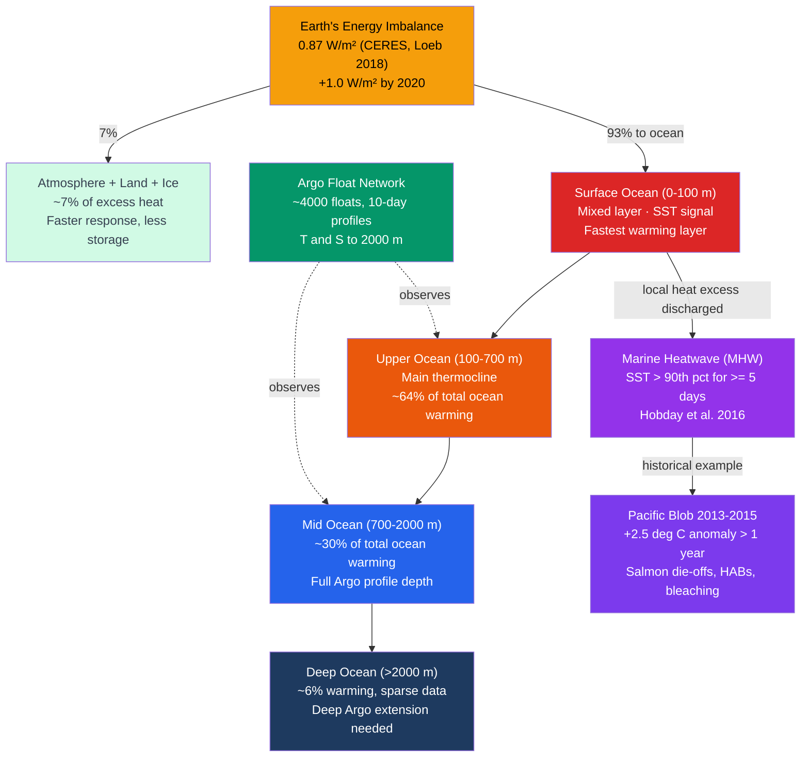

# Ocean Heat Content and Marine Heatwaves

> [!abstract] TL;DR
> The ocean has absorbed over **90% of the excess heat** from anthropogenic greenhouse warming since 1971, making **ocean heat content (OHC)** the most complete and stable measure of Earth's energy imbalance — the 0–700 m layer alone gains roughly **9 ZJ per year**, a rate that has accelerated since 2000. The **Argo float network** of ~4,000 profiling floats measuring temperature and salinity to 2,000 m every 10 days transformed our ability to track this heat storage globally, replacing sparse ship-based surveys with near-real-time global coverage. A **marine heatwave (MHW)** is a discrete extreme heating event defined by sea-surface temperature exceeding the 90th percentile climatological threshold for five or more consecutive days (Hobday et al. 2016), capable of bleaching coral reefs, collapsing kelp forests, and restructuring fish populations. The 2013–2015 **Pacific Blob** — a +2.5°C SST anomaly persisting for over a year across the Northeast Pacific — devastated salmon runs and triggered toxic algal blooms, and attribution science now shows that MHW frequency has increased ~34% since 1982 with direct fingerprints of anthropogenic forcing.

---

## Intuition

**Analogy:** The ocean is Earth's main heat battery. When greenhouse gases trap extra sunlight, over 90% of that extra energy flows into the ocean rather than immediately warming the air — like charging a massive battery rather than lighting a bulb. Checking ocean heat content is like reading the battery's charge gauge: it tells you the total accumulated warming that has been stored away, not just what is visible at the surface. A marine heatwave happens when the battery briefly discharges locally into the upper ocean, overheating a region for weeks to months in the same way a heat dome overheats a city — but because water stores energy far more densely than air, the ecological consequences per degree of warming are far more severe.

Technically: seawater has a specific heat capacity of ~3,850 J kg⁻¹ K⁻¹ and the ocean contains ~1.335 × 10²¹ kg of water, giving it a heat storage capacity roughly 1,000 times larger than the entire atmosphere. This means OHC integrates the climate forcing signal over years to decades, filtering out weather noise and making it a far more sensitive and statistically stable indicator of climate change than surface air temperature. When atmospheric circulation anomalies or ENSO transitions temporarily concentrate stored heat near the surface, sea-surface temperatures can spike dramatically over large regions — that constitutes a marine heatwave.

---

## How It Works

### Core Mechanics

**1. Ocean Heat Content formula.**

OHC is computed by integrating the temperature departure from a reference climatology over the water volume:

$$\text{OHC} = \rho_w \, c_p \iiint_V \bigl(T(x,y,z,t) - T_{\text{ref}}(x,y,z)\bigr)\, dV$$

where $\rho_w \approx 1025$ kg m⁻³ is mean seawater density, $c_p \approx 3850$ J kg⁻¹ K⁻¹ is specific heat capacity at constant pressure, and $T_{\text{ref}}$ is the climatological baseline temperature. Units are joules (J); global 0–700 m OHC is currently expressed in **zettajoules (ZJ = 10²¹ J)**.

**2. Global OHC trend and acceleration.**

Modern estimates based on Argo and historical hydrographic data (Cheng et al. 2022):

| Layer | Warming rate (ZJ/yr) | Notes |
|---|---|---|
| 0–700 m | ~9.0 ± 0.4 | Best constrained; full Argo coverage |
| 700–2000 m | ~4.1 ± 0.3 | Good Argo coverage since ~2010 |
| 2000 m+ | ~0.8 (lower bound) | Severely undersampled; deep Argo needed |
| **Total ocean** | **~14 ZJ/yr** | Rate ~50% higher since 2000 vs. pre-2000 |

The cumulative 0–700 m OHC gain since 1955 is approximately **400 ZJ** (von Schuckmann et al. 2023). For scale: 1 ZJ is enough energy to boil roughly 2.5 billion Olympic swimming pools.

**3. Earth's Energy Imbalance (EEI) and the ocean's role.**

The EEI quantifies the net power accumulating in the climate system as outgoing long-wave radiation falls short of absorbed solar radiation:

$$\text{EEI} = F_{\text{SW,in}} - F_{\text{LW,out}} \approx 0.87 \pm 0.12 \text{ W m}^{-2}$$

measured globally by CERES satellite radiometers (Loeb et al. 2018). The ocean absorbs **~93%** of this imbalance; the remainder warms land, melts ice, and heats the atmosphere. EEI is estimated to have roughly doubled from ~0.5 W m⁻² (early 2000s) to ~1.0 W m⁻² by 2020 (Loeb et al. 2021), driven by continued greenhouse gas forcing and a possible reduction in masking aerosol cooling from cleaner marine shipping fuels after 2016 IMO regulations.

**4. The Argo float network.**

Before Argo (~2000), global subsurface ocean temperature was measured almost entirely by expendable bathythermographs (XBTs) deployed from ships — sparse, biased toward shipping lanes, and limited to depths of ~400 m. Argo transformed this:

- **~4,000 floats** deployed across all ice-free ocean basins, operational from roughly 2007 onward
- Each float drifts at a **1,000 m parking depth** for 9 days, then descends to **2,000 m**, and ascends while measuring T and S at high vertical resolution
- Data transmitted via Iridium satellite on reaching the surface; freely available within 24 hours
- New programmes: **biogeochemical Argo** (BGC-Argo, measuring O₂, pH, nitrate, chlorophyll), **deep Argo** (profiling to 4,000–6,000 m)
- Vertical resolution: ~1–5 m near the surface, ~10 m in the thermocline

The float's buoyancy change is achieved by pumping fluid between an internal bladder and an external reservoir, changing the float's volume (and therefore its density) relative to the surrounding water — a purely mechanical system with no propulsion.

**5. Marine Heatwave definition (Hobday et al. 2016).**

A marine heatwave is defined relative to a **location-specific, day-of-year-specific** climatological threshold:

- **Threshold:** SST > 90th percentile of the daily SST distribution at that point in the annual cycle, computed over a 30-year baseline (currently 1982–2011 or 1991–2020)
- **Duration:** SST must exceed the threshold for **at least 5 consecutive days**; two events separated by ≤ 2 days are merged into a single event
- **Intensity** is measured as the anomaly above the threshold in multiples of the threshold-to-median spacing

Intensity categories (Hobday et al. 2018):

| Category | Name | Anomaly above 90th pct | Analogy |
|---|---|---|---|
| I | Moderate | 1–2× | Heat advisory |
| II | Strong | 2–3× | Heat warning |
| III | Severe | 3–4× | Extreme heat alert |
| IV | Extreme | >4× | Catastrophic |

**6. The 2013–2015 Pacific Blob.**

The Pacific Blob is the canonical high-impact MHW:

- **Trigger:** Anomalous atmospheric high-pressure ridge over the Gulf of Alaska in winter 2013–2014 suppressed winds, reduced evaporative cooling, and increased solar insolation at the surface
- **Peak anomaly:** +2.5°C above climatology over an area ~1,000 km in diameter in the Northeast Pacific; Category II–III
- **Duration:** >1 year — far beyond the typical MHW duration of a few weeks
- **Ecological impacts:** Collapse of Alaskan salmon runs (2015 was the worst on record for some stocks), mass toxic algal blooms (domoic acid from *Pseudo-nitzschia*) poisoning sea lions and seabirds, coral bleaching in Hawaiʻi, range expansions of warm-water species including thresher sharks into Alaskan waters
- **Attribution:** Probabilistic analysis showed the Blob was roughly 5× more likely under 2013 climate conditions than under pre-industrial forcing; a combination of natural atmospheric variability and a background anthropogenic warming signal were both necessary

**7. Long-term MHW trends and attribution.**

Global analysis of MHW trends 1982–2016 (Oliver et al. 2018):
- Frequency: **+34%** more events per year
- Duration: **+17%** longer per event
- Cumulative intensity: increased by ~54%

Under RCP8.5, tropical oceans are projected to be in a permanent MHW state by the 2060s (Oliver et al. 2019). The 2022–2023 North Atlantic anomaly — SST 1.0–1.5°C above the 1991–2020 climatology starting in May 2023 — produced the highest global SST anomaly on record at ~0.9°C above baseline, with possible contributing factors including ENSO transition, positive Atlantic Multidecadal Oscillation, reduced aerosol forcing, and reduced Saharan dust transport.

### Flow / Architecture



---

## Key Concepts / Details

### Secondary Level

- **The ocean is Earth's main heat sponge.** When we burn fossil fuels and trap more sunlight, over 90 out of every 100 units of that extra energy goes directly into the ocean — not into the air. This is why ocean temperatures are rising even though air temperatures fluctuate from year to year.
- **Oceans are warming everywhere, but unevenly.** The surface warms the fastest. Below 700 m it is slower, and the deep ocean (below 2,000 m) is barely warming yet — but it will over centuries. The North Atlantic and Southern Ocean are warming particularly fast.
- **Marine heatwaves are heat waves for fish.** Just as a land heat wave is a prolonged stretch of days much hotter than usual, a marine heatwave is a prolonged stretch where the sea is much warmer than usual. Corals bleach, kelp forests die, and fish swim toward the poles looking for cooler water.
- **The Pacific Blob killed salmon.** The 2013–2015 Pacific Blob warmed the Northeast Pacific by +2.5°C for over a year. Salmon depend on cold, prey-rich water; when the Blob reduced that prey and warmed the water, some salmon runs collapsed to record lows.
- **Argo floats are the ocean's weather station network.** Before ~2005, scientists had only sparse ship measurements. Argo floats dive and surface automatically every 10 days, sending back data that shows us the ocean's temperature globally in near real time.

### Undergraduate Level

- **OHC calculation from temperature profiles.** An Argo float gives a T(z) profile sampled at ~1–10 m intervals from 2,000 m to the surface. OHC for that profile (per unit area) is computed as $\int_0^{2000} \rho_w c_p (T(z) - T_{\text{ref}}(z))\, dz$ using numerical integration (e.g., trapezoid rule). Summing over all floats in a region and averaging over time gives a regional OHC estimate.
- **Argo float profiling mechanism.** The float controls its buoyancy by pumping oil between an internal reservoir and an external bladder. Pumping oil outward increases hull volume at constant mass, reducing average density below the surrounding water → float rises. Reversing the pump → float sinks. At the parking depth (1,000 m), pump is neutral and the float drifts with currents, mapping subsurface velocities as a secondary product.
- **EEI measurement by CERES.** The Clouds and the Earth's Radiant Energy System (CERES) instruments on Terra, Aqua, and NOAA-20 satellites measure incoming solar radiation and outgoing long-wave and reflected short-wave radiation globally. Net imbalance = shortwave absorbed − longwave emitted. Because CERES measures both atmosphere and surface, it captures the full planetary energy budget; the signal (~0.87 W/m²) is small relative to the ~340 W/m² background and requires careful cross-calibration between satellites (Loeb et al. 2018 *Nature Geoscience*).
- **MHW index and categories.** The Hobday (2016) method computes a 90th-percentile threshold for each day of the year using an 11-day window centred on that calendar day across all years in the baseline. This gives a seasonally varying threshold rather than a fixed temperature: the same absolute SST (e.g., 20°C) might be a heatwave in winter but not in summer. The category system (Hobday et al. 2018) then classifies events by how many multiples of the threshold anomaly (i.e., the distance between the 90th pct and the climatological median for that day) the SST exceeds.
- **Kelp forest collapse under MHW — California 2015.** Northern California's bull kelp (*Nereocystis luetkeana*) forests collapsed by >95% between 2014 and 2015. The MHW elevated water temperatures above the thermal tolerance of the kelp's microscopic gametophyte stage, preventing reproduction. Simultaneously, a sea star wasting disease epidemic eliminated the main predator of sea urchins (*Strongylocentrotus*); without sea stars, urchin populations exploded and "urchin barrens" replaced kelp forests across hundreds of kilometres of coastline. The dual shock (MHW + trophic disruption) represents a compound extreme event.
- **Harmful algal bloom (HAB) expansion.** MHWs favour cyanobacteria and harmful dinoflagellates by: (a) stratifying the water column (nutrient depletion at the surface), (b) raising temperatures above the optima of diatoms (the main prey of fish larvae), and (c) directly accelerating the growth of warm-adapted HAB species. The 2015 Pacific Blob-associated *Pseudo-nitzschia* bloom along the US West Coast produced domoic acid contamination from California to Alaska — one of the largest on record — closing shellfish harvests, poisoning sea lions, and killing hundreds of seabirds.

### Graduate Level

- **Deep ocean warming below 2,000 m and Deep Argo.** Standard Argo floats profile to 2,000 m, but ~50% of the total ocean volume lies below. Repeat hydrographic sections (GO-SHIP) show statistically significant warming below 2,000 m: ~0.002°C per decade averaged over the 2,000–6,000 m layer (Purkey & Johnson 2010), accounting for ~10–15% of full-water-column OHC gain. Deep Argo floats (profiling to 4,000–6,000 m) are being deployed but current global coverage remains <200 floats. Uncertainty in deep OHC is the dominant uncertainty in Earth's energy inventory closure.
- **OHC as a constraint on climate sensitivity (ECS).** Equilibrium climate sensitivity (ECS) — the equilibrium warming per CO₂ doubling — is constrained from below by OHC: if ECS is large but OHC uptake is moderate, the implied ocean heat uptake efficiency $\kappa = \text{OHC rate} / \text{forcing}$ must be anomalously high. Conversely, the ratio of observed global surface warming to accumulated OHC constrains the transient climate response. Otto et al. (2013) and Sherwood et al. (2020) use OHC records as a key observational constraint in probabilistic ECS assessments, with the Argo era substantially narrowing uncertainty (ECS 2.5–4.0°C, 66% range, IPCC AR6).
- **AMOC weakening and the North Atlantic cooling hole.** The North Atlantic subpolar gyre shows a relative cooling trend (a "warming hole") embedded in the overall warming signal. This is attributed to AMOC weakening reducing northward heat transport into the subpolar gyre, partially offsetting greenhouse warming in that region. Caesar et al. (2018) used this SST fingerprint to reconstruct AMOC variability to 1870. The cooling hole interacts with MHW climatology: the 2023 North Atlantic record SST anomaly occurred despite the cooling hole, suggesting a sudden shift in AMOC or circulation patterns superimposed on the longer trend.
- **MHW attribution: human influence vs. natural variability.** Event attribution (Stott et al. 2016 framework) applied to major MHWs finds: (a) global background warming increases the probability of any given MHW by 1.5–20× depending on the event; (b) some events (e.g., 2016 Great Barrier Reef bleaching event) were found "virtually impossible" without anthropogenic forcing; (c) the Pacific Blob specifically required both the natural atmospheric ridge anomaly AND the anthropogenic background warming — natural variability was necessary but not sufficient. Oliver et al. (2018) showed that 87% of present-day MHW days are attributable to anthropogenic forcing.
- **Compound extreme events: MHW + ocean acidification + deoxygenation.** A warmer upper ocean simultaneously worsens three stressors: (a) *Temperature stress* from MHW itself; (b) *Ocean acidification* — warmer water holds less CO₂ at equilibrium and also increases metabolic demand, deepening the aragonite saturation horizon; (c) *Deoxygenation* — warmer water holds less dissolved O₂, and enhanced stratification reduces ventilation of subsurface layers. Marine organisms under compound MHW + acidification + hypoxia stress show synergistic (super-additive) mortality in laboratory experiments for taxa including pteropods, oyster larvae, and juvenile salmon (Boyd et al. 2018). Projections suggest that compound events currently rare (once per 50 years) will occur every 3–5 years by 2100 under SSP5-8.5.

---

## Python Demo

```python
"""
Two-part ocean diagnostics demo.

PART 1: Compute 0-700 m Ocean Heat Content (OHC) from a synthetic
        temperature profile time series, remove the seasonal cycle,
        and plot the OHC anomaly with a linear trend and +/-1 sigma band.

PART 2: Identify Marine Heatwave (MHW) events from a synthetic SST
        time series using the Hobday et al. (2016) 90th-percentile,
        5-consecutive-day definition.
"""

import numpy as np
import matplotlib.pyplot as plt
from scipy.stats import linregress

# ============================================================
# PART 1: 0-700 m OHC from synthetic temperature profiles
# ============================================================

rho_w = 1025.0    # seawater density (kg m^-3)
cp_w  = 3850.0    # seawater specific heat capacity (J kg^-1 K^-1)
dz    = 10.0      # vertical resolution (m)
z     = np.arange(0, 700 + dz, dz)   # depth array, 71 levels

# Monthly time axis: Jan 2000 to Dec 2022 (276 months)
n_months = 276
t_years  = 2000.0 + np.arange(n_months) / 12.0

rng = np.random.default_rng(42)

# Background T profile: surface ~20 deg C, exponential decrease to ~2 deg C at 700 m
T_bg = 20.0 * np.exp(-z / 200.0) + 2.0       # shape (n_z,)

# Linear warming trend: surface-intensified (+0.3 deg C/decade at surface)
trend_rate = 0.03 * np.exp(-z / 300.0)        # deg C yr^-1, shape (n_z,)
T_trend    = trend_rate[:, None] * (t_years[None, :] - 2000.0)

# Seasonal cycle with depth-dependent amplitude and phase lag
seas_amp   = 1.5 * np.exp(-z / 100.0)
seas_phase = z / 100.0 * (np.pi / 6.0)
T_seas = seas_amp[:, None] * np.sin(2*np.pi*t_years[None, :] + seas_phase[:, None])

# Interannual noise: ENSO-like 4-yr signal + white noise
enso = 0.4 * np.sin(2*np.pi*t_years / 4.0)
T_noise = (0.2 * rng.standard_normal((len(z), n_months)) +
           enso[None, :] * np.exp(-z[:, None] / 150.0))

T = T_bg[:, None] + T_trend + T_seas + T_noise   # shape (n_z, n_months)

# Integrate vertically to get OHC per unit area (J m^-2)
OHC = rho_w * cp_w * np.trapz(T, z, axis=0)      # shape (n_months,)

# Remove climatological seasonal cycle (monthly mean over full record)
month_idx = np.arange(n_months) % 12
monthly_mean = np.array([OHC[month_idx == m].mean() for m in range(12)])
OHC_deseas   = OHC - monthly_mean[month_idx]

# OHC anomaly relative to 2000-2001 mean
OHC_anom = OHC_deseas - OHC_deseas[:24].mean()

# Linear trend
slope, intercept, r_val, p_val, se = linregress(t_years, OHC_anom)
trend_line = slope * t_years + intercept
sigma      = (OHC_anom - trend_line).std()

print("=== PART 1: OHC Trend ===")
print(f"Linear trend: {slope/1e8*10:.3f} x10^8 J m^-2 per decade")
print(f"R^2 = {r_val**2:.3f},  p-value = {p_val:.2e}")

# ============================================================
# PART 2: Marine Heatwave detection from synthetic daily SST
# ============================================================

n_days   = 14975   # approx 1982-01-01 to 2022-12-31
t_daily  = np.linspace(1982.0, 2023.0, n_days)

sst_trend    = 0.018 * (t_daily - 1982.0)
sst_seasonal = 2.5  * np.sin(2*np.pi*t_daily)
sst_enso     = 0.6  * np.sin(2*np.pi*t_daily / 3.8)
sst_noise    = 0.5  * rng.standard_normal(n_days)
SST = 20.0 + sst_trend + sst_seasonal + sst_enso + sst_noise

# 90th-percentile threshold from 1982-2011 baseline (scalar for simplicity)
baseline = SST[t_daily < 2012.0]
p90 = np.percentile(baseline, 90)

def find_mhw_events(above_thresh, min_duration=5, max_gap=2):
    """Return list of (start_idx, end_idx) for MHW events."""
    events = []
    in_event, start, gap = False, 0, 0
    for i, val in enumerate(above_thresh):
        if val:
            if not in_event:
                start, in_event = i, True
            gap = 0
        else:
            if in_event:
                gap += 1
                if gap > max_gap:
                    end = i - gap
                    if (end - start + 1) >= min_duration:
                        events.append((start, end))
                    in_event, gap = False, 0
    if in_event:
        end = n_days - 1
        if (end - start + 1) >= min_duration:
            events.append((start, end))
    return events

above = SST > p90
mhw_events = find_mhw_events(above)

print("\n=== PART 2: MHW Event Statistics ===")
print(f"90th percentile threshold: {p90:.2f} deg C")
print(f"Total MHW events (1982-2022): {len(mhw_events)}")
for d_start, d_end in [(1982,1992),(1992,2002),(2002,2012),(2012,2022)]:
    n = sum(1 for s, e in mhw_events if d_start <= t_daily[s] < d_end)
    print(f"  {d_start}-{d_end}: {n} events")

# ============================================================
# PLOTTING
# ============================================================

fig, (ax1, ax2) = plt.subplots(2, 1, figsize=(12, 9))

# Panel 1: OHC anomaly
ax1.fill_between(t_years,
                 (trend_line - sigma) / 1e8,
                 (trend_line + sigma) / 1e8,
                 alpha=0.25, color='#2563eb', label=r'$\pm1\sigma$ band')
ax1.plot(t_years, OHC_anom / 1e8, color='#94a3b8', lw=0.9, alpha=0.8,
         label='OHC anomaly (deseasonalised)')
ax1.plot(t_years, trend_line / 1e8, color='#dc2626', lw=2.5,
         label=f'Linear trend: {slope/1e8*10:.2f} x10^8 J m^-2 per decade')
ax1.set_xlabel('Year', fontsize=11)
ax1.set_ylabel('OHC anomaly (x10^8 J m^-2)', fontsize=11)
ax1.set_title('Synthetic 0-700 m Ocean Heat Content Anomaly (2000-2022)', fontsize=12)
ax1.legend(fontsize=9)
ax1.grid(True, alpha=0.3)

# Panel 2: SST + MHW events
ax2.plot(t_daily, SST, color='#94a3b8', lw=0.4, alpha=0.7, label='Daily SST')
ax2.axhline(p90, color='#dc2626', ls='--', lw=1.5,
            label=f'90th pct threshold ({p90:.1f} deg C)')
for s, e in mhw_events:
    ax2.axvspan(t_daily[s], t_daily[e], color='#fca5a5', alpha=0.55, lw=0)

from matplotlib.patches import Patch
mhw_patch = Patch(facecolor='#fca5a5', alpha=0.55, label='Marine Heatwave events')
h, l = ax2.get_legend_handles_labels()
ax2.legend(handles=h + [mhw_patch], fontsize=9)
ax2.set_xlabel('Year', fontsize=11)
ax2.set_ylabel('SST (deg C)', fontsize=11)
ax2.set_title('Synthetic SST with Marine Heatwave Events (Hobday 2016: 90th pct, >=5 days)',
              fontsize=12)
ax2.grid(True, alpha=0.3)

plt.tight_layout()
plt.savefig('ohc_mhw_demo.png', dpi=150)
plt.show()
print("\nSaved ohc_mhw_demo.png")
```

---

## Real-World Notes

**2016 Great Barrier Reef mass bleaching.** The 2016 GBR bleaching event was the most severe on record: >50% of corals in the northern GBR died. It was driven by the combination of an extreme El Niño (ENSO-driven suppression of cold upwelling and trade-wind cooling) plus the long-term anthropogenic SST increase. Attribution studies found the event was made at least 175× more likely by anthropogenic climate change than under pre-industrial conditions. The northern section of the reef experienced SST anomalies of +2.5 to +3.5°C for 8 consecutive weeks in early 2016 — a sustained Category III–IV MHW. Bleaching occurs when SSTs exceed the coral's thermal tolerance (usually ~1°C above the mean monthly maximum) for 4+ weeks: symbiotic zooxanthellae are expelled, the coral starves, and bleaches white.

**2022–2023 North Atlantic record OHC and SST anomaly.** Starting in May 2023, North Atlantic SSTs climbed to record levels, reaching 1.0–1.5°C above the 1991–2020 baseline by July–August 2023 — some grid cells showed anomalies >3°C. Global mean SST for 2023 reached ~0.9°C above the 1991–2020 average, shattering previous records. Contributing factors debated in the literature: (a) end of a multi-year La Niña, (b) positive phase of the Atlantic Multidecadal Oscillation, (c) unprecedented reduction in Saharan dust transport (reducing aerosol cooling), and (d) the IMO 2020 shipping fuel regulations reducing sulfur dioxide emissions and associated sea-salt aerosol formation. The relative magnitude of each factor is the subject of active attribution research as of 2024.

**Alaskan seabird die-offs and the Pacific Blob.** Between summer 2015 and spring 2016, tens of thousands of common murres (*Uria aalge*) washed up dead on Alaskan beaches — estimated at >1 million birds total. Necropsies showed starvation as the cause. The Pacific Blob had warmed the Gulf of Alaska, reducing cold-water forage fish populations (capelin, sand lance, Pacific herring) that murres depend on during chick-rearing and post-breeding fasting periods. The die-off was the largest ever documented in the region and highlighted how MHW impacts cascade from primary productivity through the food web to apex predators.

**RAPID/MOCHA array and heat transport.** While Argo measures the stored heat reservoir, the RAPID array at 26.5°N tracks the AMOC's northward heat transport (~1.25 PW mean). AMOC variability directly modulates North Atlantic OHC and can amplify or suppress regional MHWs: when AMOC weakens, less warm water is exported northward and heat accumulates in the subtropical North Atlantic. The 2009–2010 AMOC minimum coincided with anomalous cooling of the North Atlantic subpolar gyre but simultaneous warming in the subtropical gyre, illustrating how heat redistribution within the ocean can produce regional MHWs without a change in EEI.

**2023 global SST record.** The annual-mean global average SST for 2023 was approximately 0.9°C above the 1991–2020 climatological baseline, compared to the prior record of ~0.6°C set in 2016. The extraordinary speed of the departure — occurring within a single year — attracted intense scientific scrutiny. A rapid-response analysis published in *Nature Climate Science* (Cheng et al. 2024) attributed the acceleration to (a) the canonical EEI-driven long-term OHC increase, (b) the post-La Niña transition releasing heat from the western Pacific warm pool, and (c) the aerosol reduction effect from cleaner shipping fuels. All three factors working simultaneously produced the exceptional anomaly.

---

## Common Pitfalls

- **Confusing SST (surface) with OHC (full water column).** Sea-surface temperature and ocean heat content are related but distinct. SST fluctuates strongly on daily to interannual timescales (ENSO moves heat within the ocean without changing total OHC). A La Niña year can show a globally cooler SST while OHC continues to rise, because heat has been subducted below the surface layer. For detecting climate change, OHC is the far more reliable signal; for detecting ecological stress to corals and kelp, SST is the proximate driver.
- **Assuming ocean warming is uniform with depth.** The warming signal is heavily surface-intensified: the mixed layer (top ~100 m) has warmed ~5× faster than the 300–700 m layer, and the 0–100 m layer has warmed ~10× faster than the 1,000–2,000 m layer. This vertical structure matters because marine organisms live and breed in specific depth ranges. Assuming a uniform warming when assessing ecosystem impacts will severely underestimate shallow-water stress.
- **Ignoring that OHC has far less interannual noise than surface temperature.** A single year's SST is dominated by ENSO, volcanic aerosols, and weather noise. A single year's OHC change is a much cleaner signal of Earth's energy imbalance. Using surface temperature to argue "warming has paused" (as was done during the 2000s "hiatus" period) is misleading when OHC continued rising uninterrupted throughout. The ocean's thermal inertia filters the noise.
- **Treating the Hobday threshold as absolute.** The MHW definition uses a relative, location-specific, day-of-year-specific threshold — not an absolute temperature. A 15°C SST in the Norwegian Sea in August might be a Category IV extreme heatwave; 15°C in the North Atlantic in March is unremarkable. Comparing MHW "temperatures" across regions without accounting for the local threshold is a common misinterpretation.
- **Conflating a single MHW event with long-term trends.** Individual MHWs are influenced by both natural atmospheric variability and the anthropogenic background warming. Attributing any single event entirely to climate change ignores natural variability; attributing it entirely to natural variability ignores that the probability of extreme events has increased substantially. The correct framing is probabilistic: "how much more likely was this event under current climate conditions than under pre-industrial ones?"

---

## Related Concepts

**Same vault:**

- [[Thermohaline_Circulation_and_AMOC]] — AMOC carries ~1.25 PW of heat northward in the Atlantic; its variability directly modulates North Atlantic OHC and regional MHW probability; AMOC weakening redistributes heat, creating the North Atlantic "warming hole."
- [[Coral_Reefs_and_Tropical_Marine_Ecosystems]] — Coral bleaching is the most ecologically damaging consequence of marine heatwaves; bleaching thresholds (degree heating weeks) are directly derived from the OHC and SST anomaly framework.
- [[Sea_Level_Rise_and_Ocean_Mass_Change]] — Ocean thermal expansion (steric sea level rise) is driven by OHC increase; ~40–50% of observed sea level rise is steric, directly linked to OHC trends.
- [[Ocean_Observing_Systems_and_Remote_Sensing]] — Argo floats are the primary subsurface OHC observing system; satellite altimetry, CERES, and MODIS SST products complement them to close the ocean energy budget.
- [[Future_Ocean_Climate_Projections]] — CMIP6 projections of continued OHC rise and MHW frequency and intensity under SSP scenarios; permanent MHW state projected for tropical oceans by 2060s under SSP5-8.5.
- [[_MOC_Ocean_and_Climate]] — Section map of the Ocean and Climate section of this vault.

**Cross-vault:**

- [[Climate_Sensitivity_and_Feedbacks]] — OHC records are a key observational constraint on equilibrium climate sensitivity (ECS); the ratio of OHC uptake rate to radiative forcing constrains the transient climate response.
- [[Anthropogenic_Climate_Change]] — The global OHC trend and acceleration of MHW frequency are among the clearest fingerprints of anthropogenic climate change; IPCC AR6 quantifies the human attribution.
- [[Sea_Level_Rise_and_the_Cryosphere]] — Steric sea level rise from thermal expansion is inseparable from OHC; the Greenland and Antarctic ice sheet melt that raises sea level also adds freshwater that weakens AMOC and indirectly modulates OHC distribution.
- [[_MOC_Meteorology_Master]] — Entry point for atmospheric dynamics, ENSO, and the atmospheric forcing that triggers marine heatwaves and modulates ocean heat uptake.
- [[Laws_of_Thermodynamics]] — The first law governs the ocean's energy budget; the thermodynamic framework of specific heat capacity and enthalpy underpins OHC calculations.
- [[_MOC_Physics_Master]] — Entry point for fluid mechanics, thermodynamics, and buoyancy physics foundational to OHC and ocean heat transport.

---

## Review Questions

### Secondary Level

1. Why does the ocean warm more slowly than the land surface even though it absorbs over 90% of the extra heat from greenhouse gases? What property of seawater is responsible, and why does this make OHC a better long-term climate metric than surface air temperature?
2. What is a marine heatwave, and how does it differ from simply a warm summer at the beach? Use the Pacific Blob as an example: what happened to salmon, and why did the warming cause that?
3. Imagine you could track global warming using either (a) a thermometer at 2 m above the ocean surface or (b) an Argo float measuring temperature at 500 m depth. Which would give you a cleaner, less noisy signal of the long-term warming trend, and why?

### Undergraduate Level

4. An Argo float measures a temperature anomaly of +0.1°C uniformly throughout the 0–700 m water column relative to the climatological baseline. Calculate the OHC anomaly per unit area (J m⁻²) implied by this measurement. Use $\rho_w = 1025$ kg m⁻³ and $c_p = 3850$ J kg⁻¹ K⁻¹. Express your answer in units of 10⁸ J m⁻².
5. Earth's energy imbalance is measured at 0.87 W m⁻² (averaged over the ~5.1 × 10¹⁴ m² surface area of Earth), with the ocean absorbing 93% of this imbalance. Calculate how many ZJ the ocean absorbs per year (1 ZJ = 10²¹ J). Compare your answer to the observed 0–700 m Argo-era trend of ~9 ZJ/yr and comment on the residual.
6. The Hobday (2016) MHW threshold uses the 90th percentile of a 30-year daily SST climatology computed with an 11-day running window. Explain why the 11-day window is used rather than a single calendar day, and why using a percentile relative to local climatology is preferred over using an absolute temperature threshold.

### Graduate Level

7. Earth's energy imbalance is estimated to have approximately doubled between 2005 and 2020. One proposed mechanism is "aerosol unmasking" — the reduction in marine aerosol from stricter IMO sulfur shipping regulations after 2016 removing a cooling effect. Critically evaluate this hypothesis: what other mechanisms could explain the EEI acceleration, how would you distinguish among them observationally, and what are the implications for near-term warming if aerosol unmasking is a significant driver?
8. The marine heatwave detection framework (Hobday et al. 2016) uses a fixed 30-year baseline to define the 90th-percentile threshold. As anthropogenic warming progressively shifts the SST distribution, the baseline itself warms. Describe two specific methodological problems this creates for event detection and trend analysis in a non-stationary climate, and propose a modified detection approach that accounts for the shifting baseline.
9. A coastal upwelling zone experiences a Category III marine heatwave simultaneously with a marine heatwave-driven suppression of upwelling (warm anomaly reduces density contrast, weakening Ekman-driven upwelling). Describe the physical and biogeochemical chain of events by which this compound event simultaneously worsens ocean acidification (increased pCO₂), hypoxia (decreased dissolved O₂), and harmful algal bloom risk — and explain why the combined effect on shellfish larvae is expected to be synergistic rather than merely additive.

---

## Sources

- [Hobday, A.J. et al. (2016) "A hierarchical approach to defining marine heatwaves." *Progress in Oceanography*, 141, 227–238.](https://doi.org/10.1016/j.pocean.2015.12.014)
- [Hobday, A.J. et al. (2018) "Categorizing and naming marine heatwaves." *Oceanography*, 31(2), 162–173.](https://doi.org/10.5670/oceanog.2018.205)
- [Cheng, L. et al. (2020) "Record-setting ocean warmth continued in 2019." *Advances in Atmospheric Sciences*, 37, 137–142.](https://doi.org/10.1007/s00376-020-9283-7)
- [Cheng, L. et al. (2022) "Another record: Ocean warming continues through 2021 despite La Niña conditions." *Advances in Atmospheric Sciences*, 39, 373–385.](https://doi.org/10.1007/s00376-022-1461-3)
- [Loeb, N.G. et al. (2018) "Clouds and the Earth's Radiant Energy System (CERES) Energy Balanced and Filled (EBAF) Top-of-Atmosphere (TOA) Edition-4.0 Data Product." *Journal of Climate*, 31, 895–918.](https://doi.org/10.1175/JCLI-D-17-0208.1)
- [von Schuckmann, K. et al. (2023) "Heat stored in the Earth system 1960–2020: where does the energy go?" *Earth System Science Data*, 15, 1675–1709.](https://doi.org/10.5194/essd-15-1675-2023)
- [Oliver, E.C.J. et al. (2018) "Longer and more frequent marine heatwaves over the past century." *Nature Communications*, 9, 1324.](https://doi.org/10.1038/s41467-018-03732-9)
- [Purkey, S.G. & Johnson, G.C. (2010) "Warming of global abyssal and deep Southern Ocean waters between the 1990s and 2000s." *Journal of Climate*, 23, 6336–6351.](https://doi.org/10.1175/2010JCLI3682.1)

---

#Oceanography #OceanClimate #OceanHeatContent #MarineHeatwave #OceanWarming
