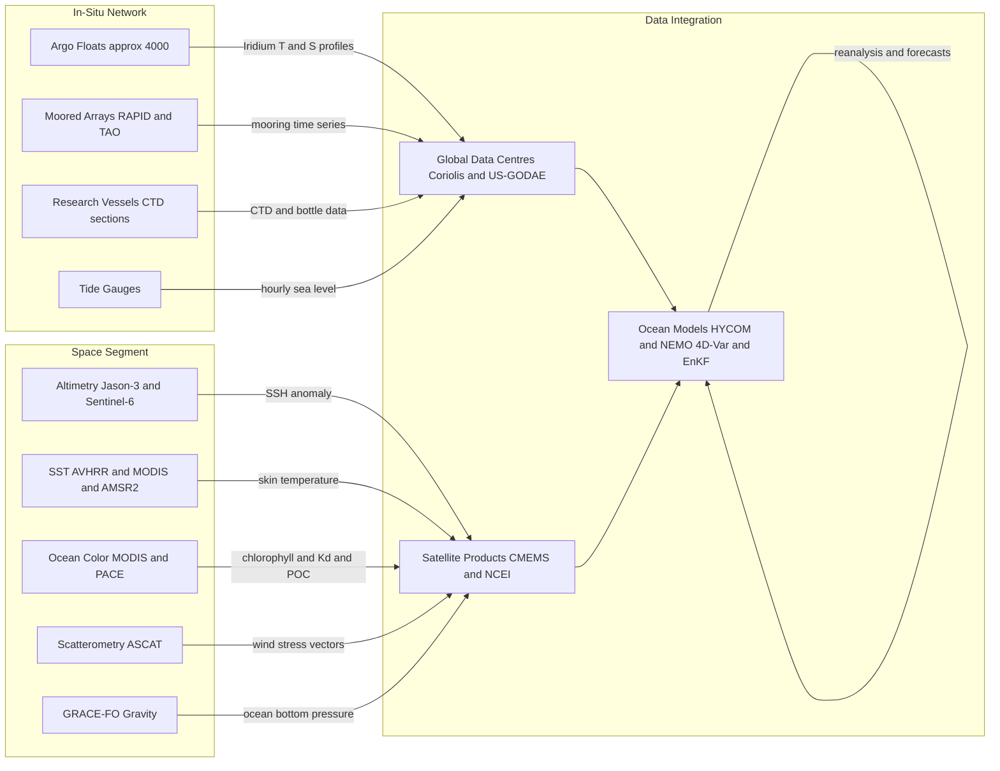

# Ocean Observing Systems and Remote Sensing

> [!abstract] TL;DR
> Modern ocean observing combines autonomous in-situ sensors, moored arrays, and Earth-orbiting satellites to build a near-real-time picture of the ocean's physical, chemical, and biological state. The Argo programme deploys roughly 4000 profiling floats that autonomously cycle from the surface to 2000 m every 10 days, delivering global temperature and salinity profiles at approximately 3° resolution. Satellite altimeters from TOPEX/Poseidon through Sentinel-6 measure sea-surface height to ±2 cm precision, enabling mesoscale eddy tracking and multi-decadal sea-level trend monitoring. Complementary sensors — AVHRR/MODIS for SST, MODIS/PACE for ocean color, ASCAT for wind stress, GRACE-FO for gravity — together form the Global Ocean Observing System (GOOS), whose freely available data are assimilated into operational ocean models to produce the reanalyses and forecasts underpinning climate science, fisheries management, and maritime safety.

---

## Intuition

**Analogy:** Observing the global ocean is like trying to take the temperature of an Olympic-sized bathtub using only a handful of thermometers — except the bathtub is 361 million km² and averages 3.7 km deep. Even with 4000 Argo floats — one float per roughly 3° × 3° square of ocean — and dozens of orbiting satellites, vast regions of the deep ocean and coastal margins remain undersampled. A single research vessel could spend a lifetime crossing the Pacific and still fail to catch a fleeting mesoscale eddy at the right moment.

Yet modern observing systems produce something that would have astonished oceanographers of 1980: a daily, quasi-synoptic snapshot of the global ocean surface, plus a 10-day-repeat subsurface temperature and salinity climatology that rivals the spatial coverage of an entire pre-Argo century of ship surveys. The trick is combining different vantage points — floats see depth but drift with currents; satellites see the surface but globally and repeatedly; moorings see time but stay fixed — so that their collective information fills each other's blind spots and feeds numerical models that interpolate between observations across the spaces in between.

---

## How It Works

### Core Mechanics

**Argo Float Lifecycle**

An Argo float completes a 10-day autonomous cycle with no propulsion except buoyancy adjustment via an internal oil bladder:

1. **Park at 1000 m** — the float descends from the surface and drifts passively at a nominal parking depth of 1000 m for 9 days. This ensures broad geographic sampling before the next profile, and the displacement between successive surface positions encodes the current velocity at parking depth (a Lagrangian velocity estimate).

2. **Descend to 2000 m** — on day 9, the float contracts its bladder (increasing density) and sinks to 2000 m (the standard profiling depth).

3. **Profile upward** — the float expands its bladder (decreasing density) and rises at roughly 0.09 m s⁻¹, measuring temperature and conductivity (salinity) at 1–10 m vertical resolution through a CTD sensor. Most floats resolve the thermocline with 2–5 m vertical spacing.

4. **Transmit via Iridium satellite** — at the surface the float transmits its T/S profile and GPS position via the Iridium satellite constellation (replacing the older Argos system since ~2005). Data reach a Global Data Assembly Centre (GDAC: Coriolis in France, or US-GODAE) within hours, undergo automated quality control, and are distributed freely within 24 hours.

5. **Dive again** — the cycle repeats for a float lifetime of 3–5 years (limited by battery capacity), after which the float is abandoned on the seafloor.

The 4000-float array provides global T/S profile coverage every 10 days at approximately 3° × 3° horizontal resolution — a factor of 5–10 improvement in coverage over pre-Argo ship-based hydrography.

**Satellite Altimetry**

A radar altimeter emits a short microwave pulse (Ku-band, ~13.6 GHz) toward the ocean surface and measures the two-way travel time of the returned echo. Sea-surface height (SSH) is then:

$$\text{SSH} = H_{\text{orbit}} - h_{\text{range}} - \Delta h_{\text{corrections}}$$

where $H_{\text{orbit}}$ is the satellite's geocentric orbit height (determined by DORIS radio-Doppler tracking and/or GPS to ~1 cm), $h_{\text{range}}$ is the measured radar range, and corrections include the dry and wet tropospheric path delay, ionospheric electron content, tidal signal, and the inverted barometer effect. TOPEX/Poseidon (1992–2005) achieved ±2–3 cm SSH precision — a ten-fold improvement over predecessors — enabling detection of mesoscale eddies (SSH anomalies of ~5–30 cm) and a multi-decadal global mean sea-level rise trend of +3.3 mm yr⁻¹. SSH is measured relative to a reference ellipsoid; converting to absolute dynamic topography (which drives geostrophic surface currents) requires subtracting a geoid model from GRACE or GOCE.

**Sea Surface Temperature**

Two sensor types provide complementary SST:

- **Infrared thermal (AVHRR / MODIS):** Measures the skin SST — the top 10–100 μm of the ocean — from emitted thermal radiation at 3.7–12 μm. Precision ~0.1–0.3 K, spatial resolution ~1–4 km. Critical limitation: clouds are opaque in infrared, so instantaneous coverage is typically only 30–60% in tropical and storm-track regions.

- **Passive microwave (AMSR-E / AMSR2):** Measures SST through non-precipitating clouds at 6–10 GHz, providing all-weather coverage at ~25–50 km resolution. Senses a bulk temperature (~1 mm depth) rather than skin SST; cannot observe within ~75 km of coastlines due to land contamination.

**Wind Stress via Scatterometry**

Satellite scatterometers (QuikSCAT: 1999–2009; ASCAT: 2007–present) emit C- or Ku-band radar pulses and measure backscatter from short Bragg-resonant gravity-capillary waves whose amplitude and directional spread are in equilibrium with the local 10-m wind. Empirical geophysical model functions (GMFs, e.g., CMOD5.n) relate the backscatter pattern from fore/aft beam geometries to the wind vector, from which wind stress $\tau = \rho_a C_D U_{10}^2$ is derived at 12.5–25 km resolution. Scatterometer winds remain the primary input for air-sea flux products and drive the surface boundary condition of ocean models.

**GRACE and Ocean Bottom Pressure**

The twin GRACE satellites (2002–2017; GRACE-FO since 2018) fly in tandem ~220 km apart, measuring inter-satellite range changes of <1 μm via a K-band microwave link. Monthly gravity solutions resolve spatial scales ≥300 km. Over the ocean, GRACE detects changes in ocean bottom pressure (OBP) — the column-integrated mass of seawater above the seafloor — encoding barotropic mass redistribution, ice-sheet mass-loss contributions to sea-level change, and deep thermohaline transitions invisible to altimetry.

**Ocean Color — MODIS / PACE**

Ocean-color sensors measure the water-leaving radiance $L_w(\lambda)$ in multiple spectral bands (see [[Ocean_Optics_and_Light_Penetration]]). Band ratios (e.g., $R_{rs}(443)/R_{rs}(555)$) are inverted via bio-optical algorithms to retrieve chlorophyll-a concentration [Chl-a], coloured dissolved organic matter (CDOM), and particulate organic carbon (POC). SeaWiFS (1997–2010) and MODIS-Aqua (2002–present) provide a ~25-year continuous record. PACE (2024–present) extends this with hyperspectral coverage (340–890 nm at 5 nm resolution), enabling phytoplankton functional type discrimination from space for the first time.

**Moored Arrays**

Fixed instrumented moorings provide the high-temporal-resolution records (hourly to daily) that Argo and satellites cannot supply:

- **RAPID array (26.5°N, Atlantic):** A line of ~15 bottom-anchored instruments and two Western Boundary timeseries arrays that has delivered continuous daily AMOC transport estimates since 2004, revealing 20–25% interannual variability in overturning strength.
- **TAO/TRITON (tropical Pacific and Indian Oceans):** Roughly 70 moorings along the equatorial bands providing SST, subsurface temperature, and current data for ENSO monitoring — the in-situ backbone of El Niño early warning.
- **OceanSITES:** An international network of ~30 global reference time-series stations (e.g., PAPA, STRATUS, NTAS) providing decades-long records of surface fluxes, mixed-layer properties, and carbon system parameters.

### Flow / Architecture



---

## Key Concepts / Details

### Secondary Level

The ocean is too large and too deep for any ship or sensor to measure all at once, so oceanographers use a combination of floating robots, fixed buoys, and spacecraft to build a picture of how the ocean behaves. **Argo floats** are profiling robots — roughly the size and weight of a scuba tank — that drift at depth, periodically rising to the surface while measuring temperature and salinity, then transmitting data to shore via satellite. They are like underwater weather balloons: released globally and tracked from space, producing continuous streams of ocean profile data. **Satellite altimeters** measure how high the sea surface is by bouncing a radar signal off the water and timing the echo; a higher sea surface indicates warmer or deeper water piled up by currents underneath. **SST satellites** use the ocean's own infrared heat glow to map temperature much as a thermal camera maps body heat. All Argo float data and satellite products are freely available from international data centres — any researcher can download a float's profile history within 24 hours of its surface transmission.

### Undergraduate Level

**Argo salinity sensor drift and calibration.** Argo CTD conductivity sensors drift over time, causing salinity errors of up to 0.01–0.05 PSU per year of deployment. Two approaches correct this drift: (1) *Delayed-Mode Quality Control (DMQC)* compares each float's deep salinity (below 1500 m, where T/S properties are climatologically stable on decadal timescales) to reference climatologies (World Ocean Atlas, WOCE bottle data); (2) the *OWC (Owens-Wong-Cabral) statistical calibration* fits a piecewise salinity adjustment based on water-mass consistency along isopycnals. Uncorrected salinity errors on the order of 0.02 PSU can bias density calculations by ~0.015 kg m⁻³, which is sufficient to misrepresent AMOC transport by several Sverdrups.

**Orbit determination for altimetry.** Achieving the ±2 cm SSH precision of the Jason series requires knowing the satellite orbit height to ~1 cm accuracy. DORIS (Doppler Orbitography and Radiopositioning Integrated by Satellite) accomplishes this through a network of ~60 globally distributed ground beacons emitting precisely timed signals that the satellite Doppler-tracks during each pass. DORIS is supplemented by GPS receivers and Satellite Laser Ranging (SLR) from ground stations that fire laser pulses at retroreflectors on the satellite hull. Residual orbit errors remain the dominant limitation for detecting long-period (decadal) SSH trends.

**Geoid reference and absolute dynamic topography.** Altimeters measure SSH relative to a reference ellipsoid (a mathematically smooth approximation of Earth's shape). Converting SSH to the *absolute dynamic topography* ADT = SSH − geoid — which is proportional to the geostrophic surface current velocity — requires subtracting the geoid surface of equal gravitational potential. The GRACE and GOCE satellite gravity missions together resolve the geoid at 100 km resolution to ±1–2 cm accuracy, enabling absolute surface geostrophic velocities with ~10 cm uncertainty for the first time. SSH anomaly (SLA = SSH − mean SSH) has much smaller errors and is more commonly used for mesoscale eddy tracking.

**Scatterometer wind retrieval algorithm.** The geophysical model function (GMF) relates the normalised radar cross-section $\sigma_0$ to wind speed $U_{10}$ and the relative azimuth angle between the radar look direction and the wind direction. Each beam look provides a set of possible wind vectors lying on a cone in speed-direction space; ambiguity removal uses fore and aft beam observations (different azimuth angles) to select the unique solution. In practice, the ECMWF numerical weather prediction first-guess wind field is used to resolve the remaining directional ambiguity among typically 2–4 candidate solutions.

**OceanSITES mooring network.** The OceanSITES programme coordinates ~30 globally distributed open-ocean reference time-series stations that provide continuous multi-year records of surface air-sea fluxes, mixed-layer temperature and salinity, and carbon system parameters (pCO₂, pH, dissolved oxygen). These long records anchor satellite and float climatologies that have shorter time spans, provide the only continuous observations of interannual mixed-layer variability at fixed locations, and serve as calibration targets for bio-optical sensors and air-sea flux bulk parameterisations.

### Graduate Level

**Multiscale data assimilation: 4D-Var and EnKF.** Operational ocean forecast systems (HYCOM, NEMO, MOM6) assimilate satellite SSH, SST, and Argo T/S profiles using one of two main frameworks. *Four-dimensional variational (4D-Var) assimilation* minimises a cost function that measures the sum of squared model-observation misfit and departure from a background state over a time window, using the adjoint of the model's dynamical equations to propagate sensitivity backwards in time. It provides a dynamically consistent incremental analysis but requires an adjoint code of comparable complexity to the forward model and is computationally expensive. *Ensemble Kalman Filter (EnKF)* propagates an ensemble of model realisations (typically 20–200 members) to estimate the flow-dependent error covariance, then updates each member proportionally to the Kalman gain times the observation-minus-model residual. EnKF is readily parallelisable and provides explicit ensemble-based uncertainty estimates, but the finite ensemble size introduces sampling error (spurious long-range covariances) that must be mitigated by localisation and inflation. GODAE OceanView (now OceanPredict) multi-model comparisons show that assimilating both Argo and altimetry reduces subsurface temperature RMSE by 30–50% versus free-running models.

**Observing System Simulation Experiments (OSSEs).** Before deploying costly new observation assets, OSSEs use a high-resolution "nature run" model (e.g., 1/48° LLC MITgcm) as a synthetic ground truth. A coarser "assimilating model" (e.g., 1/12° HYCOM) is then run with simulated observations — model fields sub-sampled at proposed observation locations and times, with realistic instrument noise added — to quantify how much the new system would reduce forecast errors relative to a baseline (existing observing system without the new asset). OSSEs have justified the deployment of deep Argo (6000 m), the SWOT wide-swath altimeter, and additional Southern Ocean moorings by demonstrating measurable reductions in steric sea-level and heat content uncertainty.

**BGC-Argo.** The Biogeochemical Argo extension adds up to six additional sensors to standard CTD floats: dissolved oxygen (optode, RINKO type), nitrate (SUNA UV sensor), pH (ISFET ion-sensitive field-effect transistor), irradiance (PAR at three depths), CDOM fluorescence, and optical backscatter at 700 nm (proxy for POC and phytoplankton carbon). The 2021 OneArgo plan calls for 1000 BGC floats by 2030, providing global estimates of biological carbon pump efficiency, oxygen minimum zone expansion, and net community production. Major technical challenges include biofouling of optical sensors on long deployments (mitigated by copper-oxide antifouling wiper), nitrate sensor sensitivity to pressure-induced index-of-refraction changes (corrected via in-situ dark current profiles), and the limited accuracy of factory-calibrated pH electrodes (requiring post-deployment offset correction against cruise bottle data).

**Deep Argo (to 6000 m).** Standard Argo covers only 0–2000 m, representing approximately 50% of the ocean's water volume. The deep ocean (>2000 m) stores an estimated 35–40% of total ocean heat content change since 1960 and contains the densest water masses that drive global thermohaline circulation. Deep Argo floats carry pressure-tolerant SBE-41 CTDs and titanium housings rated to 6000 m; each profile requires ~12 hours of ascent time, significantly extending the cycle period. Budget estimates suggest ~1200 deep Argo floats at 5° global spacing are needed to close the ocean heat and freshwater budgets to the accuracy required for climate change attribution.

**SWOT wide-swath altimetry.** Jason-3 and Sentinel-6 measure SSH along 1D ground tracks spaced ~315 km apart at mid-latitudes, resolving mesoscale eddies ≥200 km wavelength. SWOT (launched December 2022, science phase 2023–present) uses a Ka-band (35.75 GHz) radar interferometer with two antennae on a 10 m boom to measure SSH across a 120 km swath at ~15 km effective resolution, bridging the submesoscale gap. Early SWOT science results reveal that submesoscale SSH variance exceeds mesoscale variance in energetic regions (western boundary currents, Southern Ocean), that frontal structures as narrow as 20 km are coherent across the swath, and that the kinetic energy spectrum steepens at scales below the deformation radius — consistent with surface quasi-geostrophic rather than interior QG dynamics.

---

## Python Demo

```python
import numpy as np
import matplotlib.pyplot as plt

# ─── Part 1: Synthetic Argo Float Profile (45N, 30W — North Atlantic) ─────────
np.random.seed(42)
depths = np.arange(0, 2001, 10)   # 0 to 2000 m at 10 m spacing (201 levels)

# Temperature: warm surface mixed layer, sharp thermocline centred at 250 m, cold deep water
T_surface = 21.0
T_deep    = 2.5
T = T_deep + (T_surface - T_deep) * np.exp(-(depths / 500.0) ** 1.2)
T += 1.5 * np.exp(-((depths - 250) / 100.0) ** 2)  # thermocline intensification
T += np.random.normal(0, 0.04, depths.size)          # CTD noise ~0.04 degC

# Salinity: surface value, subsurface maximum at ~190 m (N. Atlantic subtropical gyre),
# slight AAIW freshening at ~800 m, uniform deep value
S_surface = 36.2
S_deep    = 34.97
S = S_deep + (S_surface - S_deep) * np.exp(-(depths / 700.0) ** 1.5)
S += 0.55 * np.exp(-((depths - 190) / 110.0) ** 2)   # salinity maximum
S -= 0.15 * np.exp(-((depths - 800) / 150.0) ** 2)   # AAIW fresher tongue
S += np.random.normal(0, 0.004, depths.size)           # CTD conductivity noise ~0.004 PSU

# Potential density sigma-theta via linearised equation of state
# rho = rho0 * (1 - alpha*(T - T0) + beta*(S - S0))  referenced to surface pressure
rho0  = 1025.0   # reference density kg m-3
alpha = 2.0e-4   # thermal expansion coefficient per degC
beta  = 7.5e-4   # haline contraction coefficient per PSU
T0, S0 = 10.0, 35.0
sigma_theta = rho0 * (1.0 - alpha * (T - T0) + beta * (S - S0)) - 1000.0

# ─── Part 2: SSH Interpolation — Along-Track Altimetry to Regular Grid ────────
# Simulate a Jason-3 ascending pass at 20N over the North Atlantic
# SSH anomaly has a bowl-shaped anticyclone centred near -35E
lon_track = np.array([-62, -55, -48, -40, -33, -26, -19, -12, -5, 2], dtype=float)
ssh_true  = 0.30 * np.exp(-((lon_track + 35) / 8.0) ** 2) - 0.05
ssh_obs   = ssh_true + np.random.normal(0, 0.01, lon_track.size)  # 1 cm radar noise

# Linear interpolation to a 1 degree regular longitude grid
lon_grid   = np.arange(-62, 3, 1.0)
ssh_interp = np.interp(lon_grid, lon_track, ssh_obs)

# ─── Plotting ────────────────────────────────────────────────────────────────
fig, axes = plt.subplots(1, 4, figsize=(15, 8))

ax = axes[0]
ax.plot(T, -depths, color='#d62728', linewidth=1.8)
ax.axhline(-250, color='k', linestyle='--', linewidth=0.8, label='Thermocline ~250 m')
ax.set_xlabel('Temperature (degC)', fontsize=10)
ax.set_ylabel('Depth (m)', fontsize=10)
ax.set_title('Temperature', fontsize=11)
ax.legend(fontsize=8)
ax.grid(alpha=0.3)

ax = axes[1]
ax.plot(S, -depths, color='#1f77b4', linewidth=1.8)
ax.axhline(-190, color='k', linestyle='--', linewidth=0.8, label='Salinity max ~190 m')
ax.set_xlabel('Salinity (PSU)', fontsize=10)
ax.set_title('Salinity', fontsize=11)
ax.legend(fontsize=8)
ax.grid(alpha=0.3)

ax = axes[2]
ax.plot(sigma_theta, -depths, color='#2ca02c', linewidth=1.8)
ax.set_xlabel('Potential density (kg m-3)', fontsize=10)
ax.set_title('Sigma-theta', fontsize=11)
ax.grid(alpha=0.3)

ax = axes[3]
ax.plot(lon_track, ssh_obs, 'ko', markersize=6, zorder=5, label='Along-track obs')
ax.plot(lon_grid, ssh_interp, 'r-', linewidth=1.8, label='Interpolated 1-deg grid')
ax.axhline(0, color='gray', linestyle='--', linewidth=0.8)
ax.set_xlabel('Longitude (deg E)', fontsize=10)
ax.set_ylabel('SSH anomaly (m)', fontsize=10)
ax.set_title('SSH Along-Track to Grid', fontsize=11)
ax.legend(fontsize=8)
ax.grid(alpha=0.3)

plt.suptitle('Argo Float Profile (45N, 30W) | SSH Interpolation (20N, N. Atlantic)',
             fontsize=12, fontweight='bold')
plt.tight_layout()
plt.savefig('argo_profile_demo.png', dpi=120, bbox_inches='tight')
plt.show()
```

The temperature profile shows the surface mixed layer (~21°C), a sharp thermocline centred near 250 m, and the cold North Atlantic Deep Water (~2.5°C below 1000 m. The salinity profile shows the subtropical salinity maximum near 190 m, the AAIW freshwater tongue around 800 m, and deep uniform salinities. The potential density profile shows the stable stratification increasing monotonically with depth. The SSH panel illustrates how sparse along-track altimeter measurements (10 points) are mapped to a continuous regular grid — a process that operationally uses optimal interpolation rather than linear interpolation to account for observational noise and spatiotemporal correlation structure.

---

## Real-World Notes

- **Argo at 25 years.** Argo was launched in 2000 as a joint US–Japan–France programme, reached global coverage (~3000 floats) around 2007, and by 2025 had accumulated over 2.5 million T/S profiles — surpassing the entire previous century of ship-based profiling combined. The programme now operates under the international OneArgo framework, which targets 4000 active floats including BGC and deep variants, with data freely distributed to all users within 24 hours of surface transmission under the GTS/WMO real-time exchange protocol.

- **TOPEX/Poseidon revolution (1992).** TOPEX/Poseidon — a joint NASA/CNES mission launched 10 August 1992 — was the first altimeter with sufficient orbit determination accuracy (DORIS + LRA) to detect the global mean sea-level rise signal. Before TOPEX, residual orbit errors of 10–30 cm obscured the sea-level trend signal. TOPEX data revealed the +3.3 mm yr⁻¹ trend, provided the first definitive global eddy census, and enabled validation of global tidal models (the FES tidal series). It became one of the most scientifically productive satellite missions in oceanographic history.

- **Jason-3 / Sentinel-6 continuity.** The Jason altimetric series (Jason-1: 2001, Jason-2: 2008, Jason-3: 2016, Sentinel-6 Michael Freilich: 2020) now constitutes over 30 years of continuous calibrated SSH data — among the most scientifically valuable geophysical time series ever collected. Sentinel-6, under the European Copernicus programme, delivers a target of ±1.5 cm SSH precision with an improved dual-frequency (Ku + C band) altimeter and extends the series through the 2030s.

- **PACE (2024) and hyperspectral oceanography.** NASA's Plankton, Aerosol, Cloud, ocean Ecosystem satellite launched 8 February 2024, carrying the OCI (Ocean Color Instrument) — a hyperspectral sensor covering 340–890 nm at 5 nm resolution plus ancillary polarimeters. PACE can distinguish individual phytoplankton functional types (diatoms, cyanobacteria, dinoflagellates, coccolithophores) from space for the first time, transforming biological oceanography in a manner analogous to what Argo did for physical oceanography. Early 2024–25 results confirm improved aerosol characterisation over ocean surfaces and detection of harmful algal bloom species composition.

- **SWOT and the submesoscale frontier (2023–present).** SWOT's 120 km swath SSH maps at 15 km resolution have revealed that submesoscale eddies and fronts — previously invisible to conventional altimeters — are ubiquitous across all ocean basins and carry significant heat and carbon flux. The Jason-3 series resolved structures of ~200 km; SWOT resolves ~15 km, opening a new chapter for the numerical modelling community in understanding unparameterised subgrid-scale transport.

---

## Common Pitfalls

- **Assuming Argo provides full-depth ocean coverage.** Standard Argo floats profile to 2000 m, covering approximately 50% of the ocean's water volume by depth. The deep ocean (2000–6000 m) contains an estimated 35–40% of total ocean heat content change since 1960 and all of the abyssal thermohaline water masses. Budget closure for global ocean heat content and sea-level attribution requires deep Argo coverage, which as of 2025 encompasses only ~100 deployed floats globally — far below the ~1200 needed for statistical closure at 5° spacing.

- **Treating satellite altimetry SSH as absolute sea-surface elevation.** Altimeters measure SSH relative to a reference ellipsoid. Converting to absolute dynamic topography (ADT = SSH − geoid) requires subtracting the geoid, which retains horizontal errors of 1–3 cm at 100 km scales even with GRACE/GOCE. Using raw SSH without geoid subtraction will misrepresent the direction and magnitude of geostrophic currents. For most physical oceanography applications — eddy tracking, mesoscale variability, ENSO monitoring — sea-level anomaly (SLA = SSH − mean SSH over a reference period) is far more robust than absolute SSH, since the mean geoid errors cancel out.

- **Ignoring cloud cover gaps in infrared SST.** Thermal infrared SST (AVHRR, MODIS) is unavailable wherever clouds are present. In the tropics and mid-latitude storm tracks, clouds leave 30–70% of the ocean unmeasured at any instant. Constructing climatologies or anomalies from daily infrared SST without correcting for this cloud-sampling bias produces systematic errors: cold upwelling zones are frequently cloudy, so their SSTs are undersampled, artificially warming the mean. All-weather microwave SST (AMSR2) or optimal interpolation blended products (OSTIA, CMC SST) combining infrared and microwave should be used for continuous time-series studies.

- **Using real-time Argo data without quality-control flags.** Raw real-time Argo data (quality-flag mode 'R') undergo only automated checks and can contain salinity offsets of 0.02–0.05 PSU from sensor drift. For density-dependent analyses (AMOC transport, water-mass T/S characterisation, steric sea-level calculation), always use *delayed-mode* data (flag 'D') that have passed OWC statistical calibration and expert DMQC operator review. The Argo float data mode flag is encoded in the NetCDF variable `DATA_MODE`; mixing R-mode and D-mode profiles in time-series analysis introduces artificial trends that can exceed the real climate signal.

---

## Related Concepts

**Same vault (Oceanography):**

- [[Mesoscale_Eddies_and_Ocean_Variability]] — satellite altimetry (SSH anomaly closed contours) is the primary tool for global eddy detection and census; this note explains the physics of the SSH signals that altimeters detect.
- [[Thermohaline_Circulation_and_AMOC]] — the RAPID moored array at 26.5°N (described here) provides the only continuous direct measurements of AMOC transport; Argo floats provide the basin-wide T/S context for interpreting RAPID variability.
- [[Ocean_Heat_Content_and_Marine_Heatwaves]] — Argo floats are the primary data source for global ocean heat content estimates; OHC trends are computed by integrating Argo T/S profiles over the 0–2000 m water column with appropriate thermal expansion coefficients.
- [[Marine_Primary_Production_and_Phytoplankton]] — MODIS and PACE ocean-color satellite data (chlorophyll-a, phytoplankton absorption spectra) provide the global phytoplankton biomass observations central to primary production estimates and biological carbon pump quantification.
- [[_MOC_Ocean_and_Climate]] — section map of the Ocean and Climate module in this vault.

**Cross-vault:**

- [[Electromagnetic_Waves_and_Radiation]] — radar altimetry, scatterometry, passive microwave SST, and ocean color each exploit specific electromagnetic wavelength windows; the difference between microwave and infrared cloud penetration is a direct consequence of wavelength-dependent absorption by water droplets.
- [[Fourier_Transform]] — spectral analysis of along-track altimeter SSH data in the wavenumber domain (SSH wavenumber spectra) separates mesoscale signal from tides and noise; Fourier methods underpin almost all satellite signal processing from waveform retracking to orbit error correction.
- [[Ocean_Atmosphere_Coupling_and_ENSO]] — TAO/TRITON moored buoy array (described here) is the in-situ backbone for ENSO monitoring; satellite SST (AVHRR/MODIS) and Argo thermocline-depth anomalies provide the broader spatial context for ENSO indices and heat content precursors.
- [[_MOC_Physics_Master]] — geoid determination (classical mechanics and gravitation), radar wave physics (electromagnetism), and radiation heat transfer (thermodynamics) all draw on the Physics vault's foundational content.
- [[_MOC_SS_Master]] — signal processing concepts (Nyquist sampling, spectral leakage, matched filtering) are directly applied in altimeter waveform retracking, Argo profile noise filtering, and ocean-color atmospheric correction algorithms.
- [[_MOC_Meteorology_Master]] — scatterometer wind stress feeds directly into atmospheric weather models; meteorological precipitation, evaporation, and cloud fraction fields are required inputs to surface flux products and ocean model forcing.

---

## Review Questions

### Secondary Level

1. Why is it impossible for a single research vessel to continuously monitor the global ocean, and what combination of observing platforms allows near-global ocean coverage today?
2. Describe the complete 10-day cycle of an Argo float in your own words: where does it go, what does it measure, and how does its data reach scientists on land?
3. A satellite cannot see through seawater, so how does a satellite altimeter measure anything meaningful about the ocean? What does the height of the sea surface tell a physical oceanographer?

### Undergraduate Level

4. A Jason-3 altimeter measures an SSH anomaly of +0.22 m over a warm-core anticyclonic eddy. Assuming the eddy extends to 1000 m depth and the thermal expansion coefficient $\alpha = 2 \times 10^{-4}$ °C⁻¹, estimate the depth-averaged temperature anomaly within the eddy relative to the surrounding water. How does this illustrate the link between steric height and ocean heat content?
5. You download daily infrared (MODIS) SST maps for the California Current upwelling zone and compute a monthly climatology. Explain two distinct sampling biases that might make your climatology unreliable, and propose how blended SST products (e.g., OSTIA) mitigate them.
6. An Argo float deployed in the Labrador Sea measures systematically fresher salinity below 1500 m than the WOA2018 climatology. Propose one physical explanation (a real oceanographic change) and one instrumental explanation, and describe how you would distinguish between the two using DMQC procedures.

### Graduate Level

7. Compare 4D-Var and EnKF ocean data assimilation for a problem combining Argo T/S profiles and satellite altimetry SSH. Under what conditions is each approach preferable in terms of computational cost, dynamical consistency, and uncertainty quantification? How would you handle the vastly different spatial and temporal sampling densities of the two observation types?
8. SWOT resolves SSH at ~15 km resolution while Jason-3 resolves ~200 km. Using the ocean's kinetic energy spectrum (SSH wavenumber spectrum ~ k⁻⁵ at mesoscales; ~ k⁻¹ to k⁻² at submesoscales), estimate the fraction of total SSH variance accessible to Jason-3 versus SWOT. Why does this spectral argument matter for representing vertical heat and carbon flux in climate models?
9. Design an OSSE to evaluate whether deploying 500 additional BGC-Argo floats in the Southern Ocean would improve estimates of the biological carbon pump export efficiency. Specify: (a) the nature run and assimilating model resolutions; (b) the BGC variables and their simulated sensor noise; (c) the skill metrics for success; and (d) the primary confounding factors that might make OSSE results over-optimistic.

---

## Sources

- Riser, S. C., et al. (2016). "Fifteen years of ocean observations with the global Argo array." *Nature Climate Change*, 6(2), 145–153. — comprehensive review of Argo science after 15 years; programme history, data quality, and major scientific discoveries.
- Fu, L.-L., & Cazenave, A. (Eds.) (2001). *Satellite Altimetry and Earth Sciences: A Handbook of Techniques and Applications.* Academic Press. — definitive textbook on altimetry principles, orbit determination, tidal and atmospheric corrections, and geophysical applications.
- Wunsch, C., & Heimbach, P. (2007). "Practical global ocean state estimation." *Physica D: Nonlinear Phenomena*, 230(1–2), 197–208. — seminal overview of 4D-Var ocean state estimation methodology and the ECCO ocean reanalysis product.
- Lumpkin, R., & Speer, K. (2007). "Global ocean meridional overturning." *Journal of Physical Oceanography*, 37(10), 2550–2562. — inverse estimates of global overturning circulation from hydrographic section data; essential reference for AMOC and thermohaline transport.
- Claustre, H., et al. (2020). "BGC-Argo: Scientific rationale and plan for a biogeochemical Argo float array." *Frontiers in Marine Science*, 7, 587. — defines the BGC-Argo sensor suite, sampling design, science questions, and path to global deployment.
- Morrow, R., et al. (2019). "Global observations of fine-scale ocean surface topography with the Surface Water and Ocean Topography (SWOT) mission." *Frontiers in Marine Science*, 6, 232. — SWOT scientific objectives, expected submesoscale SSH resolution, and anticipated impact on ocean and hydrology science.

---

#Oceanography #OceanClimate #OceanObserving #Argo #Altimetry #RemoteSensing
