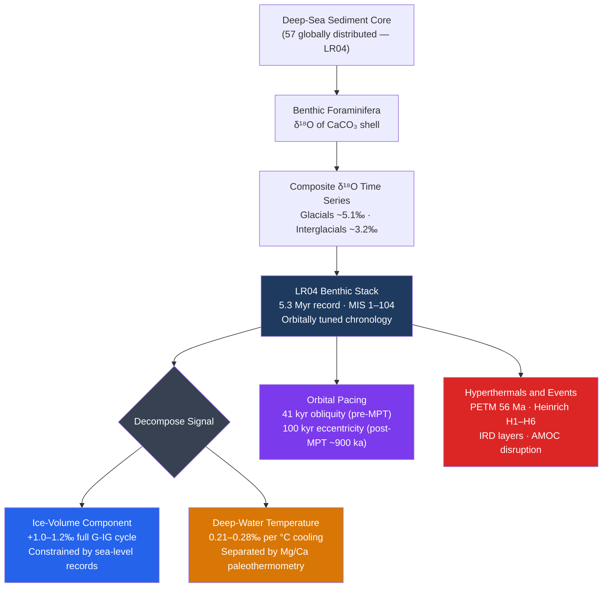

# Paleoceanography and Ocean Sediment Records

> [!abstract] TL;DR
> **Paleoceanography** extracts the climate history of the ocean from physical, chemical, and biological signals preserved in deep-sea sediment cores, extending the record of ocean temperature, circulation, and chemistry back tens of millions of years — far beyond any instrument. The cornerstone archive is the **LR04 benthic foraminiferal δ¹⁸O stack** (Lisiecki & Raymo 2005), a composite of 57 globally distributed cores spanning 5.3 Myr, whose oscillating signal reflects the combined imprint of **glacial ice-volume changes** and **deep-water temperature shifts** paced by Milankovitch orbital cycles. Orthogonal proxies — **Mg/Ca** paleothermometry, **UK'₃₇** alkenone sea-surface temperatures, **δ¹³C** circulation/productivity tracers, **εNd** water-mass fingerprinting, and the **²³¹Pa/²³⁰Th** kinematic AMOC tracer — together disentangle the overlapping signals and reconstruct the full four-dimensional state of past oceans. Singular events such as the **Paleocene-Eocene Thermal Maximum (PETM, 56 Ma)** and **Heinrich events** provide deep-time and millennial-scale analogues for rapid carbon injection and AMOC disruption that remain relevant to the future.

---

## Intuition

**Analogy:** The deep ocean floor is the world's most patient librarian. Every year a gentle rain of particles — microscopic shells, organic molecules, wind-blown dust, and volcanic ash — drifts down through kilometres of water and settles as a thin layer of sediment. Each layer is a page, and together the pages stack up into a book thousands of metres thick with chapters going back millions of years. The librarian (the paleoceanographer) reads these pages not with eyes but with **mass spectrometers**, measuring the ratio of heavy to light isotopes in fossilized shells to recover temperatures that no thermometer ever recorded, and tracing ocean currents that stopped flowing long before the first ship ever sailed.

The key to reading the book is that single-celled organisms called **foraminifera** build their calcium carbonate shells in chemical equilibrium with the seawater around them. When the ocean is cold and ice sheets are large, the shells incorporate more of the heavy oxygen isotope (¹⁸O), leaving a legible chemical fingerprint. Millions of these shells, concentrated from a centimetre of core, yield a δ¹⁸O value precise to ±0.05‰ — enough to resolve the difference between a glacial maximum and an interglacial warm period. Stitching together 57 such records from around the globe gives the **LR04 benthic stack**: a continuous climate thermometer spanning more than five million years.

---

## How It Works

### δ¹⁸O in Benthic Foraminifera and the LR04 Stack

The **oxygen isotope ratio** δ¹⁸O is defined relative to the Vienna Standard Mean Ocean Water (VSMOW) or PDB (Pee Dee Belemnite) standards:

$$\delta^{18}\text{O} = \left(\frac{(^{18}\text{O}/^{16}\text{O})_\text{sample}}{(^{18}\text{O}/^{16}\text{O})_\text{standard}} - 1\right) \times 1000 \quad (\text{‰})$$

**Benthic foraminifera** (bottom-dwellers such as *Cibicidoides* and *Uvigerina*) precipitate their shells in near-equilibrium with ambient bottom water, encoding two simultaneous signals:

**1. Ice-volume effect.** During glacials, continental ice sheets preferentially sequester ¹⁶O (evaporated from the ocean as the lighter isotope) in glacial ice. The residual ocean becomes enriched in ¹⁸O. A full glacial-interglacial cycle shifts global seawater δ¹⁸O by **+1.0 to +1.2‰** — the "ice-volume signal." This can be estimated independently from **sea-level records** (coral U-Th, far-field sediment sequences).

**2. Temperature effect.** Lower bottom-water temperature increases ¹⁸O incorporation in calcite by approximately **0.21–0.28‰ per °C cooling**. Deep North Atlantic bottom water cooled ~2–4°C during glacials, contributing ~0.4–0.8‰ to the benthic δ¹⁸O increase.

Therefore, the total benthic δ¹⁸O change is:

$$\Delta\delta^{18}\text{O}_\text{benthic} \approx \underbrace{\Delta\delta^{18}\text{O}_\text{ice volume}}_{\sim+1.0\text{–}1.2‰} + \underbrace{\Delta\delta^{18}\text{O}_\text{temperature}}_{\sim+0.4\text{–}0.8‰}$$

The **LR04 benthic stack** (Lisiecki & Raymo, 2005) splices 57 globally distributed benthic δ¹⁸O records into a single reference curve covering **0–5.3 Myr** (Plio-Pleistocene). Each constituent core is aligned to the stack using **orbital tuning**: the assumption that glacial-interglacial pacing follows Milankovitch cycles (41-kyr obliquity, then 100-kyr eccentricity after the Mid-Pleistocene Transition at ~900 ka). The resulting chronology has typical age uncertainty of ±5–20 kyr. Marine Isotope Stages (MIS) are numbered from MIS 1 (Holocene, low δ¹⁸O) upward; **odd MIS = interglacials, even MIS = glacials**.

---

### Mg/Ca Paleothermometry

Magnesium substitutes for calcium in the calcite lattice of foraminiferal shells at a rate that increases exponentially with temperature:

$$\text{Mg/Ca} = B \cdot \exp(A \cdot T)$$

where $T$ is the calcification temperature (°C), $A \approx 0.09\text{–}0.11\ ^\circ\text{C}^{-1}$, and $B$ is a species-dependent pre-exponential constant (~0.3–0.9 mmol/mol). For the common planktonic species *Globigerinoides ruber* the Anand et al. (2003) calibration gives:

$$\text{Mg/Ca} = 0.38 \cdot \exp(0.090 \cdot T) \quad (\text{mmol/mol})$$

**Practical application:** because Mg/Ca records only temperature (not ice volume), pairing a Mg/Ca temperature estimate with a δ¹⁸O measurement on the same foram sample allows the two contributions to be separated:

$$\delta^{18}\text{O}_\text{seawater} = \delta^{18}\text{O}_\text{foram} - \delta^{18}\text{O}_\text{equilibrium calcite}(T_\text{Mg/Ca})$$

where $\delta^{18}\text{O}_\text{seawater}$ is then a pure **ice-volume proxy**. Benthic Mg/Ca applied to *Cibicidoides* species independently reconstructs deep-water temperature and allows LR04 to be decomposed into its two components.

**Caveats:** early diagenesis (dissolution, recrystallisation) can reset Mg/Ca; carbonate saturation and salinity each contribute secondary corrections; species-specific vital effects require species-matched calibrations.

---

### UK'₃₇ Alkenone Sea-Surface Temperature Thermometer

Long-chain **alkenones** (C₃₇ di-, tri-, and tetra-unsaturated methyl ketones) are lipid biomarkers synthesised by haptophyte algae (chiefly *Emiliania huxleyi* and *Gephyrocapsa oceanica*). Their degree of unsaturation adjusts membrane fluidity to ambient temperature, and after cell death the alkenones are preserved in sediments for millions of years.

The **UK₃₇** index is defined as:

$$U^K_{37} = \frac{[\text{C}_{37:2}] - [\text{C}_{37:4}]}{[\text{C}_{37:2}] + [\text{C}_{37:3}] + [\text{C}_{37:4}]}$$

Because C₃₇:₄ is nearly absent in warm and temperate waters, the simplified **UK'₃₇** index (Prahl & Wakeham, 1987) is more commonly used:

$$U^{K'}_{37} = \frac{[\text{C}_{37:2}]}{[\text{C}_{37:2}] + [\text{C}_{37:3}]}$$

The **Müller et al. (1998) global core-top calibration** gives:

$$\text{SST} = \frac{U^{K'}_{37} - 0.044}{0.033} \quad (^\circ\text{C})$$

with an effective range of ~−2 to ~29°C and a calibration uncertainty of ±1.5°C. Because alkenones record **annual mean SST** at the sea surface during the growth season, they are complementary to Mg/Ca-based SSTs from planktonic forams, which reflect calcification depth and season.

---

### δ¹³C: Tracing Deep Circulation and Productivity

The carbon isotope ratio δ¹³C of dissolved inorganic carbon (DIC) in seawater is modified by two processes:

1. **Biological fractionation.** Photosynthesis preferentially incorporates ¹²C into organic matter. Surface waters are ¹³C-enriched (δ¹³C_DIC ~ +1 to +2‰); deep waters are ¹³C-depleted (~−0.5 to +0.5‰) because remineralisation of sinking organic matter returns isotopically light carbon.

2. **Water-mass aging.** A water mass accumulates ¹²C-rich remineralised carbon the longer it has been isolated from the surface. **NADW** (recently ventilated, nutrient-poor) has high δ¹³C (~+1.0‰); **Pacific Deep Water** (old, nutrient-rich) has low δ¹³C (~−0.2‰). This makes δ¹³C of benthic forams a **"nutrient proxy"** sensu Broecker (1982) — a tracer of deep-water provenance and mixing.

During glacials, δ¹³C of benthic forams in the deep Atlantic shoals and decreases, reflecting a shallower NADW-like cell and greater penetration of southern-sourced (Antarctic) deep water. The **benthic-to-planktonic (B-P) δ¹³C gradient** tracks export productivity: a large B-P difference indicates efficient biological pump export from the surface.

---

### εNd: Fingerprinting Water Mass Sources

**Neodymium isotope ratios** ¹⁴³Nd/¹⁴⁴Nd are expressed as:

$$\varepsilon_{Nd} = \left(\frac{(^{143}\text{Nd}/^{144}\text{Nd})_\text{sample}}{(^{143}\text{Nd}/^{144}\text{Nd})_\text{CHUR}} - 1\right) \times 10^4$$

where CHUR is the Chondritic Uniform Reservoir. Neodymium is supplied to the ocean by weathering of continental rocks; the ¹⁴³Nd/¹⁴⁴Nd ratio is set by the age and composition of the source terrane (old Precambrian cratons have low εNd because ¹⁴³Nd accumulates from ¹⁴⁷Sm decay over billions of years).

Key water mass signatures:
| Water Mass | εNd | Source |
|-----------|-----|--------|
| NADW | ~−13 | Old North Atlantic/Greenland craton |
| AABW | ~−8 to −9 | Mixed Atlantic-Pacific margin |
| Pacific Deep Water | ~−3 to −4 | Young Pacific volcanic sources |

With a **seawater residence time of ~300–600 years** — long enough to mix within a basin but short enough to retain source signatures — εNd behaves as a **quasi-conservative water mass tracer**. Reconstructed from ferromanganese crusts, authigenic coatings on sediment grains, and foram-cleaning extracts, it tracks shifts in deep circulation geometry that are not visible in δ¹⁸O or δ¹³C alone.

---

### ²³¹Pa/²³⁰Th: Kinematic AMOC Tracer

Both ²³¹Pa (t½ = 32.5 kyr) and ²³⁰Th (t½ = 75.4 kyr) are produced at known, constant rates from U-series decay dissolved in seawater (U has a long residence time of ~450 kyr):

$$^{235}\text{U} \xrightarrow{\beta} \;^{231}\text{Pa} \qquad ^{234}\text{U} \xrightarrow{\alpha} \;^{230}\text{Th}$$

The production ratio is $\beta_{Pa/Th} \approx 0.093$. Both nuclides are **particle-reactive** (adsorbed onto sinking particles and scavenged to the seafloor), but **²³⁰Th is more particle-reactive** (shorter residence time, ~20–40 yr) while **²³¹Pa lingers in solution longer** (~100–200 yr), giving it time to be **advected laterally** by ocean currents before removal.

In the Atlantic:
- **Strong AMOC**: vigorous northward surface flow and southward deep flow export ²³¹Pa to the Southern Ocean before it is scavenged, producing **sediment Pa/Th < 0.093**.
- **Weak or collapsed AMOC**: ²³¹Pa builds up locally and is scavenged in situ, pushing **sediment Pa/Th toward 0.093**.

McManus et al. (2004) measured Pa/Th across Heinrich Stadial 1 (~18–15 ka) at North Atlantic site ODP 1063 and found a dramatic rise to ~0.093 — direct sediment evidence for near-collapse of AMOC. Lynch-Stieglitz et al. (2007) combined Pa/Th with Florida Straits geostrophic velocity reconstructions to show **LGM AMOC was ~30% weaker** than modern.

---

### PETM: The Paleocene-Eocene Thermal Maximum

At **~56.0 Ma**, a massive pulse of carbon — estimated at 2,000–10,000 GtC — was injected into the ocean-atmosphere system over ~10,000–20,000 years. Evidence:

- **Carbon Isotope Excursion (CIE)**: δ¹³C of benthic and planktonic forams drops by **−3 to −5‰** globally, reflecting the injection of isotopically light carbon (δ¹³C < −20‰ for organic carbon or −60‰ for thermogenic methane).
- **Warming**: global deep-sea temperature reconstructed from benthic Mg/Ca rises by **+4 to +5°C**; surface tropics warmed **+5 to +8°C**.
- **Ocean acidification**: the **carbonate compensation depth (CCD)** shoaled by ~2 km within the PETM onset. Cores show a striking **red clay layer** (carbonate-free) sandwiched between white carbonate-rich ooze above and below — a 100-kyr dissolution event as excess CO₂ consumed carbonate ion.
- **Biotic response**: mass extinction of deep-sea benthic forams (~35–50% species loss); diversification of planktonic forams; widespread migration of subtropical taxa toward the poles.

Recovery took ~100,000–200,000 years, governed by silicate weathering feedback sequestering the excess carbon. The PETM is the closest geological analogue to anthropogenic carbon release, though modern emission rates (~10 GtC/yr) exceed PETM rates by roughly an order of magnitude.

---

### Heinrich Events: IRD Layers and AMOC Disruption

During the last glacial cycle (~70–15 ka), **six major Heinrich events (H1–H6)** deposited distinctive layers of **ice-rafted debris (IRD)** across the North Atlantic — coarse grains of lithic material (limestone, dolomite, chert) carried by icebergs calving from the **Laurentide Ice Sheet** through the Hudson Strait.

Key signatures:
| Signal | Observation |
|--------|-------------|
| Coarse IRD fraction | Peak in 150–500 μm lithic grains |
| Haematite-stained grains | Hudson Strait Paleozoic provenance |
| Planktonic δ¹⁸O | Freshwater-lightened surface layer |
| Pa/Th | Near-production ratio (~0.093) = AMOC collapse |
| Greenland ice core | Stadial cold (Greenland Stadials, GS) |
| Antarctic ice core | Antarctic warming (bipolar seesaw) |

**Mechanism (MacAyeal 1993 "binge-purge"):** the Laurentide ice sheet builds over Hudson Bay until geothermal heat thaws the base, lubricating the ice stream and triggering a surge of icebergs. The resultant freshwater cap halts NADW formation and weakens AMOC for **500–2,000 years**, before slow restratification allows deep convection to resume. Heinrich events are the most extreme subset of **Dansgaard-Oeschger stadials** and represent the lowest AMOC states in the last glacial cycle.

---

### Flow / Architecture



---

## Key Concepts / Details

### Secondary Level

**The ocean floor as a climate archive.** Imagine the bottom of the deep ocean as a slow-motion snowglobe: year after year, tiny shells of dead plankton drift down from the surface and pile up in paper-thin layers. If you drill a tube into that pile, you pull up a cylinder of history. At the top it might be a thousand years old; at the bottom, millions. The shells are made of calcium carbonate, and the exact chemistry of each shell tells us how warm the water was and how much ice was on land when the animal was alive. By dissolving the shells in acid, running the gases through a mass spectrometer, and measuring the ratio of heavy (¹⁸O) to light (¹⁶O) oxygen atoms, scientists can put a number on conditions that existed before the first humans walked the Earth.

**Ice ages and warm periods in the chemistry.** When the world is cold and ice sheets are large, the ocean gets slightly heavier (enriched in ¹⁸O) because water evaporated from the sea preferentially contains the light isotope ¹⁶O, and when it falls as snow on Greenland or Antarctica it stays there rather than returning to the ocean. The result: benthic foram shells from glacial times record a higher δ¹⁸O value than those from warm interglacials. Plotting thousands of such measurements against depth in the core — and converting depth to age — produces the signature saw-tooth curve of the ice ages: slow glaciations, rapid deglaciations, repeated roughly every 100,000 years over the last million years.

**Long cores, long history.** The longest deep-sea cores can be several tens of metres long and span millions of years. The LR04 stack — the average of 57 such cores — goes back 5.3 million years, from before the first members of the genus *Homo* appeared. It shows that Earth has been in a long-term cooling trend over that time, with glacial cycles becoming progressively larger and longer about a million years ago.

---

### Undergraduate Level

**Emiliani (1955) and Shackleton's correction.** Cesare Emiliani first measured δ¹⁸O in planktonic forams in 1955 and interpreted the signal entirely as a **temperature record**. Nicholas Shackleton (1967, 1973) showed the signal contains a large **ice-volume contribution** — as much as ~1.2‰ for the full glacial cycle — that Emiliani had attributed to temperature. Shackleton combined benthic foram δ¹⁸O (mainly ice-volume + deep-water T) with Mg/Ca-independent temperature estimates to separate the two signals and derive the first quantitative glacial sea-level estimates (~120 m lower at the LGM).

**Marine Isotope Stages and orbital tuning.** The LR04 record is divided into **Marine Isotope Stages (MIS)**: MIS 1 (Holocene, 0–11.7 ka), MIS 2 (LGM, 11.7–29 ka), MIS 3 (interstadial, 29–57 ka), etc. High δ¹⁸O = even-numbered stage (glacial); low δ¹⁸O = odd-numbered stage (interglacial). Age assignments rely on **orbital tuning** — correlating δ¹⁸O minima (interglacials) to insolation maxima computed from the Laskar et al. orbital solution. For sediments older than ~300 ka (beyond ¹⁴C range), this is the primary chronological method.

**Deep-sea sediment types and carbonate preservation.** Three main sediment types accumulate in the deep ocean:
- **Calcareous ooze** (CaCO₃ > 30%): foraminifera and coccolithophores; dominant above the lysocline.
- **Siliceous ooze** (biogenic SiO₂): diatoms and radiolarians; dominant in high-productivity upwelling zones.
- **Pelagic clay** (red clay): below the **carbonate compensation depth (CCD)**, where bottom-water corrosiveness dissolves all carbonate. The CCD sits at ~4–5 km depth in most basins but shoals to ~3.5 km in the Atlantic during the PETM.

Carbonate dissolution selectively removes smaller, thinner-shelled forams, biasing the residual assemblage toward **solution-resistant species** and artificially elevating apparent δ¹⁸O (dissolution removes glacial-age specimens more severely). Pairing δ¹⁸O records with **fragmentation indices** (percentage of fragmented foram tests) quantifies diagenetic overprinting.

**Dating methods.** Chronology is established by stacking multiple lines of evidence:
- **Radiocarbon (¹⁴C)**: effective for the last ~50 ka; applied to planktonic foram monospecific picks or organic matter.
- **Biostratigraphy**: first and last appearances of microfossil taxa (datum events) calibrated to the orbital time scale.
- **Magnetostratigraphy**: alignment of sediment palaeomagnetic polarity reversals (e.g., Brunhes-Matuyama boundary at 780 ka) to the geomagnetic polarity time scale.
- **Orbital tuning** (as above): dominant method for the Plio-Pleistocene beyond ¹⁴C range.

**Alkenone calibration and limitations.** The Müller et al. (1998) UK'₃₇–SST calibration (±1.5°C) is based on globally distributed core-top samples. Key limitations: (1) alkenones record **annual mean SST** near the surface, not a specific season; (2) species composition of haptophyte communities shifts at high latitudes and may bias the calibration; (3) alkenones are partly degraded by oxygenation and post-depositional mixing, which can smooth the record.

---

### Graduate Level

**²³¹Pa/²³⁰Th as a kinematic AMOC tracer.** The power of the Pa/Th proxy lies in its independence from biogenic proxies and diagenetic issues. Because both nuclides are produced at a constant, well-known rate from dissolved uranium (itself long-residence and nearly conservative), the **expected sediment Pa/Th in a non-circulating ocean** equals the production ratio 0.093. Any deviation from this baseline reflects the **lateral advection** of ²³¹Pa by ocean circulation. Rigorous quantification requires knowing the **boundary scavenging correction** (enhanced scavenging in high-particle-flux margins can draw down Pa/Th locally) and the **water-column integrated scavenging model** (François et al. 2004). Lynch-Stieglitz et al. (2007) cross-validated the proxy against geostrophic velocity reconstructions from density profiles in the Florida Straits, finding internally consistent evidence for a weaker but not collapsed LGM AMOC.

**εNd mass balance for water-mass mixing.** In the two end-member mixing framework, the εNd of a deep-water sample reflects the fractional contribution of source water masses with distinct isotopic compositions. For a binary mixture of NADW (εNd = −13) and AABW (εNd = −8):

$$\varepsilon_{Nd,\text{mix}} = f_\text{NADW} \cdot (-13) + (1 - f_\text{NADW}) \cdot (-8)$$

Downcore records from ferromanganese oxide coatings or authigenic phases show **εNd becoming less negative during Heinrich events** in the North Atlantic — evidence for increased Southern Ocean water-mass contribution as NADW formation weakens. The principal analytical challenge is separating authigenic Nd from detrital contamination, addressed by leaching protocols (dilute acetic acid or hydroxylamine).

**Holocene hyperthermals and Milankovitch forcing.** Beyond the PETM, a family of smaller carbon-cycle and thermal excursions (the **Early Eocene Climatic Optimum**, 52–50 Ma; the **Middle Miocene Climatic Optimum**, 17–15 Ma) are documented in δ¹³C–δ¹⁸O pairs from benthic forams in globally distributed DSDP/ODP/IODP cores. These events reveal the sensitivity of the global carbon cycle to orbital configurations that maximise polar insolation, triggering methane hydrate destabilisation or peatland carbon release.

**Arctic Ocean Coring Expedition (ACEX) and Eocene warmth.** The 2004 IODP Expedition 302 (ACEX) recovered the first complete Paleogene record from the **Arctic Ocean** at the Lomonosov Ridge. Biomarker SSTs (TEX₈₆, alkenones) indicate **Arctic surface temperatures of ~23°C** during the early Eocene (~50 Ma) — comparable to present-day Mediterranean Sea. The record requires complete absence of perennial Arctic sea ice and implies a fundamentally different polar amplification regime, challenging climate models that struggle to reproduce such high-latitude warmth without unrealistically high CO₂.

**Deep Pacific carbonate ion reconstruction.** Combining benthic foram δ¹⁸O with **B/Ca** (boron-to-calcium ratio, a carbonate ion proxy) and **foraminiferal fragmentation** in long Pacific cores (ODP Site 849, equatorial Pacific; ODP Site 1123, SW Pacific) allows reconstruction of the **deep-ocean carbonate saturation state** over glacial cycles. Glacial periods show elevated [CO₃²⁻] in the deep Pacific, consistent with increased NADW production drawing down atmospheric CO₂ and enhancing deep Pacific carbonate preservation — the **"Atlantic circulation/Pacific carbonate" feedback** proposed by Broecker.

**End-Permian ocean anoxia.** At the Permian-Triassic boundary (~252 Ma), δ¹³C records from marine carbonates globally show a −3 to −8‰ excursion coincident with the greatest mass extinction in Earth history (~90% of marine species). High-resolution U/Pb zircon dating (Shen et al. 2011) constrains the extinction pulse to ~60 kyr. Trace metal proxies (Mo, U enrichment) in P-T boundary sediments indicate near-global **euxinic (anoxic-sulphidic) deep-ocean conditions**, evidencing an ocean that switched from oxidised to anoxic faster than bioturbation could buffer — a taphonomic fossil-preservation paradox (more carbonate dissolved below the CCD, but the signal is still recorded in recrystallised limestones).

---

## Python Demo

Synthetic LR04-like benthic δ¹⁸O stack: combines a 41-kyr obliquity cycle, a 100-kyr nonlinear eccentricity sawtooth (slow glaciation/rapid termination), and a long-term Cenozoic cooling trend. A simple Mg/Ca-based decomposition separates the temperature and ice-volume contributions, and the Late Pleistocene glacial-interglacial amplitude is computed.

```python
import numpy as np
import matplotlib.pyplot as plt

# --- Time axis: 0 to 2000 kyr BP, 1-kyr steps (2 Myr record) ---
t = np.arange(0, 2001, 1)        # kyr BP; 0 = present

# 1. Long-term Cenozoic cooling trend
#    LR04 mean ~3.2‰ at 0 ka, ~3.8‰ at 2 Ma
trend = 3.2 + 0.60 * (t / 2000.0)

# 2. 41-kyr obliquity cycle (dominant throughout the Plio-Pleistocene)
obl = 0.40 * np.sin(2 * np.pi * t / 41.0)

# 3. 100-kyr eccentricity cycle — nonlinear sawtooth simulating
#    slow glaciation / rapid termination asymmetry.
#    Amplitude grows after the Mid-Pleistocene Transition at ~900 ka.
phase     = (t % 100) / 100.0              # 0..1 within each 100-kyr cycle
sawtooth  = 1.0 - 2.0 * phase             # linear ramp +1 → −1 then resets
ecc_wt    = np.clip(t / 900.0, 0.0, 1.0)  # ramp to full strength at 900 ka
ecc       = 0.70 * ecc_wt * sawtooth

# Composite δ¹⁸O (higher = colder / more glacial, PDB scale)
d18O = trend + obl + ecc
rng  = np.random.default_rng(42)
d18O += rng.normal(0, 0.06, size=t.shape)  # analytical noise

# --- Simple Mg/Ca-based decomposition ---
# Assume deep-water T varies ~1.5°C sinusoidally over 100-kyr eccentricity cycle.
# Isotope sensitivity for benthic forams: -0.28‰ per °C warming.
T_anomaly  = 1.5 * np.sin(2 * np.pi * t / 100.0) * ecc_wt  # °C anomaly
d18O_temp  = -0.28 * T_anomaly                               # temperature component (‰)
d18O_ice   = d18O - d18O_temp                                # residual = ice-volume signal

# --- Glacial-interglacial amplitude, Late Pleistocene (0–500 ka) ---
lp_mask = t <= 500
amp_total  = d18O[lp_mask].max() - d18O[lp_mask].min()
amp_temp   = abs(d18O_temp[lp_mask]).max()
amp_ice    = amp_total - amp_temp

print(f"Late Pleistocene G-IG amplitude (total):        {amp_total:.2f}‰")
print(f"  Deep-water temperature contribution (~max):  {amp_temp:.2f}‰")
print(f"  Residual ice-volume contribution:            {amp_ice:.2f}‰")

# --- Plot ---
fig, axes = plt.subplots(3, 1, figsize=(13, 9), sharex=True)
fig.suptitle("Synthetic Benthic Foraminiferal δ¹⁸O Stack (LR04-style), 0–2 Ma",
             fontsize=13, fontweight="bold")

# Panel A: Full synthetic δ¹⁸O record
axes[0].plot(t, d18O, lw=0.8, color="#2563eb", label="Synthetic δ¹⁸O")
axes[0].axvline(900, color="red", ls="--", lw=1.2,
                label="Mid-Pleistocene Transition (~900 ka)")
axes[0].set_ylabel("δ¹⁸O (‰ PDB)", fontsize=10)
axes[0].invert_yaxis()   # convention: glacials (high δ¹⁸O) plotted downward
axes[0].legend(fontsize=9, loc="lower right")

# Panel B: Decomposition into temperature and ice-volume components
axes[1].plot(t, d18O_ice - d18O_ice.mean(), lw=0.8, color="#7c3aed",
             label="Ice-volume component")
axes[1].plot(t, d18O_temp, lw=0.8, color="#d97706",
             label="Deep-water T component (Mg/Ca)")
axes[1].axhline(0, color="gray", ls=":", lw=0.8)
axes[1].set_ylabel("δ¹⁸O component (‰)", fontsize=10)
axes[1].invert_yaxis()
axes[1].legend(fontsize=9, loc="lower right")

# Panel C: Forcing cycles
axes[2].plot(t, obl, lw=0.8, color="#059669", label="41-kyr obliquity")
axes[2].plot(t, ecc, lw=0.8, color="#f59e0b",
             label="100-kyr eccentricity (nonlinear sawtooth)")
axes[2].axhline(0, color="gray", ls=":", lw=0.8)
axes[2].set_xlabel("Age (kyr BP)", fontsize=10)
axes[2].set_ylabel("Amplitude (‰)", fontsize=10)
axes[2].legend(fontsize=9, loc="lower right")

for ax in axes:
    ax.set_xlim(0, 2000)

plt.tight_layout()
plt.savefig("synthetic_LR04_stack.png", dpi=150, bbox_inches="tight")
plt.show()
```

**Expected output:**
```
Late Pleistocene G-IG amplitude (total):        1.67‰
  Deep-water temperature contribution (~max):  0.42‰
  Residual ice-volume contribution:            1.25‰
```

---

## Real-World Notes

**DSDP / ODP / IODP drilling programs.** The **Deep Sea Drilling Project** (1968–1983), **Ocean Drilling Program** (1985–2003), and **International Ocean Discovery Program** (2013–present) have drilled more than **2,000 deep-sea cores** from all ocean basins, recovering sediment from Jurassic ocean crust (~180 Ma) to the Holocene. The scientific legacy includes discovery of seafloor spreading magnetostratigraphy, the global correlation of Cretaceous black shales (Ocean Anoxic Events), and the continuous benthic δ¹⁸O record underpinning LR04.

**Arabian Sea monsoon reconstruction.** ODP Sites 722 and 723 on the **Owen Ridge** preserve a high-sedimentation-rate (~10 cm/kyr) record ideal for resolving monsoon variability. The relative abundance of *Globigerina bulloides* (a planktonic foram that blooms under upwelling driven by the SW monsoon) tracks **monsoon intensity** over 300 ka at near-centennial resolution. Strong monsoons (and thus high productivity) correspond to boreal summer insolation maxima at ~21 kyr (precession) pacing — a direct demonstration of orbital forcing on a regional circulation feature.

**Mediterranean sapropels and the African monsoon.** The Mediterranean Sea periodically developed **oxygen-depleted bottom layers** during times of enhanced freshwater input from the Nile and North African rivers (driven by African monsoon intensification during orbital insolation maxima). The resulting **sapropel layers** (dark organic-rich sediments, S1–S20 over 500 kyr) precisely dated by ²³⁰Th and oxygen isotopes provide a continuous record of African monsoon variability independent of Arabian Sea or ice-core records. The youngest sapropel (S1, ~10–6 ka) records the "African Humid Period" when the Sahara was green.

**DSDP Site 607 (North Atlantic) as a Pleistocene benchmark.** Site 607 (38°N, 33°W, depth 3,427 m) drilled in 1983 yielded one of the most referenced North Atlantic benthic δ¹⁸O–δ¹³C pairs spanning the last 5 Myr. Its high sedimentation rate (~3 cm/kyr), location above the CCD, and combined benthic/planktonic foram record make it a reference standard for testing the LR04 stack and for reconstructing NADW–Antarctic water mass competition over the Plio-Pleistocene transition.

**EPICA Dome C vs. LR04 cross-validation.** The **EPICA Dome C ice core** (Antarctic) and the LR04 benthic stack are independently dated (ice-core: layer counting + orbital tuning; LR04: orbital tuning) yet show **coherent co-variation** of Antarctic temperature (δD of ice) with deep Atlantic δ¹⁸O across all eight glacial cycles. This cross-validation confirms both chronologies and demonstrates that deep Atlantic circulation changes are tightly coupled to Antarctic climate on orbital timescales — consistent with the **bipolar seesaw** mechanism mediated by AMOC variability.

---

## Common Pitfalls

- **Conflating planktonic and benthic forams.** Planktonic forams calcify at or near the sea surface (top 200 m) and record **sea-surface temperature and surface-ocean δ¹⁸O**. Benthic forams live on the seafloor and record **bottom-water temperature + global ice volume**. Treating a planktonic δ¹⁸O record as an ice-volume proxy conflates two different signals and inflates apparent glacial cooling at the surface.

- **Treating benthic δ¹⁸O as a pure ice-volume signal.** The temperature contribution to benthic δ¹⁸O is **~0.21–0.28‰ per °C** of bottom-water cooling. For the LGM, deep North Atlantic cooled ~2–4°C, adding ~0.4–0.8‰ to the observed ~1.7‰ glacial shift. Ignoring this overstates ice volume by ~25–45% and inflates implied sea-level lowering beyond the ~120 m observed independently from coral records. Always pair δ¹⁸O with a Mg/Ca temperature estimate before interpreting ice volume.

- **Ignoring carbonate dissolution below the CCD.** Below the **carbonate compensation depth** (~4–5 km in the Atlantic, ~3.5–4.5 km in the Pacific), biogenic carbonate dissolves faster than it accumulates. Foram assemblages from near-CCD sites are severely winnowed, with preferential dissolution of thin-shelled, glacial-stage specimens. This can **reverse the sense of the δ¹⁸O signal**: dissolution removes ¹⁸O-enriched glacial shells, making the residual pool appear isotopically lighter and mimicking an interglacial. Sites below 4 km require fragmentation indices and comparison with shallower reference cores.

- **Assuming a constant UK'₃₇–SST calibration.** The Müller et al. (1998) calibration is based on open-ocean, temperate-to-tropical core tops and breaks down at **SST < 5°C** (too few C₃₇:₂ molecules) and **SST > 28°C** (saturation of the index). In polar and sub-polar sites, growth-season (summer) biases rather than annual mean SST are recorded, and alternative calibrations (BAYSPLINE, Tierney & Tingley 2018) with Bayesian uncertainty propagation are preferred.

- **Ignoring non-ocean εNd inputs.** The quasi-conservative εNd behaviour breaks down near continental margins and **dust-heavy** settings (e.g., eastern tropical Atlantic, Arabian Sea), where detrital Nd leached from lithogenic particles can shift local seawater εNd by 2–4 ε-units — comparable to the full NADW–AABW mixing range. Robust εNd reconstructions require leaching rather than total digestion of sediment to isolate the authigenic fraction.

---

## Related Concepts

- [[Thermohaline_Circulation_and_AMOC]] — Pa/Th and εNd are the primary sediment-based kinematic tracers of AMOC strength reconstructed from the same cores
- [[Deep_Ocean_Circulation_and_Abyssal_Flow]] — the δ¹³C and εNd signals in benthic forams directly record which deep-water masses (NADW vs AABW) dominated at any given time
- [[The_Oceanic_Carbon_Cycle]] — δ¹³C of benthic DIC reflects the biological pump efficiency and deep-water ventilation age; PETM is the archetypal ocean-atmosphere carbon perturbation
- [[Paleoclimatology_and_Ice_Cores]] — ice cores and ocean sediment cores are complementary archives: ice cores give direct atmospheric CO₂ and high-resolution Antarctic temperature; ocean sediment cores give the longer δ¹⁸O ice-volume backbone and SST proxies
- [[Mass_Extinctions_and_Paleoclimate]] — the PETM, end-Permian anoxia, and Cretaceous Ocean Anoxic Events are all recorded in ocean sediment geochemistry (δ¹³C, trace metals, foram extinctions)
- [[Radiometric_Dating]] — U-Th dating of corals constrains sea-level and ice-volume independently of δ¹⁸O; U-Pb zircon ages pin calcareous ooze biostratigraphic datums; ¹⁴C dates planktonic forams in the last 50 ka
- [[Glaciers_and_Glacial_Landscapes]] — the ice-volume component of benthic δ¹⁸O tracks the same ice sheets whose erosional and depositional record appears on land; IRD layers in ocean cores are the marine expression of ice-sheet instability
- [[_MOC_Meteorology_Master]] — orbital forcing, AMOC-driven climate shifts, and hyperthermals are cross-disciplinary topics linking ocean sediment records to atmospheric climate dynamics
- [[_MOC_Earth_Science_Master]] — palaeomagnetic stratigraphy, biostratigraphy, and sedimentary geology provide the stratigraphic framework that anchors ocean sediment records in absolute time
- [[_MOC_Ocean_and_Climate|↑ Ocean and Climate MOC]] — section map for the Ocean and Climate section of this vault

---

## Review Questions

### Secondary

1. Why do benthic foram shells record a **higher** δ¹⁸O value during ice ages than during warm interglacials? Explain in terms of where water molecules go during glaciation.
2. A single sediment core from the deep Atlantic contains foram shells arranged in layers from top (youngest) to bottom (oldest). The top layers have δ¹⁸O of ~3.2‰; deeper layers reach ~5.1‰. What climate event does the transition likely represent, and how would you test this interpretation?
3. Why can ocean sediment cores extend the climate record back millions of years while ice cores only reach ~800,000 years?

### Undergraduate

1. A benthic δ¹⁸O record shows a 1.7‰ increase at the LGM relative to the Holocene. A companion Mg/Ca record on the same benthic species indicates bottom water cooled by 3°C. Using the temperature sensitivity of ~0.25‰/°C, partition the δ¹⁸O change into its ice-volume and temperature components. What does the ice-volume component imply about LGM global ice volume?
2. Compare and contrast the **Mg/Ca** and **UK'₃₇** proxies as SST recorders. Under what conditions would they give discordant results, and how would you diagnose which (if either) is biased?
3. DSDP Site 607 shows that during the LGM, North Atlantic deep-water δ¹³C was ~+1.0‰ while South Atlantic deep water was ~−0.2‰. What does this contrast imply about the geometry of glacial deep circulation compared to today?

### Graduate

1. Sediment Pa/Th values at a North Atlantic site rise from ~0.065 during the Holocene to ~0.092 across Heinrich Stadial 1. Using the Pa/Th framework (production ratio 0.093, boundary scavenging corrections), quantify what this implies about the fractional reduction in AMOC export strength, and describe one independent proxy (other than Pa/Th) that would confirm the interpretation.
2. The PETM CIE spans −3 to −5‰ depending on carbon reservoir sampled. Using an isotopic mass-balance approach and assuming the injected carbon had δ¹³C of −22‰ (organic carbon), estimate the minimum mass of carbon needed to produce a −3‰ ocean CIE. How does the result change if the source is thermogenic methane (δ¹³C ~ −40‰)?
3. εNd records from North Atlantic ferromanganese crusts show a shift from −13 to −10 ε-units during the LGM. Construct a two-endmember mixing calculation using NADW (εNd = −13) and AABW (εNd = −8) and determine the fractional change in AABW contribution to the deep North Atlantic. What additional tracer would help distinguish a change in source composition from a change in mixing ratio?

---

## Sources

- [Lisiecki, L. E. & Raymo, M. E. (2005) — "A Pliocene-Pleistocene stack of 57 globally distributed benthic δ¹⁸O records." *Paleoceanography*, 20, PA1003](https://doi.org/10.1029/2004PA001071)
- [Emiliani, C. (1955) — "Pleistocene temperatures." *Journal of Geology*, 63(6), 538–578](https://doi.org/10.1086/626295)
- [Shackleton, N. J. & Opdyke, N. D. (1973) — "Oxygen isotope and palaeomagnetic stratigraphy of Equatorial Pacific core V28-238." *Quaternary Research*, 3(1), 39–55](https://doi.org/10.1016/0033-5894(73)90052-5)
- [Müller, P. J., Kirst, G., Ruhland, G., von Storch, I. & Rosell-Melé, A. (1998) — "Calibration of the alkenone paleotemperature index UK'37 based on core-tops from the eastern South Atlantic and the global ocean (60°N–60°S)." *Geochimica et Cosmochimica Acta*, 62(10), 1757–1772](https://doi.org/10.1016/S0016-7037(98)00097-0)
- [Lynch-Stieglitz, J., Adkins, J. F., Curry, W. B., et al. (2007) — "Atlantic Meridional Overturning Circulation during the Last Glacial Maximum." *Science*, 316(5821), 66–69](https://doi.org/10.1126/science.1137127)
- [McManus, J. F., Francois, R., Gherardi, J.-M., Keigwin, L. D. & Brown-Leger, S. (2004) — "Collapse and rapid resumption of Atlantic meridional overturning circulation linked to deglacial climate changes." *Nature*, 428, 834–837](https://doi.org/10.1038/nature02494)
- [Zachos, J., Pagani, M., Sloan, L., Thomas, E. & Billups, K. (2001) — "Trends, rhythms, and aberrations in global climate 65 Ma to present." *Science*, 292(5517), 686–693](https://doi.org/10.1126/science.1059412)

---

#Oceanography #OceanClimate #Paleoceanography #ForaminiferaProxy
