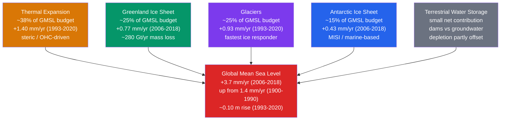

# Sea Level Rise and Ocean Mass Change

> [!abstract] TL;DR
> Global mean sea level (GMSL) has risen approximately **20 cm since 1900** and is now climbing at **3.7 mm/yr (2006–2018)** — more than twice the 20th-century average of 1.4 mm/yr. The modern rise has two physically distinct components: **steric rise** (water expanding as it warms, contributing ~38%) and **barystatic rise** (new mass entering the ocean from melting land ice — Greenland ~25%, glaciers ~25%, Antarctica ~15%). GRACE-FO satellites measure ice mass loss directly from orbit by tracking gravity anomalies. Regional sea level departs from the global mean by ±30% or more due to gravitational fingerprinting, glacial isostatic adjustment, and ocean circulation dynamics. IPCC AR6 projects **+0.32–0.62 m by 2100 under SSP1-2.6** and **+0.63–1.02 m under SSP5-8.5**, with a low-likelihood but high-impact tail exceeding **2 m** if marine ice sheet instabilities accelerate.

---

## Intuition

**Analogy:** Sea level rise is like filling a bathtub from two hoses simultaneously. One hose represents **thermal expansion** — it does not add more water, it simply heats the existing water so it physically occupies more space, and the level creeps up. The second hose carries meltwater from **glaciers and ice sheets on land**, genuinely adding new mass to the tub. For most of the 20th century, both hoses ran at a trickle. Now both are fully open and the drain (ice-age glaciation, which once removed water from the ocean) has nearly closed.

The tricky part is that this bathtub is not level: Earth's gravity, the rotation of the planet, and the rebounding crust all cause the waterline to rise higher in some places than others. Melt a chunk of the Greenland Ice Sheet and you weaken its gravitational pull on nearby ocean water — sea level paradoxically **falls** around Greenland and **rises faster than average** on coasts far away, like Miami or Mumbai. The sea-level budget is therefore the sum of global mean processes (thermal expansion, mass addition) modulated by spatially structured regional effects (GIA, geoid fingerprints, dynamic ocean circulation) that determine who actually gets their feet wet first.

---

## How It Works

### Core Mechanics

**1. Global Mean Sea Level (GMSL) trend and acceleration.**
Modern GMSL is measured by satellite radar altimetry since 1993 (TOPEX/Poseidon, Jason-1/2/3, Sentinel-6). Nerem et al. (2018) demonstrated that GMSL is not rising at a constant rate: the tide-gauge era (1900–1990) shows ~1.4 mm/yr, the altimetry era (1993–2018) averages ~3.1 mm/yr, and the most recent decade (2006–2018) reaches **3.7 mm/yr**. The acceleration (~0.084 mm/yr² from altimetry) means the 21st-century rate will be substantially higher than the 20th-century average.

**2. Sea level budget: steric and barystatic terms.**
Total GMSL change decomposes cleanly:

$$\Delta SL_\text{GMSL} = \underbrace{\Delta SL_\text{steric}}_{\text{thermal expansion + salinity}} + \underbrace{\Delta SL_\text{barystatic}}_{\text{mass addition: ice + land water}}$$

For the period 1993–2020 (AR6 Chapter 9):
- **Thermal expansion** (steric): ~1.40 mm/yr, ~38% of total rate. Dominated by ocean heat uptake; the deep ocean (~700–2000 m) is now absorbing heat that previously stayed in the surface mixed layer.
- **Greenland Ice Sheet**: ~0.77 mm/yr (2006–2018), ~25%. Driven by increased surface melt and discharge from accelerating outlet glaciers.
- **Glaciers and ice caps**: ~0.93 mm/yr, ~25%. The fastest-responding ice reservoir; essentially every mountain glacier on Earth is losing mass.
- **Antarctic Ice Sheet**: ~0.43 mm/yr (2006–2018), ~15%. The wildcard: large marine-based areas are vulnerable to instability; uncertainty range exceeds the central estimate.
- **Terrestrial water storage**: small and variable (±0.05–0.10 mm/yr). Dam impoundment reduces sea level; groundwater depletion adds to it; net effect is near zero but matters for budget closure.

**3. Sterodynamic sea level.**
The oceanographically precise term for what an altimeter measures is **sterodynamic sea level** — it combines the steric component (density changes from temperature and salinity) with the **dynamic sea level** (circulation-driven redistribution of water mass, e.g., from wind-driven gyres, AMOC variability, and geostrophic adjustment). Dynamic sea level changes can produce regional anomalies of ±10–20 cm, decoupled from the global thermal signal.

**4. GRACE and GRACE-FO: weighing ice from orbit.**
The twin GRACE satellites (2002–2017) and GRACE-FO (2018–present) fly in tandem ~220 km apart. When the lead satellite passes over a denser-than-average mass (e.g., an ice sheet), gravity accelerates it, changing the inter-satellite distance by as little as **1 micron**. Monthly maps of these range-rate changes resolve gravity anomalies into **mass redistribution** fields. Key application: Greenland has been losing **~280 Gt/yr of ice mass**, equivalent to ~0.77 mm of GMSL per year. The handy conversion is **~360 Gt of land ice = 1 mm of GMSL** (distributed over the 361 million km² ocean area).

**5. Regional variability: GIA, fingerprints, and dynamics.**
GMSL is a spatial average; local sea level can diverge significantly:
- **Glacial Isostatic Adjustment (GIA):** Crust formerly beneath ice sheets is still rebounding (Scandinavia rising ~8 mm/yr, Hudson Bay rising ~10 mm/yr). Peripheral forebulges are subsiding: the U.S. Mid-Atlantic coast sinks 0.5–1.5 mm/yr from this cause alone, stacking onto climate-driven rise.
- **Sea-level fingerprints:** Mass redistribution from melting ice changes Earth's gravity field and rotation axis. Greenland melt reduces the gravitational pull that currently holds ocean water toward it — sea level **falls** within ~2,000 km of Greenland and **rises above average** in the far field (Southern Hemisphere, North Pacific, Indo-Pacific). Each ice source has a unique spatial pattern ("fingerprint") that is observable from altimetry.
- **Human-induced subsidence:** In many deltaic cities (Jakarta, Bangkok, Ho Chi Minh City, Shanghai), groundwater extraction causes subsidence at **2–25 cm/yr** — far exceeding climate-driven GMSL rise and creating extreme **relative sea level rise** regardless of climate mitigation.

**6. AR6 projections under SSPs.**
IPCC AR6 (Fox-Kemper et al., 2021) provides likely ranges (17th–83rd percentile) for 2100 GMSL rise above 1995–2014 baseline:
- **SSP1-2.6 (strong mitigation):** +0.32–0.62 m (median ~0.44 m)
- **SSP2-4.5 (intermediate):** +0.44–0.76 m
- **SSP5-8.5 (high emissions):** +0.63–1.02 m (median ~0.77 m)
- **Low-likelihood, high-impact tail:** >1.5–2 m by 2100 if marine ice cliff instability (MICI) or other poorly understood Antarctic processes engage; AR6 assigns this a probability of less than 1% under SSP5-8.5 but does not rule it out.

### Flow / Architecture



---

## Key Concepts / Details

### Secondary Level

- **Two causes, one rising ocean.** Sea level is rising because of two simultaneous processes: warmer water **expands** (just as a liquid thermometer rises when heated), and ice sitting **on land** melts and flows into the sea, adding new mass. Sea ice floating in the ocean does not raise sea level when it melts — it already displaces its own weight, like ice in a glass of water.
- **The rate is accelerating.** In the early 20th century, seas rose at about 1.4 mm per year — roughly the width of a pencil lead annually. Today the rate is 3.7 mm/yr and increasing. Over a century, these millimetres add up to tens of centimetres that directly threaten low-lying coasts.
- **Not everyone faces the same risk.** The Maldives (average elevation ~1.2 m) and Tuvalu face existential risk. Bangladesh, with 17 million people living within 1 m of sea level, faces massive displacement if projections reach the high end.
- **It will not stop when we stop emissions.** The ocean and ice sheets take centuries to millennia to fully respond to atmospheric temperature. Even if greenhouse gas emissions stopped today, sea level would continue rising for centuries due to already-committed warming.
- **What satellites can see.** Since 1993, radar pulses bounced off the ocean surface from orbit have tracked global sea level to millimetre precision — making this one of the most precisely measured quantities in climate science.

### Undergraduate Level

- **Steric sea level from ocean heat content.** The thermal contribution to sea level is:
  $$\Delta SL_\text{steric} \approx \int_0^H \alpha(T,S,p)\,\Delta T\,dz$$
  where $\alpha$ is the thermal expansion coefficient (~$1.5 \times 10^{-4}\ \mathrm{K^{-1}}$ for surface waters, decreasing at depth) and $H$ is the depth of the warming signal. Integrating a 0.3 °C warming over the top 700 m gives ~0.032 m — the observed steric trend (1993–2020 ~0.044 m) requires including warming below 700 m.
- **Barystatic vs steric.** *Barystatic* sea level change arises from changes in **ocean mass** (new water from ice melt or terrestrial water). *Steric* change arises from density changes at constant mass. Altimetry measures both; GRACE measures mass only; their difference closes the budget.
- **GRACE measurement principle.** The primary observable is the **range rate** between the two spacecraft (about 220 km apart at 490 km altitude), measured by K-band microwave ranging to micron precision. Gravity gradients from mass anomalies cause measurable range-rate changes. After correcting for atmospheric pressure loading, ocean tides, and GIA, the residual signal is a monthly map of surface mass redistribution — typically expressed as equivalent water thickness.
- **Altimetry missions.** TOPEX/Poseidon (1992–2006) → Jason-1 (2001–2013) → Jason-2 (2008–2019) → Jason-3 (2016–present) → Sentinel-6 Michael Freilich (2020–present) form a continuous intercalibrated record. The orbit altitude is ~1,330 km; the radar pulse round-trip time resolves sea surface height to ~2–3 cm for a single pass, reduced to ~2–3 mm for the global mean after averaging millions of observations.
- **Storm surge amplification.** A storm surge of given intensity (wind speed, storm track) produces a higher water level when it rides on a higher baseline sea level. For Miami, New York, or Tokyo, even the 20 cm of 20th-century SLR has meaningfully increased the frequency of what were once rare flood levels — a phenomenon sometimes called "tidal flooding" or "sunny-day flooding."
- **Ice sheet dynamics: marine ice sheet instability (MISI).** The West Antarctic Ice Sheet (WAIS) is grounded on bedrock hundreds of metres below sea level, deepening inland ("retrograde bed"). The ice flux across the grounding line scales approximately as $Q_g \propto h_g^5$ (Schoof 2007), where $h_g$ is grounding-line thickness. Retreat into deeper water increases $h_g$, increases flux, and drives further retreat — a positive feedback with no stable intermediate equilibrium on a retrograde bed. This is MISI. Thwaites Glacier is the primary candidate.

### Graduate Level

- **Marine Ice Cliff Instability (MICI).** A more speculative amplifier proposed by DeConto & Pollard (2016): once ice shelves buttressing the WAIS are lost, exposed ice cliffs taller than ~90–100 m become mechanically unstable (ice tensile strength is ~100–400 kPa) and fail by calving, leaving an even taller cliff behind — a self-sustaining cascade. If operational, MICI could produce multi-metre SLR this century. However, the parameterisation is poorly constrained, and later work (Edwards et al., 2019; Clerc et al., 2021) suggests calving rates are much lower than original estimates. IPCC AR6 explicitly treats MICI as a "low-likelihood, high-impact" scenario, not a central projection. The controversy centres on whether ice cliff failure is controlled by cliff height alone or by bed geometry, strain rates, and hydrofracture — none of which are fully observed.
- **Sea-level fingerprints (gravitational, rotational, deformational effects — GRD).** When a land ice mass loses mass, three effects alter regional sea level: (1) **gravitational** — the gravitational attraction of the ice sheet on nearby ocean water weakens; (2) **rotational** — redistribution of mass changes Earth's rotation pole, altering the geoid globally; (3) **deformational** — the bedrock under the thinning ice sheet rebounds elastically. The combined effect is a spatially varying "fingerprint." Greenland melt preferentially raises sea level in the South Atlantic, Indian Ocean, and South Pacific by 10–30% above the GMSL average, while sea level near Greenland actually falls. Observing these fingerprints with altimetry allows attribution of which ice source is responsible for observed regional anomalies (Hay et al., 2015).
- **GIA correction in geodetic measurements.** Raw tide-gauge records measure *relative* sea level (RSL = GMSL − land motion). GIA causes land to rise in formerly glaciated areas (Canada, Scandinavia: up to +10 mm/yr) and to sink in peripheral forebulge zones (U.S. East Coast, Netherlands: −0.5 to −2 mm/yr). Satellite altimetry is absolute but measures the geoid, which itself changes due to GIA. A global GIA model (e.g., ICE-6G_C from Peltier et al., 2015) must be applied to both tide-gauge and GRACE records to isolate the climate signal; GIA uncertainty propagates into ice-sheet mass balance estimates at ~10–20 Gt/yr.
- **IPCC AR6 Chapter 9 SROCC framework.** AR6 uses a structured probabilistic framework for SLR projections: (a) a "likely range" from model ensembles (CMIP6 + ice sheet models); (b) a "broader likely range" extending into poorly sampled tails via expert elicitation; (c) explicit "low-likelihood, high-impact" (LLHI) branches quantified separately. The LLHI scenario (>1.5 m by 2100) cannot be excluded at the 99th percentile and drives adaptation planning for critical infrastructure (nuclear plants, flood defences). By 2150, AR6 puts the 95th percentile under SSP5-8.5 at ~2.3 m; the "plausible worst case" approaches ~5 m over centuries if WAIS collapses on multi-century timescales.
- **Committed sea-level rise and irreversibility.** Even full decarbonisation by 2050 would not stop SLR: thermal expansion continues for centuries as deep-ocean heat uptake equilibrates (ocean thermal inertia timescale ~1,000 years), and ice sheets commit to ongoing discharge for centuries after surface temperature stabilises. The concept of "sea-level commitment" at 1.5 °C (~0.5–1.0 m over the next 200 years) versus 2 °C (~1–2 m) frames adaptation as a problem of managing a process that cannot be halted, only slowed.

---

## Python Demo

```python
# Decompose and project global mean sea level:
# 1) Reconstruct GMSL 1993-2023 from synthetic stacked components
# 2) Project to 2100 under SSP1-2.6 and SSP5-8.5 with AR6 uncertainty bands
# Trends calibrated to approximate AR6 Chapter 9 / Slater et al. 2020 values.

import numpy as np
import matplotlib.pyplot as plt

# ---------------------------------------------------------------
# Part 1 — Observed component budget 1993-2023
# ---------------------------------------------------------------
years_obs = np.arange(1993, 2024)
t_obs = years_obs - 1993          # years since 1993

# Linear rates (mm/yr) and mild acceleration (mm/yr^2) per component
rate = {
    "Thermal Expansion": 1.40,
    "Greenland":         0.77,
    "Glaciers":          0.93,
    "Antarctica":        0.43,
    "Terrestrial Water": 0.06,
}
accel = {
    "Thermal Expansion": 0.007,
    "Greenland":         0.018,
    "Glaciers":          0.005,
    "Antarctica":        0.011,
    "Terrestrial Water": 0.001,
}
colors = ["#d97706", "#059669", "#7c3aed", "#2563eb", "#6b7280"]
names  = list(rate.keys())

# Cumulative rise per component (mm)
ts_obs = {k: rate[k]*t_obs + 0.5*accel[k]*t_obs**2 for k in names}
total_obs = sum(ts_obs.values())

# ---------------------------------------------------------------
# Part 2 — Projections 2024-2100
# ---------------------------------------------------------------
years_proj = np.arange(2024, 2101)
t_2020     = 2020 - 1993          # anchor to 2020 value

# Component values at 2020 anchor point
base = {k: rate[k]*t_2020 + 0.5*accel[k]*t_2020**2 for k in names}

# AR6 median 2100 targets per component (mm above 1993 zero), by scenario
target_126 = {"Thermal Expansion": 80,  "Greenland": 100,
              "Glaciers": 100,           "Antarctica":  70,
              "Terrestrial Water":  10}
target_585 = {"Thermal Expansion": 200, "Greenland": 250,
              "Glaciers": 160,           "Antarctica": 180,
              "Terrestrial Water":  20}

t_from_2020 = years_proj - 2020
frac = np.clip(t_from_2020 / 80.0, 0.0, 1.0)   # linear interp 2020 -> 2100

proj_126 = {k: base[k] + (target_126[k] - base[k]) * frac for k in names}
proj_585 = {k: base[k] + (target_585[k] - base[k]) * frac for k in names}

total_126 = sum(proj_126.values())
total_585 = sum(proj_585.values())

# AR6 likely-range half-widths (mm) growing linearly to 2100
unc_126 = np.interp(years_proj, [2024, 2100], [12, 150])
unc_585 = np.interp(years_proj, [2024, 2100], [12, 195])

# ---------------------------------------------------------------
# Plot
# ---------------------------------------------------------------
fig, axes = plt.subplots(1, 3, figsize=(17, 6), sharey=False)

# Panel 1: Observed stacked budget 1993-2023
ax = axes[0]
ax.stackplot(years_obs, [ts_obs[k] for k in names],
             labels=names, colors=colors, alpha=0.88)
ax.plot(years_obs, total_obs, "k--", lw=1.8, label="Total GMSL")
ax.set_title("Observed GMSL Budget\n1993–2023", fontsize=11, weight="bold")
ax.set_ylabel("Cumulative rise (mm)")
ax.set_xlabel("Year")
ax.legend(loc="upper left", fontsize=7.5)
ax.grid(alpha=0.3)

# Panel 2: SSP1-2.6
ax = axes[1]
ax.stackplot(years_proj, [proj_126[k] for k in names],
             labels=names, colors=colors, alpha=0.88)
ax.fill_between(years_proj, total_126 - unc_126, total_126 + unc_126,
                color="gray", alpha=0.25, label="AR6 likely range")
ax.set_title("SSP1-2.6 Projection\n2024–2100", fontsize=11, weight="bold")
ax.set_ylabel("Cumulative rise above 1993 (mm)")
ax.set_xlabel("Year")
ax.legend(loc="upper left", fontsize=7.5)
ax.grid(alpha=0.3)
ax.text(2095, total_126[-1] + unc_126[-1] + 10,
        f"{total_126[-1]:.0f} mm\n± {unc_126[-1]:.0f}",
        ha="right", fontsize=9, color="#dc2626", weight="bold")

# Panel 3: SSP5-8.5
ax = axes[2]
ax.stackplot(years_proj, [proj_585[k] for k in names],
             labels=names, colors=colors, alpha=0.88)
ax.fill_between(years_proj, total_585 - unc_585, total_585 + unc_585,
                color="gray", alpha=0.25, label="AR6 likely range")
ax.set_title("SSP5-8.5 Projection\n2024–2100", fontsize=11, weight="bold")
ax.set_ylabel("Cumulative rise above 1993 (mm)")
ax.set_xlabel("Year")
ax.legend(loc="upper left", fontsize=7.5)
ax.grid(alpha=0.3)
ax.text(2095, total_585[-1] + unc_585[-1] + 10,
        f"{total_585[-1]:.0f} mm\n± {unc_585[-1]:.0f}",
        ha="right", fontsize=9, color="#dc2626", weight="bold")

fig.suptitle("Global Mean Sea Level — Budget and Projections by Component",
             fontsize=13, weight="bold")
plt.tight_layout()
plt.savefig("gmsl_budget_projections.png", dpi=150)
plt.show()

# ---------------------------------------------------------------
# Console summary
# ---------------------------------------------------------------
print("=== Observed budget 1993-2023 ===")
print(f"  Total GMSL rise: {total_obs[-1]:.1f} mm")
for k in names:
    pct = ts_obs[k][-1] / total_obs[-1] * 100
    print(f"  {k:26s}: {ts_obs[k][-1]:5.1f} mm  ({pct:4.0f}%)")

print(f"\n=== 2100 projections (above 1993 baseline) ===")
print(f"  SSP1-2.6: {total_126[-1]:.0f} mm  =  {total_126[-1]/10:.1f} cm")
print(f"  SSP5-8.5: {total_585[-1]:.0f} mm  =  {total_585[-1]/10:.1f} cm")
print(f"  Ratio (SSP5.8.5 / SSP1.2.6): {total_585[-1]/total_126[-1]:.1f}x")
```

The three-panel output makes the budget decomposition and scenario divergence simultaneously visible. Panel 1 shows the warming-steric term (orange) dominating the early record, then the ice sheets (green, blue) growing in importance through 2023. Panels 2 and 3 show how that ordering flips under high emissions: under SSP5-8.5 the **Greenland** and **Antarctic** bands more than double relative to SSP1-2.6, turning the uncertainty question from a matter of tens of centimetres into a matter of over a metre — and the gray uncertainty envelope for Antarctica is the honest representation of what current science cannot resolve.

---

## Real-World Notes

- **Jakarta: subsidence + SLR = crisis.** Jakarta has been sinking up to **25 cm/yr** in its most affected northern districts from decades of groundwater extraction, even as climate-driven GMSL rise adds another ~3–4 mm/yr on top. The combined *relative* sea level rise is more than 60 times the global average signal — a reminder that human land-use choices often swamp the climate signal on local timescales. Indonesia is relocating its capital to Nusantara partly in response to Jakarta's flooding trajectory.

- **Miami Beach: engineered adaptation to sunny-day flooding.** Miami Beach experiences high-tide flooding several times a year with no storm at all — seawater wells up through porous limestone bedrock during king tides. The city has committed approximately **$500 million** to raise roads, install one-way drainage valves, and deploy pump stations. This is one of the first U.S. cities to budget explicitly for routine inundation as a baseline condition, not a rare emergency.

- **Bangladesh delta: 17 million people exposed.** The Ganges-Brahmaputra-Meghna delta hosts some of the world's densest coastal populations at elevations below 1 m. Under the AR6 median SSP5-8.5 scenario (~0.77 m by 2100), an estimated **17 million Bangladeshis** would be exposed to regular inundation, triggering one of the largest climate-driven migration events in history. The delta is also experiencing natural compaction and reduced sediment delivery from upstream dams — raising relative sea level independently of climate.

- **New Zealand: managed retreat as policy.** New Zealand became one of the first countries to formalise **managed retreat** (the planned, government-assisted relocation of communities from high-risk coastal zones) as a national policy tool in its 2023 Natural and Built Environment Act. Early pilots involve Māori communities on low-lying land. The policy acknowledges that engineering defences become economically indefensible above certain sea-level thresholds and that retreat must begin decades before the risk fully materialises.

- **Dutch Delta Programme: engineering at scale.** The Netherlands sits largely below sea level and has centuries of experience with water management. The current **Delta Programme** maintains dikes, surge barriers (Maeslantkering near Rotterdam), and sand replenishment of barrier islands. The programme explicitly uses AR6 projections with a safety margin to the 99th percentile of SLR scenarios, designing for up to **1–1.5 m of additional rise** by 2100. It represents the gold standard of engineered adaptation — though engineers acknowledge even Dutch infrastructure has physical and financial limits around 2–3 m of additional rise.

---

## Common Pitfalls

- **Assuming SLR is uniform globally.** Sea level rise is not like filling a bathtub evenly. Regional variability of **±20–30%** around the global mean is the norm, not the exception, driven by GIA (land motion), gravitational fingerprints of ice melt, and dynamic sea level from circulation changes. New York City's sea level rise exceeds the global mean partly because the ancient Laurentide forebulge is subsiding; Jakarta's dwarfs it due to groundwater extraction. Always specify *relative* vs *absolute* sea level when discussing local impacts.

- **Treating Greenland and Antarctica as certain contributions.** The thermal expansion term is relatively well constrained (±~20%). The ice sheet terms are not: Antarctic dynamic contributions carry an uncertainty range nearly as large as the central estimate. Marine Ice Sheet Instability adds a non-linear tail; Marine Ice Cliff Instability adds a further speculative layer. Projections that show only a median value for ice sheets are hiding the most important uncertainty in sea-level science.

- **Ignoring subsidence when comparing local observations to GMSL.** Tide-gauge records measure *relative* sea level — the combination of sea-level change and vertical land motion. Cities built on sediment (New Orleans, Jakarta, Bangkok, Ho Chi Minh City) are subsiding at rates that are **10–100× greater** than GMSL rise. Comparing raw tide-gauge trends to satellite altimetry without applying a vertical land motion correction leads to apparent budget mismatches and underestimates the actual local hazard.

- **Conflating sea-ice loss with sea-level rise.** Arctic sea ice loss is visually dramatic and scientifically important (ice-albedo feedback, ecosystem impacts), but floating sea ice does not raise sea level when it melts — it already displaces its own weight. The sea-level-relevant loss is **land ice only**: glaciers, the Greenland Ice Sheet, and the Antarctic Ice Sheet. Confusing the two categories leads to both over- and under-estimation of the problem in different contexts.

- **Assuming mitigation stops sea-level rise immediately.** Even under the most aggressive emissions reduction, thermal expansion continues for **centuries** (ocean thermal inertia) and ice sheets continue discharging for **centuries to millennia** after temperatures stabilise. The policy-relevant insight is that mitigation reduces the *eventual* rise and limits the rate, but sea-level rise cannot be "turned off" on human policy timescales. Every fraction of a degree of warming avoided reduces the long-term committed rise.

---

## Related Concepts

**Same vault:**
- [[Thermohaline_Circulation_and_AMOC]] — AMOC variability drives dynamic sea level anomalies along the U.S. East Coast; Greenland meltwater freshening threatens AMOC stability, creating a feedback loop between SLR and circulation change.
- [[Ocean_Heat_Content_and_Marine_Heatwaves]] — thermal expansion (the steric term) is the direct expression of ocean heat uptake; quantifying OHC trend is equivalent to quantifying the steric sea-level contribution.
- [[Arctic_and_Antarctic_Oceans]] — the polar source regions for NADW and AABW formation; basal melting of Antarctic ice shelves and Greenland calving are the primary barystatic contributors to SLR.
- [[Future_Ocean_Climate_Projections]] — the CMIP6 and ice-sheet model ensemble framework underpinning all SSP-based SLR projections discussed here.
- [[Coastal_Circulation_and_Estuaries]] — rising sea levels alter tidal dynamics, salinity intrusion, and coastal morphology in estuaries; SLR is the baseline context for all coastal process projections.
- [[_MOC_Ocean_and_Climate]] — section map for the Ocean and Climate unit of this vault.

**Cross-vault:**
- [[Sea_Level_Rise_and_the_Cryosphere]] — the cryosphere-focused perspective on the same phenomenon: ice sheet physics, sea-ice albedo feedback, permafrost carbon, and MISI/MICI instabilities from the climatology vault.
- [[Anthropogenic_Climate_Change]] — the CO₂-driven warming that forces all components of the sea-level budget; SLR is the most geographically committed long-term impact of anthropogenic emissions.
- [[Glaciers_and_Glacial_Landscapes]] — glacier mass balance, equilibrium-line altitude, and calving physics underlying the ~25% glacier contribution to modern GMSL rise.
- [[Climate_Sensitivity_and_Feedbacks]] — equilibrium climate sensitivity determines how much long-term thermal expansion and ice-sheet melt are committed per degree of warming; sea-level projections are highly sensitive to ECS tails.
- [[_MOC_Meteorology_Master]] — entry point for the atmospheric science and climate system vault; SSP scenarios and climate projections live here.
- [[_MOC_Earth_Science_Master]] — entry point for Earth sciences; GIA, geoid, and isostasy (bedrock response to ice unloading) are core geophysics topics that underpin regional SLR variability.

---

## Review Questions

### Secondary Level

1. The ocean is rising because of two simultaneous processes. Name them and explain why only one of them involves water actually entering the ocean. Which process is responsible for the largest fraction of current sea-level rise?
2. If the Maldives has an average elevation of about 1.2 m and sea level rises 0.5 m by 2100, does that mean the Maldives is safe? What factors other than global mean sea level affect how much coastal flooding they actually experience?
3. Why is it misleading to say "sea level is rising 3.7 mm per year everywhere"? Name two reasons why the actual rise can be much higher or lower at a specific coastline.

### Undergraduate Level

1. The thermal expansion coefficient of seawater near the surface is approximately $\alpha = 1.5 \times 10^{-4}\ \mathrm{K^{-1}}$. Estimate the steric sea-level contribution from warming the top 700 m of ocean by 0.4 °C. How does this compare to the observed steric contribution of ~44 mm from 1993 to 2020, and what does the discrepancy tell you about where ocean warming is occurring?
2. Explain the GRACE satellite measurement principle from first principles: what is the observable, how is it converted to a gravity anomaly, and what subsequent steps are needed to isolate Greenland ice-mass loss from other signals? Include the approximate conversion factor between gigatonnes of ice and millimetres of GMSL.
3. A city lies on a river delta and has been extracting groundwater for 50 years at a rate that causes 15 mm/yr of land subsidence. The global mean sea-level trend is 3.7 mm/yr. What is the *relative* sea-level rise this city experiences? Why is comparing this to the global average misleading when designing flood defences?

### Graduate Level

1. The ice flux across a marine ice sheet grounding line is described by $Q_g \propto h_g^n$ with $n \approx 5$ (Schoof 2007). Using this scaling, explain quantitatively why a grounding line on a retrograde bed (deepening inland) is unconditionally unstable, and why there is no stable intermediate equilibrium. What physical mechanism(s) could arrest retreat before complete ice sheet collapse?
2. Sea-level "fingerprints" arise from gravitational, rotational, and deformational (GRD) effects. Sketch qualitatively the fingerprint pattern expected from accelerated Greenland mass loss: where does sea level rise more than the GMSL average, where does it rise less, and where might it actually fall? How could observations of this fingerprint from altimetry constrain the attribution of GMSL acceleration to specific ice sources?
3. IPCC AR6 treats >1.5 m of SLR by 2100 as a "low-likelihood, high-impact" outcome rather than incorporating it into the likely range. Critically evaluate this framing: what are the scientific justifications for a separate LLHI branch, what are the risks of this communication strategy for infrastructure adaptation planning, and how does the treatment of deep structural uncertainty in ice sheet models differ from the treatment of well-characterised physical uncertainty in thermal expansion projections?

---

## Sources

- [Fox-Kemper, B. et al. (2021). "Ocean, Cryosphere and Sea Level Change." *IPCC AR6 WGI Chapter 9.* Cambridge University Press.](https://www.ipcc.ch/report/ar6/wg1/chapter/chapter-9/)
- [Oppenheimer, M. et al. (2019). "Sea Level Rise and Implications for Low-Lying Islands, Coasts and Communities." *IPCC SROCC Chapter 4.* Cambridge University Press.](https://www.ipcc.ch/srocc/chapter/chapter-4-sea-level-rise-and-implications-for-low-lying-islands-coasts-and-communities/)
- [Nerem, R.S. et al. (2018). "Climate-change-driven accelerated sea-level rise detected in the altimeter era." *PNAS*, 115(9), 2022–2025.](https://doi.org/10.1073/pnas.1717312115)
- [Slater, T. et al. (2020). "Review article: Earth's ice imbalance." *The Cryosphere*, 15, 233–246.](https://doi.org/10.5194/tc-15-233-2021)
- [Bamber, J.L. et al. (2019). "Ice sheet contributions to future sea-level rise from structured expert judgment." *PNAS*, 116(23), 11195–11200.](https://doi.org/10.1073/pnas.1817205116)

---

#Oceanography #OceanClimate #SeaLevelRise #ThermalExpansion #IceSheetMelting
