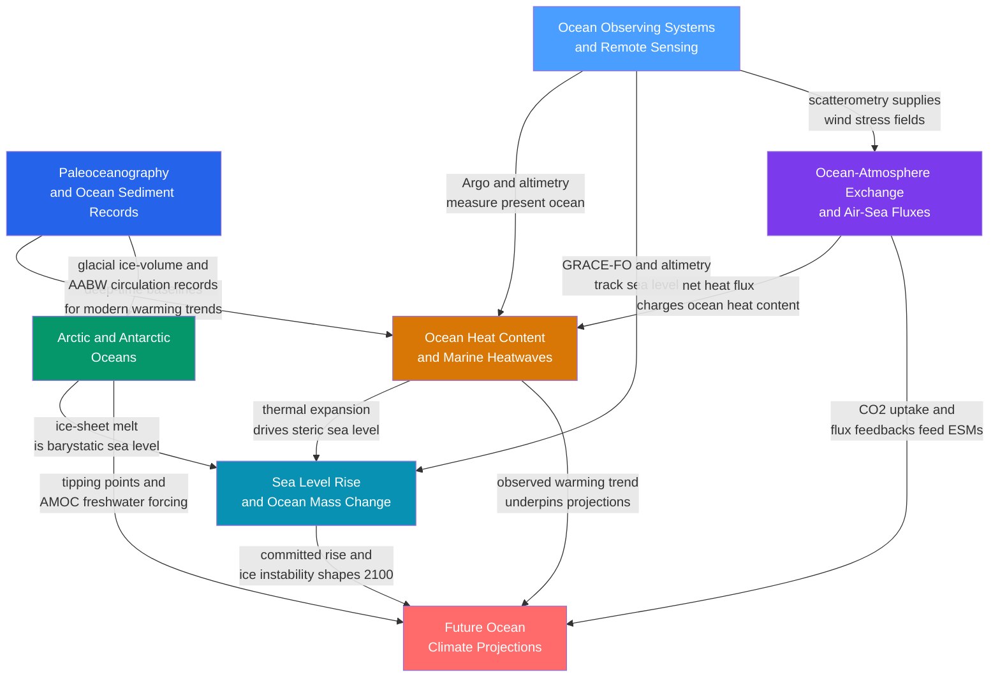

# Ocean and Climate — Map of Content

> [!info] How to use this map
> Start with **Fundamentals**, follow the arrows, and use the Learning Path below as your guide.
> Each node links to a full note. Come back to this map when you feel lost.

---

## Overview

This section sits at the junction of ocean physics, ocean chemistry, and the global climate system. Two foundational streams feed into it: the **observational** stream — learning how modern instruments and satellites measure the ocean — and the **historical** stream — learning how geochemists decode ocean conditions from sediment cores reaching back tens of millions of years. From those twin foundations, four interlocking process pillars emerge: the **heat budget** of the ocean and its marine heatwave expression; the **sea-level budget** decomposed into thermal expansion and ice-mass loss; the **air-sea exchange** of momentum, heat, and CO₂ that couples ocean and atmosphere; and the **polar oceans**, where sea-ice physics, brine-driven deep-water formation, and ice-sheet instability amplify and transmit climate signals globally. All four pillars converge in the capstone note on **future projections**, where CMIP6 multi-model ensembles translate emission pathways into probabilistic envelopes of ocean warming, stratification increase, acidification, deoxygenation, and tipping-point risk through 2100 and beyond. Reading through this section provides both the quantitative literacy to interpret observed ocean change and the physical intuition to evaluate what current trajectories imply for ecosystems, sea level, and the planetary energy budget.

---

## Concept Map

*(Blue = foundational observing and historical reconstruction; orange-teal-purple-green = process pillars; red = advanced capstone synthesis; arrows show primary conceptual dependencies)*

---

## Learning Path

*Recommended order for a first pass through this section:*

1. [[Ocean_Observing_Systems_and_Remote_Sensing]] — Begin here to understand *how we know what we know*: Argo floats, satellite altimetry, SST sensors, scatterometry, GRACE-FO, and GOOS data assembly. Every quantitative claim in the later notes rests on one of these platforms.

2. [[Paleoceanography_and_Ocean_Sediment_Records]] — The second foundation: foraminifera, the LR04 benthic δ¹⁸O stack, Mg/Ca thermometry, UK'₃₇ SST proxies, ²³¹Pa/²³⁰Th as an AMOC tracer, and the PETM and Heinrich events. Establishes the millions-of-years context that makes modern trends legible.

3. [[Ocean_Atmosphere_Exchange_and_Air_Sea_Fluxes]] — Learn the bulk aerodynamic formulae, the Wanninkhof piston-velocity for CO₂, and the Bowen ratio before tackling heat budgets. The coupling mechanism between ocean and atmosphere is the logical gateway to understanding why the ocean absorbs so much heat and carbon.

4. [[Ocean_Heat_Content_and_Marine_Heatwaves]] — Armed with the observing-system and flux context, explore how 90-plus percent of Earth's energy imbalance enters and accumulates in the ocean, how OHC is computed from Argo profiles, and how heat concentrated near the surface produces marine heatwaves.

5. [[Sea_Level_Rise_and_Ocean_Mass_Change]] — Decompose the sea-level budget into its steric thermal-expansion term — directly linked to OHC — and its barystatic ice-melt terms quantified by GRACE-FO. Cover gravitational fingerprints, GIA, and IPCC AR6 projections.

6. [[Arctic_and_Antarctic_Oceans]] — Move to the poles, where the ice-albedo feedback amplifies warming at four times the global rate, where brine rejection forges the densest water in the ocean, and where the Antarctic Circumpolar Current distributes that water globally. These polar processes feed freshwater into AMOC and meltwater into the sea-level budget.

7. [[Future_Ocean_Climate_Projections]] — Capstone synthesis: how CMIP6 Earth System Models translate SSP emission pathways into projections of SST rise, stratification increase, NPP decline, deoxygenation, acidification, AMOC slowdown, and tipping-point risk — drawing on every thread from the previous six notes.

---

## All Notes in This Section

| Note | Key Concept | Level Range |
|------|-------------|-------------|
| [[Ocean_Observing_Systems_and_Remote_Sensing]] | Argo floats, satellite altimetry, scatterometry, GRACE-FO, and GOOS integration form the backbone of modern ocean science | Undergraduate → Graduate |
| [[Paleoceanography_and_Ocean_Sediment_Records]] | The LR04 benthic δ¹⁸O stack, Mg/Ca and UK'₃₇ proxies, εNd, Pa/Th, PETM, and Heinrich events reconstruct ocean state across millions of years | Secondary → Graduate |
| [[Ocean_Heat_Content_and_Marine_Heatwaves]] | The ocean stores 90-plus percent of Earth's energy imbalance; Argo profiles track OHC accumulation; marine heatwaves arise when surface heat anomalies exceed the 90th-percentile threshold for five or more consecutive days | Secondary → Graduate |
| [[Sea_Level_Rise_and_Ocean_Mass_Change]] | GMSL rise decomposes into steric thermal expansion at 38 percent and barystatic contributions from ice melt; GRACE-FO weighs ice loss from orbit; regional sea level diverges from the global mean via gravitational fingerprints and GIA | Secondary → Graduate |
| [[Ocean_Atmosphere_Exchange_and_Air_Sea_Fluxes]] | Bulk aerodynamic formulae parameterise sensible heat, latent heat, and momentum exchange; the Wanninkhof quadratic formula governs CO₂ piston velocity; air-sea fluxes drive tropical cyclones and the AMOC buoyancy budget | Secondary → Graduate |
| [[Arctic_and_Antarctic_Oceans]] | Sea-ice brine rejection forms Antarctic Bottom Water; the ice-albedo feedback drives Arctic amplification at four times the global warming rate; the ACC distributes newly formed water masses globally | Secondary → Graduate |
| [[Future_Ocean_Climate_Projections]] | CMIP6 under SSP scenarios projects SST rises of 1.4 to 3.5 degrees C, 20 to 40 percent stratification increase, NPP decline of 2 to 10 percent globally, acidification, deoxygenation, 15 to 35 percent AMOC weakening, and coral-reef tipping point above 1.5 degrees C | Secondary → Graduate |

---

## Key Questions This Section Answers

- How do modern observing platforms — Argo floats, radar altimeters, GRACE-FO satellites, and moored arrays — work together to measure the global ocean in near-real time, and what blind spots remain?
- How can geochemists reconstruct ocean temperature, circulation, and atmospheric CO₂ millions of years into the past from the chemistry of microscopic fossils buried in sediment cores?
- How much of Earth's excess greenhouse energy has entered the ocean since 1971, how is this heat distributed with depth, and what triggers a marine heatwave when that energy resurfaces locally?
- What are the distinct physical causes of global mean sea-level rise, how large is each contribution, and why does the sea surface rise faster in some regions than others?
- What equations govern the exchange of momentum, heat, and CO₂ across the air-sea interface, and why does doubling wind speed quadruple gas exchange rates and momentum transfer?
- How do the Arctic and Southern Oceans regulate the planet's heat and carbon budgets, and what happens when sea ice retreats, brine rejection weakens, and ice sheets lose mass?
- What do CMIP6 Earth System Models project for ocean temperature, biological productivity, oxygen content, and circulation under low- and high-emission pathways through 2100, and which tipping points are closest to their thresholds?

---

## Connections to Other Topics

- [[_MOC_Oceanography_Master]] — parent vault; this section is the climate-change-facing capstone of the Oceanography knowledge base, drawing on water-mass, circulation, and biogeochemistry sections
- [[_MOC_Meteorology_Master]] — atmosphere-ocean coupling, climate variability, ENSO, tropical cyclones, and the SSP emission scenarios that force the ocean projections discussed throughout this section
- [[_MOC_Physics_Master]] — thermodynamics of ocean heat storage, electromagnetic radiation principles underlying remote sensing, fluid mechanics of air-sea boundary layers and geostrophic flow, classical mechanics of satellite orbit determination
- [[_MOC_Earth_Science_Master]] — glaciology and ice-sheet dynamics behind barystatic sea-level rise, paleoclimate and sedimentary geology underpinning sediment-core chronology, isostasy and GIA that distort regional sea-level signals
- [[_MOC_SS_Master]] — Fourier analysis and spectral methods applied to altimeter waveform retracking, along-track SSH wavenumber spectra, Argo profile noise filtering, and ocean time-series decomposition

---

#MOC #Oceanography #OceanAndClimate
