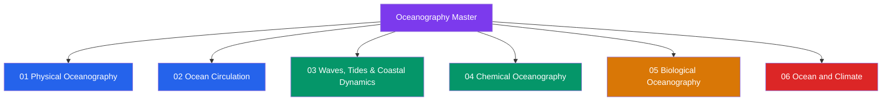

# Oceanography — Master Map of Content

> [!abstract] About This Vault
> A comprehensive oceanography reference spanning **senior secondary through graduate level** — **~38 notes across 6 sections**. Every note opens with an accessible entry point, builds through undergraduate theory and quantitative treatment, and reaches graduate depth with research frontiers. Sections cover **Physical Oceanography**, **Ocean Circulation**, **Waves, Tides and Coastal Dynamics**, **Chemical Oceanography**, **Biological Oceanography**, and **Ocean and Climate** — from the thermodynamic equation of state that governs seawater density, through the wind-driven and thermohaline engines that circulate the ocean, across the mechanical spectrum of waves and tides, into the chemical cycles that make the ocean Earth's largest active carbon reservoir, up through the marine food web from phytoplankton to fisheries, and out to the observational and modelling science that projects how the ocean will change under anthropogenic forcing. Each note grounds the oceanography in the underlying physics ([[_MOC_Physics_Master|Physics]]) and chemistry ([[_MOC_Chemistry_Master|Chemistry]]), and connects to [[_MOC_Earth_Science_Master|Earth Science]], [[_MOC_Meteorology_Master|Meteorology]], [[_MOC_Astronomy_Master|Astronomy]], and [[_MOC_SS_Master|Signals and Systems]], with real observations, worked calculations, and tiered review questions.

## Vault Architecture

## Sections at a Glance

| # | Section | Notes | Entry Point | Level Range |
|---|---------|-------|-------------|-------------|
| 01 | Physical Oceanography | 6 | [[_MOC_Physical_Oceanography]] | Secondary → Graduate |
| 02 | Ocean Circulation | 6 | [[_MOC_Ocean_Circulation]] | Secondary → Graduate |
| 03 | Waves, Tides and Coastal Dynamics | 6 | [[_MOC_Waves_Tides_Coastal]] | Secondary → Graduate |
| 04 | Chemical Oceanography | 6 | [[_MOC_Chemical_Oceanography]] | Secondary → Graduate |
| 05 | Biological Oceanography | 7 | [[_MOC_Biological_Oceanography]] | Secondary → Graduate |
| 06 | Ocean and Climate | 7 | [[_MOC_Ocean_and_Climate]] | Secondary → Graduate |

---

## Section Contents

**01 — Physical Oceanography** — [[_MOC_Physical_Oceanography]]
- [[Seawater_Properties_and_Equation_of_State]]
- [[Temperature_Salinity_Diagrams_and_Water_Masses]]
- [[Density_Stratification_and_Mixing]]
- [[Turbulence_and_Diapycnal_Mixing]]
- [[Ocean_Acoustics_and_Underwater_Sound]]
- [[Ocean_Optics_and_Light_Penetration]]

**02 — Ocean Circulation** — [[_MOC_Ocean_Circulation]]
- [[Ekman_Transport_and_Coastal_Upwelling]]
- [[Wind_Driven_Circulation_and_Sverdrup_Balance]]
- [[Western_Boundary_Currents_and_Gulf_Stream]]
- [[Thermohaline_Circulation_and_AMOC]]
- [[Deep_Ocean_Circulation_and_Abyssal_Flow]]
- [[Mesoscale_Eddies_and_Ocean_Variability]]

**03 — Waves, Tides and Coastal Dynamics** — [[_MOC_Waves_Tides_Coastal]]
- [[Surface_Gravity_Waves]]
- [[Tides_and_Tidal_Dynamics]]
- [[Internal_Waves_and_Solitons]]
- [[Tsunamis_and_Storm_Surges]]
- [[Coastal_Circulation_and_Estuaries]]
- [[Beach_Processes_and_Sediment_Transport]]

**04 — Chemical Oceanography** — [[_MOC_Chemical_Oceanography]]
- [[Seawater_Composition_and_Major_Ions]]
- [[Nutrient_Cycles_and_Trace_Elements]]
- [[The_Oceanic_Carbon_Cycle]]
- [[Dissolved_Oxygen_and_Redox_Chemistry]]
- [[Ocean_Acidification]]
- [[Hydrothermal_Vents_and_Seafloor_Chemistry]]

**05 — Biological Oceanography** — [[_MOC_Biological_Oceanography]]
- [[Marine_Primary_Production_and_Phytoplankton]]
- [[Zooplankton_and_Marine_Food_Webs]]
- [[The_Biological_Pump_and_Carbon_Export]]
- [[Deep_Sea_Ecology]]
- [[Coral_Reefs_and_Tropical_Marine_Ecosystems]]
- [[Harmful_Algal_Blooms_and_Dead_Zones]]
- [[Marine_Fisheries_and_Ocean_Resources]]

**06 — Ocean and Climate** — [[_MOC_Ocean_and_Climate]]
- [[Ocean_Observing_Systems_and_Remote_Sensing]]
- [[Paleoceanography_and_Ocean_Sediment_Records]]
- [[Ocean_Atmosphere_Exchange_and_Air_Sea_Fluxes]]
- [[Ocean_Heat_Content_and_Marine_Heatwaves]]
- [[Sea_Level_Rise_and_Ocean_Mass_Change]]
- [[Arctic_and_Antarctic_Oceans]]
- [[Future_Ocean_Climate_Projections]]

---

## Learning Paths

### Path 1 — Senior Secondary Student
> Best for: grades 11–12 building an accessible foundation across all dimensions of the ocean.

[[Seawater_Properties_and_Equation_of_State]] → [[Ocean_Optics_and_Light_Penetration]] → [[Ekman_Transport_and_Coastal_Upwelling]] → [[Surface_Gravity_Waves]] → [[Tides_and_Tidal_Dynamics]] → [[Seawater_Composition_and_Major_Ions]] → [[The_Oceanic_Carbon_Cycle]] → [[Marine_Primary_Production_and_Phytoplankton]] → [[Ocean_Heat_Content_and_Marine_Heatwaves]] → [[Sea_Level_Rise_and_Ocean_Mass_Change]]

### Path 2 — Physical Oceanography Track
> Seawater physics through stratification, circulation, and wave dynamics — the fluid-mechanical spine of oceanography.

[[Seawater_Properties_and_Equation_of_State]] → [[Temperature_Salinity_Diagrams_and_Water_Masses]] → [[Density_Stratification_and_Mixing]] → [[Turbulence_and_Diapycnal_Mixing]] → [[Ekman_Transport_and_Coastal_Upwelling]] → [[Wind_Driven_Circulation_and_Sverdrup_Balance]] → [[Western_Boundary_Currents_and_Gulf_Stream]] → [[Thermohaline_Circulation_and_AMOC]] → [[Deep_Ocean_Circulation_and_Abyssal_Flow]] → [[Internal_Waves_and_Solitons]]

### Path 3 — Marine Chemistry and Biology Track
> From seawater composition through the carbon and nutrient cycles to the biological pump and ocean ecology.

[[Seawater_Composition_and_Major_Ions]] → [[Nutrient_Cycles_and_Trace_Elements]] → [[The_Oceanic_Carbon_Cycle]] → [[Dissolved_Oxygen_and_Redox_Chemistry]] → [[Ocean_Acidification]] → [[Hydrothermal_Vents_and_Seafloor_Chemistry]] → [[Marine_Primary_Production_and_Phytoplankton]] → [[Zooplankton_and_Marine_Food_Webs]] → [[The_Biological_Pump_and_Carbon_Export]] → [[Deep_Sea_Ecology]]

### Path 4 — Ocean-Climate Track
> The ocean as Earth's climate regulator — air-sea coupling, heat storage, sea level, polar amplification, and future projections.

[[Ocean_Atmosphere_Exchange_and_Air_Sea_Fluxes]] → [[Ocean_Heat_Content_and_Marine_Heatwaves]] → [[Sea_Level_Rise_and_Ocean_Mass_Change]] → [[Arctic_and_Antarctic_Oceans]] → [[Thermohaline_Circulation_and_AMOC]] → [[Paleoceanography_and_Ocean_Sediment_Records]] → [[Future_Ocean_Climate_Projections]]

### Path 5 — Coastal and Applied Track
> The ocean at its margins — wave mechanics, tidal dynamics, hazards, estuarine circulation, beach processes, and modern observing systems.

[[Surface_Gravity_Waves]] → [[Tides_and_Tidal_Dynamics]] → [[Tsunamis_and_Storm_Surges]] → [[Coastal_Circulation_and_Estuaries]] → [[Beach_Processes_and_Sediment_Transport]] → [[Ekman_Transport_and_Coastal_Upwelling]] → [[Ocean_Observing_Systems_and_Remote_Sensing]]

---

## Cross-Vault Links

Oceanography integrates fluid physics, chemistry, Earth history, atmospheric science, and quantitative methods — it is one of the most interdisciplinary fields in the natural sciences:

- **Physics** — [[_MOC_Physics_Master]]: fluid mechanics (Navier-Stokes, geostrophic balance, Ekman spiral, shallow-water equations) and rotating-frame dynamics underpin every section of this vault; thermodynamics and the TEOS-10 Gibbs potential define the equation of state in Section 01; classical wave mechanics (dispersion relations, Snell's law, group velocity) govern Sections 01 and 03; electromagnetic radiation theory underlies ocean acoustics, optics, and satellite remote sensing in Sections 01 and 06.
- **Chemistry** — [[_MOC_Chemistry_Master]]: seawater composition, major-ion residence times, and carbonate acid-base equilibria are the direct subject of Section 04; Henry's law and gas-exchange thermodynamics govern CO₂ uptake; redox chemistry organises the oxygen minimum zone and hydrothermal vent chemistry; Physical Chemistry underpins the TEOS-10 Gibbs formulation of seawater thermodynamics.
- **Earth Science** — [[_MOC_Earth_Science_Master]]: seafloor geology and mid-ocean ridge spreading set the tectonic context for hydrothermal vents and deep circulation pathways; coastal geomorphology and fluvial sediment supply link to beach and estuary dynamics in Section 03; glaciology and ice-sheet dynamics directly drive the barystatic component of sea-level rise in Section 06; sedimentary geology and radiometric chronology underpin the palaeoceanographic record.
- **Meteorology** — [[_MOC_Meteorology_Master]]: the trade winds, westerlies, and subtropical highs that force the gyres in Section 02 are products of the general atmospheric circulation; the air-sea bulk formulae and ENSO dynamics that modulate upwelling, heat flux, and CO₂ exchange connect Sections 02, 04, and 06 directly to the Meteorology vault; SSP emission scenarios that drive future ocean projections originate in atmospheric science.
- **Astronomy** — [[_MOC_Astronomy_Master]]: the differential gravitational potential of the Moon and Sun generates the entire tidal-constituent spectrum covered in Section 03; the measured 3.82 cm/yr lunar recession is a direct consequence of tidal energy dissipation in the ocean; Milankovitch orbital cycles pacing the ice ages appear in the palaeoceanographic record in Section 06.
- **Signals and Systems** — [[_MOC_SS_Master]]: Fourier spectral analysis is the engine of ocean wave-spectrum characterisation (JONSWAP in Section 03), along-track altimeter SSH wavenumber spectra, Argo profile noise filtering, and the spectral decomposition of ocean time series in Section 06; matched filtering and signal detection theory underlie sonar and acoustic thermometry in Section 01.

---

## Section MOC Index

- [[_MOC_Physical_Oceanography]] — the physical state of seawater: the TEOS-10 equation of state, T-S water-mass fingerprinting, density stratification and the pycnocline, turbulence and diapycnal mixing, underwater acoustics and the SOFAR channel, and ocean optics and the euphotic zone.
- [[_MOC_Ocean_Circulation]] — how the ocean moves: Ekman transport and coastal upwelling, Sverdrup balance and wind-driven gyres, western boundary currents and the Gulf Stream, thermohaline overturning and AMOC, abyssal flow and the Stommel-Arons theory, and mesoscale eddies and geostrophic turbulence.
- [[_MOC_Waves_Tides_Coastal]] — the mechanical spectrum of ocean motions: surface gravity waves and the JONSWAP spectrum, tidal dynamics and basin resonance, internal waves and diapycnal mixing, tsunamis and storm-surge hazards, estuarine circulation and the Hansen-Rattray framework, and beach processes and the Bruun-Rule response to sea-level rise.
- [[_MOC_Chemical_Oceanography]] — the dissolved ocean: conservative major ions and Marcet's principle, the nutrient cycles and Redfield stoichiometry, the oceanic carbon cycle and the Revelle factor, oxygen minimum zones and the redox ladder, ocean acidification and aragonite saturation, and hydrothermal vents as geological sources and sinks.
- [[_MOC_Biological_Oceanography]] — life in the ocean: phytoplankton primary production and the critical depth hypothesis, zooplankton food webs and trophic efficiency, the biological pump and the Martin curve, deep-sea ecology and chemosynthetic ecosystems, coral reef bleaching and acidification, harmful algal blooms and dead zones, and marine fisheries and maximum sustainable yield.
- [[_MOC_Ocean_and_Climate]] — the ocean and Earth's climate: observing systems and remote sensing, palaeoceanographic proxies in sediment cores, air-sea heat and CO₂ fluxes, ocean heat content and marine heatwaves, the sea-level budget from thermal expansion and ice melt, polar ocean amplification and AMOC freshwater forcing, and CMIP6 projections through 2100.

#MOC #Oceanography #MasterMOC
