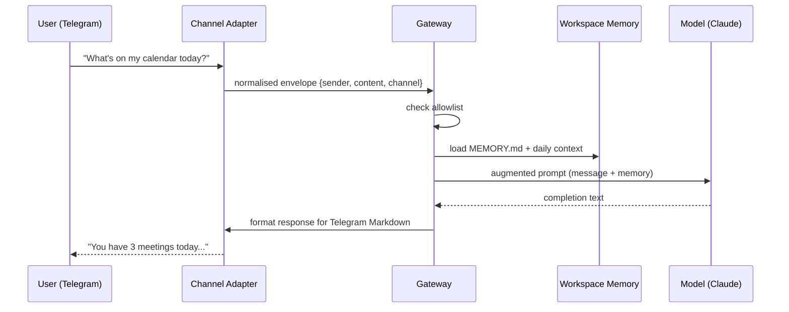

# OpenClaw Channels

> [!abstract] TL;DR
> Channels are OpenClaw's integrations with messaging platforms. You add them with `openclaw channels add --channel <name>`, each requires platform-specific credentials (bot token, webhook URL, etc.), and you control who can interact with your assistant via per-channel sender allowlists. A single OpenClaw install can serve multiple channels simultaneously.

---

## What Channels Are

A **channel** is an adapter that translates between a messaging platform's native protocol and OpenClaw's internal message format. When a message arrives on, say, Telegram, the Telegram channel adapter normalises it into a standard envelope (sender, content, timestamp, channel ID) and forwards it to the gateway. The gateway enriches the prompt with workspace context, calls the model, and sends the response back through the same channel adapter.

Channels are **bidirectional** — they receive incoming messages and send outgoing responses. Some channels also support rich formatting (Slack Block Kit, Telegram Markdown) which OpenClaw uses automatically when the channel supports it.

---

## Supported Channels

| Channel | OS requirement | Setup mechanism | Rich formatting | Notes |
|---------|---------------|-----------------|-----------------|-------|
| **Telegram** | Any | Telegram Bot API token | Markdown v2 | Easiest to set up; works from any Linux VPS |
| **Slack** | Any | Slack App (OAuth) | Block Kit | Requires workspace admin; best for teams |
| **Discord** | Any | Discord Bot token | Markdown | Works in DMs and channels |
| **WhatsApp** | Any (via bridge) | Meta Cloud API or Baileys | Basic | Meta API requires business account |
| **Signal** | Linux/macOS | signal-cli bridge | Basic | Most private; setup is most complex |
| **iMessage** | macOS only | Bluebubbles / AppleScript | Basic | Requires macOS machine; not possible on Linux VPS alone |

---

## Adding a Channel

```bash
# Generic add command (interactive)
openclaw channels add --channel <name>

# Examples
openclaw channels add --channel telegram
openclaw channels add --channel slack
openclaw channels add --channel discord
openclaw channels add --channel signal
```

The CLI walks you through the required credentials for each channel. After adding, verify with:

```bash
openclaw channels status --probe
```

`--probe` sends a live test message to confirm the connection is working end-to-end.

---

## Telegram Setup (Detailed Example)

```bash
openclaw channels add --channel telegram
# Prompt: "Enter your Telegram Bot API token:"
# Get token from @BotFather → /newbot
# Enter: 7123456789:AAF...

# After adding, start a conversation with your bot on Telegram
# OpenClaw will show you the sender ID — add it to the allowlist:
# In Telegram chat: /allowlist add
```

---

## Slack Setup

```bash
openclaw channels add --channel slack
# Prompt: "Enter your Slack Bot OAuth token (xoxb-...):"
# Get from: api.slack.com → Your App → OAuth & Permissions
# Required scopes: chat:write, im:history, im:read, im:write

# Also required: set the Event Subscriptions URL in Slack to:
#   https://your-vps.example.com/webhooks/slack
# (requires a public URL — use ngrok for local dev)
```

---

## Managing Channels

```bash
# List all configured channels
openclaw channels list

# Detailed status with connectivity probe
openclaw channels status --probe

# Remove a channel
openclaw channels remove --channel telegram

# Temporarily disable a channel (keeps config)
openclaw channels disable --channel slack

# Re-enable
openclaw channels enable --channel slack
```

---

## Message Routing

When multiple channels are active, OpenClaw routes each message back to the channel it came from. You can also configure **routing rules** to forward messages between channels or apply different model or persona configs per channel:

```yaml
# ~/.openclaw/config.yaml (routing section)
routing:
  - channel: telegram
    model: anthropic/claude-opus-4
    persona: personal
  - channel: slack
    model: openai/gpt-4o
    persona: work
  - channel: discord
    model: ollama/llama3
    persona: casual
```

This lets you use a powerful model for personal Telegram conversations and a faster model for high-volume Slack traffic.

---

## Allowlist Management

OpenClaw does **not** respond to strangers by default. Every channel has a sender allowlist:

```bash
# In a conversation (slash command)
/allowlist add           # add current sender
/allowlist add +15551234567   # add by phone number (WhatsApp/Signal)
/allowlist add @username      # add by username (Telegram/Discord)
/allowlist list          # show all allowed senders
/allowlist remove @username   # remove a sender
```

Or via CLI:

```bash
openclaw allowlist add --channel telegram --sender 987654321
```

> [!warning] Security Note
> If you disable the allowlist on a public-facing channel (e.g., a public Telegram bot), any user who messages your bot will consume your API credits and interact with your assistant. **Keep allowlists enabled.** See [[OpenClaw_Security]] for details.

---

## Message Flow Diagram



---

## Channel-Specific Requirements Summary

```bash
# iMessage: requires macOS + Bluebubbles server
# Signal: requires signal-cli installed on the same host
#   brew install signal-cli   (macOS)
#   apt install signal-cli    (Debian/Ubuntu)
# WhatsApp (Baileys): no Meta business account needed but may break on WhatsApp updates
# WhatsApp (Meta Cloud API): stable but requires Meta business verification
```

---

## Common Pitfalls

1. **iMessage on a Linux VPS** — iMessage requires an Apple-ecosystem bridge (Bluebubbles). You cannot run iMessage on a Linux VPS without a macOS machine on the same network acting as the bridge host. Plan your hardware accordingly.
2. **Slack without a public URL** — Slack's Event Subscriptions require a publicly reachable HTTPS URL to deliver events. A gateway behind NAT without a reverse proxy or ngrok tunnel will never receive Slack events. Use Caddy or nginx with Let's Encrypt on a VPS, or use ngrok for local dev.
3. **Not enabling allowlists on public bots** — A Telegram bot with no allowlist responds to anyone who finds it. This exposes your AI assistant to strangers, burns API credits, and creates a prompt-injection surface.

---

## Review Questions

1. You want OpenClaw to use a different AI model on Slack (for work) versus Telegram (for personal use). Where and how do you configure this routing?
2. A user reports that their Signal channel is configured but messages are not being received. What are the two most likely causes, and which `openclaw` command should they run first to diagnose?
3. Why is the allowlist the first line of defence on any public-facing channel, and what attack does it prevent?

---

## See Also

- [[OpenClaw_Overview]] — Gateway architecture and channels concept
- [[OpenClaw_Setup]] — Initial installation and `openclaw doctor`
- [[OpenClaw_Models]] — Configuring which model serves which channel
- [[OpenClaw_Security]] — Allowlists, prompt injection, and security audit
- [[_MOC_OpenClaw_Master]] — Full vault index
