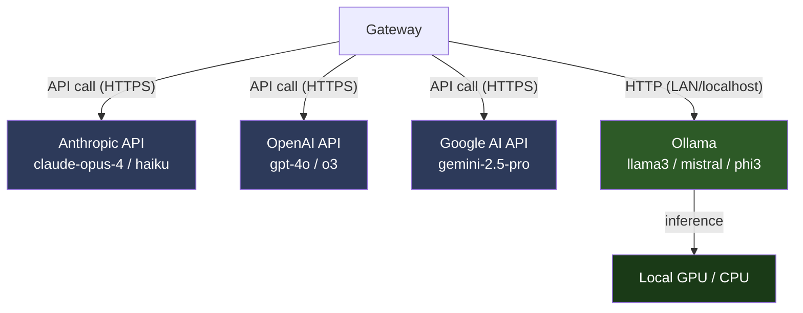

# OpenClaw Models

> [!abstract] TL;DR
> OpenClaw supports multiple pluggable AI providers — Anthropic Claude, OpenAI GPT, Google Gemini, and Ollama for local offline models. Add providers with `openclaw models auth add`, switch the active model with `openclaw models set`, and use slash commands like `/model`, `/fast`, `/reasoning`, and `/think` at runtime to control model behaviour mid-conversation.

---

## The Models Abstraction

OpenClaw wraps every AI provider behind a unified **model interface**. You configure providers once; after that, all channels use the same abstraction. This means:

- You can swap from Claude to GPT-4o without changing your channel setup
- You can route different channels to different models (see [[OpenClaw_Channels]])
- Ollama models run entirely locally — no internet required after download

---

## Supported Providers

| Provider | Models | Requires | Offline? | Strengths |
|----------|--------|---------|----------|-----------|
| **Anthropic** | claude-opus-4, claude-sonnet-4-5, claude-haiku-3-5, etc. | Anthropic API key | No | Best reasoning, long context, strong instruction following |
| **OpenAI** | gpt-4o, gpt-4o-mini, o3, o4-mini, etc. | OpenAI API key | No | Broad ecosystem, strong code, function calling |
| **Google Gemini** | gemini-2.5-pro, gemini-2.5-flash, etc. | Google AI API key | No | Multimodal, large context, fast |
| **Ollama** | llama3, mistral, phi3, qwen2, gemma3, etc. | Ollama running locally | Yes | Fully private, no API cost, runs on-device |

---

## Adding a Provider

```bash
# Interactive — recommended for first setup
openclaw models auth add

# Direct — specify provider and token inline
openclaw models auth add --provider anthropic --token sk-ant-api03-...
openclaw models auth add --provider openai --token sk-proj-...
openclaw models auth add --provider google --token AIza...

# Ollama — no token needed; just specify the base URL
openclaw models auth add --provider ollama --url http://localhost:11434
```

Credentials are stored in `~/.openclaw/credentials.yaml` (readable only by the OpenClaw user).

---

## Anthropic Token Setup (Detailed)

```bash
# Run the guided token setup
openclaw models auth setup-token

# This command:
# 1. Opens the Anthropic console URL in your browser (or prints it)
# 2. Prompts you to paste the generated API key
# 3. Validates the key with a test completion
# 4. Saves it to credentials.yaml

# Manual equivalent:
openclaw models auth add --provider anthropic --token sk-ant-api03-YOUR_KEY_HERE
```

Get your key at: `console.anthropic.com` → API Keys → Create Key

---

## Listing and Switching Models

```bash
# List all configured providers and their status
openclaw models list

# Sample output:
# anthropic  claude-opus-4          active  ✓ reachable
# openai     gpt-4o                 standby ✓ reachable
# ollama     llama3:8b              standby ✓ reachable (local)

# Set the global default model
openclaw models set anthropic/claude-opus-4

# Set a different model for a specific channel
openclaw models set openai/gpt-4o --channel slack

# Check all models' status (live API ping)
openclaw models status
```

---

## Runtime Model Control (Slash Commands)

These commands work inside any channel conversation:

| Command | Effect |
|---------|--------|
| `/model` | Show current model and list available options |
| `/model anthropic/claude-opus-4` | Switch to a specific model for this session |
| `/fast` | Switch to the fastest (cheapest) available model (e.g., Haiku, GPT-4o-mini) |
| `/reasoning` | Switch to the most capable reasoning model (e.g., claude-opus-4, o3) |
| `/think` | Enable extended thinking / chain-of-thought for the next response |
| `/think off` | Disable extended thinking |

Example:

```
you: /fast
assistant: Switched to claude-haiku-3-5. Fast mode active.

you: summarise this article: [paste text]
assistant: [fast summary]

you: /reasoning
assistant: Switched to claude-opus-4. Reasoning mode active.
```

---

## Ollama: Fully Offline Operation

Ollama runs open-weight models on your own hardware. Combined with OpenClaw, it enables a **fully private, fully offline** AI assistant with no external API calls.

```bash
# Install Ollama (on the same machine or LAN)
curl -fsSL https://ollama.com/install.sh | sh

# Pull a model
ollama pull llama3
ollama pull mistral
ollama pull phi3:mini   # small, fast, good for low-RAM machines

# Verify Ollama is running
ollama list

# Add Ollama to OpenClaw
openclaw models auth add --provider ollama --url http://localhost:11434

# Set as default
openclaw models set ollama/llama3
```

> [!tip] Raspberry Pi / Low-RAM Machines
> Use `phi3:mini` (2.7B) or `gemma3:2b` for machines with 4–8 GB RAM. Larger models (llama3:70b) need 48 GB+ RAM or a GPU. Check `ollama ps` to see active model memory usage.

---

## Choosing Models Per Channel or Per Task

```yaml
# ~/.openclaw/config.yaml
routing:
  - channel: telegram
    model: anthropic/claude-opus-4     # personal use — best quality
  - channel: slack
    model: openai/gpt-4o               # work — reliable, fast
  - channel: discord
    model: ollama/llama3               # private channel — no cloud API
  - channel: signal
    model: ollama/phi3:mini            # most private — fully local, fast
```

---

## Model Provider Diagram



---

## Common Pitfalls

1. **Setting a global model and forgetting per-channel overrides** — If you set `openclaw models set anthropic/claude-opus-4` globally but have a channel routing rule pointing to `ollama/llama3`, the channel rule takes precedence. Run `openclaw channels list --verbose` to see which model each channel is actually using.
2. **Ollama not running when OpenClaw starts** — If Ollama crashes or is not started before OpenClaw, any channel routing to an Ollama model will fail silently (or return an error to the user). Add Ollama to systemd or ensure it starts before OpenClaw in the startup sequence.
3. **Using `setup-token` for non-Anthropic providers** — `models auth setup-token` is Anthropic-specific. For OpenAI, Google, and Ollama, use `models auth add --provider <name> --token <key>` directly.

---

## Review Questions

1. You want all messages on your Signal channel to use Ollama (for maximum privacy) while Telegram uses Claude. Where do you configure this, and what command shows you the effective model per channel?
2. What does `/think` do, and when would you use it instead of `/reasoning`?
3. A user reports that switching to Ollama broke their assistant. They see "connection refused" errors. List three things to check, in order.

---

## See Also

- [[OpenClaw_Overview]] — Gateway architecture; models concept
- [[OpenClaw_Setup]] — `openclaw models auth setup-token` during onboarding
- [[OpenClaw_Channels]] — Per-channel model routing
- [[OpenClaw_Memory_and_Context]] — How model context is enriched with workspace memory
- [[_MOC_OpenClaw_Master]] — Full vault index
