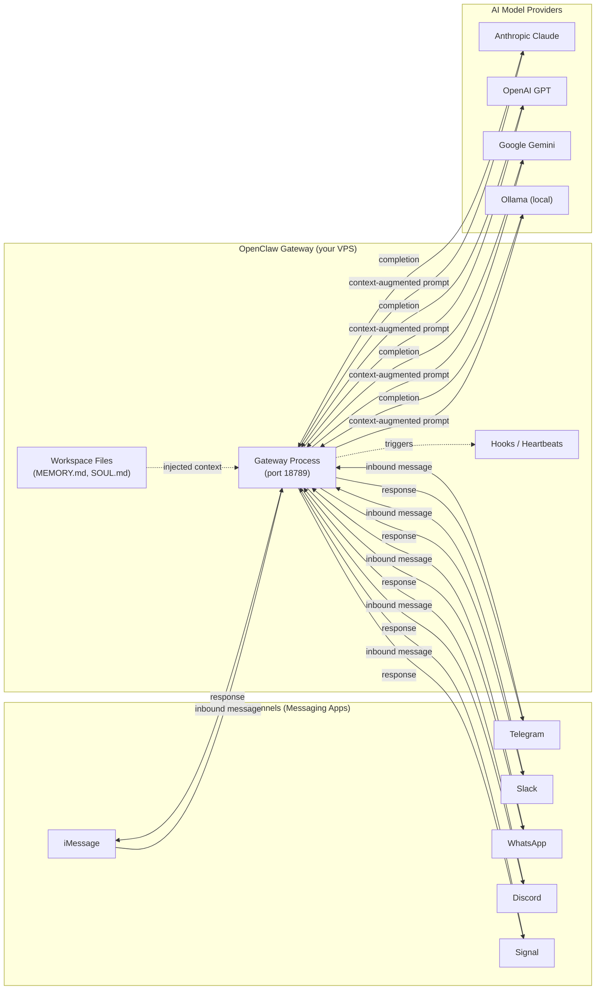

# OpenClaw Overview

> [!abstract] TL;DR
> OpenClaw is an open-source, self-hosted AI personal assistant runtime that runs on your own machine or VPS and bridges your messaging apps (iMessage, Telegram, Slack, WhatsApp, Discord, Signal) to pluggable AI models (Claude, GPT-4, Gemini, Ollama). Unlike Claude Code — which is a *coding agent* — OpenClaw is a *personal automation and messaging* platform you own and control end-to-end.

---

## What OpenClaw Is

OpenClaw is a **gateway process** you host yourself. It:

1. Listens on incoming messages from one or more **channels** (messaging apps)
2. Passes those messages (with memory context) to a configured **model** (AI provider)
3. Returns the response back through the originating channel
4. Optionally fires **hooks**, **webhooks**, or **heartbeats** (cron-style) to automate tasks

Because you self-host it, your conversations, memory files, and API keys never leave your infrastructure. There is no cloud relay between your messages and the AI.

**Key capabilities:**
- Multi-channel: one install serves iMessage, Telegram, Slack, etc. simultaneously
- Multi-model: swap or combine AI providers without changing your workflow
- Persistent memory: workspace files (`MEMORY.md`, `SOUL.md`, `AGENTS.md`) give the assistant context about you
- Automation: hooks, webhooks, heartbeats, cron jobs, and skills (reusable instruction packages)

---

## Gateway Architecture

The **gateway** is the central process. All channels connect to it; all models are called from it. No channel talks directly to a model.

---

## OpenClaw vs Claude Code vs Chatbots

| Dimension | OpenClaw | Claude Code | Typical Chatbot (ChatGPT web) |
|-----------|----------|-------------|-------------------------------|
| **Primary purpose** | Personal assistant + messaging automation | Coding agent inside your terminal | General conversation |
| **Hosting** | Self-hosted (VPS / local) | Runs on your local machine | Cloud (vendor-hosted) |
| **Channels** | iMessage, Telegram, Slack, WhatsApp, Discord, Signal | Terminal only | Web browser only |
| **Memory** | Persistent workspace files you own | MEMORY.md per-project | Session-scoped or vendor cloud |
| **Automation** | Hooks, webhooks, cron jobs, skills | Hooks, slash commands, MCP tools | None |
| **Model choice** | Claude, GPT, Gemini, Ollama (swappable) | Claude (Anthropic) | Vendor-locked |
| **Data privacy** | 100% self-hosted — data stays with you | Local machine | Vendor cloud |
| **Target user** | Power users automating personal workflows | Developers writing code | General public |

> [!important] OpenClaw ≠ Claude Code
> Claude Code is a *coding assistant* you run in your terminal to write and modify software. OpenClaw is a *personal assistant runtime* you run on a server to talk to AI through your messaging apps and automate your daily life. They complement each other but solve different problems.

---

## Key Concepts

| Concept | What it means |
|---------|---------------|
| **Channel** | An integration with a messaging platform (iMessage, Telegram, etc.) |
| **Model** | A plugged-in AI provider (Anthropic, OpenAI, Gemini, Ollama) |
| **Gateway** | The central OpenClaw process that routes messages between channels and models |
| **Workspace** | The directory of config and memory files OpenClaw reads on startup |
| **Skill** | A reusable instruction package installable from ClawHub |
| **Hook** | Code-triggered automation on message events |
| **Heartbeat** | Time-triggered automation (cron-style) |

---

## Key Use Cases

- **Personal messaging bot** — Ask questions, get summaries, or run searches by texting yourself on Telegram
- **Cross-channel assistant** — One assistant available on Slack at work and on iMessage at home
- **Automation hub** — Trigger scripts when a keyword appears in a message; post daily briefings on schedule
- **Fully private AI** — Use Ollama as the model provider for 100% offline, no-cloud-API operation
- **Cron replacement** — Replace fragile shell cron jobs with readable, AI-augmented heartbeats
- **Home automation trigger** — Webhook endpoint receives external events (calendar, email, IFTTT) and routes to AI

---

## Common Pitfalls

1. **Confusing OpenClaw with Claude Code** — OpenClaw is for personal messaging automation; Claude Code is for writing software. Installing OpenClaw and expecting it to edit your code will disappoint you.
2. **Running on a personal PC without isolation** — OpenClaw exposes a local HTTP gateway and holds API keys. Running it on your daily-use machine without a dedicated non-root user or container raises the blast radius of a compromise.
3. **Assuming channels are always symmetric** — Some channels (e.g., iMessage) require specific OS environments (macOS with Bluebubbles or similar bridge) and cannot be set up on a Linux VPS alone without extra infrastructure.

---

## Review Questions

1. What is the role of the gateway in OpenClaw's architecture, and why do all channels route through it rather than calling models directly?
2. A colleague says "OpenClaw is just a self-hosted ChatGPT." Identify two specific architectural differences that make this description inaccurate.
3. Why might a privacy-conscious user prefer Ollama as the model provider rather than Anthropic or OpenAI?

---

## See Also

- [[OpenClaw_Setup]] — Install and configure the gateway
- [[OpenClaw_Channels]] — Supported messaging integrations
- [[OpenClaw_Models]] — AI provider setup and switching
- [[_MOC_OpenClaw_Master]] — Full vault index
