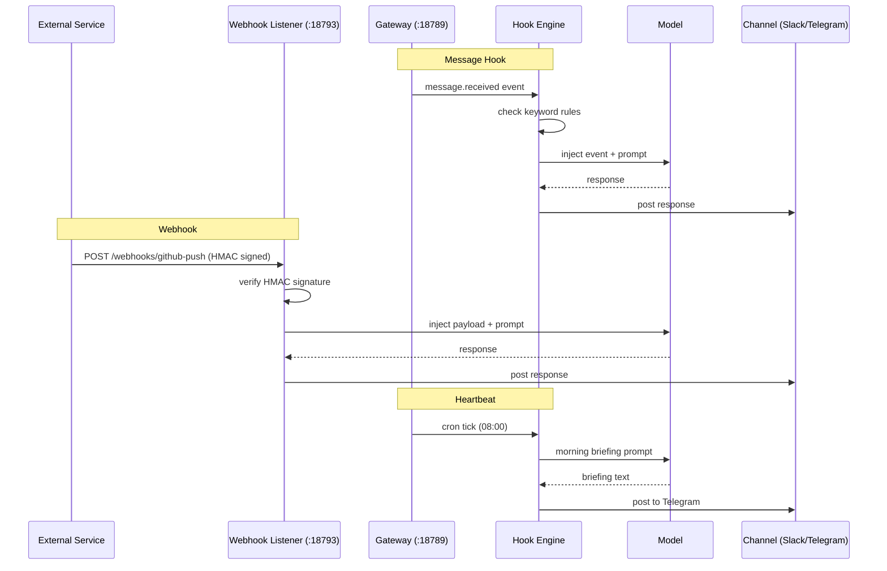

# OpenClaw Hooks and Webhooks

> [!abstract] TL;DR
> OpenClaw has three automation trigger types: **hooks** (fire when a message event occurs), **webhooks** (fire when an external HTTP POST arrives on port 18793), and **heartbeats** (fire on a time schedule configured in `HEARTBEAT.md`). All three run a configured script or AI prompt and can post results back to any channel. Secure webhooks using HMAC signature verification.

---

## The Three Trigger Types

| Type | What triggers it | Use case |
|------|-----------------|----------|
| **Hook** | A message event inside OpenClaw (message received, response sent, keyword matched) | React to user messages; log conversations; transform output |
| **Webhook** | An inbound HTTP POST to `/webhooks/<name>` on port 18793 | Receive events from external services (GitHub, IFTTT, calendar, IoT) |
| **Heartbeat** | A time schedule (cron expression in `HEARTBEAT.md`) | Daily briefings, health checks, reminders, periodic summaries |

All three share the same execution model: OpenClaw calls your configured **script path** (shell script, Python, Node) or executes an **AI prompt** with the event payload injected as context.

---

## Hooks (Message-Event Triggered)

### Hook Events

| Event | Fires when |
|-------|-----------|
| `message.received` | Any inbound message arrives on any channel |
| `message.sent` | OpenClaw sends a response |
| `message.keyword` | A configured keyword is detected in an inbound message |
| `session.start` | A new conversation session begins |
| `session.end` | A session ends (idle timeout reached) |
| `channel.connected` | A channel adapter successfully connects |
| `channel.error` | A channel adapter reports an error |

### Hook Structure

```yaml
# ~/.openclaw/hooks.yaml
hooks:
  - name: log-all-messages
    event: message.received
    script: ~/workspace/hooks/log_message.sh
    enabled: true

  - name: alert-on-keyword
    event: message.keyword
    keywords: ["urgent", "emergency", "ASAP"]
    prompt: "A message flagged as urgent was received: {{message}}. Draft a brief acknowledgement and log to ~/workspace/urgent.md."
    channel: telegram     # post the result to this channel
    enabled: true

  - name: post-session-summary
    event: session.end
    prompt: "Summarise today's conversation in 3 bullet points and append to memory/{{date}}.md."
    enabled: true
```

### Example Hook Script

```bash
#!/bin/bash
# ~/workspace/hooks/log_message.sh
# Called with env vars: OPENCLAW_SENDER, OPENCLAW_CHANNEL, OPENCLAW_MESSAGE, OPENCLAW_TIMESTAMP

echo "[${OPENCLAW_TIMESTAMP}] ${OPENCLAW_CHANNEL} | ${OPENCLAW_SENDER}: ${OPENCLAW_MESSAGE}" \
  >> ~/workspace/logs/messages.log
```

---

## Webhooks (HTTP-Triggered)

The gateway listens for webhook POST requests on **port 18793** at `/webhooks/<name>`.

```bash
# Register a webhook endpoint
openclaw webhooks add --name github-push \
  --secret "my-hmac-secret-32chars-minimum" \
  --prompt "A GitHub push event was received: {{payload}}. Summarise the changes and post to Slack."
  --channel slack

# List webhooks
openclaw webhooks list

# Remove a webhook
openclaw webhooks remove --name github-push
```

External service sends:
```http
POST https://your-vps.example.com:18793/webhooks/github-push
X-Hub-Signature-256: sha256=<hmac>
Content-Type: application/json

{"ref": "refs/heads/main", "commits": [...]}
```

OpenClaw verifies the HMAC signature, extracts the payload, injects it into the configured prompt, calls the model, and posts the result to the configured channel.

### HMAC Signature Verification

```yaml
# ~/.openclaw/config.yaml
webhooks:
  verify_signatures: true    # NEVER set to false in production
  port: 18793
  bind: 127.0.0.1            # put nginx/Caddy in front for HTTPS
```

> [!danger] Always verify HMAC signatures
> If `verify_signatures: false`, anyone who can reach port 18793 can inject arbitrary payloads into your AI assistant's prompts. This is a prompt-injection vector. See [[OpenClaw_Security]].

---

## Heartbeats (Time-Triggered)

Heartbeats are configured in **`HEARTBEAT.md`** in your workspace directory — a human-readable cron file.

```markdown
# HEARTBEAT.md

## Daily Morning Briefing
**schedule:** 0 8 * * *
**timezone:** America/New_York
**prompt:** Compile a morning briefing: today's date, weather for New York, 3 top tech news headlines, and any tasks due today from MEMORY.md. Post to Telegram.
**channel:** telegram

## Weekly Review
**schedule:** 0 18 * * 5
**timezone:** America/New_York
**prompt:** Summarise the week: key accomplishments from memory/YYYY-MM-DD.md files this week, pending tasks, and one focus item for next week. Post to Slack.
**channel:** slack

## Hourly Health Check
**schedule:** 0 * * * *
**prompt:** Check that all OpenClaw channels and models are responding. If any are down, post an alert to Telegram.
**channel:** telegram
```

Heartbeat schedules use standard cron syntax. The gateway runs them internally — no external cron daemon needed.

```bash
# List active heartbeats
openclaw heartbeats list

# Trigger a heartbeat immediately (for testing)
openclaw heartbeats trigger "Daily Morning Briefing"

# Disable a heartbeat without removing it
openclaw heartbeats disable "Hourly Health Check"
```

**Active hours** — limit heartbeats to waking hours:

```yaml
# ~/.openclaw/config.yaml
heartbeats:
  active_hours:
    start: "07:00"
    end: "22:00"
    timezone: "America/New_York"
```

Heartbeats scheduled outside active hours are silently skipped.

---

## Hooks CLI

```bash
# List all hooks
openclaw hooks list

# Enable/disable a hook
openclaw hooks enable log-all-messages
openclaw hooks disable alert-on-keyword

# Test a hook with a synthetic event
openclaw hooks test log-all-messages \
  --event message.received \
  --payload '{"sender": "test", "message": "hello", "channel": "telegram"}'
```

---

## Event Flow Diagram



---

## Real-World Automation Examples

```yaml
# 1. GitHub PR opened → summarise and post to Slack
- name: pr-summary
  type: webhook
  source: github
  event: pull_request.opened
  prompt: "A new PR was opened: {{payload.pull_request.title}} by {{payload.pull_request.user.login}}. Summarise the description and list the changed files."
  channel: slack

# 2. Keyword "bill" in any message → extract amount and log
- name: bill-tracker
  type: hook
  event: message.keyword
  keywords: ["bill", "invoice", "payment due"]
  prompt: "Extract any monetary amounts and due dates from: {{message}}. Append to ~/workspace/finance/bills.md."

# 3. Daily at 23:00 — compact daily memory
- name: nightly-compact
  type: heartbeat
  schedule: "0 23 * * *"
  prompt: "Read today's conversation log in memory/{{date}}.md. Distil it to the 5 most important facts and rewrite the file with just those facts."
```

---

## Common Pitfalls

1. **Exposing port 18793 directly to the internet without TLS** — Webhooks arrive over HTTP if you bind directly to a public IP. Man-in-the-middle attackers can intercept and replay payloads. Put Caddy or nginx with Let's Encrypt in front and proxy to `127.0.0.1:18793`.
2. **Using weak or no HMAC secret for webhooks** — A guessable secret (or `verify_signatures: false`) allows anyone to POST arbitrary payloads to your webhook endpoint. This is a direct prompt-injection attack surface.
3. **Heartbeats firing outside intended hours** — Without `active_hours` configured, a heartbeat scheduled at `0 6 * * *` UTC may fire at 2:00 AM local time. Always set `timezone` and `active_hours` on heartbeats that touch notifications.

---

## Review Questions

1. What is the difference between a `message.keyword` hook and a heartbeat, and when would you use each?
2. A GitHub webhook is configured but OpenClaw is not receiving events. What are the three most likely causes?
3. Why is `verify_signatures: false` a security problem even if the webhook endpoint is behind a firewall?

---

## See Also

- [[OpenClaw_Memory_and_Context]] — Hooks that write to workspace memory files
- [[OpenClaw_Cron_and_Skills]] — Cron jobs vs heartbeats; skills that hooks can invoke
- [[OpenClaw_Security]] — HMAC verification, webhook security, prompt injection
- [[_MOC_OpenClaw_Master]] — Full vault index
