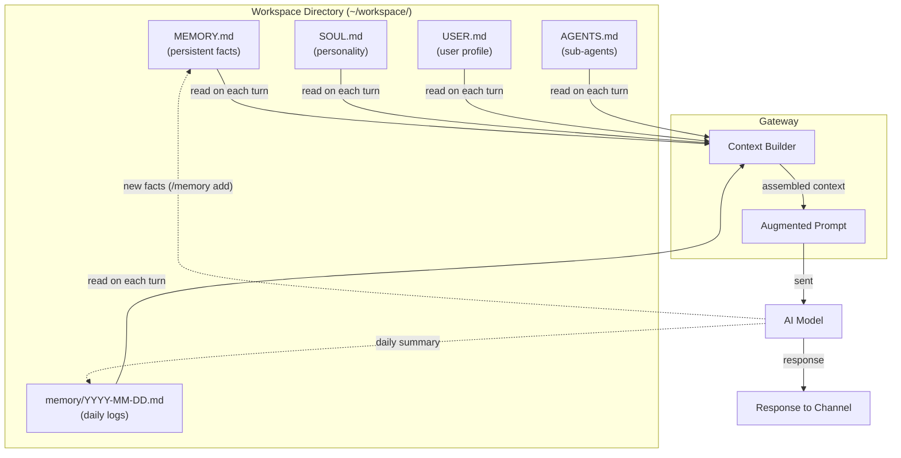

# OpenClaw Memory and Context

> [!abstract] TL;DR
> OpenClaw reads a set of **workspace files** — `MEMORY.md`, `SOUL.md`, `AGENTS.md`, `USER.md`, and daily memory files — at the start of every conversation to give the model persistent context about you. Keep these files updated using the `/memory` slash command, `memory index --all`, and `memory search "<query>"`. Use `/context` and `/compact` to inspect and trim the active context window.

---

## Why Persistent Memory Matters

Without memory, every conversation starts from scratch. With workspace files, OpenClaw automatically injects:
- Who you are (`USER.md`)
- What it knows about your life and preferences (`MEMORY.md`)
- How it should behave (`SOUL.md`)
- What specialised agents are available (`AGENTS.md`)
- What happened recently (daily memory files)

The model never "forgets" your name, preferences, or ongoing projects across sessions and channels.

---

## Workspace Files

| File | Purpose | Updated by |
|------|---------|------------|
| `MEMORY.md` | Persistent facts, preferences, ongoing projects, key contacts | You manually + `/memory` command |
| `SOUL.md` | Personality config — tone, communication style, areas of focus, values | You manually |
| `USER.md` | User profile — name, timezone, job, key relationships | Onboarding wizard + you |
| `AGENTS.md` | Definitions of specialised sub-agents (name, prompt, trigger) | You manually |
| `memory/YYYY-MM-DD.md` | Daily memory — ephemeral notes from each day's conversations | Auto-generated by OpenClaw |
| `HEARTBEAT.md` | Heartbeat schedule config (cron expressions for heartbeats) | You manually |

All files live in your **workspace directory** (default: `~/workspace/`). OpenClaw reads them on startup and injects relevant sections into each prompt.

---

## MEMORY.md Structure

```markdown
# Memory Index

## Ongoing Projects
- [Project Alpha](projects/alpha.md) — Due 2026-08-15, blocked on client approval
- [Home Renovation](projects/home.md) — Contractor booked for September

## Preferences
- Prefers concise bullet-point summaries, not paragraphs
- Morning briefing at 08:00 UTC
- Code examples in Python unless otherwise specified

## Key Contacts
- Alice Chen — Manager at Accenture; primary escalation path
- Bob Nguyen — Contractor for home project; +1-555-0123

## Recurring Context
- Works on OpenClaw vault notes in Obsidian most evenings
- Currently learning Rust (beginner)
```

> [!tip] MEMORY.md as an Index
> Keep MEMORY.md as a high-level **index** that links to deeper project files. Long entries slow context injection. Use the pattern `[Topic](path/to/detail.md)` and let OpenClaw fetch the detail file only when relevant.

---

## SOUL.md — Personality Config

```markdown
# Soul

## Tone
- Professional but warm; avoid jargon unless I use it first
- Be direct: conclusions before reasoning, not the other way around
- Use analogies when explaining complex topics

## Behaviour
- Always confirm destructive actions before executing
- Never roleplay as a different AI or claim to be human
- If uncertain, say so; don't confabulate

## Areas of Focus
- Tech: software architecture, AI/ML, blockchain
- Personal: fitness goals, language learning (Spanish B2)
```

---

## AGENTS.md — Sub-Agent Definitions

```markdown
# Agents

## research-agent
**Trigger:** When I ask to "research" or "look up" something
**Prompt:** You are a research assistant. Search the web, summarise findings, cite sources. Return structured markdown with ## Summary, ## Key Points, ## Sources.

## code-review-agent
**Trigger:** When I paste code and ask for a review
**Prompt:** You are a senior software engineer. Review for bugs, style, performance, and security. Return ## Issues, ## Suggestions, ## Score (1-10).
```

---

## Daily Memory Files

OpenClaw writes a daily memory file at `memory/YYYY-MM-DD.md` after each session. These capture:
- Key decisions made
- Tasks completed or created
- Information you asked the assistant to remember

```
memory/
├── 2026-07-28.md
├── 2026-07-29.md
└── 2026-07-30.md
```

OpenClaw automatically loads the last N days of daily memory (configurable in `config.yaml`) into context, giving the model a rolling short-term memory without the full history.

---

## Memory Commands

```bash
# Index all workspace files (rebuilds the in-memory index)
openclaw memory index --all

# Search memory for a keyword or phrase
openclaw memory search "home renovation"
openclaw memory search "Alice Chen"

# Show memory stats (file sizes, injection tokens)
openclaw memory stats
```

In-conversation slash commands:

```
/memory                  # show current memory summary
/memory add <text>       # append a fact to MEMORY.md immediately
/memory search <query>   # search workspace memory and return snippets
/context                 # show current context window contents and token count
/compact                 # compress conversation history to reduce token usage
```

---

## Context Management

OpenClaw's context window has a finite size. Long conversations or large workspace files can fill it. Tools to manage this:

| Command | Effect |
|---------|--------|
| `/context` | Show token usage: system prompt, workspace files, conversation history |
| `/compact` | Summarise older conversation turns into a compressed block, freeing tokens |
| `/clear` | Clear conversation history for this session (keeps workspace memory) |
| `memory stats` | Show which workspace files contribute most tokens |

Configure context injection limits in `config.yaml`:

```yaml
context:
  max_memory_tokens: 2000       # cap MEMORY.md injection size
  daily_memory_days: 7          # how many days of daily files to inject
  inject_agents: true           # inject AGENTS.md into every prompt
  inject_soul: true             # inject SOUL.md into every prompt
```

---

## Memory Architecture Diagram



---

## Common Pitfalls

1. **Bloated MEMORY.md slowing context injection** — Putting hundreds of lines directly in MEMORY.md inflates every prompt with tokens the model may never need. Keep MEMORY.md as a lean index and use linked sub-files for details. Check token usage with `memory stats`.
2. **Not running `memory index --all` after editing workspace files manually** — If you edit `MEMORY.md` in a text editor while the gateway is running, the in-memory index is stale. Run `openclaw memory index --all` or restart the gateway to pick up changes.
3. **Relying on daily memory files for critical facts** — Daily memory files are ephemeral logs. If you need a fact to persist permanently (a preference, a contact), add it explicitly to `MEMORY.md` with `/memory add`. Daily files rotate and may be pruned.

---

## Review Questions

1. What is the difference between `MEMORY.md` and a daily memory file (`memory/2026-07-29.md`), and when should each be used?
2. Your context window keeps hitting the limit after two or three messages. What are three things you can do to reduce token pressure without losing important context?
3. You want OpenClaw to always respond in bullet points and never use passive voice. Which workspace file do you edit, and what section?

---

## See Also

- [[OpenClaw_Overview]] — Gateway architecture; workspace concept
- [[OpenClaw_Models]] — How model context window sizes affect memory injection
- [[OpenClaw_Hooks_and_Webhooks]] — Hooks that read or write workspace memory
- [[OpenClaw_Cron_and_Skills]] — Skills that interact with memory files
- [[_MOC_OpenClaw_Master]] — Full vault index
