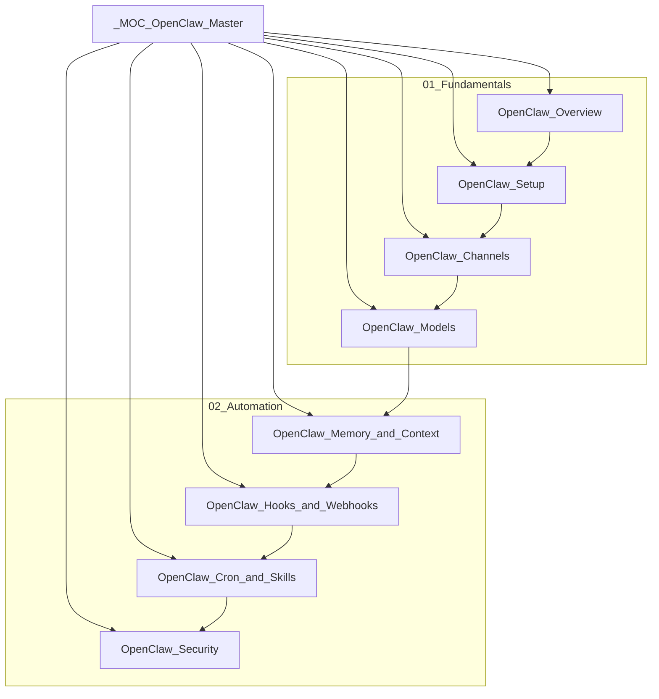

# OpenClaw — Master Map of Content

> [!abstract] About This Vault
> 8-note vault across 2 sections covering **OpenClaw** — the open-source, self-hosted AI personal assistant that runs on your own machine or VPS and bridges your messaging apps (iMessage, Telegram, Slack, WhatsApp, Discord, Signal) to AI models (Claude, GPT, Gemini, Ollama). Distinct from Claude Code: OpenClaw is a *personal automation + messaging* runtime, not a coding agent.

---

## Vault Map

---

## Sections

| # | Section | Notes | Focus |
|---|---------|-------|-------|
| 01 | [[01_Fundamentals/OpenClaw_Overview\|Fundamentals]] | 4 | Core concepts, setup, channels, models |
| 02 | [[02_Automation/OpenClaw_Memory_and_Context\|Automation]] | 4 | Memory, hooks, cron, security |

---

## Learning Path

| Step | Note | Goal |
|------|------|------|
| 1 | [[01_Fundamentals/OpenClaw_Overview]] | Understand what OpenClaw is and isn't |
| 2 | [[01_Fundamentals/OpenClaw_Setup]] | Install and onboard on a VPS |
| 3 | [[01_Fundamentals/OpenClaw_Channels]] | Connect first messaging channel |
| 4 | [[01_Fundamentals/OpenClaw_Models]] | Plug in AI model providers |
| 5 | [[02_Automation/OpenClaw_Memory_and_Context]] | Teach OpenClaw about you (MEMORY.md) |
| 6 | [[02_Automation/OpenClaw_Hooks_and_Webhooks]] | Automate with hooks and webhooks |
| 7 | [[02_Automation/OpenClaw_Cron_and_Skills]] | Schedule jobs and install skills |
| 8 | [[02_Automation/OpenClaw_Security]] | Lock down and audit |

---

## Section MOC Index

### 01_Fundamentals
- [[01_Fundamentals/OpenClaw_Overview]] — What OpenClaw is, gateway architecture, OpenClaw vs Claude Code
- [[01_Fundamentals/OpenClaw_Setup]] — Installation, onboarding, health check, security checklist
- [[01_Fundamentals/OpenClaw_Channels]] — Messaging integrations, adding/managing channels, allowlists
- [[01_Fundamentals/OpenClaw_Models]] — AI providers, auth, model switching, Ollama offline mode

### 02_Automation
- [[02_Automation/OpenClaw_Memory_and_Context]] — MEMORY.md, SOUL.md, AGENTS.md, context management
- [[02_Automation/OpenClaw_Hooks_and_Webhooks]] — Event hooks, HTTP webhooks, heartbeats/cron triggers
- [[02_Automation/OpenClaw_Cron_and_Skills]] — Cron jobs, skills from ClawHub, custom skill creation
- [[02_Automation/OpenClaw_Security]] — Isolation, allowlists, prompt injection, security audit

---

## Cross-Vault Links

- [[_MOC_Claude_Code_Master]] — Claude Code is a *coding* agent; OpenClaw is a *personal assistant* runtime
- [[_MOC_AI_Product_Builder_Master]] — Building AI-powered products; OpenClaw is one deployment pattern
