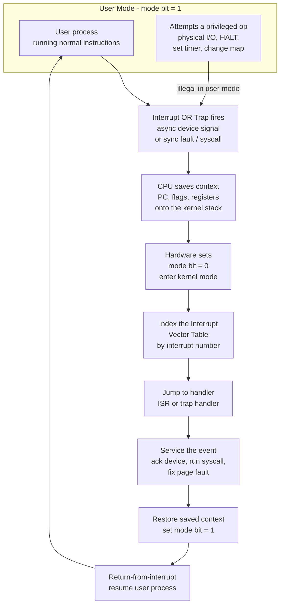

# ⚡ Interrupts, Traps and Dual-Mode Operation

> [!abstract] TL;DR
> Interrupts, traps, and dual-mode operation are the *hardware* mechanisms that make a protected, multiprogrammed operating system possible. A **mode bit** in the CPU splits execution into privileged **kernel mode** and restricted **user mode**; dangerous instructions (I/O, halt, changing memory maps, setting timers) are legal only in kernel mode, and a user program that tries one traps into the kernel. **Interrupts** are asynchronous signals from devices that divert the CPU to a handler via the **interrupt vector table**; **traps/exceptions** are synchronous events caused by the running instruction itself (system calls, divide-by-zero, page faults). The **timer interrupt** is what lets the OS forcibly reclaim the CPU from a runaway process, enabling preemptive scheduling. Together they form the reactive core of the kernel.

---

## Intuition

**Analogy:** Picture a worker deep in a task at a desk. When the **phone rings** (an *interrupt*), the worker doesn't ignore it and doesn't lose their place — they jot a bookmark of exactly where they are, pick up the phone, deal with the caller, then return to the *exact* line they left off. That bookmark is the saved CPU state; the phone call is the device signalling; resuming is the return-from-interrupt.

Now imagine one drawer in the desk is **locked, and only a supervisor holds the key**. An ordinary worker who reaches for it is stopped cold and the supervisor is summoned. That locked drawer is a *privileged operation*; the supervisor is *kernel mode*; the worker being stopped is a *trap*. **Dual-mode operation** is simply the rule that some actions require the key — and the hardware, not politeness, enforces it. Without the lock, any program could reach into another's memory, seize the disk, or halt the machine.

---

## How It Works

### Core Mechanics

**1. The mode bit (dual-mode operation).** The CPU carries a single bit of state — kernel/supervisor mode versus user mode. This bit gates the **privileged instruction** set: physical I/O, `HALT`, loading the page-table base register or changing memory maps, disabling interrupts, and arming the timer. In user mode the hardware refuses these instructions and raises a trap instead. This is the *entire* hardware foundation of OS protection: a user process literally *cannot* touch another process's memory or grab a device, because the instructions to do so are unavailable to it. (In an OS vault this connects to the planned notes *Protection_and_Access_Control* and *Memory_Management_and_Allocation*.)

**2. Interrupts (asynchronous, external).** A device — a disk finishing a read, a keypress, a network packet, a periodic timer tick — asserts an interrupt line. The event has *nothing to do* with the instruction currently executing; it arrives from the outside world at an unpredictable time. The CPU finishes the current instruction, then diverts.

**3. The interrupt vector table.** Each interrupt carries a number. The CPU uses that number to index a table of handler addresses (on x86 the IDT with 256 entries; see [[Interrupts_and_DMA]]) set up at boot. Entry N holds the address of the routine that services interrupt N. This indirection is why the boot process must install the table before enabling interrupts.

**4. Context save / interrupt service routine / restore.** On entry the hardware pushes the essential state (program counter, flags, and enough to return) and the **interrupt service routine (ISR)** saves the rest of the registers, sets the mode bit to kernel, services the event, then restores state and executes a *return-from-interrupt* that flips the mode bit back and resumes the interrupted instruction stream — exactly the phone-call bookmark.

**5. Traps and exceptions (synchronous, internal).** A **trap** is generated *by the running instruction*: a deliberate `syscall`/`int` to request an OS service (the mechanism behind the planned *System_Calls_and_the_Kernel_Interface*), or a **fault** such as divide-by-zero, an illegal instruction, or a **page fault** that drives demand paging (see [[Virtual_Memory_and_TLB]]). The defining distinction: **interrupts are asynchronous and external; traps are synchronous and internal** — a trap will re-occur if you re-run the same instruction, an interrupt will not.

**6. Priority and masking.** Interrupts have priorities; a handler can *mask* (temporarily disable) lower-priority interrupts so it isn't itself interrupted mid-critical-section, while high-priority ones (like a machine-check) stay enabled. Nested, prioritized interrupts require a re-entrant, carefully layered handler design.

**7. The timer interrupt — the key to preemption.** At boot the kernel programs a hardware timer to fire periodically. Each tick is an interrupt that *unconditionally* returns control to the kernel, no matter what the user process was doing. This is the linchpin: without a timer interrupt a runaway `while(true){}` would monopolize the CPU forever. With it, the scheduler regains control every few milliseconds and can preempt — the foundation of the planned *CPU_Scheduling_Algorithms*. Arming the timer is itself a privileged instruction, so a user process can never turn off its own eviction.

### Flow / Architecture



---

## Key Concepts

**Secondary (intuition level).**
An interrupt is a phone ringing: the CPU bookmarks its work, handles the call, and resumes. The machine has two "trust levels" — a restricted mode for ordinary programs and a powerful mode for the operating system — and the hardware, not trust, keeps them apart.

**Undergraduate (mechanism level).**
- **Mode bit** — one CPU flag selecting kernel vs user mode; determines which instructions are legal.
- **Privileged instructions** — I/O, `HALT`, timer arming, page-table loads, interrupt disabling; trap if attempted in user mode.
- **Interrupt vector table / IDT** — array mapping interrupt number to handler address, installed at boot.
- **ISR context save/restore** — the handler preserves and later restores the interrupted register state; return-from-interrupt flips the mode bit back.
- **Interrupt vs trap** — asynchronous/external vs synchronous/internal; the acid test is whether re-executing the instruction reproduces the event.
- **Timer interrupt** — periodic tick that hands control back to the kernel, enabling *preemptive* scheduling.
- **Polling vs interrupt-driven I/O** — busy-waiting on a status register versus being signalled; interrupts avoid burning cycles while idle.

**Graduate (systems level).**
- **Interrupt latency** — time from device assertion to first useful handler instruction; dominated by masking windows, cache misses, and pipeline drain.
- **Top half / bottom half** — minimal, interrupts-disabled ISR that acks the device and defers real work to a softirq/tasklet/workqueue (deferred procedure calls); see [[Interrupts_and_DMA]].
- **Precise vs imprecise exceptions** — a precise fault leaves architectural state as if all prior instructions completed and none after started; out-of-order and superscalar cores must reconstruct this (see [[CPU_Datapath_and_Control]]).
- **Reentrancy & nested interrupts** — priority + masking allow a higher-priority interrupt to preempt a handler; the handler must be reentrant.
- **Interrupt storms & receive livelock** — at extreme event rates the CPU does nothing but enter/exit handlers; **NAPI**-style hybrid schemes switch to polling under load.
- **Interrupt affinity / MSI-X** — steering vectors to specific cores/NUMA nodes to preserve cache locality.
- **The mode bit as a finite-state machine** — the CPU control unit implements mode transitions as hardware state (see [[Sequential_Circuits_and_FSMs]]); the saved-context layout is dictated by the calling convention (see [[ABI_and_Calling_Conventions]]).

---

## Python Demo

```python
# Interrupt-driven I/O vs polling: when does each waste less CPU?
# Left plot  : wasted-CPU overhead vs device event rate.
# Right plot : an interrupt timeline - useful work punctuated by ISR spikes.
# numpy + matplotlib only.

import numpy as np
import matplotlib.pyplot as plt

# --- Cost model -------------------------------------------------------------
# POLLING    : CPU checks the device at a FIXED cadence. Each poll is cheap
#              but happens whether or not an event is ready -> ~constant cost.
# INTERRUPTS : device signals only on an event, but each event pays an
#              expensive context-save / vector-dispatch / restore -> linear.
CPU_HZ = 1_000_000_000      # 1 GHz -> cycles available per second
C_INT  = 5_000              # cycles to enter + dispatch + exit ONE interrupt
C_POLL = 500                # cycles for a SINGLE device poll
F_POLL = 100_000            # polls per second (fixed 100 kHz cadence)

event_rate = np.logspace(2, 7, 400)                 # 100 .. 10,000,000 ev/s

poll_overhead   = np.full_like(event_rate, F_POLL * C_POLL / CPU_HZ)  # constant
int_overhead    = event_rate * C_INT / CPU_HZ                          # linear
# Hybrid / NAPI: interrupt to notice the first event, then poll-drain the
# backlog -> effectively take the cheaper strategy at each load level.
hybrid_overhead = np.minimum(poll_overhead, int_overhead)

# Crossover: event_rate * C_INT == F_POLL * C_POLL
crossover = F_POLL * C_POLL / C_INT

fig, (ax1, ax2) = plt.subplots(1, 2, figsize=(13, 5))

# --- Left: overhead vs event rate ------------------------------------------
ax1.plot(event_rate, poll_overhead   * 100, color="#DC2626", lw=2,
         label="Polling (fixed cadence)")
ax1.plot(event_rate, int_overhead    * 100, color="#1D4ED8", lw=2,
         label="Interrupt-driven")
ax1.plot(event_rate, hybrid_overhead * 100, color="#065F46", lw=2, ls="--",
         label="Hybrid / NAPI")
ax1.axvline(crossover, color="gray", ls=":", lw=1.5)
ax1.annotate(f"crossover ~ {crossover:,.0f} ev/s",
             xy=(crossover, 5), xytext=(crossover * 1.4, 22),
             arrowprops=dict(arrowstyle="->", color="gray"))
ax1.set_xscale("log")
ax1.set_ylim(0, 100)
ax1.set_xlabel("Device event rate  (events / second, log scale)")
ax1.set_ylabel("Wasted CPU  (percent)")
ax1.set_title("Interrupts win when events are rare;\npolling wins when events are a flood")
ax1.legend()
ax1.grid(True, which="both", alpha=0.3)

# --- Right: interrupt timeline ---------------------------------------------
T_US, dt = 200.0, 0.05                 # 200 us window, 0.05 us samples
t     = np.arange(0, T_US, dt)
state = np.ones_like(t)                # 1 = running useful work

rng      = np.random.default_rng(7)
arrivals = np.sort(rng.uniform(5, T_US - 15, 8))
HANDLER_US = 3.0                       # each ISR runs ~3 us
for a in arrivals:
    state[(t >= a) & (t < a + HANDLER_US)] = 2   # 2 = handler preempts work

ax2.fill_between(t, 0, 1, color="#1D4ED8", alpha=0.4, label="useful work")
ax2.fill_between(t, 1, state, where=(state == 2), step="pre",
                 color="#DC2626", alpha=0.85, label="interrupt handler")
ax2.plot(arrivals, np.full_like(arrivals, 2.15), "v", color="black",
         ms=8, label="interrupt fires")
ax2.set_ylim(0, 2.5)
ax2.set_yticks([0.5, 1.5])
ax2.set_yticklabels(["user\nwork", "ISR\nspike"])
ax2.set_xlabel("Time  (microseconds)")
ax2.set_title("Interrupt timeline: useful work\npreempted by short handler spikes")
ax2.legend(loc="upper right")
ax2.grid(True, alpha=0.3)

plt.tight_layout()
plt.savefig("interrupts_vs_polling.png", dpi=110)
plt.show()

print(f"Polling overhead (constant)   : {poll_overhead[0] * 100:6.2f}% of CPU")
print(f"Interrupt overhead @ 1k ev/s  : {1_000 * C_INT / CPU_HZ * 100:6.3f}%")
print(f"Interrupt overhead @ 1M ev/s  : {1_000_000 * C_INT / CPU_HZ * 100:6.1f}%")
print(f"Crossover event rate          : {crossover:,.0f} events/second")
```

The left plot makes the trade-off concrete: interrupt overhead rises linearly with event rate, so at **low rates** interrupts are almost free while a fixed-cadence poller keeps burning cycles on empty checks. Past the crossover, per-event interrupt cost overtakes polling — this is exactly the **receive-livelock** regime that motivates hybrid **NAPI** designs, which take the lower envelope (dashed line). The right plot shows why we care about handler duration: every ISR spike steals microseconds from useful work, so long handlers inflate interrupt latency for everyone.

---

## Real-World Applications

> **Example — the timer interrupt in Linux.** The kernel programs a hardware timer (historically the PIT/HPET, now often a per-core APIC timer) to fire ticks. Each tick traps into the scheduler, which updates run-time accounting and may preempt the current task. This single mechanism is why one buggy user process cannot freeze a multi-user Linux box: the OS *always* gets the CPU back. "Tickless" (`NO_HZ`) kernels reduce these interrupts when idle to save power, but the mechanism is identical.

- **System calls as traps.** `read()`, `write()`, `mmap()` execute a `syscall`/`int 0x80` instruction that *deliberately* traps into the kernel — the only sanctioned door from user to kernel mode, gated by the mode bit.
- **Page faults driving demand paging.** Touching an unmapped page raises a fault trap; the kernel's handler loads the page and restarts the instruction, invisible to the program (see [[Virtual_Memory_and_TLB]]).
- **Interrupt-driven device drivers.** Disks, NICs, and keyboards signal completion via interrupts instead of forcing the CPU to poll status registers; the top-half/bottom-half split keeps handlers short (see [[Interrupts_and_DMA]]).
- **High-speed networking with NAPI.** At 10/100 Gbps a per-packet interrupt would livelock the CPU, so the NIC driver switches to polling under load — the hybrid strategy the demo models.
- **Hypervisors.** VT-x/AMD-V add a third privilege axis; a guest's privileged instruction traps ("VM exit") into the hypervisor, generalizing dual-mode to nested virtualization.

---

## Common Pitfalls

- **Confusing interrupts with traps** — the exam trap. Remember: interrupts are *asynchronous and external* (a device, unrelated to your code); traps/exceptions are *synchronous and internal* (your instruction caused it). Re-running the instruction reproduces a trap but not an interrupt.
- **Assuming software enforces protection** — protection is *hardware*. If the mode bit and privileged-instruction check did not exist, no amount of OS code could stop a program from issuing raw I/O or rewriting page tables.
- **Doing heavy work in the ISR** — the top half runs with interrupts disabled; sleeping, blocking, or long loops inflate interrupt latency and can deadlock. Defer to a bottom half (softirq/workqueue).
- **Forgetting the timer as the root of preemption** — students design "preemptive" schedulers but omit the timer interrupt; without it there is no mechanism to take the CPU back, and the scheduler only runs when a process voluntarily yields.
- **Non-reentrant handlers under nesting** — if a handler can be preempted by a higher-priority interrupt, shared state must be protected; otherwise a nested interrupt corrupts the outer handler's work.
- **Interrupt storms / livelock** — a device that interrupts faster than the CPU can drain it starves useful work entirely. Mitigate with coalescing, masking during the handler, or switching to polling (NAPI).
- **Polling everywhere "for simplicity"** — busy-waiting on a status bit wastes 100% of a core while idle-waiting; acceptable only for ultra-low-latency, ultra-high-rate paths.

---

## Related Concepts

Verified vault links:

- [[Interrupts_and_DMA]] — the hardware side: IDT, APIC/MSI-X routing, top-half/bottom-half, and NAPI in the Linux kernel.
- [[CPU_Datapath_and_Control]] — where the mode bit lives; the control unit implements the trap/interrupt entry and the privileged-instruction check.
- [[Virtual_Memory_and_TLB]] — page faults are the canonical fault-trap that the kernel services transparently.
- [[Sequential_Circuits_and_FSMs]] — mode transitions and interrupt acknowledgement are hardware state machines.
- [[ABI_and_Calling_Conventions]] — dictate exactly which registers the ISR must save/restore across the trap boundary.

Planned Operating Systems sibling notes this concept underpins (create and back-link when written): *Operating_Systems_Overview*, *System_Calls_and_the_Kernel_Interface*, *CPU_Scheduling_Algorithms*, *Processes_and_the_Process_Model*, *IO_Systems_and_Device_Drivers*, *Virtual_Memory_and_Demand_Paging*, *Protection_and_Access_Control*, *Memory_Management_and_Allocation*.

---

## Review Questions

1. **(Secondary)** In one sentence each, explain the phone-ringing analogy for an interrupt and the locked-drawer analogy for dual-mode operation. Which real hardware element plays the role of the "key"?
2. **(Undergraduate)** A divide-by-zero and a disk-completion signal both divert the CPU to a handler. Classify each as an interrupt or a trap, justify using the synchronous/asynchronous test, and state whether re-executing the faulting instruction would reproduce the event.
3. **(Undergraduate scenario)** A student builds a "preemptive" round-robin scheduler but processes never get preempted — a `while(true){}` job hangs the machine. Which hardware mechanism did they forget to program at boot, why is arming it a *privileged* instruction, and what would happen if user code could disable it?
4. **(Graduate trade-off)** A 100 Gbps NIC delivers small packets at up to 5 million events/second. Using the demo's cost model, argue when pure interrupt-driven handling causes receive livelock and how NAPI's interrupt-then-poll hybrid restores throughput. What is the qualitative shape of the crossover, and how does handler duration affect where it lands?
5. **(Graduate)** Out-of-order superscalar CPUs must present *precise* exceptions. Explain what "precise" means for a page fault, why speculative/out-of-order execution complicates it, and how the machine reconstructs the illusion that instructions retired in program order.

---

## Sources

- Silberschatz, Galvin, Gagne. *Operating System Concepts*, 10th ed. — Ch. 1 (Interrupts, Dual-Mode), Ch. 13 (I/O Systems, interrupt-driven vs polled I/O).
- Arpaci-Dusseau, R. & A. *Operating Systems: Three Easy Pieces* (OSTEP) — "Mechanism: Limited Direct Execution" (mode bit, traps, timer interrupt). https://pages.cs.wisc.edu/~remzi/OSTEP/
- Tanenbaum, A. & Bos, H. *Modern Operating Systems*, 4th ed. — Ch. 1 & 5 (interrupts, traps, I/O).
- Bovet, D. & Cesati, M. *Understanding the Linux Kernel*, 3rd ed. — Ch. 4 (Interrupts and Exceptions), top-half/bottom-half, IDT.
- Intel 64 and IA-32 Architectures Software Developer's Manual, Vol. 3A — Ch. 6 (Interrupt and Exception Handling), Ch. 2 (mode/privilege levels).

---

#operating-systems #interrupts #traps #dual-mode #protection
