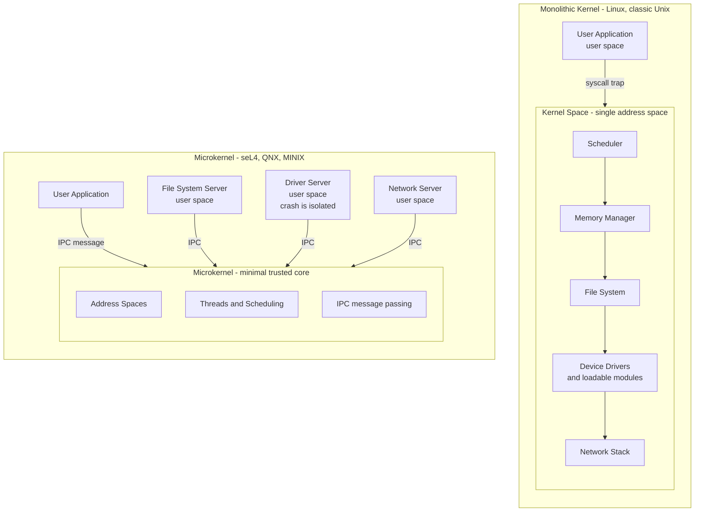

# 🏛️ OS Structure and Kernel Architectures

> [!abstract] TL;DR
> The **kernel** is the trusted core of an operating system, and how you *structure* it — cramming every service into one privileged program (**monolithic**), shrinking it to bare essentials and pushing services into isolated user-space servers (**microkernel**), or splitting the difference (**hybrid**) — is the single design choice that ripples through performance, reliability, security, and how hard the system is to verify. Monolithic kernels are fast because everything is a direct function call; microkernels are safer because a crashed driver cannot take down the core, at the cost of IPC overhead on every service request.

---

## Intuition

**Analogy:** How do you organize a government? A **monolithic kernel** is one giant all-powerful building where every department — treasury, police, roads, post — shares the same floor. Coordination is instant because everyone is in the same room and can just shout across the desk (a direct function call). But there are no fire doors: if one department starts a fire — a buggy printer driver — the whole building can burn down.

A **microkernel** is the opposite: a tiny central office that does only three things — hand out rooms (address spaces), assign staff (threads and scheduling), and route the mail (IPC). Every actual department — file system, network stack, drivers — is a separate independent office across the street. If one office burns down, you just rebuild that office; the government keeps running. The price is that every request now travels as a memo passed through the mail room, and all that messaging is slower than shouting across a desk.

A **hybrid kernel** is the pragmatic compromise: keep the departments you call constantly (memory, scheduling) inside the main building for speed, but move the risky or optional ones into separate offices.

---

## How It Works

A CPU runs in at least two privilege levels: **kernel mode** (unrestricted access to all hardware and memory) and **user mode** (sandboxed). The kernel is simply the code that runs in kernel mode. Every design philosophy answers one question differently: *how much code do we trust with kernel-mode power, and how do the pieces talk to each other?*

- **Monolithic** — Scheduling, memory management, file systems, device drivers, and the network stack all run in **one kernel-mode address space**. A subsystem calls another subsystem the way any C program calls a function: a `call` instruction, a few nanoseconds, no boundary crossing. This is why Linux and classic Unix are fast. Functionality is added at runtime with **loadable kernel modules (LKMs)** — drivers and filesystems compiled separately and inserted into the running kernel — but an LKM runs with full kernel privilege, so a bug in it can panic the whole system.
- **Microkernel** — The kernel provides only **address spaces, threads/scheduling, and IPC**. Everything else — the file system, drivers, paging policy, network stack — runs as an ordinary **user-space server** in its own protected address space. A request that a monolithic kernel handles with an internal function call now becomes a **message sent through the microkernel to a server, and a reply sent back**. Each crossing is an IPC round trip plus a context switch. The upside: a crashed driver is just a crashed process — the microkernel restarts it and the system survives.
- **Hybrid** — Keep performance-critical services (memory manager, scheduler) in kernel space for monolithic-like speed, while retaining modularity elsewhere. Windows NT and XNU (macOS/iOS) are hybrids: NT has a kernel-mode Executive; XNU wraps the **Mach** microkernel with a large in-kernel BSD layer and drivers.

The mechanism that decides everything downstream is the **subsystem boundary crossing**: a function call in a monolith, an IPC in a microkernel. Multiply that per-crossing cost by how many subsystems a typical request touches and you get the classic performance debate.



---

## Key Concepts

### Secondary — the big idea

- **Kernel vs user space.** The kernel is the trusted program that talks directly to the hardware; your apps live in user space and must ask the kernel for anything privileged.
- **One big program vs many small ones.** A monolithic kernel is one large program holding every OS service. A microkernel is a tiny program that delegates services to separate helper programs.
- **The core trade.** Together in one room is *fast but fragile*; separate offices passing memos is *safe but slower*.

### Undergraduate — the design space

- **Monolithic kernels** put all services in kernel space; inter-subsystem calls are cheap function calls. Examples: **Linux, BSD, classic Unix**. Extensibility via **loadable kernel modules**.
- **Microkernels** keep only address spaces, threads, and IPC in the kernel; services are user-space servers. Examples: **Mach, MINIX 3, QNX, L4, seL4**. Fault isolation is the headline benefit.
- **Hybrid kernels** blend both: kernel-mode core services plus some modularity. Examples: **Windows NT, XNU (macOS)**.
- **The Tanenbaum-Torvalds debate (1992).** Andrew Tanenbaum argued microkernels were the modern, correct design and called monolithic Linux "obsolete." Linus Torvalds countered that microkernel IPC overhead made them impractical and that a pragmatic monolith won on real hardware. For a decade, performance made the monolith win.
- **Other structures.** *Layered* systems stack the OS in strict tiers (each layer uses only the one below). The *exokernel* idea minimizes abstraction, letting applications manage hardware directly. *Unikernels / library OSes* compile a single application plus just the OS pieces it needs into one bootable image.

### Graduate — why the debate flipped

- **IPC is the whole game.** Jochen Liedtke's L4 work (1990s) showed microkernel slowness was an *implementation* failure, not a fundamental one: by co-designing IPC with the hardware (register-based message transfer, minimal cache/TLB footprint), L4 cut IPC cost by an order of magnitude, narrowing the gap monolithic kernels had exploited.
- **Trusted Computing Base (TCB).** The TCB is all the code that must be correct for security to hold. A monolithic Linux kernel puts ~20+ million lines in the TCB; **seL4 is roughly 10,000 lines**. A smaller TCB is exponentially easier to audit, secure, and *prove* correct.
- **Formal verification.** **seL4** is the first general-purpose OS kernel with a machine-checked proof that its C implementation refines its formal specification — no buffer overflows, no null derefs, no privilege-escalation bugs *relative to the spec and its assumptions*. This is only tractable because the microkernel is tiny; you could never verify a 20-million-line monolith.
- **Capability-based security.** Modern microkernels (seL4, L4) mediate every operation through unforgeable **capabilities** rather than ambient authority, giving fine-grained least privilege that pairs naturally with the small TCB.
- **Downstream consequences.** The structure choice dictates the driver model (in-kernel vs user-space, restartable), extensibility (LKMs vs spawning a server), fault isolation (kernel panic vs process restart), and how much of the system can be formally trusted.

---

## Python Demo

```python
# Model the MONOLITHIC-vs-MICROKERNEL trade quantitatively.
# A single service request (e.g. "read a file served over the network")
# must traverse N kernel subsystems:
#   syscall -> VFS -> filesystem -> block driver -> network stack -> ...
# In a MONOLITHIC kernel each crossing is a cheap in-kernel FUNCTION CALL.
# In a MICROKERNEL each crossing leaves the tiny core and re-enters a
# user-space server, so every crossing pays an IPC + CONTEXT-SWITCH cost.
# numpy / matplotlib only.

import numpy as np
import matplotlib.pyplot as plt

# Per-event costs in nanoseconds (representative, order-of-magnitude)
SYSCALL_ENTRY = 100.0     # fixed cost to enter the kernel once
FUNC_CALL     = 5.0       # in-kernel function call between subsystems
IPC_CLASSIC   = 2000.0    # Mach-era IPC round trip (~2 microseconds)
IPC_MODERN    = 300.0     # seL4 / L4 fast-path IPC (sub-microsecond)

# Hybrid: only a fraction of crossings cross the user/kernel boundary;
# performance-critical services stay in-kernel as plain function calls.
HYBRID_IPC_FRACTION = 0.30

crossings = np.arange(1, 13)   # subsystem crossings per request

def latency(n, per_crossing):
    return SYSCALL_ENTRY + n * per_crossing

mono    = latency(crossings, FUNC_CALL)
classic = latency(crossings, IPC_CLASSIC)
modern  = latency(crossings, IPC_MODERN)
hybrid_cost = HYBRID_IPC_FRACTION * IPC_MODERN + (1 - HYBRID_IPC_FRACTION) * FUNC_CALL
hybrid  = latency(crossings, hybrid_cost)

fig, (ax1, ax2) = plt.subplots(1, 2, figsize=(13, 5))

# ---- Panel 1: latency vs number of subsystem crossings ---------------
ax1.plot(crossings, mono,    "o-", label="Monolithic (in-kernel calls)")
ax1.plot(crossings, hybrid,  "s-", label="Hybrid (mostly in-kernel)")
ax1.plot(crossings, modern,  "^-", label="Modern microkernel (seL4/L4 IPC)")
ax1.plot(crossings, classic, "d-", label="Classic microkernel (Mach IPC)")
ax1.set_yscale("log")
ax1.set_xlabel("Subsystem crossings per request")
ax1.set_ylabel("End-to-end latency (ns, log scale)")
ax1.set_title("IPC overhead grows with every subsystem boundary")
ax1.grid(True, which="both", alpha=0.3)
ax1.legend()

# ---- Panel 2: the design space (performance vs isolation) ------------
names    = ["Monolithic\n(Linux)", "Hybrid\n(NT / XNU)",
            "Modern micro\n(seL4)", "Classic micro\n(Mach)"]
perf     = np.array([1.00, 0.90, 0.75, 0.40])      # relative throughput
isolate  = np.array([0.30, 0.50, 0.95, 0.85])      # fault isolation / reliability
tcb_kloc = np.array([20000.0, 8000.0, 9.0, 60.0])  # kernel-space TCB size (KLOC)

sizes = 200 * np.log10(tcb_kloc + 10)              # bubble area ~ log(TCB)
sc = ax2.scatter(perf, isolate, s=sizes, alpha=0.55,
                 c=np.log10(tcb_kloc + 10), cmap="viridis")
for x, y, n in zip(perf, isolate, names):
    ax2.annotate(n, (x, y), textcoords="offset points",
                 xytext=(8, 8), fontsize=9)
ax2.set_xlabel("Relative performance (higher = faster)")
ax2.set_ylabel("Fault isolation / reliability")
ax2.set_title("Design space: bubble size = kernel-space TCB (log LOC)")
ax2.grid(True, alpha=0.3)
cbar = fig.colorbar(sc, ax=ax2)
cbar.set_label("log10(TCB KLOC) - smaller is easier to verify")

plt.tight_layout()
plt.savefig("kernel_architecture_tradeoff.png", dpi=120)
plt.show()

# ---- Console summary --------------------------------------------------
n = 8
print(f"For a request crossing {n} subsystems:")
print(f"  Monolithic    : {latency(n, FUNC_CALL):8.1f} ns")
print(f"  Hybrid        : {latency(n, hybrid_cost):8.1f} ns")
print(f"  Modern micro  : {latency(n, IPC_MODERN):8.1f} ns")
print(f"  Classic micro : {latency(n, IPC_CLASSIC):8.1f} ns")
ratio = latency(n, IPC_CLASSIC) / latency(n, FUNC_CALL)
print(f"  -> classic microkernel is ~{ratio:.0f}x slower here, but a crashed")
print(f"     user-space driver cannot take down the trusted core.")
```

**What it shows:** on a log axis the monolithic and hybrid lines stay flat and cheap while the classic microkernel's latency explodes with every extra subsystem boundary — exactly why Mach-era microkernels lost the performance argument. The modern-microkernel line sits far below the classic one, illustrating how L4/seL4's engineered IPC closed most of the gap. The second panel reframes the trade: microkernels give up some performance to buy dramatic gains in fault isolation *and* a TCB small enough to formally verify, with hybrids landing pragmatically in the middle.

---

## Real-World Applications

- **Linux / BSD (monolithic).** The world's servers, Android, and most supercomputers run a monolithic kernel with loadable modules. Chosen for raw performance and a huge driver ecosystem; the trade-off is a massive TCB and the fact that a bad driver can panic the box.
- **Windows NT / XNU (hybrid).** Windows (NT kernel) and macOS/iOS (XNU = Mach core + BSD layer) keep drivers and core services in kernel space for speed while retaining some modular structure. Practical desktops and phones live here.
- **QNX (microkernel).** Powers cars (infotainment and increasingly ADAS), medical devices, and industrial control — anywhere a driver crash must never crash the system. Its microkernel restartability is a safety feature.
- **seL4 (verified microkernel).** Used in defense, avionics, secure enclaves, and the DARPA HACMS program that made an unmanned helicopter's flight computer un-hackable in a red-team exercise. Its formal proof is the selling point.
- **MINIX 3 (microkernel).** Ironically shipped inside hundreds of millions of PCs: the Intel Management Engine ran MINIX 3 as its firmware OS.
- **Unikernels & minimal OSes (library OS).** MirageOS and similar compile one app plus a thin OS into a single image with a tiny attack surface — a natural fit for cloud functions and appliances, and conceptually adjacent to how **containers** trim the OS. Note that containers, unlike microkernels or VMs, all *share the one host kernel*, so the host's kernel architecture directly bounds their isolation.

*(Companion notes to be created in this vault — **Operating_Systems_Overview**, **System_Calls_and_the_Kernel_Interface**, **Interprocess_Communication**, **Protection_and_Access_Control**, **OS_Security_and_Isolation**, **Virtualization_and_Hypervisors**, **Containers_and_OS_Level_Virtualization**, and **The_Future_of_Operating_Systems** — expand these threads.)*

---

## Common Pitfalls

- **"Microkernels are always slow."** True for Mach in the 1990s; false today. Liedtke's L4 and later seL4 re-engineered IPC to be sub-microsecond. The historical loss was an implementation problem, not a law of physics.
- **Calling Windows/macOS "microkernels."** NT and XNU are **hybrids**. XNU contains Mach, but drivers and the BSD layer run in kernel space, so it does not get microkernel-grade fault isolation.
- **Assuming a small kernel means a small TCB.** If your file-system server or driver server must be trusted for security, it is *in* the TCB even though it runs in user space. Microkernels shrink the TCB only when servers are properly compartmentalized with capabilities.
- **Thinking loadable kernel modules give isolation.** An LKM runs with full kernel privilege in the monolith's address space. A bug in a third-party driver module can corrupt kernel memory and panic the whole machine — the opposite of a restartable user-space driver server.
- **Reading "formally verified" as "bug-free forever."** seL4's proof guarantees the implementation matches its spec *under stated assumptions* (correct compiler, correct hardware model, correct spec). It rules out whole bug classes; it does not make hardware faults or spec mistakes disappear.
- **Treating containers as strong isolation like VMs.** Containers share the single host kernel, so they inherit the host's monolithic TCB. A kernel-level escape breaks the boundary — a key reason security-sensitive multi-tenant workloads still reach for hypervisors or microkernel-based isolation.

---

## Related Concepts

- [[Process_Management]] — the scheduler and process/threads that a kernel manages; in a microkernel the file system and drivers are themselves ordinary user-space processes.
- [[Linux_Fundamentals]] — Linux is the canonical monolithic kernel with loadable modules, the reference point for the whole debate.
- [[Virtual_Memory_and_TLB]] — the MMU-backed address spaces the kernel provides are the isolation primitive microkernels build servers on; IPC cost is dominated by the context switch and TLB/cache effects this note explains.
- [[Interrupts_and_DMA]] — device handling that in a monolith runs in-kernel but in a microkernel is delegated to a user-space driver server that fields interrupts via IPC.
- [[Container_and_Kubernetes_Security]] — containers share the host's monolithic kernel, so kernel architecture directly bounds how strong their isolation can be.
- [[OS_Hardening]] — reducing attack surface and privileged code is exactly the TCB-minimization argument that favors microkernels.
- [[CIA_Triad_and_Security_Models]] — the reference-monitor / trusted-computing-base concepts that make a small verifiable kernel valuable for security.

---

## Review Questions

1. **(Secondary)** In one sentence each, explain why a monolithic kernel is fast and why a microkernel is more reliable. What is the everyday "government building" version of each?
2. **(Undergraduate)** A request must pass through five subsystems. Using in-kernel function calls at ~5 ns and classic IPC at ~2000 ns per crossing, estimate the latency in each architecture. What did Liedtke change to make microkernel IPC competitive, and why did that reopen the Tanenbaum-Torvalds debate?
3. **(Graduate)** You are designing the flight-control computer for an autonomous drone where a driver crash must never bring down the system and the security-critical code must be formally verified. Would you choose Linux, Windows NT, or seL4 — and justify the choice in terms of TCB size, fault isolation, IPC overhead, and verifiability. Where do containers fit, and why would you not rely on them alone for isolation here?

---

## Sources

- [Liedtke, "On Micro-Kernel Construction", SOSP 1995](https://dl.acm.org/doi/10.1145/224056.224075)
- [Klein et al., "seL4: Formal Verification of an OS Kernel", SOSP 2009](https://dl.acm.org/doi/10.1145/1629575.1629596)
- [The seL4 Microkernel — project site and whitepaper](https://sel4.systems/)
- [The Tanenbaum-Torvalds Debate (Open Sources, O'Reilly)](https://www.oreilly.com/openbook/opensources/book/appa.html)
- [Silberschatz, Galvin, Gagne — Operating System Concepts, Ch. 2 "Operating-System Structures"](https://www.os-book.com/OS10/)

---

#operating-systems #kernel-architecture #microkernel #monolithic-kernel #os-design
