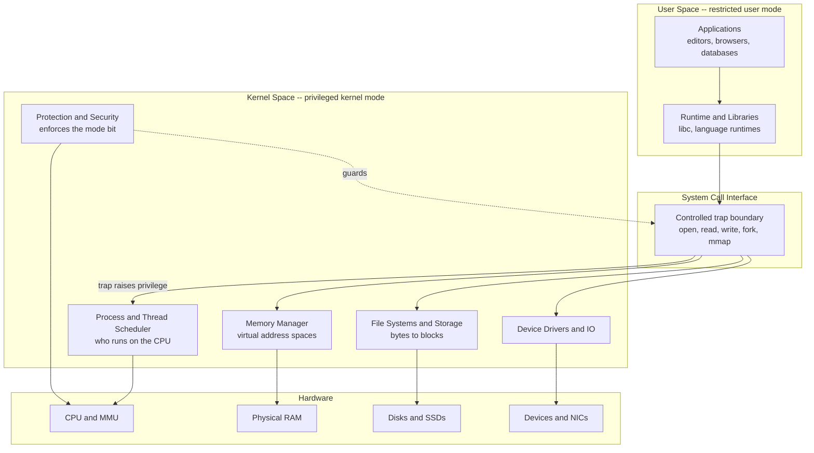

# 🖥️ Operating Systems Overview

> [!abstract] TL;DR
> An operating system is the software layer between raw hardware and your programs. It plays two roles at once: a **resource manager** that arbitrates the CPU, memory, storage, and I/O devices among competing programs fairly and efficiently, and an **abstraction layer** that hides messy hardware behind clean, portable ideas like processes, files, and address spaces. This note opens the six-section Operating Systems vault.

---

## Intuition

**Analogy:** An operating system is the **government of a computer**. You, an ordinary citizen (an application), never dig up the roads or run the power grid yourself. You use clean public services — roads, water, electricity — and trust an unseen administration to build them, ration them fairly among everyone, and stop any one person from hogging or wrecking them. When you want something official, you don't storm into the vault; you fill out a **form at a counter** (a system call) and a privileged clerk does the dangerous part on your behalf.

Translated to the machine: applications never touch the raw disk controller, the memory chips, or the interrupt lines. They ask the OS. The OS decides *whose turn it is* on the single CPU, *which physical memory* each program is allowed to see, and *which bytes on disk* belong to which file — while enforcing the rules that keep one buggy program from crashing everyone else. It is the invisible manager that turns a pile of silicon into a usable, shared, safe machine.

---

## How It Works

### The Two Core Roles

An OS exists to solve one hard problem — *many programs, one set of physical resources* — from two angles:

1. **Resource Manager (the arbiter).** There is one CPU (or a handful of cores), a fixed pool of RAM, some disks, and a few devices, but dozens or thousands of programs want them *right now*. The OS multiplexes each resource in time (time-sharing the CPU) and in space (partitioning memory), deciding who runs, who waits, and who gets evicted — balancing **fairness**, **efficiency**, and **responsiveness**. This is the theme of scheduling and memory allocation covered later in the vault.
2. **Abstraction Layer (the extended machine).** Raw hardware is hostile: disks speak in cylinders and sectors, network cards speak in DMA descriptors, memory is a flat array of physical addresses shared by everyone. The OS wraps all of this in tidy, uniform abstractions — a **process** (a running program with its own illusion of the CPU), a **file** (a named, growable stream of bytes), an **address space** (each program's private illusion of all of memory). Programmers target these stable abstractions instead of a thousand device quirks, which is exactly why the same C program runs on wildly different hardware.

### Kernel vs User Space and the Mode Bit

The single most important structural idea is **dual-mode operation**. The CPU carries a hardware **mode bit** with two settings:

- **Kernel mode (privileged):** every instruction is allowed — halt the CPU, reprogram the memory-management unit, talk directly to devices, disable interrupts. The **kernel** — the core of the OS — runs here.
- **User mode (restricted):** privileged instructions are forbidden. If a user program tries to touch memory it doesn't own or execute a privileged instruction, the hardware **traps** into the kernel instead of obeying.

This boundary is the foundation of **protection**: a bug or malicious app in user space physically *cannot* corrupt the kernel or other processes, because the hardware refuses. The full mechanism — traps, interrupts, and the mode switch — is developed in the vault's *Interrupts, Traps, and Dual-Mode Operation* note.

### The System-Call Interface

If user programs can't touch hardware, how do they read a file or start a thread? Through a **system call** — the "counter" in the government analogy. A system call is a *controlled, deliberate trap*: the program loads a call number and arguments, executes a special trap instruction, and the CPU jumps to a fixed kernel entry point **while flipping the mode bit to privileged**. The kernel validates the request, does the dangerous work, and returns to user mode with a result. `read`, `write`, `open`, `fork`, and `mmap` are all system calls. This narrow, guarded gateway is the *only* legitimate door from user space into the kernel; it is detailed in the *System Calls and the Kernel Interface* note.

### Flow / Architecture



The picture reads bottom-to-top as **abstraction** and top-to-bottom as **control**: hardware at the base, the kernel as both manager and translator above it, the system-call gate as the only opening, and unprivileged applications on top. The same kernel is simultaneously the *resource manager* (deciding CPU, memory, and I/O allocation) and the *abstraction layer* (turning blocks into files, physical frames into address spaces).

---

## Key Concepts

### Secondary (intuition level)
- **What the OS manages:** the CPU (via scheduling), memory (who gets which RAM), storage (files and directories), and I/O devices (keyboard, disk, network).
- **Why it exists:** so many programs can share one machine safely without stepping on each other, and so programmers get simple building blocks instead of raw hardware.
- **Familiar examples:** Windows, macOS, Linux, Android, and iOS are all operating systems doing the same job in different clothes.

### Undergraduate (mechanism level)
- **Dual-mode operation and the mode bit:** hardware-enforced separation of privileged kernel mode from restricted user mode; the root of all protection.
- **Processes and threads:** the OS's unit of a running program (its own address space) and the unit of scheduling within it. Concurrency introduces **race conditions**, solved with synchronization primitives (covered in the *Process Synchronization* note).
- **Virtual memory:** each process sees a private linear address space; the OS + MMU translate virtual to physical addresses and page in data on demand, developed in the vault's *Virtual Memory and Demand Paging* note.
- **The system-call boundary:** the controlled trap gateway; the difference between a *library call* (stays in user space) and a *system call* (crosses into the kernel).
- **File-system abstraction:** naming, directories, permissions, and the block-to-byte translation that turns spinning platters or flash into `/home/user/notes.txt`.

### Graduate (design and tension level)
- **Kernel architectures:** **monolithic** (all services in one privileged address space — Linux, classic Unix; fast but large trusted base), **microkernel** (minimal kernel; drivers and file systems run as user-space servers — MINIX, QNX, seL4; robust and verifiable but with IPC overhead), and **hybrid** (a pragmatic blend — Windows NT, macOS XNU). Expanded in the *OS Structure and Kernel Architectures* note.
- **Design goals in tension:** *performance vs fairness* (a work-conserving scheduler maximizes throughput but can starve low-priority tasks), *simplicity vs functionality* (every feature enlarges the attack surface and the trusted computing base), and *protection vs sharing* (strong isolation fights against fast inter-process communication and shared memory).
- **Mechanism vs policy separation:** the kernel provides *mechanisms* (context switch, page fault handling) while leaving *policy* (which process, which page to evict) tunable — a recurring OS design principle.
- **Formal verification frontier:** microkernels like seL4 are small enough to be *machine-proved* correct, trading generality for a mathematically trustworthy core.

---

## Python Demo

This simulation makes the OS's **resource-arbiter** role concrete. Six "programs" compete for a fixed CPU budget. Under a **free-for-all** (no OS), the greediest programs grab a share proportional to their aggressiveness and small programs **starve**. Under an **OS allocator** using max-min fair sharing, spare capacity is redistributed so no one is starved. We quantify the difference with **Jain's fairness index** and then draw a **Gantt timeline** showing the OS multiplexing one CPU among all processes via round-robin.

```python
# OS as resource ARBITER: free-for-all vs OS-managed allocation,
# plus a Gantt timeline of one CPU multiplexed across many processes.
# numpy + matplotlib only; deterministic (no randomness needed).
import numpy as np
import matplotlib.pyplot as plt

# --- Six "programs" competing for a fixed CPU budget of 100 units ---
names  = [f"P{i}" for i in range(6)]
demand = np.array([40, 35, 30, 20, 15, 10], dtype=float)  # what each WANTS
BUDGET = 100.0

# 1) NO OS -- free-for-all: aggressive processes grab share ~ demand^2
weights = demand ** 2
free    = BUDGET * weights / weights.sum()
free    = np.minimum(free, demand)          # can't use more than it wants

# 2) OS ARBITER -- max-min fair share, redistributing spare capacity
def max_min_fair(demand, budget):
    alloc, remaining = np.zeros_like(demand), budget
    active = np.ones_like(demand, dtype=bool)
    while active.any() and remaining > 1e-9:
        share  = remaining / active.sum()
        capped = active & (demand - alloc <= share)   # want less than fair share
        if capped.any():
            give = demand[capped] - alloc[capped]
            alloc[capped] += give
            remaining     -= give.sum()
            active[capped] = False
        else:
            alloc[active] += share
            break
    return alloc

os_alloc = max_min_fair(demand, BUDGET)

# Jain's fairness index: 1.0 = perfectly fair, 1/n = one process hogs all
jain = lambda x: x.sum() ** 2 / (len(x) * (x ** 2).sum())

print(f"free-for-all  alloc={np.round(free,1)}  "
      f"fairness={jain(free):.3f}  min-share={free.min():.1f}")
print(f"OS-managed    alloc={np.round(os_alloc,1)}  "
      f"fairness={jain(os_alloc):.3f}  min-share={os_alloc.min():.1f}")

# --- Gantt timeline: ONE CPU round-robin across the six processes ---
slices = np.array([8, 7, 6, 4, 3, 2])   # CPU quanta each process needs
rem, t, segments = slices.copy(), 0, []
while rem.sum() > 0:
    for i in range(len(rem)):
        if rem[i] > 0:
            segments.append((i, t)); t += 1; rem[i] -= 1

# --- Plot ---
fig, (ax1, ax2) = plt.subplots(1, 2, figsize=(13, 5))
x = np.arange(len(names)); w = 0.35
ax1.bar(x - w/2, free,     w, label="Free-for-all (no OS)", color="#d9534f")
ax1.bar(x + w/2, os_alloc, w, label="OS-managed (fair)",   color="#5cb85c")
ax1.plot(x, demand, "ko--", label="Demand (wanted)", alpha=0.6)
ax1.set_xticks(x); ax1.set_xticklabels(names)
ax1.set_ylabel("CPU units granted")
ax1.set_title(f"Allocation & Starvation\n"
              f"fairness: {jain(free):.2f} -> {jain(os_alloc):.2f}")
ax1.legend()

cmap = plt.cm.tab10
for (i, start) in segments:
    ax2.barh(i, 1, left=start, color=cmap(i), edgecolor="white")
ax2.set_yticks(range(len(names))); ax2.set_yticklabels(names)
ax2.set_xlabel("Time (CPU quanta)")
ax2.set_title("One CPU multiplexed via round-robin")
ax2.invert_yaxis()

plt.tight_layout(); plt.savefig("os_overview_demo.png", dpi=110)
print("saved os_overview_demo.png")
```

**What you see:** the free-for-all leaves the smallest program `P5` nearly starved while `P0` hogs the CPU (low fairness index); the OS allocator caps the greedy and hands the surplus to the starving, pushing Jain's index toward 1.0. The Gantt panel shows the illusion every user relies on — one physical CPU sliced finely enough that all six processes appear to run "at the same time."

---

## Real-World Applications

> **Example — the Linux kernel.** When you run `ls | grep txt` in a terminal, the shell issues `fork` and `execve` **system calls**; the kernel's **Completely Fair Scheduler** time-slices both processes across your cores; the **virtual memory** subsystem gives each its own address space and pages code in on demand; the **VFS** turns your `read` calls on the pipe and files into block requests; and **device drivers** move the bytes to your terminal — all while the **mode bit** keeps a crash in `grep` from taking down the machine.

- **Cloud and virtualization:** hypervisors (KVM, Xen, VMware) apply the exact same ideas one level up — treating whole *guest OSes* as the "programs" to be scheduled and isolated. Containers (Docker) reuse Linux kernel features (namespaces, cgroups) to slice one OS into many.
- **Mobile:** Android (Linux kernel) and iOS (XNU hybrid kernel) aggressively manage battery, memory, and background processes — resource arbitration where the scarce resource is *energy*.
- **Embedded and real-time:** QNX (a microkernel) runs cars and medical devices where a mis-scheduled task is a safety failure, showing why kernel architecture choice matters.
- **Where it sits in the CS stack:** compilers emit code that targets OS abstractions; databases fight the OS over caching and I/O ordering; networking and distributed systems build on the process and socket abstractions the OS provides.

---

## Common Pitfalls

- **Confusing the OS with the shell or desktop.** The GUI, terminal, and app store are *programs* running on top of the OS, not the OS itself. The OS proper is the kernel plus its core services; everything you click is a user-space client of it.
- **Thinking a system call is "just a function call."** A library call stays in user mode; a *system call* crosses the mode-bit boundary via a trap and costs far more (hundreds of cycles). Chatty programs that make millions of tiny syscalls are slow for this reason — batching (e.g. `io_uring`, buffered I/O) exists to amortize the crossing.
- **Assuming "virtual memory" means "swap/disk."** Virtual memory is primarily an *abstraction and protection* mechanism — each process's private address space — that *also* enables paging to disk. Equating it only with swap misses its main purpose.
- **Believing the OS makes programs faster.** The OS adds overhead (context switches, syscalls, page faults); its value is *fair sharing, protection, and portability*, not raw speed. A single dedicated program on bare metal can be faster — but unusable as a shared, safe system.
- **Ignoring the mechanism/policy split.** Blaming "the kernel" for a bad scheduling decision often confuses a *mechanism* bug with a *policy* (tunable) choice; many "OS problems" are configuration, not code.

---

## Related Concepts

- [[CPU_Datapath_and_Control]] — the hardware the OS multiplexes; the mode bit and privileged instructions live in this datapath.
- [[Interrupts_and_DMA]] — the hardware mechanism behind traps and the mode switch that the system-call and I/O paths depend on.
- [[Virtual_Memory_and_TLB]] — the MMU/TLB hardware that makes the OS's per-process address-space abstraction fast.
- [[Cache_Hierarchy]] — the memory layers above RAM that scheduling and context switches interact with.
- [[Memory_Mapped_IO]] — how the kernel's device drivers actually reach hardware registers.
- [[Multi_Core_Programming]] — why modern schedulers and synchronization exist: real machines have many cores, not one CPU.
- [[Process_Management]] — the practical, Linux-command view of the processes this note introduces abstractly.
- [[Linux_Fundamentals]] — a concrete, production operating system embodying every idea here.
- [[Consensus_and_Raft]] — where OS ideas of coordination scale up into distributed and "modern" operating systems.
- [[Turing_Machines_and_the_Church_Turing_Thesis]] — the theoretical model of computation the OS turns into a usable physical machine.

*Forthcoming sibling notes in this vault (referenced above, not yet written): Processes and the Process Model, System Calls and the Kernel Interface, Interrupts Traps and Dual-Mode Operation, CPU Scheduling Algorithms, Process Synchronization and Race Conditions, Memory Management and Allocation, Virtual Memory and Demand Paging, File Systems and Abstractions, IO Systems and Device Drivers, Protection and Access Control, and OS Structure and Kernel Architectures.*

---

## Review Questions

1. **(Conceptual)** The note says an OS plays two roles at once — resource manager and abstraction layer. Take a single `read("/etc/hosts")` call and explain which parts of it belong to each role. Where do the two roles overlap?
2. **(Scenario)** You are designing firmware for a pacemaker where a missed deadline can kill the patient, versus a web server where average throughput matters most. For each, would you favour a monolithic or a microkernel design, and which design tension (performance vs fairness, simplicity vs functionality, protection vs sharing) dominates your choice?
3. **(Trade-off)** The mode bit gives strong protection but forces every hardware request through a costly trap. Describe a workload where this syscall overhead becomes the bottleneck, and name two mechanisms (from the note or your own knowledge) that reduce the cost *without* removing the protection.

---

## Sources

- Silberschatz, Galvin, Gagne — *Operating System Concepts*, 10th ed. (Wiley, 2018), Ch. 1–2. [https://www.os-book.com/OS10/](https://www.os-book.com/OS10/)
- Tanenbaum & Bos — *Modern Operating Systems*, 4th ed. (Pearson, 2015), Ch. 1. [https://www.pearson.com/](https://www.pearson.com/)
- Arpaci-Dusseau — *Operating Systems: Three Easy Pieces* (free online), "Introduction to Operating Systems." [https://pages.cs.wisc.edu/~remzi/OSTEP/](https://pages.cs.wisc.edu/~remzi/OSTEP/)
- The Linux Kernel documentation — "The kernel's command-line and architecture overview." [https://www.kernel.org/doc/html/latest/](https://www.kernel.org/doc/html/latest/)
- R. Jain, D. Chiu, W. Hawe — "A Quantitative Measure of Fairness and Discrimination" (DEC-TR-301, 1984), source of Jain's fairness index. [https://www.cse.wustl.edu/~jain/papers/fairness.htm](https://www.cse.wustl.edu/~jain/papers/fairness.htm)

---

#operating-systems #os-fundamentals #kernel #resource-management #abstraction
