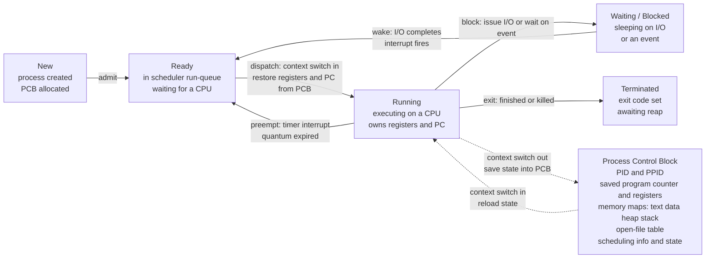

# 🧩 Processes and the Process Model

> [!abstract] TL;DR
> A **process** is the operating system's fundamental abstraction of a *running program*: a passive program on disk becomes an active process with its own **address space** (text, data, heap, stack), **program counter and registers**, and **open files**. The kernel tracks each process in a **Process Control Block (PCB)** and moves it through five states — **New, Ready, Running, Waiting/Blocked, Terminated**. Switching the CPU from one process to another (**context switch**) means saving one PCB and restoring another. Processes are created with the **fork/exec** model and reaped with **wait**, and by default they are **isolated** — they must use explicit IPC to cooperate.

## Intuition

**Analogy:** A **program is a recipe** sitting in a cookbook — passive text, doing nothing. A **process is the act of actually cooking that recipe**: a running instance with its own countertop (memory), ingredients in various stages of preparation (data, heap, stack), and a **bookmark on the current step** (the program counter). Two chefs cooking the same recipe are two separate processes, each with their own countertop and bookmark.

The head chef (the OS) has only a few burners (CPUs) but many dishes in progress. So it lets one cook work for a moment, **freezes them mid-step by writing down exactly where they are** (saving the PCB), swaps a different cook onto the burner (a context switch), and later lets the first cook resume from the exact bookmarked step. Because the swaps happen thousands of times a second, it *looks* like every dish is being cooked at once — this illusion is **time-sharing**.

---

## How It Works

### Core Mechanics

1. **Program vs process.** The program is a static executable file (ELF/PE) on disk. A process is that program *loaded into memory and executing*, with runtime state that the file never had: a value in every CPU register, a stack of function calls, a heap of allocations, and a set of open file descriptors. Run `python` twice and you have one program but two independent processes.

2. **What a process contains — the address space.** Each process gets its own private **virtual address space**, conventionally laid out as:
   - **Text / code** — the machine instructions, usually read-only and shareable.
   - **Data / BSS** — initialized and zero-initialized global variables.
   - **Heap** — dynamically allocated memory (`malloc`/`new`), grows upward.
   - **Stack** — call frames, local variables, return addresses; grows downward.
   Plus the live CPU context: the **program counter** (next instruction) and the **general-purpose and status registers**. This private mapping is the reason one process cannot casually read another's memory (see the future *Memory_Management_and_Allocation* note).

3. **The Process Control Block (PCB).** For every process the kernel keeps one PCB — the data structure that *is* the process from the kernel's point of view. It holds the **PID and parent PID**, the **saved registers and program counter** (used to freeze/resume the process), the **memory maps** describing text/data/heap/stack, the **open-file table** (file-descriptor to kernel-file mapping), and **scheduling information** (state, priority, accounting). On Linux this is `struct task_struct`; on Windows it is `EPROCESS`.

4. **The five-state model.** A process is always in exactly one state: **New** (being created), **Ready** (able to run, waiting for a CPU), **Running** (currently executing on a CPU), **Waiting/Blocked** (sleeping until some event, usually I/O completion), or **Terminated** (finished, awaiting cleanup). A process blocks on I/O because a disk or network operation is roughly a million times slower than a CPU cycle — rather than spin idle, the process yields the CPU and the scheduler runs someone else.

5. **Context switching.** When the CPU is handed from process A to process B, the kernel **saves A's registers and PC into A's PCB**, then **loads B's registers and PC from B's PCB**. This is pure overhead (no useful user work happens during it) and is triggered by a **timer interrupt** (quantum expired), a **blocking system call** (A waits on I/O), or a **higher-priority process becoming Ready**. Beyond the register save/restore, a switch pollutes CPU caches and may flush the TLB, so its true cost is often larger than it looks.

6. **Creation — fork/exec.** In the Unix model, `fork()` **clones the calling process**, producing a near-identical child that differs only in its PID and `fork`'s return value (child PID in the parent, `0` in the child). Modern kernels make this cheap with **copy-on-write**: parent and child share physical pages marked read-only, and a page is copied only when one side writes to it. `exec()` then **replaces the child's image** with a new program. This fork-then-exec split is how a shell launches every command, and it builds a **process tree** rooted at **init / PID 1**, which adopts orphaned children.

7. **Termination — exit, wait, reaping.** A process ends by calling `exit()` or being killed by a signal. It becomes a **zombie**: dead, but its PCB lingers so the parent can read its exit status via `wait()`/`waitpid()` — this is **reaping**. A parent that never waits leaks zombies; a child whose parent dies first becomes an **orphan** and is re-parented to init, which reaps it.

### State Machine, PCB, and Context Switch



**PCB fields at a glance:**

| Field group | Examples | Why the kernel needs it |
|-------------|----------|-------------------------|
| Identity | PID, PPID, user/group ID | Name the process, enforce ownership, build the tree |
| CPU context | Program counter, general + status registers, stack pointer | Freeze and resume across a context switch |
| Memory | Page-table pointer, text/data/heap/stack extents | Give the process its private address space |
| Files | Open-file descriptor table, working directory | Route reads/writes to the right kernel objects |
| Scheduling | State, priority, time-slice, accounting counters | Decide who runs next and for how long |

---

## Key Concepts

### Secondary (first exposure)
- **Program = passive recipe; process = active cooking.** Running the same program twice creates two independent processes.
- A process owns **its own memory and its own bookmark** (program counter) into the code.
- The OS runs "many things at once" on a few CPUs by **switching between processes very fast** (time-sharing) — the parallelism is largely an illusion on a single core.

### Undergraduate (CS core)
- **Address-space layout:** text (code), data/BSS (globals), heap (grows up), stack (grows down), plus the live register set and PC.
- **PCB** as the per-process kernel record: identity, saved CPU context, memory maps, file table, scheduling state.
- **Five-state model** and every transition; **blocking on I/O** exists because I/O is orders of magnitude slower than the CPU.
- **Context switch** = save current PCB + load next PCB; it is overhead, not work.
- **fork/exec/wait:** `fork` duplicates (copy-on-write), `exec` replaces the image, `wait` reaps the child; the **process tree** is rooted at **PID 1 (init/systemd)**.
- **Process vs thread:** a process is a resource container with *at least one* thread of execution; threads within one process share its address space and open files (see the future *Threads_and_Concurrency_Models* note).

### Graduate (systems depth)
- On Linux there is no separate "thread" object: a single `task_struct` represents both, and threads are tasks created with `clone(CLONE_VM | CLONE_FILES | ...)` sharing the same `mm_struct`. **PID vs TGID** distinguishes the thread ID from the shared process ID.
- **Copy-on-write mechanics:** `fork` marks all pages read-only in both page tables; the first write triggers a page fault that duplicates just that page — so `fork` followed immediately by `exec` almost never copies the address space at all (`vfork`/`posix_spawn` optimize this further).
- **True context-switch cost** = direct (register save/restore, scheduler bookkeeping) **plus** indirect (cold caches, TLB flush unless the hardware tags entries with **PCID/ASID**). Under memory pressure this compounds into **thrashing**.
- **Zombie/orphan lifecycle**, `SIGCHLD`, and **double-fork daemonization**; **PID namespaces** give a container its own isolated PID 1.
- The scheduler chooses which **Ready** process becomes **Running**; the *policy* (round-robin, CFS, priority) lives in the CPU-scheduling layer (see the future *CPU_Scheduling_Algorithms* note), while the *mechanism* (dispatch + context switch) lives here.

---

## Python Demo

This simulates the **process state model** directly: four processes move through New → Ready → Running → Waiting → Terminated under a single-CPU round-robin scheduler with I/O events. We record each process's state at every tick, then plot (a) a **state timeline** showing which process holds the Running slot versus Ready versus Blocked, with **context switches** marked, and (b) the **count of processes in each state** over time. NumPy + Matplotlib only.

```python
# Simulate the five-state process model on a single CPU with round-robin
# scheduling and periodic I/O blocking. Tracks each process's state per tick.
import numpy as np
import matplotlib.pyplot as plt
from matplotlib.colors import ListedColormap, BoundaryNorm
import matplotlib.patches as mpatches

# ---- State encoding -------------------------------------------------
NEW, READY, RUNNING, WAITING, TERMINATED = 0, 1, 2, 3, 4
STATE_NAMES = ["New", "Ready", "Running", "Waiting", "Terminated"]
STATE_COLORS = ["#9ca3af", "#2563eb", "#059669", "#d97706", "#111827"]

# ---- Process model --------------------------------------------------
class Process:
    def __init__(self, pid, arrival, cpu_needed, io_interval, io_duration):
        self.pid = pid
        self.arrival = arrival          # tick when New -> Ready
        self.cpu_needed = cpu_needed    # total CPU ticks to finish
        self.cpu_done = 0
        self.io_interval = io_interval  # block on I/O after this many CPU ticks
        self.io_duration = io_duration  # ticks spent Waiting per I/O
        self.since_io = 0
        self.io_timer = 0
        self.state = NEW

# A small mixed workload: CPU-heavy and I/O-heavy processes
procs = [
    Process(pid=0, arrival=0, cpu_needed=12, io_interval=4, io_duration=3),
    Process(pid=1, arrival=1, cpu_needed=8,  io_interval=5, io_duration=2),
    Process(pid=2, arrival=3, cpu_needed=10, io_interval=3, io_duration=4),
    Process(pid=3, arrival=6, cpu_needed=6,  io_interval=6, io_duration=2),
]
N = len(procs)
QUANTUM = 3          # round-robin time slice
TICKS = 60

ready_queue = []     # pids in FIFO order, waiting for the CPU
running = None       # pid holding the single Running slot (the one CPU)
quantum_left = 0

history = np.full((TICKS, N), NEW, dtype=int)  # state per process per tick
switch_ticks = []                              # ticks where the CPU is dispatched

for t in range(TICKS):
    # 1. Admission: New -> Ready when arrival time is reached
    for p in procs:
        if p.state == NEW and t >= p.arrival:
            p.state = READY
            ready_queue.append(p.pid)

    # 2. I/O completion: Waiting -> Ready when the I/O timer drains
    for p in procs:
        if p.state == WAITING:
            p.io_timer -= 1
            if p.io_timer <= 0:
                p.state = READY
                ready_queue.append(p.pid)

    # 3. Dispatch: if the CPU is idle, load the next Ready process.
    #    Loading a process onto the CPU IS a context switch.
    if running is None and ready_queue:
        running = ready_queue.pop(0)
        procs[running].state = RUNNING
        quantum_left = QUANTUM
        switch_ticks.append(t)

    # 4. Snapshot the state of every process for this tick
    history[t, :] = [p.state for p in procs]

    # 5. Advance the Running process by one CPU tick, applying transitions
    if running is not None:
        p = procs[running]
        p.cpu_done += 1
        p.since_io += 1
        quantum_left -= 1
        if p.cpu_done >= p.cpu_needed:
            p.state = TERMINATED          # Running -> Terminated (exit)
            running = None
        elif p.since_io >= p.io_interval:
            p.since_io = 0
            p.io_timer = p.io_duration
            p.state = WAITING             # Running -> Waiting (block on I/O)
            running = None
        elif quantum_left <= 0:
            p.state = READY               # Running -> Ready (preempted)
            ready_queue.append(p.pid)
            running = None

# ---- Aggregate: how many processes are in each state per tick -------
counts = np.zeros((TICKS, 5), dtype=int)
for s in range(5):
    counts[:, s] = (history == s).sum(axis=1)

# ---- Plot -----------------------------------------------------------
cmap = ListedColormap(STATE_COLORS)
norm = BoundaryNorm(np.arange(-0.5, 5.5, 1.0), cmap.N)

fig, (ax1, ax2) = plt.subplots(
    2, 1, figsize=(12, 7), sharex=True,
    gridspec_kw={"height_ratios": [2, 1]})

# (a) Per-process state timeline
ax1.imshow(history.T, aspect="auto", cmap=cmap, norm=norm,
           interpolation="none", extent=[0, TICKS, N - 0.5, -0.5])
ax1.set_yticks(range(N))
ax1.set_yticklabels([f"P{p.pid}" for p in procs])
ax1.set_ylabel("Process")
ax1.set_title("Process state timeline  (single CPU, round-robin, quantum = 3)")
for st in switch_ticks:                      # mark each context switch
    ax1.axvline(st, color="white", lw=0.8, ls=":", alpha=0.7)
handles = [mpatches.Patch(color=STATE_COLORS[s], label=STATE_NAMES[s])
           for s in range(5)]
ax1.legend(handles=handles, loc="upper right", ncol=5, fontsize=8, framealpha=0.9)

# (b) Count of processes in each state over time
ax2.stackplot(np.arange(TICKS), counts.T, colors=STATE_COLORS, labels=STATE_NAMES)
ax2.set_ylim(0, N)
ax2.set_ylabel("Process count")
ax2.set_xlabel("Time (ticks)")
ax2.set_title("Number of processes in each state over time")

plt.tight_layout()
plt.savefig("process_state_model.png", dpi=120)
plt.show()

print(f"Total context switches (CPU dispatches): {len(switch_ticks)}")
print("Final states:", {f"P{p.pid}": STATE_NAMES[p.state] for p in procs})
```

Reading the output: the top band shows the **Running** slot (green) changing hands at each white dotted line — that is a context switch. When a process turns **amber (Waiting)** it has blocked on I/O and released the CPU to a **blue (Ready)** peer; the bottom stack shows the population of each state rising and falling as work arrives, blocks, and completes.

---

## Real-World Applications

> **Example — the Unix shell.** Every time you type `ls | grep foo` in bash, the shell calls `fork()` once per command, and each child calls `exec()` to become `ls` or `grep`; the shell then `wait()`s to reap them. The whole model — fork, exec, wait, pipe — is the concrete API behind the abstraction described here.

- **Linux `task_struct` + `ps`/`top`/`/proc`.** The kernel's PCB is `struct task_struct`; tools like `ps aux`, `top`, and `htop` read `/proc/<pid>/` to display exactly the PCB fields above — state (R/S/D/Z), memory maps, open files, scheduling stats.
- **Windows processes and Task Manager.** `EPROCESS` plays the PCB role; `CreateProcess` fuses fork+exec into one call. Task Manager's per-process columns are PCB fields.
- **Containers.** Docker/Kubernetes containers are just processes with restricted **namespaces** (a private PID namespace gives the container its own PID 1) and **cgroups** (resource limits) — the process abstraction, sandboxed.
- **Web servers and databases.** PostgreSQL forks a backend process per connection; classic Apache (prefork MPM) forks worker processes. Each is an isolated process reaped by a supervisor when the client disconnects.
- **Copy-on-write forks in practice.** Redis's `BGSAVE`/`BGREWRITEAOF` `fork()`s a child that snapshots memory while the parent keeps serving — CoW means the snapshot is cheap until the parent mutates pages.

---

## Common Pitfalls

- **Zombie leak (no reaping).** A parent that `fork()`s but never `wait()`s leaves zombie PCBs in the process table; enough of them exhaust PIDs. Fix: `wait`/`waitpid`, or handle `SIGCHLD` (and never ignore it silently on old systems).
- **Orphan surprises.** If the parent exits first, children are re-parented to PID 1 — background jobs may keep running (or die) unexpectedly. Design daemons with an intentional double-fork.
- **Fork bomb.** Uncontrolled recursive forking (`:(){ :|:& };:`) explodes the process table and starves the scheduler. Guard with `ulimit -u` / cgroup PID limits.
- **fork() with threads.** After `fork()` in a multithreaded process, only the calling thread survives in the child, but mutexes it held stay locked — deadlock. Only call async-signal-safe functions between `fork` and `exec` (see [[POSIX_Threads]]).
- **Assuming processes share memory.** Processes are isolated by default; a global variable set in the parent is *not* visible to the child after `fork` (CoW gives each side its own copy). Cooperation needs explicit IPC — pipes, shared memory, sockets (see [[C_IPC]]).
- **Ignoring context-switch cost.** Spawning thousands of processes or setting a tiny time quantum makes the machine spend more time switching than working; measure before over-parallelizing.
- **PID reuse races.** PIDs are recycled after reaping; signaling a stale PID can hit an unrelated new process. Prefer PID files with validation, process groups, or `pidfd` on modern Linux.

---

## Related Concepts

- [[C_IPC]] — the concrete POSIX mechanisms (pipes, FIFOs, message queues, shared memory, Unix sockets) that isolated processes use to cooperate.
- [[POSIX_Threads]] — threads live *inside* a process and share its address space and open files; contrasts the process (resource container) with the thread (schedulable execution).
- [[C_Overview]] — where the `fork`/`exec`/`wait` system calls are used from C; the systems-programming face of this model.
- [[C_Pointers_and_Memory]] — the stack/heap/pointers that make up a process's address space in practice.
- [[Cpp_Concurrency]] — higher-level concurrency built atop threads within a process.
- [[Virtual_Memory_and_TLB]] — how each process gets its own private virtual address space, and why a context switch may flush the TLB.
- [[CPU_Datapath_and_Control]] — the physical registers and program counter that a context switch saves into and restores from the PCB.
- [[Interrupts_and_DMA]] — the timer and device interrupts that trigger preemption (Running → Ready) and I/O-completion wakeups (Waiting → Ready).
- [[Multi_Core_Programming]] — scheduling runnable processes and threads across multiple CPUs simultaneously.
- [[Memory_Management_Cpp]] — heap and stack allocation within a single process's address space.

*Forthcoming Operating-Systems siblings that will link here:* Operating_Systems_Overview (where processes sit among the OS abstractions), Threads_and_Concurrency_Models (multiple threads per process), CPU_Scheduling_Algorithms (which Ready process runs next), Interprocess_Communication (the OS view of IPC), Memory_Management_and_Allocation (the address space and paging), Interrupts_Traps_and_Dual_Mode_Operation (what actually fires a context switch), and IO_Systems_and_Device_Drivers (why processes block on I/O).

---

## Review Questions

1. **(Secondary)** Explain, using the recipe/cooking analogy, the difference between a *program* and a *process*. If you launch the same text editor twice, how many programs and how many processes exist?
2. **(Undergraduate)** Walk a single process through every state transition in the five-state model, naming the event that causes each transition. Why does a process voluntarily leave the Running state to enter Waiting, and what would happen to overall CPU utilization if it *didn't*?
3. **(Undergraduate)** List the fields a PCB must contain so that a context switch can correctly freeze and later resume a process. Which of those fields are strictly required to *resume execution at the exact instruction where it stopped*?
4. **(Scenario)** A service `fork()`s a child every second but never calls `wait()`. After an hour, new forks start failing with "resource unavailable." Diagnose the state of the leaked processes and give two ways to fix it.
5. **(Graduate)** Why does `fork()` followed immediately by `exec()` rarely copy the parent's memory, despite `fork` semantically duplicating the whole address space? Explain copy-on-write and identify what still makes even a CoW context switch nontrivially expensive on modern hardware.

---

## Sources

- Silberschatz, Galvin, Gagne, *Operating System Concepts*, 10th ed. — Ch. 3 "Processes" (process concept, PCB, state model, IPC).
- Remzi and Andrea Arpaci-Dusseau, *Operating Systems: Three Easy Pieces* — "The Abstraction: The Process", "Process API", and "Mechanism: Limited Direct Execution". <https://pages.cs.wisc.edu/~remzi/OSTEP/>
- Tanenbaum and Bos, *Modern Operating Systems*, 4th ed. — Ch. 2 "Processes and Threads".
- The Linux Programming Interface (Kerrisk) — Ch. 6, 24–26 "Processes", "Process Creation", "Process Termination and Monitoring". <https://man7.org/tlpi/>
- `man 2 fork`, `man 2 execve`, `man 2 wait`, `man 5 proc` — Linux system-call and `/proc` documentation. <https://man7.org/linux/man-pages/>

---

#operating-systems #processes #process-model #context-switch #pcb
