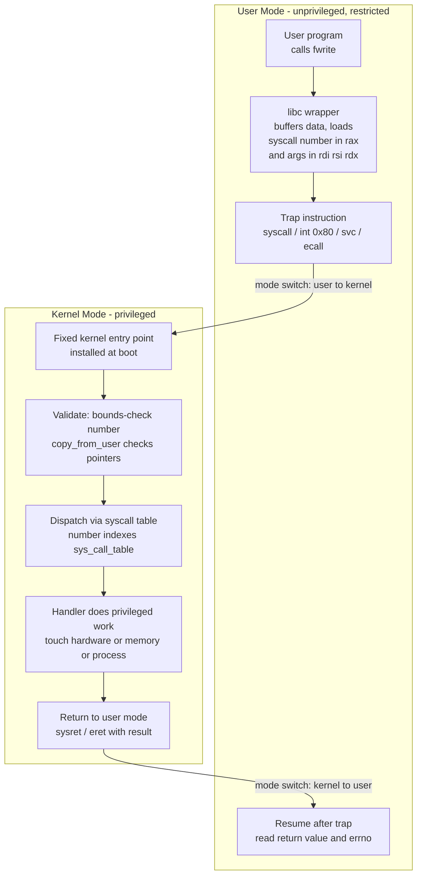

# 🚪 System Calls and the Kernel Interface

> [!abstract] TL;DR
> A **system call** is the single controlled doorway through which an untrusted user program asks the privileged kernel to do something it is not allowed to do itself — touch hardware, read a file, spawn a process, send a packet. The program runs a special trap instruction (`syscall`, `int 0x80`, `svc`, `ecall`) that switches the CPU from restricted **user mode** into **kernel mode**, jumps to a fixed entry point, and the kernel validates the request, dispatches it through the **syscall table**, performs the operation, and returns. Because each crossing forces a mode switch and pollutes caches/TLB, syscalls are far more expensive than function calls — which is why real systems buffer, batch, and bypass them.

---

## Intuition

**Analogy:** A system call is like ordering at a bank teller window. You (the user program) are standing in the public lobby. You *cannot* walk behind the counter and reach into the vault yourself — the door is locked and guarded for a reason. Instead you fill out a request slip ("withdraw $200 from account 12345") and slide it through the narrow window. The teller, who has the special key and the authority, checks that your slip is valid, that the account is yours, that the amount is legal — and only then performs the sensitive vault operation on your behalf. They hand back the cash (or an error: "insufficient funds"). The window is deliberately the *only* way in.

In the technical world, the "public lobby" is **user mode**, the "vault" is hardware and other processes' memory, the "teller with the key" is the **kernel running in kernel mode**, and the "request slip pushed through the window" is the **trap instruction plus arguments in registers**. The narrowness of the window is the whole point: it is the one auditable, guarded boundary between everything untrusted and everything powerful.

---

## How It Works

A user program never executes a privileged instruction directly. It sets up arguments, executes a **software trap**, and control transfers to a hardware-defined kernel entry point. The kernel is the only code that decides what actually happens.

### Core mechanics

1. **Set up the request.** A libc wrapper (e.g. `write`) places the **syscall number** in a designated register (`rax` on x86-64) and the arguments in others (`rdi, rsi, rdx, ...` per the calling convention / ABI).
2. **Trap into the kernel.** The wrapper executes the syscall instruction — `syscall` (modern x86-64), the legacy `int 0x80`, ARM's `svc`, or RISC-V's `ecall`. This is a *synchronous, deliberate* trap (unlike an asynchronous interrupt). The CPU flips the privilege bit to kernel mode and jumps to a fixed handler whose address the kernel installed at boot.
3. **Validate.** The kernel entry code reads the syscall number and arguments from registers. It **must not trust them**: it bounds-checks the number against the table size, and copies/validates every user pointer (a bad or malicious pointer must fault safely, not corrupt the kernel — this is `copy_from_user`).
4. **Dispatch through the syscall table.** The number indexes a jump table (`sys_call_table`) mapping, e.g., `1 → sys_write`. This is why syscalls are identified by *number*, not name — the number is the stable ABI contract.
5. **Perform the privileged work.** The handler does the actual thing: writes to a device, allocates pages, walks the file system. It now legally holds the keys to the vault.
6. **Return to user mode.** The result (or a negative error code / `errno`) goes back in a register, the CPU switches back to user mode via `sysret`/`eret`, and execution resumes right after the trap instruction.

### API vs system call vs ABI

Programmers rarely invoke syscalls directly. They call **library functions** (`printf`, `fopen`, `fwrite`) that belong to the C standard library / POSIX **API**. Underneath, glibc buffers your data and eventually issues the raw `write(2)` syscall. So `printf` → glibc buffer → `write` syscall → `sys_write` in the kernel. The **API** is the source-level contract (function names, semantics you compile against); the **ABI** is the binary-level contract (which register holds the syscall number, how arguments are passed, struct layouts) that the compiled binary and the kernel must agree on. Linux famously keeps a stable *syscall ABI* so a decade-old binary still runs.

### Categories of system calls

- **Process control** — `fork`, `exec`, `exit`, `wait`, `clone`.
- **File management** — `open`, `read`, `write`, `close`, `lseek`, `stat`.
- **Device management** — `ioctl`, `read`/`write` on device files, `mmap`.
- **Information / maintenance** — `getpid`, `gettimeofday`, `uname`, `sysinfo`.
- **Communication** — `pipe`, `socket`, `send`/`recv`, `shmget`, `mmap` (shared).
- **Protection** — `chmod`, `chown`, `umask`, `setuid`.

Every high-level OS abstraction you know — a *file*, a *process*, a *socket* — is nothing more than something you reach for and manipulate *through this syscall boundary*.

### Flow / Architecture



---

## Key Concepts

**Secondary (intuitive foundation)**
- A program cannot do everything itself; some actions are "ask the OS" actions.
- The kernel is a gatekeeper with more power; you request, it decides.
- Reading a file, printing to screen, and starting a program are all requests, not direct actions.

**Undergraduate (mechanism and structure)**
- **Dual-mode operation**: a hardware privilege bit separates user mode from kernel mode; privileged instructions fault if run in user mode. The syscall is the sanctioned way to switch modes (see the OS sibling note *Interrupts, Traps, and Dual-Mode Operation*).
- **Trap vs interrupt**: a syscall is a *synchronous software trap* the program triggers on purpose; a hardware interrupt is asynchronous and external. Both funnel through the mode-switch machinery.
- **Syscall number and table**: numbers are the ABI; the table is a dispatch array. Argument passing follows the calling convention (registers, not the stack, on Linux x86-64).
- **Wrapper layer**: libc / POSIX provide portable wrappers so C code says `open()` instead of embedding a raw trap; POSIX standardizes the *API* across Unix-like systems, while Windows exposes Win32 over the internal NT native API.

**Graduate (cost, security, and modern evolution)**
- **Cost model**: a syscall is hundreds of cycles to low thousands — mode switch, register save/restore, and *indirect* costs from cache and TLB pollution and pipeline flushes. Post-Meltdown **KPTI** (kernel page-table isolation) made the boundary crossing even pricier by requiring page-table switches.
- **Amortization strategies**: userspace **buffering** (stdio), **batching** many operations into one syscall (`writev`/`readv` scatter-gather, `sendmmsg`), and **io_uring**, which submits and completes many I/O ops through shared-memory rings with near-zero syscalls.
- **vDSO**: for cheap, read-mostly calls like `gettimeofday`/`clock_gettime`, the kernel maps a page into every process so the "call" runs *entirely in user space* — no mode switch at all.
- **Security boundary**: the syscall interface is *the* attack surface between a process and the kernel. **seccomp-bpf** filters which syscalls a process may make; sandboxes (containers, gVisor, browsers) tighten this boundary. Every kernel LPE (local privilege escalation) is ultimately a bug reachable through a syscall.

---

## Python Demo

This models the central lesson: **crossing the user/kernel boundary is expensive, so minimizing crossings by batching wins big.** We assign a fixed per-syscall cost (the mode switch + cache/TLB effects) and a per-byte cost for work. The *unbuffered* strategy issues one syscall per item; the *buffered* strategy accumulates items and flushes one syscall per block (the idea behind stdio buffering, `writev`, and io_uring). We plot total time vs number of operations. numpy/matplotlib only; deterministic — no real I/O required.

```python
# Model: cost of crossing the user/kernel boundary, and how batching amortizes it.
# Unbuffered  -> 1 syscall per item              (N boundary crossings)
# Buffered    -> 1 syscall per block of B items  (ceil(N/B) crossings)
import numpy as np
import matplotlib.pyplot as plt

# --- Cost model (nanoseconds), representative orders of magnitude ---
SYSCALL_NS   = 1200.0   # fixed cost of one user<->kernel crossing (mode switch + cache/TLB)
FUNC_CALL_NS = 5.0      # a plain user-space function call for comparison
PER_ITEM_NS  = 8.0      # useful work per item (independent of how we cross)
BLOCK        = 64       # buffered strategy flushes one syscall per 64 items

N = np.arange(1, 5001)  # number of logical write operations

# Unbuffered: pay the full syscall cost for every single item
t_unbuffered = N * (SYSCALL_NS + PER_ITEM_NS)

# Buffered: same per-item work, but only ceil(N / BLOCK) syscalls
n_syscalls_buffered = np.ceil(N / BLOCK)
t_buffered = n_syscalls_buffered * SYSCALL_NS + N * PER_ITEM_NS

# Ideal floor: if crossing were as cheap as a function call (e.g. vDSO)
t_vdso_like = N * (FUNC_CALL_NS + PER_ITEM_NS)

# --- Report the amortized cost at the largest N ---
speedup = t_unbuffered[-1] / t_buffered[-1]
print(f"At N={N[-1]} operations:")
print(f"  unbuffered total : {t_unbuffered[-1]/1e6:8.3f} ms  ({N[-1]} syscalls)")
print(f"  buffered  total  : {t_buffered[-1]/1e6:8.3f} ms  ({int(n_syscalls_buffered[-1])} syscalls)")
print(f"  batching speedup : {speedup:5.1f}x")

# --- Plot ---
fig, ax = plt.subplots(figsize=(8, 5))
ax.plot(N, t_unbuffered / 1e6, label="Unbuffered: 1 syscall / item", lw=2)
ax.plot(N, t_buffered   / 1e6, label=f"Buffered: 1 syscall / {BLOCK} items", lw=2)
ax.plot(N, t_vdso_like  / 1e6, label="vDSO-like floor: no mode switch", lw=1.5, ls="--")
ax.set_xlabel("Number of write operations (N)")
ax.set_ylabel("Total time (ms)")
ax.set_title("Cost of crossing the user/kernel boundary:\nbatching amortizes syscall overhead")
ax.legend()
ax.grid(True, alpha=0.3)
fig.tight_layout()
plt.savefig("syscall_batching_cost.png", dpi=120)
print("Saved syscall_batching_cost.png")
```

The unbuffered line rises steeply — its slope *is* the syscall cost. The buffered line is far flatter because the fixed crossing cost is divided across a whole block, converging toward the pure-work floor. This is exactly why `printf` buffers, why databases group commits, and why `io_uring` exists.

---

## Real-World Applications

- **C standard I/O buffering** — `printf`/`fwrite` accumulate output in a userspace buffer and issue a single `write` syscall on flush, collapsing thousands of tiny writes into a few crossings.
- **`io_uring` (Linux 5.1+)** — submission/completion rings in shared memory let an app queue thousands of reads/writes and reap results with near-zero syscalls, the modern high-IOPS answer to boundary cost (see [[IO_Scheduling_and_io_uring]]).
- **vDSO** — `gettimeofday`/`clock_gettime` execute in userspace via a kernel-mapped page, so time-heavy code (loggers, tracers) avoids the mode switch entirely.
- **`strace` / `ltrace` / `dtrace` / `bpftrace`** — trace the exact syscalls a process makes; the first thing engineers reach for when debugging "why is this program slow / why does it fail to open that file."
- **seccomp sandboxes** — Chrome, Docker/Kubernetes runtimes, and systemd services restrict the allowed syscall set so a compromised process cannot reach dangerous kernel paths (see [[Container_and_Kubernetes_Security]] and [[OS_Hardening]]).
- **Language runtimes** — Go's scheduler treats blocking syscalls as scheduling points, parking the goroutine's OS thread so other work proceeds; Node/async runtimes batch syscalls behind an event loop.

---

## Common Pitfalls

- **Treating a syscall like a function call** — In hot loops, per-item `write`/`read` (or `time()`) calls dominate runtime through mode-switch cost. Fix: buffer/batch (`writev`, stdio, io_uring), or use vDSO calls.
- **Not checking the return value / `errno`** — Syscalls signal failure in-band (a negative return, `errno` set). Ignoring `EINTR` (interrupted by a signal) or a short `write` (fewer bytes than requested) causes silent data loss; robust code loops.
- **Assuming `write` writes everything** — `write` may transfer fewer bytes than asked; you must loop until the buffer is drained.
- **Trusting user pointers in kernel/driver code** — A kernel handler that dereferences a raw user pointer without `copy_from_user` validation is an exploitable vulnerability; the validate step is not optional.
- **Confusing API stability with ABI stability** — Recompiling picks up new API, but a shipped binary depends on the *ABI* (syscall numbers, register convention). Changing syscall numbers breaks old binaries — which is why Linux almost never does.
- **Forgetting the security surface** — Every syscall a sandboxed process can reach is attack surface. Over-broad seccomp allowlists (or none) defeat the isolation; default-deny and allowlist only what's needed.

---

## Related Concepts

- [[C_IPC]] — pipes, sockets, shared memory, and message queues are all built on syscalls (`pipe`, `socket`, `shmget`, `mmap`); the concrete "communication" category of the interface.
- [[POSIX_Threads]] — thread creation (`clone`/`pthread_create`) and blocking primitives ultimately trap into the kernel; the OS scheduler is reached through this boundary.
- [[Virtual_Memory_and_TLB]] — why crossing costs more than cycles: mode switches disturb the TLB/caches, and KPTI (post-Meltdown) adds page-table switches on every syscall.
- [[Interrupts_and_DMA]] — syscalls are *synchronous software traps*; contrast with asynchronous hardware interrupts that share the same mode-switch machinery.
- [[IO_Scheduling_and_io_uring]] — the modern engineering answer to syscall cost: submit and complete I/O through shared-memory rings with almost no crossings.
- [[Assembly_Programming]] — the actual trap instruction (`syscall`, `int 0x80`, `ecall`) and the register-based calling convention live at the assembly/ISA level.
- [[RISCV_ISA_Fundamentals]] — RISC-V's `ecall` is the environment-call trap used to enter more privileged modes; a clean model of the syscall mechanism.
- [[OS_Hardening]] — seccomp filtering, least privilege, and reducing the exposed syscall surface as concrete hardening measures.
- [[Container_and_Kubernetes_Security]] — container runtimes confine workloads largely by restricting the syscall boundary (seccomp/AppArmor profiles).

> The sibling OS notes *Operating Systems Overview*, *Interrupts, Traps, and Dual-Mode Operation*, *Protection and Access Control*, *File Systems and Abstractions*, *Interprocess Communication*, *Kernel Bypass and Modern IO*, and *OS Security and Isolation* extend this topic and will be wikilinked once they exist in the vault.

---

## Review Questions

1. **Conceptual (Secondary/Undergraduate):** Why can't a user program simply execute a privileged instruction to write to disk directly? Walk through what the `syscall` instruction changes about the CPU's state and why a *fixed* kernel entry point (rather than an arbitrary jump target) is essential for security.
2. **Scenario (Undergraduate/Graduate):** A logging library calls `write` once per log line and its throughput collapses under load, yet CPU time is dominated by "system" time in `top`. Using the cost model in the demo, explain what is happening and give two concrete redesigns (one buffering-based, one using a modern batched interface) that reduce total time — and estimate the order-of-magnitude improvement.
3. **Trade-off (Graduate):** Contrast three ways of servicing a "get the current time" request — a full `gettimeofday` syscall, a vDSO call, and reading a cached value in your own process. What does each trade in accuracy, cost, and trust, and why did the kernel designers choose vDSO specifically for time-like calls rather than exposing everything that way? Then explain how seccomp sits on this same boundary as a security control.

---

## Sources

- [Silberschatz, Galvin, Gagne — *Operating System Concepts*, ch. 2 "Operating-System Structures" (system calls, categories, API vs syscall)](https://www.os-book.com/)
- [Kerrisk — *The Linux Programming Interface*, ch. 3 "System Programming Concepts" (syscall mechanism, libc wrappers, errno)](https://man7.org/tlpi/)
- [Linux man page: syscall(2) — invoking system calls directly and the per-architecture calling conventions](https://man7.org/linux/man-pages/man2/syscall.2.html)
- [Linux man page: seccomp(2) — restricting the syscall interface as a sandboxing mechanism](https://man7.org/linux/man-pages/man2/seccomp.2.html)
- [Jens Axboe — *Efficient IO with io_uring* (motivation: amortizing syscall and copy overhead)](https://kernel.dk/io_uring.pdf)

---

#operating-systems #system-calls #kernel-interface #mode-switch #syscall
