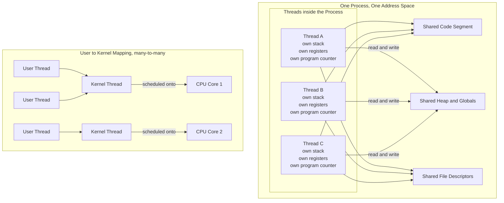

# 🧵 Threads and Concurrency Models

> [!abstract] TL;DR
> A thread is the unit of CPU scheduling *inside* a process: multiple threads share the process's code, heap, and open files, but each keeps its own stack, registers, and program counter. Threads make programs responsive and let one program run in parallel across CPU cores far more cheaply than spawning whole processes — but because they share mutable memory, unsynchronized access produces race conditions, and Amdahl's Law caps how much speedup extra cores can ever buy.

---

## Intuition

**Analogy:** A **process is one kitchen**. A **thread is a cook** working in that kitchen. When you add more cooks, they all share the *same* kitchen — the same pantry, the same counters, the same recipe binder on the wall. Nobody has to build a second kitchen, so adding a cook is cheap, and several dishes get prepared at the same time. That is the whole appeal of threads: shared resources plus simultaneous work.

But sharing is also the danger. Two cooks reach for the **same knife** at the same instant, or both read "we have 3 eggs left," both take 3, and now the pantry count is wrong. Nothing in the kitchen stops them from colliding. Getting the benefit of many cooks *without* the chaos requires rules for who may touch what and when — that is exactly what synchronization primitives provide, and why concurrent programming is hard.

In technical terms: threads are lightweight execution contexts that share one address space. That shared address space is simultaneously the source of their efficiency (no copying, instant communication through memory) and the source of every race condition, deadlock, and memory-ordering bug you will ever debug.

---

## How It Works

A running program is a **process**: an address space (code, heap, globals), a set of open file descriptors, and OS accounting. A single-threaded process has exactly one flow of control. A **multithreaded** process has several flows of control running through that *same* address space.

### What each thread owns vs shares

- **Shared across all threads in the process:** the code (text) segment, the heap and global data, and the table of open files and sockets. A pointer that Thread A writes to the heap is immediately visible to Thread B — they are literally looking at the same memory.
- **Private to each thread:** its own **stack** (so each has independent local variables and call frames), its **registers**, and its **program counter** (so each is at a different point in the code). This per-thread state lives in a small kernel structure — the Thread Control Block — analogous to the Process Control Block described in the sibling note **Processes and the Process Model**.

Because a context switch *between threads of the same process* does not swap the address space (no page-table reload, no TLB flush), it is dramatically cheaper than a full process switch. This economy — plus resource sharing and responsiveness — is *why* threads exist.

### Concurrency vs parallelism

These are not synonyms. **Concurrency** is a structuring property: multiple tasks are *in progress* and the scheduler interleaves them, even on a single core. **Parallelism** is a runtime property: multiple tasks *literally execute at the same instant* on different cores. A single-core machine can be highly concurrent but never parallel. Threads are the OS mechanism that enables *both*.

### User-level vs kernel-level threads

- **User-level (green) threads** are created and scheduled by a runtime library entirely in user space. The kernel sees only one thread. Switching is extremely fast because it never enters the kernel — but the fatal flaw is that if *one* user thread makes a **blocking system call**, the kernel blocks the whole process, freezing every other user thread. They also cannot run in parallel across cores.
- **Kernel-level threads** are known to and scheduled by the OS. A blocking call in one thread lets the OS run another, and threads can run truly in parallel on multiple cores — at the cost of heavier creation and a kernel crossing on every switch.

### Mapping models

The relationship between user threads and kernel threads defines the model:

| Model | Mapping | Property |
|-------|---------|----------|
| Many-to-one | Many user threads → 1 kernel thread | Fast switches, but no parallelism and one blocking call stalls all |
| One-to-one | Each user thread → its own kernel thread | True parallelism, blocking is isolated; heavier, limits thread count. Linux/Windows use this |
| Many-to-many | M user threads ↔ N kernel threads | Best of both; complex runtime scheduler |
| Two-level | Many-to-many plus the option to bind a critical user thread to a dedicated kernel thread | Flexibility for latency-sensitive threads |



Once threads reach kernel threads, the OS decides which one runs where using the same policies covered in the sibling note **CPU Scheduling Algorithms** — threads, not processes, are the true schedulable entities on modern systems.

---

## Key Concepts

### Secondary (explain to a curious beginner)
- A thread is a worker inside a program; adding threads lets the program do several things at once.
- Threads share the program's memory and files but each keeps its own place-in-the-code.
- Making a thread is cheap; making a whole new process is expensive.
- Concurrency means "juggling many tasks"; parallelism means "actually doing them at the same time on different cores."
- Because threads share memory, two of them can collide and corrupt data unless you coordinate them.

### Undergraduate (needs CS background)
- **Thread Control Block** stores per-thread stack pointer, register snapshot, program counter, and state; switching threads restores this without touching the page table.
- **Why threads:** responsiveness (a UI thread stays alive while a worker thread computes), parallelism on multicore, resource sharing through common memory, and economy versus process creation.
- **User vs kernel threads** and the **many-to-one / one-to-one / many-to-many / two-level** mapping models, including why a blocking syscall behaves differently in each.
- **Thread libraries:** POSIX pthreads on Unix-like systems (see **Processes and the Process Model** and the C note), and the Win32 thread API on Windows; higher-level wrappers like C++ `std::thread` compile down to these.
- **Race conditions:** when two threads perform an unsynchronized read-modify-write on shared data, updates are lost. Covered in depth by the sibling note **Process Synchronization and Race Conditions**; the fixes live in **Locks, Semaphores, and Monitors**.
- **Amdahl's Law:** speedup `S(N) = 1 / ((1 - p) + p / N)`, where `p` is the parallelizable fraction. Even with infinite cores the ceiling is `1 / (1 - p)` — the serial part dominates.

### Graduate (system-level thinking)
- **Memory consistency:** without synchronization, threads may observe reads and writes in an order different from program order because the compiler and CPU reorder for performance. This is previewed here and detailed in the sibling note **Memory Consistency and Concurrent Data Structures**; the hardware side is [[Memory_Consistency_Models]] and [[Memory_Barriers_and_Ordering]].
- **M:N schedulers and work-stealing:** language runtimes multiplex many lightweight tasks onto a small pool of kernel threads. Go's goroutines ride an M:N scheduler with per-core run queues and work-stealing ([[Goroutines_and_Scheduler]]); Java's virtual threads ([[Virtual_Threads_Java21]]) do the same on the JVM.
- **Concurrency models beyond raw threads:** thread pools (bounded reuse of kernel threads), the **actor model** (isolated actors communicating by messages, no shared state), **CSP** (communicating sequential processes exchanging over channels — Go's design lineage), and **coroutines / async-await** (cooperative suspension without a kernel thread per task).
- **False sharing and cache coherence:** two threads writing distinct variables on the same cache line trigger coherence traffic; see [[Cache_Coherence_MESI]] and [[Multi_Core_Programming]].
- **The GIL caveat:** CPython's Global Interpreter Lock serializes bytecode execution, so CPU-bound Python threads do not run in parallel — a concrete, production-relevant demonstration that "has threads" does not imply "achieves parallelism."
- **Scheduler activations and two-level models:** kernel up-calls that notify a user-level scheduler when a thread blocks, recovering many-to-many efficiency without losing parallelism on blocking calls.

---

## Python Demo

Two independent illustrations, using only `numpy` and `matplotlib`. The **left** panel models the *promise* of threads — speedup versus thread count under Amdahl's Law against the ideal linear line. The **right** panel models the *peril* — an unsynchronized shared-counter race, simulated as randomly interleaved read-modify-write events, whose final totals fall short of the correct value because of lost updates.

```python
# Threads: the promise (Amdahl speedup) and the peril (a lost-update race).
# Standard library threads are intentionally NOT used; the race is modeled
# directly as random interleavings of read/write events with numpy.
import numpy as np
import matplotlib.pyplot as plt

rng = np.random.default_rng(42)

# ---------- Part 1: Amdahl's Law vs ideal linear speedup ----------
def amdahl_speedup(p, n):
    # p = parallelizable fraction, n = number of threads/cores
    return 1.0 / ((1.0 - p) + p / n)

cores = np.arange(1, 65)
serial_fractions = {0.50: "p=0.50", 0.75: "p=0.75", 0.90: "p=0.90", 0.95: "p=0.95"}

# ---------- Part 2: unsynchronized shared-counter race ----------
def simulate_race(n_threads, ops_per_thread, rng):
    # Each increment is a READ then a WRITE. We build one interleaved
    # schedule: each thread appears 2*ops times; shuffling preserves the
    # per-thread order, so the k-th appearance of a thread is its k-th event.
    schedule = np.repeat(np.arange(n_threads), 2 * ops_per_thread)
    rng.shuffle(schedule)

    counter = 0                                   # the shared variable
    local = np.zeros(n_threads, dtype=np.int64)   # each thread's register
    events_done = np.zeros(n_threads, dtype=np.int64)

    for t in schedule:
        if events_done[t] % 2 == 0:               # even event -> READ
            local[t] = counter
        else:                                     # odd event  -> WRITE
            counter = local[t] + 1                # lost update if it stalled
        events_done[t] += 1
    return counter

n_threads, ops_per_thread, trials = 8, 25, 3000
correct_total = n_threads * ops_per_thread
final_values = np.array(
    [simulate_race(n_threads, ops_per_thread, rng) for _ in range(trials)]
)

print(f"Correct total should be {correct_total}")
print(f"Race result: min={final_values.min()}, "
      f"mean={final_values.mean():.1f}, max={final_values.max()}")
print(f"Fraction of runs that hit the correct total: "
      f"{np.mean(final_values == correct_total):.4f}")

# ---------- Plot ----------
fig, (ax1, ax2) = plt.subplots(1, 2, figsize=(13, 5))

for p, label in serial_fractions.items():
    ax1.plot(cores, amdahl_speedup(p, cores), label=label)
ax1.plot(cores, cores, "k--", label="ideal linear")
ax1.set_title("The promise: Amdahl speedup vs threads")
ax1.set_xlabel("threads / cores (N)")
ax1.set_ylabel("speedup S(N)")
ax1.legend()
ax1.grid(alpha=0.3)

ax2.hist(final_values, bins=np.arange(final_values.min(), correct_total + 2),
         color="#DC2626", alpha=0.8)
ax2.axvline(correct_total, color="black", linestyle="--",
            label=f"correct = {correct_total}")
ax2.set_title("The peril: unsynchronized counter falls short")
ax2.set_xlabel("final counter value")
ax2.set_ylabel("number of runs")
ax2.legend()
ax2.grid(alpha=0.3)

plt.tight_layout()
plt.savefig("threads_concurrency_demo.png", dpi=110)
print("Saved threads_concurrency_demo.png")
```

**What to notice.** The Amdahl curves flatten hard: with `p = 0.90`, going from 8 to 64 threads barely moves the needle because the serial 10% dominates — this is why "just add cores" stops helping. The histogram sits almost entirely *below* the correct total, and the correct value is hit essentially never: every run loses updates because a thread's WRITE overwrites work another thread did between its own READ and WRITE. That gap is the concrete cost of skipping synchronization.

---

## Real-World Applications

- **Web and application servers** (Nginx worker threads, Apache, Tomcat thread pools): a pool of kernel threads handles many client connections concurrently, keeping the server responsive while individual requests block on I/O.
- **Go services** rely on goroutines multiplexed by an M:N scheduler ([[Goroutines_and_Scheduler]], [[Sync_Primitives]]); hundreds of thousands of concurrent goroutines map onto a handful of OS threads.
- **JVM applications** use kernel threads via `java.lang.Thread` ([[Threads_and_Runnable]]) and, since Java 21, lightweight virtual threads ([[Virtual_Threads_Java21]]) for massive I/O concurrency without a kernel thread per task.
- **Native systems code** uses POSIX pthreads ([[POSIX_Threads]]) and C++ concurrency ([[Cpp_Concurrency]]) for databases, game engines, and media pipelines that pin worker threads to cores ([[Multi_Core_Programming]]).
- **Desktop and mobile UIs** run a dedicated UI thread plus background worker threads so the interface never freezes during long computations or network calls.
- **Scientific and ML workloads** parallelize data-parallel loops across cores, where Amdahl's Law directly predicts the achievable speedup and where NUMA and false sharing decide real efficiency.

---

## Common Pitfalls

- **Race conditions from shared mutable state** — the demo's exact failure: unsynchronized read-modify-write loses updates. Guard shared data with the primitives in the sibling notes **Process Synchronization and Race Conditions** and **Locks, Semaphores, and Monitors**.
- **Assuming threads equal parallelism** — many-to-one models and CPython's GIL run threads concurrently but not in parallel for CPU-bound work. For CPU-bound Python, use multiple *processes* or native extensions, not threads.
- **Ignoring Amdahl's Law** — throwing cores at a workload with a large serial fraction yields diminishing returns; profile the serial portion before scaling out.
- **Memory reordering surprises** — without barriers or proper synchronization, one thread may never observe another's write, or observe writes out of order; a plain shared flag is not a safe signal. See [[Memory_Barriers_and_Ordering]] and **Memory Consistency and Concurrent Data Structures**.
- **Deadlock and priority inversion** — acquiring multiple locks in inconsistent orders can freeze threads permanently; always lock in a fixed global order.
- **Blocking a user-level thread on a syscall** — in a many-to-one runtime, one blocking call stalls every sibling thread; know your library's mapping model.
- **False sharing** — two threads updating adjacent fields on one cache line silently serialize via coherence traffic ([[Cache_Coherence_MESI]]); pad hot per-thread data to separate cache lines.
- **Unbounded thread creation** — spawning a thread per request exhausts memory and thrashes the scheduler; use a bounded thread pool.

---

## Related Concepts

Verified vault links:

- [[POSIX_Threads]] — the C-level `pthread_create` / mutex / condition-variable API that most Unix thread libraries are built on.
- [[Cpp_Concurrency]] — `std::thread`, `std::mutex`, and atomics as higher-level wrappers over kernel threads.
- [[Goroutines_and_Scheduler]] — a production M:N user-thread scheduler with work-stealing; the many-to-many model in practice.
- [[Sync_Primitives]] — channels, mutexes, and wait groups that make goroutine sharing safe.
- [[Threads_and_Runnable]] — the JVM's one-to-one kernel-thread model.
- [[Virtual_Threads_Java21]] — lightweight user-mode threads on the JVM, the two-level idea revived for I/O concurrency.
- [[Multi_Core_Programming]] — Amdahl's Law, pthreads/OpenMP, false sharing, and lock-free structures on real multicore hardware.
- [[Memory_Consistency_Models]] — the hardware rules for how threads observe each other's memory operations.
- [[Memory_Barriers_and_Ordering]] — fences that restore ordering guarantees synchronization depends on.
- [[Cache_Coherence_MESI]] — the coherence protocol underlying false sharing and inter-thread communication cost.

Planned Operating Systems siblings (not yet written — referenced in prose above): *Processes and the Process Model*, *Process Synchronization and Race Conditions*, *Locks, Semaphores, and Monitors*, *CPU Scheduling Algorithms*, *Interprocess Communication*, and *Memory Consistency and Concurrent Data Structures*.

---

## Review Questions

**Tier 1 — Conceptual (junior level).**
State exactly which resources threads in the same process share and which each thread owns privately, and use that split to explain why creating a thread is cheaper than creating a process.

**Tier 2 — Applied (needs CS background).**
A many-to-one user-thread library backs a program that makes a blocking `read()` syscall in one thread. Explain what happens to the *other* threads and why, then describe how a one-to-one or many-to-many model changes the outcome.

**Tier 3 — System design / trade-off (system-level).**
You have a workload that is 85% parallelizable. (a) Using Amdahl's Law, roughly what is the maximum speedup with infinite cores, and how much of that do you already capture at 8 cores? (b) Your teammate proposes eliminating a mutex to "make it faster" and points out that unsynchronized runs usually still produce almost-correct totals. Using the lost-update race from the demo, argue why "usually almost correct" is unacceptable and what you would do instead.

---

## Sources

- Silberschatz, Galvin, Gagne. *Operating System Concepts*, 10th ed. — Chapter 4, "Threads & Concurrency" (thread models, user vs kernel threads, thread libraries). https://www.os-book.com/
- Amdahl, G. M. "Validity of the single processor approach to achieving large scale computing capabilities." *AFIPS Conference Proceedings*, 1967. https://dl.acm.org/doi/10.1145/1465482.1465560
- The Open Group. *POSIX Threads (pthreads) specification*, IEEE Std 1003.1. https://pubs.opengroup.org/onlinepubs/9699919799/basedefs/pthread.h.html
- Python Software Foundation. "What is the global interpreter lock (GIL)?" *Python Language Reference / FAQ*. https://docs.python.org/3/glossary.html#term-global-interpreter-lock
- The Go Authors. "The Go scheduler" and "Effective Go: Concurrency." https://go.dev/doc/effective_go#concurrency

---

#operating-systems #threads #concurrency #multithreading #amdahls-law
