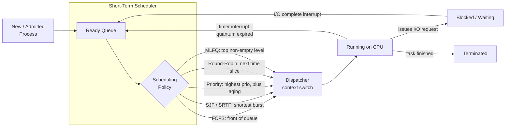

# 🎛️ CPU Scheduling Algorithms

> [!abstract] TL;DR
> The **CPU scheduler** decides which Ready process runs next on a core. There is no free lunch: **FCFS** is simple but suffers the convoy effect, **SJF/SRTF** give provably optimal average waiting time but require knowing burst lengths and can **starve** long jobs, **Round-Robin** trades turnaround for responsiveness via a time quantum, and **MLFQ** — the workhorse of real systems — approximates SJF *without* knowing burst times by demoting CPU-bound jobs and favoring interactive I/O-bound ones. Production kernels (Linux **CFS**, now **EEVDF**) generalize this with a fair virtual-runtime ordering kept in a balanced tree.

---

## Intuition

**Analogy:** The scheduler is the **maître d' of a busy restaurant with one table**. Everyone who walks in joins the waiting list (the Ready queue), and only one party can be seated at a time (one CPU core). *How* the maître d' picks the next party is the whole game:

- **First-come-first-served** is fair and obvious — but if a huge party of 30 sits down first, everyone behind them waits through the entire multi-hour dinner (the **convoy effect**).
- **Serve the quickest orders first** clears the dining room fastest and keeps the average wait tiny — but a party that wants a long tasting menu might *never* get seated while quick eaters keep jumping the line (**starvation**).
- **Round-robin** gives every party a fixed 15-minute turn at the table, then rotates them out even mid-meal. Nobody waits forever and everyone feels attended-to quickly (**good response time**), but half-eaten meals mean more total time before anyone actually finishes (**worse turnaround**).

A real kitchen does something smarter: it watches behavior. Parties that keep ordering tiny things and leaving quickly (interactive, I/O-bound jobs) get bumped up; parties that camp for hours (CPU-bound jobs) drift to the back. That adaptive heuristic is exactly the **Multilevel Feedback Queue**.

---

## How It Works

A running program is not continuously on the CPU. It cycles between **CPU bursts** (computing) and **I/O bursts** (waiting for disk, network, keyboard). The scheduler only cares about the CPU bursts, and its job is to keep the expensive CPU busy while meeting user-facing goals.

### The Scheduler and the Dispatcher

Two distinct components do the work:

1. **Short-term scheduler (the policy):** picks *which* Ready process runs next. This is where FCFS / SJF / RR / MLFQ logic lives. It runs extremely often (millisecond scale), so it must be cheap — ideally O(1) or O(log n).
2. **Dispatcher (the mechanism):** actually hands the CPU to the chosen process — saves the old process's registers, loads the new context, switches to user mode, and jumps to the resume point. The wasted time doing this is **dispatch latency**, and every context switch also cold-caches the TLB and CPU caches. (Mode switching, saving/restoring state, and the timer/IO interrupts that trigger it all belong to the dual-mode-operation and trap machinery — see the sibling note *Interrupts, Traps, and Dual-Mode Operation* and the hardware view in [[Interrupts_and_DMA]].)

### Preemptive vs Non-Preemptive

- **Non-preemptive (cooperative):** once a process gets the CPU it keeps it until it *voluntarily* blocks on I/O or exits. Simple, but one runaway loop hangs the machine. Old Windows 3.x and classic Mac OS worked this way.
- **Preemptive:** a periodic **timer interrupt** lets the kernel forcibly yank the CPU back and re-run the scheduler. This is what makes true multitasking, fairness, and responsiveness possible — and it is why SRTF, Round-Robin, and modern kernels are all preemptive.

### The Metrics (and Why You Can't Win Them All)

| Metric | Definition | Who cares |
|--------|-----------|-----------|
| CPU utilization | fraction of time the CPU is doing useful work | data centers |
| Throughput | processes completed per unit time | batch systems |
| Turnaround time | completion time minus arrival time | everyone |
| Waiting time | time spent sitting in the Ready queue | fairness |
| Response time | first dispatch minus arrival | interactive users |

The tension is fundamental: **minimizing average waiting time (SJF) directly fights fairness (starvation); minimizing response time (small RR quantum) directly worsens turnaround (context-switch overhead + unfinished work).** Every real scheduler is a chosen point in this trade space.

### The Classic Algorithms

- **FCFS (First-Come, First-Served):** a plain FIFO Ready queue. Simple and starvation-free, but a long job at the front stalls everything behind it — the **convoy effect**.
- **SJF (Shortest Job First, non-preemptive) / SRTF (Shortest Remaining Time First, preemptive):** always run the job with the smallest (remaining) burst. **Provably optimal average waiting time.** The catch: you must *know* burst lengths (in practice they are *predicted* with an exponential moving average of past bursts), and a stream of short jobs can starve a long one forever.
- **Priority Scheduling:** run the highest-priority Ready job. Low-priority jobs can **starve**; the fix is **aging** — slowly boosting the priority of jobs that have waited too long.
- **Round-Robin:** FCFS plus a **time quantum**. Each job runs at most one quantum, then goes to the back of the queue. Quantum too large → degrades into FCFS; too small → the CPU spends all its time context-switching. A common rule of thumb keeps ~80% of bursts shorter than the quantum.
- **Multilevel Queue (MLQ):** several separate queues (e.g., system > interactive > batch), each with its own policy, permanently partitioning processes.
- **Multilevel Feedback Queue (MLFQ):** the practical winner. Jobs *move between* levels based on observed behavior — a job that uses its whole quantum is CPU-bound and gets **demoted**; a job that yields early for I/O is interactive and stays high. Periodic **priority boosting** prevents starvation. MLFQ approximates SJF *without ever knowing burst lengths* — it learns them.

### Flow / Architecture



---

## Key Concepts

### Secondary (plain-language)
- A computer looks like it runs many programs at once, but each core really runs **one thing at a time** and switches so fast it feels simultaneous.
- The **scheduler** is the referee deciding whose turn it is next.
- There is a genuine tension: you can be **fair** (everyone gets a turn) or **fast on average** (do the quickest tasks first), but not perfectly both.

### Undergraduate (systems course)
- **Preemptive vs non-preemptive**, and how the **timer interrupt** makes preemption possible.
- The five **metrics** and their definitions; **turnaround = waiting + burst**, **response = first-dispatch − arrival**.
- **FCFS + convoy effect**, **SJF/SRTF** optimality and its burst-prediction requirement, **Priority + aging**, **Round-Robin quantum trade-off**.
- **MLQ vs MLFQ**, and *why* MLFQ approximates SJF by inferring interactivity from behavior.
- **Ready queue data structures:** a FIFO for FCFS/RR; a **min-heap / [[Priority_Queue]]** (backed by a [[Binary_Heap]]) for priority and SJF so the next job is O(log n).

### Graduate (kernel-level)
- **Linux CFS (Completely Fair Scheduler):** abandons discrete queues for a notion of **virtual runtime (vruntime)** — the task with the smallest vruntime runs next, so all tasks converge toward equal weighted CPU share. CFS stores runnable tasks in a **red-black tree** keyed by vruntime, giving O(log n) pick-next and insertion (see [[Red_Black_Tree]] and the balancing intuition behind [[AVL_Tree]]). **Nice values** scale each task's vruntime accumulation rate.
- **EEVDF (Earliest Eligible Virtual Deadline First):** the successor that replaced CFS's core logic (mainlined ~Linux 6.6), adding an explicit **latency/deadline** dimension so latency-sensitive tasks are served promptly while long-run fairness is preserved.
- **Linux O(1) scheduler (historical):** used 140 priority levels with per-priority bitmap-indexed run queues for constant-time selection, before CFS replaced it in 2.6.23.
- **Real-time classes:** `SCHED_FIFO` and `SCHED_RR` sit above the normal class; classic RT theory adds **Rate-Monotonic** and **Earliest-Deadline-First (EDF)** scheduling with formal admission tests (see the sibling note *Real-Time and Embedded Operating Systems*).
- **Multiprocessor scheduling:** **per-CPU run queues** avoid a global lock, **processor affinity** keeps a task on the core whose cache is warm, **load balancing** migrates tasks to even out queues, and runtimes like Go and Java ForkJoin use **work stealing** — an idle core pulls work from a busy core's deque (see the sibling note *Threads and Concurrency Models*).

---

## Python Demo

```python
# Compare the classic CPU scheduling policies on one identical workload.
# For each policy we build a Gantt chart, then compute average waiting,
# turnaround, and response times to expose the trade-offs:
#   - SJF/SRTF minimize average waiting time (but can starve long jobs)
#   - Round-Robin improves response time (but worsens turnaround)
# numpy + matplotlib only.
import numpy as np
import matplotlib.pyplot as plt
from collections import deque

# ---- Workload: (pid, arrival, burst, priority)  lower priority number = more urgent
PROCS = [
    ("P1", 0, 7, 3),
    ("P2", 2, 4, 1),
    ("P3", 4, 1, 4),
    ("P4", 5, 4, 2),
    ("P5", 6, 3, 2),
]
ST = {p[0]: {"arrival": p[1], "burst": p[2], "prio": p[3]} for p in PROCS}
PIDS = [p[0] for p in PROCS]


def merge(g):
    """Coalesce adjacent same-pid unit slices into solid Gantt blocks."""
    out = []
    for pid, s, e in g:
        if out and out[-1][0] == pid and out[-1][2] == s:
            out[-1] = (pid, out[-1][1], e)
        else:
            out.append((pid, s, e))
    return out


def metrics(gantt):
    """From a merged Gantt chart derive per-process and average metrics."""
    first, comp = {}, {}
    for pid, s, e in gantt:
        if pid == "IDLE":
            continue
        first.setdefault(pid, s)      # first dispatch
        comp[pid] = e                 # last completion
    rows = {}
    for pid, info in ST.items():
        ct = comp[pid]
        tat = ct - info["arrival"]        # turnaround
        wt = tat - info["burst"]          # waiting
        rt = first[pid] - info["arrival"] # response
        rows[pid] = dict(CT=ct, TAT=tat, WT=wt, RT=rt)
    n = len(rows)
    avg = {m: sum(r[m] for r in rows.values()) / n for m in ("TAT", "WT", "RT")}
    return rows, avg


# ---------------- Non-preemptive: pick by a key at each decision point ----------
def _nonpreemptive(key):
    remaining, t, g = set(ST), 0, []
    while remaining:
        ready = [p for p in remaining if ST[p]["arrival"] <= t]
        if not ready:                     # CPU idle until next arrival
            nxt = min(ST[p]["arrival"] for p in remaining)
            g.append(("IDLE", t, nxt)); t = nxt; continue
        pid = min(ready, key=key)
        g.append((pid, t, t + ST[pid]["burst"]))
        t += ST[pid]["burst"]; remaining.remove(pid)
    return merge(g)


def fcfs():
    return _nonpreemptive(key=lambda p: (ST[p]["arrival"], p))


def sjf():
    return _nonpreemptive(key=lambda p: (ST[p]["burst"], ST[p]["arrival"], p))


def priority_np():
    return _nonpreemptive(key=lambda p: (ST[p]["prio"], ST[p]["arrival"], p))


# ---------------- Preemptive Shortest-Remaining-Time-First (unit simulation) ----
def srtf():
    rem = {p: ST[p]["burst"] for p in ST}
    t, done, g, n = 0, 0, [], len(ST)
    while done < n:
        ready = [p for p in rem if ST[p]["arrival"] <= t and rem[p] > 0]
        if not ready:
            g.append(("IDLE", t, t + 1)); t += 1; continue
        pid = min(ready, key=lambda p: (rem[p], ST[p]["arrival"], p))
        g.append((pid, t, t + 1)); rem[pid] -= 1; t += 1
        if rem[pid] == 0:
            done += 1
    return merge(g)


# ---------------- Round-Robin with a fixed time quantum -------------------------
def rr(q=3):
    rem = {p: ST[p]["burst"] for p in ST}
    order = sorted(ST, key=lambda p: (ST[p]["arrival"], p))
    ready, idx, t, g = deque(), 0, 0, []

    def enqueue_arrivals(upto):
        nonlocal idx
        while idx < len(order) and ST[order[idx]]["arrival"] <= upto:
            ready.append(order[idx]); idx += 1

    enqueue_arrivals(0)
    while ready or idx < len(order):
        if not ready:                      # jump idle gap to next arrival
            nxt = ST[order[idx]]["arrival"]
            g.append(("IDLE", t, nxt)); t = nxt; enqueue_arrivals(t); continue
        pid = ready.popleft()
        run = min(q, rem[pid])
        g.append((pid, t, t + run)); t += run; rem[pid] -= run
        enqueue_arrivals(t)                # arrivals during the slice go in first
        if rem[pid] > 0:
            ready.append(pid)              # ...then the preempted job re-queues
    return merge(g)


RESULTS = {
    "FCFS": fcfs(),
    "SJF (non-preemptive)": sjf(),
    "SRTF (preemptive)": srtf(),
    "Round-Robin q=3": rr(3),
    "Priority (non-preemptive)": priority_np(),
}
AVG = {name: metrics(g)[1] for name, g in RESULTS.items()}

# ---- Print a summary table ----
print(f"{'Policy':28} {'AvgWait':>8} {'AvgTAT':>8} {'AvgResp':>8}")
for name, a in AVG.items():
    print(f"{name:28} {a['WT']:8.2f} {a['TAT']:8.2f} {a['RT']:8.2f}")

# ---- Gantt charts, one row per policy ----
cmap = plt.get_cmap("tab10")
color = {pid: cmap(i) for i, pid in enumerate(PIDS)}
color["IDLE"] = (0.88, 0.88, 0.88, 1.0)

fig, axes = plt.subplots(len(RESULTS), 1, figsize=(11, 1.5 * len(RESULTS)),
                         constrained_layout=True)
for ax, (name, g) in zip(axes, RESULTS.items()):
    end = max(e for _, _, e in g)
    for pid, s, e in g:
        ax.barh(0, e - s, left=s, height=0.6,
                color=color[pid], edgecolor="black")
        if pid != "IDLE":
            ax.text((s + e) / 2, 0, pid, ha="center", va="center", fontsize=8)
    ax.set_xlim(0, end); ax.set_ylim(-0.5, 0.5)
    ax.set_yticks([]); ax.set_xticks(range(0, end + 1))
    ax.set_title(name, loc="left", fontsize=9)
fig.suptitle("Gantt charts: same workload, five policies")

# ---- Bar chart comparing the three latency metrics across policies ----
names = list(AVG.keys())
x = np.arange(len(names)); w = 0.26
wt = [AVG[n]["WT"] for n in names]
tat = [AVG[n]["TAT"] for n in names]
rt = [AVG[n]["RT"] for n in names]

fig2, ax2 = plt.subplots(figsize=(11, 5), constrained_layout=True)
ax2.bar(x - w, wt, w, label="Avg Waiting")
ax2.bar(x,     tat, w, label="Avg Turnaround")
ax2.bar(x + w, rt, w, label="Avg Response")
ax2.set_xticks(x); ax2.set_xticklabels(names, rotation=20, ha="right")
ax2.set_ylabel("time units"); ax2.legend()
ax2.set_title("SJF wins average waiting; Round-Robin wins response")
plt.show()

# Expected takeaways when you run this:
#   * SJF/SRTF give the smallest Avg Waiting (optimality) ...
#   * ... but Round-Robin gives the smallest / most uniform Avg Response
#   * FCFS shows the convoy effect: the long P1 inflates everyone behind it
```

---

## Real-World Applications

> **Linux — CFS then EEVDF:** For over a decade the default desktop/server scheduler was **CFS**, which orders runnable tasks by **virtual runtime** in a **red-black tree** so the least-served task runs next, achieving weighted fairness in O(log n) — a direct application of the balanced-tree structures in [[Red_Black_Tree]]. Since kernel 6.6 the core was replaced by **EEVDF**, which adds a virtual-deadline notion so latency-sensitive tasks (audio, UI) are served promptly without breaking long-run fairness.

- **Windows** uses a **32-level priority, preemptive, round-robin-within-level** scheduler with priority boosts for foreground/GUI threads — exactly the "favor interactive jobs" heuristic of MLFQ.
- **Real-time and embedded** systems (avionics, motor control) use **fixed-priority preemptive** or **EDF** scheduling with formal schedulability proofs — deadlines, not averages, are the goal.
- **Language runtimes** schedule *user-space* tasks the same way: Go's runtime multiplexes goroutines onto OS threads with per-P run queues and **work stealing**; Java's ForkJoinPool does likewise.
- **Data structures under the hood:** priority-based schedulers lean on heaps / [[Priority_Queue]] ([[Binary_Heap]]); the same "which item next?" question drives I/O request ordering in the kernel block layer (see [[IO_Scheduling_and_io_uring]]).

---

## Common Pitfalls

- **Convoy effect (FCFS):** one long CPU-bound job at the head of a FIFO queue stalls many short jobs behind it, tanking average waiting time. Preemption or shortest-job ordering breaks it.
- **Starvation (SJF, strict priority):** a steady supply of short or high-priority jobs can keep a long/low-priority job from ever running. Fix with **aging** — raise a waiting job's effective priority over time.
- **Priority inversion:** a high-priority task blocks on a lock held by a low-priority task that itself never gets scheduled. This famously nearly killed the **Mars Pathfinder** mission; the fix is **priority inheritance** (temporarily lend the blocker the waiter's priority).
- **Wrong Round-Robin quantum:** too small → context-switch overhead dominates and throughput collapses; too large → RR silently degrades into FCFS and response time suffers. Size it so most CPU bursts finish within a quantum.
- **Assuming burst length is known:** SJF/SRTF are optimal *only* with perfect future knowledge. Real kernels can't peek into the future, which is *the* reason MLFQ (learn-from-behavior) beats SJF (assume-you-know) in practice.
- **Confusing response and turnaround:** minimizing one does not minimize the other. A snappy UI (low response) can still take long to *finish* a batch job (high turnaround). Know which one your workload actually cares about.
- **Ignoring multiprocessor cache effects:** naively load-balancing tasks across cores destroys **cache/TLB affinity**; the migration can cost more than the imbalance it fixes.

---

## Related Concepts

- [[Priority_Queue]] — the abstract "serve most-urgent first" structure that priority and SJF schedulers implement to get O(log n) next-job selection.
- [[Binary_Heap]] — the concrete array-based heap backing a priority-queue Ready structure.
- [[Red_Black_Tree]] — the balanced BST Linux CFS/EEVDF uses to order runnable tasks by virtual runtime.
- [[AVL_Tree]] — sibling self-balancing tree; same O(log n) ordered-set guarantees that make runqueue selection cheap.
- [[Interrupts_and_DMA]] — the timer and I/O interrupts that trigger preemption and move blocked jobs back to Ready.
- [[IO_Scheduling_and_io_uring]] — the same "which pending request next?" decision applied to disk I/O rather than the CPU.

*Not-yet-created OS siblings referenced above (link once written):* Processes and the Process Model, Threads and Concurrency Models, Interrupts/Traps and Dual-Mode Operation, Deadlocks — Detection and Avoidance, and Real-Time and Embedded Operating Systems.

---

## Review Questions

**Beginner**
1. In one sentence each, define turnaround time, waiting time, and response time, and give the relationship between the first two.
2. Why does preemptive scheduling require a hardware timer interrupt, while non-preemptive scheduling does not?

**Intermediate**
3. SJF is provably optimal for average waiting time, yet no production OS uses pure SJF. Give the two independent reasons, and explain how MLFQ sidesteps both.
4. You set a Round-Robin quantum to 500 ms on an interactive desktop and users complain the UI feels sluggish; you then set it to 1 ms and throughput collapses. Explain both symptoms in terms of the quantum trade-off, and describe how you'd choose a good value.

**Advanced**
5. Linux CFS keeps runnable tasks in a red-black tree keyed by virtual runtime. Explain what invariant "always run the smallest vruntime" enforces, why a balanced tree (not a plain sorted array or FIFO) is the right structure, and what problem EEVDF adds to CFS to address latency-sensitive tasks.
6. Given a heterogeneous multiprocessor with per-CPU run queues, argue when aggressive load balancing *hurts* overall performance, and describe how processor affinity and work stealing each address a different failure mode.

---

## Sources

- Remzi & Andrea Arpaci-Dusseau, *Operating Systems: Three Easy Pieces* — Scheduling & MLFQ chapters — [https://pages.cs.wisc.edu/~remzi/OSTEP/](https://pages.cs.wisc.edu/~remzi/OSTEP/)
- Silberschatz, Galvin & Gagne, *Operating System Concepts* (10th ed.), Ch. 5 "CPU Scheduling".
- Tanenbaum & Bos, *Modern Operating Systems* (4th ed.), Ch. 2 "Processes and Threads".
- Linux kernel documentation, *CFS Scheduler Design* — [https://docs.kernel.org/scheduler/sched-design-CFS.html](https://docs.kernel.org/scheduler/sched-design-CFS.html)
- J. Corbet, "An EEVDF CPU scheduler for Linux", LWN.net — [https://lwn.net/Articles/925371/](https://lwn.net/Articles/925371/)

---

#operating-systems #cpu-scheduling #round-robin #mlfq #scheduling-algorithms
