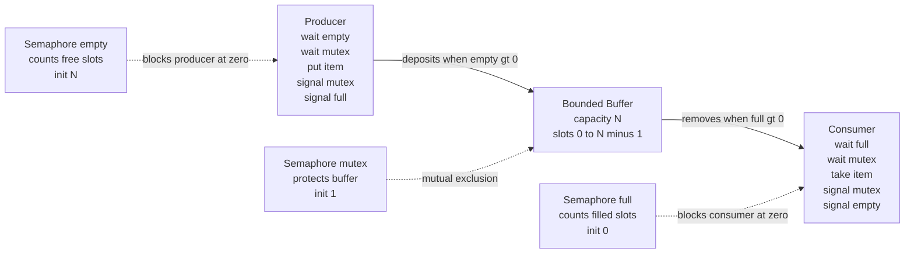

# 🍝 Classic Synchronization Problems

> [!abstract] TL;DR
> A small canon of textbook problems — **producer-consumer / bounded buffer**, **readers-writers**, **dining philosophers**, and the **sleeping barber** — each isolates one hard truth about concurrency: how to enforce mutual exclusion, how to *signal* between threads without busy-waiting, how to avoid deadlock, and how to avoid starvation. They are not toys. The exact same templates reappear as thread-pool work queues, database reader-writer locks, Go bounded channels, and Java `BlockingQueue`. Learn the four, and you own the reusable building blocks of correct concurrent code.

---

## Intuition

**Analogy — the dinner that never happens.** Five philosophers sit around a circular table. Between each pair sits a single fork, so there are five forks for five people. To eat spaghetti a philosopher needs **both** the fork on their left and the fork on their right. They think, get hungry, pick up their left fork, then reach for their right fork, eat, and put both down.

Now imagine every philosopher gets hungry at the same instant and each grabs the fork on their **left**. Every fork is now held. Every philosopher is waiting for the fork on their right — which their neighbour is holding and will never release, because that neighbour is also waiting. Nobody eats. Nobody starves gracefully. They just sit there, forks in hand, forever. That frozen table is **deadlock**, and it is the single most important picture in all of concurrency.

The classic problems are five different dinner tables. Each one is arranged so that exactly one coordination mistake — sharing without exclusion, waiting without a wake-up signal, or grabbing resources in a bad order — produces a distinct, nameable failure. Solve the table, and you have solved a whole family of real systems.

---

## How It Works

Every classic problem is a variation on three primitives working together:

1. **Mutual exclusion** — only one thread touches shared state at a time. A binary semaphore or lock (`mutex`) enforces this.
2. **Condition synchronization / signalling** — a thread must *wait* until some condition holds and be *woken* when it does, **without busy-waiting** (spinning burns CPU). Counting semaphores or condition variables do this.
3. **Ordering discipline** — the sequence in which resources are acquired, which decides whether deadlock is even possible.

The subtle lesson: mutual exclusion and signalling are **different jobs**. A mutex says "not at the same time"; a counting semaphore says "not until there is something to do." Confusing the two, or acquiring them in the wrong order, is where bugs live.

### The producer-consumer / bounded buffer solution

Producers generate items into a fixed-size buffer; consumers remove them. A producer must **block when the buffer is full**; a consumer must **block when it is empty** — and neither may spin. The canonical solution uses **three semaphores**:

- `empty` — a **counting** semaphore initialised to `N` (capacity). It counts **free slots**. A producer does `wait(empty)` before inserting; if there are no free slots it blocks.
- `full` — a **counting** semaphore initialised to `0`. It counts **filled slots**. A consumer does `wait(full)` before removing; if there is nothing to consume it blocks.
- `mutex` — a **binary** semaphore initialised to `1`, protecting the buffer's internal pointers so a producer and consumer never corrupt it mid-update.

Producer: `wait(empty); wait(mutex); insert; signal(mutex); signal(full)`.
Consumer: `wait(full); wait(mutex); remove; signal(mutex); signal(empty)`.

The `empty`/`full` pair is the *signalling* — a `signal(full)` by a producer is exactly the wake-up a blocked consumer was waiting for. The `mutex` is the *exclusion*. **Order matters:** always take the counting semaphore *before* the mutex. Swap them — `wait(mutex); wait(empty)` — and a producer can grab the mutex, find the buffer full, and block on `empty` while still holding the mutex that a consumer needs to make room. That is a self-inflicted deadlock.

### Flow / Architecture



### The other three tables, briefly

- **Readers-writers.** Many threads read shared data; some write. Readers may run **concurrently** with each other, but a writer needs **exclusive** access. The engineering choice is a *policy*: **reader-preference** (readers never wait if another reader is active — starves writers), **writer-preference** (a waiting writer blocks new readers — starves readers), or a **fair** queue-based version. This is exactly a **reader-writer lock** (`RWMutex`), and it is why databases and caches let many transactions read a row while serialising writes.
- **Dining philosophers.** The deadlock table above. The classic fixes: (a) **resource ordering / hierarchy** — number the forks and always pick up the lower-numbered one first, which breaks the circular wait; (b) an **arbitrator / waiter** — a central lock that hands out fork pairs; (c) allow **at most N-1** philosophers to sit at once, guaranteeing one can always complete; (d) **asymmetry** — odd philosophers grab left-then-right, even ones right-then-left.
- **Sleeping barber.** A barber sleeps until a customer arrives; customers wait in a bounded waiting room or leave if it is full. It is producer-consumer wearing a hat: customers are items, the waiting-room chairs are the bounded buffer, and the barber is the consumer who blocks (sleeps) when there is no work.

---

## Key Concepts

### Secondary (the plain-language core)
- **Sharing needs rules.** When several workers touch one thing, they must take turns or they corrupt it.
- **Mutual exclusion** = "one at a time" for the shared resource (the fork, the buffer, the printer).
- **Deadlock** = everyone is politely waiting for everyone else and nobody moves. The dining table is the picture to remember.
- **Blocking beats spinning.** A thread with nothing to do should sleep and be woken, not repeatedly check ("busy-wait"), which wastes the CPU.

### Undergraduate (the mechanisms)
- **Counting vs binary semaphores.** A counting semaphore tracks *how many* of a resource are available (free slots); a binary semaphore is a lock (`0/1`). Producer-consumer needs both kinds.
- **The three-semaphore bounded-buffer template** and *why the wait order is `counting-then-mutex`*, never the reverse.
- **Condition synchronization** — waiting for a predicate and being signalled — is a *different* need from mutual exclusion.
- **Coffman's four conditions for deadlock**: mutual exclusion, hold-and-wait, no preemption, and circular wait. Dining philosophers is the demo, and breaking **circular wait** via fork ordering is the cheapest fix.
- **Starvation** — a correct-but-unfair schedule where one class of thread (e.g. writers under reader-preference) waits indefinitely even though the system makes progress overall.

### Graduate (the theory and the sharp edges)
- **Safety vs liveness.** *Safety* = "nothing bad happens" (no two writers, buffer never overflows). *Liveness* = "something good eventually happens" (every producer eventually inserts, no deadlock, no starvation). Most bugs are liveness bugs and they are far harder to test for.
- **Bounded waiting** — a fairness guarantee that a thread waits at most a bounded number of others' turns; the difference between deadlock-free and starvation-free.
- **Semaphores vs monitors / condition variables.** Semaphores are unstructured and error-prone (a missed `signal` deadlocks silently). **Monitors** bundle the lock with condition variables and are what real languages expose (Java `synchronized` + `wait/notify`, Go `sync.Cond`). Watch for **spurious wakeups**: always re-check the predicate in a `while`, never an `if`.
- **The signalling/ordering distinction generalised.** In CSP-style systems (Go channels) a *bounded channel* fuses buffer, mutex, and both counting semaphores into one primitive — the language does the coordination.
- **Lock-free and wait-free alternatives** — ring buffers using atomics/CAS (e.g. LMAX Disruptor) achieve producer-consumer without a mutex, trading proof-complexity for throughput.
- **Formal reasoning** — these problems are the standard workbench for model checkers (TLA+, SPIN) precisely because the interleavings are too many to test by hand.

---

## Python Demo

Pure `numpy` + `matplotlib`. We run a **discrete-time simulation** of the bounded-buffer problem: with proper `empty`/`full`/`mutex` coordination the occupancy is provably clamped to `[0, capacity]`; strip the semaphores away and it random-walks straight through both bounds (overflow and underflow) while lost updates accumulate. A compact **dining-philosophers** simulation shows deadlock under naive left-first grabbing versus steady progress under a fork-ordering fix.

```python
# Classic synchronization problems, visualized with a step simulation.
# We do NOT use real threads on purpose: a deterministic discrete model makes
# the safety property (0 <= occupancy <= capacity) and its violation obvious.
import numpy as np
import matplotlib.pyplot as plt


def simulate_bounded_buffer(capacity=10, steps=500, p_prod=0.5, p_cons=0.5,
                            sync=True, seed=1):
    """One step = one scheduling tick. A producer tries to deposit with prob
    p_prod, a consumer tries to remove with prob p_cons.

    sync=True  -> empty/full semaphores BLOCK at the bounds, mutex prevents
                  lost updates. Occupancy stays inside [0, capacity].
    sync=False -> no empty/full (no blocking) and no mutex (updates can clobber
                  each other). Occupancy overflows, underflows, and loses items.
    """
    rng = np.random.default_rng(seed)
    occ = np.empty(steps, dtype=int)
    buf = capacity // 2          # start half full
    lost = 0
    for t in range(steps):
        produce = rng.random() < p_prod
        consume = rng.random() < p_cons
        if sync:
            # wait(empty): a full buffer blocks the producer -> no overflow
            if produce and buf < capacity:
                buf += 1
            # wait(full): an empty buffer blocks the consumer -> no underflow
            if consume and buf > 0:
                buf -= 1
            # mutex makes the two updates atomic -> no lost items, ever
        else:
            delta = (1 if produce else 0) - (1 if consume else 0)
            if produce and consume and rng.random() < 0.5:
                # race with no mutex: a concurrent +1 and -1 read the same value
                # and one write clobbers the other -> a lost update
                delta = rng.choice([-1, 1])
                lost += 1
            buf += delta          # unbounded: can exceed capacity or go negative
        occ[t] = buf
    return occ, lost


def simulate_philosophers(order="naive", steps=200, n=5):
    """5 philosophers, 5 forks; fork i is LEFT of philosopher i and RIGHT of
    philosopher i-1. All start hungry to force the worst case.

    order='naive'   -> each grabs its LEFT fork first, then its right.
                       Everyone grabs left in lockstep -> circular wait -> deadlock.
    order='ordered' -> each grabs its LOWER-numbered fork first (resource
                       hierarchy). Breaks the circular wait -> progress.
    """
    forks = -np.ones(n, dtype=int)          # owner of each fork, -1 = free
    holds = [[] for _ in range(n)]          # forks each philosopher currently holds
    seq = []                                # per-philosopher acquisition order
    for i in range(n):
        pair = [i, (i + 1) % n]
        seq.append(pair if order == "naive" else sorted(pair))
    meals = np.empty(steps, dtype=int)
    total = 0
    for t in range(steps):
        # Phase 1: every empty-handed philosopher reaches for its FIRST fork.
        for i in range(n):
            if len(holds[i]) == 0 and forks[seq[i][0]] == -1:
                forks[seq[i][0]] = i
                holds[i].append(seq[i][0])
        # Phase 2: those holding one fork reach for their SECOND fork.
        for i in range(n):
            if len(holds[i]) == 1 and forks[seq[i][1]] == -1:
                forks[seq[i][1]] = i
                holds[i].append(seq[i][1])
        # Eat (both forks) then release, staying hungry for the next round.
        for i in range(n):
            if len(holds[i]) == 2:
                total += 1
                for f in holds[i]:
                    forks[f] = -1
                holds[i] = []
        meals[t] = total
    return meals


# ---- run the simulations -------------------------------------------------
CAP = 10
occ_sync, _ = simulate_bounded_buffer(capacity=CAP, sync=True, seed=1)
occ_bad, lost = simulate_bounded_buffer(capacity=CAP, sync=False, seed=1)
meals_naive = simulate_philosophers("naive")
meals_fixed = simulate_philosophers("ordered")

fig, ax = plt.subplots(3, 1, figsize=(10, 11))

# (1) correctly synchronized bounded buffer: safety property holds
ax[0].plot(occ_sync, color="#2a7", lw=1.4)
ax[0].axhline(0, ls="--", color="k", lw=1)
ax[0].axhline(CAP, ls="--", color="k", lw=1)
ax[0].axhspan(0, CAP, color="#2a7", alpha=0.08)
ax[0].set_title("Bounded buffer WITH empty/full/mutex semaphores: "
                "occupancy stays in [0, capacity]")
ax[0].set_ylabel("items in buffer")
ax[0].set_ylim(-8, CAP + 8)

# (2) no synchronization: overflow and underflow
ax[1].plot(occ_bad, color="#444", lw=1.2)
ax[1].axhline(0, ls="--", color="k", lw=1)
ax[1].axhline(CAP, ls="--", color="k", lw=1)
x = np.arange(len(occ_bad))
ax[1].fill_between(x, CAP, occ_bad, where=occ_bad > CAP,
                   color="red", alpha=0.35, label="overflow")
ax[1].fill_between(x, 0, occ_bad, where=occ_bad < 0,
                   color="orange", alpha=0.45, label="underflow")
ax[1].set_title(f"Bounded buffer WITHOUT synchronization: "
                f"bounds violated, {lost} items lost to races")
ax[1].set_ylabel("logical count")
ax[1].legend(loc="upper left")

# (3) dining philosophers: deadlock vs progress
ax[2].plot(meals_naive, color="red", lw=1.6,
           label="naive left-first: deadlock (meals flatline)")
ax[2].plot(meals_fixed, color="#2a7", lw=1.6,
           label="fork-ordering fix: steady progress")
ax[2].set_title("Dining philosophers: cumulative meals eaten")
ax[2].set_xlabel("simulation step")
ax[2].set_ylabel("meals completed")
ax[2].legend(loc="upper left")

plt.tight_layout()
plt.savefig("classic_sync_problems.png", dpi=120)
print(f"unsynchronized run lost {lost} items to races")
print(f"naive philosophers finished {meals_naive[-1]} meals (deadlocked)")
print(f"ordered philosophers finished {meals_fixed[-1]} meals")
```

Running it prints something like `lost 61 items`, `naive philosophers finished 0 meals (deadlocked)`, and `ordered philosophers finished 130+ meals`. The top panel hugs the `[0, 10]` band; the middle panel walks straight out of it in red/orange; the bottom panel shows the naive philosophers flatlined at zero (the frozen table) while the ordered fix climbs steadily.

---

## Real-World Applications

> **Example — thread pools and work queues.** A Java `ThreadPoolExecutor` (see [[Executor_Framework]]) is producer-consumer at industrial scale: application threads *produce* `Runnable` tasks into a `BlockingQueue`, worker threads *consume* them. A `BlockingQueue` with fixed capacity **is** the bounded buffer — `put` blocks when full, `take` blocks when empty, exactly the `empty`/`full` semaphore pair.

- **Go bounded channels.** `make(chan T, N)` is a complete bounded-buffer solution the language hands you for free — send blocks when full, receive blocks when empty, no mutex to manage (see [[Channels]], [[Go_Concurrency_Patterns]]). It is the producer-consumer template as a first-class type.
- **Database reader-writer locks.** MVCC and reader-writer latches (see [[Concurrency_Control]], [[Locking]]) are the readers-writers problem in production: many transactions read a page or row concurrently while writes serialise, with fairness policies chosen to avoid starving writers under read-heavy load.
- **Caches.** A read-mostly in-memory cache uses an `RWMutex` so lookups run in parallel and only invalidations take the write lock — readers-writers, verbatim.
- **Kernel wait queues.** OS device drivers and pipes coordinate producers and consumers on ring buffers using wait queues and condition variables — the sleeping-barber pattern, where an idle worker sleeps until an interrupt or write wakes it.
- **Connection pools.** A JDBC or HTTP connection pool is a bounded buffer of reusable resources; a borrower blocks when the pool is exhausted, exactly like a consumer on an empty buffer.

---

## Common Pitfalls

- **Busy-waiting instead of blocking.** Spinning on `while buffer_full: pass` burns a CPU core and can starve the very thread that would make room. Use a counting semaphore or condition variable so the thread sleeps and is woken.
- **Acquiring the mutex before the counting semaphore.** In producer-consumer, `wait(mutex)` then `wait(empty)` lets a producer sleep on a full buffer *while holding the mutex the consumer needs*. Always take the counting semaphore first: `wait(empty); wait(mutex)`.
- **`if` instead of `while` around a wait.** With monitors/condition variables, spurious wakeups and multiple waiters mean the predicate can be false when you wake. Re-check in a `while` loop, never a bare `if`.
- **The symmetric grab in dining philosophers.** If every thread acquires locks in the same order and can hold-and-wait, you have all four Coffman conditions and deadlock is inevitable under the wrong interleaving. Break **circular wait** with a global lock-ordering / hierarchy.
- **Solving deadlock but ignoring starvation.** Reader-preference readers-writers never deadlocks yet can starve writers forever under continuous reads. Deadlock-free is not the same as fair — decide the policy explicitly.
- **A missing or misplaced `signal`.** Semaphores are unforgiving: one forgotten `signal(full)` and consumers block forever with no error. Prefer higher-level monitors, channels, or `BlockingQueue` when you can.
- **Forgetting the mutex entirely.** Two threads doing `count = count + 1` and `count = count - 1` without exclusion produce lost updates — the middle panel of the demo. Correctness requires *both* signalling and exclusion.

---

## Related Concepts

- [[Channels]] — Go's bounded channel is the producer-consumer bounded buffer as a language primitive; send/receive block at the bounds automatically.
- [[Sync_Primitives]] — Go's `sync.Mutex`, `sync.RWMutex`, and `sync.Cond` are the mutual-exclusion and condition-signalling tools these problems require; `RWMutex` is the readers-writers solution.
- [[Go_Concurrency_Patterns]] — pipelines, fan-in/fan-out, and worker pools are producer-consumer chains built from channels.
- [[Executor_Framework]] — Java thread pools consume tasks from a `BlockingQueue`; the pool *is* a producer-consumer system with a bounded buffer.
- [[Synchronized_and_Locks]] — Java monitors (`synchronized`, `ReentrantLock`, `wait/notify`) implement mutual exclusion and condition synchronization for these patterns.
- [[Threads_and_Runnable]] — the units of concurrency that contend for shared resources in every classic problem.
- [[Concurrency_Control]] — database pessimistic/optimistic control and reader-writer latching are the readers-writers problem in production storage engines.
- [[Locking]] — shared/exclusive (read/write) locks are the direct database realisation of the readers-writers policy.
- [[Deadlocks]] — how databases detect and resolve the circular-wait condition that dining philosophers illustrates.

> Sibling Operating Systems notes not yet in the vault — to be cross-linked once created: **Locks_Semaphores_and_Monitors** (the primitives these solutions are built from), **Process_Synchronization_and_Race_Conditions** (the underlying problem of unguarded shared state), **Deadlocks_Detection_and_Avoidance** (dining philosophers is the gateway to Coffman's conditions and the banker's algorithm), **Interprocess_Communication** (producer-consumer as the archetype of pipes, queues, and message passing), and **Threads_and_Concurrency_Models**.

---

## Review Questions

**Beginner.** In the producer-consumer solution, what are the three semaphores and what does each protect or count? Why must a producer block when the buffer is full instead of spinning in a loop?

**Intermediate.** A colleague writes the producer as `wait(mutex); wait(empty); insert(); signal(full); signal(mutex)`. Trace an execution where the buffer is full and show how this deadlocks. What one change fixes it, and why does the *order* of the two waits matter?

**Advanced.** Reader-preference readers-writers is deadlock-free but starves writers; writer-preference starves readers. Design a *fair* variant that guarantees bounded waiting for both, and explain how it trades throughput for fairness. Then argue why the dining-philosophers fork-ordering fix breaks exactly one of Coffman's four conditions — and which one.

---

## Sources

- Dijkstra, E. W. "Cooperating Sequential Processes" / EWD-1000 on the dining philosophers — [Original manuscripts, University of Texas](https://www.cs.utexas.edu/~EWD/)
- Silberschatz, Galvin, Gagne. *Operating System Concepts*, ch. "Synchronization Examples" (bounded buffer, readers-writers, dining philosophers) — [os-book.com](https://www.os-book.com/OS10/)
- Downey, A. *The Little Book of Semaphores* — [greenteapress.com](https://greenteapress.com/wp/semaphores/)
- Andrews, G. *Concurrent Programming: Principles and Practice* — classic treatment of the problem canon.
- Java Platform SE docs, `java.util.concurrent.BlockingQueue` — [docs.oracle.com](https://docs.oracle.com/en/java/javase/17/docs/api/java.base/java/util/concurrent/BlockingQueue.html)

---

#operating-systems #producer-consumer #readers-writers #dining-philosophers #synchronization
