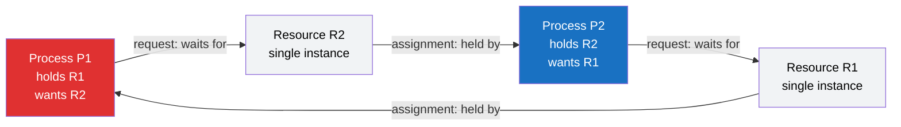

# 🔒 Deadlocks — Detection and Avoidance

> [!abstract] TL;DR
> A **deadlock** is a set of processes each **permanently blocked**, waiting for a resource held by another process in the same set — nobody can move, forever. It can only arise when **four conditions hold at once** (mutual exclusion, hold-and-wait, no preemption, circular wait — the **Coffman conditions**), so breaking any one prevents it. Systems handle deadlock four ways: **prevention** (structurally negate a condition, e.g. global lock ordering), **avoidance** (only grant requests that keep the system in a provably **safe state** — the **Banker's algorithm**), **detection and recovery** (let them happen, find cycles in the **wait-for graph**, then kill or roll back a victim), or the **ostrich algorithm** (ignore it, as most general-purpose OSes do). In practice you avoid deadlocks with **consistent lock ordering, lock timeouts, try-lock, and avoiding nested locks**.

---

## Intuition

**Analogy:** Four cars reach a **four-way intersection** at exactly the same moment. Each is polite-but-greedy: each edges forward into the box to claim the next lane, and in doing so blocks the car to its side. Now car A waits for the spot occupied by car B, B waits for C, C waits for D, and D waits for A. Every driver is waiting for a square the *next* driver is sitting in. No car can advance until another moves first, and no car will move first — a perfect **circular stand-off**. Nobody is broken, nobody is asleep; they are all just permanently stuck holding what the next one needs.

A **deadlock** is exactly this gridlock, translated to processes and resources: process A holds lock 1 and wants lock 2; process B holds lock 2 and wants lock 1. Neither will release what it holds until it gets what it wants, and it will never get what it wants. The fixes are all **traffic rules** designed so the cycle can *never form* — a roundabout (impose an ordering), a rule that you may only enter if your exit is clear (avoidance), or a traffic cop who spots the jam and makes one car back out (detection and recovery).

---

## How It Works

### What a Deadlock Actually Is

A deadlock involves a **set** of processes `{P1, P2, ..., Pn}` where every process in the set is blocked, waiting for an event — the **release of a resource** — that can only be caused by *another blocked process in the same set*. Because every awaited event is caused by a member who is itself blocked, no event ever occurs, and the set is stuck forever. This is stronger than "slow": a deadlocked process makes **zero** progress and consumes no CPU while doing so. The resources need not be physical hardware — they are most often software **locks, semaphores, or monitors** (see the vault's forthcoming *Locks, Semaphores and Monitors* and *Classic Synchronization Problems* notes; the dining-philosophers problem is the canonical deadlock generator).

### The Four Coffman Conditions

Coffman, Elphick and Shoshani (1971) proved that a deadlock can arise **only if all four** of these hold **simultaneously**. This is the single most useful fact in the topic, because it turns "prevent deadlock" into "guarantee at least one of these is always false."

1. **Mutual exclusion** — at least one resource is held in a non-shareable mode; only one process may use it at a time. A read-only file shared by all cannot deadlock; an exclusive write lock can.
2. **Hold and wait** — a process holding at least one resource is waiting to acquire additional resources held by others. If a process must grab everything at once or nothing, this fails.
3. **No preemption** — a resource cannot be forcibly taken away; it is released only voluntarily by the process holding it. If the OS can revoke a resource, this fails.
4. **Circular wait** — there exists a cycle of processes `P1 -> P2 -> ... -> Pn -> P1` where each waits for a resource the next one holds. This is the "closed loop" of the intersection analogy.

Conditions 1-3 make deadlock *possible*; condition 4 makes it *actual*. Break **any single** one and deadlock is impossible.

### The Resource-Allocation Graph (RAG)

We model the state as a directed graph with two kinds of node and two kinds of edge:

- **Process nodes** `Pi` and **resource nodes** `Rj`.
- A **request edge** `Pi -> Rj` — process `Pi` is waiting for resource `Rj`.
- An **assignment edge** `Rj -> Pi` — resource `Rj` is currently held by `Pi`.

The key theorem: **if resources are single-instance, a cycle in the RAG is necessary and sufficient for deadlock.** With **multiple instances** per resource type, a cycle is *necessary but not sufficient* — it only signals *possible* deadlock, and you must run a full reduction/detection algorithm to be sure. Detecting the cycle is the same **graph cycle-detection** problem studied in DSA (see [[DFS]] and [[Strongly_Connected_Components]]): a back edge during depth-first traversal reveals the loop.



Trace the arrows and you find the closed loop `R1 -> P1 -> R2 -> P2 -> R1`: P1 holds R1 and wants R2, while P2 holds R2 and wants R1. That cycle **is** the deadlock. Collapsing resources out of the picture gives the compact **wait-for graph** (WFG): nodes are processes only, and an edge `Pi -> Pj` means "Pi waits for a resource held by Pj." A cycle in the WFG is the thing detectors actually hunt for.

### The Four Strategies for Handling Deadlock

| Strategy | Idea | Cost | Who uses it |
|---|---|---|---|
| **1. Prevention** | Structurally guarantee one Coffman condition can *never* hold | Rigid, can waste resources | Kernels with strict lock-ordering rules |
| **2. Avoidance** | Use advance knowledge of max needs; grant only requests that keep a **safe state** | Needs max claims up front; conservative | Systems with predictable demands |
| **3. Detection + Recovery** | Allow deadlocks, periodically scan the WFG, then kill/roll back a victim | Detection overhead + lost work on rollback | **Databases** |
| **4. Ostrich algorithm** | Pretend deadlocks never happen; reboot if one does | Zero prevention cost; rare failures | General-purpose OSes (Linux, Windows) |

**1. Prevention** attacks a specific condition:
- Negate **mutual exclusion** — make resources shareable (rarely possible; you cannot share a printer mid-page).
- Negate **hold and wait** — require a process to request *all* resources at once, up front, or none. Wastes resources and can starve.
- Negate **no preemption** — if a process holding resources requests one that cannot be granted, forcibly preempt (release) everything it holds. Works only for state you can save and restore (CPU registers, memory pages), not a half-printed document.
- Negate **circular wait** — impose a **total global ordering** on all resources and require every process to acquire them in increasing order. If everyone locks `A` before `B`, no cycle can ever form. **This is the workhorse of real systems** — the Linux kernel documents a mandatory lock-ordering hierarchy, and application "lock hierarchies" are the same discipline.

**2. Avoidance (Banker's algorithm)** is smarter but demands each process declare its **maximum** resource claim in advance. Before granting any request, the system asks: *"if I grant this, does there still exist an ordering — a **safe sequence** — in which every process can eventually get its maximum and finish?"* If yes the state is **safe** and the request is granted; if not the request is denied (the process waits) even though the resources are physically available. A safe state guarantees no deadlock; an unsafe state merely *risks* it. Named by Dijkstra after a banker who never lends so much that they cannot satisfy all clients' credit lines.

**3. Detection and recovery** lets deadlocks happen, then runs a **detection algorithm** (WFG cycle search for single-instance resources; a matrix reduction like the safety algorithm for multi-instance) on a schedule or when CPU utilization suspiciously drops. **Recovery** options: abort all deadlocked processes (drastic), abort one at a time until the cycle breaks (choosing the cheapest **victim** by work done, priority, or rollback cost), or **preempt and roll back** resources to a checkpoint. This is exactly what databases do — see [[Deadlocks]] for how InnoDB and PostgreSQL detect wait-for cycles and roll back a victim transaction.

**4. The ostrich algorithm** — head in the sand. Most general-purpose OSes choose this for user-level resource deadlocks because they are rare, prevention is expensive and restrictive, and the cost of an occasional hung application (killed by the user) is lower than the cost of policing every lock. The engineering trade-off favours ignoring a low-probability event.

### The Banker's Algorithm in Detail

State is four matrices/vectors over `n` processes and `m` resource types:
- **Allocation[n][m]** — units of each resource currently held by each process.
- **Max[n][m]** — the maximum each process may ever need.
- **Need[n][m] = Max − Allocation** — what each *could still* request.
- **Available[m]** — free units of each resource.

**Safety algorithm** (is the current state safe?):
1. `Work = Available`; `Finish[i] = false` for all `i`.
2. Find an unfinished process `i` whose `Need[i] <= Work` (its remaining demand can be fully met right now). If none exists, stop.
3. Pretend it runs to completion and releases everything: `Work = Work + Allocation[i]`; `Finish[i] = true`. Record `i` in the safe sequence.
4. Repeat from 2. If every process finishes, the state is **safe** and the recorded order is a valid **safe sequence**; otherwise it is **unsafe**.

**Resource-request algorithm** (should we grant `Request[i]`?):
1. If `Request[i] > Need[i]` — error (a process asked for more than it declared).
2. If `Request[i] > Available` — the process must **wait** (resources not free yet).
3. **Tentatively** grant: `Available -= Request`; `Allocation[i] += Request`; `Need[i] -= Request`. Run the safety algorithm on this pretend state. If safe, commit the grant; if unsafe, **roll back** the pretend state and make the process wait — denying a physically-possible request to preserve future safety.

---

## Key Concepts

### Secondary (intuition level)
- **Deadlock = permanent stuck** — a group of tasks each waiting on the next, forever, like cars gridlocked in an intersection.
- **The fix is a rule, not a cure** — the cheapest, most reliable fix is a *convention* everyone follows: always grab locks in the same order.
- **Not the same as "slow"** — a deadlocked program is frozen and using no CPU; a slow program is still doing work.

### Undergraduate (mechanism level)
- **The four Coffman conditions** and why breaking any one prevents deadlock — the core exam result.
- **Resource-allocation graph vs wait-for graph** — cycle = deadlock for single-instance resources; cycle = *maybe* for multi-instance. Detection reduces to graph cycle-finding ([[DFS]] with the WHITE/GRAY/BLACK coloring).
- **Safe vs unsafe vs deadlocked states** — safe ⊂ (not deadlocked); an unsafe state is not yet a deadlock but may become one. The Banker's algorithm keeps the system strictly inside the safe region.
- **Livelock vs starvation vs deadlock** — three different "no progress" failures:
  - **Deadlock** — processes blocked, doing nothing, cycle in the WFG.
  - **Livelock** — processes are *active* and keep changing state in response to each other but make **no forward progress** (two people repeatedly stepping the same way to let each other pass in a hallway). No cycle of *blocked* processes — they are busy, just uselessly.
  - **Starvation** — a process is indefinitely denied a resource because others keep jumping the queue (often a scheduling/priority issue, not a cycle). Covered under scheduling fairness in the vault's forthcoming *CPU Scheduling Algorithms* note.

### Graduate (design and tension level)
- **Priority inversion** — a subtle deadlock-adjacent hazard: a high-priority task blocks on a lock held by a *low*-priority task, which is itself preempted by *medium*-priority tasks that never touch the lock. The high-priority task is effectively stalled by lower-priority work. The classic real fix is **priority inheritance** (temporarily boost the lock holder to the waiter's priority). This nearly killed the 1997 Mars Pathfinder mission; it belongs to the vault's forthcoming *Real-Time and Embedded Operating Systems* note.
- **Detection frequency trade-off** — running detection on every resource request gives instant resolution but high overhead; running it periodically (or only when utilization drops) is cheaper but lets deadlocks linger and complicates victim choice (more processes may now be entangled).
- **Distributed deadlock** — across machines there is no single global WFG; each node sees only a fragment. Algorithms like **edge-chasing** (probe messages propagated along wait-for edges) or centralized/hierarchical coordinators are needed, and **false deadlocks** can be reported due to stale state. This is the domain of the vault's forthcoming *Distributed Operating Systems* note and appears in distributed databases ([[Distributed_Transactions_in_Databases]]).
- **Why avoidance is rare in practice** — the Banker's algorithm requires every process to declare its maximum claim up front, which is usually unknown for general workloads, and it is conservative (denies safe-looking requests). Real systems overwhelmingly prefer *prevention by lock ordering* plus *detection* over *avoidance*.

---

## Python Demo

Two self-contained demonstrations using only `numpy` and `matplotlib`. **Part A** builds a **wait-for graph**, detects a deadlock by finding a directed cycle with a 3-color DFS, and draws the graph with the deadlock cycle highlighted in red. **Part B** implements the **Banker's algorithm** safety check on allocation/max/need/available matrices, prints a safe sequence, and shows it **granting** one request that preserves safety while **denying** another that would push the system into an unsafe state.

```python
# Deadlock DETECTION (wait-for graph cycle finding) + AVOIDANCE (Banker's algorithm).
# numpy + matplotlib only; fully deterministic.
import numpy as np
import matplotlib.pyplot as plt

# ============================================================
# PART A -- DETECTION: find a deadlock cycle in a Wait-For Graph
# ============================================================
# WFG: node = process, edge Pi -> Pj means
# "Pi is blocked waiting for a resource currently HELD by Pj".
# A directed CYCLE in the WFG == a deadlock (single-instance resources).
n = 5
labels = ["P0", "P1", "P2", "P3", "P4"]
wfg = {
    0: [1],        # P0 waits for P1
    1: [2],        # P1 waits for P2
    2: [3, 0],     # P2 waits for P3 AND P0  -> the edge to P0 closes a cycle
    3: [4],        # P3 waits for P4
    4: [],         # P4 waits for nobody (it holds everything it needs)
}

def find_cycle(adj, n):
    """3-color DFS. Returns the ordered nodes of ONE cycle, or [] if acyclic."""
    WHITE, GRAY, BLACK = 0, 1, 2
    color = [WHITE] * n
    parent = [-1] * n
    cycle = []

    def dfs(u):
        color[u] = GRAY
        for v in adj.get(u, []):
            if color[v] == GRAY:                 # back edge -> cycle found
                path, x = [u], u                 # walk parents from u back to v
                while x != v and parent[x] != -1:
                    x = parent[x]
                    path.append(x)
                cycle.extend(reversed(path))     # v, ..., u  (u->v closes it)
                return True
            if color[v] == WHITE:
                parent[v] = u
                if dfs(v):
                    return True
        color[u] = BLACK
        return False

    for s in range(n):
        if color[s] == WHITE and dfs(s):
            break
    return cycle

cycle = find_cycle(wfg, n)
if cycle:
    loop = " -> ".join(labels[i] for i in cycle + [cycle[0]])
    print(f"DETECTION: DEADLOCK found. Circular wait: {loop}")
else:
    print("DETECTION: no deadlock -- the wait-for graph is acyclic.")

# ============================================================
# PART B -- AVOIDANCE: Banker's algorithm safety + request checks
# ============================================================
# 5 processes, 3 resource types (A, B, C). Classic Silberschatz state.
alloc = np.array([[0, 1, 0],   # P0
                  [2, 0, 0],   # P1
                  [3, 0, 2],   # P2
                  [2, 1, 1],   # P3
                  [0, 0, 2]])  # P4
maxm  = np.array([[7, 5, 3],
                  [3, 2, 2],
                  [9, 0, 2],
                  [2, 2, 2],
                  [4, 3, 3]])
total     = np.array([10, 5, 7])
available = total - alloc.sum(axis=0)   # free units -> [3, 3, 2]
need      = maxm - alloc

def is_safe(alloc, need, available):
    """Banker's SAFETY algorithm. Returns (safe?, safe_sequence, work_history)."""
    m = alloc.shape[0]
    work   = available.copy()
    finish = np.zeros(m, dtype=bool)
    seq, history = [], [work.copy()]
    progressing = True
    while progressing and not finish.all():
        progressing = False
        for i in range(m):
            if not finish[i] and np.all(need[i] <= work):
                work = work + alloc[i]      # process finishes and releases its hold
                finish[i] = True
                seq.append(i)
                history.append(work.copy())
                progressing = True
    return finish.all(), seq, np.array(history)

safe, seq, history = is_safe(alloc, need, available)
print(f"\nAVOIDANCE: available={available}  state safe? {safe}")
if safe:
    print("Safe sequence:", " -> ".join(labels[i] for i in seq))

def request_resources(pid, request, alloc, need, available):
    """Banker's RESOURCE-REQUEST algorithm. Returns (granted?, reason)."""
    request = np.array(request)
    if np.any(request > need[pid]):
        return False, "exceeds declared MAX need -> error"
    if np.any(request > available):
        return False, "resources not free -> process must WAIT"
    new_avail = available - request              # tentatively grant
    new_alloc = alloc.copy(); new_alloc[pid] = new_alloc[pid] + request
    new_need  = need.copy();  new_need[pid]  = new_need[pid]  - request
    ok, s, _ = is_safe(new_alloc, new_need, new_avail)
    if ok:
        return True, "keeps system SAFE, seq " + "->".join(labels[i] for i in s)
    return False, "would make system UNSAFE -> DENY to avoid deadlock"

for pid, req in [(1, [1, 0, 2]), (0, [0, 2, 2])]:
    granted, why = request_resources(pid, req, alloc, need, available)
    tag = "GRANTED" if granted else "DENIED "
    print(f"{labels[pid]} requests {req}: {tag} -- {why}")

# ============================================================
# VISUALIZE: wait-for graph with cycle (left), safe-sequence work (right)
# ============================================================
fig, (axL, axR) = plt.subplots(1, 2, figsize=(13, 6))

# --- left: wait-for graph, deadlock cycle in red ---
ang = np.linspace(0, 2 * np.pi, n, endpoint=False) + np.pi / 2
pos = np.column_stack([np.cos(ang), np.sin(ang)])
cyc_edges = {(cycle[k], cycle[(k + 1) % len(cycle)]) for k in range(len(cycle))} if cycle else set()

for u in wfg:
    for v in wfg[u]:
        red = (u, v) in cyc_edges
        axL.annotate("", xy=pos[v], xytext=pos[u],
                     arrowprops=dict(arrowstyle="-|>", shrinkA=20, shrinkB=20,
                                     lw=2.8 if red else 1.3,
                                     color="#e03131" if red else "#adb5bd",
                                     connectionstyle="arc3,rad=0.12"))
for i in range(n):
    in_cyc = bool(cycle) and i in cycle
    axL.scatter(*pos[i], s=1500, zorder=3, edgecolors="black",
                color="#e03131" if in_cyc else "#4c6ef5")
    axL.text(*pos[i], labels[i], ha="center", va="center", zorder=4,
             color="white", fontsize=12, fontweight="bold")
axL.set_title("Wait-For Graph\nred cycle P0->P1->P2->P0 = DEADLOCK")
axL.axis("equal"); axL.axis("off")

# --- right: reclaimable resources after each process in the safe sequence ---
res = ["A", "B", "C"]
steps = np.arange(history.shape[0])
for j in range(history.shape[1]):
    axR.plot(steps, history[:, j], marker="o", lw=2, label=f"Resource {res[j]}")
axR.set_xticks(steps)
axR.set_xticklabels(["start"] + [labels[i] for i in seq])
axR.set_xlabel("Work vector after each process finishes (safe order)")
axR.set_ylabel("Units available to reclaim")
axR.set_title("Banker's safety check\nSAFE sequence " + " -> ".join(labels[i] for i in seq))
axR.legend(); axR.grid(alpha=0.3)

plt.tight_layout()
plt.savefig("deadlock_demo.png", dpi=110)
print("\nsaved deadlock_demo.png")
```

**What you see.** Part A reports `DEADLOCK found. Circular wait: P0 -> P1 -> P2 -> P0` — the DFS found a back edge closing the loop, and the left plot draws that cycle in red while the acyclic branch (`P3 -> P4`) stays grey. Part B prints the safe sequence `P1 -> P3 -> P4 -> P0 -> P2`; the right plot shows the work vector climbing back toward the total as each process finishes and releases its hold. The two requests demonstrate the avoidance decision directly: `P1 requests [1,0,2]` is **GRANTED** because a safe sequence still exists, but `P0 requests [0,2,2]` is **DENIED** — even though the resources are physically free — because granting it would strand every process in an unsafe state.

---

## Real-World Applications

> **Example — database transaction deadlocks.** MySQL's InnoDB and PostgreSQL both take the **detection-and-recovery** route rather than prevention. Every lock wait adds an edge to an internal **wait-for graph**; InnoDB checks for a cycle continuously at lock-request time, while PostgreSQL waits `deadlock_timeout` (default 1s) then checks. On finding a cycle they pick a **victim** (InnoDB: the transaction that modified the fewest rows, cheapest to roll back), abort it, and return a deadlock error the application is expected to **retry**. This is the pure "allow, detect, recover" strategy in production — see [[Deadlocks]], [[Locking]], and [[Concurrency_Control]].

- **Operating-system kernels** apply **prevention by lock ordering**. The Linux kernel enforces a documented lock hierarchy and ships **lockdep**, a runtime validator that flags any code path acquiring locks out of the canonical order — catching *potential* deadlocks before they ever fire in production.
- **General-purpose OSes (Linux, Windows, macOS)** use the **ostrich algorithm** for application-level resource deadlocks: they do not run Banker's checks on `malloc` or file locks; a hung app is simply the user's problem to kill.
- **Real-time and embedded systems** cannot ostrich — a stalled control loop is a safety failure. They use **priority-inheritance** and **priority-ceiling** protocols to bound blocking and prevent priority inversion (the Mars Pathfinder resets were a textbook case).
- **Distributed systems and microservices** face **distributed deadlock** across services and lock managers, resolved with edge-chasing probes, global lock ordering of shard/partition keys, or — most pragmatically — **lock timeouts** so any stuck acquisition eventually aborts and retries.

---

## Common Pitfalls

- **Inconsistent lock ordering across code paths** — two features that lock the same two objects in *opposite* orders is the textbook deadlock generator. The fix is a single canonical global order (e.g. by address, ID, or a documented hierarchy) that *every* path obeys. This is prevention by negating circular wait, and it is the highest-leverage habit in concurrent code.
- **Nested locks held during slow work** — holding lock A while calling out to the network, disk, or another lock B widens the window for a cycle enormously. Do slow work *outside* the critical section, and prefer holding only one lock at a time.
- **Confusing deadlock with livelock or starvation** — if threads are burning CPU but nothing finishes, it is **livelock** (often from naive retry-on-conflict where everyone backs off in lockstep); if one thread is perpetually skipped, it is **starvation** (a scheduling/fairness bug). Neither has a WFG cycle, so a deadlock detector will report "no deadlock" while the system is still stuck — misdiagnosing these wastes hours.
- **Assuming a RAG cycle always means deadlock** — true only for **single-instance** resources. With multiple instances a cycle is merely *possible* deadlock; you must run the full detection/reduction algorithm. Aborting a victim on a false alarm throws away work for nothing.
- **Trusting the Banker's algorithm in general software** — it needs each process's **maximum** claim declared in advance, which is unknown for most real workloads, and it is conservative. Reaching for avoidance when prevention (lock ordering) or detection (timeouts + retry) would do is over-engineering.
- **No retry after a detected deadlock** — under detection-and-recovery the victim is *rolled back*, so treating the deadlock error as fatal instead of retrying the whole transaction/operation from the start is the most common production mistake. Use **lock timeouts** and **try-lock** (acquire-or-back-off) so a stuck acquisition self-heals.

---

## Related Concepts

- [[Operating_Systems_Overview]] — the OS is the resource arbiter whose locks and synchronization primitives are the resources that deadlock over.
- [[Deadlocks]] — the database view: how InnoDB and PostgreSQL detect wait-for cycles and roll back a victim (detection-and-recovery in production).
- [[Locking]] — the lock modes (shared/exclusive, gap/next-key) whose cyclic acquisition is the concrete cause of most real deadlocks.
- [[Concurrency_Control]] — two-phase locking's inherent downside is deadlock; optimistic concurrency control trades it for retry-on-conflict.
- [[Isolation_Levels]] — higher isolation (more/wider locks) raises deadlock and serialization-failure rates.
- [[MVCC_Internals]] — why *readers* rarely deadlock (they take no read locks); write-write conflicts still can.
- [[Distributed_Transactions_in_Databases]] — where distributed deadlock and edge-chasing/timeout resolution appear across nodes.
- [[Transactions_and_ACID]] — a deadlock victim is rolled back atomically, and the caller retries — the recovery half of detection-and-recovery.
- [[DFS]] — deadlock detection on a single-instance wait-for graph *is* directed-graph cycle detection (WHITE/GRAY/BLACK 3-color DFS).
- [[Strongly_Connected_Components]] — an alternative lens: a deadlock set is exactly a nontrivial SCC in the wait-for graph.

*Forthcoming sibling OS notes referenced above (not yet in the vault): Locks Semaphores and Monitors, Classic Synchronization Problems (dining philosophers), CPU Scheduling Algorithms (starvation and fairness), Real-Time and Embedded Operating Systems (priority inversion and inheritance), and Distributed Operating Systems (distributed deadlock).*

---

## Review Questions

1. **(Conceptual)** State the four Coffman conditions and explain why *all four* must hold simultaneously for a deadlock to exist. Pick the one condition you would negate to design a deadlock-free kernel subsystem, and justify why it is the most practical target compared to the other three.
2. **(Scenario)** A payment service intermittently freezes under load; threads are blocked (not spinning) and CPU usage drops to near zero. A colleague blames "livelock." Using the wait-for graph, explain how you would confirm whether this is deadlock, livelock, or starvation, and give the single most effective code change to prevent the most likely cause.
3. **(Trade-off)** A general-purpose OS uses the ostrich algorithm while a database uses detection-and-recovery and a real-time controller uses prevention/avoidance. Explain the failure-cost and workload-predictability reasoning behind each choice, and argue why the Banker's algorithm is almost never used for general application software.

---

## Sources

- E. G. Coffman, M. Elphick, A. Shoshani — "System Deadlocks," *ACM Computing Surveys*, Vol. 3, No. 2 (1971). [https://dl.acm.org/doi/10.1145/356586.356588](https://dl.acm.org/doi/10.1145/356586.356588)
- Silberschatz, Galvin, Gagne — *Operating System Concepts*, 10th ed. (Wiley, 2018), Ch. 8 "Deadlocks." [https://www.os-book.com/OS10/](https://www.os-book.com/OS10/)
- E. W. Dijkstra — "Cooperating Sequential Processes" (EWD123), origin of the Banker's algorithm. [https://www.cs.utexas.edu/users/EWD/transcriptions/EWD01xx/EWD123.html](https://www.cs.utexas.edu/users/EWD/transcriptions/EWD01xx/EWD123.html)
- Tanenbaum & Bos — *Modern Operating Systems*, 4th ed. (Pearson, 2015), Ch. 6 "Deadlocks."
- Arpaci-Dusseau — *Operating Systems: Three Easy Pieces*, "Common Concurrency Problems." [https://pages.cs.wisc.edu/~remzi/OSTEP/threads-bugs.pdf](https://pages.cs.wisc.edu/~remzi/OSTEP/threads-bugs.pdf)

---

#operating-systems #deadlock #bankers-algorithm #resource-allocation #circular-wait
