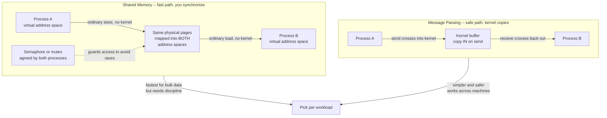

# 🔌 Interprocess Communication

> [!abstract] TL;DR
> Processes have **separate address spaces by design** — one cannot reach into another's memory, which is exactly the protection the OS is built to enforce. **Interprocess communication (IPC)** is the set of OS-mediated channels that let isolated processes exchange data and coordinate anyway. Two fundamental models exist: **shared memory** (the kernel maps one physical region into both processes, so after setup they talk at raw memory speed — fastest, but *you* must synchronize access) and **message passing** (processes exchange discrete messages copied through the kernel — slower per byte but naturally synchronized, safer, and it generalizes across machines). The concrete mechanisms — pipes, FIFOs, signals, message queues, semaphores, shared-memory segments, and sockets — are all instances of these two ideas.

---

## Intuition

**Analogy:** Imagine every process is a **sealed apartment with no shared walls**. There are no windows into the neighbour's unit and no doorway between them — that isolation is deliberate, so a fire (a crash) or a burglar (a bug or attacker) in one apartment cannot touch another. But sealed apartments still need to cooperate, so the building offers three kinds of channels:

- **A pneumatic mail tube (a PIPE)** bolted between two adjacent apartments. You drop a note in one end and it pops out the other — but only *one way*, and only for units the tube was installed between (a parent and its child).
- **A shared bulletin board in a common alcove (SHARED MEMORY)** that both apartments can see and write on at the same time. It is instant — no carrying, no copying — but if both residents scribble on the same spot simultaneously, you get a garbled mess. They need an agreed *"one person writes at a time"* rule (a semaphore).
- **The postal service (MESSAGE PASSING)**. You seal a letter and hand it to the post office; it copies nothing of yours into the neighbour's apartment — it *delivers a discrete envelope* the recipient opens on their own turf. Slower and there's handling overhead, but it is clean, orderly, and — crucially — the same postal system works whether the recipient is next door or in another city (another machine).

Each channel trades **speed against safety and simplicity**. The bulletin board is fastest but dangerous without discipline; the postal service is slower but self-organizing and works over any distance. Choosing an IPC mechanism *is* choosing where you want to sit on that spectrum.

---

## How It Works

### Why processes need IPC at all

Recall from the *Operating Systems Overview* that the OS gives every process a **private virtual address space** (developed in the forthcoming *Memory Management and Allocation* and *Processes and the Process Model* notes). Process A's pointer `0x1000` and Process B's pointer `0x1000` map to *different* physical memory. This is the bedrock of **protection** (the forthcoming *Protection and Access Control* note): the hardware MMU physically forbids A from dereferencing B's memory. Threads inside one process share memory freely; **separate processes cannot** — by design.

That isolation is a feature, but cooperation still has to happen: a shell must feed `ls` output into `grep`; a browser's sandboxed renderer must ask the privileged process to paint a window; a database's worker must hand a result to the connection handler. Since they cannot touch each other's memory directly, they must go through an **explicit, OS-mediated channel** — and every such channel is set up and torn down via **system calls** (the forthcoming *System Calls and the Kernel Interface* note). IPC is therefore *protection-preserving cooperation*.

### The two fundamental models

Everything reduces to two strategies:

1. **Shared memory.** The OS maps the *same physical pages* into both processes' address spaces (via `shmget`/`shmat` in System V, or `shm_open` + `mmap` in POSIX). After that one-time setup, a write by A is *immediately visible* to B with **zero kernel involvement** — it is just an ordinary memory store. This is the fastest possible IPC because it avoids copying and syscalls on the hot path. The catch: the kernel no longer mediates each access, so **the processes must synchronize themselves** to avoid race conditions and torn reads/writes (the forthcoming *Process Synchronization and Race Conditions* note, using semaphores and mutexes from *Locks, Semaphores, and Monitors*).
2. **Message passing.** Processes exchange **discrete messages** through kernel primitives `send` and `receive`. On `send`, the kernel **copies** the payload from the sender's address space into a kernel buffer; on `receive`, it copies from the kernel buffer into the receiver's address space. This double copy plus the syscall crossing makes it slower per byte, but it buys a lot: no shared state to corrupt, **automatic synchronization** (the receiver blocks until a message arrives), clean ownership of data, and — because the abstraction is "deliver an envelope" rather than "share a page" — it **generalizes across machines**, which is the bridge to distributed systems and RPC (the forthcoming *Distributed Operating Systems* note).

### Shared memory vs message passing



The diagram captures the core tension: shared memory removes the kernel from the data path (fast, but the two arrows into the same block are a **race** unless the semaphore serializes them), while message passing keeps the kernel in the middle as a copying, buffering intermediary (slower, but there is no shared block to corrupt).

### The concrete mechanisms

These are the tools you actually reach for; each is an instance of one of the two models above.

- **Pipes** — a **unidirectional byte stream**. An *anonymous pipe* (`pipe()`) connects a **parent and child** only, because the child inherits the file descriptor across `fork`. A **named pipe / FIFO** (`mkfifo`) appears as a special file in the filesystem, so *any* two unrelated processes on the same host can open it by name. The shell's `|` is exactly an anonymous pipe.
- **Signals** — **asynchronous notifications**, not data channels. A signal like `SIGINT` (Ctrl-C), `SIGTERM`, `SIGKILL`, or `SIGCHLD` interrupts the target process and runs a handler. Signals carry essentially no payload — they are a doorbell, not a letter.
- **Message queues** — **typed, discrete messages** with kernel-managed queuing and priorities (POSIX `mq_*` or the older System V queues). Messages persist in the kernel until read, so sender and receiver need not overlap in time.
- **Semaphores** — **coordination, not data transfer** (the forthcoming *Locks, Semaphores, and Monitors* note). They are the discipline that makes *shared memory* safe: a counting semaphore signals "a slot is free" or "an item is ready."
- **Shared-memory segments** — POSIX `shm_open` + `mmap`, or System V `shmget`. The fast model above; almost always paired with a semaphore or mutex placed *inside* the shared region.
- **Sockets** — the **unifying local-and-remote abstraction**. A **Unix-domain socket** is fast local IPC (bidirectional, stream or datagram, no network stack); switch the address family and the *same API* becomes a **network socket** talking TCP/UDP to another machine (see [[Transport_Layer]], [[TCP_Protocol]], [[UDP_Protocol]]). This continuity is why sockets underpin so much: learn one interface, use it everywhere.
- **Memory-mapped files** — `mmap` a file into two processes' address spaces; it is shared memory *backed by a file*, so it also persists and survives restarts.

### Blocking vs non-blocking, synchronous vs asynchronous

Two orthogonal axes control the *timing* of `send`/`receive`:

- **Blocking (synchronous):** `receive` sleeps until a message is available; a blocking `send` sleeps until the message is accepted. Simple to reason about — the classic **rendezvous**.
- **Non-blocking (asynchronous):** the call returns immediately with success or "would block" (`EAGAIN`), letting the process do other work and poll or use `epoll`/`select`. Essential for servers juggling thousands of connections.

### Direct vs indirect communication and buffering

- **Direct** communication names the *peer* explicitly: `send(to_process_B, msg)`. **Indirect** communication routes through a named intermediary — a **mailbox** or **port** — so senders and receivers are decoupled and need not know each other. Most real systems (message queues, D-Bus, brokers) are indirect.
- **Buffering** sets the queue capacity between them:
  - **Zero-capacity (rendezvous):** no buffer; the sender blocks until the receiver takes the message — a hand-off.
  - **Bounded:** a fixed-size queue; a full queue blocks the sender. This is precisely the **producer-consumer / bounded-buffer** problem (the forthcoming *Classic Synchronization Problems* note).
  - **Unbounded:** the sender never blocks on capacity (a useful abstraction; real memory is finite, so "unbounded" queues risk exhausting RAM).

---

## Key Concepts

### Secondary (intuition level)
- Processes are **isolated on purpose**; IPC is how they cooperate *without* breaking that isolation.
- **Shared memory** is like a shared whiteboard — instant but needs a "one at a time" rule. **Message passing** is like the postal service — a bit slower, but tidy and it works over any distance.
- Everyday IPC you already use: the shell pipe `ls | grep`, and Ctrl-C sending a **signal** to stop a program.

### Undergraduate (mechanism level)
- **The two models:** shared memory (fast, you synchronize) vs message passing (copied through the kernel, naturally synchronized). Know when each fits.
- **The mechanisms and their scope:** anonymous pipes (parent/child), FIFOs (any local pair), signals (notifications), message queues (typed, persistent), shared-memory segments (`mmap`/`shm`), and sockets (local *and* remote).
- **Send/receive semantics:** blocking vs non-blocking, synchronous vs asynchronous; direct vs indirect (mailboxes/ports) naming; buffering capacities (rendezvous, bounded, unbounded).
- **Synchronization is not optional** for shared memory: without a semaphore/mutex you get race conditions and torn reads. Message passing hides this by serializing through the kernel.
- **Cost model:** each message passing operation pays a **syscall crossing** plus **one or two data copies**; shared memory pays a one-time setup and then near-`memcpy` speed.

### Graduate (design and tension level)
- **Zero-copy and the copy tax.** The dominant cost of message passing at scale is memory copies and context switches. Techniques like `splice`, `vmsplice`, `sendfile`, shared-memory rings, and `io_uring` reduce or eliminate copies (the forthcoming *Kernel Bypass and Modern IO* note). Choosing shared memory for bulk transfer *is* a zero-copy decision.
- **The IPC/protection trade-off is fundamental.** Stronger isolation (message passing, separate address spaces) fights against faster sharing (shared memory). Microkernels pay a real IPC tax precisely because they push services into separate address spaces — which is why microkernel IPC performance (e.g. seL4's fast-path IPC) is a decades-long research theme.
- **Message passing generalizes to distribution.** `send`/`receive` over a socket becomes **RPC** across machines (see [[RPC]], [[gRPC]]); the same envelope model scales from two local processes to a planet-wide microservice mesh. Shared memory *cannot* cross a machine boundary — this asymmetry is why distributed systems are built on message passing.
- **Ordering, delivery, and failure semantics.** Local pipes give in-order, reliable, same-host delivery for free; the moment you generalize to the network you inherit reordering, loss, duplication, and partial failure — the hard problems that dominate distributed systems design.
- **Naming and coupling.** Indirect communication via ports/mailboxes/brokers decouples producers from consumers and enables the **pipe-and-filter** and **publish-subscribe** architectures that scale organizations, not just programs.

---

## Python Demo

This models the **central performance trade-off**: transferring `N` bytes between two processes via **shared memory** (near `memcpy` speed after a one-time setup, *no* per-message kernel copy or syscall) versus **a pipe / message queue** (a syscall crossing plus a double copy *every* message) versus **a socket** (the same copies plus extra protocol overhead). We plot per-message **latency** and steady-state **throughput** against message size to show *why shared memory wins for bulk data while message passing is fine — and simpler and safer — for small messages*.

```python
# IPC performance trade-off: shared memory vs pipe/message-passing vs socket.
# A simple, transparent cost model (nanoseconds, bytes) -- numpy + matplotlib only.
import numpy as np
import matplotlib.pyplot as plt

# --- Cost model constants (representative, order-of-magnitude realistic) ---
BW_MEM   = 12.0     # bytes per ns  -> ~12 GB/s in-cache memcpy (shared-memory path)
BW_COPY  = 6.0      # bytes per ns  -> ~6 GB/s per kernel<->user copy
SYSCALL  = 300.0    # ns  fixed cost of the send+receive syscall crossings (pipe)
SOCKET   = 1500.0   # ns  fixed cost of the local socket protocol path
SHM_SETUP = 50000.0 # ns  one-time mmap/attach cost, amortized over M messages
M         = 10000   # messages sharing the one-time shared-memory setup

# Message sizes from 8 bytes to 64 MiB (log-spaced)
N = np.geomspace(8, 64 * 1024 * 1024, 200)

# --- Per-message latency (ns) ---
# Shared memory: one-time setup amortized + a single in-memory copy of N bytes.
lat_shm  = SHM_SETUP / M + N / BW_MEM
# Pipe / message passing: syscall crossing + TWO copies (user->kernel, kernel->user).
lat_pipe = SYSCALL + 2.0 * N / BW_COPY
# Socket: larger fixed protocol cost + slightly more per-byte handling.
lat_sock = SOCKET + 2.2 * N / BW_COPY

# --- Throughput (bytes/ns == GB/s) ---
thpt_shm, thpt_pipe, thpt_sock = N / lat_shm, N / lat_pipe, N / lat_sock

# --- Absolute time SAVED by shared memory over a pipe (the "is it worth it?" curve) ---
saved = lat_pipe - lat_shm

# Find where the saving first exceeds 1 microsecond (a rough "worth the complexity" line)
idx = np.argmax(saved > 1000.0)
crossover = N[idx]
print(f"Shared memory saves >1 us per message once payloads exceed "
      f"~{crossover/1024:.1f} KiB")
print(f"Asymptotic throughput  shm={BW_MEM:.0f} GB/s  "
      f"pipe={BW_COPY/2:.1f} GB/s  socket={BW_COPY/2.2:.1f} GB/s")

# --- Plot ---
fig, (ax1, ax2) = plt.subplots(1, 2, figsize=(13, 5))
KIB = 1024.0

ax1.loglog(N / KIB, lat_shm,  label="Shared memory", color="#5cb85c", lw=2)
ax1.loglog(N / KIB, lat_pipe, label="Pipe / message passing", color="#f0ad4e", lw=2)
ax1.loglog(N / KIB, lat_sock, label="Socket", color="#d9534f", lw=2)
ax1.axvline(crossover / KIB, ls="--", color="gray", alpha=0.7)
ax1.set_xlabel("Message size [KiB]")
ax1.set_ylabel("Latency per message [ns]")
ax1.set_title("Latency: small messages are dominated by fixed overhead")
ax1.legend()
ax1.grid(True, which="both", alpha=0.3)

ax2.semilogx(N / KIB, thpt_shm,  label="Shared memory", color="#5cb85c", lw=2)
ax2.semilogx(N / KIB, thpt_pipe, label="Pipe / message passing", color="#f0ad4e", lw=2)
ax2.semilogx(N / KIB, thpt_sock, label="Socket", color="#d9534f", lw=2)
ax2.set_xlabel("Message size [KiB]")
ax2.set_ylabel("Throughput [GB/s]")
ax2.set_title("Throughput: shared memory pulls ahead for bulk data")
ax2.legend()
ax2.grid(True, which="both", alpha=0.3)

plt.tight_layout()
plt.savefig("ipc_tradeoff_demo.png", dpi=110)
print("saved ipc_tradeoff_demo.png")
```

**What you see:** for **small messages** all three curves sit on their fixed-overhead floor — a few hundred nanoseconds — so shared memory's advantage in *absolute* time is small and rarely worth the synchronization burden; a pipe or socket is simpler and safer here. As messages grow into the **kilobytes and megabytes**, the double kernel copy of message passing dominates, throughput saturates at roughly half the copy bandwidth for the pipe and lower still for the socket, while shared memory keeps climbing toward full memory bandwidth. That divergence is the whole story: **message passing for small, occasional, or cross-machine messages; shared memory for bulk, high-rate, same-host data.**

---

## Real-World Applications

> **Example — Chromium's multi-process architecture.** Chrome runs each tab's renderer in a **sandboxed process** that cannot touch your files or other tabs (protection first). Renderers talk to the privileged browser process over **Mojo IPC**, which uses **message passing** for control messages and **shared memory** for bulk payloads like decoded video frames and rasterized tiles — copying a 4K frame per message would be ruinous, so the pixels go through shared memory while the "here is a new frame" notification goes through the message channel. This is the exact split the demo models.

- **Shell pipelines.** `cat log | grep ERROR | wc -l` wires three processes with **anonymous pipes**; each `|` is a unidirectional byte stream and the kernel schedules the stages concurrently. This is the original Unix pipe-and-filter design (see Linux tooling in the DevOps vault).
- **Android Binder.** Android's entire app-to-system-service communication runs over **Binder**, a specialized kernel IPC driver doing message passing with a single copy and object-reference passing — chosen for security and reference-counting across process boundaries.
- **D-Bus.** The Linux desktop message bus provides **indirect** IPC: applications publish and subscribe on a bus (mailbox/port model) rather than naming each other directly, decoupling components.
- **gRPC and RPC frameworks.** [[RPC]] and [[gRPC]] take the `send`/`receive` message-passing model and generalize it across machines — a local method call becomes a serialized message over a socket to a remote process (see the *Distributed Operating Systems* bridge below).
- **Databases and caches.** PostgreSQL uses **System V / POSIX shared memory** for its shared buffer pool across worker processes, guarded by lightweight locks; Redis clients reach the server over **Unix-domain sockets** locally or TCP remotely — the same socket API, two scopes.
- **Message brokers.** RabbitMQ, Kafka, and cloud queues (see [[Message_Queues]]) scale the *indirect, buffered message passing* model into durable, distributed infrastructure.

---

## Common Pitfalls

- **Using shared memory without synchronization.** The single most common IPC bug: two processes write the same region and you get **torn reads/writes and races** (the forthcoming *Process Synchronization and Race Conditions* note). Shared memory is *only* fast because the kernel steps out of the way — which means *you* must put the semaphore or mutex in. Never assume a store is atomic beyond word size.
- **Forgetting anonymous pipes only work between relatives.** `pipe()` shares descriptors via `fork`; two *unrelated* processes cannot use it. You need a **FIFO** (`mkfifo`) or a Unix-domain socket. Reaching for an anonymous pipe between arbitrary programs is a category error.
- **Ignoring SIGPIPE / broken pipes.** Writing to a pipe whose read end has closed raises `SIGPIPE`, which by default **kills your process**. Producers must handle or ignore it, or check for the `EPIPE` error — a classic surprise when the consumer exits early.
- **Assuming pipes preserve message boundaries.** A pipe is a **byte stream**, not a record stream: two 100-byte writes may arrive as one 200-byte read or be split. If you need discrete messages, use a **message queue** or framing (length prefixes) over the stream. Datagram sockets *do* preserve boundaries; stream sockets do not.
- **Copying bulk data through message passing at high rate.** Sending large frames through a pipe/socket pays the double-copy tax on every message; the demo shows throughput capping at roughly half of copy bandwidth. For megabyte payloads at high frequency, switch to **shared memory** or a **zero-copy** path (the forthcoming *Kernel Bypass and Modern IO* note).
- **Deadlocking on full buffers.** With **bounded** buffering, a producer blocks when the queue is full and a consumer blocks when it is empty; get the ordering wrong (both blocked on a rendezvous) and you deadlock. This is the producer-consumer problem — solve it with the standard semaphore pattern, not ad-hoc sleeps.
- **Leaking IPC objects.** System V shared memory segments and message queues **persist beyond the process** until explicitly removed (`ipcrm`) or the machine reboots — a silent resource leak. POSIX objects live under `/dev/shm` and must be `shm_unlink`ed.

---

## Related Concepts

- [[Operating_Systems_Overview]] — establishes the private per-process address space and the mode-bit protection that make IPC *necessary* in the first place.
- [[C_IPC]] — the hands-on POSIX / systems-programming view: the exact `pipe`, `mkfifo`, `mq_*`, `shm_open`, `mmap`, and Unix-socket calls that implement everything here.
- [[POSIX_Threads]] — the contrast case: threads share one address space and communicate through shared variables, so they skip IPC but inherit all its synchronization hazards.
- [[Cpp_Concurrency]] — language-level concurrency and memory models that sit atop these OS primitives.
- [[RPC]] — message passing generalized across machines: a local `send`/`receive` becomes a remote procedure call.
- [[gRPC]] — a concrete, production RPC framework realizing that generalization over HTTP/2 and Protobuf.
- [[Message_Queues]] — the distributed-systems scale-up of indirect, buffered message passing (brokers, durability, back-pressure).
- [[Transport_Layer]] — where local sockets become network sockets; the layer message passing rides on across hosts.
- [[TCP_Protocol]] — reliable, ordered byte-stream delivery, the network analogue of a pipe.
- [[UDP_Protocol]] — datagram delivery that, like a message queue, preserves message boundaries but not reliability.

*Forthcoming sibling notes in this vault (referenced above, not yet written): Processes and the Process Model, System Calls and the Kernel Interface, Memory Management and Allocation, Protection and Access Control, Process Synchronization and Race Conditions, Locks Semaphores and Monitors, Classic Synchronization Problems, Networking in the Operating System, Distributed Operating Systems, and Kernel Bypass and Modern IO.*

---

## Review Questions

1. **(Conceptual)** Both threads-in-one-process and separate-processes-with-shared-memory end up reading and writing the *same* memory. What, precisely, is different about how each *arrives* at that shared memory, and why does the separate-process case require a system call to set up while the thread case does not?
2. **(Scenario)** You are building a video pipeline where a capture process must hand 4K frames (about 25 MB each) to an encoder process 60 times per second, *and* send a tiny "frame ready, sequence N" notification each time. Using the demo's cost model, which IPC mechanism carries the pixels and which carries the notification, and why is splitting them better than sending everything over one channel?
3. **(Trade-off)** Shared memory is strictly faster for bulk data, yet distributed systems are built almost entirely on message passing. Explain the property of shared memory that makes it useless across a machine boundary, and describe the price — in copies, latency, and failure modes — that message passing pays to earn that portability.

---

## Sources

- Silberschatz, Galvin, Gagne — *Operating System Concepts*, 10th ed. (Wiley, 2018), Ch. 3 "Processes" (interprocess communication, shared memory vs message passing, sockets, pipes). [https://www.os-book.com/OS10/](https://www.os-book.com/OS10/)
- Arpaci-Dusseau — *Operating Systems: Three Easy Pieces*, "Interlude: Process API" and the concurrency chapters. [https://pages.cs.wisc.edu/~remzi/OSTEP/](https://pages.cs.wisc.edu/~remzi/OSTEP/)
- W. R. Stevens & S. A. Rago — *Advanced Programming in the UNIX Environment*, 3rd ed. (Addison-Wesley, 2013), Ch. 15 "Interprocess Communication." [https://www.pearson.com/](https://www.pearson.com/)
- The Linux `pipe(7)`, `mq_overview(7)`, `shm_overview(7)`, and `unix(7)` manual pages. [https://man7.org/linux/man-pages/](https://man7.org/linux/man-pages/)
- The Chromium Project — "Mojo & Services" and "Inter-process Communication (IPC)" design docs. [https://chromium.googlesource.com/chromium/src/+/main/docs/mojo_and_services.md](https://chromium.googlesource.com/chromium/src/+/main/docs/mojo_and_services.md)

---

#operating-systems #ipc #shared-memory #message-passing #pipes
