# 🔒 Locks, Semaphores and Monitors

> [!abstract] TL;DR
> These are the three tiers of **synchronization primitives** an OS or language gives you to enforce **mutual exclusion** and **coordination** between threads. A **lock/mutex** is the minimal primitive — acquire before a critical section, release after — built on hardware atomics like compare-and-swap. A **semaphore** is Dijkstra's integer counter with `wait`/P and `signal`/V operations plus a blocked-thread queue: as a binary semaphore it is a lock, as a counting semaphore it guards N identical resources, and it can also signal ordering between threads. A **monitor** is the highest-level construct: it bundles shared data with the procedures that touch it, gives automatic mutual exclusion, and adds **condition variables** so threads can wait on a predicate. The higher you climb, the less you can misuse it.

---

## Intuition

Think of three ways to keep people from colliding over a shared thing.

- **A lock is the single key to a one-person bathroom.** Whoever grabs the key walks in; everyone else waits outside the door. When the occupant comes out and hands the key back, the next person can go in. Exactly one person is inside at any moment — that is *mutual exclusion*.

- **A counting semaphore is a bowl holding N keys to a parking garage with N spots.** A car arrives, takes a key (`wait`/P), and parks. When the bowl is empty, arriving cars *block* in a line at the gate. When a car leaves it drops its key back in the bowl (`signal`/V), and the car at the front of the line takes it. The bowl's count is exactly "how many free spots remain," and it can never let more than N cars in.

- **A monitor is a bank branch with a receptionist.** You cannot wander into the vault yourself; you enter the branch and the receptionist *guarantees* only one customer is being served at a time. If your request cannot be completed yet — "the cash delivery has not arrived" — the receptionist sits you in the waiting area (a *condition variable*) and frees the counter for others. When the delivery arrives, staff call the waiting customers back. You never manage the queue or the "only one at a time" rule yourself; the room does it for you.

The progression is *raw key* → *bowl of keys with a queue* → *managed room*. Each level automates more of the bookkeeping, trading flexibility for safety.

---

## How It Works

### Locks / Mutexes — the atomic core

A lock is just a memory flag (`free`/`held`) plus a rule: you must atomically test-and-set it before entering the **critical section**. "Atomically" is the whole game — if two threads could both read `free` and both write `held`, the lock is worthless. Hardware provides the atomicity via instructions like **test-and-set (TAS)**, **compare-and-swap (CAS)**, or **load-linked/store-conditional (LL/SC)**. A CAS-based `acquire` loops: "if the flag is `free`, set it to `held` and return; otherwise keep trying." `release` simply stores `free` and wakes a waiter. This hardware layer is the bridge to the race-condition material in the sibling note *Process Synchronization and Race Conditions*.

### Spinlocks vs blocking locks

The open question in `acquire` is *what a thread does while it waits*:

- **Spinlock** — busy-wait in a tight CAS loop, burning CPU cycles until the lock frees. There is **no context switch**, so wake-up latency is near zero. This wins when the critical section is *very short* and you are on a *multiprocessor* (another core can release the lock while you spin). On a uniprocessor, spinning is pointless — the holder cannot run to release it while you monopolize the core.
- **Blocking lock** — put the waiter to *sleep* and yield the CPU to the scheduler, then re-run it when the lock frees. This costs **two context switches** (sleep + wake, ~1–10k cycles) but wastes zero cycles during a long wait, so it wins for *longer* hold times. It interacts directly with the run-queue logic in *CPU Scheduling Algorithms*.
- **Adaptive / hybrid mutex** — spin for a bounded number of iterations, then fall back to blocking. Linux's **futex** ("fast userspace mutex") is the canonical design: the uncontended fast path is a single userspace CAS with no kernel call, and only contention drops into a kernel wait queue. This is "best of both worlds" and is what `pthread_mutex_t`, `std::mutex`, Java `ReentrantLock`, and Go `sync.Mutex` use under the hood.

### Semaphores — Dijkstra's counter with a queue

A semaphore is an integer `count` plus a queue of blocked threads and two atomic operations:

1. **`wait` / P (proberen)** — if a permit is available, take one (decrement) and proceed; otherwise **block and enqueue** the calling thread.
2. **`signal` / V (verhogen)** — return a permit (increment); if any thread is blocked, **wake one** from the queue.

A **binary semaphore** (count starts at 1) behaves like a lock. A **counting semaphore** (count starts at N) admits up to N threads concurrently — perfect for a pool of N identical resources. Crucially, semaphores also do **signaling/ordering**: thread A can `wait` on a semaphore that starts at 0 until thread B `signal`s it, enforcing "B's step happens before A's step" — coordination, not just exclusion. These are the building blocks for the *Classic Synchronization Problems* (bounded buffer, readers-writers, dining philosophers).

### Monitors + condition variables

Raw semaphores are powerful but *unstructured*: the `wait` and `signal` are scattered across the code, and one missing `signal` deadlocks everything. A **monitor** fixes this by encapsulation: shared data plus its procedures live together, and the compiler/runtime guarantees only one thread executes inside at a time — mutual exclusion is *automatic*. To wait on a *condition* (not just "is the lock free"), monitors add **condition variables** with `wait`, `signal`, and `broadcast`. `wait` atomically releases the monitor lock and sleeps; a later `signal` wakes a waiter.

Two semantics differ in *who runs after `signal`*:

- **Hoare (signal-and-wait)** — the signaler immediately hands the lock to the woken thread, so the predicate is guaranteed true when the waiter resumes. Elegant but requires extra context switches and is rarely implemented.
- **Mesa (signal-and-continue)** — the signaler keeps running; the woken thread only becomes *runnable* and must re-acquire the lock later, by which time the predicate may be false again. Therefore **you must re-check the predicate in a `while` loop, never an `if`.** Every mainstream system (Java `wait`/`notify`, pthreads condition variables, C# `Monitor`) uses Mesa semantics — which is exactly why "always loop around `wait`" is drilled into every concurrency course.

### One diagram: all three primitives

```mermaid
flowchart TD
    subgraph LOCK["Mutex: acquire / release cycle"]
        L1["Thread reaches<br/>critical section"]
        L2{"acquire<br/>atomic compare-and-swap<br/>on lock flag"}
        L3["Holds lock<br/>run critical section"]
        L4["release<br/>clear lock flag"]
        L1 --> L2
        L2 -->|"flag was free"| L3
        L2 -->|"flag was taken<br/>spin or sleep"| L2
        L3 --> L4
        L4 -->|"hand off to a waiter"| L1
    end

    subgraph SEM["Counting semaphore: wait P / signal V"]
        S0["counter starts at N"]
        S1{"wait or P<br/>is a permit free"}
        S2["decrement counter<br/>enter"]
        S3["block and enqueue"]
        Q["Blocked FIFO queue<br/>T4, T5, T6"]
        S4["signal or V<br/>increment counter"]
        S5["wake head of queue"]
        S0 --> S1
        S1 -->|"yes"| S2
        S1 -->|"no"| S3
        S3 --> Q
        S4 --> S5
        S5 --> Q
    end

    subgraph MON["Monitor with condition variable"]
        M1["enter monitor<br/>auto-acquire lock"]
        M2{"while predicate<br/>not satisfied"}
        M3["cond wait<br/>release lock and sleep"]
        M4["predicate holds<br/>do the work"]
        M5["cond signal or broadcast<br/>wake waiters"]
        M6["exit monitor<br/>auto-release lock"]
        M1 --> M2
        M2 -->|"not ready"| M3
        M3 -->|"woken: re-check"| M2
        M2 -->|"ready"| M4
        M4 --> M5
        M5 --> M6
    end
```



---

## Key Concepts

### Secondary (intuition-level)
- **Critical section** — the stretch of code that touches shared state and must not run in two threads at once.
- **Mutual exclusion** — the property that at most one thread is in the critical section at a time.
- **Acquire / release** — bracket the critical section: grab the primitive on the way in, give it back on the way out. Forgetting the release is like walking off with the only bathroom key.

### Undergraduate (mechanics)
- **Hardware atomics** — TAS, CAS, LL/SC give the indivisible read-modify-write that any lock is built from.
- **Binary vs counting semaphore** — count of 1 (a lock) vs count of N (a resource pool).
- **P/V (wait/signal)** — decrement-or-block and increment-or-wake; the counter equals available permits and its negative magnitude (in Dijkstra's convention) equals the number of blocked threads.
- **Monitor** — data + procedures + automatic mutual exclusion.
- **Condition variable** — `wait` (release lock and sleep), `signal` (wake one), `broadcast`/`notifyAll` (wake all) to coordinate on a predicate.
- **Hoare vs Mesa** — signal-and-wait vs signal-and-continue; Mesa forces `while` loops around `wait`.
- **Reader-writer lock** — allows many concurrent readers *or* one exclusive writer; boosts read-heavy throughput but risks writer starvation.
- **Language support** — pthreads (`pthread_mutex_t` + `pthread_cond_t`), C++ (`std::mutex`, `std::condition_variable`, `std::counting_semaphore`), Java (`synchronized`/`wait`/`notify`, `ReentrantLock`, `Semaphore`), C# (`lock`, `Monitor`, `SemaphoreSlim`).

### Graduate (systems depth)
- **Futex two-phase design** — uncontended lock/unlock stays in userspace (one CAS); only contention traps into the kernel wait queue. Minimizes syscall overhead.
- **Priority inversion** — a low-priority thread holds a lock a high-priority thread needs, while a medium-priority thread preempts the low one, stalling the high thread indefinitely (the Mars Pathfinder bug). Fixed by **priority inheritance** or **priority ceiling** protocols — critical in the *Real-Time and Embedded Operating Systems* domain.
- **Lock granularity** — *coarse-grained* (one big lock) is simple but serializes everything; *fine-grained* (many small locks) scales but multiplies deadlock and complexity.
- **Fair queue locks** — ticket locks, **MCS**, and **CLH** locks give FIFO fairness and reduce cache-line bouncing versus a naive spinlock, avoiding the *convoy effect*.
- **Memory ordering** — a lock's acquire must have *acquire semantics* and its release *release semantics* (memory barriers) so the critical section is not reordered outside the lock. This connects to *Memory Consistency and Concurrent Data Structures*.
- **Path to lock-free** — CAS loops and structures like RCU or lock-free queues replace locks entirely, trading away deadlock and priority inversion for far subtler correctness reasoning (ABA problem, memory reclamation).

---

## Python Demo

Two experiments, using only `numpy` and `matplotlib`. Threads are *simulated* deterministically (no `threading` module) so the invariants are provable, not flaky.

```python
"""
Two OS synchronization demos with numpy + matplotlib only.

Demo A: a COUNTING SEMAPHORE with initial count N guards a pool of N
        identical resources. Many simulated threads request and release a
        permit over time. We plot in-use resources vs time and prove the
        invariant  in_use <= N  always holds; excess requesters BLOCK in a
        FIFO queue until a permit frees.

Demo B: SPINLOCK vs BLOCKING mutex. We plot wasted CPU cycles against the
        length of the critical section. A spinlock wastes cycles equal to
        the whole wait; a blocking mutex wastes a fixed context-switch cost.
        The crossover shows spinlocks win for short sections, blocking wins
        for long ones, and an adaptive mutex tracks the lower envelope.
"""
import numpy as np
import matplotlib.pyplot as plt

rng = np.random.default_rng(7)

# ============================================================
# Demo A: counting semaphore over a pool of N resources
# ============================================================
N         = 3      # semaphore initial value = number of permits
T         = 220    # number of simulation ticks
n_threads = 140    # total requester threads

arrivals = np.sort(rng.integers(0, T, size=n_threads))  # when each thread asks
holds    = rng.integers(2, 10, size=n_threads)          # ticks it holds a permit

count    = N        # available permits (the semaphore counter)
waiting  = []       # FIFO queue of blocked threads (their hold times)
active   = []       # remaining hold time of running threads
next_arr = 0

in_use = np.zeros(T, dtype=int)
qlen   = np.zeros(T, dtype=int)

for t in range(T):
    # --- signal / V: threads that finish return their permit ---
    remaining = []
    for rem in active:
        rem -= 1
        if rem > 0:
            remaining.append(rem)
        else:
            count += 1                       # signal(): permit released
    active = remaining

    # --- new arrivals join the wait queue and attempt wait / P ---
    while next_arr < n_threads and arrivals[next_arr] == t:
        waiting.append(int(holds[next_arr]))
        next_arr += 1

    # --- wait / P succeeds only while a permit is available ---
    while waiting and count > 0:
        count -= 1                           # wait(): permit acquired
        active.append(waiting.pop(0))

    in_use[t] = N - count
    qlen[t]   = len(waiting)

# The semaphore invariant, checked mechanically:
assert in_use.max() <= N, "semaphore invariant violated!"

# ============================================================
# Demo B: spinlock vs blocking mutex wasted-cycle model
# ============================================================
C_ctx   = 1000                                    # cost of one context switch (cycles)
hold_ln = np.linspace(0, 6000, 500)               # critical-section length (cycles)

spin_waste     = hold_ln                          # spins for the whole wait
block_waste    = np.full_like(hold_ln, 2 * C_ctx) # sleep + wake = 2 switches
adaptive_waste = np.minimum(hold_ln, 2 * C_ctx)   # spin briefly, then block
crossover      = 2 * C_ctx                        # break-even hold time

# ============================================================
# Plots
# ============================================================
fig, ax = plt.subplots(1, 3, figsize=(15, 4.4))

# A1: in-use resources vs time -- never exceeds N
ax[0].step(np.arange(T), in_use, where="post", color="#0891b2", label="in use")
ax[0].axhline(N, color="#dc2626", ls="--", lw=2, label=f"ceiling N = {N}")
ax[0].set_title("Counting semaphore: in-use never exceeds N")
ax[0].set_xlabel("time (ticks)"); ax[0].set_ylabel("resources in use")
ax[0].set_ylim(-0.3, N + 1.2); ax[0].legend(loc="upper right")

# A2: blocked queue length vs time -- excess requesters wait
ax[1].step(np.arange(T), qlen, where="post", color="#7c3aed")
ax[1].fill_between(np.arange(T), qlen, step="post", alpha=0.25, color="#7c3aed")
ax[1].set_title("Excess requesters block and queue")
ax[1].set_xlabel("time (ticks)"); ax[1].set_ylabel("threads blocked in queue")

# B: spinlock vs blocking vs adaptive
ax[2].plot(hold_ln, spin_waste,     color="#dc2626", lw=2, label="spinlock (busy-wait)")
ax[2].plot(hold_ln, block_waste,    color="#0891b2", lw=2, label="blocking mutex")
ax[2].plot(hold_ln, adaptive_waste, color="#059669", lw=2, ls="--", label="adaptive mutex")
ax[2].axvline(crossover, color="gray", ls=":", lw=1.5)
ax[2].annotate("break-even\nleft: spin wins\nright: block wins",
               xy=(crossover, 2 * C_ctx), xytext=(crossover + 250, 3300),
               fontsize=8, color="gray")
ax[2].set_title("Wasted CPU cycles vs critical-section length")
ax[2].set_xlabel("critical-section hold time (cycles)")
ax[2].set_ylabel("wasted CPU cycles while waiting")
ax[2].legend(loc="upper left")

plt.tight_layout()
plt.savefig("locks_semaphores_monitors.png", dpi=120)
plt.show()
```

**What the plots show.** The left panel's blue line *never crosses the red ceiling at N=3* — that is the counting-semaphore invariant made visual. The middle panel shows the blocked queue swelling exactly when demand outstrips the N permits, then draining as permits free. The right panel is the spinlock-vs-blocking trade: the red spinlock line rises linearly with hold time (it burns everything it waits), the blue blocking line is a flat fixed cost, they cross at `2 * context_switch`, and the green adaptive line hugs whichever is cheaper.

---

## Real-World Applications

- **Database connection pools** — a pool of N connections is a textbook counting semaphore; `acquire()` blocks when all N are checked out (HikariCP, `SemaphoreSlim`, `asyncio.Semaphore`). This is the OS primitive resurfacing at the application tier alongside DB-level locking in [[Concurrency_Control]].
- **Linux kernel** — spinlocks protect very short critical sections in interrupt context (where sleeping is forbidden); `mutex`/`futex` protect longer ones; `rwlock`/`seqlock` for read-mostly data; RCU for read-heavy lock-free reads.
- **Java runtime** — every `synchronized` block is a monitor over the object's intrinsic lock; `wait`/`notifyAll` are its condition variables; `java.util.concurrent.Semaphore` and `ReentrantReadWriteLock` are the explicit forms (see [[Threads_and_Synchronization]]).
- **pthreads / C++** — `pthread_mutex_t` + `pthread_cond_t` and their C++ wrappers `std::mutex` / `std::condition_variable` / `std::counting_semaphore` implement the exact patterns in this note (see [[POSIX_Threads]] and [[Cpp_Concurrency]]).
- **Nginx / web servers** — worker processes use a shared "accept mutex" so only one worker accepts a new connection at a time, preventing the thundering-herd wake-up of all workers.
- **Rate limiting and throttling** — a counting semaphore caps concurrent outbound calls, GPU jobs, or in-flight requests to protect a downstream service.

---

## Common Pitfalls

- **Forgetting to release** — an early `return`, `break`, or exception skips the unlock and the lock leaks forever, deadlocking every future waiter. Use RAII (`std::lock_guard`), `try/finally`, `with`, or `defer` so release is automatic.
- **`if` instead of `while` around `wait`** — under Mesa semantics the predicate can be false again by the time you wake (another thread raced in), and spurious wakeups happen too. Always re-check in a loop.
- **Lost wakeup** — calling `signal` *before* the other thread reaches `wait`, so the notification vanishes and the waiter sleeps forever. Hold the lock while checking the predicate and waiting, so the check-and-wait is atomic.
- **Inconsistent lock ordering** — thread A locks X then Y, thread B locks Y then X → circular wait → deadlock. Impose a global lock order and always acquire in that order (see [[Deadlocks]] and the sibling *Deadlocks Detection and Avoidance*).
- **Holding a lock across I/O or a syscall** — parks every waiter for the entire I/O latency and can convoy the whole system. Copy out what you need, release, then do the slow work.
- **Mismatched semaphore counts** — a stray extra `signal` lets N+1 threads into an N-capacity region; a missing `signal` permanently loses a permit. Semaphores have no owner and no compiler check, which is exactly why monitors exist.
- **Priority inversion** — a high-priority thread blocks on a lock held by a preempted low-priority thread; enable priority-inheritance mutexes on real-time systems.
- **Spinning on a uniprocessor** — busy-waiting cannot help when the lock holder cannot run; prefer blocking or yield.
- **Over-coarse vs over-fine locking** — one giant lock kills scalability; too many tiny locks explode complexity and deadlock risk. Match granularity to contention.

---

## Related Concepts

- [[POSIX_Threads]] — `pthread_mutex_t` and `pthread_cond_t` are the C-level implementation of the locks and monitors described here.
- [[Cpp_Concurrency]] — `std::mutex`, `std::lock_guard`, `std::condition_variable`, and `std::counting_semaphore` are the modern C++ wrappers over these primitives.
- [[Threads_and_Synchronization]] — Java `synchronized`/`wait`/`notify` implement monitor semantics with Mesa signal-and-continue behavior.
- [[Concurrent_Data_Structures]] — lock-free and concurrent structures (CAS-based queues, `ConcurrentHashMap`) are the alternative when locks become the bottleneck.
- [[Concurrency_Control]] — database two-phase locking is this same mutual-exclusion idea applied at the transaction layer.
- [[Deadlocks]] — circular lock acquisition is the classic way these primitives cause deadlock; wait-for graphs detect it.

Within this Operating Systems vault, this note is the coordination hub linking the forthcoming *Process Synchronization and Race Conditions* (hardware atomics and the race problem these primitives solve), *Classic Synchronization Problems* (bounded buffer, readers-writers, dining philosophers built from these primitives), *Deadlocks Detection and Avoidance* (lock-ordering and priority-inversion risks), *CPU Scheduling Algorithms* (blocking locks yield to the scheduler; spinlocks do not), *Memory Consistency and Concurrent Data Structures* (acquire/release memory ordering and the lock-free path), *Threads and Concurrency Models*, and *Real-Time and Embedded Operating Systems* (priority inheritance).

---

## Review Questions

1. **Beginner** — A one-person bathroom has a single key. Which primitive is that, and what changes conceptually if you install a bank of 5 identical bathrooms each needing its own key from a shared bowl? Name both primitives and the value the counter starts at in each case.

2. **Intermediate** — Your critical section is a two-instruction increment on an 8-core server. Would you choose a spinlock or a blocking mutex, and why? Now the same lock protects a call that blocks on disk I/O for 5 ms — does your answer change, and what does the wasted-cycle model in the demo predict about the crossover?

3. **Advanced** — Under Mesa monitor semantics, explain precisely why a producer-consumer buffer must wrap its `wait` in a `while` loop rather than an `if`. Then describe a scenario where using `signal` (notify one) instead of `broadcast` (notifyAll) causes a *lost wakeup* deadlock, and state the fix. Finally, how does a priority-inheritance mutex prevent the Mars-Pathfinder-style priority inversion, and what does it cost?

---

## Sources

- Remzi H. Arpaci-Dusseau & Andrea C. Arpaci-Dusseau, *Operating Systems: Three Easy Pieces* — chapters on Locks, Lock-Based Concurrent Data Structures, Condition Variables, and Semaphores. https://pages.cs.wisc.edu/~remzi/OSTEP/
- E. W. Dijkstra, *Cooperating Sequential Processes* (EWD123, 1965) — the original definition of semaphores and the P/V operations. https://www.cs.utexas.edu/~EWD/transcriptions/EWD01xx/EWD123.html
- C. A. R. Hoare, "Monitors: An Operating System Structuring Concept," *Communications of the ACM* 17(10), 1974 — introduces monitors and condition variables (Hoare semantics).
- B. W. Lampson & D. D. Redell, "Experience with Processes and Monitors in Mesa," *Communications of the ACM* 23(2), 1980 — signal-and-continue (Mesa) semantics and why `wait` needs a `while` loop.
- T. E. Anderson, "The Performance of Spin Lock Alternatives for Shared-Memory Multiprocessors," *IEEE Transactions on Parallel and Distributed Systems* 1(1), 1990 — quantifies spinlock scaling and queue-lock alternatives.
- A. Silberschatz, P. B. Galvin & G. Gagne, *Operating System Concepts*, 10th ed. — Synchronization Tools and Synchronization Examples chapters.

---

#operating-systems #locks #semaphores #monitors #condition-variables
