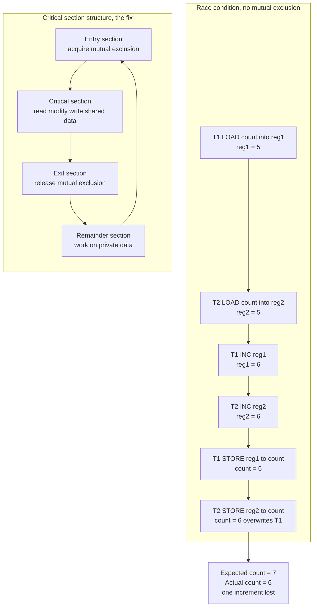

# 🔒 Process Synchronization and Race Conditions

> [!abstract] TL;DR
> When two or more threads/processes touch the same shared data concurrently, the result can depend on the *accidental timing* of who runs first — a **race condition**. The classic bug is the **lost update**: `count++` is not one instruction, it is *load → increment → store*, and if two threads interleave those steps they both start from the same value and one increment vanishes. The fix is a **critical section**: a stretch of code that must be executed by **at most one thread at a time**. A correct solution needs three properties — **mutual exclusion**, **progress**, and **bounded waiting**. Software algorithms (Peterson's, Dekker's) can achieve this in principle but are subtle and need memory barriers on real hardware; in practice we lean on **atomic hardware instructions** (test-and-set, compare-and-swap, fetch-and-add) and build **locks, semaphores, and monitors** on top of them.

---

## Intuition

**Analogy — the shared shopping list.** You and your flatmate share one paper shopping list on the fridge. The list says `eggs: 6`. You both glance at it at the same time, both read "we have 6, that's low," both cross it off, and both go buy a dozen. You come home to **12 eggs**. Nothing you each did was *wrong* in isolation — the bug is that the outcome depended on the *accidental timing* of two people acting on the same list at once. That is a **race condition**: correctness hinges on an interleaving you never intended and cannot control.

The fix is not "be more careful." The fix is a **rule**: only one person may touch the list at a time. Whoever picks it up first holds it, updates it, and puts it back before anyone else may read it. That rule is **mutual exclusion**, and the moment "touch the list" is exactly the **critical section**. Every synchronization primitive you will ever meet — a mutex, a semaphore, a database row lock, an atomic `compare-and-swap` — is a mechanism for enforcing that one rule on shared state.

---

## How It Works

### Why `count++` is dangerous

A single line of source code is *not* a single machine operation. `count++` compiles to roughly three steps:

```
LOAD   reg <- count      ; read shared variable into a private register
INC    reg <- reg + 1    ; modify the private copy
STORE  count <- reg      ; write the private copy back
```

This **read-modify-write** sequence is the atom of the whole problem. If a thread is preempted (or another core runs) between LOAD and STORE, a second thread can LOAD the *same stale value*, and the two STOREs then collide — one silently overwrites the other. The counter was incremented twice but advanced by one. This is the **lost update**, and the same shape appears everywhere: bank balances, reference counts, inventory quantities, sequence numbers. (The deeper reason the STORE may not even be *visible* to the other core promptly is memory reordering — see the sibling note **Memory_Consistency_and_Concurrent_Data_Structures** and [[Memory_Consistency_Models]].)

### The critical-section problem

A **critical section** is a region of code that accesses shared data and must not run in more than one thread simultaneously. Every thread's use of it has four structural parts:

1. **Entry section** — request permission to enter (acquire the lock / run the protocol).
2. **Critical section** — the actual read-modify-write of shared state.
3. **Exit section** — signal that you are done (release the lock).
4. **Remainder section** — everything else, which touches no shared data and may run freely.

A *correct* solution to the critical-section problem must satisfy three requirements:

| Requirement | Meaning | Failure mode if violated |
|---|---|---|
| **Mutual Exclusion** | At most one thread is inside the critical section at any time. | Data corruption / lost updates. |
| **Progress** | If no thread is in the CS, a thread that wants in must be able to enter; threads *not* competing cannot block those that are. | Deadlock / needless blocking. |
| **Bounded Waiting** | There is a finite bound on how many times others enter after you request entry, before you get in. | Starvation — a thread waits forever. |

### Interleaving and the fix



### Building blocks: software, hardware, and above

- **Software-only solutions.** Peterson's algorithm coordinates *two* threads using only shared loads and stores (a `flag[]` array plus a `turn` variable). Dekker's algorithm is the older two-process version; Lamport's Bakery algorithm generalizes to N. Naive attempts fail instructively: using only `turn` forces strict alternation and breaks **progress**; using only `flag[]` can **deadlock** when both set their flag at once. Crucially, all of these assume **sequentially consistent** memory — on real CPUs that reorder loads/stores, they are broken unless you insert **memory barriers** (see [[Memory_Barriers_and_Ordering]]).

- **Hardware support.** Because atomicity across LOAD…STORE cannot be built reliably from plain loads and stores on modern multicores, CPUs provide **atomic read-modify-write instructions**: **test-and-set**, **compare-and-swap (CAS)**, and **fetch-and-add**. These execute indivisibly with respect to other cores (enforced through the cache-coherence protocol — see [[Cache_Coherence_MESI]]), and they are the true foundation every lock is built on.

- **Disabling interrupts.** On a *single* CPU you can guarantee mutual exclusion by turning off interrupts around the critical section so no context switch can occur. It is crude, dangerous (a bug leaves interrupts off), and **fails on multiprocessors** — disabling interrupts on one core does nothing to stop another core from entering the same critical section. It survives only in tiny kernel paths.

- **Higher-level primitives.** Because raw atomics and software protocols are error-prone, we build **locks/mutexes, semaphores, and monitors/condition variables** on top of them, covered in the sibling note **Locks_Semaphores_and_Monitors**. These abstractions are what application and kernel code actually use.

---

## Key Concepts

### Secondary (intuition level)
- A **race condition** is when a program's answer depends on *who happens to run first*, not on the logic you wrote.
- Sharing data between two workers safely means enforcing **one-at-a-time** access to that data.
- The one-at-a-time region is the **critical section**; the "one-at-a-time" rule is **mutual exclusion**.

### Undergraduate (OS course level)
- `count++` decomposes into **load, increment, store**; interleaving these across threads causes **lost updates**.
- The **critical-section problem** and its three requirements: **mutual exclusion, progress, bounded waiting**.
- **Peterson's algorithm** for two processes (`flag[i] = true; turn = j; wait while flag[j] && turn == j`) and why turn-only or flag-only variants fail.
- **Atomic instructions**: `test_and_set(lock)`, `compare_and_swap(addr, expected, new)`, `fetch_and_add(addr, n)` — the primitives locks are made from.
- **Disabling interrupts** as a single-CPU-only technique.
- Coordinating threads themselves is a prerequisite — see the sibling **Threads_and_Concurrency_Models**.

### Graduate (systems / architecture level)
- Software mutual-exclusion algorithms assume **sequential consistency**; on **TSO/relaxed memory** ([[Memory_Consistency_Models]]) they require explicit **acquire/release fences** ([[Memory_Barriers_and_Ordering]]).
- Atomicity is realized by the **cache-coherence protocol** owning a line in the exclusive/modified state during the RMW ([[Cache_Coherence_MESI]]); this is why atomics scale poorly under contention.
- **ABA problem** with CAS, and the lock-free/wait-free hierarchy (Herlihy's consensus numbers) — CAS has consensus number ∞, test-and-set only 2.
- The connection to databases: **serializability** and **isolation levels** are the same mutual-exclusion problem at transaction granularity ([[Concurrency_Control]], [[Isolation_Levels]], [[Locking]]).
- **Non-determinism and Heisenbugs**: concurrency bugs surface only under specific schedules, making them non-reproducible; tooling (ThreadSanitizer, model checkers, deterministic replay) exists precisely because tests rarely hit the bad interleaving.

---

## Python Demo

The demo models the race at the **instruction-interleaving** level. Two "threads" each increment a shared counter `K` times, and every increment is the three micro-ops *load → inc → store* on a private register. We sample many **random interleavings** of those micro-ops and record the final counter value. Without mutual exclusion the answer is frequently **less than** the correct total `2K` (lost updates); enforcing an **atomic critical section** collapses the distribution to the single correct value.

```python
# Race condition on a shared counter, simulated at the micro-op level.
# numpy + matplotlib only. No real threads: we enumerate random interleavings.
import numpy as np
import matplotlib.pyplot as plt

rng = np.random.default_rng(42)

K = 50            # each of the two threads increments the counter K times
TRIALS = 8000     # number of random interleavings to sample per mode
CORRECT = 2 * K   # the only correct final value

def run_unsynced(rng, K):
    """Interleave at the LOAD/INC/STORE granularity -> races are possible.
    op cycle per increment: 0=LOAD, 1=INC, 2=STORE."""
    na = nb = 3 * K          # micro-ops remaining for thread A / thread B
    ia = ib = 0              # next op index within each thread's stream
    reg = [0, 0]             # PRIVATE register per thread
    count = 0                # SHARED variable
    while ia < na or ib < nb:
        # pick a thread that still has ops, uniformly at random (a valid merge)
        if ia < na and (ib >= nb or rng.random() < 0.5):
            t, i = 0, ia; ia += 1
        else:
            t, i = 1, ib; ib += 1
        op = i % 3
        if op == 0:          # LOAD: copy shared count into private register
            reg[t] = count
        elif op == 1:        # INC: modify the private copy only
            reg[t] += 1
        else:                # STORE: write private copy back to shared count
            count = reg[t]
    return count

def run_synced(rng, K):
    """Each increment is an ATOMIC critical section: L,I,S are indivisible.
    Interleaving happens only at increment boundaries -> always correct."""
    ca = cb = 0
    count = 0
    while ca < K or cb < K:
        if ca < K and (cb >= K or rng.random() < 0.5):
            count += 1; ca += 1     # atomic read-modify-write
        else:
            count += 1; cb += 1
    return count

res_unsync = np.array([run_unsynced(rng, K) for _ in range(TRIALS)])
res_sync   = np.array([run_synced(rng, K)   for _ in range(TRIALS)])

print(f"correct total              : {CORRECT}")
print(f"unsynced min/mean/max      : {res_unsync.min()}/{res_unsync.mean():.1f}/{res_unsync.max()}")
print(f"unsynced fraction correct  : {(res_unsync == CORRECT).mean():.3f}")
print(f"synced   range             : {res_sync.min()}..{res_sync.max()} (always correct)")

fig, ax = plt.subplots(1, 2, figsize=(12, 4.5), sharey=True)
bins = np.arange(res_unsync.min() - 0.5, CORRECT + 1.5, 1)

ax[0].hist(res_unsync, bins=bins, color="#DC2626", edgecolor="black")
ax[0].axvline(CORRECT, color="black", linestyle="--", linewidth=2, label=f"correct = {CORRECT}")
ax[0].set_title(f"No mutual exclusion\n{(res_unsync == CORRECT).mean() * 100:.1f}% of runs correct")
ax[0].set_xlabel("final counter value"); ax[0].set_ylabel("frequency"); ax[0].legend()

ax[1].hist(res_sync, bins=bins, color="#065F46", edgecolor="black")
ax[1].axvline(CORRECT, color="black", linestyle="--", linewidth=2, label=f"correct = {CORRECT}")
ax[1].set_title(f"Atomic critical section\n{(res_sync == CORRECT).mean() * 100:.1f}% of runs correct")
ax[1].set_xlabel("final counter value"); ax[1].legend()

fig.suptitle("Race condition on a shared counter: distribution of final values over random interleavings")
plt.tight_layout()
plt.show()
```

**What you see:** the left histogram is spread out and peaks *below* 100 — most interleavings lose one or more updates, and the exactly-correct outcome is rare. The right histogram is a single spike at 100. Same workload, same total increments; the only difference is whether the read-modify-write was allowed to interleave.

---

## Real-World Applications

- **OS kernels.** Every shared kernel structure — the run queue, page tables, reference counts on `struct file`/`inode`, the buffer cache — is protected by spinlocks, mutexes, or RCU. A missing lock is a kernel panic waiting for the wrong schedule.
- **Databases.** Concurrency control is this exact problem at transaction granularity: two-phase locking, MVCC, and isolation levels all exist to make interleaved transactions behave as if serial ([[Concurrency_Control]], [[Locking]], [[MVCC_Internals]], [[Isolation_Levels]], [[Transactions_and_ACID]]).
- **Concurrent data structures.** Lock-free queues, hash maps, and counters (`java.util.concurrent`, C++ `std::atomic`, Go's `sync/atomic`) are built directly on CAS and fetch-and-add.
- **Language runtimes.** Reference-counting GC (CPython, Swift ARC) uses atomic increments/decrements; a non-atomic refcount would leak or double-free under threads. This is one reason CPython historically kept the GIL.
- **Distributed systems.** The same "who wrote last / lost update" hazard reappears across machines, where the fix is distributed locks, leases, or consensus (Paxos/Raft) rather than a single-machine mutex.
- **Web backends.** Inventory decrement, "claim this coupon once," and rate-limiter counters all race under load; correct implementations use atomic DB updates or `SELECT ... FOR UPDATE` instead of read-then-write in application code.

---

## Common Pitfalls

- **Assuming a single statement is atomic.** `count++`, `x = x + 1`, and `list.append` in most languages are *not* atomic. The compiler and CPU decompose them; the interleaving corrupts them.
- **"It works on my machine / passed the tests."** Concurrency bugs are **Heisenbugs** — they appear only under rare schedules, on specific core counts, or under load. Passing tests proves nothing about the bad interleaving you never triggered. Use stress tests, ThreadSanitizer, and model checkers.
- **Rolling your own lock with plain variables.** Naive `flag`/`turn` schemes look correct but violate progress, or break entirely on relaxed-memory hardware without barriers. Use vetted primitives.
- **Forgetting memory ordering.** Even a correct algorithm on paper can fail because a store isn't visible to another core yet. Atomics with the right acquire/release semantics, or explicit fences, are required ([[Memory_Barriers_and_Ordering]]).
- **Holding the lock too long or too short.** Too long → contention and lost parallelism; too short (or protecting only part of the RMW) → the race is still there. The critical section must cover the *entire* read-modify-write, not just the write.
- **Lock ordering leading to deadlock.** The cure for races (locks) introduces a new failure — acquiring multiple locks in inconsistent orders deadlocks (see the sibling **Deadlocks_Detection_and_Avoidance** and [[Deadlocks]]).
- **Ignoring starvation.** A solution can be mutually exclusive yet let one thread hog the CS forever; bounded waiting is a real requirement, not a nicety.

---

## Related Concepts

- [[Memory_Consistency_Models]] — why a STORE by one core may not be visible to another; software mutex algorithms assume the strong (sequential-consistency) model this note relaxes.
- [[Memory_Barriers_and_Ordering]] — the fences that make Peterson's/lock code correct on real reordering hardware.
- [[Cache_Coherence_MESI]] — the protocol that makes atomic read-modify-write instructions actually atomic across cores.
- [[Multi_Core_Programming]] — the hardware setting (multiple cores sharing memory) that makes synchronization unavoidable.
- [[Concurrency_Control]] — the database-layer version of this exact problem: pessimistic vs optimistic control over interleaved transactions.
- [[Locking]] — how relational engines apply mutual exclusion at row/table granularity.
- [[MVCC_Internals]] — a way to avoid reader-writer races by giving readers timestamped snapshots.
- [[Isolation_Levels]] — the standardized "how much interleaving is allowed" dial; lost update and dirty read are the anomalies this note's bug generalizes to.
- [[Transactions_and_ACID]] — the "I" (Isolation) is the database name for controlled interleaving.
- [[Deadlocks]] — the failure that locks (the cure for races) can introduce.

*Planned sibling notes in this Operating_Systems vault (not yet written): Threads_and_Concurrency_Models, Locks_Semaphores_and_Monitors, Classic_Synchronization_Problems, Deadlocks_Detection_and_Avoidance, Memory_Consistency_and_Concurrent_Data_Structures.*

---

## Review Questions

1. **(Secondary)** Using the shared-shopping-list analogy, explain what a race condition is and why "just be more careful" is not a valid fix. What single rule actually solves it?
2. **(Undergraduate)** Show precisely how two threads running `count++` on a shared variable initialized to 5 can end with `count == 6` instead of `7`. Then state the three requirements any correct critical-section solution must satisfy, and give an example interleaving where a **turn-only** two-thread protocol violates the **progress** requirement.
3. **(Graduate)** You are told a lock is implemented with a correct-looking software algorithm (e.g., Peterson's) and it still fails intermittently on an ARM multiprocessor. Diagnose the likely cause in terms of the memory model, explain what a hardware `compare-and-swap` gives you that plain loads/stores cannot, and describe where acquire/release barriers must go to fix it.

---

## Sources

- Silberschatz, Galvin, Gagne — *Operating System Concepts*, 10th ed., Ch. 6 "Synchronization Tools" and Ch. 7 "Synchronization Examples". Wiley.
- Arpaci-Dusseau & Arpaci-Dusseau — *Operating Systems: Three Easy Pieces (OSTEP)*, "Concurrency" chapters (Threads, Locks, Locked Data Structures). [pages.cs.wisc.edu/~remzi/OSTEP](https://pages.cs.wisc.edu/~remzi/OSTEP/)
- Tanenbaum & Bos — *Modern Operating Systems*, 4th ed., §2.3 "Interprocess Communication" (race conditions, critical regions, mutual exclusion). Pearson.
- Peterson, G. L. (1981). "Myths About the Mutual Exclusion Problem." *Information Processing Letters*, 12(3), 115–116.
- Herlihy & Shavit — *The Art of Multiprocessor Programming*, 2nd ed. (mutual exclusion, atomic primitives, consensus). Morgan Kaufmann.

---

#operating-systems #synchronization #race-conditions #critical-section #mutual-exclusion
