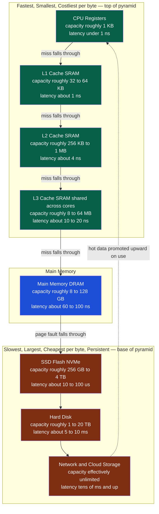

# 🗄️ Memory Hierarchy and Caching

> [!abstract] TL;DR
> A computer cannot have memory that is simultaneously huge, fast, and cheap — those goals conflict physically and economically — so instead it stacks many storage technologies into a **hierarchy**: registers, L1/L2/L3 caches, DRAM, SSD, disk, and network storage, each roughly an order of magnitude bigger, slower, and cheaper per byte than the one above it. The hierarchy delivers *near-top speed at near-bottom capacity* only because real programs exhibit **locality of reference** and because every level applies the same trick — **caching**: keep a small fast copy of the hot data close, serve most requests from it (a *hit*), and only occasionally pay the full cost of fetching from the slower level below (a *miss*). This one idea — cache + locality + eviction — recurs identically in CPU caches, the TLB, the OS page cache, database buffer pools, CDNs, and browser caches.

---

## Intuition

**Analogy:** Think about your own workspace when you are deep in a task. There is the **pen in your hand** — instantly available, but it holds essentially nothing (that is a CPU **register**). There are the **few papers spread on your desk** — one glance away, room for maybe a dozen sheets (that is the **CPU cache**). There is the **drawer beside you** — a second to open, holds a few hundred pages (that is **RAM**). And there is the **archive in the basement** — vast, holds everything you have ever filed, but fetching a folder means a walk downstairs that costs a thousand times longer (that is the **disk**).

You never even consider putting the whole archive on your desk; it would not fit and you do not need it. Instead you keep on the desk exactly the handful of pages you are working with *right now*, because those are the ones you keep reaching for (you just used them — **temporal locality**) and the ones physically next to them in the same folder (you will probably need them next — **spatial locality**). When you finish with a page and reach for a new folder, you swap something off the desk to make room. The entire arrangement works not despite the desk being tiny but *because* your work naturally concentrates on a small, shifting set of pages at any moment.

In technical terms: the hardware and OS arrange storage into tiers that trade capacity for speed, and they automatically keep the recently- and nearby-used data in the fast tiers. The magic is not any single tier — it is that programs touch a small **working set** at a time, so a small fast cache captures the overwhelming majority of accesses. This is the **same principle** whether the "desk" is an L1 cache holding DRAM lines, RAM holding disk blocks (that is what **Virtual_Memory_and_Demand_Paging** does — RAM *caches* the disk), or a CDN edge node holding origin objects.

---

## How It Works

### Why a hierarchy exists at all

Storage technologies sit on a hard trade-off curve. SRAM (used for caches) is blisteringly fast but needs six transistors per bit, so it is expensive and physically large per byte — you can only afford a little. DRAM (main memory) packs one transistor and one capacitor per bit, so it is far denser and cheaper but must be refreshed and is roughly two orders of magnitude slower to reach than SRAM (see [[DRAM_Architecture]]). Flash and spinning disk are cheaper still per byte but slower again by orders of magnitude. No single technology wins on all axes, so the machine uses **all of them at once**, arranged so the fast-and-small sits closest to the CPU and the slow-and-huge sits farthest.

### The memory wall

The reason the hierarchy has grown so deep is the **memory wall**: for decades CPU speed improved far faster than DRAM latency. A modern core can execute a few instructions per nanosecond, but a DRAM access still costs roughly 60 to 100 ns — so a single cache miss to main memory can stall the core for the equivalent of *hundreds* of instructions it could otherwise have retired. Multi-level caches exist precisely to hide this growing gap. The same widening gap between RAM and persistent storage is what makes the OS page cache and read-ahead so important (see **Modern_File_Systems_and_Storage**).

### Locality of reference — why caching works

Caching would be useless if accesses were uniformly random, because a small cache would almost never hold what you ask for next. It works because real programs are overwhelmingly *non-random*:

- **Temporal locality:** if you accessed a location, you are likely to access it *again soon*. Loop counters, hot functions, a frequently-read config object, the top of a stack — all reused repeatedly. Caches exploit this by *keeping* recently-used data.
- **Spatial locality:** if you accessed a location, you are likely to access a *nearby* one soon. Sequential array scans, instruction streams, and struct-field access all touch contiguous addresses. Caches exploit this by fetching a whole **cache line** (typically 64 bytes) on every miss, not just the requested byte — so the next few nearby accesses are already present.

### Caching fundamentals: hit, miss, and effective access time

When the CPU (or OS) needs data, it checks the fast level first. If present, that is a **hit**, served at the fast level's speed. If absent, that is a **miss**: the system fetches the containing block from the slower level below (paying the **miss penalty**), installs it in the fast level, and serves the request. The fraction of accesses that hit is the **hit ratio** `h`.

The payoff is captured by **Effective (or Average) Access Time**, which is *recursive* because each level's miss penalty is the access time of the next level down:

```
EAT = hit_time + miss_rate × miss_penalty
    where miss_penalty is itself the EAT of the next level
```

Because the bottom levels are thousands to millions of times slower, even a *small* miss rate dominates the average — which is exactly why pushing the hit ratio from 95 to 99 percent can matter enormously.

### The three C's of misses

Every cache miss is one of three kinds — a vocabulary that also transfers to page caches and buffer pools:

- **Compulsory (cold)** — the first-ever reference to a block; nothing could have prevented it. Mitigated by prefetching.
- **Capacity** — the working set is larger than the cache, so useful blocks get evicted and later re-fetched. Mitigated by making the working set smaller (blocking/tiling) or the cache bigger.
- **Conflict** — blocks that *would* fit collide onto the same cache slot because of limited associativity. Mitigated by higher associativity.

### CPU cache specifics

A cache stores fixed-size **lines/blocks**. Placement policy decides where a given address may live:

- **Direct-mapped** — each address maps to exactly one slot: fast lookup, but many conflict misses.
- **Set-associative** — each address maps to a *set* of N slots (ways); a good middle ground used by nearly all real L1/L2/L3.
- **Fully-associative** — a block may live anywhere: no conflict misses, but expensive to search (used for small structures like TLBs).

On a write, **write-through** pushes every write to the next level immediately (simple, more traffic), while **write-back** updates only the cache line and marks it with a **dirty bit**, flushing to memory only on eviction (less traffic, but the memory copy is temporarily stale). Because multiple cores each have private caches, a shared line can exist in several places at once; the **cache coherence** protocol (commonly **MESI** — see [[Cache_Coherence_MESI]]) keeps them consistent so a write on one core is eventually seen correctly by others. Coherence and the ordering rules layered on top of it are the hardware foundation beneath the concurrency issues in [[Threads_and_Concurrency_Models]] and the reordering rules in [[Memory_Consistency_Models]] (the OS-side treatment lives in the sibling note **Memory_Consistency_and_Concurrent_Data_Structures**).

### How the OS interacts with the hierarchy

The OS runs its *own* caches over the slow levels, using the same principle:

- **Page cache / buffer cache** — recently-read disk blocks are kept in free RAM so re-reads never touch storage; this is often the single largest consumer of "used" memory on a healthy Linux box.
- **TLB** — a small fully-associative cache of recent virtual-to-physical **address translations**, so the MMU rarely has to walk the page table (see [[Virtual_Memory_and_TLB]] and the sibling note **Segmentation_and_the_TLB**). It is a cache of the page table exactly as an L1 is a cache of DRAM.
- **Prefetching / read-ahead** — on detecting sequential access the OS speculatively pulls the next blocks into the page cache, converting future compulsory misses into hits (exploiting spatial locality).
- **Write-back buffering** — writes are batched in the page cache and flushed later, coalescing and reordering them for the device (see the sibling note **IO_Systems_and_Device_Drivers**).

Which block to evict when the cache is full is the **replacement policy** — the OS-level version of that decision is exactly the sibling note **Page_Replacement_Algorithms**, and the distributed-systems version is [[Cache_Eviction_Policies]].

### The hierarchy as a pyramid



Reading top to bottom, each step is roughly **10x larger and 10x slower** and costs roughly 10x less per byte. A request enters at the top; on a miss it "falls through" to the next level, and the fetched block is **promoted upward** so the next access to it (temporal locality) is fast.

---

## Key Concepts

### Secondary (intuitive level)

- Fast memory is small and expensive; big memory is slow and cheap — you cannot have all three at once, so the computer keeps several kinds and uses them together.
- Keep the stuff you are using *right now* in the fastest, closest place. That is caching.
- A **hit** means the data was already close (fast). A **miss** means you had to go fetch it from farther away (slow).

### Undergraduate (mechanism level)

- **Locality of reference** — temporal (reuse recent) and spatial (use nearby) — is *why* small caches capture most accesses.
- **Cache line** — data moves between levels in fixed blocks (typically 64 bytes), so one miss brings in several neighbors for free.
- **Effective Access Time** is recursive: `EAT = hit_time + miss_rate × next_level_EAT`; small miss rates still dominate because lower levels are orders of magnitude slower.
- **Three C's of misses** — compulsory, capacity, conflict — each with a distinct cure.
- **Placement**: direct-mapped vs set-associative vs fully-associative, trading lookup cost against conflict misses.
- **Write policy**: write-through vs write-back plus the **dirty bit**.
- OS caches over storage: the **page/buffer cache**, the **TLB** as a cache of translations, and **read-ahead** prefetching.

### Graduate (systems level)

- **Cache coherence** (MESI and variants) and how it underpins the memory-consistency and false-sharing problems of concurrent code.
- **False sharing** — two threads writing distinct variables that happen to share one cache line ping-pong the line between cores, silently destroying scalability; fixed by padding/alignment to a line boundary.
- **Cache-conscious data layout** — struct-of-arrays vs array-of-structs, and **blocking/tiling** to keep a computation's working set inside a cache level.
- **Cache-oblivious algorithms** — recursive divide-and-conquer (for example recursive matrix multiply) that achieve good locality at *every* level of an unknown hierarchy without tuning to specific cache sizes.
- **NUMA** — on multi-socket machines "main memory" is itself tiered by which socket owns it, adding another latency level (see [[NUMA_and_Memory_Bandwidth]]).
- **Arithmetic intensity and the roofline model** — whether a kernel is memory-bandwidth-bound or compute-bound is decided by its ratio of arithmetic operations to bytes moved; the roofline plot makes the ceiling visible (the OS/tuning treatment lives in the sibling note **Performance_Analysis_and_OS_Tuning**).
- The **memory wall** and why prefetchers, deeper caches, and bandwidth-oriented design keep growing in importance.

---

## Python Demo

Two experiments, `numpy`/`matplotlib` only. **First**, model the *effective access time* of a three-level hierarchy as a function of the cache hit ratio, and show that a program with good locality (high hit ratio) runs orders of magnitude faster than one with poor locality. **Second**, model the classic cache effect of traversal order: walking an N×N matrix **row-major** (stride-1, cache-friendly) touches every element of a fetched cache line before moving on, while **column-major** (stride-N) jumps to a fresh cache line on every access — so the modeled miss count and access cost diverge sharply.

```python
# Memory hierarchy: locality determines effective access time,
# and traversal order determines cache-miss count for identical work.
import numpy as np
import matplotlib.pyplot as plt

# ----- Experiment 1: effective access time across a 3-level hierarchy -----
t_l1   = 1.0            # ns : L1 cache hit time
t_ram  = 100.0          # ns : DRAM access (the miss penalty at L1)
t_disk = 10_000_000.0   # ns : disk access = 10 ms (the miss penalty at RAM)

# Sweep the L1 hit ratio -- this is the "locality knob".
h1 = np.linspace(0.50, 0.999, 400)
h2 = 0.999              # fraction of L1 misses that RAM can serve (rest hit disk)

# Recursive EAT: on an L1 miss pay RAM; on a RAM miss pay disk.
eat = h1 * t_l1 + (1.0 - h1) * (h2 * t_ram + (1.0 - h2) * t_disk)

def eat_of(l1_hit, ram_hit):
    return l1_hit * t_l1 + (1.0 - l1_hit) * (ram_hit * t_ram + (1.0 - ram_hit) * t_disk)

good = eat_of(0.98, 0.9999)   # good locality: hot working set stays in cache and RAM
bad  = eat_of(0.50, 0.99)     # poor locality: constant cache thrash, occasional disk
print(f"Good-locality effective access time: {good:10.2f} ns")
print(f"Poor-locality effective access time: {bad:10.2f} ns")
print(f"Speedup from locality alone:          {bad / good:9.1f}x")

# ----- Experiment 2: row-major vs column-major traversal of an N x N matrix -----
B = 8                        # elements per 64-byte cache line (8 doubles)
N = np.arange(64, 2049, 64)  # matrix dimensions to sweep
total = (N * N).astype(float)

# Row-major storage walked in row order = stride 1: one miss per B elements.
row_misses = total / B
# Same storage walked in column order = stride N: every access lands on a fresh
# line and the column's worth of lines exceeds the cache, so essentially all miss.
col_misses = total.copy()

t_hit, t_miss = 1.0, 100.0   # ns
row_cost = (total - row_misses) * t_hit + row_misses * t_miss
col_cost = (total - col_misses) * t_hit + col_misses * t_miss
print(f"At N=2048, modeled column/row cost ratio: {col_cost[-1] / row_cost[-1]:.1f}x")

# ----- Plot both effects side by side -----
fig, ax = plt.subplots(1, 2, figsize=(12, 4.6))

ax[0].semilogy(h1 * 100.0, eat, color="#1D4ED8")
ax[0].set_xlabel("L1 hit ratio (percent) -- higher = better locality")
ax[0].set_ylabel("Effective access time in ns (log scale)")
ax[0].set_title("Hierarchy: locality buys orders of magnitude")
ax[0].grid(True, which="both", ls=":")

ax[1].plot(N, row_cost, label="Row-major walk (stride 1)", color="#065F46")
ax[1].plot(N, col_cost, label="Column-major walk (stride N)", color="#7C2D12")
ax[1].set_xlabel("Matrix dimension N")
ax[1].set_ylabel("Modeled access cost (ns)")
ax[1].set_title("Identical work, layout-aware vs layout-hostile traversal")
ax[1].legend()
ax[1].grid(True, ls=":")

plt.tight_layout()
plt.savefig("memory_hierarchy.png", dpi=120)
print("Saved memory_hierarchy.png")
```

Expected takeaways when you run it: the left panel drops several orders of magnitude as the hit ratio climbs (poor locality is often **hundreds of times** slower for the *same* instruction stream), and the right panel shows the column-major cost roughly `B`-fold higher than row-major — matching the real-world result that swapping two loop indices can speed up a matrix routine by 5 to 10x with zero algorithmic change.

---

## Real-World Applications

- **CPU caches (L1/L2/L3)** — the canonical hardware hierarchy; every load first probes L1. See the deep dive in [[Cache_Hierarchy]].
- **Virtual memory** — the OS treats **RAM as a cache of the disk**: pages are demand-loaded on a page fault and evicted under pressure, a hierarchy level managed entirely in software (the sibling note **Virtual_Memory_and_Demand_Paging**).
- **TLB** — caches page-table translations so address resolution is a single cycle on a hit (see [[Virtual_Memory_and_TLB]]).
- **OS page cache** — Linux keeps recently-read files in RAM; the second `grep` of a file is instant because it never touches storage.
- **Database buffer pool** — PostgreSQL's `shared_buffers` and InnoDB's buffer pool cache hot disk pages in RAM with LRU-style eviction; tuning them is core DBA work (see [[Storage_Engine_Internals]] and [[Performance_Tuning]]).
- **Distributed and web caching** — Redis/Memcached as an application cache in front of a database ([[Caching]], [[Cache_Aside]], [[Redis]], [[Redis_vs_Memcached]]), and CDNs caching origin objects at the network edge ([[CDN_Caching]]) — the exact same hit/miss/eviction machinery scaled out.
- **Memoization and browser caches** — a function memo table and an HTTP cache are caching + locality + eviction with different labels.

---

## Common Pitfalls

- **Treating multi-dimensional arrays as if layout were free** — iterating a C/NumPy (row-major) 2D array in column order turns every access into a miss; the loop-nest order, not the algorithm, dominates runtime.
- **False sharing** — padding two hot per-thread counters into the same 64-byte line makes cores fight over that line; scalability collapses even though the variables are logically independent. Align/pad to a cache line.
- **Optimizing hit *time* while ignoring hit *ratio*** — a slightly faster cache that misses more often loses; because the miss penalty is huge, the recursive EAT is dominated by miss rate, not hit time.
- **Assuming a cache "warms up" instantly** — cold/compulsory misses mean the first pass is always slow; benchmarks that skip warm-up or, conversely, forget to reset caches report misleading numbers.
- **Ignoring the working set** — a data structure that just barely exceeds a cache level falls off a performance cliff (capacity misses); shrinking it or blocking the computation to fit is often a bigger win than a smarter algorithm.
- **Confusing coherence with consistency** — coherence (MESI) guarantees a single value per location *eventually*; it does **not** by itself guarantee the *ordering* of accesses across locations, which is why concurrent code still needs memory barriers ([[Memory_Consistency_Models]]).
- **Over-caching / stale caches** — the two hard problems: cache invalidation (serving stale data) and eviction choice; every added cache layer is another place data can go stale (see [[Cache_Eviction_Policies]]).

---

## Related Concepts

- [[Cache_Hierarchy]] — the hardware-architecture deep dive into cache lines, associativity, and the AMAT formula summarized here.
- [[DRAM_Architecture]] — why main memory is roughly 100x slower than SRAM, the gap the hierarchy exists to hide.
- [[Virtual_Memory_and_TLB]] — the TLB as a cache of translations, and RAM-as-a-cache-of-disk; complements the OS sibling on demand paging.
- [[Cache_Coherence_MESI]] — how private per-core caches are kept consistent, the hardware basis of false sharing.
- [[Memory_Consistency_Models]] — the ordering rules layered above coherence that concurrent code must respect.
- [[NUMA_and_Memory_Bandwidth]] — how "main memory" itself becomes a latency tier on multi-socket systems.
- [[Threads_and_Concurrency_Models]] — where cache coherence and false sharing surface as concurrency performance bugs.
- [[Caching]] — the same principle at the distributed-systems layer (application/database/CDN caching).
- [[Cache_Aside]] — the most common application caching pattern, an explicit software hit/miss/fill loop.
- [[Cache_Eviction_Policies]] — LRU, LFU, and friends; the replacement decision every cache must make.
- [[CDN_Caching]] — caching + locality pushed out to the network edge.
- [[Redis]] / [[Redis_vs_Memcached]] — the canonical in-memory caching engines.
- [[Storage_Engine_Internals]] / [[Performance_Tuning]] — the database buffer pool as a page cache over disk.
- [[Big_O_Notation]] — reminds us that constant factors from cache behavior can swamp asymptotic differences at practical sizes.
- [[Static_vs_Dynamic_Arrays]] — contiguous arrays are cache-friendly precisely because of spatial locality.

> Sibling Operating_Systems notes that extend this topic but are not yet written: **Memory_Management_and_Allocation**, **Virtual_Memory_and_Demand_Paging**, **Segmentation_and_the_TLB**, **Page_Replacement_Algorithms**, **Memory_Consistency_and_Concurrent_Data_Structures**, **IO_Systems_and_Device_Drivers**, **Modern_File_Systems_and_Storage**, and **Performance_Analysis_and_OS_Tuning**.

---

## Review Questions

1. **(Secondary)** Explain, using the desk-and-archive analogy, why a computer keeps several kinds of memory instead of just one large fast memory. What real component plays the role of the "desk," and what plays the role of the "basement archive"?
2. **(Undergraduate)** A cache has a 2 ns hit time and a 100 ns miss penalty. Compute the effective access time at a 90 percent hit ratio and at a 99 percent hit ratio. Why does that seemingly small change in hit ratio matter so much, and which of the three C's would you attack first if the misses came from a working set slightly larger than the cache?
3. **(Undergraduate/Graduate)** You are given a routine that sums an N×N matrix and it runs surprisingly slowly. The inner loop indexes `A[i][j]` with `i` as the inner variable. What is happening at the cache-line level, what one-line change fixes it, and roughly what speedup would you expect and why?
4. **(Graduate)** Two threads each increment a private counter in a hot loop, yet adding the second thread makes the program *slower*. Diagnose the likely cause in terms of the cache-coherence protocol, explain why the counters being "independent" does not save you, and give a concrete fix.
5. **(Graduate)** Argue that virtual memory, the OS page cache, a database buffer pool, and a CDN are all instances of the *same* mechanism. Identify, for each, what plays the role of "fast cache," "slow backing store," and "eviction policy," and state one way they differ.

---

## Sources

- Bryant, R. & O'Hallaron, D. *Computer Systems: A Programmer's Perspective* (3rd ed.), Chapter 6 "The Memory Hierarchy." Pearson, 2015.
- Hennessy, J. & Patterson, D. *Computer Architecture: A Quantitative Approach* (6th ed.), Chapter 2 & Appendix B "Review of Memory Hierarchy." Morgan Kaufmann, 2017.
- Silberschatz, A., Galvin, P. & Gagne, G. *Operating System Concepts* (10th ed.), Chapters 9–10 "Main Memory" and "Virtual Memory." Wiley, 2018.
- Drepper, U. "What Every Programmer Should Know About Memory." Red Hat / LWN, 2007. <https://www.akkadia.org/drepper/cpumemory.pdf>
- Frigo, M., Leiserson, C., Prokop, H. & Ramachandran, S. "Cache-Oblivious Algorithms." *FOCS*, 1999.

---

#operating-systems #memory-hierarchy #caching #locality #cache-performance
