# 🧠 Memory Management and Allocation

> [!abstract] TL;DR
> Physical RAM is a single, finite array of bytes, yet dozens of programs each need memory *right now* and must not read or clobber each other. The OS solves this by handing every process the **illusion of its own private address space** starting at 0, translating those **logical addresses** to **physical addresses** at run time through hardware (the MMU / base-and-limit registers), and deciding *where* in real memory each request lands. The earliest scheme — **contiguous allocation** with first-fit / best-fit / worst-fit — is simple but bleeds **external fragmentation**: free memory scattered into holes too small to use. That failure is exactly what motivated **paging** and modern **virtual memory**.

---

## Intuition

**Analogy:** Physical RAM is a **parking lot**, and the OS is the **attendant**. Cars (processes) of wildly different sizes arrive and leave all day. If the attendant gives each car one contiguous slot, a problem appears: after a busy morning of arrivals and departures, the lot is dotted with **gaps between parked cars** — plenty of total empty asphalt, but no single gap wide enough for the bus that just pulled up. The lot is not *full*, yet the bus is turned away. That wasted, scattered emptiness is **external fragmentation**. If instead the attendant paints **fixed-size stalls** and forces a compact car into a full-size stall, the leftover strip inside the stall is wasted too — that is **internal fragmentation**. The attendant's whole job is choosing *where* each car parks, reclaiming spots when cars leave, and occasionally re-shuffling the lot (**compaction**) so a big vehicle can fit.

Translated to the machine: the "cars" are processes requesting memory, the "asphalt" is physical DRAM, and the "attendant deciding where to park and reclaiming spots" is the OS memory manager plus the hardware that enforces the rules. The deepest trick is that each driver *thinks the lot starts at their own space #0* — they never see the real, shared coordinates. That per-process illusion is the **address space abstraction**.

---

## How It Works

The OS takes the flat physical memory managed at the hardware level (see [[DRAM_Architecture]]) and multiplexes it in *space* the way the scheduler multiplexes the CPU in *time* (see [[Operating_Systems_Overview]]). Two machineries make this work: **address translation** (turning a program's private addresses into real ones, with protection) and **allocation** (choosing which region of physical memory backs each request).

### The Address Space Abstraction

Every process is compiled and linked as if it owns the whole machine: its code, globals, heap, and stack all live in one clean **logical (virtual) address space** that conventionally starts at 0. The process never learns — and must never depend on — where it *actually* sits in physical RAM. The OS plus hardware manufacture this illusion so that (a) programmers write position-independent, relocatable code, and (b) one process physically cannot name, let alone touch, another's memory. Isolation is a *side effect of the translation itself*: if you can only speak logical addresses, and the hardware maps yours only to your slice, you are boxed in by construction. The full realization of this idea — per-page mapping and paging to disk — belongs to the forthcoming sibling notes *Paging and Page Tables* and *Virtual Memory and Demand Paging*; the hardware that caches these translations is covered in [[Virtual_Memory_and_TLB]].

### Address Binding: Compile-, Load-, and Execution-Time

A program's symbolic names (a variable `x`, a function `foo`) must eventually become concrete physical addresses. *When* that binding happens defines the flexibility of the system:

1. **Compile-time binding.** If you know at compile time where the program will live in memory, the compiler emits absolute physical addresses. Fast, but the program is nailed to one location — move it and it breaks. Used in tiny embedded / MS-DOS `.COM`-style systems.
2. **Load-time binding.** The compiler emits *relocatable* code (addresses relative to a base). The loader fixes them up to real addresses when the program is loaded. Relocation happens once, at load; the program still can't move after that without reloading.
3. **Execution-time (run-time) binding.** Binding is deferred until each memory reference *executes*, done by hardware on every access. This is what lets the OS move a process in memory while it runs and is the scheme every modern OS uses. It requires the **Memory-Management Unit (MMU)**.

### The MMU, Base-and-Limit Registers, and Protection

Under run-time binding, the CPU emits a **logical address**; the MMU turns it into a **physical address** before it ever reaches the memory bus. The simplest MMU scheme uses two registers per process:

- **Base (relocation) register** — the physical start of the process's block. The MMU computes `physical = base + logical`, so the process's private "address 0" transparently maps to wherever the OS actually placed it.
- **Limit register** — the size of the block. Before adding the base, the MMU checks `logical < limit`. If a process fabricates an address past its own limit, the hardware raises a **protection trap** into the kernel instead of letting the access through.

This single comparison is the root of memory **protection**: a process cannot forge an address into the kernel or a neighbor, because every address it emits is bounds-checked and offset by *its own* base — values only the kernel (in privileged mode) may load. The general subject of who-may-touch-what is developed in the forthcoming *Protection and Access Control* and *OS Security and Isolation* sibling notes.

### Contiguous Allocation and the Fit Strategies

The oldest layout gives each process **one contiguous block** of physical memory. Two flavors:

- **Fixed partitions** — memory is pre-divided into a set number of fixed-size regions. Dead simple, but a process smaller than its partition wastes the remainder: **internal fragmentation**.
- **Variable partitions** — the OS carves a block of exactly the requested size from a pool of free **holes**, coalescing adjacent holes on free. No internal waste, but now the OS must *choose which hole* to carve, and holes accumulate: **external fragmentation**.

The choice of hole is the classic **placement problem**:

| Strategy | Rule | Character |
|---|---|---|
| **First-fit** | Take the first hole big enough, scanning from the start. | Fastest; tends to fragment the low end of memory. |
| **Next-fit** | Like first-fit but resume scanning from where the last allocation landed. | Spreads allocations out; avoids re-scanning the crowded start. |
| **Best-fit** | Take the *smallest* hole that fits. | Minimizes leftover *per allocation* but leaves a spray of **tiny unusable slivers**; slow (full scan). |
| **Worst-fit** | Take the *largest* hole. | Keeps leftovers large enough to reuse — the intuition — but empirically the poorest; consumes big holes fast. |

Counterintuitively, **best-fit** and **first-fit** both beat worst-fit in practice, and first-fit is usually preferred because it is fast and roughly ties best-fit on utilization while avoiding the sliver storm.

### Fragmentation, Compaction, and Swapping

- **External fragmentation** — total free memory is sufficient, but it is broken into holes none of which is individually large enough (the bus turned away from a lot with plenty of scattered gaps). The classic **50-percent rule**: with first-fit, for every 2N allocated blocks about N are lost to fragmentation, so roughly one-third of memory can be unusable.
- **Internal fragmentation** — memory handed out is slightly larger than requested (rounding up to a partition or allocator granularity), so the unused tail *inside* the block is wasted.
- **Compaction** — periodically slide live blocks together to merge the scattered holes into one big free region. It reclaims fragmentation but is expensive (copy everything) and only possible under run-time binding, because moving a process changes its base register, not its logical addresses.
- **Swapping** — when memory is overcommitted, the OS evicts an entire process's memory image to disk (the swap area) and brings it back later, freeing physical RAM for others. Whole-process swapping is the coarse ancestor of the fine-grained, per-page **demand paging** covered in the forthcoming *Virtual Memory and Demand Paging* note.

Fragmentation and the cost of compaction are precisely why the field moved to **paging**: chop both logical and physical memory into fixed-size **pages/frames** so *any* free frame can back *any* logical page. That eliminates external fragmentation entirely (at the price of a little internal fragmentation in the last page and a page table per process).

### Flow / Architecture

```mermaid
flowchart LR
    subgraph TRANS["Address Binding and Translation at Run Time"]
        CPU["CPU emits<br/>logical address<br/>starts at 0"]
        MMU["MMU relocation<br/>add base register<br/>then compare to limit"]
        PHYS["Physical address<br/>into real RAM"]
        TRAP["Protection trap<br/>address beyond limit<br/>into the kernel"]
        CPU --> MMU
        MMU -->|"within limit"| PHYS
        MMU -->|"exceeds limit"| TRAP
    end
    subgraph RAM["Physical Memory as Variable Partitions"]
        OS["OS kernel<br/>reserved low memory"]
        P1["Process A<br/>contiguous block"]
        H1["Free hole"]
        P2["Process B<br/>contiguous block"]
        H2["Free hole<br/>too small to reuse<br/>external fragmentation"]
        P3["Process C<br/>contiguous block"]
        OS --- P1 --- H1 --- P2 --- H2 --- P3
    end
    PHYS --> RAM
```



---

## Key Concepts

### Secondary (intuition level)
- **Why memory needs managing:** one pool of RAM, many programs; the OS decides who gets which bytes and takes them back when a program exits.
- **Private address space:** every program acts as if it starts at address 0 and owns all memory; the OS keeps that a safe illusion so programs can't see each other.
- **Fragmentation in a word:** memory can be "full of empty" — lots of free space, but chopped into pieces too small to use.

### Undergraduate (mechanism level)
- **Logical vs physical addresses:** the address the program uses vs the address on the memory bus; the **MMU** translates between them at run time.
- **Base-and-limit registers:** `physical = base + logical`, guarded by `logical < limit`; the hardware primitive for both **relocation** and **protection**.
- **Address binding times:** compile-time (absolute, rigid) → load-time (relocatable, fixed at load) → **execution-time** (hardware, movable — the modern default).
- **Fit strategies:** first-fit, next-fit, best-fit, worst-fit — the placement policy for variable partitions and their fragmentation/speed trade-offs.
- **Process memory layout:** **text** (code) and **data** at the bottom, the **heap growing up**, the **stack growing down**, with a gap between — the classic single-address-space picture inherited by every process (the process model itself is the subject of the forthcoming *Processes and the Process Model* note).

### Graduate (design and tension level)
- **Dynamic allocator internals:** `malloc`/`free` maintain **free lists** with **coalescing** of adjacent free blocks and **splitting** of large ones; boundary tags let `free` find neighbors in O(1). Segregated / binned free lists (as in glibc's ptmalloc, jemalloc, tcmalloc) bucket by size class to bound search time and fragmentation.
- **Buddy system:** memory is split into power-of-two blocks; a request rounds up to the nearest power of two, and freed blocks merge with their "buddy" if it is also free — fast coalescing, at the cost of internal fragmentation up to nearly 2×. The Linux page allocator is a buddy allocator.
- **Slab allocation:** kernels allocate huge numbers of same-type objects (inodes, `task_struct`); a **slab** allocator caches pre-constructed fixed-size objects to make allocation O(1) and eliminate fragmentation *for that size class* (Linux SLUB/SLAB).
- **Why paging supersedes contiguous allocation:** fixed-size frames make external fragmentation impossible and enable per-page protection, sharing, copy-on-write, and demand paging — the foundation of virtual memory. Contiguous allocation survives only where translation hardware is absent or where huge, physically contiguous regions are required (DMA buffers, hugepages).
- **Fragmentation as an emergent property:** it is a function of the *request size distribution and lifetime pattern*, not just the policy; long-running allocators (databases, browsers) fight it with arenas, compaction, and generational strategies.

---

## Python Demo

This simulation drives the **same deterministic stream of variable-size allocate/free requests** into four identical memory arenas, each using a different placement policy — **first-fit, best-fit, worst-fit, next-fit**. It tracks **external fragmentation** over time (defined as `1 - largest_free_hole / total_free`: how much of the free memory is *not* in one usable chunk), counts **failed allocations** (requests that cannot be satisfied even though enough total free memory exists — the very definition of external fragmentation biting), and draws a **memory map** of the final arena so you can literally see best-fit's tiny slivers versus first-fit's coarser holes. numpy + matplotlib only; seeded, so it is fully reproducible.

```python
# Contiguous-allocation placement policies vs external fragmentation.
# Same request stream -> 4 arenas (first / best / worst / next fit).
# Track external fragmentation over time + draw the final memory map.
# numpy + matplotlib only; deterministic via a fixed seed.
import numpy as np
import matplotlib.pyplot as plt

ARENA = 1000                      # total memory units in the arena
rng = np.random.default_rng(7)    # reproducible workload

# --- One shared request script: ("alloc", size, _) or ("free", 0, pick) ---
# 'pick' in [0,1) selects which live block to free (index into the live list).
N_REQUESTS = 500
schedule = []
for _ in range(N_REQUESTS):
    if rng.random() < 0.58:                       # ~58% allocations, 42% frees
        schedule.append(("alloc", int(rng.integers(20, 150)), 0.0))
    else:
        schedule.append(("free", 0, float(rng.random())))

class Arena:
    """Variable-partition memory with a pluggable placement policy."""
    def __init__(self, size, strategy):
        self.strategy = strategy
        self.holes = [[0, size]]   # sorted, coalesced list of [start, length]
        self.live = []             # allocated blocks [start, length], in alloc order
        self.next_ptr = 0          # roving pointer for next-fit
        self.failures = 0

    def _find(self, req):
        holes = self.holes
        if self.strategy == "first":
            for h in holes:
                if h[1] >= req:
                    return h
            return None
        if self.strategy == "best":
            cand = [h for h in holes if h[1] >= req]
            return min(cand, key=lambda h: h[1]) if cand else None
        if self.strategy == "worst":
            cand = [h for h in holes if h[1] >= req]
            return max(cand, key=lambda h: h[1]) if cand else None
        # next-fit: scan from the first hole at/after the roving pointer, wrapping
        n = len(holes)
        start = next((k for k in range(n) if holes[k][0] >= self.next_ptr), 0)
        for k in list(range(start, n)) + list(range(0, start)):
            if holes[k][1] >= req:
                return holes[k]
        return None

    def allocate(self, req):
        h = self._find(req)
        if h is None:
            self.failures += 1          # enough total free may exist, but not in one hole
            return
        start = h[0]
        h[0] += req; h[1] -= req        # carve from the front of the hole
        if h[1] == 0:
            self.holes.remove(h)
        self.live.append([start, req])
        self.next_ptr = start + req

    def free(self, pick):
        if not self.live:
            return
        idx = min(int(pick * len(self.live)), len(self.live) - 1)
        s, l = self.live.pop(idx)
        self.holes.append([s, l]); self.holes.sort()
        merged = [self.holes[0]]        # coalesce adjacent free holes
        for s, l in self.holes[1:]:
            last = merged[-1]
            if last[0] + last[1] == s:
                last[1] += l
            else:
                merged.append([s, l])
        self.holes = merged

    def free_total(self):   return sum(h[1] for h in self.holes)
    def largest_hole(self): return max((h[1] for h in self.holes), default=0)
    def external_frag(self):
        tot = self.free_total()
        return 0.0 if tot == 0 else 1.0 - self.largest_hole() / tot

# --- Run every strategy over the identical script ---
strategies = ["first", "best", "worst", "next"]
labels = {"first": "First-Fit", "best": "Best-Fit",
          "worst": "Worst-Fit", "next": "Next-Fit"}
colors = {"first": "#1f77b4", "best": "#d62728",
          "worst": "#2ca02c", "next": "#9467bd"}

frag_hist, arenas = {}, {}
for strat in strategies:
    a = Arena(ARENA, strat)
    hist = []
    for kind, size, pick in schedule:
        a.allocate(size) if kind == "alloc" else a.free(pick)
        hist.append(a.external_frag())
    frag_hist[strat] = np.array(hist) * 100.0
    arenas[strat] = a

print(f"{'strategy':10s} {'holes':>6s} {'largest':>8s} {'free':>6s} "
      f"{'fails':>6s} {'avg_frag%':>10s}")
for strat in strategies:
    a = arenas[strat]
    print(f"{labels[strat]:10s} {len(a.holes):6d} {a.largest_hole():8d} "
          f"{a.free_total():6d} {a.failures:6d} {frag_hist[strat].mean():10.1f}")

# --- Plot: fragmentation over time (left) + final memory maps (right) ---
fig, (ax1, ax2) = plt.subplots(1, 2, figsize=(14, 6))
t = np.arange(len(schedule))
for strat in strategies:
    ax1.plot(t, frag_hist[strat], color=colors[strat], lw=1.6,
             label=f"{labels[strat]}  fails={arenas[strat].failures}")
ax1.set_xlabel("Request number in the alloc/free stream")
ax1.set_ylabel("External fragmentation  =  1 - largest_hole / free  [%]")
ax1.set_title("External fragmentation over time by placement policy")
ax1.legend(fontsize=9); ax1.grid(True, alpha=0.3)

for row, strat in enumerate(strategies):
    a = arenas[strat]
    ax2.broken_barh([(b[0], b[1]) for b in a.live], (row - 0.4, 0.8),
                    facecolors=colors[strat], edgecolor="white", linewidth=0.2)
    ax2.broken_barh([(h[0], h[1]) for h in a.holes], (row - 0.4, 0.8),
                    facecolors="#dddddd", edgecolor="white", linewidth=0.2)
ax2.set_yticks(range(len(strategies)))
ax2.set_yticklabels([labels[s] for s in strategies])
ax2.set_xlabel("Memory address in a 1000-unit arena   [grey = free hole]")
ax2.set_title("Final memory map: colored = allocated, grey = free slivers")
ax2.invert_yaxis()

fig.tight_layout()
plt.savefig("memory_allocation_fragmentation.png", dpi=120)
print("saved memory_allocation_fragmentation.png")
```

**What you see:** worst-fit posts the most failed allocations and the highest steady fragmentation — it burns through big holes and is left with mid-size ones that still can't cover large requests. Best-fit's memory map is peppered with the **most holes** (tiny slivers), visually explaining why "minimize leftover per allocation" backfires into a spray of unusable fragments. First-fit and next-fit keep fragmentation moderate at a fraction of the scanning cost, which is why real allocators lean on first-fit-like policies. Every strategy shows the core lesson: `free_total` can be large while allocations still **fail**, because contiguous allocation demands the free space be *contiguous* — the flaw paging exists to erase.

---

## Real-World Applications

> **Example — the Linux kernel page allocator (buddy system) and SLUB.** Linux manages physical frames with a **buddy allocator**: free memory is kept in lists of power-of-two block orders, so freeing a frame lets it instantly merge with its buddy into a larger block, keeping large contiguous regions available for DMA and hugepages while making allocation and coalescing O(log n). On top of it, the **SLUB slab allocator** carves slabs into caches of same-size kernel objects (`task_struct`, `dentry`, inodes), giving near-O(1), fragmentation-free allocation for the objects the kernel churns through millions of times a second. This is contiguous allocation's ideas (holes, coalescing, size classes) applied where paging hardware can't help — physical memory itself.

- **`malloc`/`free` in glibc (ptmalloc), jemalloc, tcmalloc:** userspace heap allocators use **segregated free lists / size-class bins**, per-thread arenas to cut lock contention, and coalescing to fight fragmentation — the direct descendants of first-fit/best-fit over free lists.
- **Base-and-limit protection lives on in embedded and real-time systems:** microcontrollers with an **MPU** (Memory Protection Unit) use exactly the base/limit idea to sandbox tasks without a full paging MMU.
- **Swapping and its heir, demand paging:** every desktop and server "swap" or "page file" descends from whole-process swapping; overcommitted cloud VMs and containers page to disk under memory pressure (the OOM killer is the modern escalation).
- **Game engines and databases pre-allocate arenas / pools** to sidestep general-purpose allocator fragmentation and latency, managing the arena with their own fit policy — the same problem this note simulates, one layer up.

---

## Common Pitfalls

- **Confusing internal and external fragmentation.** *Internal* is waste **inside** an allocated block (you asked for 100, got a 128 slot). *External* is free memory **between** blocks, scattered into unusable holes. Paging trades external away and accepts a little internal; fixed partitions do the reverse.
- **Assuming best-fit is best.** "Take the smallest hole that fits" *sounds* optimal but strews memory with tiny slivers and pays a full-list scan; first-fit is faster and empirically ties or beats it. Worst-fit, the seemingly clever "keep leftovers big," is the worst performer.
- **Thinking `malloc` returns physical memory.** It returns *virtual* addresses; physical frames may not be assigned until first touch (demand paging), which is why a huge `malloc` can succeed instantly yet a later write faults or triggers the OOM killer (overcommit).
- **Believing `free` returns memory to the OS.** Typically `free` returns the block to the allocator's *own* free list for reuse, not to the kernel; process RSS often stays high. Only large or `mmap`-backed regions are truly returned. Fragmentation in the free list can keep RSS bloated even after freeing most objects.
- **Ignoring alignment and metadata overhead.** Allocators round sizes up for alignment and stash header/boundary tags per block, so many tiny allocations waste a surprising fraction to internal fragmentation and bookkeeping — a reason to batch small objects into pools.
- **Assuming compaction is free or always possible.** Compaction requires run-time (hardware) address binding and copies live data; under compile/load-time binding you simply *cannot* relocate a running process, and even when you can, the copy cost can dwarf the fragmentation it cures.

---

## Related Concepts

- [[Operating_Systems_Overview]] — memory management is one of the OS's two core jobs (space-multiplexing RAM), the counterpart to CPU scheduling.
- [[System_Calls_and_the_Kernel_Interface]] — `brk`/`sbrk` and `mmap` are the system calls through which a process actually asks the kernel to grow its address space.
- [[Virtual_Memory_and_TLB]] — the hardware translation and caching that make per-process address spaces fast; the paging successor to base-and-limit relocation.
- [[Cache_Hierarchy]] — the layers above RAM (registers, L1/L2/L3) that give memory its cost gradient; allocation locality directly drives cache hit rates.
- [[DRAM_Architecture]] — the physical medium being partitioned; the "asphalt" of the parking lot the OS parcels out.
- [[NUMA_and_Memory_Bandwidth]] — on multi-socket machines, *where* memory is allocated relative to a core changes latency, adding a placement dimension beyond fit strategies.
- [[Memory_Mapped_IO]] — device registers and files mapped into the address space, sharing the same translation machinery as ordinary memory.
- [[C_Pointers_and_Memory]] — the programmer's-eye view: pointers name addresses, and `malloc`/`free` sit directly on the allocator internals described here.
- [[Memory_Management_Cpp]] — RAII, `new`/`delete`, and allocators in C++; the language-level discipline layered over the same heap.
- [[Cpp_Smart_Pointers]] — automatic ownership and reclamation that prevent the leaks and double-frees this note's allocators are vulnerable to.
- [[Doubly_Linked_List]] — the data structure underneath free lists: allocators thread free blocks into linked lists to find, split, and coalesce them.

> Forthcoming sibling OS notes referenced above and to be wikilinked once they exist: *Processes and the Process Model*, *Paging and Page Tables*, *Virtual Memory and Demand Paging*, *Protection and Access Control*, *OS Security and Isolation*, and *Memory Hierarchy and Caching*.

---

## Review Questions

1. **(Conceptual)** An arena has 300 units of free memory split as holes of 40, 60, 120, and 80 units, and a process requests 200 units contiguously. The allocation *fails* even though free memory exceeds the request. Name this phenomenon precisely, explain why base-and-limit contiguous allocation is vulnerable to it, and describe two different mechanisms (one that rearranges existing memory, one that changes the allocation unit) that would let the request succeed.
2. **(Scenario)** You are writing a long-running server that allocates and frees millions of objects in just three size classes (64 B, 256 B, 4 KB). A colleague suggests plain `malloc` with the default first-fit-style allocator; you suspect fragmentation and latency will creep up over days. What allocator design (from the graduate section) would you reach for instead, and why does knowing the *size distribution* let you nearly eliminate both external fragmentation and per-allocation search cost?
3. **(Trade-off)** Compare best-fit and first-fit on (a) allocation speed, (b) the *number and size* of leftover holes they produce, and (c) susceptibility to failed large allocations. The demo shows best-fit generating the most holes despite minimizing leftover *per* allocation — reconcile that apparent contradiction, and explain why the field ultimately abandoned all fit strategies in favor of paging.

---

## Sources

- Silberschatz, Galvin, Gagne — *Operating System Concepts*, 10th ed. (Wiley, 2018), Ch. 9 "Main Memory" (address binding, base/limit, contiguous allocation, first/best/worst-fit, fragmentation, compaction, swapping). [https://www.os-book.com/OS10/](https://www.os-book.com/OS10/)
- Arpaci-Dusseau — *Operating Systems: Three Easy Pieces* (free online), "Memory API," "Address Translation," and "Free-Space Management" chapters. [https://pages.cs.wisc.edu/~remzi/OSTEP/](https://pages.cs.wisc.edu/~remzi/OSTEP/)
- Tanenbaum & Bos — *Modern Operating Systems*, 4th ed. (Pearson, 2015), Ch. 3 "Memory Management." [https://www.pearson.com/](https://www.pearson.com/)
- Wilson, Johnstone, Neely, Boles — "Dynamic Storage Allocation: A Survey and Critical Review," IWMM 1995 (fit policies, free lists, fragmentation in practice). [https://www.cs.tufts.edu/~nr/cs257/archive/paul-wilson/dsa.pdf](https://www.cs.tufts.edu/~nr/cs257/archive/paul-wilson/dsa.pdf)
- The Linux Kernel documentation — "Physical Memory / Buddy Allocator" and "Slab/SLUB allocator." [https://www.kernel.org/doc/html/latest/mm/](https://www.kernel.org/doc/html/latest/mm/)

---

#operating-systems #memory-management #fragmentation #allocation #address-binding
