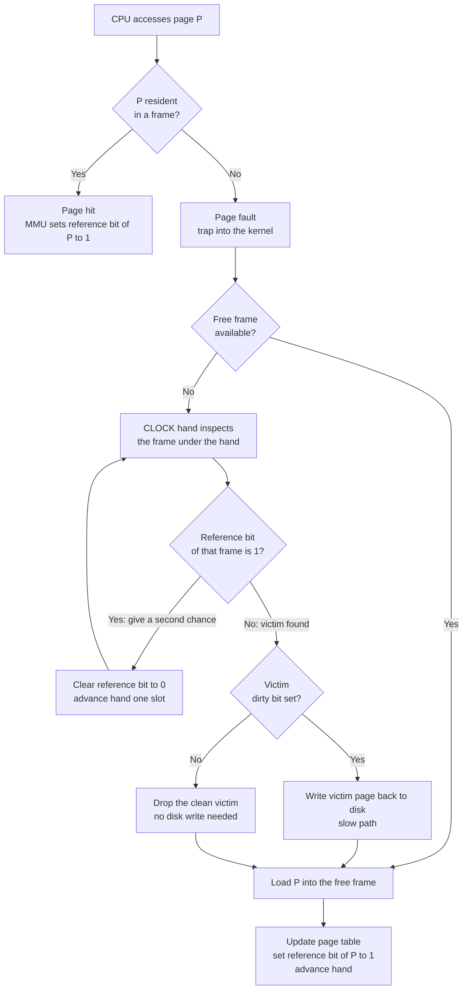

# 🗃️ Page Replacement Algorithms

> [!abstract] TL;DR
> When a **page fault** occurs and physical memory is **full**, the kernel must **evict** one resident page to make room for the one being demanded. A **page-replacement algorithm** decides *which* victim to evict, and the whole game is to **minimize future page faults** by keeping the pages most likely to be used soon. **OPTIMAL** (evict the page not needed for the longest into the future) is provably the best but needs a crystal ball, so it is only a benchmark. **FIFO** is trivial but ignores usage and can suffer **Belady's anomaly** (more frames → *more* faults). **LRU** approximates OPTIMAL by betting the recent past predicts the near future, but exact LRU is expensive, so real kernels use cheap LRU approximations like **CLOCK / second-chance**. The same eviction problem reappears in CPU caches, database buffer pools, and CDNs.

## Intuition

**Analogy:** Your desk holds only a handful of open books at once — that's your **physical memory** (the frames). The library behind you holds every book — that's **disk / swap**. When you need a new book and the desk is already full, you must **shelve one** to make room. *Which one?*

- Shelve the book you **haven't opened in the longest time** — that's **LRU**. It is a great bet, because a book you've ignored for an hour is probably one you're done with.
- Shelve the book you **won't need again for the longest time** — that's the **OPTIMAL** choice. But it requires **seeing the future**: you'd have to know your entire study plan in advance. Impossible in practice, so it only tells you *how well you could have done*.
- Shelve the book you **put on the desk first**, no matter how much you're using it — that's **FIFO**. Cheap, but it will happily shelve the dictionary you consult on every page.
- Shelve a **random** book — surprisingly not terrible, and needs no bookkeeping.

The reason LRU works at all is **locality of reference**: programs, like students, tend to keep returning to the same small set of pages (a loop body, a hot data structure) for a stretch of time before moving on. Page replacement is the art of *cheaply guessing the future from the recent past*.

---

## How It Works

### Core Mechanics

1. **The setup — demand paging.** Under **demand paging** (see the future *Virtual_Memory_and_Demand_Paging* note), a process's pages live on disk and are brought into physical **frames** only when touched. A reference to a non-resident page raises a **page fault**, trapping into the kernel. If a free frame exists, the kernel simply loads the page. Replacement is only needed when **every frame is occupied** — then something must go.

2. **The reference string.** To reason about and compare algorithms, we abstract a program's memory accesses into a **reference string**: the ordered sequence of *page numbers* it touches, e.g. `7 0 1 2 0 3 0 4 ...`. Consecutive accesses to the *same* page are collapsed (they never fault after the first). Every algorithm is scored by counting **page faults** on the same reference string for a given number of frames.

3. **The goal.** Minimize page faults. A fault costs a disk I/O that is roughly a **million times** slower than a memory access, so shaving even a few percent off the fault rate is enormous. The optimal strategy keeps resident exactly the pages that will be reused soonest.

4. **OPTIMAL (OPT / Belady / MIN).** Evict the resident page whose **next use is farthest in the future** (or never used again). Belady proved in 1966 that this yields the **minimum possible** number of faults. It is **unrealizable** online because it needs future knowledge — its only job is to be the **lower bound** you measure other algorithms against.

5. **FIFO.** Evict the page that has been **resident the longest** (oldest load time). Implemented with a simple queue: load at the tail, evict from the head. It completely ignores *how heavily a page is used*, so a hot page loaded early gets evicted just because it's old. FIFO's fatal quirk is **Belady's anomaly**: for some reference strings, giving it **more frames produces more faults** — a violation of the intuition that more memory can only help.

6. **LRU (Least Recently Used).** Evict the page that has gone **unused for the longest time**. LRU is an excellent approximation of OPT because it uses the past as a proxy for the future and directly exploits locality. Two exact implementations, both costly:
   - **Counters / timestamps:** stamp each page-table entry with a logical clock on every access; evict the smallest stamp. Requires a memory write on *every* reference and a scan (or heap) to find the minimum.
   - **Stack:** keep pages in a doubly linked list ordered by recency; on access, move the page to the top; evict from the bottom. O(1) per access but requires updating pointers on *every* memory reference — untenable in hardware at memory speed. (This is exactly the [[Doubly_Linked_List]] + hashmap trick used for an in-process LRU cache.)

7. **Why exact LRU is impractical in the MMU.** The hardware would have to update a data structure on *every single load and store*. So kernels settle for **approximate LRU** built on a single **reference (accessed) bit** per page that the MMU sets "for free" whenever the page is touched.

8. **Second-chance and CLOCK.** **Second-chance** is FIFO with a reprieve: when the oldest page is about to be evicted, if its reference bit is **1**, clear the bit to **0** and *give it a second chance* (move it to the back) instead of evicting. Pages that were recently used survive. **CLOCK** is the efficient realization: arrange the frames in a **circular buffer** with a **hand** (pointer). To find a victim, advance the hand; if the frame under it has reference bit **1**, clear it and keep moving; the **first frame with bit 0** is the victim. This gives near-LRU quality with O(1) amortized cost and no per-access bookkeeping beyond the hardware bit.

9. **Enhanced CLOCK (reference + dirty bits).** Rank frames by the pair **(reference, dirty)**: prefer to evict **(0,0)** = not recently used *and* clean (cheapest — no write-back), then **(0,1)**, then **(1,0)**, then **(1,1)**. This folds the write-back cost into the eviction decision itself.

10. **NFU and aging.** **Not-Frequently-Used** adds each page's reference bit into a counter every tick and evicts the smallest. Pure NFU never forgets old popularity, so **aging** fixes it: **shift** the counter right each tick and OR the reference bit into the high position — a page's history decays exponentially, closely tracking LRU with a few bytes per page.

11. **The dirty-bit optimization.** A page also carries a **dirty (modified) bit**. A **clean** page (never written since load) has an identical copy on disk, so it can be **dropped instantly** with no I/O. A **dirty** page must be **written back** to disk before its frame is reused. Preferring clean victims turns a slow write into a free discard; kernels also **proactively flush** dirty pages in the background so a victim is likely already clean when the moment comes (the crash-consistency side of write-back is covered under *Journaling_and_Crash_Consistency*; the analogous DB mechanism is [[Write_Ahead_Logging]]).

12. **Global vs local replacement.** Under **local replacement**, a faulting process may only steal frames from **its own** allocation — its fault behavior is isolated but its footprint is fixed. Under **global replacement**, the victim can be **any** process's page — better overall utilization, but one greedy process can starve others and push the system into **thrashing** (all processes constantly faulting, near-zero useful work). The **working-set model** counters this: give each process enough frames to hold its current working set, and suspend processes when the total demand exceeds memory.

13. **Frame allocation.** How many frames does each process get? **Equal allocation** splits frames evenly; **proportional allocation** gives frames in proportion to process size (or priority). Combined with the working-set estimate, this decides both *how many* frames a process holds and *whose* pages are eligible for eviction.

14. **Stack algorithms and why LRU never suffers Belady's anomaly.** An algorithm is a **stack algorithm** if the set of pages resident with **N frames is always a subset** of the set resident with **N+1 frames** (the *inclusion property*). LRU and OPT satisfy this, so adding frames can only add pages — faults are **monotonically non-increasing** in frame count. **FIFO is not a stack algorithm**: adding a frame can reshuffle eviction order and *lose* a page it would otherwise have kept, which is precisely how Belady's anomaly arises.

### Eviction decision on a page fault (with the CLOCK second-chance scan)



---

## Key Concepts

**Secondary (high-school / intro):**
- A computer keeps only a few pages of a program in fast memory at once; the rest sit on the slow disk.
- When fast memory is full and a new page is needed, one old page has to be **kicked out** first.
- Kicking out the page you **used least recently (LRU)** is usually a smart guess.

**Undergraduate (CS core):**
- **Reference string**, **page fault**, and **frame count** are the three variables in every comparison.
- **OPT** is the unbeatable-but-unrealizable lower bound; **FIFO** is simplest; **LRU** approximates OPT by exploiting **locality of reference**.
- Exact LRU is too costly at memory speed, so the **reference bit** enables **second-chance / CLOCK** as a practical LRU approximation.
- The **dirty bit** lets clean pages be dropped for free; **Belady's anomaly** is FIFO's counter-intuitive failure where more frames cause more faults.

**Graduate (systems / research):**
- **Stack algorithms** and the **inclusion property** formally explain which algorithms are anomaly-free (LRU/OPT yes, FIFO no).
- **Global vs local** replacement and the **working-set model** connect page replacement to **thrashing** control and frame allocation.
- **Competitive analysis:** deterministic online paging (LRU, FIFO) is **k-competitive** against OPT with k frames; the **randomized MARKER** algorithm is **O(log k)**-competitive (Sleator–Tarjan; Fiat et al.) — page replacement *is* the canonical online caching problem.
- Modern production variants — **CLOCK-Pro**, **ARC** (Adaptive Replacement Cache), **2Q**, and Linux's **Multi-Generational LRU (MGLRU)** — add scan-resistance and adaptivity that plain LRU lacks.

---

## Python Demo

```python
# Compare FIFO, LRU, OPTIMAL (Belady's clairvoyant), and CLOCK/second-chance
# on the same reference string, then demonstrate Belady's anomaly for FIFO.
# numpy + matplotlib only.
import numpy as np
import matplotlib.pyplot as plt


# ---------- the four algorithms: each returns the page-fault count ----------
def fifo_faults(refs, nframes):
    frames, faults = [], 0
    for p in refs:
        if p in frames:                 # already resident -> no fault
            continue
        faults += 1
        if len(frames) >= nframes:      # full: evict the oldest-loaded page
            frames.pop(0)
        frames.append(p)                # newest goes to the tail
    return faults


def lru_faults(refs, nframes):
    frames, faults = [], 0              # list ordered LRU (front) -> MRU (back)
    for p in refs:
        if p in frames:                 # hit: refresh recency
            frames.remove(p)
            frames.append(p)
            continue
        faults += 1
        if len(frames) >= nframes:      # full: evict the least-recently-used
            frames.pop(0)
        frames.append(p)
    return faults


def optimal_faults(refs, nframes):
    refs = list(refs)
    frames, faults = [], 0
    for i, p in enumerate(refs):
        if p in frames:
            continue
        faults += 1
        if len(frames) < nframes:
            frames.append(p)
        else:                           # evict page whose next use is farthest
            farthest, victim = -1, frames[0]
            for f in frames:
                try:
                    nxt = refs.index(f, i + 1)   # next occurrence after i
                except ValueError:
                    victim = f          # never used again -> perfect victim
                    break
                if nxt > farthest:
                    farthest, victim = nxt, f
            frames.remove(victim)
            frames.append(p)
    return faults


def clock_faults(refs, nframes):
    frames = [None] * nframes           # circular buffer of resident pages
    refbit = [0] * nframes              # reference (accessed) bit per frame
    hand, faults = 0, 0
    for p in refs:
        if p in frames:                 # hit: set reference bit, no fault
            refbit[frames.index(p)] = 1
            continue
        faults += 1
        while refbit[hand] == 1:        # second chance: clear bit and advance
            refbit[hand] = 0
            hand = (hand + 1) % nframes
        frames[hand] = p                # first frame with bit 0 is the victim
        refbit[hand] = 1
        hand = (hand + 1) % nframes
    return faults


ALGOS = {"OPTIMAL": optimal_faults, "LRU": lru_faults,
         "CLOCK": clock_faults, "FIFO": fifo_faults}


# ---------- 1) a reference string WITH locality (so LRU beats FIFO) ----------
rng = np.random.default_rng(42)
npages, length, locality = 50, 2000, 5
refs, center = [], 0
for _ in range(length):
    if rng.random() < 0.9:                       # 90%: stay in the working set
        refs.append((center + int(rng.integers(0, locality))) % npages)
    else:                                        # 10%: jump to a new locality
        center = int(rng.integers(0, npages))
        refs.append(center)

frame_range = np.arange(1, 21)
curves = {name: np.array([fn(refs, nf) for nf in frame_range]) / length
          for name, fn in ALGOS.items()}

print("fault RATE at a few frame counts (locality workload):")
for nf in (3, 7, 12):
    row = "  ".join(f"{n}={fn(refs, nf) / length:.3f}" for n, fn in ALGOS.items())
    print(f"  frames={nf:2d}:  {row}")


# ---------- 2) Belady's anomaly: FIFO faults INCREASE with more frames -------
anomaly = [1, 2, 3, 4, 1, 2, 5, 1, 2, 3, 4, 5]
belady_frames = np.arange(1, 8)
fifo_anom = np.array([fifo_faults(anomaly, nf) for nf in belady_frames])
lru_anom = np.array([lru_faults(anomaly, nf) for nf in belady_frames])
print(f"\nBelady's anomaly on {anomaly}")
print(f"  FIFO 3 frames -> {fifo_faults(anomaly, 3)} faults, "
      f"4 frames -> {fifo_faults(anomaly, 4)} faults  (MORE frames, MORE faults!)")


# ---------- plots ----------
fig, (ax1, ax2) = plt.subplots(1, 2, figsize=(13, 5))

markers = {"OPTIMAL": "o", "LRU": "s", "CLOCK": "^", "FIFO": "x"}
for name in ("OPTIMAL", "LRU", "CLOCK", "FIFO"):
    ax1.plot(frame_range, curves[name], marker=markers[name], label=name)
ax1.set_title("Fault rate vs frames (OPTIMAL = lower bound)")
ax1.set_xlabel("number of frames")
ax1.set_ylabel("page-fault rate")
ax1.legend()
ax1.grid(True, alpha=0.3)

ax2.plot(belady_frames, fifo_anom, marker="o", color="crimson", label="FIFO")
ax2.plot(belady_frames, lru_anom, marker="s", color="steelblue",
         label="LRU (stack algorithm, never rises)")
ax2.annotate("anomaly: 9 -> 10 faults",
             xy=(4, fifo_faults(anomaly, 4)), xytext=(4.4, 11),
             arrowprops=dict(arrowstyle="->"))
ax2.set_title("Belady's anomaly (FIFO)")
ax2.set_xlabel("number of frames")
ax2.set_ylabel("total page faults")
ax2.legend()
ax2.grid(True, alpha=0.3)

plt.tight_layout()
plt.savefig("page_replacement.png", dpi=110)
print("\nsaved page_replacement.png")
```

Expected shape of the output: on the locality workload the fault-rate curves order themselves **OPTIMAL ≤ LRU ≈ CLOCK < FIFO**, all falling as frames increase. On the anomaly string, **FIFO jumps from 9 faults (3 frames) to 10 faults (4 frames)** while LRU only ever decreases — a visual proof that FIFO is *not* a stack algorithm.

---

## Real-World Applications

> **Linux kernel page cache.** Linux never used exact LRU. For years it ran a **two-list CLOCK-like approximation** (active/inactive lists with reference bits). Since kernel 6.1 the default is **MGLRU (Multi-Generational LRU)**, which sorts pages into *generations* by age and scans them cheaply, giving better hit rates and far less CPU overhead than the old active/inactive scanner under memory pressure.

> **Redis maxmemory eviction.** When a Redis instance hits `maxmemory`, its `maxmemory-policy` chooses victims using **approximated LRU or LFU** — it samples a handful of random keys and evicts the best of the sample rather than maintaining an exact global order, trading a little accuracy for O(1) eviction. See [[Redis]] and [[Cache_Eviction_Policies]].

> **Database buffer pools.** PostgreSQL uses a **CLOCK-sweep** (a usage-count second-chance) to pick victim buffers, and InnoDB uses a **midpoint-insertion LRU** that resists sequential-scan pollution. Dirty buffers are flushed by background writers first so eviction rarely pays a write cost — the buffer-pool mechanics in [[Storage_Engine_Internals]].

> **CPU caches and CDNs.** The identical eviction problem appears one level down in hardware [[Cache_Hierarchy]] (set-associative caches use pseudo-LRU trees) and one level up in [[CDN_Caching]] edge caches (LRU/LFU/2Q/ARC decide which objects stay hot). It is genuinely *the same problem* at every layer of the memory-and-storage hierarchy.

---

## Common Pitfalls

- **Treating OPTIMAL as implementable.** OPT needs the full future reference string; it exists only to bound the others. Any real system must *approximate* the future from the past.
- **Assuming more memory always helps (Belady's anomaly).** With **FIFO** (and other non-stack algorithms) adding frames can *increase* faults. Only stack algorithms (LRU, OPT) guarantee monotone improvement.
- **Implementing exact LRU in the fast path.** Updating a timestamp or list on *every* memory reference is far too expensive at MMU speed. Use a single reference bit plus CLOCK/aging instead.
- **Forgetting the dirty bit.** Evicting a dirty page forces a synchronous write-back that can stall the fault. Prefer clean victims and flush dirty pages proactively in the background.
- **Unbounded global replacement causing thrashing.** A single memory-hungry process under global replacement can evict everyone else's working set, collapsing throughput. Bound it with the working-set model or per-cgroup limits.
- **LRU under a scan.** A single large sequential pass (a full table scan, a `memcpy` over a huge buffer) floods LRU with pages used exactly once, evicting the genuinely hot set — *cache pollution*. Scan-resistant policies (ARC, 2Q, LFU components, InnoDB's midpoint insertion) exist precisely to fix this.

---

## Related Concepts

- [[Virtual_Memory_and_TLB]] — page replacement only exists because virtual memory maps more pages than there are physical frames; the TLB caches the translations of the resident ones.
- [[Cache_Hierarchy]] — CPU caches solve the *same* eviction problem in hardware, using pseudo-LRU per set instead of software CLOCK.
- [[Cache_Eviction_Policies]] — the application-level cousin (LRU/LFU/random/TTL); the algorithms and trade-offs are identical, just at a different layer.
- [[Storage_Engine_Internals]] — database buffer pools use CLOCK-sweep / LRU to decide which disk pages stay in RAM, mirroring the kernel.
- [[Write_Ahead_Logging]] — the WAL is why a dirty buffer can be evicted safely; it is the DB analogue of the OS dirty-page write-back and crash-consistency story.
- [[Redis]] — a production cache whose `maxmemory-policy` implements sampled approximate LRU/LFU eviction.
- [[CDN_Caching]] — edge caches run LRU/LFU/2Q/ARC to choose which objects to evict; page replacement scaled to the internet.
- [[Doubly_Linked_List]] — the doubly linked list + hashmap is exactly how an exact O(1) LRU cache is built in software.

---

## Review Questions

1. **(Conceptual)** Why is exact LRU an excellent approximation of the OPTIMAL algorithm, and what assumption about program behavior makes that true? Where does that assumption break down?
2. **(Scenario)** You profile a service and find its buffer cache is being wrecked by a nightly full-table scan that never repeats but evicts the hot working set. LRU is making it worse. Which replacement strategy would you choose and why, and what is it about LRU that fails here?
3. **(Trade-off)** Explain Belady's anomaly. Why can adding frames make FIFO fault *more*, yet never make LRU fault more? Frame your answer in terms of the stack-algorithm inclusion property.

---

## Sources

- Silberschatz, Galvin, Gagne — *Operating System Concepts* (10th ed.), Ch. 10 "Virtual Memory" (page replacement, FIFO/LRU/OPT, second-chance, thrashing, working set): https://www.os-book.com/
- Tanenbaum & Bos — *Modern Operating Systems* (4th ed.), Ch. 3 "Memory Management" (page-replacement algorithms, CLOCK, aging, WSClock).
- Belady, Nelson, Shedler — "An anomaly in space-time characteristics of certain programs running in a paging machine," *Communications of the ACM*, 1969 (Belady's anomaly): https://dl.acm.org/doi/10.1145/363011.363155
- Megiddo & Modha — "ARC: A Self-Tuning, Low Overhead Replacement Cache," *USENIX FAST 2003*: https://www.usenix.org/legacy/events/fast03/tech/full_papers/megiddo/megiddo.pdf
- Linux kernel documentation — "Multi-Gen LRU (MGLRU)": https://docs.kernel.org/admin-guide/mm/multigen_lru.html

---

#operating-systems #page-replacement #lru #clock-algorithm #beladys-anomaly
