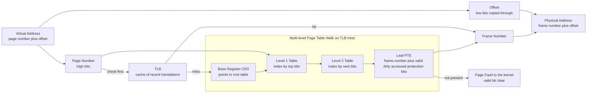

# 🧩 Paging and Page Tables

> [!abstract] TL;DR
> Paging is the memory-management scheme that chops the virtual address space into fixed-size **pages** and physical RAM into equal-size **frames**, then lets any page map to any frame through a per-process **page table**. Because a process no longer needs one contiguous block of memory, external fragmentation disappears and only tiny internal fragmentation in the final page remains. On every memory access the **MMU** splits the virtual address into a page number plus an offset, indexes the page table to get a frame number, and forms the physical address in hardware. A flat table for a 64-bit space would be astronomically large, so real hardware uses **multi-level (hierarchical) page tables** that allocate table pages only where the address space is actually used, and a **TLB** caches recent translations so the walk is not repeated on every access.

---

## Intuition

**Analogy.** Imagine a moving company that must store your belongings in a giant warehouse. The naive scheme is "one contiguous aisle per customer": your whole shipment must sit in a single unbroken run of shelving. Over time customers come and go, leaving awkward gaps — a 5-shelf gap here, a 3-shelf gap there — none big enough for the next 6-shelf customer, even though the *total* free space is plenty. That wasted, unusable-because-scattered space is **external fragmentation**.

Paging changes the rule. The warehouse is divided into identical **bins** (frames), and every shipment is broken into identical **boxes** (pages). Now your boxes can go into *any* free bins, anywhere in the warehouse — scattered across floors and aisles, it does not matter. To find your things again, the front desk keeps an **index card** for you (the **page table**): "your box 0 is in bin 8123, your box 1 is in bin 40, your box 2 is in bin 991..." Because any box fits any bin, no free bin is ever wasted for being the wrong shape. The only waste left is the slack inside your *last*, partially-filled box — that is **internal fragmentation**, and it is tiny.

In technical terms: the page table is that index card. A virtual address is just "box number plus how far into the box," and translation is "look up which bin the box landed in, then go that same distance into the bin." The MMU does this lookup on literally every load and store, which is why the mapping must be fast — and why so much hardware exists to make it fast.

---

## How It Works

### The core idea: pages, frames, and a mapping

Two divisions happen up front:

- The **virtual address space** of each process is divided into fixed-size **pages** (commonly 4 KB).
- **Physical memory** is divided into equal-size **frames** (also 4 KB, so a page fits exactly in a frame).

The kernel maintains, per process, a **page table** that maps each page to whatever frame currently holds it. Any page can go in any frame, so a process's memory footprint need not be physically contiguous. This is what kills **external fragmentation**: the allocator never has to find a big contiguous hole, only individual free frames. The residual cost is **internal fragmentation** — the unused bytes in a process's last page — which averages half a page per region and is negligible.

### Address translation, step by step

Because page size is a power of two, a virtual address partitions cleanly into two fields with no arithmetic, just bit slicing:

1. The low bits are the **offset** within the page. For a 4 KB page that is 12 bits, since 2 raised to the 12 equals 4096.
2. The high bits are the **page number**. That number is an index into the page table.
3. The page table entry at that index holds a **frame number**.
4. The physical address is simply **frame number shifted up by the offset width, then OR-ed with the offset** — the offset is copied through unchanged because the byte's position inside a page equals its position inside the frame.

The **MMU** performs this on every instruction fetch, load, and store. Software never sees it; the CPU issues virtual addresses and the MMU emits physical ones (the hardware view is detailed in the Computer Architecture note [[Virtual_Memory_and_TLB]]).

### What lives in a page table entry

A **page table entry** (PTE) is more than a frame number. Alongside the frame it packs status and permission bits that make virtual memory and protection possible:

- **Valid / Present bit** — is this page currently backed by a frame in RAM? If clear, touching the page raises a **page fault**, which is exactly the hook that lets the OS implement demand paging and swapping.
- **Dirty (modified) bit** — has the page been written since it was loaded? A clean page can be evicted without writing it back to disk; a dirty one must be saved.
- **Accessed / Referenced bit** — set by hardware on use; page-replacement algorithms read it to approximate "recently used."
- **Protection / permission bits** — read, write, execute, and user-vs-supervisor. A store to a read-only page or an execute of a no-execute page traps, which enforces isolation and defenses like W-xor-X.

### The size problem and multi-level tables

A single **flat** page table has one entry per page in the *entire* address space. For a 32-bit space with 4 KB pages that is 2 raised to the 20 entries — about a million, a few megabytes per process. Tolerable. For a **64-bit** space it is 2 raised to the 52 entries — tens of petabytes *per process*. Completely infeasible, and almost all of it would map nothing.

The fix exploits **sparsity**: real processes use a tiny, clustered fraction of their address space (some code low down, a heap, a stack up high). A **multi-level (hierarchical) page table** is a radix tree of table pages. The page number is split into several index fields, one per level; the walk starts at a root table whose physical address sits in a base register (**CR3** on x86-64), and each level's entry points to the next-level table, until the final leaf entry yields the frame. The crucial property: **table pages are allocated only for regions that are actually used**. Vast unused swaths of the address space cost *nothing* because the corresponding upper-level entries are simply marked not-present. x86-64 uses a **4-level** walk (PML4, PDPT, PD, PT), each level a 4 KB table of 512 eight-byte entries indexed by 9 bits; ARM's translation tables work the same way.

Alternatives trade the tree for a hash: an **inverted page table** has one entry per physical *frame* (so its size scales with RAM, not with per-process address space), and **hashed page tables** hash the page number into a bucket chain — both rely on hashing ([[Hash_Table_Fundamentals]]) and are used where the address space vastly exceeds physical memory.

### Why the TLB matters

A 4-level walk means up to four extra memory accesses *just to translate* before the real access happens — a 5x memory-traffic penalty per operation. The **Translation Lookaside Buffer** (TLB) is a small, fast, fully-associative cache of recent page-to-frame translations sitting in the MMU. A TLB *hit* resolves translation in effectively zero extra cycles; only a *miss* triggers the walk. The TLB is the reason paging is affordable at all, and it interacts tightly with the memory hierarchy ([[Cache_Hierarchy]]). It is covered in the planned sibling note *Segmentation and the TLB*.



---

## Key Concepts

### Secondary (explain to a curious beginner)
- Memory is cut into equal-size **pages** (program side) and **frames** (RAM side); a page fits exactly in a frame.
- A program's pages can be scattered anywhere in RAM, so we no longer need one big contiguous block — that removes wasted gaps.
- A **page table** is a lookup list: "my page N lives in frame F."
- An address is "which page, and how far into it"; the offset part never changes when we translate.
- The little chip that does this lookup automatically on every memory access is the **MMU**.

### Undergraduate (needs CS background)
- **Address split:** offset bits equal log-base-2 of the page size; the remaining high bits are the page number that indexes the page table.
- **Physical address** equals frame number concatenated with offset — a shift and an OR, never a general multiply, because sizes are powers of two.
- **PTE contents:** frame number plus valid/present, dirty, accessed/referenced, and protection (read/write/execute, user/supervisor) bits.
- **Internal vs external fragmentation:** paging trades away external fragmentation for a small, bounded internal fragmentation in each region's last page.
- **Multi-level tables:** the page number is subdivided into per-level indices; unused subtrees are simply absent, so table memory scales with the working set, not the address space. x86-32 uses a 10/10/12 split (page directory, page table, offset).
- **Page-size trade-off:** small pages cut internal fragmentation but inflate the table and increase TLB pressure; **huge pages** (2 MB, 1 GB) cover more memory per TLB entry.

### Graduate (system-level thinking)
- **Why 64-bit forces hierarchy:** a flat table needs 2 raised to the (virtual-bits minus offset-bits) entries; at 64 bits this is petabytes, so x86-64 uses a 4-level radix tree (PML4 to PDPT to PD to PT) and only materializes populated table pages. Five-level paging extends this to 57-bit virtual addresses.
- **Inverted and hashed page tables** bound table size by *physical* memory rather than per-process virtual space, at the cost of a hash lookup per translation and harder sharing.
- **Translation cost model:** each level adds a dependent memory reference; a cold 4-level walk can cost four cache-line loads. The TLB, page-walk caches, and huge pages exist specifically to amortize this; TLB reach equals entries times page size and is a real scaling limit for big-memory workloads.
- **Sharing and copy-on-write:** because mapping is per-page, several processes can map the same frame (shared libraries, `mmap`-ed files) by pointing distinct PTEs at one frame. **fork** maps the child's pages read-only and copy-on-write; the first write faults and duplicates just that page, making fork cheap.
- **Protection as a first-class use:** per-page permission bits enforce isolation, guard pages, W-xor-X, and stack/heap non-execute — security policy encoded directly in the translation hardware.
- **Paging enables virtual memory:** a clear present bit turns any access into a page fault the kernel can service by loading from disk (demand paging) or by choosing a victim to evict (page replacement) — the subject of the planned siblings *Virtual Memory and Demand Paging* and *Page Replacement Algorithms*.

---

## Python Demo

Pure `numpy` and `matplotlib`. Part 1 implements real **virtual-to-physical translation**: split a virtual address into page number and offset, look up a page table, and rebuild the physical address. Part 2 does a concrete **two-level page table walk** in the classic x86-32 10/10/12 layout, including a page fault for an unmapped page. Part 3 computes and plots the **memory overhead** of a flat page table versus a hierarchical (multi-level, sparse) one as the virtual address space grows — the quantitative reason flat tables are impossible at 64 bits.

```python
# Paging: address translation, a 2-level walk, and flat-vs-hierarchical table cost.
import numpy as np
import matplotlib.pyplot as plt

# ---------- Part 1: single-level virtual -> physical translation ----------
PAGE_SIZE = 4096
OFFSET_BITS = int(np.log2(PAGE_SIZE))          # 12 bits of offset

def translate_flat(vaddr, page_table):
    """page_table maps page_number -> frame_number (a dict)."""
    page_number = vaddr >> OFFSET_BITS          # high bits
    offset      = vaddr & (PAGE_SIZE - 1)       # low 12 bits
    if page_number not in page_table:
        raise ValueError(f"page fault: page {page_number} not mapped")
    frame = page_table[page_number]
    paddr = (frame << OFFSET_BITS) | offset     # frame concat offset
    return page_number, offset, frame, paddr

page_table = {0: 8123, 1: 40, 2: 991, 5: 7}     # sparse, non-contiguous frames
for vaddr in (0x0000, 0x1ABC, 0x2FFF, 0x5010):
    pn, off, fr, pa = translate_flat(vaddr, page_table)
    print(f"VA 0x{vaddr:05X} -> page {pn:>2} off 0x{off:03X} "
          f"-> frame {fr:>5} -> PA 0x{pa:07X}")

# ---------- Part 2: two-level walk (x86-32 style 10 / 10 / 12) ----------
DIR_BITS, TAB_BITS = 10, 10                     # 1024 entries per table
def split_two_level(vaddr):
    offset    = vaddr & (PAGE_SIZE - 1)
    tab_index = (vaddr >> OFFSET_BITS) & 0x3FF
    dir_index = (vaddr >> (OFFSET_BITS + TAB_BITS)) & 0x3FF
    return dir_index, tab_index, offset

# page directory -> page table -> frame  (nested dicts = only allocated tables)
page_directory = {0: {0: 200, 1: 201}, 512: {3: 9000}}
def walk_two_level(vaddr):
    d, t, off = split_two_level(vaddr)
    if d not in page_directory:
        raise ValueError(f"page fault at directory index {d}")
    table = page_directory[d]
    if t not in table:
        raise ValueError(f"page fault at table index {t}")
    return (table[t] << OFFSET_BITS) | off

for vaddr in (0x00000ABC, 0x00001010, 0x80003004):
    d, t, off = split_two_level(vaddr)
    pa = walk_two_level(vaddr)
    print(f"VA 0x{vaddr:08X} -> dir {d:>3} tab {t:>3} off 0x{off:03X} -> PA 0x{pa:07X}")
try:
    walk_two_level(0x40000000)                  # unmapped -> demonstrates a fault
except ValueError as e:
    print("VA 0x40000000 ->", e)

# ---------- Part 3: flat vs hierarchical page-table memory cost ----------
def flat_table_bytes(vbits, page_size=4096, pte=8):
    # ONE entry per page in the WHOLE space, allocated up front, per process.
    num_pages = 2.0 ** (vbits - int(np.log2(page_size)))
    return num_pages * pte

def hier_table_bytes(vbits, resident_pages, page_size=4096, pte=8):
    # A radix tree: allocate only the table pages needed to map the working set.
    fanout   = page_size // pte                 # entries per table page (512)
    idx_bits = int(np.log2(fanout))             # 9 bits per level
    levels   = int(np.ceil((vbits - int(np.log2(page_size))) / idx_bits))
    tables, nodes = 0, resident_pages           # leaves needed at the bottom
    for _ in range(levels):
        this_level = int(np.ceil(nodes / fanout))
        tables += this_level                    # table pages at this level
        nodes = this_level                      # parent points to those tables
    return tables * page_size

vbits = np.arange(16, 65, 2)
WORKING_SET = 4096                              # process touches 4096 pages = 16 MB
flat = np.array([flat_table_bytes(v) for v in vbits])
hier = np.array([hier_table_bytes(v, WORKING_SET) for v in vbits])

print(f"\nAt 64-bit: flat table = {flat[-1]:.3e} bytes, "
      f"hierarchical (16 MB working set) = {hier[-1]:,} bytes")

fig, (ax1, ax2) = plt.subplots(1, 2, figsize=(13, 5))
ax1.semilogy(vbits, flat, "o-", color="#DC2626", label="flat single-level table")
ax1.semilogy(vbits, hier, "s-", color="#2563EB",
             label="hierarchical, 16 MB working set")
ax1.axhline(4 * 1024**3, color="gray", ls="--", label="4 GB reference line")
ax1.set_title("Page-table memory per process vs address-space width")
ax1.set_xlabel("virtual address bits")
ax1.set_ylabel("table bytes (log scale)")
ax1.legend(); ax1.grid(alpha=0.3, which="both")

ratio = flat / hier
ax2.semilogy(vbits, ratio, "^-", color="#059669")
ax2.set_title("How many times larger the flat table is")
ax2.set_xlabel("virtual address bits")
ax2.set_ylabel("flat / hierarchical (log scale)")
ax2.grid(alpha=0.3, which="both")

plt.tight_layout()
plt.savefig("paging_page_tables_demo.png", dpi=110)
print("Saved paging_page_tables_demo.png")
```

**What to notice.** Part 1 shows non-contiguous frames (page 0 in frame 8123, page 1 in frame 40) rebuilding into valid physical addresses with the offset copied through untouched. Part 2 walks a real two-level tree and *faults* on the unmapped `0x40000000`, which is precisely the mechanism the kernel hooks for demand paging. Part 3 is the punchline: the flat curve climbs to roughly 3 times 10 to the 16 bytes (tens of petabytes) at 64 bits, while the hierarchical table for a 16 MB working set stays at a few tens of kilobytes and barely moves — the flat-versus-hierarchical ratio blows past 10 to the 11. Flat tables are not merely wasteful at 64 bits; they are physically impossible, and hierarchy is what makes paging tractable.

---

## Real-World Applications

- **x86-64 Linux, Windows, macOS** all use hardware **4-level paging** with 4 KB pages, 512-entry tables, and **CR3** holding the root table's physical address; a context switch reloads CR3 to swap address spaces.
- **Huge pages** (2 MB and 1 GB on x86-64) are used by databases (PostgreSQL, Oracle), the JVM, and hypervisors to cut TLB misses on multi-gigabyte heaps — fewer, larger PTEs cover far more memory per TLB entry.
- **Copy-on-write fork** underpins how every Unix shell, web server, and `fork`-based worker pool (pre-fork Nginx, Gunicorn) spawns children cheaply: pages are shared read-only until first write.
- **Shared libraries and `mmap`** map one physical copy of libc or a memory-mapped file into many processes by pointing their PTEs at the same frames — saving RAM across the whole system.
- **Security hardening** uses per-page permission bits for no-execute stacks/heaps, W-xor-X, guard pages, and — after Meltdown — kernel page-table isolation (KPTI), as discussed in [[Virtual_Memory_and_TLB]].
- **Virtual machines** add a second translation layer (nested/extended page tables) so guest-physical addresses translate again to host-physical, all in the same paging hardware.

---

## Common Pitfalls

- **Confusing internal and external fragmentation** — paging *eliminates external* fragmentation but *introduces internal* fragmentation in each region's last page. Claiming paging has "no fragmentation" is wrong.
- **Assuming a flat page table** — reasoning about a single array for a 64-bit space leads to impossible sizes; real systems are hierarchical (or inverted/hashed), and table memory tracks the working set, not the address space.
- **Forgetting the translation is per-access** — every load and store is translated; without a TLB this would multiply memory traffic several-fold. Ignoring TLB behavior gives wildly optimistic performance estimates.
- **Overusing tiny or huge pages blindly** — smaller pages bloat tables and thrash the TLB; huge pages waste memory through internal fragmentation and can cause allocation stalls or fragmentation of physical memory. The right size is workload-dependent.
- **Treating the offset as translatable** — only the page number maps; the offset is copied through unchanged. Recomputing it is a classic off-by-bits bug.
- **Ignoring the dirty and accessed bits** — eviction correctness (must a page be written back?) and replacement quality both depend on these hardware-set bits; a homegrown pager that ignores them corrupts data or evicts poorly.
- **Sharing without care for permissions** — mapping the same frame into two processes with mismatched write permissions, or forgetting copy-on-write, produces silent cross-process corruption.

---

## Related Concepts

Verified vault links:

- [[Virtual_Memory_and_TLB]] — the Computer Architecture view: 4-level x86-64 walk, the TLB as a translation cache, huge pages, and the Meltdown/KPTI story.
- [[Cache_Hierarchy]] — why the multi-access page-table walk is expensive and how caching (including the TLB) hides translation latency.
- [[Hash_Table_Fundamentals]] — the hashing that inverted and hashed page tables use to bound table size by physical memory.
- [[Threads_and_Concurrency_Models]] — threads of one process share a single address space and page table, which is why thread switches skip the CR3 reload and TLB flush that process switches incur.
- [[NUMA_and_Memory_Bandwidth]] — where a frame physically lives matters: page placement across NUMA nodes changes real access latency.
- [[DRAM_Architecture]] — frames ultimately map to physical DRAM rows and banks that back resident pages.
- [[Operating_Systems_Overview]] — the OS context in which the kernel owns and switches per-process page tables.
- [[System_Calls_and_the_Kernel_Interface]] — `mmap`, `brk`, and page-fault handling are the syscall/trap paths that populate and modify page tables.

Planned Operating Systems siblings (not yet written — referenced in prose above): *Memory Management and Allocation*, *Virtual Memory and Demand Paging*, *Segmentation and the TLB*, *Page Replacement Algorithms*, *Memory Hierarchy and Caching*, *Protection and Access Control*, and *Processes and the Process Model*.

---

## Review Questions

**Tier 1 — Conceptual (junior level).**
Explain, using the warehouse-bin analogy, why paging removes external fragmentation but leaves a small amount of internal fragmentation. Then state exactly which part of a virtual address is translated and which part passes through unchanged, and why.

**Tier 2 — Applied (needs CS background).**
A system has 4 KB pages, 8-byte page-table entries, and a 48-bit virtual address space. (a) How many entries would a single flat page table need, and roughly how many bytes is that per process? (b) x86-64 instead uses a 4-level table with 512 entries per level. For a process whose entire footprint is 8 MB of contiguous pages, estimate how many table pages the hierarchical scheme actually allocates, and contrast that with the flat answer. What property of real programs makes the hierarchical scheme win?

**Tier 3 — System design / trade-off (system-level).**
A big-data service reports that a memory-bound scan spends a surprising fraction of cycles on TLB misses even though its data fits in RAM. (a) Explain mechanically why TLB misses, not page faults, could dominate here, referencing the page-table walk. (b) Evaluate switching the workload to 2 MB huge pages: what improves, and what new costs (internal fragmentation, allocation, physical-memory fragmentation) do you take on? (c) Under what circumstances would an inverted or hashed page table be a better fit than a hierarchical one, and what do you give up?

---

## Sources

- Silberschatz, Galvin, Gagne. *Operating System Concepts*, 10th ed. — Chapter 9, "Main Memory" (paging, page tables, structure of the page table, hierarchical/hashed/inverted tables, TLB). https://www.os-book.com/
- Arpaci-Dusseau, R. and A. *Operating Systems: Three Easy Pieces* — "Paging: Introduction," "Translation Lookaside Buffers," and "Advanced Page Tables (multi-level)." https://pages.cs.wisc.edu/~remzi/OSTEP/
- Intel. *Intel 64 and IA-32 Architectures Software Developer's Manual, Vol. 3A* — Chapter 4, "Paging" (4-level and 5-level paging, PTE format, CR3). https://www.intel.com/content/www/us/en/developer/articles/technical/intel-sdm.html
- Arm Ltd. *Arm Architecture Reference Manual* — "The AArch64 Virtual Memory System Architecture" (translation tables, granule sizes). https://developer.arm.com/documentation/ddi0487/latest
- Bryant, R. and O'Hallaron, D. *Computer Systems: A Programmer's Perspective*, 3rd ed. — Chapter 9, "Virtual Memory" (address translation, multi-level tables, TLB, allocation). https://csapp.cs.cmu.edu/

---

#operating-systems #paging #page-tables #address-translation #mmu
