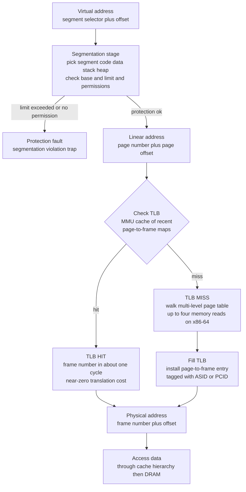

# 🗂️ Segmentation and the TLB

> [!abstract] TL;DR
> Two ideas about *how to divide and how to translate* an address space. **Segmentation** splits a process into a few **variable-size logical segments** — code, data, stack, heap — each with a **base and limit**, matching how a programmer thinks; it gives natural protection and sharing but suffers **external fragmentation**, which is why pure segmentation lost to paging's fixed tiles (surviving mainly in x86 memory protection). **Paging** wins on placement but is slow: translating one virtual address requires walking a multi-level page table — up to **4 extra memory reads on x86-64** — which would roughly halve performance. The **TLB (Translation Lookaside Buffer)** is the fix: a small, fully/set-associative hardware **cache of recent page-to-frame translations** inside the MMU. A **hit** returns the frame in ~1 cycle; a **miss** triggers a page-table walk that refills the TLB. Because programs have **locality**, a tiny TLB captures the vast majority of accesses, so the *effective* translation cost collapses toward the hit cost.

## Intuition

**Analogy — the library catalog and the sticky note.** Walking the page table on *every* memory access is like re-reading the library's entire card catalog every single time you want a book: technically correct, unbearably slow. The **TLB is the sticky note on your monitor** listing the ten shelf-locations you look up constantly. Almost every request is one of those ten, so you glance at the sticky note and go straight to the shelf; only for the rare unfamiliar book do you trudge back to the full catalog — and when you do, you jot that new location onto the sticky note for next time. The sticky note is small precisely because it does not need to be big: your reading has **locality**, so a handful of hot entries covers nearly everything.

**Segmentation** is a different question — not *how fast is a lookup* but *how do we carve the address space*. Instead of slicing a book into identical 4KB pages, segmentation keeps the book's **natural chapters**: "Code", "Globals", "Stack", "Heap", each a contiguous region of its own size, with a start address (base) and a length (limit). That matches how the author thinks, and you can lock or share a whole chapter at once — but fitting variable-length chapters onto shelves eventually leaves awkward gaps (external fragmentation), which fixed-size pages avoid.

---

## How It Works

### Segmentation — the logical view of memory

Segmentation divides a process's address space into a small number of **variable-size logical segments** that correspond to the program's structure rather than to fixed hardware tiles:

- **Code / text**, **data / globals**, **stack**, **heap**, and often per-library or per-module segments.
- Each segment is described by an entry in a per-process **segment table**: a **base** (where the segment starts in physical or linear memory) and a **limit** (its length), plus **protection bits** (read / write / execute) and a valid bit.
- A logical address is a pair `(segment selector, offset)`. Translation is: look up the segment's base and limit, **check that offset is below the limit** (else raise a *segmentation fault*), then add base plus offset.

Because segments are sized to match meaning, segmentation gives **protection and sharing at a logical granularity**: mark the code segment read-only and execute-only; share one physical copy of a library's code segment across many processes by pointing their segment-table entries at the same base. This is more natural than protecting arbitrary page ranges.

The cost is **external fragmentation**. Variable-size segments must be placed in contiguous physical memory, so as segments come and go the free space fragments into holes too small to reuse — the same problem as any [first-fit / best-fit allocator](#) faces. Compaction can reclaim it but is expensive. Paging's fixed 4KB frames sidestep this entirely: any free frame fits any page, so external fragmentation vanishes (at the price of small *internal* fragmentation in the last partial page).

### Segmentation with paging — the x86 combination

Historically x86 combined both: a logical address went through **segmentation first** (selector plus offset -> a flat *linear address*), then through **paging** (linear address -> physical). This gave segmentation's protection model on top of paging's clean placement. In practice pure segmentation lost, and modern **x86-64 long mode neutered segmentation**: the base/limit of the main segments are forced to a flat 0-to-max range, so effectively only paging translates addresses. What **survives** is the protection role — the `CS`/`DS`/`SS` **segment registers**, the privilege level in the selector, and special-purpose bases like `FS`/`GS` used for thread-local storage and per-CPU kernel data. The concept lives on in memory protection, not in address division. A fuller treatment of variable-size vs fixed-size division belongs in the forthcoming *Memory_Management_and_Allocation* and *Protection_and_Access_Control* notes.

### The TLB — caching translations so paging is affordable

Paging solves fragmentation but creates a *speed* problem. On x86-64 the page table is **4 levels** (PML4 -> PDPT -> PD -> PT). A cold translation therefore needs **4 memory reads just to find the frame**, *before* the actual data access — so a naive paged access could cost roughly 5x a raw access. That would make virtual memory unusable.

The **Translation Lookaside Buffer (TLB)** is the hardware fix. It is a small, very fast **cache inside the MMU** that stores recent **virtual-page -> physical-frame** translations (plus the page's protection bits). It is typically **fully-associative or highly set-associative** and tiny — tens to a couple thousand entries — because it exploits locality rather than capacity. Modern CPUs have a split L1 (separate instruction-TLB and data-TLB) backed by a larger shared L2 STLB, mirroring the [[Cache_Hierarchy]] for data.

### TLB operation and the effective-access-time arithmetic

On every memory reference the MMU **checks the TLB first**:

1. **TLB hit** — the frame number is returned in about **1 cycle**, overlapped with the L1 cache lookup, so translation is essentially free.
2. **TLB miss** — the hardware (or software; see below) **walks the page table**, pays the multi-read penalty, then **installs the new translation in the TLB**, evicting an entry (typically pseudo-LRU) if full. The next access to that page will hit.

The payoff is captured by the **effective access time (EAT)**. If a TLB lookup costs `t_hit`, a page-table walk costs `t_walk`, and the TLB hit ratio is `h`:

```
EAT_translation = h * t_hit + (1 - h) * (t_hit + t_walk)
                = t_hit + (1 - h) * t_walk
```

With `t_hit = 1` cycle and `t_walk = 100` cycles: at `h = 0.99` the effective translation cost is `1 + 0.01 * 100 = 2` cycles — a 100-cycle worst case amortized down to near the hit cost. This is why a **small** TLB works: **locality** means a handful of pages serve almost all references, so `h` climbs to 0.98-0.999 with only tens to hundreds of entries. The Python demo below measures exactly this curve.

### TLB management: misses, tagging, shootdown, huge pages

- **Hardware- vs software-managed misses.** x86 and ARM use a **hardware page-table walker** that refills the TLB transparently on a miss. MIPS and some RISC-V configurations instead **trap to a software TLB-miss handler** in the kernel — flexible page-table formats, but a costlier miss (see [[Interrupts_Traps_and_Dual_Mode_Operation]] for the trap mechanism and [[System_Calls_and_the_Kernel_Interface]] for the kernel entry path).
- **ASIDs / tagged TLBs.** Naively, a **context switch** to a new address space must **flush the whole TLB**, because the same virtual page now means a different frame — catastrophic for switch-heavy workloads. Modern CPUs **tag each TLB entry with an address-space ID** (ASID on ARM, PCID on x86). Now entries from different processes coexist and a switch flushes nothing (see [[Processes_and_the_Process_Model]] for the switch itself).
- **TLB shootdown.** The TLB is per-core. When one core changes a page-table entry (unmaps a page, changes permissions), every *other* core that may have cached that translation must invalidate it. The kernel sends an **inter-processor interrupt** so each core executes an `INVLPG`/`SFENCE.VMA` — a **TLB shootdown**. It is a real multiprocessor cost that grows with core count and is a classic scalability bottleneck for `munmap`/`mprotect`-heavy code (see [[Threads_and_Concurrency_Models]]).
- **Huge pages.** A 4KB TLB entry covers 4KB; a **2MB huge page** covers 512x more, and **1GB** far more, with fewer page-table levels to walk. For large working sets — database buffer pools, in-memory analytics, JVM heaps — huge pages **slash TLB misses** by covering the same memory with far fewer entries.

### Combined translation and protection path



---

## Key Concepts

### Secondary (first exposure)
- **Segmentation** keeps a program's natural chapters — code, data, stack, heap — as separate variable-size regions, each with a start and a length. **Paging** instead cuts everything into identical fixed tiles.
- Looking up where a virtual address really lives can be slow. The **TLB** is a tiny fast "recently-used addresses" cheat-sheet the CPU checks first; because programs reuse the same memory (locality), the cheat-sheet almost always has the answer.
- **Hit** = found in the TLB (fast). **Miss** = not found, do the slow full lookup, then remember it.

### Undergraduate (CS core)
- **Segment table**: base + limit + protection per segment; translation checks `offset < limit` then adds base; overflow raises a segmentation fault. Segmentation enables logical-granularity **protection and sharing** but causes **external fragmentation** — the reason paging displaced it for placement.
- **TLB** as a fully/set-associative cache of page-table entries inside the MMU; hit ~1 cycle, miss triggers a **page-table walk** (4 reads on x86-64's 4-level tables).
- **Effective access time**: `EAT = t_hit + (1 - h) * t_walk`. A high hit ratio driven by **locality** amortizes the walk cost almost away — the core justification for a small TLB.
- **Context switch** must flush or tag the TLB; **ASID/PCID** tagging avoids full flushes.
- **Huge pages** (2MB/1GB) increase per-entry coverage to reduce TLB pressure for large working sets.

### Graduate (systems depth)
- **Segmentation with paging** on x86: logical -> (segmentation) -> linear -> (paging) -> physical. In x86-64 long mode segment bases/limits are flattened, so paging dominates; segmentation survives as protection (`CS`/`DS`/`SS` privilege, `FS`/`GS` bases for TLS and per-CPU data).
- **Hardware vs software TLB refill**: hardware walkers (x86/ARM) vs trap-to-kernel handlers (MIPS, some RISC-V). Walk cost is itself reduced by **page-walk caches** that cache upper page-table levels.
- **TLB shootdown**: per-core TLBs force IPI-driven coordinated invalidation (`INVLPG`, `SFENCE.VMA`) on any page-table change touching a shared mapping; a well-known multicore scalability cost that motivates batching and lazy shootdown schemes.
- **Interaction with security mitigations**: KPTI splits user/kernel page tables and, without PCID, forces extra TLB flushes on syscalls — a direct TLB-driven performance regression (detailed in [[Virtual_Memory_and_TLB]]).
- **Measuring it**: `perf stat -e dTLB-load-misses,iTLB-load-misses,dtlb_load_misses.walk_active` exposes walk cycles; the fix is usually huge pages, better data layout, or reducing working-set spread (belongs in the forthcoming *Performance_Analysis_and_OS_Tuning* note).

---

## Python Demo

We model the **TLB as a small LRU cache of virtual-page -> physical-frame translations** and measure the **effective address-translation time**. A stream of memory references is generated with **locality** (a skewed / Zipf-like popularity over the pages of a working set), then run through a TLB of capacity `K` with LRU replacement. We record the **hit ratio** and compute the **effective translation time** using a fast hit path versus a slow page-table walk on a miss. We sweep both **TLB size** and **working-set size** to show why a *small* TLB captures most accesses under locality — and where it breaks down. NumPy + Matplotlib only.

```python
# Model a TLB as an LRU cache of page->frame translations and measure the
# effective address-translation time under a memory-reference stream with locality.
import numpy as np
import matplotlib.pyplot as plt
from collections import OrderedDict

rng = np.random.default_rng(7)

# ---- Cost model (cycles) --------------------------------------------
T_HIT  = 1.0     # TLB hit: translation resolved in ~1 cycle
T_WALK = 100.0   # TLB miss: multi-level page-table walk penalty
# Effective translation time = T_HIT + (1 - hit_ratio) * T_WALK

# ---- Reference stream with locality ---------------------------------
def make_stream(n_refs, working_set, skew=1.1):
    """Zipf-like popularity over `working_set` pages: a few hot pages
    dominate, modelling temporal locality. Page IDs are shuffled so the
    hot set is not trivially the low-numbered pages."""
    ranks   = np.arange(1, working_set + 1)
    weights = 1.0 / ranks**skew
    weights /= weights.sum()
    page_ids = rng.permutation(working_set)            # shuffle identities
    idx = rng.choice(working_set, size=n_refs, p=weights)
    return page_ids[idx]

# ---- LRU TLB simulator ----------------------------------------------
def tlb_hit_ratio(stream, k):
    """Simulate a capacity-k LRU TLB; return the fraction of hits."""
    cache = OrderedDict()
    hits = 0
    for page in stream:
        if page in cache:
            hits += 1
            cache.move_to_end(page)                    # mark most-recent
        else:
            cache[page] = True
            if len(cache) > k:
                cache.popitem(last=False)              # evict least-recent
    return hits / len(stream)

def eff_translation_time(hit_ratio):
    return T_HIT + (1.0 - hit_ratio) * T_WALK

N_REFS = 40000

# ---- Sweep 1: vary TLB size for several working-set sizes -----------
tlb_sizes = np.array([1, 2, 4, 8, 16, 32, 64, 128, 256, 512])
ws_for_sizesweep = [64, 256, 1024]
hit_vs_size = {W: [] for W in ws_for_sizesweep}
for W in ws_for_sizesweep:
    stream = make_stream(N_REFS, W)
    for k in tlb_sizes:
        hit_vs_size[W].append(tlb_hit_ratio(stream, k))
hit_vs_size = {W: np.array(v) for W, v in hit_vs_size.items()}

# ---- Sweep 2: vary working-set size for several TLB sizes ----------
working_sets = np.array([16, 32, 64, 128, 256, 512, 1024, 2048, 4096])
tlb_for_wssweep = [16, 64, 256]
hit_vs_ws = {k: [] for k in tlb_for_wssweep}
for W in working_sets:
    stream = make_stream(N_REFS, W)
    for k in tlb_for_wssweep:
        hit_vs_ws[k].append(tlb_hit_ratio(stream, k))
hit_vs_ws = {k: np.array(v) for k, v in hit_vs_ws.items()}

# ---- Plot -----------------------------------------------------------
fig, ax = plt.subplots(2, 2, figsize=(13, 9))

# (a) Hit ratio vs TLB size
for W in ws_for_sizesweep:
    ax[0, 0].plot(tlb_sizes, hit_vs_size[W], marker="o", label=f"working set = {W} pages")
ax[0, 0].set_xscale("log", base=2)
ax[0, 0].set_xlabel("TLB size K (entries, log2)")
ax[0, 0].set_ylabel("TLB hit ratio")
ax[0, 0].set_title("Hit ratio vs TLB size\n(small TLB already captures most accesses)")
ax[0, 0].axhline(0.99, color="gray", ls=":", lw=1)
ax[0, 0].legend(fontsize=8); ax[0, 0].grid(alpha=0.3)

# (b) Effective translation time vs TLB size
for W in ws_for_sizesweep:
    ax[0, 1].plot(tlb_sizes, eff_translation_time(hit_vs_size[W]), marker="s",
                  label=f"working set = {W} pages")
ax[0, 1].set_xscale("log", base=2)
ax[0, 1].set_xlabel("TLB size K (entries, log2)")
ax[0, 1].set_ylabel("Effective translation time (cycles)")
ax[0, 1].set_title(f"Effective access time vs TLB size\n(hit={T_HIT:.0f}c, walk={T_WALK:.0f}c)")
ax[0, 1].axhline(T_HIT, color="green", ls="--", lw=1, label="ideal (all hits)")
ax[0, 1].legend(fontsize=8); ax[0, 1].grid(alpha=0.3)

# (c) Hit ratio vs working-set size
for k in tlb_for_wssweep:
    ax[1, 0].plot(working_sets, hit_vs_ws[k], marker="o", label=f"TLB size = {k}")
ax[1, 0].set_xscale("log", base=2)
ax[1, 0].set_xlabel("Working-set size (pages, log2)")
ax[1, 0].set_ylabel("TLB hit ratio")
ax[1, 0].set_title("Hit ratio vs working set\n(coverage falls as working set outgrows the TLB)")
ax[1, 0].legend(fontsize=8); ax[1, 0].grid(alpha=0.3)

# (d) Effective translation time vs working-set size
for k in tlb_for_wssweep:
    ax[1, 1].plot(working_sets, eff_translation_time(hit_vs_ws[k]), marker="s",
                  label=f"TLB size = {k}")
ax[1, 1].set_xscale("log", base=2)
ax[1, 1].set_xlabel("Working-set size (pages, log2)")
ax[1, 1].set_ylabel("Effective translation time (cycles)")
ax[1, 1].set_title("Effective access time vs working set\n(the case for huge pages)")
ax[1, 1].legend(fontsize=8); ax[1, 1].grid(alpha=0.3)

plt.tight_layout()
plt.savefig("tlb_effective_access_time.png", dpi=120)
plt.show()

# ---- Numeric summary ------------------------------------------------
W = 256
stream = make_stream(N_REFS, W)
for k in [4, 16, 64, 256]:
    h = tlb_hit_ratio(stream, k)
    print(f"working set={W:5d}  TLB K={k:4d}  hit ratio={h:6.3f}  "
          f"eff. translation time={eff_translation_time(h):6.2f} cycles")
```

Reading the output: in panel (a) the hit ratio shoots up steeply and then **saturates** — a TLB far smaller than the working set already exceeds 0.99, because the skewed (locality) stream concentrates references on a few hot pages. Panel (b) shows the practical consequence: the effective translation cost **collapses from ~100 cycles toward the 1-cycle hit floor** with only tens of entries. Panels (c) and (d) show the failure mode: hold the TLB fixed and grow the working set past its capacity, and the hit ratio decays while effective time climbs back toward the walk penalty — precisely the regime where **huge pages** (fewer, larger entries covering the same memory) rescue performance.

---

## Real-World Applications

> **Example — PostgreSQL and huge pages.** A large `shared_buffers` (the DB's page cache) can be tens of gigabytes. With 4KB pages that is millions of TLB entries' worth of memory — impossible to cover, so hot queries stall on TLB misses. Enabling `huge_pages = on` backs the buffer pool with 2MB pages, cutting the number of translations by 512x and measurably improving throughput on scan-heavy workloads. See [[PostgreSQL]].

- **x86-64 CPUs (Intel/AMD).** Split L1 iTLB/dTLB (tens of entries) backed by a shared L2 STLB (1024-2048 entries), with a hardware page-walker and **page-walk caches** for the upper levels. PCID tags avoid TLB flushes across context switches.
- **The Linux kernel.** Manages ASIDs/PCIDs, issues **TLB shootdown** IPIs on `munmap`/`mprotect`, and offers **Transparent Huge Pages** plus explicit HugeTLBfs. KPTI (post-Meltdown) added page-table isolation whose cost is largely extra TLB flushing — detailed in [[Virtual_Memory_and_TLB]].
- **JVM / Redis / big-memory services.** `-XX:+UseLargePages` and Redis on hugepages reduce dTLB misses for large heaps; the classic warning is that CoW `fork` snapshots interact badly with THP, so many deployments prefer explicit huge pages.
- **Databases and analytics engines** (ClickHouse, DuckDB, big joins/sorts) are frequently **TLB-bound** during large sequential and semi-random scans; huge pages and cache-friendly layouts are standard tuning levers.
- **Legacy segmentation.** DOS/16-bit x86 real mode used segment:offset addressing directly; the `FS`/`GS` segment bases still anchor **thread-local storage** and the kernel's **per-CPU data** on modern x86-64.

---

## Common Pitfalls

- **Confusing segmentation with paging.** Segmentation = *variable-size logical* regions (external fragmentation, logical protection). Paging = *fixed-size physical* tiles (internal fragmentation, no external). They answer different questions; x86 historically layered one on the other.
- **Assuming the TLB is big.** It is deliberately tiny — it wins through locality, not capacity. A workload whose working set exceeds TLB coverage (large random-access hash tables, pointer-chasing graphs) can be dominated by page-table walks even with a warm CPU cache.
- **Forgetting context-switch TLB cost.** Without ASID/PCID tagging, every address-space switch flushes the TLB, and the first accesses after a switch all miss. Switch-heavy or KPTI-affected workloads pay this repeatedly.
- **Ignoring TLB shootdown at scale.** Frequent `mmap`/`munmap`/`mprotect` on many-core boxes floods cores with invalidation IPIs; the cost grows with core count and can dwarf the map operation itself. Batch mappings and prefer long-lived arenas.
- **Huge pages misapplied.** 2MB pages need 2MB-aligned, contiguous physical memory; under fragmentation THP allocation fails or silently falls back to 4KB. They also waste memory for sparse mappings and can add latency spikes via `khugepaged` compaction. Measure before enabling globally.
- **Blaming the data cache for a TLB problem.** A "cache miss" hotspot in a profiler may actually be **dTLB walk cycles**. Use `perf`'s `dTLB-load-misses` / `dtlb_load_misses.walk_active` counters to distinguish, or you will optimize the wrong thing.

---

## Related Concepts

- [[Virtual_Memory_and_TLB]] — the Computer-Architecture-level companion: multi-level page-table walk mechanics, PTE bit layout, ASID/PCID, huge pages, and the Meltdown/KPTI interaction with TLB flushing.
- [[Cache_Hierarchy]] — the TLB *is* a cache; it sits alongside the L1/L2 data caches and its lookup is overlapped with the L1 access on a hit.
- [[NUMA_and_Memory_Bandwidth]] — page-table walks and huge-page placement interact with NUMA locality for large-memory workloads.
- [[Processes_and_the_Process_Model]] — the context switch that flushes or (with ASID/PCID) preserves TLB entries when swapping address spaces.
- [[Threads_and_Concurrency_Models]] — TLB shootdown is inter-processor coordination: one core's page-table change forces invalidation on the others.
- [[Interrupts_Traps_and_Dual_Mode_Operation]] — a software-managed TLB miss, a page fault, and a segmentation fault all arrive as traps handled in kernel mode.
- [[System_Calls_and_the_Kernel_Interface]] — `mmap(MAP_HUGETLB)`, `mprotect`, and the syscall path whose cost KPTI inflated via extra TLB flushes.
- [[Operating_Systems_Overview]] — where memory management and address translation sit among the OS's core abstractions.
- [[PostgreSQL]] — a concrete consumer of huge pages to cut TLB pressure on a large buffer pool.

*Forthcoming Operating-Systems siblings that will cross-link here:* **Paging_and_Page_Tables** (the fixed-tile scheme the TLB accelerates), **Memory_Management_and_Allocation** (variable- vs fixed-size division and fragmentation), **Virtual_Memory_and_Demand_Paging** (page faults and locality that the TLB rides on), **Memory_Hierarchy_and_Caching** (the combined cache-plus-TLB access path), **Protection_and_Access_Control** (segment/page permission bits and privilege levels), and **Performance_Analysis_and_OS_Tuning** (measuring TLB misses with `perf`).

---

## Review Questions

1. **(Secondary)** Using the library-catalog-and-sticky-note analogy, explain what a TLB *hit* and a TLB *miss* are, and why the sticky note can be small yet still help almost every time.
2. **(Undergraduate)** A system has a TLB hit cost of 1 cycle and a page-table walk cost of 120 cycles. Compute the effective translation time at hit ratios of 0.90, 0.99, and 0.999. Roughly what hit ratio do you need for translation to add less than 2 cycles on average, and what program property makes that achievable with a tiny TLB?
3. **(Undergraduate)** Contrast segmentation and paging on: (a) unit size, (b) the fragmentation type each suffers, and (c) how each supports protection and sharing. Why did paging win for *placement* while segmentation's ideas survived in *protection*?
4. **(Scenario)** A many-core service that constantly `mmap`s and `munmap`s short-lived buffers shows rising CPU time in inter-processor-interrupt handlers as you add cores, even though each mapping is small. Name the mechanism responsible and give two changes that would reduce it.
5. **(Graduate)** An analytics query over a 30GB in-memory column store is TLB-bound: `perf` shows most cycles in `dtlb_load_misses.walk_active`. Explain precisely why 4KB pages hurt here, estimate the reduction in TLB entries needed from switching to 2MB pages, and state two risks of enabling Transparent Huge Pages instead of explicit HugeTLBfs.

---

## Sources

- Silberschatz, Galvin, Gagne, *Operating System Concepts*, 10th ed. — Ch. 9 "Main Memory" (segmentation, paging, TLB, effective access time) and Ch. 10 "Virtual Memory".
- Remzi and Andrea Arpaci-Dusseau, *Operating Systems: Three Easy Pieces* — "Segmentation", "Paging: Introduction", and "Paging: Faster Translations (TLBs)". <https://pages.cs.wisc.edu/~remzi/OSTEP/>
- Bryant and O'Hallaron, *Computer Systems: A Programmer's Perspective*, 3rd ed. — Ch. 9 "Virtual Memory" (page tables, TLB, multi-level translation).
- Intel 64 and IA-32 Architectures Software Developer's Manual, Vol. 3, Ch. 3-4 — Protected-Mode Segmentation and Paging. <https://www.intel.com/sdm>
- Linux kernel documentation — `Documentation/admin-guide/mm/hugetlbpage.rst` and `transhuge.rst` (huge pages); `perf` TLB events. <https://docs.kernel.org/admin-guide/mm/>

---

#operating-systems #tlb #segmentation #address-translation #memory-locality
