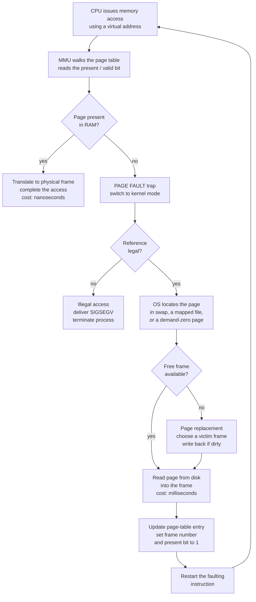

# 🧠 Virtual Memory and Demand Paging

> [!abstract] TL;DR
> **Virtual memory** gives every process the illusion of a large, private, contiguous address space that can be *bigger than physical RAM*. The trick is **demand paging**: the OS keeps only the actively-used pages — a process's **working set** — in RAM and leaves the rest on disk (swap), loading a page **lazily** on first touch. Accessing a non-resident page (present bit = 0) triggers a **page-fault trap**; the OS finds the page on disk, evicts a **victim** frame if memory is full, loads the page, patches the page table, and restarts the instruction. Because a fault costs *milliseconds* against RAM's *nanoseconds*, even a tiny fault rate wrecks performance — and if the combined working sets don't fit, the system **thrashes**, spending all its time paging while CPU utilization collapses.

## Intuition

**Analogy:** You have a **giant research project but only a tiny desk**. You cannot fit every document on the desk at once — so you keep on the desk only the few papers you are reading *right now*, and everything else sits in a **filing cabinet** behind you. When you need a document that isn't on the desk, you stop, walk to the cabinet, fetch it, and (if the desk is full) file away something you haven't touched in a while to make room. From your point of view, you have access to the *entire* cabinet's worth of material; in reality only a handful of pages are ever on the desk.

Virtual memory is exactly this. The **desk is RAM**, the **filing cabinet is disk/swap**, and each **document is a page**. A program *believes* it owns a vast, contiguous address space, but the OS keeps only the pages it is actively using in RAM and fetches the rest **on demand**. The whole scheme works because programs exhibit **locality**: at any moment a process touches only a small, slowly-changing set of pages (its **working set**), so the desk rarely needs to be big. The catch — as with a real desk — is that if you keep needing documents that *aren't* there, you spend all day walking to the cabinet and get no actual work done. That is **thrashing**.

---

## How It Works

### Core Mechanics

1. **The virtual-memory illusion.** Each process runs in its own **virtual address space** — a flat range of addresses starting at 0 that is private, contiguous, and potentially larger than physical RAM. Hardware (the MMU) and the OS translate virtual pages to physical **frames** through **page tables** (the mechanics of the walk, the TLB, and multi-level tables belong to the forthcoming *Paging_and_Page_Tables* note and to [[Virtual_Memory_and_TLB]]). Virtual memory sits on top of the raw allocator described in the forthcoming *Memory_Management_and_Allocation* note.

2. **The key insight: you don't need it all at once.** By the **principle of locality**, a program at any instant references only a small **working set** of pages. So keep the working set resident in RAM and leave everything else on disk. This decouples a process's *virtual size* from *physical RAM*, letting a 4 GB program run comfortably on a machine with 1 GB free — as long as its working set fits.

3. **Demand paging — load lazily.** Pages are **not** loaded when the program starts; they are loaded on **first access**. Each page-table entry carries a **present / valid bit**. On startup almost every entry has present = 0. The first time the CPU touches such a page, address translation fails and the hardware raises a **page-fault trap** — a synchronous exception that switches the CPU into kernel mode (the trap machinery lives in the forthcoming *Interrupts_Traps_and_Dual_Mode_Operation* note; the hardware view is [[Interrupts_and_DMA]]).

4. **Page-fault handling, step by step.** The fault handler:
   - **Checks legality.** Is the faulting address a valid part of the process's mapping? If not, it is a true protection violation → **SIGSEGV**, kill the process.
   - **Locates the page.** It may be in the swap area, in a backing file (memory-mapped), or a fresh zero page.
   - **Finds a frame.** If a free frame exists, use it. If RAM is full, run **page replacement** to pick a **victim** frame and, if the victim is **dirty**, write it back to disk first (which victim to evict is the whole subject of the forthcoming *Page_Replacement_Algorithms* note).
   - **Loads the page** from disk into the frame.
   - **Updates the page-table entry**: set the frame number and present = 1.
   - **Restarts the faulting instruction** — which now succeeds transparently. The program never knows it faulted.

5. **Minor vs major faults.** A **minor (soft) fault** is resolved without touching disk — the page is already in RAM (in the page cache, or shared with another process, or a demand-zero page); the OS just fixes up the page table. A **major (hard) fault** requires reading from disk and is *orders of magnitude* slower. `/usr/bin/time -v` reports both counts. Optimizing memory behavior is largely about turning major faults into minor ones or none.

6. **The latency gap — why fault rate dominates.** A RAM access is ~**100 nanoseconds**; a hard fault to a spinning disk is ~**8 milliseconds** — roughly **80,000×** slower (even NVMe SSDs are ~100 µs, ~1,000× slower). The **Effective Access Time** blends the two by the fault probability *p*:

   > EAT = (1 − p) × t_ram + p × t_fault

   With t_ram = 100 ns and t_fault = 8 ms, a fault rate of just **p = 0.001** gives EAT ≈ 8,100 ns — an **~81× slowdown**. To keep degradation under 10 % you need **p < ~1.25 × 10⁻⁶**, i.e. a hit ratio better than **99.9999 %**. This arithmetic is *why* demand paging only works when locality keeps the fault rate microscopic.

7. **Copy-on-write (CoW).** `fork()` would be ruinously expensive if it duplicated the whole address space. Instead the OS maps parent and child to the **same physical frames marked read-only**; a page is copied only when one side *writes* it (the write faults, the handler duplicates just that page). This makes `fork` cheap and is why `fork`+`exec` rarely copies anything — see [[Processes_and_the_Process_Model]].

8. **Memory-mapped files (mmap).** `mmap()` maps a file (or anonymous region) directly into the address space. Reads and writes to those addresses become **demand-paged I/O** against the file through the **page cache** — no explicit `read`/`write` syscalls, and pages are shared across processes mapping the same file. This is the mechanism behind loading shared libraries, large read-only datasets, and databases that mmap their files (the file-system side belongs to the forthcoming *File_Systems_and_Abstractions* note; the hardware analogue of mapping into an address space is [[Memory_Mapped_IO]], though that maps *device registers* rather than files).

9. **Overcommit, swapping, and the OOM killer.** Because most allocated pages are never all touched at once, kernels **overcommit** — they hand out more virtual memory than physical RAM plus swap. Cold pages get pushed to the **swap area / page file** to reclaim frames. If demand genuinely exceeds RAM + swap and pages cannot be reclaimed, Linux invokes the **OOM killer** to sacrifice a process. Overcommit is a calculated bet on locality; when the bet is wrong, something dies.

10. **Thrashing — when the bet fails at scale.** Raising the **degree of multiprogramming** (more resident processes) normally *raises* CPU utilization by overlapping one process's I/O with another's compute. But once the **sum of working sets exceeds physical RAM**, every process is missing pages of its own working set, faults skyrocket, processes spend all their time blocked on paging I/O, and **CPU utilization collapses**. The cure is to *bound* the degree of multiprogramming so working sets fit — the **working-set model** tracks each process's active pages over a window and only admits a process if its working set can stay resident; **page-fault-frequency (PFF)** control does the same reactively by giving a process more frames when its fault rate is too high and reclaiming frames when it is too low.

11. **Benefits beyond capacity.** Even with infinite RAM you would still want virtual memory for **isolation** (each process's addresses are private — one cannot read another's memory), **protection** (per-page read/write/execute permissions; see the forthcoming *Protection_and_Access_Control* note), **sharing** (shared libraries and CoW pages mapped once, used many times), **relocation** (the same virtual layout regardless of where in physical RAM it lands), and **fast startup** (demand paging lets a program begin executing after loading only its first few pages).

### Page-Fault Handling Flow



---

## Key Concepts

### Secondary (first exposure)
- **The desk-and-filing-cabinet picture.** RAM is the small desk, disk/swap is the cabinet, a page is a document. You keep only what you're using on the desk.
- **Virtual memory** = each program *thinks* it has a huge private memory even though physical RAM is smaller.
- **Demand paging** = the OS fetches a chunk of memory (a page) only *when the program first uses it*, not all up front.
- **Page fault** = the moment the program touches a page that isn't on the desk yet, so the OS has to go get it. Rare faults are fine; constant faults (**thrashing**) grind everything to a halt.

### Undergraduate (CS core)
- **Present/valid bit** in the page-table entry drives the whole scheme; a 0 bit on access raises a page-fault trap handled by the OS.
- **Working set & locality:** a process references a small, slowly-changing set of pages; keep that resident and the fault rate stays negligible.
- **Effective Access Time:** EAT = (1 − p)·t_ram + p·t_fault; because t_fault ≫ t_ram, even p ≈ 10⁻³ causes a huge slowdown — hence the need for 99.999 %+ hit ratios.
- **Minor vs major faults:** minor is fixed in RAM (page cache / shared / zero page); major hits disk.
- **Page replacement dependency:** when RAM is full a fault must evict a **victim**; dirty victims are written back first. *Which* victim is chosen determines the fault rate (LRU, Clock, etc.).
- **Copy-on-write** makes `fork` cheap; **mmap** maps files into the address space; **swap/page file** backs evicted anonymous pages.
- **Thrashing** and the **degree-of-multiprogramming** curve: utilization rises with more processes, then collapses once working sets overflow RAM.

### Graduate (systems depth)
- **Reverse mapping & the page cache.** Linux unifies file-backed and anonymous pages under the **page cache**; the reverse map (rmap) lets reclaim find every PTE pointing at a physical page so it can be unmapped and written back. `struct page` / `folio` tracks per-page state (dirty, referenced, locked).
- **Working-set model vs PFF.** The working set W(t, Δ) is the set of pages referenced in the last Δ time; admit a process only if ΣW fits in RAM. **Page-fault-frequency** control is the closed-loop alternative: raise a process's resident-set size when its fault rate exceeds an upper threshold, shrink it below a lower threshold — a controller that automatically prevents thrashing.
- **Overcommit policy.** Linux `vm.overcommit_memory` (heuristic / always / never) plus `vm.overcommit_ratio` govern how aggressively virtual memory is oversubscribed; the **OOM killer** uses `oom_score` (tunable via `oom_score_adj`) to choose a victim when reclaim fails.
- **Swappiness and reclaim balance.** `vm.swappiness` trades off evicting anonymous pages (to swap) against dropping file-backed page-cache pages; reclaim walks LRU lists (active/inactive, per-cgroup with memory cgroups).
- **Huge pages.** **Transparent Huge Pages (THP)** back regions with 2 MB pages to shrink TLB pressure and page-table depth, at the cost of larger faults and potential internal fragmentation; explicit `hugetlbfs` gives predictable huge-page reservations for databases and VMs.
- **Prefetching & readahead.** Rather than one page per fault, the kernel **reads ahead** sequential pages and does **swap prefetch** to amortize disk latency — turning some would-be major faults into hits.
- **Interaction with page replacement is bidirectional.** Demand paging *creates* the eviction problem, and the replacement policy *bounds* the achievable fault rate; the two are studied together (see the forthcoming *Page_Replacement_Algorithms* note).

---

## Python Demo

Two independent experiments, NumPy + Matplotlib only. **Figure 1** shows the *performance cliff*: Effective Access Time and slowdown as a function of the page-fault rate, for a spinning disk vs an NVMe SSD — demonstrating why the hit ratio must be extreme. **Figure 2** simulates *thrashing*: CPU utilization vs the degree of multiprogramming, rising as I/O overlaps then collapsing once the combined working sets overflow physical RAM, alongside the **working-set** view of how many frames each process actually gets to keep resident.

```python
# Virtual memory / demand paging: (1) the effective-access-time cliff and
# (2) the thrashing curve with a working-set view. numpy + matplotlib only.
import numpy as np
import matplotlib.pyplot as plt

# =====================================================================
# FIGURE 1 -- Effective Access Time vs page-fault rate (the cliff)
# =====================================================================
t_ram_ns   = 100.0          # RAM access ~100 ns
t_hdd_ns   = 8.0e6          # hard fault to spinning disk ~8 ms  = 8,000,000 ns
t_nvme_ns  = 1.0e5          # hard fault to NVMe SSD    ~100 us =   100,000 ns

# page-fault probability per memory access, swept over many orders
p = np.logspace(-9, -2, 500)

def eat(t_fault):
    return (1.0 - p) * t_ram_ns + p * t_fault      # EAT formula

eat_hdd,  eat_nvme  = eat(t_hdd_ns),  eat(t_nvme_ns)
slow_hdd, slow_nvme = eat_hdd / t_ram_ns, eat_nvme / t_ram_ns

# fault rate at which slowdown hits 2x (overhead == one RAM access):
#   p * t_fault = t_ram  ->  p = t_ram / t_fault
p_2x_hdd  = t_ram_ns / t_hdd_ns
p_2x_nvme = t_ram_ns / t_nvme_ns

fig1, (axA, axB) = plt.subplots(1, 2, figsize=(13, 5))

axA.loglog(p, eat_hdd,  color="#b91c1c", lw=2, label="HDD fault ~ 8 ms")
axA.loglog(p, eat_nvme, color="#2563eb", lw=2, label="NVMe fault ~ 100 us")
axA.axhline(t_ram_ns, color="#059669", ls="--", lw=1.5, label="pure RAM = 100 ns")
axA.set_xlabel("Page-fault rate  p  (faults per access)")
axA.set_ylabel("Effective Access Time  (ns, log scale)")
axA.set_title("Even a tiny fault rate destroys effective access time")
axA.grid(True, which="both", alpha=0.3)
axA.legend()

axB.semilogx(p, slow_hdd,  color="#b91c1c", lw=2, label="HDD")
axB.semilogx(p, slow_nvme, color="#2563eb", lw=2, label="NVMe")
axB.axhline(2.0, color="#6b7280", ls=":", lw=1.2, label="2x slowdown")
axB.axvline(p_2x_hdd,  color="#b91c1c", ls=":", lw=1)
axB.axvline(p_2x_nvme, color="#2563eb", ls=":", lw=1)
axB.set_ylim(1, 100)
axB.set_xlabel("Page-fault rate  p  (faults per access)")
axB.set_ylabel("Slowdown vs pure RAM  (x)")
axB.set_title("Hit ratio must be ~99.999%+ to stay near RAM speed")
axB.grid(True, which="both", alpha=0.3)
axB.legend()

fig1.tight_layout()
fig1.savefig("vm_eat_cliff.png", dpi=120)

print(f"HDD:  slowdown doubles at p = {p_2x_hdd:.2e}  "
      f"(need p < ~{p_2x_hdd/10:.1e} to stay under 10% overhead)")
print(f"NVMe: slowdown doubles at p = {p_2x_nvme:.2e}")
print(f"At p = 1e-3 on HDD: EAT = {eat(t_hdd_ns)[np.argmin(np.abs(p-1e-3))]:.0f} ns "
      f"(~{(eat(t_hdd_ns)/t_ram_ns)[np.argmin(np.abs(p-1e-3))]:.0f}x slowdown)")

# =====================================================================
# FIGURE 2 -- Thrashing: CPU utilization vs degree of multiprogramming
# =====================================================================
M      = 100                       # physical memory, in frames
w      = 10                        # each process's working-set size (frames)
n      = np.arange(1, 41)          # degree of multiprogramming

# Working-set view: with n processes competing for M frames, each keeps at
# most M/n frames resident (fair share), but never needs more than w.
resident = np.minimum(w, M / n)

# Locality cliff: fault rate is ~0 while the resident set covers the working
# set, then explodes as residency drops below w (deficit^3 makes it sharp).
deficit    = np.clip((w - resident) / w, 0.0, 1.0)
fault_rate = 0.0005 + 5.0 * deficit**3      # faults per unit of CPU work

# Time a runnable process spends actually computing vs stalled paging.
# A page fault costs ~200 CPU-work-units of service time (hugely slower).
t_cpu, t_fault_units = 1.0, 200.0
compute_fraction = t_cpu / (t_cpu + fault_rate * t_fault_units)

# I/O overlap: with n processes, the CPU idles only if ALL are blocked on
# ordinary I/O, so utilization rises toward 1 as n grows (before paging bites).
io_block = 0.35
overlap  = 1.0 - io_block**n

cpu_util = overlap * compute_fraction
onset    = M / w                    # thrashing begins when n*w > M  ->  n = M/w
peak_n   = n[np.argmax(cpu_util)]

fig2, (axC, axD) = plt.subplots(1, 2, figsize=(13, 5))

axC.plot(n, cpu_util, color="#7c3aed", lw=2.5, marker="o", ms=3)
axC.axvspan(onset, n[-1], color="#fca5a5", alpha=0.25, label="thrashing zone")
axC.axvline(onset, color="#b91c1c", ls="--", lw=1.5,
            label=f"working sets fill RAM  (n = M/w = {onset:.0f})")
axC.set_xlabel("Degree of multiprogramming  (resident processes)")
axC.set_ylabel("CPU utilization")
axC.set_ylim(0, 1.05)
axC.set_title("CPU utilization rises, then collapses into thrashing")
axC.grid(True, alpha=0.3)
axC.legend(loc="lower center")

axD.plot(n, n * w, color="#ea580c", lw=2, label="total demand  n x w  (frames)")
axD.axhline(M, color="#059669", ls="--", lw=1.5, label=f"physical RAM = {M} frames")
axD.plot(n, resident, color="#2563eb", lw=2, label="resident frames per process")
axD.axvline(onset, color="#b91c1c", ls=":", lw=1)
axD.set_xlabel("Degree of multiprogramming")
axD.set_ylabel("Frames")
axD.set_ylim(0, 3 * M)
axD.set_title("Working-set view: demand outruns RAM past the onset")
axD.grid(True, alpha=0.3)
axD.legend()

fig2.tight_layout()
fig2.savefig("vm_thrashing.png", dpi=120)
plt.show()

print(f"\nPeak CPU utilization at degree n = {peak_n} "
      f"(= M/w = {onset:.0f}); beyond it, thrashing collapses throughput.")
```

Reading the output: in **Figure 1** the EAT curves are pinned near 100 ns while the fault rate is microscopic, then bend sharply upward — the "cliff" — once *p* rises past ~10⁻⁶ (HDD) or ~10⁻⁴ (NVMe); the right panel shows the slowdown crossing 2× at exactly `p = t_ram / t_fault`. In **Figure 2** CPU utilization climbs as more processes overlap their I/O, peaks right where the combined working sets just fill RAM (`n = M/w`), then **collapses** as further processes push everyone below their working set and the machine drowns in paging. The right panel makes the cause explicit: total demand `n·w` crosses physical RAM at the onset, after which each process's resident frames fall below its working set.

---

## Real-World Applications

> **Example — the Linux page cache.** Almost all free RAM on a running Linux box is used as **page cache**: file reads populate it, and `mmap`'d files are served straight from it. Databases and JVMs live or die by how they interact with this cache — a "disk read" that hits the page cache is a *minor* fault (microseconds), a miss is a *major* fault (milliseconds). This is the same demand-paging machinery, applied to file data.

- **Swap & `vm.swappiness`.** The swap area (a partition or file) backs evicted anonymous pages. Tuning `swappiness` shifts reclaim between swapping app memory and dropping page-cache pages — critical on latency-sensitive servers, where admins often set it low to avoid swapping hot process memory.
- **Copy-on-write in `fork`.** Redis's `BGSAVE` and PostgreSQL's per-connection backends rely on CoW so a `fork()` snapshot is cheap until pages are mutated — the same mechanism as [[Processes_and_the_Process_Model]] describes.
- **Memory-mapped databases & data files.** SQLite's mmap mode, LMDB, and many analytics engines `mmap` their files and let the OS's demand paging + page cache do the buffering — trading explicit buffer-pool control for OS-managed paging. Contrast this with engines that manage their own buffer pool and use `O_DIRECT` to bypass the page cache (see [[Storage_Engine_Internals]]).
- **JVM & large heaps.** A JVM heap larger than RAM will silently swap; a full GC that touches the whole heap then triggers a storm of major faults — a classic production incident. Ops teams pin heaps to fit RAM and disable swap for latency SLAs.
- **Transparent Huge Pages.** Enabled by default on many distros to cut TLB misses for big-memory workloads, but notorious for latency spikes in databases (which frequently recommend disabling THP).
- **OOM killer.** When overcommit meets reality, the kernel kills the highest-`oom_score` process — the reason a memory-hungry job sometimes vanishes with "Killed" and a `dmesg` entry rather than a graceful error.

---

## Common Pitfalls

- **Confusing swapping with a working system.** A box that is "using swap" is not necessarily thrashing; a box whose **major-fault rate** is high and whose CPU sits in **iowait** *is*. Watch `si`/`so` in `vmstat` and major faults, not just swap usage.
- **Overcommit surprises.** `malloc()` succeeding does **not** mean the memory exists — pages are only backed on first touch. A program that allocates lazily can be OOM-killed mid-run long after allocation appeared to succeed. Touch/`mlock` critical pages if you need guarantees.
- **Assuming `mmap` is free.** Mapping a huge file costs almost nothing up front, but *iterating* it faults in every page; sequential access benefits from readahead, but random access over a file larger than RAM degrades to one major fault per touch.
- **Ignoring the EAT arithmetic.** Designers assume "a few percent misses is fine." At disk latencies, a 1 % fault rate is an ~80,000× penalty per fault — the whole point of the effective-access-time calculation is that fault rates must be *microscopic*, not merely "low."
- **Fighting the page cache.** Double buffering — a database maintaining its own buffer pool *and* letting the OS cache the same file — wastes RAM and causes inconsistent latency. Pick one: buffer pool + `O_DIRECT`, or rely on the OS page cache.
- **Curing thrashing by adding processes.** When utilization is collapsing, the instinct to "run more work" makes it worse; the fix is to *lower* the degree of multiprogramming (suspend processes) so working sets fit — the working-set / PFF principle.
- **Blaming the page-replacement policy for thrashing.** No eviction policy can help when the combined working sets simply exceed RAM; thrashing is an admission-control problem, not a replacement problem (see the forthcoming *Page_Replacement_Algorithms* note).

---

## Related Concepts

- [[Processes_and_the_Process_Model]] — each process's private virtual address space and the copy-on-write `fork` that this note's paging machinery implements.
- [[Virtual_Memory_and_TLB]] — the hardware side of virtual memory: address translation, multi-level page tables, and the TLB that caches translations so hits stay fast.
- [[Cache_Hierarchy]] — RAM is itself a cache tier over disk; the same locality and hit-ratio logic governs both CPU caches and demand paging.
- [[DRAM_Architecture]] — the physical "desk" (RAM) that holds resident frames, and why its capacity bounds the working set that fits.
- [[Storage_Interfaces_NVMe_SATA]] — the backing store for swap and mmap'd files; the enormous RAM-vs-disk latency gap that makes the effective-access-time cliff so steep.
- [[Interrupts_and_DMA]] — the trap/exception mechanism that delivers a page fault to the kernel and the DMA that moves the page from disk into a frame.
- [[Memory_Mapped_IO]] — the hardware idea of mapping something into the address space; contrasts with mmap of *files* (this note) which maps file data rather than device registers.
- [[Storage_Engine_Internals]] — how databases interact with (or deliberately bypass) the OS page cache with their own buffer pools and `O_DIRECT`.

*Forthcoming Operating-Systems siblings that will link here:* Paging_and_Page_Tables (the address-translation mechanics this note builds on), Memory_Management_and_Allocation (the allocator beneath virtual memory), Page_Replacement_Algorithms (which victim to evict on a fault), Interrupts_Traps_and_Dual_Mode_Operation (how a fault traps into the kernel), File_Systems_and_Abstractions (the backing files behind mmap and swap), Memory_Hierarchy_and_Caching (RAM-as-cache framing), and Protection_and_Access_Control (per-page permissions).

---

## Review Questions

1. **(Secondary)** Using the desk-and-filing-cabinet analogy, explain what a *page fault* is and why a program can run even when its total memory is far larger than the desk (RAM). What everyday situation corresponds to *thrashing*?
2. **(Undergraduate)** Given a RAM access time of 100 ns and a page-fault service time of 8 ms, write the Effective Access Time formula and compute the EAT and slowdown at a fault rate of p = 0.001. What maximum fault rate keeps the slowdown under 10 %, and what does that imply about the required hit ratio?
3. **(Undergraduate)** Trace, in order, everything the OS does between a CPU touching a non-resident page and the faulting instruction re-executing successfully. Where in that sequence does *page replacement* get involved, and what extra step is needed if the chosen victim is dirty?
4. **(Scenario)** A server's CPU utilization has dropped to 15 %, `vmstat` shows high `si`/`so` and most CPU time in iowait, and adding more worker processes makes it *worse*. Diagnose the condition, explain the shape of the degree-of-multiprogramming curve you are on, and describe how the working-set model or page-fault-frequency control would fix it.
5. **(Graduate)** Explain how copy-on-write, demand-zero pages, and the unified page cache all reduce a fault from a *major* fault to a *minor* one or eliminate it entirely. Then argue why no page-replacement algorithm — however clever — can prevent thrashing once the sum of working sets exceeds physical RAM.

---

## Sources

- Silberschatz, Galvin, Gagne, *Operating System Concepts*, 10th ed. — Ch. 10 "Virtual Memory" (demand paging, effective access time, thrashing, the working-set model, page-fault frequency).
- Remzi and Andrea Arpaci-Dusseau, *Operating Systems: Three Easy Pieces* — "Beyond Physical Memory: Mechanisms" and "Policies". <https://pages.cs.wisc.edu/~remzi/OSTEP/>
- Denning, P. J., "The Working Set Model for Program Behavior", *CACM* 11(5), 1968 — the original working-set and thrashing analysis. <https://dl.acm.org/doi/10.1145/363095.363141>
- Tanenbaum and Bos, *Modern Operating Systems*, 4th ed. — Ch. 3 "Memory Management" (paging, page faults, replacement, thrashing).
- Gorman, M., *Understanding the Linux Virtual Memory Manager* — reverse mapping, the page cache, swapping, and reclaim internals. <https://www.kernel.org/doc/gorman/>
- `man 2 mmap`, `man 2 madvise`, `man 5 proc` (VmRSS, oom_score), Linux Documentation `admin-guide/sysctl/vm` (swappiness, overcommit, THP). <https://man7.org/linux/man-pages/>

---

#operating-systems #virtual-memory #demand-paging #page-fault #thrashing
