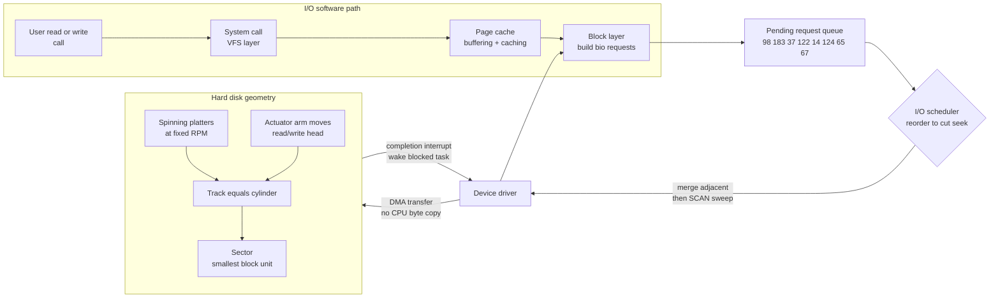

# 💽 Disk Scheduling and I/O Management

> [!abstract] TL;DR
> On a spinning disk the **read/write head is physically slow to move**, so the order in which the OS services pending block requests dominates throughput. Serving them in arrival order (**FCFS**) wastes enormous seek travel; **SSTF** greedily picks the nearest request (fast but **starves** far cylinders); the **SCAN/elevator** family sweeps the head smoothly across the disk and back, cutting total seek distance while **bounding** how long any request can wait. The broader **I/O subsystem** — layered software from system call down through the block layer, driver, DMA, and interrupt handler — does buffering, caching, request merging, and fairness (QoS) on top of this. On **SSDs there is no seek**, so these seek-optimizing schedulers largely give way to `none`/`mq-deadline`/`Kyber`/`BFQ`.

---

## Intuition

**Analogy:** A hard-disk head is an **elevator in a tall building** and the pending block requests are people waiting on scattered floors. If the elevator answers calls in the exact order the buttons were pressed — floor 2, then floor 40, then floor 5, then floor 38 — it burns almost all its time riding up and down past floors it will have to revisit. A sane elevator instead **sweeps smoothly upward**, stopping at every requested floor on the way to the top, then reverses and sweeps down. Everyone still gets served, total travel collapses, and nobody at the bottom is ignored forever just because a crowd keeps pressing buttons near the middle.

That sweep is literally called the **elevator algorithm** (**SCAN**). Disk scheduling is nothing more than reordering the queue of cylinder requests so the mechanical head — which can move only ~a few milliseconds per centimeter of travel — walks the least total distance while still treating far-away requests fairly. It is the same "who goes next?" problem as [[CPU_Scheduling_Algorithms]], but the cost being minimized is *physical seek distance* instead of CPU waiting time.

---

## How It Works

### Why a spinning disk is slow: the three parts of access time

A hard disk drive (HDD) is a stack of magnetized **platters** spinning at a fixed rate (5,400–15,000 RPM). Data lives in concentric **tracks**; the same track across all platters forms a **cylinder**; each track is divided into **sectors** (the smallest addressable block, historically 512 bytes, now commonly 4 KiB). A single **read/write head** per surface rides on a shared **actuator arm**. To read a block, three delays stack up:

1. **Seek time** — moving the arm to the target cylinder. This is *mechanical* and dominates: several milliseconds, and it grows with the distance travelled. This is the *only* term disk scheduling can attack.
2. **Rotational latency** — waiting for the target sector to spin under the head. On average half a rotation (~2 ms at 15k RPM, ~4 ms at 7.2k RPM).
3. **Transfer time** — actually streaming the bytes once positioned; comparatively tiny for a single block.

Because seek + rotation are fixed *per request* and independent of size, **sequential access is dramatically faster than random access**: one seek then a long streaming read, versus one seek *and* one rotation *per* scattered block. This is the same locality argument that drives the [[Cache_Hierarchy]] and the memory hierarchy — amortize the expensive positioning over as much contiguous data as possible. A random-read HDD does ~100–200 IOPS; the same drive streaming sequentially moves 100+ MB/s.

### Disk scheduling algorithms

Given a set of pending cylinder requests and the head's current position, the scheduler chooses a service order. The classic policies (with the textbook queue `98 183 37 122 14 124 65 67`, head at `53`, on a 0–199 disk):

- **FCFS (First-Come First-Served)** — service in arrival order. Fair and starvation-free, but the head thrashes back and forth. *Total seek = 640.*
- **SSTF (Shortest-Seek-Time-First)** — always jump to the *nearest* pending cylinder. Greedy, low total travel (*236*), but it is the disk analogue of Shortest-Job-First: a steady stream of requests near the head can **starve** requests at the disk edges indefinitely.
- **SCAN (the elevator)** — head moves in one direction servicing every request until it reaches the disk end, then reverses. Bounds worst-case wait to roughly one full sweep. Goes all the way to the physical edge even with no request there. *Total seek = 331.*
- **C-SCAN (Circular SCAN)** — sweep up servicing requests to the end, then **jump straight back to cylinder 0** without servicing on the return, and sweep up again. Treats the cylinders as a ring, giving **more uniform** wait times than SCAN (which favors middle cylinders). *Total seek = 382 including the return jump.*
- **LOOK / C-LOOK** — the practical refinement: like SCAN/C-SCAN but the head reverses (or wraps) at the **last actual request** rather than the physical disk edge, saving the wasted travel to cylinders 0 and 199. *LOOK = 299, C-LOOK = 322.* Real kernels use LOOK-style logic, not textbook SCAN.

The trade-off is exactly the throughput-versus-fairness tension of CPU scheduling: **SSTF maximizes throughput but can starve; SCAN/LOOK sacrifice a little total distance to bound every request's wait.**

### The I/O subsystem: layers from syscall to spindle

Disk scheduling is one stage inside a layered I/O stack. Each layer adds a service and hides the layer below:

1. **User-level I/O** — library calls (`fread`, buffered streams) that batch small requests.
2. **Device-independent OS layer** — naming, protection, **buffering**, **caching** (the page cache absorbs re-reads and coalesces writes), and **spooling** (queue exclusive devices like printers so many jobs appear concurrent). The **block layer** lives here: it turns file offsets into block requests, then **merges** adjacent requests and **reorders** them via the scheduler.
3. **Device drivers** — translate generic block operations into device-specific commands.
4. **Interrupt handlers** — the disk raises an **interrupt** on completion so the CPU need not poll; the handler wakes the blocked process.
5. **Hardware** — controller, bus, and the drive itself, with **DMA** streaming the bytes directly to memory without the CPU copying each word (see [[Interrupts_and_DMA]]).

In Linux the modern block layer is **blk-mq (multi-queue)**, which gives each CPU its own submission queue to avoid a global lock, then hands work to a scheduler (`none`, `mq-deadline`, `Kyber`, `BFQ`) — see [[IO_Scheduling_and_io_uring]]. Requests are held briefly in a **plug** so nearby requests can be **merged** before **unplug** flushes them to the driver.

### How SSDs upend all of this

A solid-state drive has **no moving head and no rotation** — random access is nearly as fast as sequential, so seek-minimizing schedulers buy almost nothing. The block layer instead favors simple policies: **`none`** (pass straight through, best for NVMe where the device has its own deep parallel queues) or **`mq-deadline`** (latency guarantees). New concerns dominate: the **Flash Translation Layer (FTL)** remaps logical blocks to physical flash pages because flash must be **erased in large blocks before rewrite**, causing **write amplification** (one logical write triggers extra physical writes during garbage collection), and **wear leveling** to spread erasures. This is why log-structured and append-only designs (see [[LSM_Trees]] and [[Write_Ahead_Logging]]) pair so well with flash.

### Flow / Architecture



---

## Key Concepts

### Secondary (plain-language)
- A hard disk has a **needle-like head** that must physically move to reach data; moving it is the slow part.
- Answering requests in the smart order — sweeping across the disk like an elevator instead of jumping around randomly — makes the disk much faster.
- **Reading in a row (sequential)** is far faster than **jumping around (random)**, which is why big files load quickly but many tiny scattered reads feel slow.

### Undergraduate (systems course)
- **Access time = seek time + rotational latency + transfer time**, and *why seek dominates* on HDDs so scheduling targets it.
- The five/​six algorithms and their total-seek behavior: **FCFS** (fair, high travel), **SSTF** (greedy, can starve), **SCAN/C-SCAN** (bounded wait), **LOOK/C-LOOK** (edge-trimmed, used in practice).
- The **throughput vs fairness/starvation** trade-off, mirrored from [[CPU_Scheduling_Algorithms]] (SSTF ≈ SJF, SCAN ≈ bounded-wait).
- The **I/O software layers**: user I/O, device-independent OS layer, drivers, interrupt handlers, hardware; and **buffering, caching, spooling**.
- Why **sequential I/O** wins and how the **page cache** and request **merging** exploit it.

### Graduate (kernel-level)
- **Linux blk-mq**: per-CPU software queues feeding hardware dispatch queues, eliminating the single-queue lock that throttled SSD/NVMe IOPS; pluggable schedulers **`none`**, **`mq-deadline`**, **`Kyber`** (latency-target, self-tuning), **`BFQ`** (Budget Fair Queueing, weighted per-cgroup fairness for desktops).
- **QoS and fairness**: `blkio`/`io` **cgroup** controllers throttle bandwidth/IOPS per container; **deadline** schedulers cap worst-case latency, connecting to the guarantees discussed for real-time and embedded operating systems.
- **SSD internals**: the **FTL**, **write amplification factor**, **garbage collection**, **TRIM/discard**, over-provisioning, and **wear leveling**; why append-only/log-structured write patterns minimize amplification.
- **NVMe** exposes up to 65,535 deep parallel queues so the *device* schedules internally, which is why `none` often beats any host-side reordering (see [[Storage_Interfaces_NVMe_SATA]]).
- **RAID and parallelism**: **striping** (RAID 0) spreads a file across N disks for N-way parallel seek/transfer; parity (RAID 5/6) and mirroring (RAID 1) trade capacity for redundancy — the scheduler now reasons about an *array*, not one arm.
- **Measuring I/O**: **IOPS**, **throughput (MB/s)**, **latency (p50/p99)**, and **queue depth**; Little's Law ties them together, and deeper queues let schedulers reorder more aggressively (the domain of OS performance analysis and tuning).

---

## Python Demo

```python
# Compare classic disk-scheduling algorithms on ONE identical request set.
# For each policy we compute the head's service order, the TOTAL HEAD MOVEMENT
# (sum of seek distances), then plot each head-movement trajectory and a
# bar chart of total seek distance. Takeaways the plots reveal:
#   * SSTF and the SCAN family DRAMATICALLY beat FCFS on total travel
#   * SSTF is greedy and can STARVE edge cylinders; SCAN bounds every wait
# numpy + matplotlib only.
import numpy as np
import matplotlib.pyplot as plt

# ---- Shared workload (the classic OS-textbook example) ----
DISK_MIN, DISK_MAX = 0, 199
START = 53
REQUESTS = [98, 183, 37, 122, 14, 124, 65, 67]
DIRECTION_UP = True  # initial sweep direction: toward larger cylinder numbers


def total_movement(seq):
    """Total head travel = sum of |consecutive cylinder differences|."""
    a = np.asarray(seq, dtype=float)
    return float(np.abs(np.diff(a)).sum())


def fcfs(start, reqs):
    """Serve strictly in arrival order — fair but maximal thrashing."""
    return [start] + list(reqs)


def sstf(start, reqs):
    """Always jump to the NEAREST pending cylinder (greedy)."""
    pending, cur, seq = list(reqs), start, [start]
    while pending:
        nxt = min(pending, key=lambda r: abs(r - cur))
        pending.remove(nxt)
        seq.append(nxt)
        cur = nxt
    return seq


def scan(start, reqs, up=True):
    """Elevator: sweep to the DISK EDGE, then reverse."""
    lower = sorted(r for r in reqs if r < start)
    upper = sorted(r for r in reqs if r >= start)
    seq = [start]
    if up:
        seq += upper + [DISK_MAX] + lower[::-1]
    else:
        seq += lower[::-1] + [DISK_MIN] + upper
    return seq


def cscan(start, reqs):
    """Circular SCAN: sweep up to the edge, jump to 0, sweep up again."""
    lower = sorted(r for r in reqs if r < start)
    upper = sorted(r for r in reqs if r >= start)
    return [start] + upper + [DISK_MAX, DISK_MIN] + lower


def look(start, reqs, up=True):
    """LOOK: like SCAN but reverse at the LAST request, not the disk edge."""
    lower = sorted(r for r in reqs if r < start)
    upper = sorted(r for r in reqs if r >= start)
    seq = [start]
    if up:
        seq += upper + lower[::-1]
    else:
        seq += lower[::-1] + upper
    return seq


def clook(start, reqs):
    """C-LOOK: sweep up to last request, wrap to lowest request, sweep up."""
    lower = sorted(r for r in reqs if r < start)
    upper = sorted(r for r in reqs if r >= start)
    return [start] + upper + lower


ALGOS = {
    "FCFS":   fcfs(START, REQUESTS),
    "SSTF":   sstf(START, REQUESTS),
    "SCAN":   scan(START, REQUESTS, DIRECTION_UP),
    "C-SCAN": cscan(START, REQUESTS),
    "LOOK":   look(START, REQUESTS, DIRECTION_UP),
    "C-LOOK": clook(START, REQUESTS),
}

# ---- Print total head movement per algorithm ----
print(f"Head start = {START}, requests = {REQUESTS}\n")
print(f"{'Algorithm':10} {'Total seek':>10}   Service order")
totals = {}
for name, seq in ALGOS.items():
    totals[name] = total_movement(seq)
    order = " -> ".join(str(c) for c in seq)
    print(f"{name:10} {totals[name]:10.0f}   {order}")

# ---- Plot 1: head-movement trajectory for each algorithm ----
# x = service step (time), y = cylinder position. FCFS zig-zags; SCAN sweeps.
n = len(ALGOS)
fig, axes = plt.subplots(2, 3, figsize=(14, 8), constrained_layout=True)
for ax, (name, seq) in zip(axes.ravel(), ALGOS.items()):
    steps = np.arange(len(seq))
    ax.plot(steps, seq, "-o", color="tab:blue", markersize=5)
    ax.plot(0, seq[0], "s", color="tab:red", markersize=9, label="head start")
    ax.set_title(f"{name}   total seek = {totals[name]:.0f}", fontsize=10)
    ax.set_xlabel("service step (time)")
    ax.set_ylabel("cylinder")
    ax.set_ylim(DISK_MIN - 5, DISK_MAX + 5)
    ax.axhline(DISK_MIN, ls=":", color="grey")
    ax.axhline(DISK_MAX, ls=":", color="grey")
    ax.grid(True, alpha=0.3)
    ax.legend(fontsize=8, loc="lower right")
fig.suptitle("Disk head trajectories: same requests, six scheduling policies",
             fontsize=13)

# ---- Plot 2: bar chart of total seek distance ----
names = list(totals.keys())
vals = [totals[k] for k in names]
colors = ["tab:red" if k == "FCFS" else
          ("tab:orange" if k == "SSTF" else "tab:green") for k in names]
fig2, ax2 = plt.subplots(figsize=(9, 5), constrained_layout=True)
bars = ax2.bar(names, vals, color=colors, edgecolor="black")
ax2.bar_label(bars, fmt="%.0f", padding=3)
ax2.set_ylabel("total head movement (cylinders)")
ax2.set_title("FCFS thrashes; SSTF and the SCAN/LOOK family slash seek distance")
plt.show()

# Expected output (this classic instance):
#   FCFS=640, SSTF=236, SCAN=331, C-SCAN=382, LOOK=299, C-LOOK=322
#   -> SSTF wins raw distance but starves edges; LOOK/SCAN bound every wait.
```

---

## Real-World Applications

> **Linux block layer (`blk-mq` + `mq-deadline`/`Kyber`/`BFQ`):** every read/write to a mounted filesystem passes through the kernel's I/O scheduler, which **merges** adjacent block requests and reorders them. On rotational disks a deadline/elevator policy minimizes seek travel exactly as SCAN does; on NVMe SSDs the default flips to **`none`** because the device's own deep parallel queues schedule better than the host — a direct real-world consequence of "no seek means no seek-optimizer." See [[IO_Scheduling_and_io_uring]].

- **Databases** obsess over sequential I/O for precisely this reason: a B-tree index ([[BTree_Indexes]]) clusters related keys so range scans become near-sequential seeks, while **write-ahead logs** ([[Write_Ahead_Logging]]) and **LSM trees** ([[LSM_Trees]]) turn random writes into fast **sequential appends** — trading read amplification for seek-free writes.
- **RAID arrays** stripe a file across many spindles so N heads seek in parallel, multiplying effective IOPS and bandwidth; the OS scheduler now optimizes across the array.
- **Video streaming / large sequential media servers** deliberately lay files out contiguously and use large read-ahead so one seek amortizes over megabytes.
- **cgroup I/O throttling** in containers/Kubernetes uses the block layer's `io` controller to cap a noisy tenant's IOPS and bandwidth, giving other tenants deadline/QoS guarantees.
- **DMA offload** (see [[Interrupts_and_DMA]]) lets the disk controller stream bytes to RAM while the CPU runs other work, so scheduling and transfer overlap.

---

## Common Pitfalls

- **Assuming SSTF is "just better" because it has the lowest total seek** — it is the disk twin of Shortest-Job-First and can **starve** requests at the disk edges under sustained load. SCAN/LOOK give up a little distance precisely to bound worst-case wait.
- **Running a seek-optimizing scheduler on an SSD/NVMe** — there is no head to move, so SCAN-style reordering wastes CPU and adds latency. Use `none` (NVMe) or `mq-deadline`; benchmark before assuming the HDD-era default fits.
- **Confusing SCAN with LOOK** — textbook SCAN drives the head to the physical disk edge even with no request there; real systems use **LOOK**, which reverses at the last actual request. Reporting SCAN numbers where a system really does LOOK overstates travel.
- **Ignoring rotational latency and only counting seek** — the demo (and most homework) models seek distance alone, but on a real drive rotational latency is comparable; production schedulers (SPTF, shortest-positioning-time-first) account for both.
- **Optimizing scheduling while doing random I/O** — no scheduler rescues a workload of scattered single-block reads; the real fix is *layout* (make the access sequential) and *caching*, the same locality principle as the [[Cache_Hierarchy]].
- **Forgetting write amplification on flash** — treating an SSD like a disk with small random writes can trigger heavy FTL garbage collection, silently multiplying physical writes and burning endurance. Batch and align writes; prefer log-structured patterns.
- **Deep queue depth without QoS** — letting one process fill the request queue reorders everyone else's latency into starvation; use cgroup `io` limits or a fairness scheduler like BFQ.

---

## Related Concepts

- [[CPU_Scheduling_Algorithms]] — the direct analogue: SSTF mirrors Shortest-Job-First (greedy, starves), SCAN mirrors bounded-wait fairness; same throughput-vs-fairness trade space, different resource.
- [[Interrupts_and_DMA]] — disk completions arrive as interrupts, and DMA streams the bytes to memory without CPU copying, overlapping transfer with computation.
- [[IO_Scheduling_and_io_uring]] — the modern Linux realization: blk-mq, `mq-deadline`/`Kyber`/`BFQ`, request merging, and async submission via io_uring.
- [[Storage_Interfaces_NVMe_SATA]] — the hardware interfaces; NVMe's deep parallel queues explain why host-side seek scheduling fades on SSDs.
- [[Cache_Hierarchy]] — the locality/amortization argument (sequential beats random) that also drives disk layout and the page cache.
- [[Memory_Mapped_IO]] — how devices and their registers are addressed so drivers can command the disk controller.
- [[BTree_Indexes]] — database index that clusters keys to keep range scans near-sequential, minimizing seeks.
- [[Write_Ahead_Logging]] — turns random durability writes into fast sequential log appends, exploiting the sequential-I/O advantage.
- [[LSM_Trees]] — log-structured storage that converts random writes into sequential flushes, ideal for both HDD seek costs and SSD write amplification.

*Not-yet-created OS siblings referenced in prose (link once written):* I/O Systems and Device Drivers, File System Implementation, Modern File Systems and Storage, Memory Hierarchy and Caching, Performance Analysis and OS Tuning, and Real-Time and Embedded Operating Systems.

---

## Review Questions

**Beginner**
1. Name the three components of disk access time and state which one disk scheduling actually tries to reduce, and why that one dominates on a spinning disk.
2. In one sentence each, explain why servicing requests in arrival order (FCFS) is wasteful and how the elevator sweep (SCAN) fixes it.

**Intermediate**
3. SSTF produces the smallest total seek distance in the classic example (236 vs SCAN's 331), yet real systems prefer SCAN/LOOK-style policies. Give the specific failure mode of SSTF and explain how SCAN bounds it.
4. A colleague sets the Linux I/O scheduler to `BFQ` on a fleet of NVMe SSDs and IOPS drops versus `none`. Explain, in terms of seek time and device-side queuing, why the seek-optimizing/​fairness reordering hurts here.

**Advanced**
5. Compare C-SCAN to SCAN in terms of the *distribution* of per-request wait times, not just the total distance, and explain the geometric reason C-SCAN gives more uniform waits. Then explain why LOOK/C-LOOK are what production kernels actually implement.
6. Log-structured designs (LSM trees, write-ahead logs) and flash SSDs both favor sequential/append-only writes but for *different* physical reasons. Explain each reason (seek avoidance on HDD vs write amplification / erase-block behavior on flash) and why one design pattern happens to serve both.

---

## Sources

- Remzi & Andrea Arpaci-Dusseau, *Operating Systems: Three Easy Pieces* — "Hard Disk Drives" & "I/O Devices" chapters — [https://pages.cs.wisc.edu/~remzi/OSTEP/](https://pages.cs.wisc.edu/~remzi/OSTEP/)
- Silberschatz, Galvin & Gagne, *Operating System Concepts* (10th ed.), Ch. 11 "Mass-Storage Structure" (disk scheduling) & Ch. 12 "I/O Systems".
- Tanenbaum & Bos, *Modern Operating Systems* (4th ed.), Ch. 5 "Input/Output".
- Linux kernel documentation, *Multi-Queue Block IO Queueing Mechanism (blk-mq)* & block scheduler docs — [https://docs.kernel.org/block/blk-mq.html](https://docs.kernel.org/block/blk-mq.html)
- J. Axboe et al., "BFQ (Budget Fair Queueing) I/O scheduler" documentation — [https://docs.kernel.org/block/bfq-iosched.html](https://docs.kernel.org/block/bfq-iosched.html)

---

#operating-systems #disk-scheduling #io-management #elevator-algorithm #seek-time
