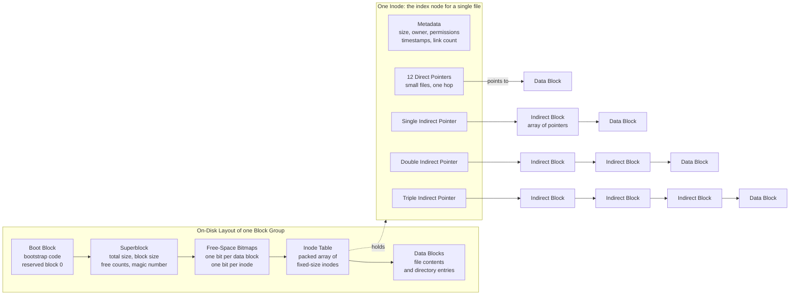

# 🗂️ File System Implementation

> [!abstract] TL;DR
> A file system turns a flat array of numbered disk **blocks** into named, growable files. The disk is carved into a **boot block**, a **superblock** (file-system-wide metadata), **free-space bitmaps**, an **inode table**, and **data blocks**. Each file is described by one **inode** — a fixed-size record holding size, owner, permissions, timestamps, link count, and, crucially, the **pointers to its data blocks**. The winning pointer scheme is **indexed allocation**: a handful of **direct** pointers for small files plus **single, double, and triple indirect** blocks that fan out to reach terabyte-scale files, giving fast small-file access *and* a huge maximum size. Modern file systems (ext4, NTFS, XFS) replace long pointer lists with **extents** — `(start, length)` runs — and add **journaling** for crash consistency. The whole design fights one fact: disk I/O happens in blocks and blocks are expensive, so cache aggressively and keep related data close.

## Intuition

**Analogy:** Imagine a giant storage facility with a million identical numbered lockers (the disk blocks), and you need a scheme to record **which lockers hold the contents of each customer's belongings (a file)**.

- **Contiguous allocation** is like telling a customer *"your stuff is in lockers 10 through 19, in a row."* One note — a start and a length — describes everything, and walking to any item is trivial. But if the customer's belongings grow, locker 20 may already be taken, so you must haul everything to a bigger empty stretch. Over months of customers moving in and out, the facility fills with awkward gaps: 200 free lockers total, but never 15 in a row. That wasted, unusable scatter is **external fragmentation**.
- **Linked allocation** avoids the growth problem: each locker holds some belongings *plus a slip of paper naming the next locker*. The customer can grow forever, and any free locker anywhere will do — no fragmentation. But to reach the 900th item you must open 900 lockers in sequence, following slip after slip. **Random access is a treasure hunt**, and every locker sacrifices a little space to hold its pointer.
- **Indexed allocation** keeps *one master list-locker* per customer — the **inode** — that holds the numbers of every locker their belongings occupy. To reach any item you read the master list once, then jump straight to the right locker. You get random access *and* the freedom to grow *and* no external fragmentation. This is the design real file systems use.

The only wrinkle: a single master list-locker can't name enough lockers for a truly enormous file. So the inode keeps a few pointers **directly** for the common small file, and for big files it points to *lists of lists* — **indirect blocks** — a tree that expands to cover billions of blocks while a tiny file still costs one hop.

---

## How It Works

### The on-disk layout

The raw disk (or partition) is just a sequence of fixed-size **blocks** — typically 512 B to 64 KB, most commonly 4 KB. A file system imposes structure on that sequence. Reading from the start of a partition you find:

1. **Boot block** — reserved (often block 0) for bootstrap code the firmware jumps to; ignored by the file system itself.
2. **Superblock** — the file system's identity card: total size, block size, number of inodes and free blocks/inodes, the location of the inode table and bitmaps, and a **magic number** so the OS can recognize the format. Corrupt the superblock and the whole volume is unreadable, so it is **replicated** across the disk.
3. **Free-space management structures** — usually **bitmaps**: one bit per data block and one bit per inode, `1` meaning "in use". A bitmap makes "find a free block near block N" a fast bit scan and enables locality-aware allocation.
4. **Inode table** — a dense array of fixed-size inodes. Because inodes are fixed size and packed in an array, **inode number → disk offset is pure arithmetic** (`inode_table_start + inode_number × inode_size`).
5. **Data blocks** — the bulk of the disk, holding file contents *and* directory entries (a directory is just a special file whose data maps names to inode numbers).

Real file systems split the disk into many **block groups** (ext) or **cylinder groups** (FFS), each a self-contained mini-layout with its own superblock copy, bitmaps, inode slice, and data blocks. Keeping a file's inode, its data, and its directory entry **in the same group** exploits locality so the disk head barely moves — the same locality principle that governs allocators in the future *Memory_Management_and_Allocation* note.

### The inode and the direct/indirect pointer scheme

An **inode (index node)** is the per-file metadata record. It holds *everything about the file except its name* (names live in directories): size in bytes, owner UID/GID, permission bits, three timestamps (access, modify, change), the **link count** (how many directory entries point here — the file is deleted only when this hits zero), and the block pointers.

The pointers use a **multi-level index**. A classic Unix inode has:

- **12 direct pointers** — each names one data block. A file up to `12 × block_size` is reachable with **one** disk read per block, no indirection. This covers the overwhelming majority of files, which are small.
- **1 single-indirect pointer** — points to a block *full of pointers*. With a 4 KB block and 4-byte pointers, that is 1024 more data blocks.
- **1 double-indirect pointer** — points to a block of pointers to blocks of pointers: `1024 × 1024` data blocks.
- **1 triple-indirect pointer** — one more level: `1024³` data blocks.

The maximum file size is therefore `(N_direct + ppb + ppb² + ppb³) × block_size`, where `ppb` is pointers per block. The tree is **lopsided on purpose**: small files pay nothing for indirection, while the exponential fan-out of the indirect levels reaches terabytes.



### Allocation methods compared

| Method | How a file's blocks are recorded | Random access | Growth | Fragmentation |
|--------|----------------------------------|---------------|--------|---------------|
| **Contiguous** | one `(start, length)` | 1 read, O(1) | hard — must relocate | external fragmentation |
| **Linked** | each block stores next-block pointer | O(n) chain walk | trivial | none, but per-block pointer waste |
| **Indexed (inode)** | index/inode lists all block numbers | 1 to 4 reads | trivial | none, small metadata cost |

**FAT** is a clever linked variant: instead of storing the "next block" pointer *inside* each data block, all the links live in one **File Allocation Table** kept in memory, so following a chain is memory-fast rather than disk-slow. It is simple and portable but still O(n) to seek in a large file, and the table itself must fit in RAM.

### Free-space management and directories

Free space is tracked either as a **bitmap** (compact, allocation-locality-friendly, the modern default) or a **free list** (a linked chain of free blocks — simple but scans poorly and destroys locality). Directories are implemented as files whose contents are `name → inode` entries; the structure of those entries decides lookup speed:

- **Linear list** — simple, O(n) per name lookup. Fine for small directories, painful for millions of files.
- **Hash table** — O(1) average lookup; used by early ext variants. See [[Hash_Table_Fundamentals]].
- **B-tree / B+-tree** — O(log n) lookup, ordered iteration, scales to enormous directories; used by ext4 HTree, XFS, NTFS, and Btrfs. This is the same structure databases use for indexes — see [[B_Tree]], [[B_Plus_Tree]], and [[BTree_Indexes]].

### Extents: the modern refinement

Listing *every* block number is wasteful for large, contiguous files. Modern file systems (ext4, NTFS, XFS, Btrfs) use **extents**: a single `(start_block, length)` record describes a run of contiguous blocks. One extent can cover thousands of blocks, so a 1 GB contiguous file needs a handful of extent records instead of a quarter-million pointers — less metadata, less indirection, faster sequential I/O. Extents are essentially "contiguous allocation's compact bookkeeping, but many runs per file", combining the best of contiguous and indexed schemes.

### The Unix file-system lineage

- **Original Unix FS** — tiny blocks, inodes clustered at the front of the disk, terrible locality (inode and data far apart).
- **Berkeley FFS (Fast File System)** — introduced **cylinder groups** for locality, larger blocks with sub-block **fragments** to curb internal fragmentation, and smarter allocation policies. Documented in the McKusick 1984 paper.
- **ext2 → ext3 → ext4** — ext2 is FFS-like with block groups; ext3 adds **journaling** (see the future *Journaling_and_Crash_Consistency* note); ext4 adds **extents**, larger volumes, delayed allocation, and HTree directories.

### Interaction with the page cache

Reading an inode or data block pulls it into the kernel's **page cache / buffer cache** in RAM, so repeated access avoids the disk entirely — the same memory-hierarchy idea in the future *Memory_Hierarchy_and_Caching* and *Virtual_Memory_and_Demand_Paging* notes. Writes go to the cached copy first, mark the page **dirty**, and are flushed lazily. This is why `read()`ing the same file twice is near-instant the second time, and why an unclean shutdown can lose recently written data — motivating journaling.

---

## Key Concepts

### Secondary (first exposure)
- A disk is just a huge array of **numbered blocks**; a file system's job is to remember **which blocks hold which file** and give files names.
- Three ways to record a file's blocks: **contiguous** (a row of lockers — simple, can't grow), **linked** (each locker points to the next — flexible, slow to jump), **indexed / inode** (one master list of all the blocks — the winner).
- An **inode** stores a file's info (size, owner, dates) and the list of its blocks; the file's **name** lives separately, in a directory.

### Undergraduate (CS core)
- **On-disk layout:** boot block, superblock, free-space bitmap, inode table, data blocks; **block groups / cylinder groups** cluster related data for locality.
- **Inode direct/indirect scheme:** 12 direct + single + double + triple indirect; **max file size** `= (N_direct + ppb + ppb² + ppb³) × block_size` with `ppb = block_size / pointer_size`; reaching an offset costs **1–4 reads** depending on which tier holds it.
- **Allocation trade-offs:** contiguous suffers external fragmentation and hard growth; linked has O(n) random access and per-block pointer overhead; indexed gives random access plus flexibility. **FAT** keeps the linked table in memory.
- **Free space:** bitmap vs free list; **directories** as linear lists, hash tables, or B-trees.
- **Block-size trade-off:** big blocks mean fewer pointers and higher throughput but more **internal fragmentation** (a 1-byte file still consumes a whole block).

### Graduate (systems depth)
- **Extents** replace per-block pointers with `(start, length)` runs; ext4/NTFS/XFS store extent trees, drastically cutting metadata for large contiguous files and improving sequential I/O.
- **Allocation policy** matters as much as mechanism: FFS/ext place a file's data in the same group as its inode, spread directories across groups, and pre-allocate to keep files contiguous; **delayed allocation** in ext4 defers block choice until flush to allocate large contiguous runs.
- **Crash consistency:** ordered metadata updates and journaling ensure the superblock, bitmaps, inode, and directory entry never disagree after a crash (future *Journaling_and_Crash_Consistency* note); the classic hazard is a block marked free in the bitmap but still referenced by an inode.
- **inode exhaustion:** inodes are allocated at format time; a volume can be "full" (no free inodes) while gigabytes of data space sit unused — a real production failure mode.
- **SSDs change the calculus:** no seek penalty makes physical contiguity and cylinder-group locality far less important, while **wear-leveling**, the **flash translation layer**, erase-before-write, and TRIM push design toward log-structured and copy-on-write file systems (future *Modern_File_Systems_and_Storage* note; compare with database [[LSM_Trees]] and [[Write_Ahead_Logging]]).

---

## Python Demo

We model the **inode indexed-allocation** scheme directly: a few direct pointers plus single/double/triple indirect blocks. From block size and pointer size we compute (1) the **maximum file size** and (2) the **number of disk reads** to reach any byte offset. We then simulate a full disk of files and compare the **space cost and fragmentation** of contiguous, linked, and indexed allocation. NumPy + Matplotlib only.

```python
# File System Implementation: inode indexed allocation, max file size,
# access cost tiers, and contiguous vs linked vs indexed space/fragmentation.
import numpy as np
import matplotlib.pyplot as plt

POINTER = 4        # bytes per block pointer (32-bit block numbers)
N_DIRECT = 12      # direct pointers held inside the inode (classic Unix/ext)

# ---------------------------------------------------------------------
# PART 1 - The inode indexed-allocation math
# ---------------------------------------------------------------------
def ptrs_per_block(block_size):
    return block_size // POINTER

def max_file_blocks(block_size, n_direct=N_DIRECT):
    ppb = ptrs_per_block(block_size)
    return n_direct + ppb + ppb**2 + ppb**3      # direct + single + double + triple

def max_file_bytes(block_size, n_direct=N_DIRECT):
    return max_file_blocks(block_size, n_direct) * block_size

def reads_to_offset(byte_offset, block_size, n_direct=N_DIRECT):
    """Disk reads to fetch the data block holding byte_offset,
    assuming the inode itself is already cached in RAM."""
    ppb = ptrs_per_block(block_size)
    blk = byte_offset // block_size              # logical block index within the file
    if blk < n_direct:
        return 1                                 # data block only (pointer is in the inode)
    blk -= n_direct
    if blk < ppb:
        return 2                                 # single-indirect block + data
    blk -= ppb
    if blk < ppb**2:
        return 3                                 # double + single + data
    blk -= ppb**2
    if blk < ppb**3:
        return 4                                 # triple + double + single + data
    raise ValueError("offset beyond the maximum file size")

block_sizes = np.array([512, 1024, 2048, 4096, 8192, 16384, 32768, 65536])
max_bytes = np.array([max_file_bytes(b) for b in block_sizes], dtype=float)

print("Block size | ptrs/block |   max file size")
for b in block_sizes:
    print(f"{b:>9} | {ptrs_per_block(b):>10} | {max_file_bytes(b)/1e12:>10.3f} TB")

# Access-cost tiers for a 4 KB block file
B = 4096
ppb = ptrs_per_block(B)
b_direct = N_DIRECT
b_single = N_DIRECT + ppb
b_double = N_DIRECT + ppb + ppb**2
b_triple = N_DIRECT + ppb + ppb**2 + ppb**3
idx = np.unique(np.logspace(0, np.log10(b_triple - 1), 500).astype(np.int64))
reads = np.array([reads_to_offset(i * B, B) for i in idx])

# ---------------------------------------------------------------------
# PART 2 - Space & fragmentation: contiguous vs linked vs indexed
# ---------------------------------------------------------------------
DISK_BLOCKS = 12000
rng = np.random.default_rng(7)

# First-fit contiguous allocation using a coalescing free-list of (start, length)
def alloc_contiguous(free_list, size):
    for i, (s, l) in enumerate(free_list):
        if l >= size:
            if l == size:
                free_list.pop(i)
            else:
                free_list[i] = (s + size, l - size)
            return s
    return -1

def free_contiguous(free_list, start, size):
    free_list.append((start, size))
    free_list.sort()
    merged = []
    for s, l in free_list:
        if merged and merged[-1][0] + merged[-1][1] == s:   # coalesce adjacent free runs
            ps, pl = merged.pop()
            merged.append((ps, pl + l))
        else:
            merged.append((s, l))
    free_list[:] = merged

# Fill the disk to ~92% with lognormal-sized files (mostly small, a few large)
free_list = [(0, DISK_BLOCKS)]
placed = []                       # (fid, start, size)
fid = 1
while (DISK_BLOCKS - sum(l for _, l in free_list)) < 0.92 * DISK_BLOCKS:
    n = int(np.clip(rng.lognormal(2.0, 1.2), 1, 400))
    start = alloc_contiguous(free_list, n)
    if start < 0:
        break
    placed.append((fid, start, n)); fid += 1

all_sizes = np.array([sz for _, _, sz in placed])
logical_data = int(all_sizes.sum())

# --- Indexed (inode) metadata overhead: extra index/indirect blocks per file
def index_blocks_for(nblocks, ppb, n_direct=N_DIRECT):
    remaining = max(0, nblocks - n_direct)
    if remaining == 0:
        return 0
    extra = 0
    take = min(remaining, ppb); remaining -= take; extra += 1          # single indirect
    if remaining == 0:
        return extra
    take = min(remaining, ppb * ppb)                                   # double indirect
    lower = int(np.ceil(take / ppb)); extra += 1 + lower; remaining -= take
    if remaining == 0:
        return extra
    mid = int(np.ceil(remaining / ppb)); top = int(np.ceil(mid / ppb)) # triple indirect
    extra += 1 + top + mid
    return extra

indexed_overhead = sum(index_blocks_for(n, ppb) for n in all_sizes)

# --- Linked overhead: each block sacrifices POINTER bytes for the "next" link
usable = B - POINTER
linked_overhead = int(np.ceil(logical_data * B / usable)) - logical_data

# --- Contiguous: no per-block metadata, but delete half the files -> fragmentation
del_idx = rng.choice(len(placed), size=len(placed) // 2, replace=False)
for j in del_idx:
    _, s, n = placed[j]; free_contiguous(free_list, s, n)
free_total = sum(l for _, l in free_list)
largest_run = max(l for _, l in free_list)
ext_frag = 1 - largest_run / free_total          # free space NOT in the largest usable run

# ---------------------------------------------------------------------
# Plots
# ---------------------------------------------------------------------
fig, ax = plt.subplots(2, 2, figsize=(13, 9))

# (a) Max file size vs block size
ax[0, 0].plot(block_sizes, max_bytes / 1e12, "o-", color="#2563eb")
ax[0, 0].set_xscale("log", base=2); ax[0, 0].set_yscale("log")
ax[0, 0].set_xlabel("Block size (bytes)"); ax[0, 0].set_ylabel("Max file size (TB)")
ax[0, 0].set_title("Indexed inode: max file size vs block size\n12 direct + single/double/triple indirect, 4-byte pointers")
ax[0, 0].grid(True, which="both", ls=":", alpha=0.5)
for x, y in zip(block_sizes, max_bytes / 1e12):
    ax[0, 0].annotate(f"{y:.2g} TB", (x, y), textcoords="offset points",
                      xytext=(0, 6), fontsize=7, ha="center")

# (b) Disk reads to reach an offset - the direct/indirect tiers
ax[0, 1].step(idx, reads, where="post", color="#059669", lw=1.6)
ax[0, 1].set_xscale("log"); ax[0, 1].set_ylim(0.5, 4.5); ax[0, 1].set_yticks([1, 2, 3, 4])
ax[0, 1].set_yticklabels(["1  direct", "2  single", "3  double", "4  triple"])
ax[0, 1].set_xlabel("Logical block index within the file (log)")
ax[0, 1].set_title(f"Disk reads to reach an offset\nblock={B} B, {ppb} pointers/block")
for bnd in (b_direct, b_single, b_double):
    ax[0, 1].axvline(bnd, color="grey", ls="--", lw=0.8)
ax[0, 1].grid(True, which="both", ls=":", alpha=0.4)

# (c) Space cost: metadata overhead vs external fragmentation
methods = ["Contiguous", "Linked", "Indexed"]
overhead_pct = [0.0, 100 * linked_overhead / logical_data, 100 * indexed_overhead / logical_data]
frag_pct = [100 * ext_frag, 0.0, 0.0]
xpos = np.arange(3); w = 0.38
ax[1, 0].bar(xpos - w / 2, overhead_pct, w, label="Metadata / pointer overhead", color="#d97706")
ax[1, 0].bar(xpos + w / 2, frag_pct, w, label="External fragmentation", color="#e64980")
ax[1, 0].set_xticks(xpos); ax[1, 0].set_xticklabels(methods)
ax[1, 0].set_ylabel("Percent of logical data"); ax[1, 0].legend(fontsize=8)
ax[1, 0].set_title("Space cost on a 92%-full disk after deleting half the files")
for i, v in enumerate(overhead_pct):
    if v > 0.05:
        ax[1, 0].annotate(f"{v:.1f}%", (i - w / 2, v), textcoords="offset points",
                          xytext=(0, 3), ha="center", fontsize=7)
for i, v in enumerate(frag_pct):
    if v > 0.05:
        ax[1, 0].annotate(f"{v:.0f}%", (i + w / 2, v), textcoords="offset points",
                          xytext=(0, 3), ha="center", fontsize=7)

# (d) Random-access cost to the LAST block of a large file
rep = 2000
costs = [1, rep / 2, reads_to_offset((rep - 1) * B, B)]   # contiguous, linked (avg walk), indexed
bars = ax[1, 1].bar(methods, costs, color=["#2563eb", "#d97706", "#059669"])
ax[1, 1].set_yscale("log"); ax[1, 1].set_ylabel("Disk reads for one random access (log)")
ax[1, 1].set_title(f"Random access to block {rep} of a {rep}-block file")
for b, c in zip(bars, costs):
    ax[1, 1].annotate(f"{c:.0f}", (b.get_x() + b.get_width() / 2, c),
                      textcoords="offset points", xytext=(0, 3), ha="center", fontsize=9)

plt.tight_layout()
plt.savefig("file_system_implementation.png", dpi=120)
plt.show()

print(f"\nLogical data stored: {logical_data} blocks "
      f"({logical_data * B / 1e6:.1f} MB at {B}-byte blocks)")
print(f"Indexed metadata overhead: {indexed_overhead} blocks "
      f"({100 * indexed_overhead / logical_data:.2f}% of data)")
print(f"Linked pointer overhead:   {linked_overhead} blocks "
      f"({100 * linked_overhead / logical_data:.2f}% of data)")
print(f"Contiguous external fragmentation: {100 * ext_frag:.0f}% of free space "
      f"is not in the largest usable run")
```

Reading the output: **(a)** each step up in block size multiplies pointers-per-block, so the triple-indirect term (`ppb³`) makes the maximum file size explode — a 4 KB block already reaches multi-terabyte files. **(b)** access cost is a clean staircase: the first 12 blocks cost **1 read**, then a wide plateau at **2**, then **3**, then **4** — small files are cheap, huge offsets pay for the indirect walk. **(c)** contiguous carries almost no metadata but bleeds heavy **external fragmentation** after churn, while linked and indexed have zero fragmentation but pay a small space tax. **(d)** the killer contrast: reaching a deep block costs **1** read (contiguous), **hundreds** (linked chain walk), or **at most 3–4** (indexed) — which is exactly why indexed allocation won.

---

## Real-World Applications

> **Example — ext4 on Linux.** Every file on a typical Linux server is described by an ext4 inode inside a per-block-group inode table. Small files use the inode's direct pointers or **inline data**; large files use **extent trees** (`(start, length)` runs) instead of triple indirection, and directories use **HTree** (a hashed B-tree) so a directory with a million files still resolves a name in a couple of block reads. `df -i` shows inode usage; `debugfs`/`stat` reveal an inode's block map.

- **FAT (FAT16/FAT32/exFAT)** — the simplicity king: SD cards, USB sticks, and the **EFI System Partition** all use FAT because its in-memory File Allocation Table is trivial to implement in firmware and universally readable across OSes, despite O(n) seeks and file-size limits.
- **NTFS (Windows)** — every file is a record in the **Master File Table (MFT)**; block runs are stored as extents ("data runs"); tiny files live **resident** inside the MFT record itself, mirroring ext4's inline-data trick.
- **XFS and Btrfs** — extent-based, B-tree everything (directories, free space, extent maps), engineered for very large volumes and parallel I/O; Btrfs adds copy-on-write snapshots.
- **FFS / UFS (BSD, historically Solaris)** — the origin of **cylinder groups** and locality-aware allocation that all modern designs inherit.
- **The page cache** — Linux caches inodes (the inode cache/dcache) and data blocks in RAM, so hot files are served with zero disk I/O; `free`'s "buff/cache" column is largely this.

---

## Common Pitfalls

- **Running out of inodes with disk space to spare.** Inodes are allocated at format time. A volume full of tiny files (mail spools, cache dirs, `node_modules`) can exhaust inodes while `df` shows free space, and writes fail with `ENOSPC`. Check `df -i`; format with more inodes (`mkfs -N`) or use a file system with dynamic inodes (XFS, Btrfs, ZFS).
- **Large blocks waste space on small files (internal fragmentation).** A 4 KB block storing a 40-byte file wastes ~99% of that block. Big blocks boost throughput and shrink pointer counts but bloat small-file-heavy workloads; FFS **fragments** and ext4 **inline data** exist precisely to fight this.
- **Assuming contiguous stays fast forever.** Contiguous/extent-based files fragment as the disk fills and files grow; a heavily fragmented file degrades to many small seeks. Reserve space, pre-allocate (`fallocate`), or defragment.
- **Forgetting indirect-block reads for huge files.** Random access deep into a very large file on a classic indirect scheme costs up to 4 reads, and the indirect blocks themselves compete for cache. Extents largely remove this, but only for contiguous runs.
- **Deleting a file does not erase its data.** Unlink clears the directory entry and marks blocks/inode free in the bitmap; the **data bytes remain** on disk until overwritten — a security and forensics gotcha. Use secure-erase or full-disk encryption.
- **Directory as a linear list at scale.** Dumping millions of files into one directory turns every `open`/`readdir` into an O(n) scan on older or naive file systems. Shard into subdirectories or rely on B-tree/hashed directories.
- **Ignoring crash consistency.** Updating the bitmap, inode, and directory entry as separate unordered writes can leave the file system inconsistent after a crash (a block owned by an inode but marked free). This is what journaling and copy-on-write exist to prevent.

---

## Related Concepts

- [[B_Tree]] — the balanced multiway search tree that modern file systems use for large directories and free-space maps; the same structure behind on-disk indexing.
- [[B_Plus_Tree]] — leaf-linked B-tree variant used by ext4 HTree, XFS, NTFS, and Btrfs for directory and extent indexing with efficient range scans.
- [[Hash_Table_Fundamentals]] — the hashed-directory approach for O(1) average name lookup, used by early ext directory indexing.
- [[BTree_Indexes]] — the database analog: a storage engine indexes rows in a B-tree exactly as a file system indexes directory entries and extents.
- [[Storage_Engine_Internals]] — databases layer their own page/heap/index structures *on top of* files; the buffer pool mirrors the OS page cache described here.
- [[LSM_Trees]] — log-structured merge trees; the same append-only, sequential-write philosophy that log-structured file systems adopt for SSD friendliness.
- [[Write_Ahead_Logging]] — the durability log; the database cousin of file-system journaling for crash consistency.
- [[Columnar_Storage]] — a contrasting on-disk data layout optimized for scans, illustrating how block layout choices follow the access pattern.

*Forthcoming Operating-Systems siblings that will link here:* File_Systems_and_Abstractions (the file/directory/mount API that this note implements underneath), Disk_Scheduling_and_IO_Management (how block requests are ordered and how disk geometry shapes allocation locality), Journaling_and_Crash_Consistency (keeping the superblock, bitmaps, inodes, and directories mutually consistent after a crash), Modern_File_Systems_and_Storage (SSDs, log-structured and copy-on-write designs, ZFS/Btrfs), Memory_Management_and_Allocation (the same free-space and locality problems for RAM), Memory_Hierarchy_and_Caching and Virtual_Memory_and_Demand_Paging (the page/buffer cache that holds hot inodes and data blocks).

---

## Review Questions

1. **(Secondary)** Using the numbered-lockers analogy, explain why *indexed allocation* (an inode) beats both *contiguous* (a reserved row of lockers) and *linked* (each locker points to the next). What single problem does contiguous allocation cause as customers move in and out, and what problem does linked allocation cause when you want the 900th item?
2. **(Undergraduate)** A file system uses 4 KB blocks and 4-byte block pointers, with an inode holding 12 direct pointers plus one single-, one double-, and one triple-indirect pointer. Compute the maximum file size, and state how many disk reads (given the inode is already cached) are needed to read a byte at offset 5 MB, offset 40 MB, and offset 5 GB.
3. **(Undergraduate)** Contrast bitmaps and free lists for free-space management, and linear lists versus B-trees for directories. For each pair, name the access pattern where the second option's cost becomes unacceptable.
4. **(Scenario)** A logging server reports "No space left on device" on writes, yet `df` shows 30% free. `df -i` shows 100% inode usage. Explain the root cause in terms of file-system implementation, and give two concrete fixes — one at format time and one at design time.
5. **(Graduate)** Explain why **extents** reduce metadata compared with the classic direct/indirect scheme, and why moving from spinning disks to SSDs weakens the case for cylinder-group locality while strengthening the case for log-structured or copy-on-write designs. Tie your answer to the flash translation layer, erase-before-write, and wear-leveling.

---

## Sources

- Arpaci-Dusseau & Arpaci-Dusseau, *Operating Systems: Three Easy Pieces* — "File System Implementation", "Locality and The Fast File System", and "Crash Consistency: FSCK and Journaling". <https://pages.cs.wisc.edu/~remzi/OSTEP/>
- Silberschatz, Galvin, Gagne, *Operating System Concepts*, 10th ed. — Ch. 14 "File-System Implementation" and Ch. 11 "Mass-Storage Structure".
- McKusick, Joy, Leffler, Fabry, "A Fast File System for UNIX", *ACM TOCS* 2(3), 1984. <https://dl.acm.org/doi/10.1145/989.990>
- Tanenbaum & Bos, *Modern Operating Systems*, 4th ed. — Ch. 4 "File Systems".
- Linux kernel documentation — ext4 data structures and layout. <https://www.kernel.org/doc/html/latest/filesystems/ext4/index.html>

---

#operating-systems #inodes #file-allocation #ext4 #file-system-implementation
