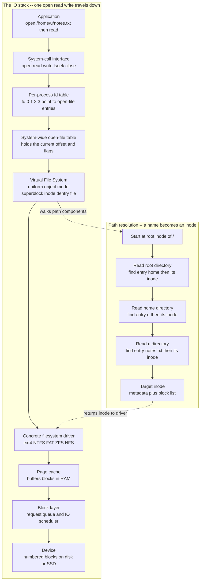

# 🗂️ File Systems and Abstractions

> [!abstract] TL;DR
> Raw storage is just a huge array of identical, numbered blocks — meaningless without a scheme to name and organize them. A **file system** is the software that layers a **file abstraction** (a named, persistent sequence of bytes) and a **directory namespace** (a tree of names) on top of those blocks. It stores each file's metadata and block list in an **inode**, maps human names to inodes through **directories**, resolves paths like `/home/u/notes.txt` by walking one component at a time, and lets many file-system types coexist behind one uniform kernel interface: the **Virtual File System (VFS)**. This note covers the *abstraction*; its on-disk realization is the subject of the sibling note *File System Implementation*.

---

## Intuition

**Analogy:** Imagine a warehouse containing a million identical lockers, each stamped only with a number — 0, 1, 2, up to 999999. That is a raw disk: a flat wall of interchangeable **blocks**, each holding a fixed chunk of bytes, addressed only by number. You *can* store things in it, but there is no way to find anything later, no notion of "my document" versus "your photo," and no grouping — just numbers.

A **file system** is the **library catalog and shelving scheme** you build on top of that wall. It gives collections of lockers a **name** ("notes.txt"), records in a small index card (an **inode**) which locker numbers hold that item and who owns it, and files those cards into **drawers within drawers** (directories) so you can say "third floor, science section, shelf B" — that is, `/home/u/notes.txt` — and be walked straight to the right lockers. The magic is that you never think about locker numbers again; you think in *names* and *folders*, and the catalog silently translates.

---

## How It Works

A file system solves two problems at once: it must **name and organize** data for humans (the namespace), and it must **map those names onto physical blocks** for the hardware (the layout). This note focuses on the abstractions the OS exposes; the on-disk data structures that back them belong to *File System Implementation*.

### The file abstraction

A **file** is the central illusion: a *named, persistent, growable sequence of bytes*. The application sees one continuous stream and reads byte 4000 as easily as byte 0; underneath, those bytes may be scattered across dozens of non-adjacent blocks on the device. The file system hides sectors, block sizes, fragmentation, and the specific medium (spinning platter, SSD flash, network share) behind that flat byte stream.

Every file carries **metadata** stored separately from its contents, in a per-file record called an **inode** (index node):

- **Identity and size:** the inode number, the file's length in bytes, and how many blocks it occupies.
- **Ownership and permissions:** owning user and group, and the `rwx` permission bits (detailed under access control below).
- **Timestamps:** created / last-modified / last-accessed times.
- **Block map:** the list of physical block numbers that hold the file's data.
- **Link count:** how many directory names currently point at this inode (the key to hard links).

Crucially, the **name is not in the inode**. The inode knows *everything about the file except what it is called* — because a file can have several names. Names live in directories.

### Everything is a file: the Unix philosophy

Unix pushes the file abstraction remarkably far: **almost every kernel object is presented as a file** you can `open`, `read`, `write`, and `close` with the same syscalls. Regular files, directories, block and character **devices** (`/dev/sda`, `/dev/null`), **pipes** and **sockets** for interprocess communication, and even kernel state exposed through pseudo file systems are all reached through the uniform file API. This is why a program that reads from "a file" can just as easily read from a keyboard, a network socket, or a hardware sensor — one interface, many backends. (The `open`/`read`/`write` syscalls that make this possible are described in *System Calls and the Kernel Interface*, and pipes/sockets in *Interprocess Communication*.)

### File operations and the open-file table

A file at rest is just an inode plus blocks. To *use* one, a process **opens** it, which creates live kernel state:

1. **`open(path, flags)`** resolves the path to an inode, checks permissions, and returns a small integer — the **file descriptor (fd)**. The fd is just an index into that process's private **file-descriptor table**.
2. Each fd entry points to a **system-wide open-file table** entry, which stores the current **offset** (the read/write position) and the status flags. This indirection is deliberate: two processes opening the same file get *independent* offsets, but a `fork`ed child or a `dup`ed fd can *share* one offset.
3. **`read(fd, buf, n)` / `write(fd, buf, n)`** transfer bytes at the current offset and advance it; **`lseek(fd, pos)`** moves the offset without transferring data (enabling random access).
4. **`close(fd)`** releases the descriptor. Buffering (in libc and the kernel **page cache**) means a `write` usually lands in RAM first and reaches the device later.

Every process starts with three conventional descriptors: **0 = stdin, 1 = stdout, 2 = stderr**. The per-process fd table is part of process state — see *Processes and the Process Model*.

### Directories and path resolution

A **directory** is not a special kind of container — it is simply *a file whose contents are a table mapping names to inode numbers*. That single idea builds the entire hierarchical namespace:

- The tree has one **root**, `/`. Every **absolute path** starts there; a **relative path** starts at the process's current working directory.
- Every directory contains two special entries: **`.`** (itself) and **`..`** (its parent), which is how `cd ..` works.
- **Path resolution** turns a string into an inode by *walking components left to right*: to resolve `/home/u/notes.txt`, start at the root inode, read its directory data to find the entry `home` and its inode, read *that* directory to find `u`, read *that* to find `notes.txt`, and return the final inode — checking execute (search) permission on each directory along the way.

### Links: two names, one file

Because names and inodes are separate, one inode can have many names:

- A **hard link** adds another directory entry pointing at the *same inode* and increments its **link count**. Both names are equal peers — there is no "original." The file's data is freed only when the link count drops to zero *and* no process still has it open. Hard links cannot cross file-system boundaries (inode numbers are only meaningful within one file system) and are not allowed on directories.
- A **symbolic (soft) link** is a tiny file whose contents are *a path string* pointing at another name. It is resolved by restarting path resolution from that string. Symlinks can cross file systems and point at directories, but they suffer the **dangling-symlink problem**: if the target is renamed or deleted, the link still exists but points at nothing, and opening it fails.

### Access control on files

Classic Unix attaches **nine permission bits** to each inode: read/write/execute (`rwx`) for three classes — **owner**, **group**, and **other** — displayed like `rwxr-xr--`. On a directory, `x` means "may search / traverse," which is why path resolution checks it on every component. Finer-grained needs are met by **Access Control Lists (ACLs)**, which allow per-user and per-group rules beyond the three coarse classes. (The full permission and privilege model is developed in the sibling note *Protection and Access Control*.)

### Mounting and the Virtual File System

A single machine has many storage devices and many *kinds* of file system (ext4, NTFS, FAT, ZFS, network shares). Two mechanisms unify them into one tree:

- **Mounting** grafts the root of one file system onto a directory (a **mount point**) of another. After `mount /dev/sdb1 /mnt/data`, opening `/mnt/data/x` transparently crosses into the second file system. The user sees one seamless tree; the kernel tracks where each mounted file system begins.
- The **Virtual File System (VFS)** is the abstraction layer that makes this possible. It defines a **common object model** — `superblock` (a mounted file system), `inode` (a file), `dentry` (a cached name-to-inode directory entry), and `file` (an open instance with an offset) — plus a table of operations each concrete file system must implement (`lookup`, `read`, `write`, ...). The kernel calls the *generic* VFS operation; VFS dispatches to the right driver. This is exactly why `read` works identically whether the bytes come from ext4, an NTFS partition, or an **NFS** server across the network. VFS is the file-system analogue of the device-driver abstraction in *IO Systems and Device Drivers*.

**Special / pseudo file systems** exploit the same VFS interface to expose things that are *not on any disk*: **procfs** (`/proc`, per-process kernel state as readable files), **sysfs** (`/sys`, device and kernel tunables), **tmpfs** (a RAM-backed file system), and **devfs** (`/dev`, device nodes). "Everything is a file" is implemented largely through these.

### Flow / Architecture



---

## Key Concepts

### Secondary (intuitive foundation)
- A **file** is a named box of bytes that survives after the program that made it exits.
- **Folders (directories)** hold files and other folders, forming a tree you navigate with names like `/home/u/notes.txt`.
- The disk underneath does not know about names — the file system is the label-and-index layer that makes names work.

### Undergraduate (mechanism and structure)
- **Inode vs name:** the inode holds *all* metadata and the block list but **not** the name; names live in directory entries, which is what makes multiple names for one file possible.
- **File descriptors and the two-level table:** an fd indexes a *per-process* table that points into a *system-wide* open-file table holding the shared **offset** — explaining why `fork`/`dup` share a position but independent `open`s do not.
- **Path resolution:** walking `/a/b/c` component by component, reading each directory to find the next inode, checking search permission on the way.
- **Hard vs symbolic links:** a hard link is another equal name for the same inode with a shared reference count; a symlink is a pathname pointer that can dangle.
- **`rwx` permissions** for owner/group/other; on directories `x` gates traversal.
- **Mounting** stitches multiple file systems into one namespace at mount points.

### Graduate (design and tension level)
- **The VFS common object model** (`superblock`/`inode`/`dentry`/`file`) is a classic *interface segregation*: one uniform kernel API, many pluggable back ends (disk, network, pseudo). The **dentry cache** makes repeated path lookups fast by caching name-to-inode resolutions.
- **Consistency under crashes:** a single logical operation (create a file: allocate inode, write data blocks, add a directory entry, update the free map) touches several structures. A crash between steps leaves the file system *inconsistent* — a data block owned by no file, or a directory entry pointing at a blank inode. This is why journaling and copy-on-write exist, developed in *Journaling and Crash Consistency*.
- **Memory-mapped files and the page cache:** `mmap` maps a file's blocks directly into a process's address space so reads/writes become ordinary memory accesses backed by demand paging; the page cache unifies file I/O and virtual memory (see *Virtual Memory and Demand Paging* and [[Virtual_Memory_and_TLB]]).
- **Files as the substrate for databases:** a storage engine ultimately stores its B-trees, LSM-trees, and write-ahead logs *as files*, and fights the OS over caching, `fsync` durability, and I/O ordering (see [[Storage_Engine_Internals]]).
- **Naming across machines:** network and distributed file systems extend the same namespace over a wire, a stepping stone to *Distributed Operating Systems*.

---

## Python Demo

This builds a **tiny in-memory file system** to make the abstractions concrete. It maintains a directory tree of **inodes** (metadata plus a block list), a small pool of fixed-size **blocks**, and supports `mkdir` / `create` / `write` / `read` / `link` / `unlink` plus real **path resolution** that walks `/a/b/c` one component at a time. It then demonstrates a **hard link** — two names (`/home/u/notes.txt` and `/etc/backup.txt`) pointing at *one inode* — and visualizes both the directory tree and the file-to-block mapping. numpy + matplotlib only; deterministic.

```python
# A tiny in-memory FILE SYSTEM: inodes, a block pool, path resolution, and hard links.
# We then draw (1) the directory tree and (2) the file-to-block mapping.
import numpy as np
import matplotlib.pyplot as plt

BLOCK_SIZE = 8     # bytes per block -- deliberately tiny so files span several blocks
N_BLOCKS   = 32    # total blocks in our "disk"

class TinyFS:
    def __init__(self):
        self.inodes = {}                     # inode_no -> metadata dict
        self.next_ino = 0
        self.blocks = [None] * N_BLOCKS      # the raw "disk": each slot holds up to BLOCK_SIZE bytes
        self.free = list(range(N_BLOCKS))    # free block list
        self.root = self._alloc_inode('dir') # inode 0 is the root directory "/"

    def _alloc_inode(self, ftype):
        ino = self.next_ino; self.next_ino += 1
        self.inodes[ino] = {'type': ftype, 'nlink': 1, 'size': 0, 'blocks': [],
                            'entries': {} if ftype == 'dir' else None,
                            'perm': 'rwxr-xr-x' if ftype == 'dir' else 'rw-r--r--'}
        return ino

    def _resolve(self, path, trace=False):
        """PATH RESOLUTION: walk components left to right, dir by dir, to an inode."""
        cur = self.root
        parts = [p for p in path.strip('/').split('/') if p]
        for i, part in enumerate(parts):
            node = self.inodes[cur]
            if node['type'] != 'dir':
                raise NotADirectoryError('/'.join(parts[:i]))
            if part not in node['entries']:
                raise FileNotFoundError('/'.join(parts[:i + 1]))
            cur = node['entries'][part]       # look name up in THIS directory, descend
            if trace:
                print(f"    walk '{part}' -> inode {cur}")
        return cur

    def _parent_and_name(self, path):
        parts = path.strip('/').split('/')
        parent = self._resolve('/' + '/'.join(parts[:-1]))
        return parent, parts[-1]

    def mkdir(self, path):
        parent, name = self._parent_and_name(path)
        self.inodes[parent]['entries'][name] = self._alloc_inode('dir')

    def create(self, path):
        parent, name = self._parent_and_name(path)
        self.inodes[parent]['entries'][name] = self._alloc_inode('file')

    def write(self, path, text):
        node = self.inodes[self._resolve(path)]
        for b in node['blocks']:              # free any old blocks first
            self.blocks[b] = None; self.free.append(b)
        node['blocks'] = []
        data = text.encode()
        for off in range(0, len(data), BLOCK_SIZE):
            b = self.free.pop(0)              # allocate a fresh block
            self.blocks[b] = data[off:off + BLOCK_SIZE]
            node['blocks'].append(b)
        node['size'] = len(data)

    def read(self, path):
        node = self.inodes[self._resolve(path)]
        raw = b''.join(self.blocks[b] for b in node['blocks'])
        return raw[:node['size']].decode()

    def link(self, existing, newpath):        # HARD LINK: another name, SAME inode
        ino = self._resolve(existing)
        parent, name = self._parent_and_name(newpath)
        self.inodes[parent]['entries'][name] = ino
        self.inodes[ino]['nlink'] += 1

    def unlink(self, path):                    # remove a name; free data at nlink 0
        parent, name = self._parent_and_name(path)
        ino = self.inodes[parent]['entries'].pop(name)
        self.inodes[ino]['nlink'] -= 1
        if self.inodes[ino]['nlink'] == 0:
            for b in self.inodes[ino]['blocks']:
                self.blocks[b] = None; self.free.append(b)
            del self.inodes[ino]

# --- Build a small tree ---------------------------------------------------
fs = TinyFS()
fs.mkdir('/home'); fs.mkdir('/home/u'); fs.mkdir('/etc')
fs.create('/home/u/notes.txt'); fs.write('/home/u/notes.txt',
          'hello file system: names map to inodes map to blocks!')
fs.create('/home/u/todo.txt');  fs.write('/home/u/todo.txt', 'buy milk; read OSTEP')
fs.create('/etc/hosts');        fs.write('/etc/hosts', '127.0.0.1 localhost')

# HARD LINK: reach the SAME file through a second name in a different directory
fs.link('/home/u/notes.txt', '/etc/backup.txt')

print("Resolving /etc/backup.txt component by component:")
ino = fs._resolve('/etc/backup.txt', trace=True)
same = fs._resolve('/home/u/notes.txt')
print(f"  /etc/backup.txt      -> inode {ino}")
print(f"  /home/u/notes.txt    -> inode {same}   (same inode: {ino == same})")
print(f"  link count on inode {ino}: {fs.inodes[ino]['nlink']}")
print(f"  read via backup name : {fs.read('/etc/backup.txt')!r}")

# --- Lay out the directory tree for drawing -------------------------------
positions, labels, edges = {}, {}, []
leaf = [0]
def layout(ino, name, depth):
    node = fs.inodes[ino]
    if node['type'] == 'dir' and node['entries']:
        xs = []
        for cname, cino in node['entries'].items():
            xs.append(layout(cino, cname, depth + 1))
            edges.append(((ino, name), (cino, cname)))
        x = float(np.mean(xs))
    else:
        x = leaf[0]; leaf[0] += 1
    positions[(ino, name)] = (x, -depth)
    labels[(ino, name)] = (name, ino, node['type'], node['nlink'])
    return x
layout(fs.root, '/', 0)

# --- Plot -----------------------------------------------------------------
fig, (ax1, ax2) = plt.subplots(1, 2, figsize=(14, 6))

# (1) Directory tree
for (pk, ck) in edges:                                  # edges first, behind boxes
    x1, y1 = positions[pk]; x2, y2 = positions[ck]
    ax1.plot([x1, x2], [y1, y2], '-', color='#888', zorder=1)
shared = [k for k, (n, i, t, nl) in labels.items() if t == 'file' and nl > 1]
if len(shared) == 2:                                    # dashed link: two names, one inode
    (x1, y1), (x2, y2) = positions[shared[0]], positions[shared[1]]
    ax1.plot([x1, x2], [y1, y2], '--', color='#d1495b', lw=2, zorder=1)
for key, (x, y) in positions.items():
    name, ino, ftype, nlink = labels[key]
    fc = '#bcd4ff' if ftype == 'dir' else ('#ffcf9e' if nlink > 1 else '#c9efbf')
    txt = f"{name}\ninode {ino}" + (f"\nnlink {nlink}" if ftype == 'file' else "")
    ax1.text(x, y, txt, ha='center', va='center', fontsize=8, zorder=2,
             bbox=dict(boxstyle='round', fc=fc, ec='#333'))
ax1.set_title("Directory tree: names -> inodes\n(dashed red = one inode, two hard-link names)")
ax1.axis('off'); ax1.margins(0.15)

# (2) File-to-block mapping across the "disk"
files = [(i, m) for i, m in fs.inodes.items() if m['type'] == 'file']
cmap = plt.cm.tab10
owner = {b: None for b in range(N_BLOCKS)}
for idx, (ino, meta) in enumerate(files):
    for b in meta['blocks']:
        owner[b] = idx
for b in range(N_BLOCKS):
    col = 4 if owner[b] is None else 0
    face = '#eeeeee' if owner[b] is None else cmap(owner[b])
    ax2.add_patch(plt.Rectangle((b % 8, -(b // 8)), 0.9, 0.9,
                                facecolor=face, edgecolor='#333'))
    ax2.text(b % 8 + 0.45, -(b // 8) + 0.45, str(b), ha='center', va='center', fontsize=7)
# legend: which color is which file's inode
handles = [plt.Rectangle((0, 0), 1, 1, fc=cmap(i)) for i in range(len(files))]
lab = []
for ino, meta in files:
    tag = f"inode {ino} ({meta['nlink']} name{'s' if meta['nlink'] > 1 else ''})"
    lab.append(tag)
ax2.legend(handles, lab, loc='lower center', ncol=2, fontsize=8,
           bbox_to_anchor=(0.5, -0.18))
ax2.set_title("File-to-block map: notes.txt and backup.txt\nshare one inode -> the SAME blocks")
ax2.set_xlim(-0.2, 8.2); ax2.set_ylim(-4.2, 1.2); ax2.set_aspect('equal'); ax2.axis('off')

plt.tight_layout()
plt.savefig("file_system_model.png", dpi=120, bbox_inches='tight')
print("saved file_system_model.png")
```

**What you see:** the resolver prints each hop of the walk to `/etc/backup.txt` and confirms it lands on the *same inode* as `/home/u/notes.txt` with a link count of 2. The left panel draws the namespace as a tree of names, with a dashed red edge joining the two names that share one inode; the right panel shows those two names mapping to the *exact same* set of physical blocks — the essence of a hard link: **the file is the inode, not the name.**

---

## Real-World Applications

> **Example — the Linux VFS.** When you run `cat /proc/self/status`, the kernel's VFS receives an ordinary `open`/`read`, resolves the path across a *mount boundary* into **procfs**, and dispatches `read` to procfs's handler — which *generates* the bytes on the fly from live kernel data. The exact same `read` code path serves `ext4` on your SSD, an `NTFS` USB stick, and an `NFS` mount over the network. One uniform interface, radically different back ends: that is the VFS abstraction earning its keep.

- **POSIX file API everywhere:** `open`/`read`/`write`/`lseek`/`close` are the portable contract that C, Python, Go, and Rust standard libraries wrap. A program written to POSIX file semantics runs unchanged across Linux, macOS, and the BSDs.
- **Container images and overlay file systems:** Docker layers a read-only image and a writable layer with **OverlayFS**, a VFS-level union file system, so many containers share one base image's blocks copy-on-write — the same "one inode, many views" idea scaled up.
- **`git` and content-addressed storage:** Git stores objects as files named by their content hash and uses hard-link-like sharing across the object store to deduplicate; understanding inodes and link counts explains why `cp -al` clones a tree almost instantly.
- **Databases on files:** PostgreSQL, SQLite, and RocksDB store their pages, indexes, and logs as ordinary files and depend on `fsync` and directory-entry durability guarantees the file system provides (see [[Storage_Engine_Internals]] and [[Write_Ahead_Logging]]).
- **`tmpfs` and `/dev/shm`:** RAM-backed file systems give processes a fast, file-shaped scratch space and back POSIX shared-memory IPC (see [[Interprocess_Communication]]).

---

## Common Pitfalls

- **Thinking the file "is" its name.** The file is the *inode*; a name is just a directory entry pointing at it. Deleting `notes.txt` does not necessarily delete the data — if a hard link or an open descriptor still references the inode, the bytes persist until the last reference drops. This is exactly how a program keeps using a file it has already "deleted."
- **Confusing hard links with symbolic links.** A hard link is an equal, first-class name sharing the inode and reference count; a symlink is a separate little file holding a *path string*. Symlinks can dangle when their target moves; hard links never dangle but cannot cross file systems or point at directories.
- **Assuming a `write` is immediately durable.** By default `write` lands in the **page cache** and returns before the data reaches the device. Only `fsync` (and syncing the containing directory) guarantees durability — the source of countless "I saved it but a crash lost it" bugs.
- **Forgetting that directory traversal needs `x`, not `r`.** You can `open` a file deep in a tree without read permission on the intermediate directories, but you *must* have execute (search) permission on each to resolve the path. Missing `x` yields a `Permission denied` that looks mysterious if you only think about read bits.
- **Ignoring open-file-table sharing semantics.** Two separate `open`s get independent offsets; a `fork`ed or `dup`ed descriptor *shares* one offset. Assuming the wrong one causes interleaved-write corruption or unexpected read positions.
- **Treating crash consistency as free.** Creating or renaming a file touches several structures; a crash mid-operation can corrupt the file system unless it journals or uses copy-on-write (see the forthcoming *Journaling and Crash Consistency* note).

---

## Related Concepts

- [[Operating_Systems_Overview]] — the file system is one of the OS's core abstractions, sitting beside processes and virtual memory as a way to tame raw hardware.
- [[System_Calls_and_the_Kernel_Interface]] — `open`, `read`, `write`, `lseek`, and `close` are the syscalls through which every file operation crosses into the kernel.
- [[Interprocess_Communication]] — pipes, sockets, and shared-memory objects are exposed as files, and `tmpfs`/`/dev/shm` back POSIX shared memory; the file abstraction unifies IPC.
- [[Processes_and_the_Process_Model]] — the per-process file-descriptor table is part of process state, and `fork` semantics explain shared vs independent file offsets.
- [[Virtual_Memory_and_TLB]] — memory-mapped files (`mmap`) fuse the file system with paging, and the page cache is shared machinery between file I/O and virtual memory.
- [[Storage_Engine_Internals]] — databases build B-trees, LSM-trees, and logs *on top of* files, treating the file system as their durable substrate.
- [[Write_Ahead_Logging]] — the same crash-consistency logic that protects file-system metadata (journaling) is what a WAL does for a database.

*Forthcoming sibling notes in this vault, referenced above but not yet written (link once they exist): File System Implementation, Journaling and Crash Consistency, Disk Scheduling and IO Management, IO Systems and Device Drivers, Protection and Access Control, Virtual Memory and Demand Paging, and Distributed Operating Systems.*

---

## Review Questions

1. **(Secondary / Conceptual)** Explain why a file can have several different names but the same content, using the words *inode*, *directory entry*, and *link count*. If you `rm` one of two hard-linked names, is the data gone? Why or why not?
2. **(Undergraduate / Scenario)** Trace exactly what the kernel does to resolve `open("/var/log/app.log")`, starting from the root inode. At which steps are permissions checked, and which permission bit on the *directories* matters? Then explain why two processes that each independently `open` this file get separate read offsets, but a child created with `fork` shares its parent's offset.
3. **(Graduate / Trade-off)** You are choosing between a **hard link** and a **symbolic link** to give a shared configuration file a second name. Compare them on: crossing file-system boundaries, pointing at a directory, surviving deletion or rename of the target, and behavior when the file is later replaced by a fresh inode. Then argue when the VFS's separation of *name* from *inode* makes symlinks the safer default despite the dangling-link risk.

---

## Sources

- Arpaci-Dusseau & Arpaci-Dusseau — *Operating Systems: Three Easy Pieces*, "File Systems" chapters (files, directories, inodes, links, VFS). [https://pages.cs.wisc.edu/~remzi/OSTEP/](https://pages.cs.wisc.edu/~remzi/OSTEP/)
- Silberschatz, Galvin, Gagne — *Operating System Concepts*, 10th ed., Ch. 13–14 "File-System Interface" and "File-System Implementation." [https://www.os-book.com/OS10/](https://www.os-book.com/OS10/)
- Kerrisk — *The Linux Programming Interface*, Ch. 4, 14, 18 (file I/O, file systems, directories and links). [https://man7.org/tlpi/](https://man7.org/tlpi/)
- The Linux Kernel documentation — "Overview of the Linux Virtual File System." [https://www.kernel.org/doc/html/latest/filesystems/vfs.html](https://www.kernel.org/doc/html/latest/filesystems/vfs.html)
- Ritchie & Thompson — "The UNIX Time-Sharing System" (CACM, 1974), the origin of the inode/directory/"everything is a file" model. [https://dl.acm.org/doi/10.1145/361011.361061](https://dl.acm.org/doi/10.1145/361011.361061)

---

#operating-systems #file-systems #vfs #inodes #directories
