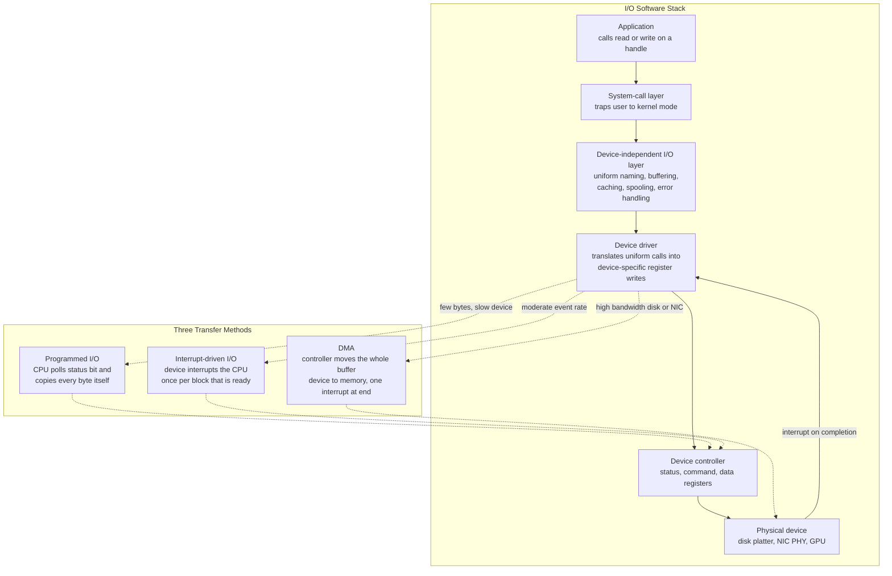

# 🔌 I/O Systems and Device Drivers

> [!abstract] TL;DR
> The I/O subsystem is how the OS talks to the enormous, ever-changing **zoo of hardware devices** — disks, GPUs, NICs, keyboards, sensors — through a single uniform interface, so that applications call the same `read`/`write` regardless of the device underneath. Hardware is modelled as **devices** driven by **device controllers** exposing status, command, and data **registers**, which the CPU reaches through **port-mapped I/O** (special `in`/`out` instructions) or **memory-mapped I/O** (registers appear in the address space). Data moves by one of three transfer methods: **programmed I/O** (the CPU polls and copies every byte — simple but burns cycles), **interrupt-driven I/O** (the device interrupts when a block is ready — frees the CPU between blocks), or **DMA** (a DMA controller moves a whole buffer directly to memory and interrupts only once at the end — essential for high-bandwidth disks and NICs). **Device drivers** are the device-specific kernel modules that translate the uniform interface into register pokes; the **device-independent I/O layer** above them supplies naming, buffering, caching, spooling, and error handling. Drivers are the largest, buggiest, and most security-critical part of most kernels, which is why modern systems push them toward isolation (IOMMU, user-space drivers, microkernels) and the fastest paths toward **kernel bypass**.

---

## Intuition

**Analogy:** A **device driver is a translator-diplomat** stationed at an embassy. The operating system speaks one clean, standard diplomatic language — "read this block", "send this packet", "give me your status" — and refuses to learn the local dialect of every foreign country it deals with. Every device, meanwhile, speaks its own proprietary tongue: this SSD has its own set of registers and a submission-queue ritual, that NIC has a different one, this ancient parallel-port printer has yet another. The driver sits in the middle, fluent in both. When the OS says "read block 42," the driver translates that into the exact sequence of register writes, doorbell rings, and status polls that *this specific chip* understands, then translates the device's replies back into the OS's standard vocabulary.

Two consequences fall straight out of the analogy. First, because the OS only ever speaks the standard language, an application can `open` a disk file, a serial port, or a network socket with the *same* system calls — the diplomat absorbs all the messiness. Second, because the diplomat is the one component that must know every device's dirty secrets and run with full kernel authority, a careless or malicious diplomat can start a war: a buggy driver is the single most common way to crash — or compromise — the whole kernel.

---

## How It Works

### The I/O hardware model

A physical **device** (a disk, a NIC, a mouse) rarely talks to the CPU directly. It is driven by a **device controller** — a chip, often on the device or on the motherboard, that presents a small set of **registers** to the CPU:

- **status register** — is the device busy, ready, or in error?
- **command register** — write here to tell the device what to do (read, write, seek, reset).
- **data registers** — bytes flow in and out through these (or through a larger on-controller buffer).

The CPU reaches these registers over a **bus** (PCIe today; historically ISA, PCI) using one of two addressing styles:

- **Port-mapped I/O (PMIO)** — device registers live in a *separate* I/O address space, reached only by special privileged instructions (`in`/`out` on x86). I/O ports and memory are distinct namespaces.
- **Memory-mapped I/O (MMIO)** — device registers are wired into the ordinary physical **address space**, so a normal load/store to a magic address reads or writes a register. This is dominant on modern hardware because it lets drivers use plain pointers, but it forces the driver to defeat CPU caching and reordering for those addresses (the registers are *volatile* and have side effects). See [[Memory_Mapped_IO]].

Issuing raw I/O and touching these registers is a **privileged operation**, legal only in kernel mode — the protection boundary from [[Interrupts_Traps_and_Dual_Mode_Operation]] is exactly what stops a user process from grabbing the disk directly.

### The three transfer methods

Once a driver has told a controller *what* to do, the actual bytes have to cross between the device and memory. There are three escalating strategies:

1. **Programmed I/O (PIO) / polling.** The CPU sits in a loop reading the status register until the "ready" bit flips, then copies one word from the data register to memory, and repeats. Dead simple and needs no interrupt hardware, but the CPU is **100% consumed for the entire transfer**, most of it wasted busy-waiting on a device that is orders of magnitude slower than the CPU. Fine for a few bytes on a slow device; catastrophic for bulk data.

2. **Interrupt-driven I/O.** Instead of spinning, the CPU issues the command and goes off to do other work. When the device has a block ready, it raises an **interrupt**; the CPU takes the interrupt, the driver's handler copies the block, then returns to whatever it was doing. The CPU is freed *between* blocks, but it still pays a full interrupt (save/dispatch/restore) **per block** and still copies every byte itself. Great when events are relatively rare; the per-block interrupt cost hurts when there are many small transfers. See [[Interrupts_Traps_and_Dual_Mode_Operation]].

3. **Direct Memory Access (DMA).** A dedicated **DMA controller** (today, usually a bus-master engine on the device itself) is programmed with a source, a destination, and a length, and then transfers the *entire buffer* directly between the device and memory **without the CPU touching a single byte**. The CPU is interrupted **once, on completion**. This is the only viable option for high-bandwidth devices — a modern NVMe SSD or a 100 Gbps NIC would drown any CPU forced to copy byte-by-byte. Because DMA writes straight into RAM, it interacts with the [[Cache_Hierarchy]] (cache-coherent DMA snoops the caches; non-coherent DMA needs explicit flush/invalidate) and, for safety, is confined by an **IOMMU** so a device can only write its own buffers. See [[Interrupts_and_DMA]].

### The layered I/O software stack

Above the hardware sits a layered software stack. The bottom, hardware-touching layer is the **device driver**; above it a large **device-independent I/O layer** provides everything that is *common* to all devices so drivers stay small:

- **uniform naming** — one namespace for devices ("everything is a file": `/dev/sda`, `/dev/tty`, sockets) so applications use ordinary path/handle operations, tying into [[System_Calls_and_the_Kernel_Interface]] and the file abstraction.
- **buffering** — a kernel buffer decouples device and application speeds, fixes up block-size and alignment mismatches, and preserves copy semantics; **double buffering** lets the device fill buffer B while the CPU drains buffer A.
- **caching** — hot blocks are kept in the page cache to avoid re-fetching.
- **spooling** — serialize access to a non-shareable device (the classic printer queue).
- **error handling** — retries, timeouts, and turning device faults into clean error codes.
- **device-class abstraction** — devices are grouped as **block** (random-access, fixed-size blocks: disks, SSDs), **character** (byte streams: terminals, serial ports, `/dev/random`), or **network** (packets via sockets). Each class exposes a consistent interface so a single filesystem or protocol stack can sit on top of many drivers.



### The request lifecycle

A read travels down and back up this stack: the application calls `read`, which **traps** into the kernel; the device-independent layer checks the cache, and on a miss allocates a buffer and hands a request to the driver; the driver programs the controller (often a DMA descriptor); the process is **blocked** and the scheduler runs someone else; the device completes and **interrupts**; the driver's handler wakes the waiting process; the data is copied (or was DMA'd) into the user buffer and `read` returns. The call can be **blocking** (the default — sleep until done), **non-blocking** (return immediately with whatever is available), or **asynchronous** (start now, get notified later — the model behind `io_uring`; see [[IO_Scheduling_and_io_uring]]).

### Drivers, discovery, and isolation

Drivers are loaded and bound to devices through **hotplug and discovery**: at boot and on plug-in, the kernel **enumerates** the buses (PCIe configuration space, USB descriptors), reads each device's vendor/device ID, and matches it to a driver; on Linux, `udev` then creates the `/dev` node and fires userspace rules. Because drivers are numerous, third-party, and privileged, they are also the kernel's biggest reliability and security liability. Modern responses, discussed under the planned *OS_Security_and_Isolation* and in [[OS_Structure_and_Kernel_Architectures]], include **IOMMU**-enforced DMA confinement, **user-space drivers** (VFIO, DPDK, SPDK) that run device logic in a sandboxed process, and the **microkernel** argument for running each driver as an isolated, restartable server rather than inside the trusted kernel.

---

## Key Concepts

**Secondary (intuition level).**
The OS speaks one standard language to all devices; a **driver** is the translator that converts that standard language into the private dialect of one specific chip. Data can move three ways: the CPU can watch and copy every byte itself (**polling** — simple but wasteful), the device can tap the CPU on the shoulder when a chunk is ready (**interrupts**), or a helper engine can move a whole load and only report back at the end (**DMA** — how fast disks and network cards work).

**Undergraduate (mechanism level).**
- **Device controller and registers** — status, command, and data registers are the driver's control panel for a device.
- **Port-mapped vs memory-mapped I/O** — separate I/O address space reached by `in`/`out`, versus registers folded into the normal physical address space and reached by loads/stores.
- **Programmed I/O (polling)** — busy-wait on the status bit and copy each word; CPU fully consumed for the whole transfer.
- **Interrupt-driven I/O** — one interrupt per ready block; frees the CPU between blocks but still copies bytes and pays per-block overhead.
- **DMA** — controller transfers a full buffer with no CPU byte-copying; a single completion interrupt at the end.
- **Device driver** — device-specific kernel module implementing the uniform interface; the device-dependent half of the split.
- **Device-independent I/O layer** — naming, buffering, caching, spooling, error handling shared across all drivers.
- **Block vs character vs network devices** — random-access fixed blocks, byte streams, and packet interfaces.
- **Buffering and double buffering** — speed matching, alignment fix-up, copy semantics; overlap device fill with CPU drain.
- **Blocking vs non-blocking vs asynchronous I/O** — sleep until done, return immediately, or start-now-notify-later.

**Graduate (systems level).**
- **DMA descriptor rings and scatter-gather** — a ring of descriptors lets the device stream many buffers; scatter-gather DMA moves non-contiguous fragments in one go (see [[Interrupts_and_DMA]]).
- **Cache coherence for DMA** — coherent DMA snoops caches; non-coherent DMA requires explicit flush on write-to-device and invalidate on read-from-device, or stale data results (see [[Cache_Hierarchy]]).
- **Interrupt coalescing and NAPI** — batch many completions into one interrupt to escape per-event overhead and receive-livelock at high rates.
- **MSI-X and interrupt affinity** — per-queue vectors steered to specific cores/NUMA nodes for locality (see [[Bus_Architectures_PCIe]]).
- **User-space drivers and kernel bypass** — VFIO/DPDK/SPDK map device queues into a process to skip the kernel's per-I/O overhead entirely; the basis of the planned *Kernel_Bypass_and_Modern_IO* and *Networking_in_the_Operating_System*.
- **IOMMU protection** — I/O virtual addresses and per-device page tables confine DMA, defeating malicious-device (e.g., Thunderbolt) memory attacks.
- **Microkernel driver isolation** — drivers as restartable user servers, trading IPC cost for fault containment (see [[OS_Structure_and_Kernel_Architectures]]).
- **Async submission rings** — `io_uring`, NVMe submission/completion queues, and doorbell registers as the modern high-IOPS interface (see [[Storage_Interfaces_NVMe_SATA]], [[IO_Scheduling_and_io_uring]]).

---

## Python Demo

```python
# Comparing the three I/O transfer methods by CPU cost.
# Left  : CPU cycles consumed for ONE transfer vs its size, for
#         Programmed I/O, Interrupt-driven I/O, and DMA. DMA is flat,
#         so it frees the CPU for large transfers while PIO/interrupts
#         scale with the data moved.
# Right : a fixed 64 MB workload delivered as MANY small I/Os. As the
#         I/O size shrinks, the number of interrupts explodes and
#         interrupt overhead dominates -> motivation for coalescing.
# numpy + matplotlib only.

import numpy as np
import matplotlib.pyplot as plt

# --- Cost model (cycles) ----------------------------------------------------
C_COPY  = 2.0      # CPU cycles to copy one byte (PIO and interrupt-driven copy data)
C_WAIT  = 8.0      # extra cycles per byte the CPU wastes busy-polling a slow device (PIO only)
C_INT   = 3000.0   # cycles to take ONE interrupt: save + dispatch + restore
C_SETUP = 1500.0   # cycles to program a DMA / controller transfer
BLOCK   = 4096     # bytes per block -> one interrupt per block for interrupt-driven I/O

# ---------------------------------------------------------------------------
# LEFT: single transfer, CPU cycles vs transfer size
# ---------------------------------------------------------------------------
N = 2 ** np.arange(6, 25)            # 64 B .. 16 MB, powers of two
n_blocks = np.ceil(N / BLOCK)

cpu_pio = N * (C_COPY + C_WAIT)                   # copy + spin for every byte
cpu_int = N * C_COPY + n_blocks * C_INT           # copy every byte, one interrupt per block
cpu_dma = np.full_like(N, C_SETUP + C_INT, dtype=float)  # setup + one completion interrupt, size-independent

# ---------------------------------------------------------------------------
# RIGHT: fixed total workload split into many small I/Os (all via DMA)
# ---------------------------------------------------------------------------
W = 64 * 1024 * 1024                 # 64 MB total to move
io_size = 2 ** np.arange(9, 21)      # 512 B .. 1 MB per I/O
n_io = W / io_size                   # number of separate I/O operations
K = 32                               # interrupt coalescing factor: 1 IRQ per 32 completions

overhead_plain    = n_io * C_SETUP + n_io * C_INT            # one interrupt per I/O
overhead_coalesce = n_io * C_SETUP + (n_io / K) * C_INT      # one interrupt per K I/Os

# ---------------------------------------------------------------------------
# Plot
# ---------------------------------------------------------------------------
fig, (ax1, ax2) = plt.subplots(1, 2, figsize=(13, 5))

ax1.loglog(N, cpu_pio, color="#DC2626", lw=2, marker="o", ms=3, label="Programmed I/O (poll + copy)")
ax1.loglog(N, cpu_int, color="#1D4ED8", lw=2, marker="s", ms=3, label="Interrupt-driven (1 IRQ / block)")
ax1.loglog(N, cpu_dma, color="#065F46", lw=2, marker="^", ms=3, label="DMA (1 setup + 1 IRQ)")
ax1.set_xlabel("Transfer size (bytes, log)")
ax1.set_ylabel("CPU cycles consumed (log)")
ax1.set_title("One transfer: DMA cost is flat,\nso it frees the CPU as data grows")
ax1.legend()
ax1.grid(True, which="both", alpha=0.3)

ax2.semilogx(io_size, overhead_plain    / 1e6, color="#DC2626", lw=2, marker="o", ms=4,
             label="1 interrupt per I/O")
ax2.semilogx(io_size, overhead_coalesce / 1e6, color="#065F46", lw=2, marker="^", ms=4,
             label=f"coalesced: 1 interrupt per {K} I/Os")
ax2.set_xlabel("I/O size (bytes, log) — 64 MB total workload")
ax2.set_ylabel("CPU overhead (million cycles)")
ax2.set_title("Many small I/Os: interrupt overhead explodes;\ncoalescing tames it")
ax2.legend()
ax2.grid(True, which="both", alpha=0.3)

plt.tight_layout()
plt.savefig("io_transfer_methods.png", dpi=110)
plt.show()

# --- Numeric takeaways ------------------------------------------------------
big = N == N.max()                   # the 16 MB transfer
print(f"16 MB transfer, CPU cycles:")
print(f"  Programmed I/O   : {cpu_pio[big][0]:,.0f}")
print(f"  Interrupt-driven : {cpu_int[big][0]:,.0f}")
print(f"  DMA              : {cpu_dma[big][0]:,.0f}")
print(f"  DMA is {cpu_pio[big][0] / cpu_dma[big][0]:,.0f}x cheaper than PIO here")

small = io_size == io_size.min()     # 512 B I/Os
print(f"\n64 MB in 512 B I/Os:")
print(f"  overhead, 1 IRQ/IO   : {overhead_plain[small][0] / 1e6:,.1f} M cycles")
print(f"  overhead, coalesced  : {overhead_coalesce[small][0] / 1e6:,.1f} M cycles")
```

The left plot is the core argument for DMA: programmed I/O and interrupt-driven I/O both grow with the number of bytes moved (they copy every byte, and interrupt-driven additionally pays one interrupt per block), while **DMA's CPU cost is a flat constant** — a single setup plus one completion interrupt regardless of size. For a 16 MB transfer, DMA is thousands of times cheaper in CPU cycles, which is precisely why every high-bandwidth device (disk, NIC, GPU) uses it. The right plot exposes the *other* failure mode: when a fixed workload is chopped into **many tiny I/Os**, the per-I/O interrupt count explodes and interrupt overhead — not data movement — dominates the CPU bill. **Interrupt coalescing** (batching K completions per interrupt, the NAPI/NVMe strategy) collapses that overhead, which is why the fastest devices coalesce aggressively and the very fastest paths bypass the interrupt-per-I/O model altogether.

---

## Real-World Applications

> **Example — an NVMe SSD read on Linux.** An application `read()` traps into the kernel; on a page-cache miss the block layer builds a request and the NVMe driver posts a **descriptor onto a submission queue** in host memory and rings the device's **doorbell** (a memory-mapped register write). The SSD's controller **DMAs** the data straight into the kernel's buffers, then posts a **completion queue** entry and raises an **MSI-X interrupt** pinned to the submitting core. The driver's handler wakes the sleeping process and the data is handed up. No byte was ever copied by the CPU across the device boundary — DMA and coalesced completions are what let one machine sustain millions of IOPS. See [[Storage_Interfaces_NVMe_SATA]].

- **DPDK / kernel-bypass networking.** For 100 Gbps line rate, per-packet kernel interrupts and copies are too expensive, so DPDK maps the NIC's DMA rings directly into a user-space process (via VFIO + IOMMU) and **polls** them in a busy loop — trading a burned core for the lowest possible latency. This is the planned *Kernel_Bypass_and_Modern_IO* and *Networking_in_the_Operating_System* story.
- **Everything-is-a-file device model.** `/dev/sda` (block), `/dev/ttyS0` (character), and `/dev/null` all present the same `open`/`read`/`write`/`ioctl` surface, so `cat`, `dd`, and shell redirection work uniformly across wildly different hardware — the device-independent layer at work.
- **GPU drivers and DMA.** A GPU driver maps command and data buffers, then DMAs vertex/texture data and command streams across PCIe; the driver is famously one of the largest and most crash-prone modules in any OS.
- **`udev` hotplug.** Plugging in a USB stick triggers bus enumeration, driver binding, and a `udev` rule that creates `/dev/sdb` and may auto-mount it — device discovery in action.
- **VFIO device passthrough.** Cloud hypervisors hand a physical NIC or GPU straight to a guest VM, relying on the **IOMMU** to guarantee the guest's device can only DMA into that guest's memory — driver isolation and security fused together.

---

## Common Pitfalls

- **Polling a fast path "for simplicity"** — programmed I/O burns 100% of a core busy-waiting on the device. Acceptable only for a handful of bytes on a slow controller; for anything bulk it is a performance disaster. Use interrupts or DMA.
- **Interrupt-per-I/O at high IOPS (receive livelock)** — a device that interrupts faster than the CPU can drain it spends all its time entering and leaving handlers and makes no forward progress. Mitigate with **coalescing**, NAPI-style poll-under-load, or larger I/Os — exactly what the right-hand plot motivates.
- **Forgetting DMA cache coherence** — on non-coherent systems, failing to **flush** caches before a device-write DMA or **invalidate** after a device-read DMA leaves the CPU reading stale data or the device missing updates. Match the DMA direction to the correct cache operation (see [[Cache_Hierarchy]]).
- **Treating MMIO registers like normal memory** — device registers are volatile and have side effects; letting the compiler cache them in a register, reorder accesses, or the CPU cache the line produces phantom reads and lost writes. Registers must be marked volatile/uncached with explicit ordering (see [[Memory_Mapped_IO]]).
- **Doing heavy work in the interrupt handler** — the top half runs with interrupts disabled; sleeping or long loops inflate interrupt latency for everyone. Defer to a bottom half (softirq/workqueue).
- **Trusting devices without an IOMMU** — a compromised or malicious bus-master device can DMA anywhere in physical memory and seize the kernel. Enable IOMMU/VT-d protection, especially for external (Thunderbolt) and passed-through devices — a core theme of the planned *OS_Security_and_Isolation*.
- **Underestimating driver blast radius** — an in-kernel driver runs with full privilege, so its bugs are *kernel* bugs: crashes, corruption, and privilege escalation. This is the argument for user-space drivers and microkernel isolation, not a minor detail.
- **Blocking a whole thread on synchronous I/O** — using blocking `read` in a server that needs concurrency stalls the thread; reach for non-blocking or asynchronous I/O (`epoll`, `io_uring`) instead (see [[IO_Scheduling_and_io_uring]]).

---

## Related Concepts

Verified vault links:

- [[Interrupts_Traps_and_Dual_Mode_Operation]] — interrupts are the signalling mechanism behind interrupt-driven I/O and DMA completion; the mode bit is why raw I/O and register access are privileged.
- [[System_Calls_and_the_Kernel_Interface]] — `read`/`write`/`ioctl` are the uniform door through which applications reach the I/O subsystem.
- [[OS_Structure_and_Kernel_Architectures]] — where drivers live (monolithic in-kernel vs microkernel user servers) frames the driver-isolation trade-off.
- [[Interrupts_and_DMA]] — the hardware detail: IDT/MSI-X routing, top-half/bottom-half, DMA descriptor rings, scatter-gather, and IOMMU.
- [[Memory_Mapped_IO]] — how device registers appear in the address space and why they must bypass caching and reordering.
- [[Bus_Architectures_PCIe]] — the bus that carries device transactions, MSI-X interrupts, and DMA traffic; configuration space enables discovery.
- [[Storage_Interfaces_NVMe_SATA]] — NVMe submission/completion queues and doorbells are the modern high-IOPS realization of this model.
- [[IO_Scheduling_and_io_uring]] — asynchronous submission rings and I/O scheduling above the driver layer.
- [[Cache_Hierarchy]] — DMA writes straight to RAM, so cache coherence (snooping vs explicit flush/invalidate) is a driver concern.

Planned Operating Systems sibling notes this concept connects to (create and back-link when written): *Disk_Scheduling_and_IO_Management*, *File_Systems_and_Abstractions*, *Kernel_Bypass_and_Modern_IO*, *Networking_in_the_Operating_System*, *OS_Security_and_Isolation*.

---

## Review Questions

1. **(Secondary)** Using the translator-diplomat analogy, explain what a device driver does and why an application can `open` a disk file and a serial port with the same system calls. Then name the three ways bytes can move between a device and memory and rank them by how much CPU they consume.
2. **(Undergraduate)** Distinguish port-mapped I/O from memory-mapped I/O, and status/command/data registers from one another. For a 4 KB read, walk through what the CPU does under programmed I/O versus interrupt-driven I/O, and state where the per-block interrupt cost enters.
3. **(Undergraduate scenario)** A driver author moves a 16 MB frame from a NIC using interrupt-driven I/O with a 4 KB block and finds the CPU pinned at 100%. Using the demo's cost model, explain what dominates the cost and why switching to DMA collapses it. What single number does DMA's CPU cost depend on, and what does it *not* depend on?
4. **(Graduate trade-off)** A storage box must sustain millions of small (512 B) I/Os per second. Explain why per-I/O interrupts cause receive livelock, how interrupt coalescing (one IRQ per K completions) changes the CPU overhead, and what a kernel-bypass design (DPDK/SPDK with polled DMA rings) trades away to eliminate interrupts entirely.
5. **(Graduate)** Drivers are the largest and buggiest part of most kernels and a top crash/security source. Compare three isolation strategies — in-kernel drivers with an IOMMU, user-space drivers via VFIO, and microkernel driver servers — on fault containment, performance, and attack surface. When would you accept the IPC/latency cost of full isolation?

---

## Sources

- Silberschatz, A., Galvin, P., Gagne, G. *Operating System Concepts*, 10th ed. — Ch. 12 (I/O Systems): I/O hardware, polling, interrupts, DMA, application I/O interface, kernel I/O subsystem.
- Tanenbaum, A. & Bos, H. *Modern Operating Systems*, 4th ed. — Ch. 5 (Input/Output): principles of I/O hardware and software, device controllers, memory-mapped I/O, DMA, device drivers, device-independent I/O layer.
- Arpaci-Dusseau, R. & A. *Operating Systems: Three Easy Pieces* (OSTEP) — "I/O Devices" (canonical protocol, interrupts vs polling, DMA) and "Hard Disk Drives". https://pages.cs.wisc.edu/~remzi/OSTEP/
- Corbet, J., Rubini, A., Kroah-Hartman, G. *Linux Device Drivers*, 3rd ed. — Ch. 9 (Communicating with Hardware / MMIO and port I/O), Ch. 10 (Interrupt Handling), Ch. 15 (Memory Mapping and DMA). https://lwn.net/Kernel/LDD3/
- Love, R. *Linux Kernel Development*, 3rd ed. — device model, interrupts and bottom halves, the block and character device layers.

---

#operating-systems #device-drivers #dma #io-systems #interrupt-handling
