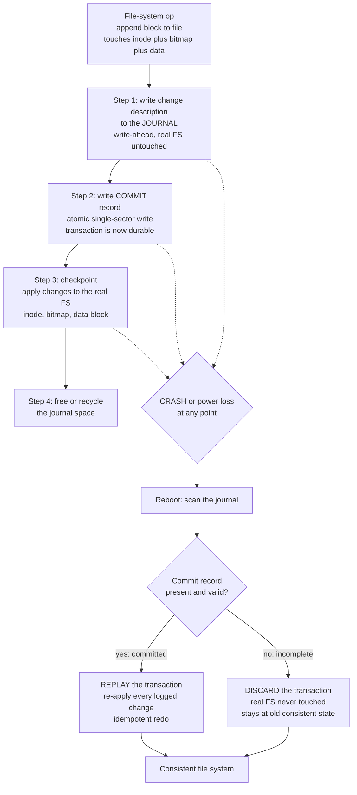

# 🧾 Journaling and Crash Consistency

> [!abstract] TL;DR
> A single logical file-system operation (create a file, append a block) quietly modifies **several on-disk structures** — the inode, the directory entry, the free-space bitmap, the data block — but disk writes are **not atomic**. A crash or power loss *between* those writes leaves the file system **inconsistent**: dangling pointers, blocks marked used but referenced by nobody (**leaks**), or blocks referenced but marked free (**corruption / aliasing**). The old fix, **FSCK**, scans the entire disk on boot to detect and repair damage — correct but agonizingly slow, and it can't recover lost data. The modern fix is **journaling / write-ahead logging**: write a *description* of the change to a **journal** first, mark it **committed**, then apply it to the real file system; on reboot, **replay** committed-but-unapplied transactions and **discard** incomplete ones. This turns arbitrary multi-write operations into **atomic transactions** — the exact same trick databases use for [[Write_Ahead_Logging|WAL]] and [[Transactions_and_ACID|ACID]] durability.

---

## Intuition

**Analogy:** Updating a file on disk is like **renovating a room**. Knocking out the old wall and framing the new doorway takes several separate actions. If the power cuts out halfway, you are left with a **half-demolished mess** — a gaping hole that is neither the old wall nor the new door. Anyone walking in later has no idea what state the room is *supposed* to be in.

A **journal** is writing your renovation plan in a notebook **first**: *"Step 1 remove the north wall. Step 2 frame the doorway. Step 3 hang the door."* You write the whole plan down, mark it **"approved and final,"** and only *then* pick up the sledgehammer. Now a blackout can strike at any moment and you are safe: on returning you read the notebook. If the plan was marked final, you simply **finish executing it** from wherever you stopped — the steps are written down, so re-doing them is harmless. If the plan was **not yet marked final**, you **tear the page out** and the room stays exactly as it was. You never end up with a half-done wall, because the notebook — the journal — always tells you whether to **finish** or **forget**.

In file-system terms: never touch the real structures until you have durably recorded *what you intend to do*. The intent record is the source of truth that survives the crash; the real disk is reconstructed from it.

---

## How It Works

### The Problem: One Logical Op, Many Physical Writes

Consider the seemingly trivial act of **appending one block to a file**. On a classic Unix-style file system this touches at least three independent on-disk structures, likely on three different disk locations:

1. **The inode** — its size grows and a new block pointer is added.
2. **The free-space (data) bitmap** — the newly used block is flipped from *free* to *allocated*.
3. **The data block** itself — the actual bytes the user wrote.

Creating a brand-new file is worse: it touches the **inode**, the **inode bitmap**, a **directory data block** (the new directory entry), the directory inode's timestamps, and possibly a new **data bitmap** and data block. Each of these is a separate write, and the disk offers **no guarantee** about ordering or atomicity across them. A crash can leave **any prefix** of the issued writes on disk. The file system is now in a state its designers never intended:

- **Dangling pointer / garbage read** — the inode references a data block that was never written, so reading the file returns whatever stale bytes were there before.
- **Space leak** — the bitmap marks a block *allocated*, but no inode references it. The block is lost until a full scan reclaims it. Wasteful, but not catastrophic.
- **Corruption / aliasing** — the inode references a block the bitmap still marks *free*. The allocator can hand that same block to a *different* file later, and now two files silently share one block. This is the dangerous one: a write to file A stomps file B. (See the forthcoming *File_System_Implementation* note for the on-disk layout this depends on.)

### The Old Way: FSCK

**FSCK** (file-system check) accepts the mess and cleans it up on boot: walk every inode, every bitmap, every directory, and cross-check all the invariants — every allocated block is referenced exactly once, every referenced block is allocated, link counts match directory entries, and so on. It is **correct** but has two fatal flaws at scale: it must scan the **entire** file system (minutes to *hours* on a multi-terabyte disk, during which the machine is down), and it can only restore **consistency**, not **data** — a half-written file is made structurally valid, but the lost bytes are simply gone. FSCK also fundamentally doesn't scale: the check time grows with disk *size*, not with the amount of *recent activity*, which is absurd when only a handful of operations were in flight at the crash. (Recovery-time cost is a classic tuning concern; see the forthcoming *Performance_Analysis_and_OS_Tuning* note.)

### The Modern Way: Write-Ahead Journaling

Journaling flips the ordering. **Before** touching the real file system, write a description of *all* the intended changes to a dedicated, usually append-only **journal** region. Only once that description is safely committed do you apply the changes in place. The lifecycle of one **journal transaction (TxN)**:

1. **Log the intent** — write the new versions of the affected blocks (or a delta record) into the journal. The real file system is still untouched.
2. **Write the commit record** — a small, **atomically-writable** record (single sector, often checksummed) that says *"transaction N is complete and durable."* This is the **all-or-nothing decision point**. Everything before it is provisional; the instant it lands, the transaction is real.
3. **Checkpoint (apply in place)** — copy the logged changes from the journal to their true home locations (inode, bitmap, data block).
4. **Free the journal** — once checkpointed, the journal space is reclaimed for future transactions.

On **reboot after a crash**, recovery scans the journal:

- **Commit record present** → the transaction is durable but may not have been fully checkpointed. **REPLAY (redo)** it: re-apply every logged change to the real file system. Replay must be **idempotent** — re-applying an already-applied change is harmless — because you can't tell how far checkpointing got.
- **Commit record absent** (an interrupted, half-written journal) → **DISCARD** it. The real file system was never touched, so it remains at its last consistent state.

Either way the result is consistent: the operation either **fully happened** or **never happened** — atomicity, recovered.



### The Double-Write Cost and Journaling Modes

Journaling makes every change hit the disk **twice** — once to the journal, once to its real home. That is expensive, so real file systems (ext3/ext4 via the **jbd2** layer) offer a spectrum trading protection for speed:

| Mode | What is journaled | Guarantee | Cost |
|------|-------------------|-----------|------|
| **Writeback** | Metadata only; data blocks flushed whenever | Metadata always consistent, but a file may point at **stale/garbage data** after a crash | Fastest |
| **Ordered** (ext3/4 default) | Metadata only, **but** data blocks are forced to disk *before* the metadata that references them | Metadata consistent **and** no dangling pointers to garbage | Middle ground |
| **Data (full journaling)** | **Both** metadata and data go through the journal | Strongest — every byte is atomic | Slowest; data written twice |

The insight behind **ordered mode** is exactly the *write-data-before-metadata* ordering: if the inode pointer only becomes visible after the data is already down, you can never read garbage. This is also the core idea of **soft updates** (below).

---

## Key Concepts

**Secondary (the core idea).** Saving a file is not one action but several, and a crash can interrupt them, leaving a half-changed, broken file system. A **journal** is a to-do list written down *first* and marked "final"; after a crash you either finish the list or throw it away, so you never get stuck halfway. This is why modern computers boot instantly after a power cut instead of running a long "checking disk" scan.

**Undergraduate (the mechanism).** One logical operation modifies multiple structures — **inode**, **directory entry**, **free-space bitmap**, **data block** — and disk writes are non-atomic. Failure modes: **leak** (allocated-but-unreferenced), **corruption/aliasing** (referenced-but-free), **garbage read** (referenced-but-unwritten). **FSCK** repairs by full scan (slow, O(disk size)). **Journaling / write-ahead logging** records intent, uses a **commit record** for atomicity, then **checkpoints** to the real location; recovery does **redo** on committed transactions and **discards** incomplete ones. **Journaling modes** (writeback / ordered / data) trade the **double-write cost** against how much is protected — metadata-only vs full data journaling.

**Graduate (the hard parts).**
- **Ordering enforcement under lying hardware.** Disks and controllers have volatile **write caches** and reorder writes; they will happily acknowledge a write that is only in RAM. The commit record must land **after** the journal body and **before** the checkpoint. This requires **write barriers** / **FUA (Force Unit Access)** / cache-flush commands, and the notorious history of drives that ignored them and silently discarded data on power loss.
- **Atomic commit despite torn writes.** A sector write can be **torn** (partially completed). Commit records use **checksums** (ext4) or a **doublewrite buffer** (InnoDB) so a half-written commit is detectable and rejected rather than trusted.
- **`fsync` and durability semantics.** Data is only guaranteed durable after a successful `fsync`/`fdatasync` *and* the underlying cache is flushed. The **fsync-gate** and "all file systems are not created equal" bugs (Pillai et al., OSDI 2014) showed how many applications assume ordering/atomicity the file system never promised.
- **Copy-on-write / shadow paging.** An alternative to journaling: **never overwrite in place.** Write new versions of blocks to free space, then **atomically flip a single root pointer** (the überblock in **ZFS**, the tree root in **btrfs**). The old tree remains valid until the switch, so a crash simply reverts to it — no journal, and **snapshots are free** because old versions are already retained. (See the forthcoming *Modern_File_Systems_and_Storage* note.)
- **Log-structured file systems (LFS).** Treat the **entire disk as one append-only log** (Rosenblum and Ousterhout, 1992). Writes are always sequential — a perfect match for **SSDs**, whose Flash Translation Layer is itself log-structured to handle erase-before-write and wear-leveling. Requires a **segment cleaner** (garbage collector) to reclaim space, echoing LSM-tree compaction; see [[LSM_Trees]].
- **Soft updates.** Rather than a journal, carefully **track dependencies between in-memory buffers** and order the physical writes so the on-disk state is *always* consistent (only leaks, never corruption). Complex to implement, but avoids the double-write cost.
- **The unifying principle.** Crash consistency = **atomicity + durability under failure**. It is the *same* problem databases solve with WAL and ACID, and distributed systems solve with logs and consensus — see [[Consistency_Models]] and the forthcoming *Distributed_Operating_Systems* note.

---

## Python Demo

We simulate **crash consistency** for appending one block to a file. The operation updates three structures — the **inode** `I` (new block pointer), the **data bitmap** `B` (mark block allocated), and the **data block** `D` (the bytes). Because disk writes are not atomic, a crash can leave **any prefix** of the issued writes on disk. We enumerate every write order and every crash point, classify the resulting on-disk state, and compare **no journaling** vs **write-ahead journaling** (replay-or-discard). numpy + matplotlib only.

```python
# Crash-consistency simulation: append one block (inode I, bitmap B, data D).
# We enumerate EVERY crash point and check whether the file system is consistent.
import itertools
import numpy as np
import matplotlib.pyplot as plt

# State = (i, b, d), each 0 = old value on disk, 1 = new value on disk.
IDX = {'I': 0, 'B': 1, 'D': 2}

def classify(i, b, d):
    """Classify an on-disk state against file-system invariants."""
    # inode references the block, but bitmap still marks it free -> aliasing corruption
    if i == 1 and b == 0:
        return 'corrupt'
    # inode references the block, but the data was never written -> garbage read
    if i == 1 and d == 0:
        return 'corrupt'
    # bitmap marks block allocated, but no inode references it -> space leak
    if b == 1 and i == 0:
        return 'leak'
    # (0,0,0) old, (1,1,1) new, (0,0,1) harmless free-block write -> all fine
    return 'ok'

# ---- NO JOURNAL: write the 3 structures in some order; crash after k writes ----
nojournal = []
for order in itertools.permutations(['I', 'B', 'D']):   # all 6 write orders
    for k in range(4):                                   # crash after 0,1,2,3 writes
        s = [0, 0, 0]
        for name in order[:k]:                           # only a prefix reached disk
            s[IDX[name]] = 1
        nojournal.append(classify(*s))
nojournal = np.array(nojournal)                          # 6 orders x 4 crash points = 24

nj_ok   = np.mean(nojournal == 'ok')
nj_leak = np.mean(nojournal == 'leak')
nj_bad  = np.mean(nojournal == 'corrupt')

# ---- JOURNALING (write-ahead log): 8 ordered steps, replay-or-discard ----
# steps: 0 Jinode, 1 Jbitmap, 2 Jdata (journal body), 3 COMMIT record,
#        4 checkpoint I, 5 checkpoint B, 6 checkpoint D, 7 free journal.
# Recovery: committed -> replay forces (1,1,1); not committed -> real FS is (0,0,0).
def journal_recover(steps_done):
    committed = steps_done >= 4          # did the COMMIT record (step 3) reach disk?
    return classify(1, 1, 1) if committed else classify(0, 0, 0)

journal = np.array([journal_recover(k) for k in range(9)])   # crash after 0..8 steps
j_ok = np.mean(journal == 'ok')

print(f"No journaling : {nj_ok:.0%} consistent | {nj_leak:.0%} leak | {nj_bad:.0%} corrupt")
print(f"Journaling    : {j_ok:.0%} consistent (every crash point recovers)")

# ---- Plot ----
fig, (ax1, ax2) = plt.subplots(1, 2, figsize=(11, 4.5))

ax1.bar(['No journaling', 'Journaling\n(write-ahead log)'],
        [nj_ok, j_ok], color=['#e03131', '#2f9e44'])
ax1.set_ylim(0, 1.08)
ax1.set_ylabel('Fraction of crash points that recover CONSISTENT')
ax1.set_title('Journaling recovers every crash to a consistent state')
for i, v in enumerate([nj_ok, j_ok]):
    ax1.text(i, v + 0.02, f"{v:.0%}", ha='center', fontweight='bold')

ax2.bar(['consistent', 'leak', 'corrupt'], [nj_ok, nj_leak, nj_bad],
        color=['#2f9e44', '#f08c00', '#e03131'])
ax2.set_ylim(0, 1.08)
ax2.set_ylabel('Fraction of crash points (no journaling)')
ax2.set_title('Without a journal, ~40% of crashes break the FS')
for i, v in enumerate([nj_ok, nj_leak, nj_bad]):
    ax2.text(i, v + 0.02, f"{v:.0%}", ha='center', fontweight='bold')

plt.tight_layout()
plt.savefig('crash_consistency.png', dpi=120)
plt.show()
```

**What it shows.** Without journaling, only about **58%** of crash points recover to a consistent state — the rest are **leaks** (block allocated but unreferenced) or **corruption** (block referenced but marked free, or pointing at garbage). No write ordering fixes all of them; the best ordering (data first) still leaves inconsistent intermediate states. With **write-ahead journaling**, the commit record makes the whole operation atomic, so **100%** of crash points recover cleanly — every crash either replays the committed transaction to the new state or discards an incomplete one back to the old state.

---

## Real-World Applications

- **ext3 / ext4 (Linux)** — the canonical journaling file systems. The **jbd2** (journaling block device) layer implements transactions; **ordered mode** is the default, with **writeback** and **data** as options. ext4 added **journal checksums** so a torn commit record is detected and rejected.
- **NTFS (Windows)** — metadata journaling via the `$LogFile`, giving fast recovery after unclean shutdown without a full `chkdsk`.
- **XFS (Linux, enterprise/HPC)** — a high-throughput metadata journaling file system with delayed logging, tuned for large parallel workloads.
- **APFS (Apple)** — uses a **copy-on-write** design rather than a classic journal, giving crash-safe atomic metadata updates and cheap snapshots on macOS and iOS.
- **ZFS and btrfs** — **copy-on-write / shadow-paging** file systems: never overwrite in place, flip a root pointer atomically, and get **snapshots, checksums, and self-healing** for free. See the forthcoming *Modern_File_Systems_and_Storage* note.
- **Databases** — the exact same principle powers **Postgres WAL** and **InnoDB redo log + doublewrite buffer**; see [[Write_Ahead_Logging]] and the systems-level [[Write_Ahead_Log]]. **SQLite's** WAL mode and rollback journal bring crash-atomic transactions to embedded storage.

---

## Common Pitfalls

- **Trusting the disk write cache.** Drives and controllers acknowledge writes that are still only in volatile RAM, and reorder them. Without **write barriers / FUA / cache flushes**, the commit record can land *before* the journal body, and a power cut then "commits" a transaction whose data never reached the platter. Historically some consumer drives ignored flush commands entirely.
- **Assuming `fsync` orders or batches your writes.** `fsync` only guarantees *that file's* dirty data is durable — it says nothing about the *order* of unrelated writes, and on some systems does not flush the containing directory entry. Applications that assumed cross-file atomicity have lost data (Pillai et al., OSDI 2014).
- **Confusing journaling mode guarantees.** **Writeback** mode journals *metadata only* — after a crash, a file's metadata is valid but its *contents* can be stale garbage. If you need data intact, you need **ordered** or **data** mode, and you must know which you are running.
- **Forgetting replay must be idempotent.** Recovery can't know how far checkpointing progressed, so it re-applies every committed change. If a replay step is not idempotent, replay itself corrupts the file system.
- **Journal on the same failing medium.** If the journal shares the device and the failure is media loss (not just power loss), the journal is as gone as the data. Journaling protects against **crashes/power loss**, not against **disk failure** — that is what backups and redundancy are for; see [[Backup_and_Recovery]].
- **Believing journaling recovers *data*.** Journaling restores **consistency**, and in data-journaling mode restores *committed* bytes. Un-committed, in-flight application data at the moment of the crash is still lost — durability is only promised after commit/`fsync`.

---

## Related Concepts

- [[Write_Ahead_Logging]] — the database WAL / redo log: literally the same *log-before-you-modify* protocol applied to table pages instead of inodes.
- [[Write_Ahead_Log]] — the systems-level WAL note; the general append-a-log-then-apply pattern shared across storage engines.
- [[Transactions_and_ACID]] — journaling is how a file system delivers **atomicity + durability** for a multi-block update; the A and D of ACID.
- [[Backup_and_Recovery]] — journaling handles crash recovery; backups handle media loss and logical corruption — complementary layers of durability.
- [[Consistency_Models]] — the distributed-systems generalization of "when is a change safely visible," the same atomicity-under-failure question at cluster scale.
- [[Concurrency_Control]] — transactions and ordered application of operations, the concurrency sibling of crash-atomic writes.
- [[LSM_Trees]] — log-structured storage with compaction; the database cousin of log-structured file systems and their segment cleaners.
- [[Storage_Engine_Internals]] — how a database's pages, logs, and checkpoints actually reach the disk.
- [[Operating_Systems_Overview]] — parent context for the OS storage stack.

*(OS siblings referenced in prose but not yet written: File_System_Implementation, File_Systems_and_Abstractions, Modern_File_Systems_and_Storage, Disk_Scheduling_and_IO_Management, Distributed_Operating_Systems.)*

---

## Review Questions

1. **(Secondary)** Why can saving a single file leave the disk in a broken state if the power cuts at the wrong moment, and how does writing a "plan" to a journal *first* prevent that?
2. **(Undergraduate)** Appending a block updates the inode, the data bitmap, and the data block. Give one crash outcome that produces a **leak** and one that produces **corruption/aliasing**, and explain which is more dangerous and why. Then explain how a **commit record** turns these three writes into an atomic operation.
3. **(Graduate)** Your file system journals metadata correctly, yet after a power loss users report files full of garbage bytes. Diagnose the likely cause across (a) the journaling **mode** in use, (b) the disk **write cache** and barriers, and (c) `fsync` semantics — and compare how a **copy-on-write** file system like ZFS would have behaved instead of a journaling one.

---

## Sources

- Arpaci-Dusseau and Arpaci-Dusseau, *Operating Systems: Three Easy Pieces*, Ch. 42 "Crash Consistency: FSCK and Journaling" — [https://pages.cs.wisc.edu/~remzi/OSTEP/file-journaling.pdf](https://pages.cs.wisc.edu/~remzi/OSTEP/file-journaling.pdf)
- Stephen Tweedie, "Journaling the Linux ext2fs Filesystem" (1998) — [https://www.kernel.org/doc/ols/1998/tweedie.pdf](https://www.kernel.org/doc/ols/1998/tweedie.pdf)
- Rosenblum and Ousterhout, "The Design and Implementation of a Log-Structured File System" (ACM TOCS, 1992) — [https://people.eecs.berkeley.edu/~brewer/cs262/LFS.pdf](https://people.eecs.berkeley.edu/~brewer/cs262/LFS.pdf)
- Pillai et al., "All File Systems Are Not Created Equal: On the Complexity of Crafting Crash-Consistent Applications" (OSDI 2014) — [https://www.usenix.org/system/files/conference/osdi14/osdi14-paper-pillai.pdf](https://www.usenix.org/system/files/conference/osdi14/osdi14-paper-pillai.pdf)
- Bonwick and Moore, "ZFS: The Last Word in File Systems" / Oracle ZFS documentation — [https://docs.oracle.com/cd/E19253-01/819-5461/zfsover-2/index.html](https://docs.oracle.com/cd/E19253-01/819-5461/zfsover-2/index.html)

---

#operating-systems #journaling #crash-consistency #write-ahead-logging #file-system-recovery
