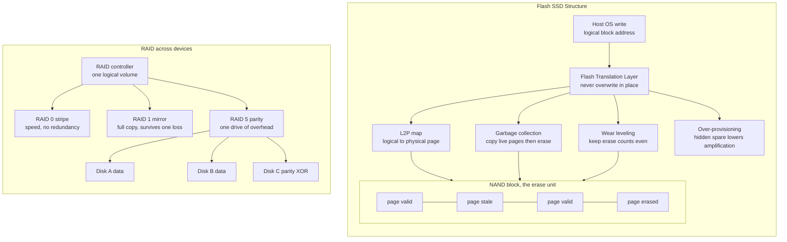

# 💾 Modern File Systems and Storage

> [!abstract] TL;DR
> Storage has moved off spinning platters onto **flash** and beyond, and that shift rewrites the assumptions the operating system was built on. Flash has no moving parts, so a random read costs the same as a sequential one — quietly retiring the elevator-style **disk-scheduling** heuristics that existed only to minimize head travel. But flash has a hard asymmetry: you can **read and program at page granularity, yet erase only a whole block at once, and you cannot overwrite a page in place**. A firmware **Flash Translation Layer (FTL)** hides this by remapping logical addresses to fresh physical pages, performing **garbage collection** to reclaim stale pages, **wear leveling** to spread the limited program/erase cycles, and using **over-provisioning** to keep both cheap — at the cost of **write amplification**, where one logical write becomes several physical ones. The same append-only instinct reshaped file systems (**log-structured** LFS and F2FS, **copy-on-write** ZFS/btrfs/APFS with checksums and snapshots), the wire (**NVMe over PCIe** with deep parallel queues replacing SATA/AHCI), redundancy (**RAID** striping, mirroring, and parity, generalized by **erasure coding**), and the memory boundary itself (**persistent memory** that is byte-addressable and survives power loss).

---

## Intuition

**Analogy.** A spinning **hard disk is a record player.** A physical needle (the read/write head) must travel across the platter to the right circular groove (track) and then wait for the spot you want to rotate under it. If the next thing you need is on the far edge, the arm swings all the way over — slow, mechanical, and *hugely* sensitive to *where* your data sits. That physical reality is the entire reason classical operating systems obsess over **disk scheduling**: reorder the requests so the arm sweeps in one smooth pass instead of thrashing back and forth (the OS sibling note *Disk_Scheduling_and_IO_Management* covers those elevator algorithms).

A **solid-state drive is a vast grid of electronic mailboxes.** There is no arm and nothing spins. To read a location you name its address and the answer comes back essentially instantly, whether it sits next door or across the grid — so "random" and "sequential" reads cost almost the same, and the record-player scheduling tricks lose most of their point. But the mailboxes have a strange rule. You can **drop a note into an *empty* mailbox instantly**, yet you can **never scribble over a note that is already there.** To reuse a filled mailbox you must first **erase an entire *block* of neighbouring mailboxes at once** — you cannot erase just one. And each mailbox door can only survive so many open-erase-refill cycles before it wears out and jams forever.

That one rule — *fast to fill an empty cell, but erasure only happens block-at-a-time and cells wear out* — is the seed from which everything technical in this note grows: the translation layer that always writes to a fresh empty cell, the background janitor that consolidates half-empty blocks so it can erase them, the bookkeeping that spreads the wear so no door jams early, and the file systems and databases that reorganize themselves to *only ever append* so they play to flash's strengths instead of fighting them.

---

## How It Works

### From platters to pages: what actually changed

On a hard disk, the cost of an access is dominated by **seek time** (moving the head) plus **rotational latency** (waiting for the platter). Both scale with *physical distance*, so the OS spends real effort keeping related data contiguous and reordering the request queue. Flash deletes that model. NAND flash is organized as a hierarchy:

- A **page** (typically 4–16 KB) is the smallest unit you can **read** or **program (write)**.
- A **block** (typically 128–512 pages, so a few megabytes) is the smallest unit you can **erase**.
- Programming flips bits one way (1 → 0); only a full-block **erase** resets them back (0 → 1). Hence you **cannot overwrite a page in place** — to change it you must write a fresh page and later erase the whole block.
- Each block tolerates a limited number of **program/erase (P/E) cycles** (thousands for modern TLC/QLC, more for SLC) before its cells become unreliable. This is **endurance**.

Random reads are now nearly as fast as sequential, so the *read* side of disk scheduling is largely moot on SSDs. The action moves entirely to the *write* side, and it lives in firmware.

### The Flash Translation Layer (FTL)

The SSD controller runs an FTL that presents a clean, disk-like array of **logical block addresses (LBAs)** to the OS while doing something completely different underneath. Its core trick is **out-of-place update with a remap table**:

1. **Never overwrite.** When the host writes LBA *X*, the FTL programs the data to some **currently-erased physical page**, then updates its **logical-to-physical (L2P) map** so *X* now points there. The page that *used to* hold *X* is marked **stale (invalid)** — its data is dead but its cell is not yet reusable.
2. **Garbage collection (GC).** Over time blocks fill with a mix of valid and stale pages. To recover space the FTL picks a **victim block**, **copies its still-valid pages elsewhere**, then **erases** the whole block so it becomes free again. Those relocation copies are extra flash writes the host never asked for.
3. **Write amplification (WA).** Because GC recopies live data, **one logical write triggers several physical writes**. `WA = (physical page writes) / (host page writes)`. WA above 1 burns endurance faster and steals bandwidth.
4. **Over-provisioning (OP).** SSDs hide spare capacity (e.g., a "512 GB" drive with 12 % extra NAND) that is never exposed to the OS. More spare means victim blocks tend to be *emptier* when collected, so GC copies fewer live pages — **more over-provisioning directly lowers write amplification.**
5. **Wear leveling.** Since each block has a finite P/E budget, the FTL steers writes so **erase counts stay even across all blocks**. *Dynamic* wear leveling balances the churning hot data; *static* wear leveling occasionally relocates cold, never-updated data off low-wear blocks so those blocks can share the load. Lifetime is set by the *most-worn* block, so evening the distribution directly extends drive life.
6. **TRIM.** When you delete a file, the file system knows the blocks are free but the SSD does not — from the FTL's view those pages still look "valid" and get needlessly copied during GC. The **TRIM** command lets the OS tell the drive "these LBAs are garbage," so the FTL can drop them immediately, shrinking WA.

The FTL is, in effect, a hardware cousin of the OS's own address translation — an L2P map plays the same remapping role that a page table plays for memory (see [[Paging_and_Page_Tables]]).

### Log-structured and copy-on-write file systems

Flash's "always write somewhere fresh" nature is exactly what **log-structured file systems (LFS)** already did in software. LFS (Rosenblum & Ousterhout, 1992) turns the whole disk into one giant **append-only log**: every update is written sequentially at the log head, never overwritten in place, which turns random writes into fast sequential ones and makes crash recovery cheap. Its hard problem is **cleaning** — the software equivalent of GC — compacting log segments to reclaim space. **F2FS** is a modern LFS purpose-built for flash. The idea ties directly to **journaling and copy-on-write**, the subject of the OS sibling note *Journaling_and_Crash_Consistency*, and to database **write-ahead logging** (see [[Write_Ahead_Logging]]) and **LSM-trees** (see [[LSM_Trees]]), which are log-structured storage engines that thrive on flash.

**Copy-on-write (CoW)** next-generation file systems — **ZFS, btrfs, APFS** — take the never-overwrite principle further. A modified block is written to a *new* location and parent pointers are updated up the tree, so the old consistent state remains intact until the new one is fully committed. This gives near-free **snapshots**, atomic updates without a separate journal, end-to-end **checksums** for data integrity, and **self-healing** (a bad block detected by checksum is rebuilt from a redundant copy). ZFS and btrfs fold in **volume management and built-in redundancy**; APFS is Apple's CoW file system tuned for flash.

### RAID: combining many devices

**RAID (Redundant Array of Independent Disks)** ties multiple drives into one logical device for speed, reliability, or both (Patterson, Gibson & Katz, 1988):

- **RAID 0 — striping.** Data is split across drives; N drives give up to N× throughput and capacity, but **any single failure loses everything.** Speed, zero redundancy.
- **RAID 1 — mirroring.** Every block is written to two drives. Survives a disk loss and doubles read parallelism, but pays **50 % capacity overhead.**
- **RAID 5 / 6 — parity.** Data plus a computed **parity** block (XOR) is striped so any one drive (RAID 5) or any two (RAID 6) can be reconstructed. Space-efficient fault tolerance — only one or two drives of overhead regardless of array size.
- **The RAID-5 write hole.** A small write must update both a data block and its parity; if power fails *between* the two, the stripe's parity is now inconsistent and a later reconstruction yields corrupt data. Solutions include battery-backed cache, journals, or CoW file systems that sidestep in-place parity updates.
- **The rebuild problem.** When a drive dies, the array reconstructs it by reading *every* surviving drive in full. With multi-terabyte disks this takes many hours during which a **second failure is fatal** (RAID 5) — which is why large-capacity RAID 5 is now considered risky and RAID 6 or mirroring is preferred.
- **Erasure coding** is the generalization: instead of simple XOR parity, Reed–Solomon-style codes split data into *k* fragments plus *m* redundancy fragments so any *k* of the *k + m* can rebuild the whole — the workhorse of distributed and cloud object stores (see [[Object_Storage]] and [[Distributed_File_Systems]]).

### NVMe, persistent memory, and the shifting hierarchy

Early SSDs spoke **SATA/AHCI**, a protocol designed for one slow mechanical disk: a *single* command queue with a shallow depth. Fast flash starved behind it. **NVMe over PCIe** replaces that with **thousands of deep, independent submission/completion queues**, letting many CPU cores drive the device in parallel with almost no lock contention — matched in the kernel by the **multi-queue block layer (blk-mq)** and low-overhead paths like `io_uring` (see [[Storage_Interfaces_NVMe_SATA]], [[Bus_Architectures_PCIe]], and [[IO_Scheduling_and_io_uring]]; the OS sibling note *Kernel_Bypass_and_Modern_IO* covers user-space polling paths like SPDK). **Persistent memory / storage-class memory** (NVDIMM, 3D XPoint/Optane) goes further, sitting on the memory bus as **byte-addressable, non-volatile** storage: the OS can map it directly with **DAX** so loads and stores hit persistence with no block layer at all — blurring the line between RAM (see [[DRAM_Architecture]]) and disk. The net effect is a compressed **storage hierarchy** (see [[Cache_Hierarchy]]) with new tiers between DRAM and SSD, reshaping database and system design: what to keep in memory, when a cache is worth it, and how to tier hot vs. cold data across local flash and **disaggregated/cloud storage** (the OS sibling note *Distributed_Operating_Systems* and [[Storage_Engine_Internals]] pick up that thread).

### Flow / Architecture



---

## Key Concepts

**Secondary (explain to a curious beginner).**
- HDDs have a moving arm and spinning platters; SSDs have no moving parts, just electronic memory cells, so they are far faster and more shock-resistant.
- On an SSD a random read is about as fast as a sequential one — location no longer matters much for reading.
- Flash cells wear out after a limited number of erases, so drives work hard to spread writes around and avoid wearing any one spot out early.

**Undergraduate (requires OS/CS background).**
- **Page vs. block asymmetry:** read/program per page, erase per block, no in-place overwrite. This forces out-of-place updates and everything that follows.
- **FTL responsibilities:** L2P mapping, garbage collection, wear leveling, over-provisioning, and TRIM handling.
- **Write amplification** and its inverse relationship with over-provisioning; why random small writes are the worst case.
- **Log-structured file systems** (LFS, F2FS): append-only logs, sequential-write friendliness, and the cleaning problem.
- **RAID levels 0/1/5/6**: striping vs. mirroring vs. parity, and their capacity/reliability trade-offs.
- **NVMe vs. SATA/AHCI:** deep multi-queue parallelism versus a single shallow queue.

**Graduate (system-level thinking).**
- **FTL mapping granularity:** page-mapped (flexible, large RAM-resident map), block-mapped (tiny map, terrible small-write WA), and hybrid log-block schemes; the DRAM cost of the map and how it is checkpointed for power loss.
- **GC policy analytics:** greedy vs. cost-benefit victim selection, and the closed-form relationship between over-provisioning, utilization, and steady-state write amplification under random workloads.
- **Copy-on-write internals:** Merkle-style checksum trees, snapshot/clone via reference-counted extents, and the interaction of CoW with parity RAID (avoiding the write hole).
- **Erasure coding** (Reed–Solomon, LRC): tuning *k* and *m* for durability vs. reconstruction cost, and why cloud object stores prefer it over replication at scale.
- **Zoned storage / ZNS and open-channel SSDs:** exposing flash erase-block structure to the host so the file system, not the FTL, manages placement — collapsing two layers of garbage collection into one.
- **Persistent memory programming:** byte-addressable persistence, cache-line flush/fence ordering for crash consistency, DAX mmap, and how it dissolves the classic memory/storage boundary.

---

## Python Demo

```python
# Write amplification and wear leveling in a page-mapped Flash Translation Layer.
#
# Flash rule modelled here: you PROGRAM at page granularity but can only ERASE a
# whole block at once, and you cannot overwrite a page in place. So every update
# writes a fresh page and marks the old one STALE; stale pages are reclaimed only
# by erasing an entire block, which first requires copying out any still-valid
# pages (garbage collection). That copying is WRITE AMPLIFICATION: one host write
# becomes several physical writes. numpy + matplotlib only.
import numpy as np
import matplotlib.pyplot as plt


def simulate(op_ratio, num_blocks=128, ppb=32, n_writes=40000,
             wear_level=True, hot_frac=None, seed=1):
    """Simulate a page-mapped FTL; return (write_amplification, erase_counts)."""
    rng = np.random.default_rng(seed)
    total_phys = num_blocks * ppb
    logical = int(total_phys / (1.0 + op_ratio))     # user-visible capacity

    page_lp = -np.ones((num_blocks, ppb), dtype=np.int64)  # logical id per phys page
    valid   = np.zeros(num_blocks, dtype=np.int64)         # valid pages per block
    erase   = np.zeros(num_blocks, dtype=np.int64)         # P/E (erase) count per block
    state   = np.zeros(num_blocks, dtype=np.int64)         # 0 free, 1 open, 2 full
    l2p_b   = -np.ones(logical, dtype=np.int64)            # logical -> physical block
    l2p_p   = -np.ones(logical, dtype=np.int64)            # logical -> physical page

    free = list(range(num_blocks))
    phys = np.zeros(1, dtype=np.int64)                     # physical page writes counter

    def pick_free():
        # Wear leveling: steer new data toward the LEAST-worn free block.
        if wear_level:
            arr = np.asarray(free)
            b = int(arr[int(np.argmin(erase[arr]))])
            free.remove(b)
        else:
            b = free.pop(0)                               # naive FIFO reuse
        state[b] = 1
        return b

    frontier = [pick_free(), 0]                           # [open block, next page]

    def program(lp):
        if frontier[1] >= ppb:                            # open block full: open a new one
            state[frontier[0]] = 2
            frontier[0] = pick_free()
            frontier[1] = 0
        b, p = frontier[0], frontier[1]
        page_lp[b, p] = lp
        valid[b] += 1
        l2p_b[lp] = b
        l2p_p[lp] = p
        frontier[1] += 1
        phys[0] += 1

    def gc():
        cand = np.where(state == 2)[0]                    # only full blocks are collectible
        if cand.size == 0:
            return
        victim = int(cand[int(np.argmin(valid[cand]))])   # greedy: fewest live pages
        for p in range(ppb):                              # relocate the survivors
            lp = int(page_lp[victim, p])
            if lp >= 0 and l2p_b[lp] == victim and l2p_p[lp] == p:
                program(lp)
        page_lp[victim, :] = -1                            # erase the whole block
        valid[victim] = 0
        erase[victim] += 1
        state[victim] = 0
        free.append(victim)

    # Warm-up: fill the exported capacity once (fits inside the spare, no GC needed).
    for lp in range(logical):
        program(lp)

    # Steady state: random small writes; count only the physical writes from here.
    phys[0] = 0
    for _ in range(n_writes):
        while len(free) < 4 and np.any(state == 2):       # keep a GC buffer of free blocks
            gc()
        if hot_frac is not None and rng.random() < 0.9:   # optional hot/cold skew
            lp = int(rng.integers(0, max(1, int(logical * hot_frac))))
        else:
            lp = int(rng.integers(0, logical))
        if l2p_b[lp] >= 0:
            valid[l2p_b[lp]] -= 1                          # old copy becomes stale
        program(lp)

    return phys[0] / n_writes, erase.copy()


# --- Experiment 1: write amplification vs over-provisioning -------------------
ops = np.array([0.05, 0.08, 0.12, 0.20, 0.30, 0.50, 0.75, 1.00])
wa = np.array([simulate(op)[0] for op in ops])
spare_frac = ops / (1.0 + ops)                            # spare / physical capacity

# --- Experiment 2: wear leveling on vs off (fixed 20% over-provisioning) ------
_, erase_wl  = simulate(0.20, wear_level=True)
_, erase_now = simulate(0.20, wear_level=False)

print("over-provisioning -> write amplification")
for o, a in zip(ops, wa):
    print(f"  OP={o:4.0%}   WA={a:4.2f}x")
print(f"\nWear leveling ON : max erases={erase_wl.max():3d}  std={erase_wl.std():4.1f}")
print(f"Wear leveling OFF: max erases={erase_now.max():3d}  std={erase_now.std():4.1f}")
print("Lifetime is set by the MOST-worn block, so a lower max = a longer-lived drive.")

# --- Plots -------------------------------------------------------------------
fig, (ax1, ax2) = plt.subplots(1, 2, figsize=(13, 5))

ax1.plot(spare_frac * 100, wa, "o-", color="crimson", lw=2, label="simulated greedy GC")
ax1.plot(spare_frac * 100, 1.0 / (2.0 * spare_frac), "k--", alpha=0.6,
         label="1 / (2 x spare fraction) reference")
ax1.axhline(1.0, color="gray", ls=":", label="ideal WA = 1")
ax1.set_xlabel("spare / over-provisioning  [% of physical capacity]")
ax1.set_ylabel("write amplification  (physical / host writes)")
ax1.set_title("More spare space -> less write amplification")
ax1.legend()
ax1.grid(alpha=0.3)

bins = np.arange(0, max(erase_wl.max(), erase_now.max()) + 2)
ax2.hist(erase_now, bins=bins, alpha=0.6, color="darkorange",
         label=f"no wear leveling (max {erase_now.max()})")
ax2.hist(erase_wl, bins=bins, alpha=0.6, color="steelblue",
         label=f"wear leveling (max {erase_wl.max()})")
ax2.set_xlabel("erase (P/E) count per block")
ax2.set_ylabel("number of blocks")
ax2.set_title("Wear leveling flattens erase counts -> longer lifetime")
ax2.legend()
ax2.grid(alpha=0.3)

plt.tight_layout()
plt.show()
```

Running it shows the two headline effects. **Write amplification climbs sharply as over-provisioning shrinks** — with only a few percent spare, garbage collection is forced to collect nearly-full blocks and recopies most of their pages, so one host write can cost several flash writes; add more spare and WA falls toward 1. Separately, **wear leveling tightens the erase-count histogram**: without it a few unlucky blocks are erased far more often, and since the drive dies when its *most-worn* block does, spreading the erases evenly is what turns the rated P/E budget into real usable lifetime.

---

## Real-World Applications

- **Consumer and datacenter SSDs (Samsung, Intel, WD/SanDisk):** every one runs an FTL doing exactly the GC/wear-leveling/over-provisioning dance above. Enterprise drives ship *more* over-provisioning precisely to hold write amplification down and endurance up.
- **F2FS in Android and Linux:** a log-structured file system that writes sequentially to match flash; it ships as the default data-partition file system on many Android phones.
- **ZFS and btrfs:** copy-on-write file systems used across NAS appliances, FreeBSD/illumos, and Linux for checksummed integrity, cheap snapshots, and self-healing over redundant disks. APFS brought CoW to every modern Apple device.
- **RDBMS and LSM engines on flash:** PostgreSQL, MySQL/InnoDB, and RocksDB/Cassandra all tune write patterns for SSDs; LSM-trees in particular batch writes into large sequential runs that flash loves (see [[LSM_Trees]] and [[Storage_Engine_Internals]]).
- **Cloud object storage (Amazon S3, Azure Blob, Ceph, HDFS):** use **erasure coding** instead of full replication to get high durability at a fraction of the storage overhead, and disaggregate storage from compute across the network (see [[Object_Storage]] and [[Distributed_File_Systems]]).
- **NVMe everywhere:** from laptop boot drives to hyperscale servers, NVMe-over-PCIe (and NVMe-over-Fabrics across the network) with blk-mq and `io_uring` is now the default fast path (see [[Storage_Interfaces_NVMe_SATA]]).

---

## Common Pitfalls

- **Assuming disk-scheduling still matters on SSDs.** Elevator/CSCAN reordering exists to cut *head travel*; flash has no head. Applying HDD-era seek-minimizing logic to an SSD wastes effort and can even hurt by defeating the FTL's own batching.
- **Benchmarking a fresh SSD and trusting the numbers.** A brand-new drive has every block erased, so early writes see near-zero write amplification and dazzling speed. Only after the drive reaches **steady state** (fully written, GC active) do you see real sustained performance. Always precondition before benchmarking.
- **Ignoring TRIM.** Without TRIM the FTL keeps faithfully copying data the OS already deleted, inflating write amplification and shortening life. A misconfigured stack (e.g., an encryption or RAID layer that swallows TRIM) silently degrades the drive.
- **Filling an SSD to the brim.** Less free space means less effective over-provisioning, which — as the demo shows — pushes write amplification up steeply and tanks write throughput. Leave headroom.
- **Deploying large-capacity RAID 5.** Multi-terabyte rebuilds take hours of full-array reads during which a second failure destroys the array; the odds are no longer negligible. Prefer RAID 6, mirroring, or erasure coding for big disks.
- **The RAID-5 write hole with in-place parity.** A power loss between the data and parity write leaves an inconsistent stripe that corrupts silently on rebuild. Mitigate with battery-backed cache, a parity journal, or a copy-on-write file system.
- **Trusting RAID as a backup.** RAID protects against *drive* failure, not against deletion, corruption, ransomware, or fire. It is availability, not backup — you still need real, offsite copies.
- **Treating persistent memory like normal RAM.** With PMEM/DAX, durability requires explicit cache-line flushes and fences in the right order; skip them and a crash leaves half-written, torn state despite the media being non-volatile.

---

## Related Concepts

- [[Paging_and_Page_Tables]] — the FTL's logical-to-physical map is a direct analog of the OS page table; both indirect a stable logical name to a movable physical location.
- [[Storage_Interfaces_NVMe_SATA]] — the interconnect side of this story: why NVMe's deep parallel queues replaced single-queue SATA/AHCI for fast flash.
- [[Bus_Architectures_PCIe]] — NVMe rides PCIe; understanding the bus explains where SSD bandwidth and queue depth come from.
- [[IO_Scheduling_and_io_uring]] — how the modern kernel block layer (blk-mq) and `io_uring` feed high-IOPS SSDs without lock contention.
- [[Cache_Hierarchy]] — modern storage adds new tiers (PMEM, SSD, disaggregated) to the classic memory/cache hierarchy, changing what is worth caching.
- [[DRAM_Architecture]] — persistent memory sits on the memory bus and blurs the DRAM/storage boundary this note describes.
- [[LSM_Trees]] — the log-structured storage engine that turns random writes into sequential runs, a perfect match for flash.
- [[Storage_Engine_Internals]] — how databases lay out data on the storage described here, and why write patterns matter.
- [[Write_Ahead_Logging]] — the journaling/append-only idea that ties log-structured file systems to crash-consistent databases.
- [[BTree_Indexes]] — the in-place-update counterpart to LSM-trees; the B-tree-vs-LSM choice is largely a flash write-amplification argument.
- [[Object_Storage]] — where erasure coding generalizes RAID parity for durable, space-efficient cloud storage.
- [[Distributed_File_Systems]] — scaling storage across many nodes with striping, replication, and erasure coding.

---

## Review Questions

1. **(Secondary)** Why is a *random* read on an SSD about as fast as a *sequential* one, while on a hard disk the two can differ by orders of magnitude? What single physical fact about each device explains the difference?
2. **(Undergraduate)** Explain, step by step, why flash cannot overwrite a page in place, and trace how the FTL, garbage collection, and over-provisioning together let the drive *appear* to support in-place updates. Where does write amplification enter?
3. **(Undergraduate)** Given four 4 TB drives, compare RAID 0, RAID 1, RAID 5, and RAID 6 on usable capacity, failures tolerated, and write cost. Which would you avoid for large modern disks, and why?
4. **(Graduate / scenario)** You run a write-heavy OLTP database on an SSD and observe that after a few hours of operation write latency doubles and endurance is being consumed far faster than the host write volume suggests. Diagnose the likely causes (steady-state GC, low free space, missing TRIM, unfriendly write pattern) and propose three concrete mitigations spanning the file system, the drive configuration, and the storage engine.
5. **(Graduate / trade-off)** Persistent memory offers byte-addressable, non-volatile storage on the memory bus. What does this collapse in the traditional OS storage stack, what *new* correctness burden does it place on application programmers, and when would you still prefer an NVMe SSD over PMEM?

---

## Sources

- Arpaci-Dusseau, R. & A. — *Operating Systems: Three Easy Pieces*, Chapter 44, "Flash-based SSDs." [pages.cs.wisc.edu/~remzi/OSTEP/file-ssd.pdf](https://pages.cs.wisc.edu/~remzi/OSTEP/file-ssd.pdf)
- Rosenblum, M. & Ousterhout, J. — "The Design and Implementation of a Log-Structured File System," *ACM TOCS*, 1992. [web.stanford.edu/~ouster/cgi-bin/papers/lfs.pdf](https://web.stanford.edu/~ouster/cgi-bin/papers/lfs.pdf)
- Patterson, D., Gibson, G. & Katz, R. — "A Case for Redundant Arrays of Inexpensive Disks (RAID)," *ACM SIGMOD*, 1988. [dl.acm.org/doi/10.1145/50202.50214](https://dl.acm.org/doi/10.1145/50202.50214)
- Hu, X.-Y. et al. — "Write Amplification Analysis in Flash-Based Solid State Drives," *ACM SYSTOR*, 2009. [dl.acm.org/doi/10.1145/1534530.1534544](https://dl.acm.org/doi/10.1145/1534530.1534544)
- Lee, C. et al. — "F2FS: A New File System for Flash Storage," *USENIX FAST*, 2015. [usenix.org/conference/fast15/technical-sessions/presentation/lee](https://www.usenix.org/conference/fast15/technical-sessions/presentation/lee)

---

#operating-systems #ssd #flash-storage #raid #log-structured-filesystem
