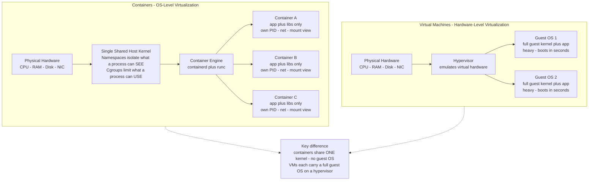

# 📦 Containers and OS-Level Virtualization

> [!abstract] TL;DR
> A **container** is **OS-level virtualization**: instead of virtualizing hardware and running a whole guest OS like a **virtual machine (VM)** does, a container is really *just a Linux process* wrapped in isolation, sharing the **single host kernel** with every other container — no hypervisor, no guest kernel, near-native speed. Two kernel features make it work: **namespaces** control *what a process can SEE* (its own process tree, network interfaces, filesystem view) and **cgroups** control *what a process can USE* (CPU, memory, I/O quotas). The trade is stark: containers start in **milliseconds** and pack **densely**, but because they share one kernel their isolation is **software-enforced and weaker** than a VM's hardware boundary.

## Intuition

**Analogy:** If a **VM is a separate house** — its own foundation, its own plumbing, its own electrical panel, built from scratch on empty land — then a **container is a private apartment inside a shared building**. Your apartment has walls, a locking front door, and its own mailing address, so you get privacy and your own space. But you do **not** own the building's foundation or plumbing: you share the single structure and the single water main with every other tenant. That shared structure is the **host kernel**.

This buys you two things and costs you one. Building an apartment is far cheaper and faster than building a whole house (containers are tiny and boot in milliseconds), and one plot of land fits hundreds of apartments but only a handful of houses (density). The cost: you cannot install a *different foundation* — every apartment runs on the same building, so every container must use the **same host kernel** (you cannot run a Windows container on a Linux kernel), and if the *building's structure* is compromised, every apartment is exposed at once.

---

## How It Works

### Core Mechanics

A container is not a new kind of object the kernel knows about — there is no `container` system call. A container is an ordinary **process** (see [[Processes_and_the_Process_Model]]) that the kernel has been told to *lie to* about its surroundings and *ration* in its resource use. Two independent kernel subsystems do this:

1. **Namespaces — isolate what a process can SEE.** A namespace wraps a global kernel resource so that processes inside the namespace see their own private instance of it. Linux has several kinds:
   - **PID namespace** — the container's first process becomes **PID 1** and sees only its own descendants. A process cannot even *name*, let alone signal, a process outside its namespace.
   - **Network namespace** — the container gets its own network stack: its own interfaces, IP addresses, routing table, and ports. Two containers can both bind port 80 because each has a private `lo` and `eth0`.
   - **Mount namespace** — its own view of the filesystem tree, so the container's `/` is really a subtree of the host, set up with `pivot_root`.
   - **UTS namespace** — its own hostname and domain name.
   - **IPC namespace** — its own System V IPC and POSIX message queues.
   - **User namespace** — its own UID/GID mapping, so **root inside** the container can be an **unprivileged user outside** it (the basis of *rootless* containers).
   - **Cgroup namespace** — hides the host's cgroup hierarchy so the container sees a clean root.

2. **Cgroups (control groups) — limit and account what a process can USE.** Where namespaces are about *visibility*, cgroups are about *quantity*. A cgroup is a hierarchical group of processes with **controllers** attached:
   - **CPU** — weight/shares for proportional fair scheduling under contention, plus a hard **quota** (e.g. `50ms` of CPU per `100ms` period equals half a core). This rides on top of the kernel's [[CPU_Scheduling_Algorithms]].
   - **Memory** — a hard limit; exceeding it triggers reclaim and finally the **OOM killer**, tying directly into [[Memory_Management_and_Allocation]].
   - **I/O (blkio)** — read/write bandwidth and IOPS caps per device.
   - **pids / devices** — cap the number of processes and gate which device nodes are reachable.

3. **Supporting pieces.** Namespaces and cgroups give isolation and metering; three more pieces make containers *practical*:
   - **Union / overlay filesystems** (`overlay2`) stack read-only **image layers** under a thin writable layer using **copy-on-write** — this is why images are small, shareable, and start instantly (see the future *File_System_Implementation* note). Ten containers from the same image share one on-disk copy of the base layers.
   - **Capabilities and seccomp** shrink the attack surface: Linux **capabilities** split root's power into ~40 pieces so a container can hold, say, `NET_BIND_SERVICE` without full root, and **seccomp-BPF** filters which system calls the process may even make. These are the container-era expression of classic **protection and access control**.
   - **chroot → pivot_root** is the ancestor: `chroot` in 1979 confined a process to a filesystem subtree — the first crude "container."

4. **The key insight.** A container **virtualizes user space, not the kernel**. All isolation happens *above* the one running kernel. A VM instead **virtualizes hardware**: a **hypervisor** presents virtual CPUs, memory, and devices, and each VM boots a *complete guest OS with its own kernel*. That single architectural difference — share the kernel vs. emulate the hardware — explains every downstream trade-off in performance, density, and security.

### Container vs VM Architecture



---

## Key Concepts

**Secondary (foundational):**
- A container is a **process with isolation**, not a tiny VM — there is no guest operating system inside it.
- All containers on a host **share one kernel**; a VM carries its own kernel and boots a full OS.
- **Namespaces = what you can see; cgroups = how much you can use.** Memorize this pairing.
- Containers start in **milliseconds** and use **megabytes**, so one host runs far more of them than VMs.
- An **image** is a stack of read-only layers; a running container adds one thin writable layer on top.

**Undergraduate (mechanism-level):**
- The **seven namespace types** (PID, network, mount, UTS, IPC, user, cgroup) and exactly which global resource each virtualizes.
- **Cgroup v2** unified hierarchy: CPU weight vs. hard quota/period, memory limit and OOM behavior, I/O throttling, `pids` cap.
- **Copy-on-write overlay filesystems**: how layer sharing and the CoW writable layer make images deduplicated and startup near-instant.
- **Capabilities** and **seccomp-BPF** as the least-privilege controls that harden a container beyond raw namespace isolation.
- The **OCI standards** (image-spec and runtime-spec) and the runtime stack **containerd → runc**, which decouple "Docker the tool" from "the container standard."

**Graduate (systems and security-level):**
- The **shared-kernel attack surface**: a single kernel vulnerability can break out of *every* container at once — the fundamental security asymmetry vs. a hypervisor's hardware-enforced boundary.
- **Container escapes** via misconfigured mounts, dangerous capabilities (`CAP_SYS_ADMIN`), exposed host sockets, or kernel bugs — and mitigations: **rootless** containers, **user namespaces**, **AppArmor/SELinux** MAC policies, **seccomp** profiles.
- **Sandboxed runtimes** that re-introduce a boundary: **gVisor** runs a user-space guest-kernel that intercepts syscalls, **Kata Containers** wraps each container in a lightweight VM. Both trade some performance for VM-grade isolation.
- The **convergence with microVMs**: **Firecracker** boots a minimal VM in ~125 ms with a few MB overhead, blending container density with VM isolation — the model behind AWS Lambda and Fargate. See the future *Virtualization_and_Hypervisors* and *The_Future_of_Operating_Systems* notes.
- **Orchestration at scale**: [[Kubernetes_Core_Concepts]] schedules containers across a cluster, providing service discovery, autoscaling, and self-healing — the leap from one host to a distributed system (future *Distributed_Operating_Systems* note).

---

## Python Demo

```python
# Two things this models:
#   (A) cgroup behavior on ONE host - a hard CPU quota throttling a bursty
#       container, and weighted fair-share dividing a contended host among
#       competing containers (max-min style water-filling by cgroup weight).
#   (B) the VM-vs-container-vs-process density/startup trade-off - why
#       containers boot in milliseconds and pack an order of magnitude denser.
# numpy + matplotlib only.

import numpy as np
import matplotlib.pyplot as plt

rng = np.random.default_rng(42)

# ---------------------------------------------------------------------------
# (A1) CPU QUOTA: one container with a hard cap of 2.0 cores, bursty demand
# ---------------------------------------------------------------------------
t = np.arange(0, 120)                       # 120 scheduler periods
quota = 2.0                                 # cgroup cpu.max = 2 cores
demand = 1.0 + 2.2 * (np.sin(t / 8.0) ** 2) # oscillates ~1.0 .. 3.2 cores
demand += rng.normal(0, 0.08, size=t.shape)
demand = np.clip(demand, 0, None)
throttled = np.minimum(demand, quota)       # cgroup enforces the ceiling

# ---------------------------------------------------------------------------
# (A2) FAIR SHARE under contention: 3 containers, weighted cgroup shares,
#      competing for a host with only 4.0 cores. Water-fill by weight,
#      capped at each container's actual demand (max-min fairness).
# ---------------------------------------------------------------------------
host_cores = 4.0
weights = np.array([3.0, 2.0, 1.0])         # cpu.weight ratios 3:2:1

def weighted_fair_share(dem, w, capacity):
    """Distribute 'capacity' among tasks by weight, capped at each demand."""
    dem = np.asarray(dem, float)
    alloc = np.zeros_like(dem)
    active = np.ones_like(dem, dtype=bool)
    remaining = capacity
    while active.any() and remaining > 1e-9:
        wsum = w[active].sum()
        offer = np.zeros_like(dem)
        offer[active] = remaining * w[active] / wsum
        want = dem - alloc                  # how much more each still wants
        capped = active & (want <= offer)   # demand-limited this round
        if capped.any():
            alloc[capped] += want[capped]
            remaining -= want[capped].sum()
            active[capped] = False
        else:
            alloc[active] += offer[active]  # everyone weight-limited: done
            remaining = 0.0
    return alloc

# Sweep: containers get progressively hungrier so contention rises over time.
steps = np.arange(0, 100)
alloc_ts = np.zeros((len(steps), 3))
for i, s in enumerate(steps):
    d = np.array([0.4 + 0.03 * s,           # A ramps up
                  0.4 + 0.03 * s,           # B ramps up
                  0.4 + 0.03 * s])          # C ramps up
    alloc_ts[i] = weighted_fair_share(d, weights, host_cores)

# ---------------------------------------------------------------------------
# (B) DENSITY / STARTUP: bare process vs container vs VM
# ---------------------------------------------------------------------------
kinds       = ["Bare\nprocess", "Container", "VM"]
startup_ms  = np.array([2.0, 50.0, 25000.0])     # ms to ready
mem_mb      = np.array([8.0, 40.0, 1024.0])      # resident MB incl. OS overhead
host_ram_gb = 128.0
density     = (host_ram_gb * 1024) / mem_mb      # instances per 128 GB host

# ---------------------------------------------------------------------------
# Plot
# ---------------------------------------------------------------------------
fig, ax = plt.subplots(2, 2, figsize=(13, 9))

# (A1) quota throttling
ax[0, 0].plot(t, demand, label="CPU demand", color="tab:red", lw=1.5)
ax[0, 0].plot(t, throttled, label="Actual usage (throttled)",
              color="tab:blue", lw=2)
ax[0, 0].axhline(quota, ls="--", color="black", label="cgroup quota = 2.0 cores")
ax[0, 0].fill_between(t, throttled, demand, where=demand > quota,
                      color="tab:red", alpha=0.2, label="throttled away")
ax[0, 0].set_title("(A1) cgroup CPU quota: hard ceiling on a bursty container")
ax[0, 0].set_xlabel("scheduler period"); ax[0, 0].set_ylabel("CPU cores")
ax[0, 0].legend(fontsize=8); ax[0, 0].grid(alpha=0.3)

# (A2) fair share
ax[0, 1].stackplot(steps, alloc_ts.T,
                   labels=["Container A (weight 3)",
                           "Container B (weight 2)",
                           "Container C (weight 1)"],
                   colors=["tab:blue", "tab:green", "tab:orange"], alpha=0.8)
ax[0, 1].axhline(host_cores, ls="--", color="black",
                 label="host capacity = 4 cores")
ax[0, 1].set_title("(A2) Weighted fair-share as contention rises (3:2:1)")
ax[0, 1].set_xlabel("time -> hungrier containers")
ax[0, 1].set_ylabel("cores allocated")
ax[0, 1].legend(fontsize=8, loc="upper left"); ax[0, 1].grid(alpha=0.3)

# (B1) startup time (log scale)
bars = ax[1, 0].bar(kinds, startup_ms,
                    color=["tab:green", "tab:blue", "tab:red"])
ax[1, 0].set_yscale("log")
ax[1, 0].set_title("(B1) Startup time to ready (log scale)")
ax[1, 0].set_ylabel("milliseconds")
for b, v in zip(bars, startup_ms):
    ax[1, 0].text(b.get_x() + b.get_width() / 2, v * 1.15,
                  f"{v:.0f} ms", ha="center", fontsize=9)
ax[1, 0].grid(alpha=0.3, axis="y")

# (B2) memory footprint -> density
bars2 = ax[1, 1].bar(kinds, mem_mb,
                     color=["tab:green", "tab:blue", "tab:red"])
ax[1, 1].set_title("(B2) Memory footprint -> density on a 128 GB host")
ax[1, 1].set_ylabel("resident memory (MB)")
for b, v, d in zip(bars2, mem_mb, density):
    ax[1, 1].text(b.get_x() + b.get_width() / 2, v + 20,
                  f"{v:.0f} MB\n~{d:,.0f} fit", ha="center", fontsize=9)
ax[1, 1].grid(alpha=0.3, axis="y")

plt.suptitle("Containers: cgroup enforcement + why they beat VMs on density and startup",
             fontsize=13, fontweight="bold")
plt.tight_layout(rect=[0, 0, 1, 0.97])
plt.savefig("containers_vs_vms.png", dpi=110)
print("Saved containers_vs_vms.png")
print(f"Density: process {density[0]:,.0f} | container {density[1]:,.0f} | VM {density[2]:,.0f}")
```

**What it shows.** Panel A1: a container demanding up to 3.2 cores is clamped to its 2.0-core `cpu.max` quota every period — the red shaded area is throughput the cgroup *throttled away*. Panel A2: as three containers grow hungry and their combined demand exceeds the 4-core host, the kernel divides the host by their cgroup **weights** (3:2:1), a max-min fair split — no container is starved, but each is bounded by its share. Panels B1/B2: a container boots ~500x faster than a VM and uses ~25x less memory, so the same 128 GB host that fits ~125 VMs fits thousands of containers. That density-plus-startup gap is the entire economic argument for containers.

---

## Real-World Applications

- **Microservices** — each service ships as an independent container image with pinned dependencies; hundreds run per host. See [[Microservices]] and [[Monolith_vs_Microservices]].
- **CI/CD** — every pipeline job runs in a fresh, disposable container for a clean, reproducible build/test environment; tie-in with GitHub Actions and GitLab runners.
- **Reproducible environments** — "works on my machine" dies because the image *is* the environment; the same layers run on a laptop, in CI, and in production.
- **Serverless / FaaS** — AWS Lambda and Fargate run functions inside **Firecracker microVMs**, blending container density with VM isolation for safe multi-tenancy.
- **Orchestrated fleets** — [[Kubernetes_Core_Concepts]] schedules, scales, load-balances, and self-heals containers across a cluster; the container is the unit of deployment for most cloud-native systems.
- **Sandboxing untrusted code** — multi-tenant platforms wrap user workloads in **gVisor** or **Kata Containers** to add a stronger boundary than plain namespaces.

---

## Common Pitfalls

- **"A container is a lightweight VM."** No — it has *no guest kernel*. It is a host process with isolation. Getting this wrong leads to expecting VM-grade isolation you do not have.
- **Running as root / `--privileged`.** A privileged container disables most isolation and hands an escape a clear path to the host. Drop capabilities, use **user namespaces**, and prefer **rootless** containers.
- **Assuming kernel isolation.** Every container shares the host kernel, so **one kernel CVE can break out of all of them**. For hostile multi-tenancy you need a hypervisor boundary (Kata/Firecracker) or a syscall sandbox (gVisor).
- **No memory limit.** Without a cgroup `memory.max`, one leaky container can invoke the host **OOM killer** and take down neighbors. Always set limits.
- **CPU quota vs. weight confusion.** A **quota** is a hard cap even on an idle host; a **weight** only matters under contention. Setting a tight quota can throttle a latency-sensitive service on a machine that has plenty of spare CPU.
- **Fat images and secrets in layers.** Copy-on-write layers are immutable and cached — a secret `COPY`d into an early layer stays recoverable even if a later layer deletes it. Use multi-stage builds and secret mounts (see [[Container_Security_and_Hardening]]).
- **Mounting the Docker socket into a container.** Handing `/var/run/docker.sock` to a container is effectively giving it root on the host.

---

## Related Concepts

- [[Processes_and_the_Process_Model]] — a container *is* a process (group) with namespaces and cgroups bolted on; the process abstraction is the substrate containers isolate.
- [[CPU_Scheduling_Algorithms]] — cgroup CPU weights and quotas ride on top of the kernel's process scheduler to divide and cap CPU among containers.
- [[Memory_Management_and_Allocation]] — cgroup memory limits, reclaim, and the OOM killer are how a container's RAM is bounded and accounted.
- [[Docker_Architecture_and_Internals]] — the concrete implementation: `dockerd → containerd → runc`, the six namespaces, cgroups v2, and overlay2 in practice.
- [[Container_Security_and_Hardening]] — capabilities, seccomp, AppArmor/SELinux, rootless, and image hygiene that harden the shared-kernel boundary.
- [[Container_Registry_and_Distribution]] — how OCI images (the layered filesystems this note describes) are stored, versioned, and pulled.
- [[Kubernetes_Core_Concepts]] — orchestration: scheduling, service discovery, scaling, and self-healing containers across a cluster.
- [[Container_and_Kubernetes_Security]] — the security view of the same shared-kernel attack surface, escapes, and cluster hardening.
- [[Microservices]] / [[Monolith_vs_Microservices]] — the architectural pattern that containers made economical to deploy.

> Not yet in the vault (referenced in prose): *Virtualization_and_Hypervisors*, *OS_Security_and_Isolation*, *Protection_and_Access_Control*, *File_System_Implementation*, *Distributed_Operating_Systems*, *The_Future_of_Operating_Systems* — link these once created.

---

## Review Questions

**Tier 1 — Conceptual (explain to a peer):**
1. What are the two Linux kernel mechanisms that make containers possible, and what does each one control? Give one namespace and one cgroup controller as examples.
2. Complete the sentence and defend it: "A container is really just a ______." Why is calling it a "lightweight VM" misleading?

**Tier 2 — Applied (reason about a scenario):**
3. You run 200 microservice replicas on one host. One replica has a memory leak. With and without a cgroup `memory.max` limit, describe what happens to the *other 199* replicas and why.
4. A latency-sensitive service occasionally spikes to 3 cores but you set its cgroup CPU **quota** to 1 core on an 8-core host that is 80% idle. It misses its latency SLO. What went wrong, and would a CPU **weight** instead of a **quota** fix it?

**Tier 3 — Systems / trade-off (design judgment):**
5. You are building a platform that runs *arbitrary untrusted customer code* with strong isolation but still wants fast startup and high density. Compare plain containers, gVisor, Kata Containers, and Firecracker microVMs along the isolation-vs-overhead axis. Which would you pick and why?
6. Explain precisely why a single Linux kernel vulnerability is a fundamentally more dangerous event in a container fleet than in a VM fleet running on a hypervisor. What is the architectural root cause, and what mitigations narrow the gap?

---

## Sources

- Michael Kerrisk, "Namespaces in operation" (7-part series), *LWN.net* — https://lwn.net/Articles/531114/
- Linux Kernel Documentation, "Control Group v2" — https://docs.kernel.org/admin-guide/cgroup-v2.html
- Open Container Initiative, image-spec and runtime-spec — https://opencontainers.org/
- W. Felter et al., "An Updated Performance Comparison of Virtual Machines and Linux Containers," *IEEE ISPASS 2015* — https://ieeexplore.ieee.org/document/7095802
- A. Agache et al., "Firecracker: Lightweight Virtualization for Serverless Applications," *USENIX NSDI 2020* — https://www.usenix.org/conference/nsdi20/presentation/agache
- gVisor documentation, "What is gVisor?" — https://gvisor.dev/docs/

---

#operating-systems #containers #namespaces #cgroups #docker
