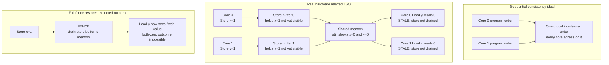

# 🔀 Memory Consistency and Concurrent Data Structures

> [!abstract] TL;DR
> On a modern multicore, the order in which one core's memory writes become visible to another core is **not** your program order. CPUs and compilers **reorder loads and stores** for speed using **store buffers**, caches, and out-of-order execution, so a value written by core A can be seen *late* or *out of order* by core B. A **memory consistency model** is the hardware/language **contract** stating exactly which reorderings are legal. **Sequential consistency** — every core sees one shared interleaving in program order — is the intuitive ideal but too slow to implement fully, so real machines ship **relaxed models** (**TSO** on x86, weaker on ARM/POWER). To force ordering when you need it you insert **memory barriers/fences** with **acquire-release** semantics. On top of the atomic primitives **compare-and-swap (CAS)**, **fetch-and-add**, and **load-linked/store-conditional**, you can build **lock-free** and **wait-free** data structures that never deadlock and scale better than locks — at the cost of subtle correctness bugs like the **ABA problem** and performance traps like **false sharing**.

---

## Intuition

**Analogy — a team taking notes before posting to a shared whiteboard.** Imagine four people (CPU cores) collaborating in a room. Each has a private scratchpad (a **store buffer** / cache) where they jot updates *fast*, because writing on the shared whiteboard (main memory) is slow and everyone would queue for the pen. Every so often each person walks over and copies a batch of their scratchpad notes onto the board.

Now the trap: Alice writes "x is done" on her scratchpad, then immediately reads the board to check "is y done?". But Alice hasn't *posted* "x is done" to the board yet — it's still on her pad. Meanwhile Bob did the mirror thing with y. Each read the board *before the other's note landed*, so **both** conclude the other isn't finished, even though each finished first. Nobody lied and nobody was careless — each person just **optimized their own writing order**, and the result is that two observers disagree about the order events happened.

A **memory model** is the written-down office rule for this room: which shortcuts are allowed, and — crucially — the one command ("**walk to the board and post everything you have before reading it**") that forces everyone back into agreement. That forced-sync command is a **memory barrier**. The whole discipline of memory consistency is about knowing when the cheap default is fine and when you must pay for the barrier.

---

## How It Works

### The surprising reality: memory operations do not happen in program order

You wrote your code as a sequence. The hardware does not promise to make that sequence *visible to other cores* in that order. Three mechanisms reorder it:

1. **Store buffers.** A store to a cache line the core does not own would stall while the [[Cache_Coherence_MESI|coherence]] protocol fetches ownership. Instead the CPU dumps the store into a private FIFO **store buffer** and moves on. The store becomes globally visible *later*, when the buffer drains. Meanwhile the core's own later loads can execute — so a **store followed by a load of a different address can appear reordered** to other cores. This single mechanism is the root of the whole "both read stale" hazard.
2. **Caches and coherence delay.** A write lands in the writer's cache first; other cores see it only after coherence traffic propagates. Coherence guarantees they *eventually* agree on each single location's value, but says nothing about *cross-location* ordering.
3. **Out-of-order and speculative execution + compiler reordering.** The [[Superscalar_and_Out_of_Order_Execution|out-of-order engine]] and the optimizing compiler both freely reorder independent memory ops. A `volatile`-free read can be hoisted out of a loop; two independent stores can be swapped.

### Coherence vs consistency — a distinction people constantly conflate

- **Cache coherence** is about a **single memory location**: all cores must agree on the sequence of values *that one address* takes, and a write eventually propagates to all. **MESI** and friends provide this (see [[Cache_Coherence_MESI]] and [[Memory_Hierarchy_and_Caching]]).
- **Memory consistency** is about the **ordering across different locations**: given writes to `x` and `y`, in what orders may other cores observe them? Coherence gives you nothing here. You can have a perfectly coherent machine where core B sees B's writes to `x` and `y` in the opposite order A performed them. Consistency is the harder, weaker guarantee, and it is the contract this note is about.

### The spectrum of memory consistency models

A **memory consistency model** is the formal contract listing which of the four reorderings — store→store, store→load, load→load, load→store — the machine may perform.

| Model | What it allows | Where you meet it |
|---|---|---|
| **Sequential Consistency (SC)** | Nothing. All cores observe one global interleaving that respects each core's program order. | The intuitive ideal; assumed by Peterson/Dekker; too slow to implement fully. |
| **Total Store Order (TSO)** | Only **store→load** reordering, via the store buffer. Stores from one core still reach others in order. | **x86 / x86-64**. Strong enough that most naive code "accidentally works," which hides bugs. |
| **Weak / Relaxed (ARM, POWER, RISC-V)** | Almost everything reorders unless you add barriers; stores can even reach different cores in different orders. | **ARM, POWER, RISC-V**. Cheap hardware, but lock-free code that passed on x86 breaks here. |

The engineering tension: SC is what programmers *want* to reason about, but enforcing it would serialize the store buffer and kill throughput. Relaxed models expose the fast hardware and hand the programmer the tools — **fences** — to buy back ordering only where correctness needs it. (See [[Memory_Consistency_Models]] for the architecture-level treatment.)

### Memory barriers / fences and acquire-release

A **fence** is an instruction that forbids the CPU (and, as a compiler intrinsic, the compiler) from reordering memory ops across it:

- **Store fence (`sfence`)** — all prior stores become visible before any later store.
- **Load fence (`lfence`)** — all prior loads complete before any later load.
- **Full fence (`mfence`)** — a total barrier; nothing crosses in either direction. This is what a lock acquire/release, or a `std::atomic` with `seq_cst`, compiles to.

Most real code uses the cheaper **acquire-release** pair rather than a full fence:

- An **acquire** load: no later memory op may be reordered *before* it. Used when *taking* a lock or reading a "published" flag.
- A **release** store: no earlier memory op may be reordered *after* it. Used when *publishing* data then setting a "ready" flag.
- Pairing a release-store on the producer with an acquire-load on the consumer guarantees the consumer sees **everything the producer wrote before the release**. This is the workhorse of correct lock-free code and maps directly onto the `memory_order_acquire` / `memory_order_release` options in the C++11 and Java memory models (see [[Cpp_Concurrency]], [[Java_Memory_Model]], and [[Memory_Barriers_and_Ordering]]).

### Atomic primitives — the hardware you build everything on

Lock-free structures are built from indivisible **read-modify-write** instructions:

- **Compare-and-swap (CAS)** — `CAS(addr, expected, new)` atomically writes `new` only if `*addr == expected`, returning success/failure. The universal primitive (Herlihy's consensus number ∞).
- **Fetch-and-add** — atomic `*addr += n` returning the old value; ideal for counters and ticket locks.
- **Load-linked / store-conditional (LL/SC)** — ARM/POWER/RISC-V pair: `LL` reads and tags a line, `SC` writes only if the line was untouched since. Avoids the ABA problem CAS suffers.

### The store-buffer hazard and how a fence fixes it



### Building lock-free data structures with CAS retries

The lock-free idiom replaces "grab a lock, mutate, release" with an **optimistic retry loop**:

1. Read the current shared state into a local snapshot.
2. Compute the new state locally.
3. `CAS` the shared pointer/value from the snapshot to the new state.
4. If the CAS **fails** (someone else changed it first), **retry from step 1**.

A lock-free **counter** is just `fetch_and_add`. A lock-free **Treiber stack** does: read `head`, set `new_node.next = head`, `CAS(&head, head, new_node)`; retry on failure. No thread ever holds a lock, so **no deadlock is possible** and a stalled thread cannot block the others.

**Non-blocking progress guarantees** form a hierarchy:

- **Obstruction-free** — a thread makes progress if it eventually runs alone (weakest).
- **Lock-free** — *some* thread always makes progress system-wide; individual threads may starve under contention (what CAS-retry stacks give you).
- **Wait-free** — *every* thread finishes in a bounded number of steps regardless of contention (strongest, hardest, e.g. wait-free queues using announcement/helping).

### The ABA problem

CAS checks *value equality*, not *"did anything happen."* If a location goes `A → B → A` between your read and your CAS, the CAS **succeeds** as if nothing changed — but the world moved and moved back. In a lock-free stack, a popped node can be freed and its address **reused** for a new node; your CAS then splices freed or wrong memory. Fixes:

- **Tagged/versioned pointers** — pack a monotonic counter next to the pointer; `A(v1) → A(v3)` now differs, so CAS fails. Needs double-width CAS.
- **Hazard pointers** — each thread publishes the pointers it is about to dereference; memory is not reclaimed while any hazard pointer references it.
- **LL/SC** — detects *any* intervening write to the line, so ABA cannot fool it.
- **Epoch-based reclamation / RCU** — defer freeing until no reader can hold a stale reference.

### Read-Copy-Update (RCU)

**RCU** is the Linux kernel's scalable synchronization for **read-mostly** data. Readers pay **near-zero cost** — no locks, no atomics, often just a compiler barrier — and never block. Writers make a **copy**, mutate it, and **atomically publish** the new version with a release-store; the old version is freed only after a **grace period** during which every pre-existing reader has finished. RCU trades slightly more expensive, deferred writes for essentially free reads, which is why it protects hot read-mostly kernel structures like the dentry cache and routing tables.

### False sharing — a coherence performance bug

Coherence operates at **cache-line** granularity (typically 64 bytes), not per variable. If two threads update **two different variables that happen to sit on the same line**, every write invalidates the other core's copy of the whole line, ping-ponging it back and forth even though the threads never touch the *same* datum. This **false sharing** can slash throughput by 10x. The fix is **padding/alignment** — put hot per-thread variables on their **own** cache line (e.g. C++ `alignas(64)`, Java `@Contended`, a 64-byte struct padding). It is a classic invisible performance bug; see [[Memory_Hierarchy_and_Caching]].

---

## Key Concepts

### Secondary (intuition level)
- Each CPU core has a private scratchpad; it writes there first and posts to shared memory later, so two cores can **disagree about the order** things happened.
- A **memory model** is the rulebook for which reorderings are allowed; a **memory barrier** is the command that forces everyone to sync up.
- **Lock-free** means no locks: threads *try* an update and **retry** if someone beat them — so nobody can ever get stuck holding a lock (no deadlock).

### Undergraduate (OS / architecture course level)
- The four reorderings — **store→store, store→load, load→load, load→store** — and which each model permits: **SC** none, **TSO** only store→load, **ARM/POWER** almost all.
- **Coherence** (agreement on one address's values) vs **consistency** (ordering across addresses) — coherence is necessary but not sufficient.
- **Fences**: store/load/full; **acquire** (nothing moves before it) and **release** (nothing moves after it), paired producer→consumer to publish data safely.
- **Atomic RMW** primitives: **CAS**, **fetch-and-add**, **LL/SC**; the CAS-retry loop; the **Treiber stack**.
- The **ABA problem** and the standard fixes (tagged pointers, hazard pointers, LL/SC).
- **False sharing** and the padding/alignment fix.

### Graduate (systems / research level)
- The **non-blocking hierarchy**: obstruction-free ⊂ lock-free ⊂ wait-free; helping/announcement arrays to reach wait-freedom; consensus numbers (CAS = ∞).
- **Data races are undefined behavior** in the C++/Java models: the compiler may assume they never happen, so a benign-looking race can be miscompiled into arbitrary behavior. Correctness must be argued in terms of the **happens-before** relation, not intuition.
- **Memory reclamation** as the hard part of lock-free design: hazard pointers vs **epoch-based reclamation** vs **RCU** grace periods; the interaction with the ABA problem.
- **Litmus tests** (SB store-buffer, IRIW independent-reads-of-independent-writes, MP message-passing) as the formal way to specify and verify a model; tools like `herd`/`litmus` and the C++11 axiomatic model.
- Why atomics scale poorly under contention: every CAS needs the line in **Modified/Exclusive** state, serializing cores through the coherence fabric — the same reason **backoff** and **combining** matter (see [[Multi_Core_Programming]]).

---

## Python Demo

Two independent simulations, **numpy/matplotlib only** — no real threads. The first models **CAS-retry contention with and without exponential backoff**; the second reproduces the **store-buffer reordering hazard** (the Dekker/SB litmus test) and shows a fence eliminating the anomaly.

```python
# Memory consistency and lock-free data structures: two simulations.
# (1) CAS-retry lock-free counter under contention, with/without backoff.
# (2) Store-buffer (Dekker / SB litmus) reordering, with/without a fence.
# numpy + matplotlib only. No real threads: we model the coherence serialization.
import numpy as np
import matplotlib.pyplot as plt

rng = np.random.default_rng(7)

# ----------------------------------------------------------------------
# (1) LOCK-FREE COUNTER: CAS retries under contention.
# Model: time advances in discrete "coherence slots". A CAS on the hot
# cache line is serialized -> at most ONE thread commits per slot. Every
# other thread that attempted in the same slot FAILS its CAS and must retry.
# Without backoff a loser retries next slot; with exponential backoff it
# waits a random 1..2^fails slots, thinning the contending set.
# ----------------------------------------------------------------------
def simulate_cas(n_threads, T, backoff, rng, cap=6):
    next_t = np.zeros(n_threads, dtype=np.int64)   # slot each thread next attempts
    fails  = np.zeros(n_threads, dtype=np.int64)   # consecutive-fail counter
    successes = 0                                  # committed increments (useful work)
    wasted    = 0                                  # failed CAS attempts (pure waste)
    for t in range(T):
        contenders = np.where(next_t == t)[0]
        if contenders.size == 0:
            continue                               # idle slot (everyone backed off)
        winner = contenders[rng.integers(contenders.size)]
        successes += 1                             # exactly one CAS commits
        fails[winner] = 0
        next_t[winner] = t + 1                     # winner immediately wants next increment
        losers = contenders[contenders != winner]
        wasted += losers.size                      # the rest wasted a CAS
        for l in losers:
            fails[l] += 1
            if backoff:
                delay = rng.integers(1, 2 ** min(int(fails[l]), cap) + 1)
            else:
                delay = 1                          # spin: retry the very next slot
            next_t[l] = t + delay
    return successes, wasted

T = 40000
thread_counts = np.arange(1, 25)
thr_spin, thr_back = [], []          # throughput = successes / T
waste_spin, waste_back = [], []      # wasted retries per successful increment

for n in thread_counts:
    s0, w0 = simulate_cas(n, T, backoff=False, rng=rng)
    s1, w1 = simulate_cas(n, T, backoff=True,  rng=rng)
    thr_spin.append(s0 / T);           thr_back.append(s1 / T)
    waste_spin.append(w0 / max(s0, 1)); waste_back.append(w1 / max(s1, 1))

print("=== CAS-retry lock-free counter ===")
print(f"threads=24  no-backoff : throughput={thr_spin[-1]:.3f}  wasted/success={waste_spin[-1]:.1f}")
print(f"threads=24  backoff    : throughput={thr_back[-1]:.3f}  wasted/success={waste_back[-1]:.1f}")

# ----------------------------------------------------------------------
# (2) STORE-BUFFER LITMUS (SB / Dekker):
#   init x=0, y=0
#   Thread 0:  store x=1 ; r0 = load y
#   Thread 1:  store y=1 ; r1 = load x
# Under SC the outcome (r0==0 AND r1==0) is IMPOSSIBLE. Under TSO a store
# sits in the store buffer, so a load can execute before the OTHER thread's
# store drains -> both read the stale 0. A full fence between store and load
# drains the buffer first, forbidding the both-zero outcome.
# Events with random global times: W0,R0,W1,R1. r0=1 iff W1<R0 ; r1=1 iff W0<R1.
# Fence => program order W0<R0 and W1<R1 must hold (rejection sampling).
# ----------------------------------------------------------------------
def litmus(rng, fenced, trials=200000):
    both_zero = 0
    for _ in range(trials):
        while True:
            t = rng.random(4)                  # times for [W0, R0, W1, R1]
            if fenced and not (t[0] < t[1] and t[2] < t[3]):
                continue                       # fence forces store-before-load
            break
        r0 = 1 if t[2] < t[1] else 0           # thread0 sees y: W1 before R0 ?
        r1 = 1 if t[0] < t[3] else 0           # thread1 sees x: W0 before R1 ?
        if r0 == 0 and r1 == 0:
            both_zero += 1
    return both_zero / trials

p_nofence = litmus(rng, fenced=False)
p_fence   = litmus(rng, fenced=True)
print("\n=== Store-buffer litmus (both read stale 0) ===")
print(f"no fence (relaxed TSO): P(r0==0 and r1==0) = {p_nofence:.3f}  -> anomaly happens")
print(f"with full fence       : P(r0==0 and r1==0) = {p_fence:.3f}  -> anomaly forbidden")

# ----------------------------------------------------------------------
# PLOTS
# ----------------------------------------------------------------------
fig, ax = plt.subplots(1, 3, figsize=(16, 4.6))

ax[0].plot(thread_counts, thr_spin, "o-", color="#DC2626", label="no backoff (spin)")
ax[0].plot(thread_counts, thr_back, "s-", color="#065F46", label="exponential backoff")
ax[0].set_title("Lock-free counter throughput")
ax[0].set_xlabel("threads contending"); ax[0].set_ylabel("committed increments / slot")
ax[0].legend(); ax[0].grid(alpha=0.3)

ax[1].plot(thread_counts, waste_spin, "o-", color="#DC2626", label="no backoff (spin)")
ax[1].plot(thread_counts, waste_back, "s-", color="#065F46", label="exponential backoff")
ax[1].set_title("Wasted CAS retries balloon with contention")
ax[1].set_xlabel("threads contending"); ax[1].set_ylabel("failed CAS per successful increment")
ax[1].legend(); ax[1].grid(alpha=0.3)

bars = ax[2].bar(["no fence\n(relaxed)", "full fence"], [p_nofence, p_fence],
                 color=["#DC2626", "#065F46"], edgecolor="black")
ax[2].set_title("Store-buffer hazard: P(both read stale 0)")
ax[2].set_ylabel("fraction of runs with r0==0 and r1==0")
ax[2].set_ylim(0, max(p_nofence * 1.3, 0.05))
for b, v in zip(bars, [p_nofence, p_fence]):
    ax[2].text(b.get_x() + b.get_width() / 2, v + 0.005, f"{v:.3f}", ha="center")

fig.suptitle("Contention drives CAS retries up (motivating backoff); a fence eliminates the reordering anomaly")
plt.tight_layout()
plt.show()
```

**What you see.** *Left/middle:* without backoff, throughput stays flat (the coherence line serializes commits to ~1 per slot) while **wasted CAS retries per success grow almost linearly** with thread count — 23 wasted attempts per useful increment at 24 threads. Exponential **backoff** thins the contending set, cutting wasted work by an order of magnitude at a small throughput cost — exactly why real lock-free code and spinlocks back off. *Right:* the **both-read-stale** outcome (impossible under sequential consistency) occurs a healthy fraction of the time on relaxed hardware, and drops to **zero** once a fence forces the store buffers to drain before the loads.

---

## Real-World Applications

- **OS kernels.** The Linux kernel uses **RCU** pervasively for read-mostly structures (routing tables, VFS dentry cache), per-CPU counters to dodge false sharing, and hand-placed `smp_mb()` / `smp_load_acquire` / `smp_store_release` barriers. `Documentation/memory-barriers.txt` is required reading for kernel contributors.
- **Concurrent runtimes & libraries.** `java.util.concurrent` (`ConcurrentLinkedQueue`, `LongAdder`, `AtomicReference`) and C++ `std::atomic`/`folly`/`boost.lockfree` are built on CAS/fetch-add with explicit memory orders (see [[Concurrent_Data_Structures]], [[Cpp_Concurrency]]). Rust's `std::sync::atomic` and `crossbeam` expose the same orderings with types that make data races a compile error (see [[Rust_Threads]]).
- **Databases.** Lock-free and latch-optimized structures (Bw-tree, lock-free hash indexes), MVCC version chains, and epoch-based reclamation all depend on correct memory ordering; a missing acquire barrier can expose a torn or half-published tuple version (see [[Concurrency_Control]], [[MVCC_Internals]]).
- **High-performance messaging.** The **LMAX Disruptor** ring buffer achieves millions of msgs/sec precisely by using cache-line padding to kill false sharing and release/acquire sequences instead of locks.
- **Reference counting & GC.** CPython refcounts, Swift ARC, and `std::shared_ptr` use atomic increments/decrements; the *decrement-to-zero* must use acquire-release so the destructor sees all prior writes.
- **Language memory models as products.** The **C++11**, **Java (JSR-133)**, and **Rust** memory models are formal specifications that exist *because* hardware is relaxed — they let a library author write portable lock-free code once instead of per-ISA assembly (see [[Java_Memory_Model]], [[Memory_Consistency_Models]]).

---

## Common Pitfalls

- **Assuming your writes are visible in program order.** The single most common multicore bug: publishing a data structure and then a "ready" flag, but on relaxed hardware the flag becomes visible **before** the data. Use a **release** store for the flag and an **acquire** load to read it.
- **Confusing coherence with consistency.** "But the caches are coherent, so it must be consistent" is false. Coherence orders one address; you still need barriers to order *across* addresses.
- **The ABA problem going unnoticed.** A CAS-based stack/queue that reuses freed nodes will occasionally corrupt under load and pass every low-contention test. Use tagged pointers, hazard pointers, LL/SC, or epoch/RCU reclamation from day one.
- **Data races are undefined behavior, not "just a stale read."** In C++/Java a race lets the optimizer assume it cannot happen and miscompile the surrounding code. There is no "benign" data race in the standard — use atomics, not plain variables, for shared mutable state.
- **False sharing you cannot see.** Two per-thread counters in the same struct silently ping-pong a cache line and destroy scalability. Pad hot fields to their own line (`alignas(64)`, `@Contended`).
- **Over-fencing.** Slapping `seq_cst` / full fences everywhere "to be safe" serializes the store buffer and erases the performance you went lock-free for. Use the weakest ordering that is provably correct (often acquire-release).
- **"It worked on x86."** x86 is TSO — strong enough to hide missing barriers. The same code deadlocks or corrupts on ARM/POWER/RISC-V. Test on weak-memory hardware or with a model checker.
- **Live-lock and starvation under lock-free retries.** Lock-free guarantees *someone* progresses, not *everyone*. Under heavy contention a thread can retry indefinitely; add **backoff** (as the demo shows) or upgrade to a wait-free/combining design.

---

## Related Concepts

- [[Process_Synchronization_and_Race_Conditions]] — the foundational race/critical-section problem; this note is why even a "correct" software mutex breaks on real hardware without fences, and how atomics replace locks entirely.
- [[Locks_Semaphores_and_Monitors]] — the blocking primitives lock-free structures aim to replace; understanding their deadlock/contention costs motivates non-blocking designs.
- [[Threads_and_Concurrency_Models]] — the execution model (shared-memory threads) in which memory consistency even becomes a question.
- [[Memory_Hierarchy_and_Caching]] — store buffers, cache lines, and the coherence traffic that both enable reordering and cause false sharing.
- [[Memory_Consistency_Models]] — the architecture-level formalization of SC, TSO, and weak models this note applies.
- [[Memory_Barriers_and_Ordering]] — the fence instructions and acquire/release semantics used throughout here.
- [[Cache_Coherence_MESI]] — the protocol that makes atomic read-modify-write instructions atomic and that false sharing abuses.
- [[Multi_Core_Programming]] — the hardware setting and scaling limits (contention, backoff, NUMA) behind lock-free performance.
- [[Cpp_Concurrency]] — `std::atomic` and `std::memory_order` as the C++11 realization of these barriers.
- [[Java_Memory_Model]] — the JSR-133 happens-before model, `volatile`, and `VarHandle` acquire/release.
- [[Concurrent_Data_Structures]] — Java's production lock-free/concurrent collections built on these primitives.
- [[Rust_Threads]] — Rust's atomics and how ownership makes data races a compile-time error.
- [[Concurrency_Control]] — the database-transaction analogue of ordering interleaved operations correctly.
- [[MVCC_Internals]] — version chains and reclamation that lean on the same publish/acquire discipline and epoch reclamation ideas as RCU.

*Sibling Operating_Systems notes referenced in prose (verify links as the vault grows): Deadlocks_Detection_and_Avoidance, Classic_Synchronization_Problems.*

---

## Review Questions

1. **(Secondary)** Using the shared-whiteboard analogy, explain how two cores can each conclude "the other one isn't finished yet" even though each finished its own work first. What single action forces them back into agreement, and what is that action called in real hardware?
2. **(Undergraduate)** Give the SB/Dekker litmus test (`x=0,y=0`; T0: `store x=1; r0=load y`; T1: `store y=1; r1=load x`). Explain why `r0==0 && r1==0` is impossible under **sequential consistency** but possible under **TSO**. Where exactly must a fence go to forbid it, and what is the difference between **coherence** and **consistency** that makes this possible?
3. **(Graduate)** You implement a Treiber (CAS-based) lock-free stack. It passes all tests on x86 but crashes intermittently on an ARM server and, separately, occasionally corrupts under high load even on x86. Diagnose **both** failures: (a) which missing memory-order guarantee explains the ARM-only crash and where acquire/release barriers belong, and (b) which classic lock-free hazard explains the x86 corruption and what two reclamation strategies fix it. Then explain why adding **exponential backoff** improves throughput without changing correctness.

---

## Sources

- Herlihy, M., Shavit, N., Luchangco, V., Spear, M. — *The Art of Multiprocessor Programming*, 2nd ed. Morgan Kaufmann, 2020. (CAS, lock-free/wait-free hierarchy, ABA, consensus numbers.)
- Sorin, D. J., Hill, M. D., Wood, D. A. — *A Primer on Memory Consistency and Cache Coherence*, 2nd ed. Morgan & Claypool, 2020. (SC vs TSO vs weak models, litmus tests, coherence-vs-consistency.)
- Adve, S. V., Gharachorloo, K. (1996). "Shared Memory Consistency Models: A Tutorial." *IEEE Computer*, 29(12), 66–76.
- McKenney, P. E. — *Is Parallel Programming Hard, And, If So, What Can You Do About It?* (perfbook), and the Linux kernel `Documentation/memory-barriers.txt`. [kernel.org/doc](https://www.kernel.org/doc/Documentation/memory-barriers.txt) (memory barriers, RCU, false sharing).
- Boehm, H.-J., Adve, S. V. (2008). "Foundations of the C++ Concurrency Memory Model." *PLDI 2008*. (Data races as undefined behavior; acquire-release.)
- Michael, M. M. (2004). "Hazard Pointers: Safe Memory Reclamation for Lock-Free Objects." *IEEE TPDS*, 15(6). (ABA and safe reclamation.)

---

#operating-systems #memory-consistency #lock-free #compare-and-swap #memory-barriers
