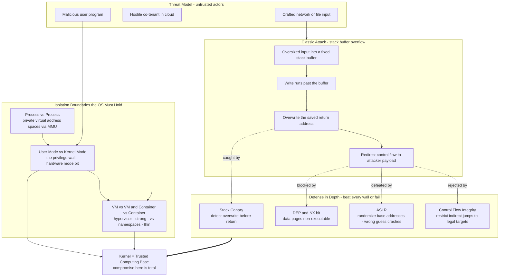

# 🛡️ OS Security and Isolation

> [!abstract] TL;DR
> Operating-system security is fundamentally about **maintaining isolation boundaries** against adversaries: the **user/kernel** privilege wall, the **process/process** address-space wall, and the **VM/VM** and **container/container** walls. Every subsystem above the OS — databases, browsers, cloud tenants — trusts these walls to hold. The **kernel is the Trusted Computing Base (TCB)**: its compromise is total, because kernel code can read and rewrite everything. Classic attacks (**buffer overflows** overwriting return addresses) and microarchitectural attacks (**Spectre/Meltdown** leaking across boundaries through speculation) are all *ways to defeat a wall the OS was supposed to hold*, and defenses (**DEP/NX, stack canaries, ASLR, CFI, KPTI, seccomp, MAC, secure boot**) are layered walls built on the principle of **least privilege** and a **minimal TCB**.

---

## Intuition

**Analogy:** The OS is the **security guard for a shared building full of mutually-distrustful tenants**. Its entire job is *isolation* — making sure one tenant cannot peek into another's rooms, tamper with their belongings, crash their business, or — worst of all — break into the guard's own office and steal the master key. Each tenant is a process; each locked room is a virtual address space; the master key is kernel mode; the guard's office is the kernel, the **Trusted Computing Base**. If a tenant defeats the wall between their room and their neighbor's, that is a *process-isolation* break; if a tenant picks the lock on the guard's office, they now hold the master key and *every* wall in the building is meaningless.

Seen this way, **every attack is a technique for defeating a wall the guard was supposed to hold** — an overlong package that punches through the back of a mailbox and rewrites the delivery instructions (a buffer overflow overwriting a return address), a bribe that promotes a tenant to guard (privilege escalation), or listening at the wall to time the neighbor's footsteps and infer their secrets (a side channel). Security engineering is the discipline of building **more walls, thinner and better-guarded ones (least privilege), and fewer trusted rooms (a minimal TCB)** so that beating one wall is not enough.

---

## How It Works

### Core Mechanics

**1. Isolation is the product; the OS is the enforcer.** A modern OS multiplexes one machine among many mutually-distrustful principals. Its security guarantee is not "no bugs" but "**a compromised principal cannot cross a boundary it should not cross**." Those boundaries are:

- **User mode vs kernel mode** — the fundamental privilege boundary, enforced in *hardware* by the mode bit (see [[Interrupts_Traps_and_Dual_Mode_Operation]]). User code physically cannot execute privileged instructions or touch kernel memory; the *only* sanctioned door is a controlled trap through the **system-call interface** (see [[System_Calls_and_the_Kernel_Interface]]).
- **Process vs process** — each process gets a private virtual address space via the MMU and page tables (see [[Memory_Management_and_Allocation]]). Process A cannot name, read, or write process B's memory because B's physical frames simply are not mapped into A's page table.
- **VM vs VM / container vs container** — a hypervisor gives each guest the illusion of its own machine (a *stronger* wall, its own kernel), while containers share **one host kernel** and are separated only by namespaces, cgroups, and seccomp (a *thinner, cheaper* wall). This is why a kernel bug is a container escape but rarely a VM escape (the planned siblings *Virtualization_and_Hypervisors* and *Containers_and_OS_Level_Virtualization* expand this).

**2. The threat model.** The OS must assume the worst: untrusted user programs, **malicious input** from files and the network, remote network attackers, and — in the cloud — **hostile co-tenants** sharing the same host. The design consequence is stark: the kernel is the ultimate TCB, so **its compromise is total** and its attack surface (every syscall, every driver, every parser) must be minimized and hardened (see [[OS_Structure_and_Kernel_Architectures]] on TCB size, and [[Threat_Modeling]]).

**3. Classic memory-corruption attacks.** In C/C++ an unbounded write (`strcpy`, `gets`, an off-by-one) can write **past a fixed-size stack buffer** and overwrite the **saved return address**. When the function returns, control jumps wherever the attacker wrote — classically to injected shellcode (**stack smashing**). The OS/toolchain answer is **defense in depth**, where the attacker must beat *every* wall:

- **Stack canaries** — a random guard value placed between local buffers and the return address; the function checks it before returning and aborts if it changed. Detects the overwrite *after* it happens.
- **DEP / NX bit (non-executable memory)** — data pages (stack, heap) are marked non-executable, so injected shellcode cannot run even if written.
- **ASLR (Address Space Layout Randomization)** — the base addresses of the stack, heap, libraries, and the executable are randomized at load, so the attacker does not *know where* to jump. A wrong guess crashes the target.
- **Control-Flow Integrity (CFI)** — restricts indirect jumps/calls to a precomputed set of legal targets, so even a corrupted pointer cannot redirect flow arbitrarily.

The attacker's counter to NX is **Return-Oriented Programming (ROP)**: instead of injecting code, chain together existing executable snippets ("gadgets") ending in `ret`. ROP *needs to know addresses*, which is exactly why ASLR and CFI matter (see [[Exploitation_Techniques]] and, for the language-level root cause, [[C_Strings_and_Arrays]] and [[C_Pointers_and_Memory]]).

**4. Privilege escalation.** A *local* attacker with ordinary user access seeks to become **root or kernel**. Vectors include **setuid** binaries with bugs (a program that runs as root but mishandles input), and **kernel vulnerabilities** reachable through the syscall boundary — the syscall interface is the widest attack surface exposed to unprivileged code. The infamous **Dirty COW** (CVE-2016-5195) was a race condition in the kernel's copy-on-write logic that let any user write to read-only files and gain root (see [[Privilege_Escalation]]).

**5. Sandboxing and confinement (least privilege in practice).** Rather than trust a program with full user rights, confine it to the *minimum* it needs:

- **seccomp / seccomp-bpf** — filter which syscalls a process may make, shrinking the kernel attack surface.
- **Linux capabilities** — split root's power into ~40 discrete bits (`CAP_NET_BIND_SERVICE`, `CAP_SYS_ADMIN`, …) so a service holds only what it needs.
- **Namespaces + cgroups** — the isolation primitives behind containers.
- **Mandatory Access Control (MAC)** — SELinux/AppArmor enforce *system-wide* policy the process cannot override (unlike discretionary permissions).
- **Application sandboxes** — the browser **renderer sandbox** runs untrusted web content in a seccomp-confined, low-privilege process; **gVisor** interposes a user-space kernel to shrink the host attack surface.

**6. Microarchitectural (hardware) attacks.** **Meltdown** and **Spectre** (2018) broke isolation not through a software bug but through **speculative execution** (see [[Superscalar_and_Out_of_Order_Execution]] and [[Branch_Prediction]]): the CPU speculatively accesses memory it is not allowed to, and although the architectural result is discarded, the access leaves a footprint in the **cache** that a timing side channel can read (see [[Cache_Hierarchy]] and [[Memory_Hierarchy_and_Caching]]). Meltdown crossed the *user/kernel* boundary; Spectre crossed *process* and sandbox boundaries. The deep lesson: **a performance optimization leaked secrets across a security boundary**. The mitigation — **KPTI (Kernel Page-Table Isolation)** — unmaps kernel memory while in user mode, at a measurable syscall-cost.

**7. The trust chain: secure boot.** Isolation is worthless if the boot code is already compromised. **Measured/verified boot** cryptographically checks each stage (firmware → bootloader → kernel) and records measurements in a **TPM**; **Trusted Execution Environments** (Intel SGX, ARM TrustZone) create hardware-isolated enclaves even the kernel cannot read (the planned sibling *The_Boot_Process_and_System_Initialization* covers this chain of trust).

**8. Authentication vs authorization.** These are distinct: **authentication** answers "who are you?" (passwords, MFA — see [[Multi_Factor_Authentication]]) and is a service the OS provides; **authorization** answers "what may you do?" and is the *access-control mechanism* (the planned sibling *Protection_and_Access_Control* covers permission bits, ACLs, and capabilities). A correct login (authN) still grants only the rights policy allows (authZ).

**9. Secure design principles (Saltzer & Schroeder, 1975).** Defense in depth rests on timeless principles: **economy of mechanism** (keep the TCB small and simple), **fail-safe defaults** (deny by default), **least privilege** (grant the minimum), **complete mediation** (check every access), **separation of privilege**, and **least common mechanism**. Minimizing the TCB is the through-line linking OS security to the whole [[Attack_Surface_Analysis]] and [[OS_Hardening]] discipline of the [[Threat_Modeling]] world.

### Flow / Architecture



---

## Key Concepts

### Secondary — the big idea

- **Isolation is the whole point.** The OS keeps programs, users, and tenants from interfering with each other. Security *is* keeping those walls up.
- **The kernel is special.** The kernel holds the master key. If an attacker gets into the kernel, no other protection matters — so we keep the kernel small and guard its doors carefully.
- **Attacks defeat a specific wall.** A buffer overflow breaks into a program's control; privilege escalation steals the master key; a side channel listens through the wall. Each defense rebuilds or reinforces one wall.

### Undergraduate — the mechanisms

- **The three boundaries** — user/kernel (hardware mode bit + syscalls), process/process (virtual address spaces), VM/container (hypervisor vs namespaces). Strength ranking: VM > process > container, because a container shares the host kernel.
- **TCB (Trusted Computing Base)** — the set of code that must be correct for security to hold. Smaller TCB = fewer bugs that are catastrophic. A monolithic Linux kernel puts ~20M+ lines in the TCB.
- **Buffer overflow → defenses** — stack smashing overwrites the return address; **canary** detects it, **DEP/NX** stops injected code, **ASLR** hides addresses, **CFI** constrains jumps. **ROP** is the attacker's answer to NX.
- **Privilege escalation** — turning user access into root/kernel via setuid bugs or kernel vulnerabilities reached through the syscall surface.
- **Sandboxing** — seccomp (syscall filtering), capabilities (splitting root), namespaces, MAC (SELinux/AppArmor), browser renderer sandbox, gVisor. All are **least privilege** made concrete.
- **AuthN vs AuthZ** — *who are you* (passwords, MFA) versus *what may you do* (access-control policy). Different problems, different mechanisms.

### Graduate — the frontier

- **Microarchitectural side channels** — Spectre/Meltdown weaponize speculative execution + cache timing to read across the user/kernel and process boundaries; mitigations (KPTI, `retpoline`, microcode) trade performance for isolation. The lesson: **the ISA abstraction leaks through the microarchitecture.**
- **ROP / JOP and CFI** — with NX universal, code-reuse attacks (return- and jump-oriented programming) dominate; coarse- vs fine-grained CFI, shadow stacks (Intel CET), and hardware pointer authentication (ARM PAC) are the arms race.
- **ASLR entropy is the parameter that matters** — a defense is only as strong as its bits of randomness; 32-bit ASLR (~16 bits historically) is brute-forceable in minutes, 64-bit is not (see the demo). Info leaks that reveal one address defeat ASLR entirely.
- **Verified TCB minimization** — seL4-style formally verified microkernels shrink the trusted core to ~10K lines with machine-checked proofs; the economy-of-mechanism principle taken to its logical end (see [[OS_Structure_and_Kernel_Architectures]]).
- **Confidential computing** — SGX/TrustZone/SEV enclaves aim to isolate *even from a malicious kernel or hypervisor*, inverting the usual trust model; their own side channels (foreshadow, plundervolt) keep the area active.
- **Root of trust** — measured boot + TPM + remote attestation extend isolation guarantees from runtime down to firmware, closing the "compromise below the OS" gap.

---

## Python Demo

```python
# ASLR as a PROBABILISTIC defense.
#
# To hijack control flow an attacker must guess the randomized base address
# of a memory region. With B bits of entropy there are 2**B equally likely
# placements, so one blind guess succeeds with probability p = 1 / 2**B.
# Crucially, each WRONG guess CRASHES the target (a segfault): it costs the
# attacker a restart AND leaves a loud trail of crashes an IDS can detect.
# This is why more entropy (64-bit) makes brute force infeasible while low
# entropy (32-bit, ~16 real bits historically) is guessable in minutes.
# numpy / matplotlib only.

import numpy as np
import matplotlib.pyplot as plt


def hit_prob_per_attempt(bits):
    """Probability a single blind guess lands on the randomized base."""
    return 1.0 / (2.0 ** bits)


def cumulative_success(bits, attempts):
    """P(at least one hit within `attempts` independent guesses)."""
    p = hit_prob_per_attempt(bits)
    return 1.0 - (1.0 - p) ** attempts


entropy_levels = [8, 16, 28, 32, 40, 64]      # bits of ASLR entropy
attempts = np.logspace(0, 12, 600)            # 1 .. 1e12 blind guesses

fig, (ax1, ax2) = plt.subplots(1, 2, figsize=(13, 5))

# --- Panel 1: cumulative break probability vs number of attempts ------------
colors = plt.cm.viridis(np.linspace(0.05, 0.9, len(entropy_levels)))
for bits, c in zip(entropy_levels, colors):
    ax1.plot(attempts, cumulative_success(bits, attempts),
             color=c, lw=2, label=f"{bits}-bit entropy")
ax1.axhline(0.5, color="gray", ls=":", lw=1)
ax1.set_xscale("log")
ax1.set_ylim(0, 1.02)
ax1.set_xlabel("Blind guess attempts (log scale)")
ax1.set_ylabel("P(attacker breaks ASLR at least once)")
ax1.set_title("Low entropy is guessable; high entropy stays flat at zero")
ax1.grid(True, which="both", alpha=0.3)
ax1.legend(fontsize=8, loc="center left")

# --- Panel 2: expected work AND detectable noise vs entropy -----------------
bits_axis = np.arange(4, 65)
expected_guesses = 2.0 ** bits_axis           # mean guesses (= crashes) to win
GUESS_RATE = 1000.0                           # guesses/sec (fork + crash + retry)
years = expected_guesses / GUESS_RATE / 3600 / 24 / 365

ax2.plot(bits_axis, expected_guesses, color="#1D4ED8", lw=2,
         label="Expected guesses = crashes to win")
ax2.set_yscale("log")

IDS_THRESHOLD = 1000.0                         # IDS alerts after this many crashes
ax2.axhline(IDS_THRESHOLD, color="#DC2626", ls="--", lw=1.5,
            label="IDS crash-alert threshold")

for bits, tag in [(16, "32-bit era\n~16 real bits"), (32, "32-bit\nfull"),
                  (64, "64-bit\nmodern")]:
    ax2.axvline(bits, color="gray", ls=":", lw=1)
    ax2.annotate(tag, xy=(bits, 2.0 ** bits),
                 xytext=(5, -22), textcoords="offset points", fontsize=8)

ax2.set_xlabel("ASLR entropy (bits)")
ax2.set_ylabel("Expected guesses = crashes (log scale)")
ax2.set_title("Every wrong guess is a crash: work AND noise explode with bits")
ax2.grid(True, which="both", alpha=0.3)
ax2.legend(fontsize=8, loc="upper left")

plt.tight_layout()
plt.savefig("aslr_probability.png", dpi=120)
plt.show()

# --- Console summary --------------------------------------------------------
print("bits | p_hit      | mean guesses | time @1000/s      | crashes generated")
print("-" * 78)
for bits in [8, 16, 28, 32, 40, 64]:
    exp = 2.0 ** bits
    yrs = exp / GUESS_RATE / 3600 / 24 / 365
    print(f"{bits:4d} | 2^-{bits:<7d}| {exp:.2e}   | {yrs:.2e} years  | ~{exp:.0e}")
```

**What it shows.** Panel 1 plots the cumulative probability the attacker lands *at least one* correct guess after N tries: at **8 or 16 bits** the curve rockets to certainty within thousands of attempts (minutes of brute force), while the **64-bit** curve is pinned to the floor across a *trillion* attempts. Panel 2 makes the two costs explode together — the expected number of guesses needed to win *equals the number of crashes the attacker must generate*, so beyond ~20 bits the attack is both computationally infeasible (blue line above any practical time budget) and hopelessly loud (far above the red IDS threshold). The takeaway matches the real world: raw ASLR entropy is *the* security parameter, low-entropy 32-bit ASLR was famously brute-forced (Shacham et al., 2004), and an **information leak that reveals one address collapses all the entropy to zero** — which is why ASLR is a *layer*, never the whole defense.

---

## Real-World Applications

> **Example — the Chrome/Chromium renderer sandbox.** Chrome assumes its own renderer *will* be compromised by malicious web content. Each renderer runs in a separate low-privilege process confined by a **seccomp-bpf** syscall filter, restricted namespaces, and a broker for the few privileged operations it needs — a textbook application of **least privilege** and **process isolation**. Even a full remote-code-execution bug in the renderer is contained: the attacker still faces the OS boundary between the sandboxed process and the rest of the system, and typically needs a *second* (sandbox-escape/kernel) bug to do real damage. Site Isolation then puts each origin in its own process specifically to blunt **Spectre**-style cross-origin reads.

- **Linux ASLR + DEP + canaries + FORTIFY.** Every mainstream distro ships PIE executables with ASLR, NX stacks/heaps, stack-protector canaries (`-fstack-protector-strong`), and `_FORTIFY_SOURCE` bounds checks — the layered memory-corruption defense the diagram models.
- **KPTI for Meltdown.** After Meltdown, Linux, Windows, and macOS shipped **Kernel Page-Table Isolation**, unmapping the kernel from user page tables and paying a real syscall/context-switch cost — a stark performance-for-isolation trade (see [[Memory_Hierarchy_and_Caching]]).
- **SELinux / AppArmor MAC.** Android confines every app with SELinux domains; RHEL uses SELinux to contain services so a compromised web server cannot read unrelated files even if it runs as its normal user — **complete mediation** enforced by policy the process cannot override (see [[OS_Hardening]]).
- **Docker/Kubernetes hardening.** Containers drop Linux capabilities, apply seccomp profiles, and run as non-root because they share the host kernel; security-sensitive multi-tenant workloads reach for **gVisor** or lightweight VMs (Firecracker) to get a stronger wall (see [[Container_and_Kubernetes_Security]]).
- **Secure Boot + TPM.** Windows BitLocker and modern laptops chain firmware → bootloader → kernel with signature checks and TPM-sealed keys, so tampering below the OS is detected before the OS ever runs.

---

## Common Pitfalls

- **Treating ASLR as sufficient on its own.** ASLR only hides addresses; a single **info-leak** (a format-string bug, an uninitialized-memory read) discloses one address and defeats the entire randomization. ASLR must be paired with NX, canaries, and CFI — it is a layer, not a wall unto itself.
- **Assuming "64-bit ASLR" means 64 bits of entropy.** Real deployments randomize far fewer bits (often ~28–30 for mmap, historically ~16 on 32-bit). Alignment constraints and small regions cut entropy; low entropy is brute-forceable, as the demo shows.
- **Confusing container isolation with VM isolation.** Containers share the **one host kernel**, so a kernel-level bug is a container escape. Do not treat namespaces + cgroups as a security boundary equal to a hypervisor for hostile multi-tenant workloads (see [[Container_and_Kubernetes_Security]]).
- **Conflating authentication with authorization.** A correct password proves identity but grants nothing by itself; forgetting to *also* enforce least-privilege authorization is how compromised-but-valid accounts pivot. They are separate mechanisms.
- **Trusting the kernel's size.** Every driver and syscall parser is in the TCB. Loading a third-party kernel module or exposing an obscure syscall widens the attack surface; a bug there is *total* compromise, not a contained one (see [[OS_Structure_and_Kernel_Architectures]]).
- **Ignoring the microarchitecture.** Spectre/Meltdown proved that constant-time-looking code can still leak through caches and speculation. "The program is correct" does not imply "no secrets leak"; side channels live below the ISA (see [[Cache_Hierarchy]]).
- **setuid sprawl.** Every setuid-root binary is a privilege-escalation candidate; a single input-handling bug becomes root. Prefer capabilities (grant one specific power) over blanket setuid root.
- **Disabling mitigations "for performance."** Turning off ASLR, KPTI, or stack protectors to reclaim a few percent re-opens whole exploit classes. Measure first; the isolation is usually worth the cost.

---

## Related Concepts

Verified vault links:

- [[OS_Structure_and_Kernel_Architectures]] — the kernel *is* the TCB; monolithic vs microkernel is a direct argument about TCB size and how catastrophic a compromise is.
- [[Interrupts_Traps_and_Dual_Mode_Operation]] — the hardware mode bit is the user/kernel privilege wall this note calls the fundamental boundary; traps are the controlled crossing.
- [[System_Calls_and_the_Kernel_Interface]] — the syscall boundary is the widest attack surface unprivileged code can reach; seccomp filters it.
- [[Memory_Management_and_Allocation]] — page tables + MMU are the mechanism that makes process-vs-process address-space isolation real.
- [[Memory_Hierarchy_and_Caching]] — the cache is the covert channel Spectre/Meltdown exploit; KPTI's cost shows up here.
- [[Privilege_Escalation]] — the Cybersecurity treatment of turning user access into root/kernel (Dirty COW, setuid bugs, kernel exploits).
- [[Exploitation_Techniques]] — stack smashing, ROP, and shellcode: the offensive side of the memory-corruption defenses here.
- [[OS_Hardening]] — reducing attack surface, enabling MAC/seccomp/mitigations: the operational discipline of TCB minimization.
- [[Container_and_Kubernetes_Security]] — containers share the host kernel, so this note's "thin wall" caveat is their central risk.
- [[Threat_Modeling]] — formalizes the "assume the worst adversary" reasoning that drives isolation design.
- [[Attack_Surface_Analysis]] — quantifies the surface (syscalls, drivers, parsers) that TCB minimization tries to shrink.
- [[Multi_Factor_Authentication]] — the authentication half of the authN-vs-authZ distinction the OS mediates.
- [[Superscalar_and_Out_of_Order_Execution]] — speculative, out-of-order execution is the microarchitectural root of Spectre/Meltdown.
- [[Branch_Prediction]] — mistrained branch predictors are the mechanism of Spectre variant 1.
- [[Cache_Hierarchy]] — the timing side channel that turns discarded speculation into a readable secret.
- [[C_Strings_and_Arrays]] — unbounded string/array operations are where buffer overflows originate.
- [[C_Pointers_and_Memory]] — the raw pointer model whose lack of memory safety enables corruption attacks.

Planned Operating Systems sibling notes this concept connects to (create and back-link when written): *Protection_and_Access_Control*, *Virtualization_and_Hypervisors*, *Containers_and_OS_Level_Virtualization*, *The_Boot_Process_and_System_Initialization*.

---

## Review Questions

1. **(Secondary)** Using the security-guard analogy, explain the difference between one tenant breaking into a neighbor's room versus breaking into the guard's office. Which real OS boundaries do those two events correspond to, and why is the second one categorically worse?
2. **(Undergraduate)** A program copies untrusted input into a fixed 64-byte stack buffer with `strcpy`. Walk through how this becomes a control-flow hijack, then explain what each of stack canaries, DEP/NX, ASLR, and CFI does to stop it — and how Return-Oriented Programming defeats NX alone.
3. **(Undergraduate scenario)** You must isolate an untrusted user-submitted program that will run alongside other tenants' jobs on shared hosts. Compare confining it with (a) a container plus seccomp/MAC versus (b) a lightweight VM. Which boundary is stronger and why, and what does "the kernel is the TCB" imply for choice (a)?
4. **(Graduate)** ASLR provides B bits of entropy and every wrong guess crashes the target. Derive the probability of success after N blind attempts and the expected number of attempts to win. Explain quantitatively why 64-bit entropy is infeasible to brute-force while 16-bit is not, and why a single information leak collapses the defense regardless of B.
5. **(Graduate trade-off)** Meltdown was mitigated with KPTI, which unmaps kernel memory during user execution. Explain the isolation boundary Meltdown broke, the microarchitectural mechanism it abused, and the precise performance cost KPTI imposes. What general principle about "performance optimizations vs security boundaries" does this incident teach?

---

## Sources

- Saltzer, J. & Schroeder, M. "The Protection of Information in Computer Systems." *Proceedings of the IEEE*, 1975. https://web.mit.edu/Saltzer/www/publications/protection/ — the eight secure-design principles (least privilege, fail-safe defaults, economy of mechanism).
- Shacham, H. et al. "On the Effectiveness of Address-Space Randomization." *ACM CCS 2004*. https://hovav.net/ucsd/papers/sppgmb04.html — brute-forcing low-entropy ASLR; the entropy argument behind the demo.
- Kocher, P. et al. "Spectre Attacks: Exploiting Speculative Execution" and Lipp, M. et al. "Meltdown." *IEEE S&P / USENIX Security 2018*. https://spectreattack.com/ — speculative-execution side channels and KPTI.
- Arpaci-Dusseau, R. & A. *Operating Systems: Three Easy Pieces (OSTEP)* — mechanism of limited direct execution, address-space isolation. https://pages.cs.wisc.edu/~remzi/OSTEP/
- Silberschatz, Galvin, Gagne. *Operating System Concepts*, 10th ed. — Ch. 16–17 (Protection and Security). https://www.os-book.com/OS10/

---

#operating-systems #os-security #isolation #aslr #sandboxing
