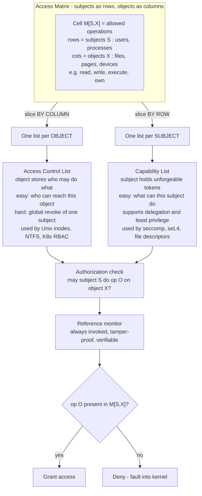

# 🔐 Protection and Access Control

> [!abstract] TL;DR
> **Protection** is the set of OS *mechanisms* that decide which **subjects** (users, processes) may perform which **operations** (read, write, execute) on which **objects** (files, memory pages, devices, sockets). The abstract model is the **access matrix**: subjects as rows, objects as columns, and each cell holding the permitted operations. That matrix is almost never stored whole — it is decomposed two dual ways: slice it **by column** and you get **Access Control Lists (ACLs)**, where each object records who may touch it (how Unix and NTFS file systems work); slice it **by row** and you get **capability lists**, where each subject holds unforgeable tokens for the objects it may reach (how `seccomp` filters and object-capability systems work). Underneath everything sits the **dual-mode hardware boundary** and a **reference monitor** that mediates every access, and above everything sits the **principle of least privilege**: grant the minimum needed, because every unused permission is pure attack surface.

---

## Intuition

**Analogy:** An operating system is an office building, and the security desk must answer one question all day long: *"May person S go through door X to do task O?"* There are two dual ways to run that desk. Option one: give every employee a **keyring** stamped with exactly the doors they may open — the janitor's ring opens supply closets, the accountant's opens the vault. To check access you just look at whether the right key is on the person's ring. That is a **capability list**: the permission travels *with the subject*. Option two: post a **guest list on each door** naming who is allowed in and what they may do inside. To check access you walk to the door and read its list. That is an **access control list (ACL)**: the permission lives *with the object*.

Both answer the identical question "can S do O on X?" — they are two projections of the same underlying **access matrix**. The keyring makes it trivial to ask *"what can this person reach?"* (just read their ring) but hard to ask *"who can enter the vault?"* (you must inspect everyone's ring). The door's guest list is the exact opposite. That single duality — subject-indexed versus object-indexed — drives almost every real-world design decision in OS and cloud access control, from Unix file permissions to Kubernetes RBAC.

---

## How It Works

### Protection versus security — and why this note is about mechanism

The two words are not synonyms. **Protection** is the *internal machinery* the OS provides to control access between the parts of a running system — the mode bit, page-table permission bits, file permissions, the syscall gate. **Security** is the *broader goal*: keeping the whole system trustworthy against external threats, which additionally requires authentication, cryptography, physical safety, and correct policy. A useful framing: security decides *what the policy should be*; protection is the *enforcement mechanism* that makes the policy true. This note is about the enforcement mechanism — the plumbing that a security policy is expressed through. (The OS-level threat and isolation picture belongs to a planned sibling *OS_Security_and_Isolation*; the broader defensive discipline lives in the Cybersecurity vault.)

### The access matrix — the formal model

Model the system as a matrix `M`. Rows are **subjects** (a user, a process, a service account); columns are **objects** (a file, a page frame, a device, a network socket, even *other domains*). The cell `M[S,X]` holds the set of **rights** subject `S` holds over object `X` — typically `{read, write, execute}`, but also `own`, `append`, `delete`, or *domain-switch* rights. Every authorization decision is then a single lookup: **is operation `O` an element of `M[S,X]`?** If yes, allow; if no, deny. This model, due to Lampson (1971) and formalized by Harrison, Ruzzo, and Ullman (1976), is the theoretical foundation of essentially all access control.

The catch: a real system has thousands of subjects and millions of objects, and `M` is enormously sparse (most subjects touch almost no objects). Storing the full matrix is absurd, so systems store one of its two **projections**.

### The two dual implementations

**1. Access Control Lists — store the matrix by COLUMN.** Attach to each *object* the list of `(subject, rights)` pairs for the non-empty cells in that object's column. A Unix inode's owner/group/other bits and a Windows NTFS security descriptor are both ACLs. Strength: it is trivial to answer *"who can access this object?"* — read its list. Weakness: answering *"what can this subject reach?"* requires scanning every object in the system, and **revoking one subject globally** means editing potentially every object.

**2. Capability lists — store the matrix by ROW.** Give each *subject* a list of **capabilities**, one per accessible object, where a capability is an *unforgeable* `(object, rights)` token — a key. Possession *is* permission; the check is "do you hold a key with the `O` right for `X`?" Strength: it is trivial to answer *"what can this subject do?"* (read its capability list), capabilities support fine-grained **delegation** (hand a copy of a key to a helper) and naturally express **least privilege**, and they elegantly solve the **confused-deputy problem** because the authority to act travels *with the request*, not with the ambient identity. Weakness: answering *"who can reach this object?"* and **selective revocation** are hard, because keys have propagated to unknown holders. Linux `seccomp`, `capabilities(7)` (the `CAP_*` bits that split root's omnipotence), file descriptors themselves, and object-capability systems (CapROS, seL4, Fuchsia's Zircon handles) are all capability designs. This model underpins modern sandboxing used by containers (a planned sibling *Containers_and_OS_Level_Virtualization*).

### The hardware foundation — dual mode, rings, and memory protection

None of the above can be enforced by software alone; it rests on hardware. The **mode bit** (kernel versus user mode, see [[Interrupts_Traps_and_Dual_Mode_Operation]]) is the base protection boundary: privileged instructions — physical I/O, loading the page-table base register, arming the timer — are legal only in kernel mode, so a user process *cannot* bypass the OS to touch a device or another process's memory. x86 generalizes this to four **protection rings** (only ring 0 and ring 3 are used in practice). Crossing the boundary happens only through the controlled **syscall gate** (see [[System_Calls_and_the_Kernel_Interface]]). Memory access is mediated per-page by **permission bits** in the page table — present, writable, user-accessible, no-execute — checked by the MMU on every access (see [[Paging_and_Page_Tables]] and [[Memory_Management_and_Allocation]]); an older base/limit register pair enforced the same coarse idea for contiguous segments.

### Unix permissions in practice

The everyday face of OS access control is the Unix **rwx** triad for **owner / group / other** (nine bits, the familiar `rwxr-xr--`). Three special bits complicate it: **setuid** and **setgid** make an executable run with the *file owner's* identity rather than the caller's — essential for `passwd` (which must edit `/etc/shadow`) but a notorious privilege-escalation vector when a setuid-root binary has a bug. And Unix's coarse **root superuser** is the model's great weakness: root bypasses all permission checks, so any root compromise is total — precisely the concentration of authority that Linux **capabilities** and **least privilege** aim to break up. (Deeper file-system semantics belong to a planned sibling *File_Systems_and_Abstractions*.)

### Access-control models — who sets the policy

- **DAC (Discretionary Access Control):** *owners* set permissions at their discretion (standard Unix/Windows). Flexible, but a compromised or careless owner can leak access, and there is no system-wide guarantee.
- **MAC (Mandatory Access Control):** the *system* enforces labels that users cannot override. **Bell-LaPadula** protects *confidentiality* ("no read up, no write down" — see [[CIA_Triad_and_Security_Models]]); **Biba** is its dual for *integrity* ("no write up, no read down"). On Linux, **SELinux** and **AppArmor** implement MAC, confining even root.
- **RBAC (Role-Based Access Control):** permissions attach to *roles*, users are assigned roles. Scales to large organizations; the model behind Kubernetes RBAC and most enterprise IAM.
- **ABAC (Attribute-Based Access Control):** decisions are computed from *attributes* of subject, object, action, and environment (time, location, device posture) — the most expressive, and the basis of policy-as-code and zero-trust systems.

### The reference monitor and the TCB

Tying it together is the **reference monitor** concept: an ideal mediator that must be **(1) always invoked** (no access bypasses it — *complete mediation*), **(2) tamper-proof** (nothing can subvert it), and **(3) small and verifiable** (simple enough to be assured correct). Its concrete realization is the **Trusted Computing Base (TCB)** — the hardware plus kernel plus reference-validation code that security depends on; keeping the TCB *small* is a central design goal (a theme of [[OS_Structure_and_Kernel_Architectures]], where microkernels shrink the TCB).

### Flow / Architecture



---

## Key Concepts

**Secondary (intuition level).**
The OS is a security desk answering "may this person do this thing to that door?" all day. You can hand out **keyrings** (each person carries the keys they may use) or post **guest lists** on the doors (each door names who may enter). Both answer the same question two dual ways. The golden rule is to hand out **as few keys as possible** — every extra key is one more thing that can be stolen and misused.

**Undergraduate (mechanism level).**
- **Subject / object / right** — actor, resource, and permitted operation; the three axes of the access matrix.
- **Access matrix `M[S,X]`** — abstract model; authorization is the lookup "is `O` in `M[S,X]`?".
- **ACL (by column)** — object holds `(subject, rights)`; easy "who can access X?", hard subject revocation.
- **Capability (by row)** — subject holds unforgeable `(object, rights)` tokens; easy "what can S do?", supports delegation, hard object-side revocation.
- **Protection vs security** — enforcement mechanism versus the broader defensive goal.
- **Dual mode / rings** — hardware kernel-vs-user boundary; the base of all protection.
- **Page permission bits** — per-page read/write/execute/user checks by the MMU.
- **Unix rwx, setuid/setgid, root** — the practical DAC implementation and its escalation hazards.
- **DAC / MAC / RBAC / ABAC** — who sets policy: owner, system labels, roles, or attributes.
- **Least privilege** — grant only the minimum authority needed for the task.

**Graduate (systems level).**
- **Safety problem (HRU)** — Harrison-Ruzzo-Ullman proved that deciding whether a right can *ever* leak in a general access-matrix protection system is **undecidable**; restricted models (take-grant, typed access matrix) regain decidability. This is why real systems constrain their policy language.
- **Confused deputy** — a privileged program tricked into misusing *its own* ambient authority on behalf of a less-privileged caller; capabilities dissolve it by bundling authority with the request rather than the identity.
- **Ambient authority vs designation** — the deep difference between identity-based (ACL) and capability systems; object-capability discipline forbids ambient authority entirely.
- **Revocation strategies** — ACLs revoke by list edit; capabilities revoke via indirection (Redell's caretaker pattern), generation counters, or invalidating a shared object table (the seL4 approach).
- **Complete mediation and TOCTOU** — a reference monitor must be on *every* path; time-of-check-to-time-of-use races break mediation when the checked name is re-bound before use.
- **TCB minimization** — microkernels (seL4 is formally verified) shrink the trusted code so the reference monitor is actually assurable.
- **MAC lattices** — Bell-LaPadula and Biba are lattice models; combining confidentiality and integrity lattices over-constrains flow, which is why few systems enforce both fully.
- **Privilege separation** — split a program into a small privileged monitor and a large unprivileged worker (OpenSSH's design) so a bug in the worker cannot escalate.

---

## Python Demo

```python
# Access-Control Matrix + its two dual decompositions, an authorization check,
# and a model of the PRINCIPLE OF LEAST PRIVILEGE: how blast radius (attack
# surface) explodes as subjects are granted permissions they do not need.
# numpy + matplotlib only.

import numpy as np
import matplotlib.pyplot as plt

# --- Permission bit flags ---------------------------------------------------
READ, WRITE, EXEC = 1, 2, 4
FLAGS = [(READ, "r"), (WRITE, "w"), (EXEC, "x")]

def perm_str(bits):
    return "".join(ch if bits & b else "-" for b, ch in FLAGS)

# --- Build the access matrix : subjects (rows) x objects (columns) ----------
subjects = ["alice", "bob", "web_srv", "backup", "root"]
objects  = ["passwd", "photo.jpg", "app.log", "db.sock", "sda"]

M = np.zeros((len(subjects), len(objects)), dtype=int)
M[0, 1] = READ | WRITE | EXEC          # alice owns photo.jpg
M[0, 2] = READ                          # alice reads the app log
M[1, 1] = READ                          # bob may only read the photo
M[2, 2] = READ | WRITE                  # web_srv writes its own log
M[2, 3] = READ | WRITE                  # web_srv talks to the db socket
M[3, :] = READ                          # backup reads everything (read-only)
M[4, :] = READ | WRITE | EXEC           # root: total authority (the danger)

# --- Decomposition 1: ACLs  (store the matrix BY COLUMN, per object) --------
def acl(obj_name):
    j = objects.index(obj_name)
    return {subjects[i]: perm_str(M[i, j]) for i in range(len(subjects)) if M[i, j]}

# --- Decomposition 2: Capability lists (store BY ROW, per subject) ----------
def capabilities(subj_name):
    i = subjects.index(subj_name)
    return {objects[j]: perm_str(M[i, j]) for j in range(len(objects)) if M[i, j]}

# --- Authorization check: may subject S perform op O on object X? -----------
def authorize(subj, op, obj):
    i, j = subjects.index(subj), objects.index(obj)
    return bool(M[i, j] & op)

print("ACL of 'passwd'          :", acl("passwd"))
print("ACL of 'db.sock'         :", acl("db.sock"))
print("Capabilities of web_srv  :", capabilities("web_srv"))
print("Capabilities of bob      :", capabilities("bob"))
print("may bob   WRITE photo.jpg?:", authorize("bob", WRITE, "photo.jpg"))   # False
print("may web_srv READ db.sock? :", authorize("web_srv", READ, "db.sock"))  # True
print("may backup WRITE passwd?  :", authorize("backup", WRITE, "passwd"))   # False

# --- PRINCIPLE OF LEAST PRIVILEGE: blast radius vs over-granting -------------
# Each subject genuinely NEEDS a few objects. "Just in case" we grant it EXTRA
# unused ones. If ONE subject is compromised, the attacker reaches its objects,
# then pivots through any SHARED object to other subjects (lateral movement).
# We actually compute the reachable set with a bipartite BFS -> not hand-waved.
rng = np.random.default_rng(0)
N_SUBJ, N_OBJ, NEED, TRIALS = 40, 60, 3, 40

def blast_radius(access, start):
    n_s, n_o = access.shape
    subj_seen = np.zeros(n_s, bool); obj_seen = np.zeros(n_o, bool)
    frontier = [start]; subj_seen[start] = True
    while frontier:
        nxt = []
        for s in frontier:
            for o in np.where(access[s])[0]:
                if not obj_seen[o]:
                    obj_seen[o] = True
                    for s2 in np.where(access[:, o])[0]:   # pivot via shared object
                        if not subj_seen[s2]:
                            subj_seen[s2] = True; nxt.append(s2)
        frontier = nxt
    return obj_seen.sum()                                  # objects exposed

extra_range = np.arange(0, 26)          # extra "just in case" grants per subject
avg_blast, minimal = [], []
for e in extra_range:
    trials = []
    for _ in range(TRIALS):
        A = np.zeros((N_SUBJ, N_OBJ), bool)
        for s in range(N_SUBJ):
            A[s, rng.choice(N_OBJ, NEED, replace=False)] = True      # what it needs
            if e:
                A[s, rng.choice(N_OBJ, e, replace=False)] = True     # over-granting
        trials.append(blast_radius(A, rng.integers(N_SUBJ)))
    avg_blast.append(np.mean(trials))
    minimal.append(NEED)                # least-privilege baseline: only what's needed

# --- Plot -------------------------------------------------------------------
fig, (ax1, ax2) = plt.subplots(1, 2, figsize=(13.5, 5.2))

# Left: the access matrix as a heatmap, annotated with rwx strings
im = ax1.imshow(M, cmap="Blues", vmin=0, vmax=7, aspect="auto")
ax1.set_xticks(range(len(objects)));  ax1.set_xticklabels(objects, rotation=30, ha="right")
ax1.set_yticks(range(len(subjects))); ax1.set_yticklabels(subjects)
for i in range(len(subjects)):
    for j in range(len(objects)):
        ax1.text(j, i, perm_str(M[i, j]), ha="center", va="center",
                 fontfamily="monospace",
                 color="white" if M[i, j] >= 4 else "black")
ax1.set_title("Access matrix  M[S,X]\nrow = capability list, column = ACL")
ax1.set_xlabel("objects  (columns -> ACLs)")
ax1.set_ylabel("subjects  (rows -> capabilities)")

# Right: blast radius grows super-linearly with over-granting
ax2.plot(extra_range, avg_blast, color="#DC2626", lw=2.4,
         marker="o", ms=4, label="objects exposed if 1 subject is popped")
ax2.plot(extra_range, minimal, color="#065F46", lw=2, ls="--",
         label="least privilege (grant only NEED)")
ax2.fill_between(extra_range, minimal, avg_blast, color="#DC2626", alpha=0.12,
                 label="attack surface added by unused grants")
ax2.set_xlabel("extra 'just in case' permissions granted per subject")
ax2.set_ylabel("blast radius  (objects reachable after compromise)")
ax2.set_title("Principle of Least Privilege:\nevery unused grant is pure attack surface")
ax2.legend(loc="upper left", fontsize=9)
ax2.grid(True, alpha=0.3)

plt.tight_layout()
plt.savefig("access_control.png", dpi=110)
plt.show()

print(f"\nBlast radius at minimal grants  : {avg_blast[0]:5.1f} objects")
print(f"Blast radius at +25 unused grants: {avg_blast[-1]:5.1f} objects "
      f"({avg_blast[-1]/max(avg_blast[0],1):.1f}x larger)")
```

The left panel *is* the access matrix: read a **row** and you have that subject's **capability list**; read a **column** and you have that object's **ACL** — the two decompositions are literally the two axes of the same picture. The authorization prints show denials (`bob` cannot write the photo he can only read; `backup` is read-only even on `passwd`) alongside grants. The right panel makes least privilege quantitative: with only *needed* permissions a compromised subject exposes a handful of objects, but each *unused* "just in case" grant widens the shared-object graph, so the attacker's lateral reach grows **super-linearly** — the shaded region is attack surface you bought for nothing. That curve is the entire argument for minimal grants, `seccomp` allowlists, and dropping Linux capabilities in containers.

---

## Real-World Applications

> **Example — Linux `seccomp` as a capability filter.** A hardened container or browser renderer installs a `seccomp-bpf` filter that allowlists the exact syscalls the process may make (`read`, `write`, `exit`, a handful more) and kills it on anything else. This is a *row-wise, capability-style* restriction: the process carries its own reduced authority, independent of who it runs as. Chrome's renderer, Docker's default profile, and systemd's `SystemCallFilter=` all use it to shrink blast radius exactly as the demo models.

- **Unix / NTFS file permissions (ACL, by column).** Every inode carries owner/group/other rwx bits; NTFS carries a full discretionary ACL per file. To ask "who can read this file?" you read the object — the classic column decomposition.
- **Linux capabilities `CAP_*` (splitting root).** Instead of an all-or-nothing setuid-root binary, a program is granted just `CAP_NET_BIND_SERVICE` (bind port 80) or `CAP_NET_RAW` (send raw packets), breaking up the superuser's total authority into least-privilege pieces.
- **Kubernetes RBAC.** Roles bundle verbs on resources; RoleBindings map service accounts to roles — an RBAC layer stored ACL-style per resource kind, governing what each pod's identity may do to the API server.
- **SELinux / AppArmor (MAC).** Mandatory labels confine processes *even when running as root*, so an exploited web server cannot read `/etc/shadow` because policy, not discretion, forbids the label transition. This is the practical Bell-LaPadula/Biba-style enforcement referenced in [[CIA_Triad_and_Security_Models]].
- **Object-capability microkernels (seL4, Fuchsia Zircon).** Every resource is named by an unforgeable handle; there is *no* ambient authority, so the confused-deputy problem structurally cannot arise, and seL4's tiny TCB is *formally verified* against its spec.
- **Cloud IAM.** AWS IAM policies, GCP IAM, and privileged-access management are ABAC/RBAC hybrids enforcing least privilege at planetary scale (see [[PAM_and_Privileged_Access]] and [[Cloud_Identity_and_Access]]); over-broad `*` grants are the cloud analogue of the demo's exploding blast radius.

---

## Common Pitfalls

- **Confusing protection with security** — protection is the *mechanism* (mode bit, ACLs, capabilities); security is the *goal* against real threats and also needs authentication, crypto, and policy. Perfect mechanisms enforcing a bad policy are still insecure.
- **Confusing authentication with authorization** — *authentication* asks "who are you?" (login, MFA); *authorization* asks "are you allowed?" (the access-matrix lookup). This note is entirely about the second; getting identity right is a prerequisite, not a substitute.
- **Running everything as root / with `*` grants** — the concentration of authority makes every bug catastrophic. Drop privileges, use capabilities, scope IAM roles narrowly — the least-privilege curve in the demo is why.
- **setuid landmines** — a buggy setuid-root binary hands the caller root; audit every setuid bit, prefer fine-grained capabilities, and never make a shell or interpreter setuid.
- **TOCTOU races break complete mediation** — checking a path, then acting on it, lets an attacker swap the target in between (symlink races). Operate on the *handle* you checked (`open` then `fstat`), not the name.
- **Forgetting revocation cost** — capabilities are wonderful until you must revoke one that has propagated to unknown holders; design indirection (caretaker objects, generation counts) up front rather than assuming you can claw keys back.
- **Assuming the ACL is complete mediation** — if any access path skips the check (a debug backdoor, a raw device, a shared-memory side channel), the reference-monitor guarantee is void. Every path must funnel through the monitor.
- **Over-constraining with combined MAC lattices** — enforcing Bell-LaPadula *and* Biba together forbids both reading down and writing down, which can strangle legitimate data flow; most systems pick the property that matters.

---

## Related Concepts

Verified vault links:

- [[Interrupts_Traps_and_Dual_Mode_Operation]] — the hardware kernel/user mode bit and privileged-instruction trap that form the base protection boundary all of this rests on.
- [[System_Calls_and_the_Kernel_Interface]] — the controlled gate through which a user subject requests privileged operations; the enforcement point for the reference monitor on the syscall path.
- [[Memory_Management_and_Allocation]] — memory objects are protected per-region; the OS decides which subject may map or write which frame.
- [[Paging_and_Page_Tables]] — page-table permission bits (writable, user, no-execute) are the per-page cells of the access matrix, checked by the MMU on every access.
- [[OS_Structure_and_Kernel_Architectures]] — microkernels shrink the Trusted Computing Base so the reference monitor is small enough to assure.
- [[Processes_and_the_Process_Model]] — the process is the archetypal *subject* whose identity and privileges the matrix indexes.
- [[Operating_Systems_Overview]] — situates protection among the OS's core responsibilities.
- [[CIA_Triad_and_Security_Models]] — Bell-LaPadula (confidentiality) and Biba (integrity) MAC lattice models that this note's DAC/MAC/RBAC/ABAC section builds on.
- [[PAM_and_Privileged_Access]] — enterprise least-privilege and privileged-account management applying these principles operationally.
- [[Privilege_Escalation]] — the attacker's-eye view: what goes wrong when least privilege, setuid, or capability boundaries fail.
- [[Authentication_Protocols]] — the authentication half of "authN vs authZ"; establishes the identity the access matrix then authorizes.
- [[Cloud_Identity_and_Access]] — cloud IAM as ABAC/RBAC access control at scale.

Planned Operating Systems sibling notes this concept ties to (create and back-link when written): *OS_Security_and_Isolation* (the broader isolation/threat picture — protection is its mechanism), *File_Systems_and_Abstractions* (where Unix rwx and ACLs are stored), *Containers_and_OS_Level_Virtualization* (namespaces + capabilities + seccomp as least-privilege sandboxing).

---

## Review Questions

1. **(Secondary)** Explain the keyring-versus-guest-list analogy. Which one makes it easy to answer "what can this employee reach?" and which makes it easy to answer "who can enter the vault?" — and why are they two views of the same thing?
2. **(Undergraduate)** Given a 3-subject by 4-object access matrix, write out (a) the ACL of one object and (b) the capability list of one subject, and (c) show the exact lookup that answers "may subject 2 execute object 3?". State which representation you would choose if the dominant operation is "revoke everything subject 2 can do," and justify it.
3. **(Undergraduate scenario)** A web server runs as root so it can bind port 80, and an attacker exploits it. Explain the blast radius, then redesign the deployment using Linux capabilities, `seccomp`, and least privilege so that the same exploit exposes almost nothing. Reference the demo's blast-radius curve.
4. **(Graduate trade-off)** Capabilities elegantly solve the confused-deputy problem and support delegation, yet most mainstream file systems still use ACLs. Give two concrete reasons ACLs win in practice (hint: revocation and "who can access X?") and one system where the capability model decisively wins.
5. **(Graduate)** The HRU result says the safety problem for a general access-matrix protection system is undecidable. Explain what "safety" means here, why undecidability matters for real policy engines, and how restricting the model (typed access matrix, object-capabilities) or minimizing the TCB (seL4) makes assurance tractable.

---

## Sources

- Silberschatz, Galvin, Gagne. *Operating System Concepts*, 10th ed. — Ch. 17 (Protection): access matrix, ACLs vs capabilities, least privilege, revocation.
- Arpaci-Dusseau, R. & A. *Operating Systems: Three Easy Pieces* (OSTEP) — protection, mechanism of limited direct execution, and the mode boundary. https://pages.cs.wisc.edu/~remzi/OSTEP/
- Saltzer, J. & Schroeder, M. (1975). *The Protection of Information in Computer Systems*. Proc. IEEE — the origin of least privilege, complete mediation, and the reference monitor. https://www.cs.virginia.edu/~evans/cs551/saltzer/
- Lampson, B. (1971). *Protection*. Proc. 5th Princeton Conf. — the access-matrix model; and Harrison, Ruzzo, Ullman (1976), *Protection in Operating Systems*, CACM — the HRU safety-undecidability result.
- Bell, D. & LaPadula, L. (1973) and Biba, K. (1977) — the confidentiality and integrity MAC lattice models. See also the SELinux and seL4 project documentation for modern MAC and object-capability enforcement.

---

#operating-systems #access-control #capabilities #acl #least-privilege
