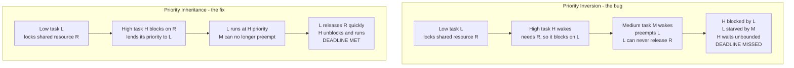

# ⏱️ Real-Time and Embedded Operating Systems

> [!abstract] TL;DR
> In a **real-time operating system (RTOS)** the correctness criterion is not "how fast on average" but "did every task meet its **deadline**." A late answer is a *wrong* answer. This flips ordinary OS design on its head: **predictability and worst-case behavior beat throughput**, so RTOSes use static or dynamic priority scheduling with formal **schedulability proofs** (**Rate-Monotonic** with the Liu–Layland utilization bound; **Earliest-Deadline-First**, optimal on a uniprocessor up to 100% utilization), bound their interrupt and context-switch latency, and deliberately *ban* unpredictable features like demand paging and garbage collection. **Priority inversion** — famously the bug that stalled the Mars Pathfinder rover — is the canonical RTOS hazard, fixed by **priority inheritance**. **Embedded** OSes (FreeRTOS, Zephyr, VxWorks, QNX) push the same ideas onto tiny, power-constrained microcontrollers.

---

## Intuition

**Analogy:** A general-purpose OS is a **restaurant chef optimizing dinner service** — most plates come out quickly, a few are slow, and it all averages out fine; nobody dies if one soufflé is three minutes late. A real-time OS is an **airbag controller**. Being fast *on average* is worthless: if the crash-detection-to-inflation path is ever late *once*, by even a few milliseconds, someone goes through the windshield. Correctness here means meeting *every* deadline, *every* time — so **guaranteed worst-case timing** matters far more than raw speed.

Technically: a general-purpose scheduler maximizes utilization, fairness, and average latency, and is happy to occasionally stall a task to serve the whole. A real-time scheduler instead treats each task's **deadline** as a hard constraint and asks a binary admission question up front — *"can I prove all of these deadlines will always be met?"* — refusing the workload if it cannot. Throughput is traded away for a timing *guarantee*.

---

## How It Works

### The defining idea: a deadline is part of correctness

A real-time task has three numbers: a **release time** (when it becomes ready), a **worst-case execution time (WCET)**, and a **deadline** (when its result must be ready). The system is *correct* only if the result is both logically right **and** delivered within the deadline. Because the guarantee must hold under the *worst* case — worst input, coldest cache, longest interrupt storm — RTOS engineers care about **worst-case** timing, not the average. This is why a slower but perfectly predictable design routinely beats a faster but jittery one.

### Hard vs soft vs firm

| Class | A missed deadline means... | Examples |
|-------|---------------------------|----------|
| **Hard** | Catastrophe — safety or the mission is lost | Flight control, airbags, pacemakers, engine/ABS control, avionics |
| **Firm** | The late result is *useless* (discard it) but not catastrophic | High-frequency trading fills, some sensor-fusion frames |
| **Soft** | Quality degrades but the system tolerates it | Video/VoIP playback, live streaming, UI animation |

The class dictates the engineering budget: hard real-time forces formal proof and certification; soft real-time only needs the misses to stay rare enough that users do not notice.

### Real-time scheduling: guarantee, don't be fair

Unlike the fairness-seeking policies in [[CPU_Scheduling_Algorithms]], a real-time scheduler's job is to guarantee **schedulability**. For periodic tasks with periods `p_i` and execution times `c_i`, per-task utilization is `u_i = c_i / p_i` and total utilization is `U = sum(u_i)`.

- **Rate-Monotonic (RM):** *static* priorities assigned by period — shorter period gets higher priority. Liu & Layland proved RM is the **optimal fixed-priority** policy, and gave a *sufficient* utilization bound: `n` tasks are schedulable if `U <= n * (2^(1/n) - 1)`, which decreases from 1.0 (n=1) toward `ln 2 ≈ 0.693` as `n` grows. Passing the bound proves schedulability; *failing* it is inconclusive (use exact **response-time analysis** instead).
- **Deadline-Monotonic (DM):** generalizes RM when deadlines are shorter than periods — priority by deadline rather than period.
- **Earliest-Deadline-First (EDF):** *dynamic* priorities — whichever ready job has the nearest absolute deadline runs next. EDF is **optimal on a uniprocessor** and schedulable if and only if `U <= 1.0`, so it can pack a core to 100%. The cost: heavier runtime bookkeeping and worse behavior under transient overload (a single overrun can cause a cascade of "domino" misses, whereas RM's low-priority tasks fail predictably first).

**Schedulability analysis** is the up-front proof that the deadlines always hold — the real deliverable of a hard real-time design.

### The classic hazard: priority inversion

A high-priority task `H` needs a resource (a mutex — see [[Locks_Semaphores_and_Monitors]]) currently held by a low-priority task `L`. `H` blocks. Now a **medium**-priority task `M`, needing nothing, preempts `L` and runs indefinitely. `L` can't release the lock because it never runs; `H` can't proceed because `L` holds the lock; `M` has effectively vaulted above `H`. `H`'s deadline sails past. This nearly killed the **Mars Pathfinder** mission in 1997 (a watchdog kept resetting the lander). The fixes:

- **Priority inheritance:** while `L` holds a resource that `H` wants, `L` temporarily *inherits* `H`'s priority, so `M` cannot preempt it. `L` finishes the critical section fast, releases, and drops back down.
- **Priority ceiling protocol:** each resource carries a "ceiling" equal to the highest priority of any task that can lock it; a task acquiring it is boosted to that ceiling. This also *prevents deadlock* — a stronger guarantee than inheritance (connects to [[Deadlocks_Detection_and_Avoidance]]).



### What makes an OS "real-time"

An RTOS is defined less by being *fast* and more by being **bounded and deterministic**:

1. **Bounded interrupt latency** — a provable worst-case gap between a device asserting an interrupt and its handler running (builds on [[Interrupts_Traps_and_Dual_Mode_Operation]]).
2. **Bounded context-switch time** and a **fully preemptible kernel** — even kernel code can be preempted so a high-priority task never waits on a long syscall.
3. **No unpredictable features** — demand paging (a page fault could stall for milliseconds — see [[Virtual_Memory_and_Demand_Paging]]), garbage collection, and unbounded dynamic allocation are avoided or replaced with deterministic variants (memory is often pre-allocated / statically partitioned).
4. **Small, deterministic footprint** — often a **microkernel** or library-OS design (see [[OS_Structure_and_Kernel_Architectures]]) so the trusted, timing-analyzable core stays tiny.

### Embedded and the WCET tension

**Embedded** OSes run on resource-constrained microcontrollers: kilobytes to a few megabytes of RAM, sometimes **no MMU**, aggressive low-power modes. FreeRTOS, Zephyr, VxWorks, QNX, and RTEMS dominate here, powering IoT and edge devices. The deep tension is **WCET analysis**: the very hardware tricks that make general-purpose CPUs fast on average — caches ([[Memory_Hierarchy_and_Caching]]), branch prediction, and out-of-order speculation — make worst-case timing *hard to bound*, because a single cache miss or misprediction inflates a path unpredictably. Real-time engineers sometimes *disable* caches or pick simpler in-order cores to trade average speed for **predictability**. **PREEMPT_RT** turns mainline Linux into a soft/firm real-time platform (fully preemptible kernel, threaded interrupt handlers, priority-inheritance mutexes) — good enough for robotics and audio, but a dedicated RTOS or a formally **verified microkernel like seL4** is still preferred for hard, certified (DO-178C avionics, ISO 26262 automotive) systems.

---

## Key Concepts

### Secondary (plain-language)
- Some computers control things where being *late* is the same as being *wrong* — an airbag, a pacemaker, a plane's autopilot.
- A **real-time OS** promises that important jobs always finish *by their deadline*, not just "usually fast."
- To keep that promise it gives up some raw speed in exchange for being **predictable**.

### Undergraduate (systems course)
- **Hard vs firm vs soft** real-time and why the class sets the engineering budget.
- **Periodic task model:** period `p_i`, execution `c_i`, deadline `d_i`; utilization `u_i = c_i / p_i`.
- **Rate-Monotonic** static priorities and the **Liu–Layland bound** `U <= n(2^(1/n) - 1)` (sufficient, not necessary).
- **Earliest-Deadline-First** dynamic priorities; uniprocessor-optimal, schedulable iff `U <= 1`.
- **Priority inversion** and the **priority-inheritance** fix; the Mars Pathfinder case study.
- Why an RTOS bounds **interrupt latency** and **context-switch time** and avoids demand paging / GC.

### Graduate (design / analysis level)
- **Exact response-time analysis:** `R_i = c_i + sum over higher-prio j of ceil(R_i / p_j) * c_j`, solved by fixed-point iteration — tighter than the utilization bound.
- **EDF under overload:** loses its optimality and can *domino* (cascading misses); mitigations include admission control, constant-bandwidth servers, and mixed-criticality models.
- **Priority ceiling / immediate ceiling** protocols bound blocking to *one* critical section and prevent deadlock, unlike plain inheritance.
- **Multiprocessor real-time:** partitioned vs global EDF; Dhall's effect (a task set with `U` just above 1 can be unschedulable no matter the core count); why RM/EDF optimality does not simply extend to multicore.
- **WCET methods:** static analysis with abstract interpretation of the pipeline/cache vs measurement-based probabilistic WCET; the role of *timing anomalies* in out-of-order cores (see [[Superscalar_and_Out_of_Order_Execution]] and [[Branch_Prediction]]).
- **Certification & formal methods:** DO-178C, ISO 26262, ARINC 653 time/space partitioning, and machine-checked kernels (**seL4**) that prove functional correctness *and* a WCET bound.

---

## Python Demo

```python
# Real-time schedulability: Rate-Monotonic (RM) vs Earliest-Deadline-First (EDF).
# 1) Take a set of PERIODIC tasks (period, worst-case execution time; deadline = period).
# 2) Report per-task and total utilization U, and the Liu-Layland RM bound.
# 3) Simulate both policies unit-by-unit over the hyperperiod and detect deadline misses.
# 4) Plot the execution timeline, marking any MISS with a red X.
# 5) Plot utilization-vs-schedulability: RM's shrinking Liu-Layland bound vs EDF's 100% line.
# numpy + matplotlib only.
import numpy as np
import matplotlib.pyplot as plt
from math import gcd

# Periodic task set: (name, period, wcet). Implicit deadline = period.
# U = 2/5 + 4/7 = 0.971 < 1  -> EDF can schedule it; RM cannot (misses T2).
TASKS = [
    ("T1", 5, 2),
    ("T2", 7, 4),
]


def lcm(a, b):
    return a * b // gcd(a, b)


def hyperperiod(tasks):
    h = 1
    for _, p, _ in tasks:
        h = lcm(h, p)
    return h


def simulate(tasks, policy, horizon):
    """Unit-step preemptive simulation. Returns (timeline, misses).
    timeline[t] = index of task running during [t, t+1), or -1 for idle.
    misses = list of (task_index, deadline_time)."""
    n = len(tasks)
    remaining = [0] * n          # remaining exec of current job
    abs_deadline = [None] * n    # absolute deadline of current job
    next_release = [0] * n
    timeline, misses = [], []

    for t in range(horizon):
        # Release new jobs whose period boundary is now.
        for i, (_, p, c) in enumerate(tasks):
            if t == next_release[i]:
                remaining[i] = c
                abs_deadline[i] = t + p
                next_release[i] = t + p
        # Pick the ready job with the highest priority under the policy.
        ready = [i for i in range(n) if remaining[i] > 0]
        if not ready:
            timeline.append(-1)
        else:
            if policy == "RM":                     # static: shorter period wins
                i = min(ready, key=lambda k: (tasks[k][1], k))
            else:                                  # EDF: nearest absolute deadline wins
                i = min(ready, key=lambda k: (abs_deadline[k], k))
            timeline.append(i)
            remaining[i] -= 1
        # Deadline check at the instant t+1.
        for i in range(n):
            if abs_deadline[i] is not None and t + 1 == abs_deadline[i] and remaining[i] > 0:
                misses.append((i, t + 1))
    return timeline, misses


def utilization(tasks):
    return sum(c / p for _, p, c in tasks)


def liu_layland_bound(n):
    return n * (2.0 ** (1.0 / n) - 1.0)


# ---- Analysis -------------------------------------------------------------
H = hyperperiod(TASKS)
U = utilization(TASKS)
bound = liu_layland_bound(len(TASKS))
print(f"Tasks: {[(nm, p, c) for nm, p, c in TASKS]}")
print(f"Total utilization U = {U:.3f}")
print(f"Liu-Layland RM bound for n={len(TASKS)}: {bound:.3f} "
      f"({'PASS' if U <= bound else 'INCONCLUSIVE (U above bound)'})")
print(f"EDF feasibility (U <= 1): {'PASS' if U <= 1 else 'FAIL'}")
print(f"Hyperperiod = {H}")

rm_tl, rm_miss = simulate(TASKS, "RM", H)
edf_tl, edf_miss = simulate(TASKS, "EDF", H)
print(f"RM  deadline misses: {[(TASKS[i][0], t) for i, t in rm_miss]}")
print(f"EDF deadline misses: {[(TASKS[i][0], t) for i, t in edf_miss]}")

# ---- Plot 1: execution timelines with deadline misses ---------------------
colors = plt.get_cmap("tab10")


def draw_timeline(ax, timeline, misses, title):
    for t, i in enumerate(timeline):
        if i >= 0:
            ax.barh(i, 1, left=t, height=0.6, color=colors(i),
                    edgecolor="black", linewidth=0.3)
    for i, (_, p, _) in enumerate(TASKS):          # release / deadline ticks
        for r in range(0, len(timeline) + 1, p):
            ax.plot(r, i, marker="^", color="black", ms=6, clip_on=False)
    for i, tm in misses:                           # deadline miss markers
        ax.plot(tm, i, marker="X", color="red", ms=16, mew=2.5)
    ax.set_yticks(range(len(TASKS)))
    ax.set_yticklabels([nm for nm, _, _ in TASKS])
    ax.set_xlim(0, len(timeline))
    ax.set_xticks(range(0, len(timeline) + 1, 5))
    ax.set_ylim(-0.6, len(TASKS) - 0.4)
    ax.set_title(title, loc="left", fontsize=10)
    ax.grid(True, axis="x", alpha=0.3)


fig1, (axr, axe) = plt.subplots(2, 1, figsize=(12, 4.5), constrained_layout=True)
draw_timeline(axr, rm_tl, rm_miss,
              "Rate-Monotonic: T2 misses its deadline (red X) -> U above LL bound")
draw_timeline(axe, edf_tl, edf_miss,
              "Earliest-Deadline-First: all deadlines met (optimal up to U = 1.0)")
axe.set_xlabel("time  (^ = job release / deadline,  X = deadline miss)")
fig1.suptitle("Same task set, two policies: EDF schedules what RM cannot")

# ---- Plot 2: utilization vs schedulability --------------------------------
n_axis = np.arange(1, 13)
ll = np.array([liu_layland_bound(int(n)) for n in n_axis])

fig2, ax2 = plt.subplots(figsize=(9, 5), constrained_layout=True)
ax2.fill_between(n_axis, 0, ll, alpha=0.20, color="#1D4ED8",
                 label="RM guaranteed-schedulable region")
ax2.fill_between(n_axis, ll, 1.0, alpha=0.20, color="#059669",
                 label="EDF-only region (RM inconclusive)")
ax2.plot(n_axis, ll, "o-", color="#1D4ED8", lw=2,
         label="Liu-Layland RM bound  n(2^(1/n)-1)")
ax2.axhline(1.0, color="#059669", lw=2, label="EDF bound  U = 1.0")
ax2.axhline(np.log(2), color="gray", ls="--", lw=1.5,
            label="RM asymptote  ln 2 = 0.693")
ax2.scatter([len(TASKS)], [U], color="red", zorder=5, s=80,
            label=f"our task set  U={U:.3f}")
ax2.set_xlabel("number of periodic tasks  n")
ax2.set_ylabel("total utilization  U")
ax2.set_ylim(0, 1.05)
ax2.set_title("RM's guarantee shrinks toward 0.693; EDF stays optimal to 1.0")
ax2.legend(loc="lower left", fontsize=8)
ax2.grid(True, alpha=0.3)
plt.show()

# Expected output:
#   U = 0.971 is ABOVE the RM bound (0.828) -> RM misses T2's deadline at t=7.
#   The SAME U = 0.971 <= 1.0, so EDF meets every deadline: EDF is optimal
#   on a uniprocessor while RM trades some capacity for static-priority simplicity.
```

Running this prints that `U = 0.971` sits above the two-task Liu–Layland bound of `0.828`, and the RM timeline shows **T2 missing its deadline at t = 7** (a red X). EDF, driven only by nearest absolute deadline, reorders execution and meets *every* deadline on the identical workload — a concrete demonstration of EDF's uniprocessor optimality up to 100% utilization, and of *why* the utilization-vs-schedulability chart shows RM's guarantee shrinking toward `ln 2` while EDF's stays pinned at `1.0`.

---

## Real-World Applications

> **Example — FreeRTOS on a microcontroller.** FreeRTOS ships a **fixed-priority preemptive** scheduler (RM/DM-style) with optional priority inheritance on its mutexes — a direct, tiny (a few KB) implementation of everything above. It runs on billions of devices (Espressif ESP32, STM32, Nordic nRF) exactly *because* it is small, statically configurable, and gives a bounded, analyzable worst case rather than good averages.

- **Automotive (AUTOSAR / ISO 26262):** engine control, ABS, and airbag ECUs use OSEK/AUTOSAR-OS with fixed-priority tasks and hard deadlines; a late torque command is a safety fault, not a slowdown.
- **Avionics (DO-178C / ARINC 653):** VxWorks and integrity-class RTOSes provide **time-and-space partitioning** so one partition's overrun cannot steal cycles from flight-critical partitions.
- **Medical devices:** pacemakers and infusion pumps run hard real-time loops where a missed timing window is life-threatening; certification demands proven WCET.
- **Industrial control / PLCs & robotics:** deterministic scan cycles and motor-control loops (often **Linux with PREEMPT_RT** or a dedicated RTOS) keep jitter in the microsecond range.
- **Telecom & QNX:** carrier-grade switches and automotive infotainment (QNX) use a microkernel RTOS for fault isolation plus real-time response.
- **Soft real-time at scale:** VoIP and video pipelines are *soft* real-time — occasional late frames degrade quality gracefully, so a general-purpose OS with priority tuning suffices (contrast with the strict guarantees above; relates to [[Latency_vs_Throughput]] and to frame-timed [[Game_Loop_and_Architecture]]).

---

## Common Pitfalls

- **Optimizing the average, not the worst case** — profiling a real-time path by mean latency hides the tail that actually blows the deadline. Always measure and bound the *maximum*; a 99th-percentile-fast system can still be a hard-real-time failure.
- **Priority inversion left unguarded** — using a plain mutex shared between high- and low-priority tasks without priority inheritance/ceiling invites the Mars Pathfinder bug. Enable inheritance on every shared lock (see [[Locks_Semaphores_and_Monitors]]).
- **Reading the Liu–Layland bound backwards** — the bound is *sufficient, not necessary*. `U` above `n(2^(1/n)-1)` does **not** prove RM fails; run exact response-time analysis before rejecting a task set.
- **Assuming EDF is strictly better** — EDF packs to 100% but degrades catastrophically under transient overload (domino misses), and its dynamic priorities cost more at runtime. RM/DM fail *predictably* (lowest-priority first), which certification often prefers.
- **Leaving unpredictable features on** — demand paging, garbage collection, dynamic `malloc`, and CPU frequency scaling all inject unbounded jitter. Pre-allocate memory, lock pages, and pin frequencies (relates to [[Virtual_Memory_and_Demand_Paging]]).
- **Ignoring interrupt latency and ISR length** — long or interrupt-disabled handlers inflate the worst-case latency of *every* task. Keep ISRs short and defer work (top-half/bottom-half), or you break the timing budget (see [[Interrupts_Traps_and_Dual_Mode_Operation]]).
- **Trusting the datasheet clock for WCET** — caches, branch prediction, and speculation make measured execution time input-dependent and non-monotonic (timing anomalies). Bound WCET with the caches/pipeline in mind, or disable them for hard paths (see [[Memory_Hierarchy_and_Caching]], [[Branch_Prediction]]).
- **Treating "real-time" as "fast"** — a real-time system can be *slow* yet correct. The property is *determinism and deadline-meeting*, not high throughput.

---

## Related Concepts

Verified vault links:

- [[CPU_Scheduling_Algorithms]] — RM and EDF are the real-time siblings of the general-purpose policies there; both are ultimately "which ready job next?" with deadlines as the key.
- [[Deadlocks_Detection_and_Avoidance]] — the priority-ceiling protocol prevents deadlock as well as inversion; the two hazards share the resource-holding structure.
- [[Locks_Semaphores_and_Monitors]] — priority inheritance and ceiling protocols are properties of the *mutex* implementation used to guard shared resources.
- [[Interrupts_Traps_and_Dual_Mode_Operation]] — bounded interrupt latency and short ISRs are prerequisites for any provable real-time timing budget.
- [[OS_Structure_and_Kernel_Architectures]] — microkernels (QNX, seL4) and library OSes give the small, preemptible, analyzable core an RTOS needs.
- [[Virtual_Memory_and_Demand_Paging]] — demand paging's unbounded page-fault stalls are exactly what hard real-time systems disable or replace.
- [[Memory_Hierarchy_and_Caching]] — caches make average speed high but WCET hard to bound; the central average-vs-predictable tension.
- [[Branch_Prediction]] — another speculative feature that helps the average case but complicates worst-case timing analysis.
- [[Superscalar_and_Out_of_Order_Execution]] — out-of-order cores create timing anomalies that WCET analysis must account for.
- [[Interrupts_and_DMA]] — the hardware interrupt/DMA path whose latency the RTOS must bound.
- [[Game_Loop_and_Architecture]] — a soft real-time cousin: a game loop is a periodic task with a frame deadline (16.6 ms at 60 Hz).
- [[Latency_vs_Throughput]] — the system-design framing of the same trade-off RTOSes resolve in favor of bounded latency.

---

## Review Questions

1. **(Secondary)** Explain the airbag-vs-chef analogy: why is "fast on average" the wrong goal for an airbag controller, and what property replaces it? Give one hard, one firm, and one soft real-time example.
2. **(Undergraduate)** A uniprocessor runs three periodic tasks with `(period, exec)` of `(4,1)`, `(5,1)`, and `(10,3)`. Compute total utilization, compare it against the Liu–Layland RM bound for `n=3`, and state what each of RM and EDF can conclude about schedulability.
3. **(Undergraduate scenario)** In the Mars Pathfinder failure, a high-priority task missed its deadline even though the low-priority lock holder needed the CPU only briefly. Walk through the three-task priority-inversion sequence and explain precisely how priority inheritance would have prevented the watchdog reset.
4. **(Graduate trade-off)** EDF is optimal on a uniprocessor and schedulable up to `U = 1.0`, yet many certified hard-real-time systems still choose fixed-priority RM/DM. Give two concrete reasons — one about behavior under transient overload, one about certification/analysis — and describe a workload where EDF's advantage is decisive.
5. **(Graduate)** Modern CPUs use caches, branch prediction, and out-of-order execution to raise average performance. Explain why each *hurts* WCET analysis, what a "timing anomaly" is, and the trade-off an engineer makes by disabling caches on a hard-real-time path.

---

## Sources

- C. L. Liu and J. W. Layland, "Scheduling Algorithms for Multiprogramming in a Hard-Real-Time Environment," *Journal of the ACM*, 20(1), 1973 — the RM/EDF results and the utilization bound. [https://dl.acm.org/doi/10.1145/321738.321743](https://dl.acm.org/doi/10.1145/321738.321743)
- G. C. Buttazzo, *Hard Real-Time Computing Systems: Predictable Scheduling Algorithms and Applications*, 3rd ed., Springer, 2011.
- M. B. Jones, "What Really Happened on Mars Rover Pathfinder" (priority inversion / priority inheritance case study), 1997. [https://www.cs.cornell.edu/courses/cs614/1999sp/papers/pathfinder.html](https://www.cs.cornell.edu/courses/cs614/1999sp/papers/pathfinder.html)
- The FreeRTOS Kernel — scheduling and priority-inheritance mutex documentation. [https://www.freertos.org/implementation/a00005.html](https://www.freertos.org/implementation/a00005.html)
- The Linux Foundation, *Real-Time Linux (PREEMPT_RT) Wiki*. [https://wiki.linuxfoundation.org/realtime/start](https://wiki.linuxfoundation.org/realtime/start)
- G. Klein et al., "seL4: Formal Verification of an OS Kernel," *SOSP*, 2009 — verified microkernel with WCET analysis for real-time use. [https://sel4.systems/](https://sel4.systems/)

---

#operating-systems #real-time #rtos #rate-monotonic #embedded-systems
