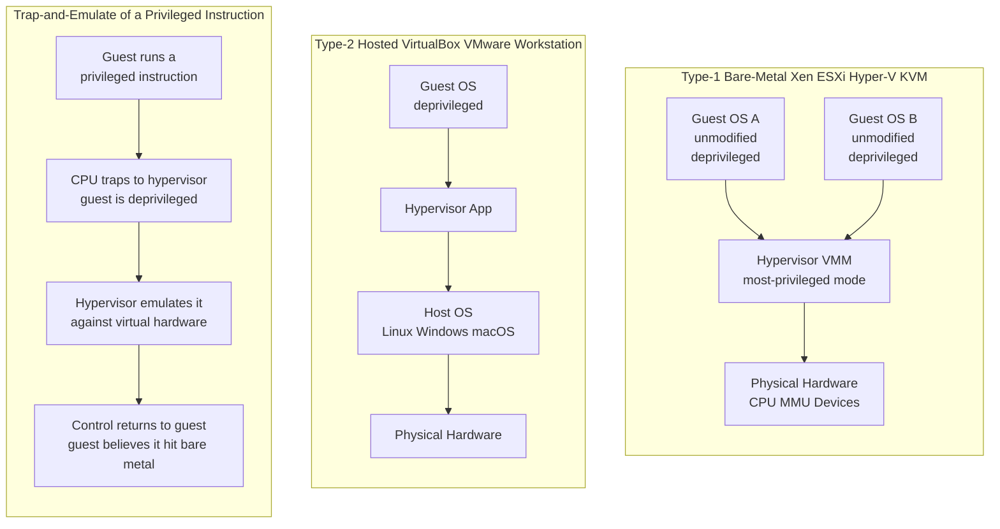

# 🖥️ Virtualization and Hypervisors

> [!abstract] TL;DR
> **Virtualization** runs many isolated **virtual machines** — each with its own unmodified guest OS — on one physical machine. The trick is a **hypervisor** (Virtual Machine Monitor) that gives every guest the *illusion* of owning dedicated CPU, memory, and devices while secretly multiplexing the real hardware underneath. The guest runs **deprivileged**; its privileged instructions **trap** into the hypervisor, which **emulates** them. Classic x86 was not cleanly virtualizable, so the industry evolved three fixes — **binary translation**, **paravirtualization**, and finally **hardware-assisted virtualization** (Intel VT-x, AMD-V) which is today's standard. The economic payoff is **statistical multiplexing**: because workloads are bursty and uncorrelated, you can safely pack dozens of VMs onto one server at high utilization — the engine that made **cloud computing** and IaaS possible.

---

## Intuition

**Analogy:** A hypervisor turns one physical building into an **apartment complex**. Each virtual machine is a self-contained apartment whose tenant is convinced they own the *whole building* — their own front door, plumbing, and electrical panel. In reality the **landlord** (the hypervisor) has secretly partitioned the real walls, water, and power among many tenants who never see each other and cannot walk into a neighbor's rooms. When a tenant tries to do something that would affect the whole building — shut off the master water valve, rewire the mains — that request is quietly intercepted and handled by the landlord, then the tenant is handed back a result that *looks* exactly like they threw the switch themselves.

In the technical domain, the "whole building" is a complete set of hardware — CPU, RAM, disks, NICs. The guest OS issues **privileged instructions** believing it runs on bare metal; the hypervisor intercepts the dangerous ones, does the right thing on the shared physical hardware, and returns control so the guest never learns it is sharing.

---

## How It Works

A hypervisor is essentially a specialized kernel whose "processes" are entire operating systems. It rests on the same **dual-mode** foundation as any OS: the most privileged code (the VMM) controls the hardware, and everything above it — including each guest kernel — runs *deprivileged*.

### Core mechanics

1. **Deprivileging the guest.** The guest OS was written expecting to run in the most privileged CPU mode. The hypervisor instead runs the guest at a lower privilege so it *cannot* directly touch real hardware. The guest keeps issuing privileged instructions, but they no longer execute for real.
2. **Trap-and-emulate.** When a deprivileged guest executes a privileged instruction, the CPU **traps** into the hypervisor. The VMM reads the trapped instruction, **emulates** its effect against the guest's virtual hardware state, and resumes the guest. The guest sees a result consistent with running on bare metal — this is the classic mechanism formalized by **Popek and Goldberg** (1974).
3. **The Popek-Goldberg requirements.** A correct VMM must provide **equivalence** (guests behave as on real hardware), **resource control** (guests cannot escape the VMM's allocation), and **efficiency** (most instructions run natively at hardware speed, not interpreted). Their theorem: a machine is virtualizable by trap-and-emulate only if every *sensitive* instruction is also *privileged* (i.e., traps when run deprivileged).
4. **Why classic x86 broke the rule.** Some x86 instructions were **sensitive but not privileged** — for example `POPF`, which silently *ignored* changes to the interrupt flag when run in user mode instead of trapping. The guest kernel could execute them and get *wrong, silent* results with no trap for the VMM to intercept. Pure trap-and-emulate was therefore impossible on pre-2005 x86.
5. **Three fixes to the x86 problem.**
   - **Binary translation (VMware, late 1990s):** the VMM dynamically scans guest kernel code and rewrites the unsafe instructions into safe sequences that trap or call the VMM. User-mode code runs untouched at native speed.
   - **Paravirtualization (Xen, 2003):** *modify the guest OS* so that instead of privileged instructions it makes explicit **hypercalls** into the VMM. Faster and simpler, but the guest kernel must be ported.
   - **Hardware-assisted virtualization (Intel VT-x / AMD-V, 2005–06):** the CPU adds a new **guest mode** (VMX non-root) and a **VMCS** (Virtual Machine Control Structure) so sensitive instructions trap cleanly as **VM exits** into the hypervisor. This restored pure trap-and-emulate on x86 and is the modern default.
6. **Memory virtualization — two levels of translation.** A guest OS builds its own page tables mapping guest-virtual to guest-physical, but guest-physical is itself virtual to the host. Early VMMs maintained **shadow page tables** collapsing both mappings into one hardware page table (correct but expensive to keep in sync). Modern CPUs add **nested / extended page tables** (Intel **EPT**, AMD **NPT / RVI**): the MMU walks *two* tables in hardware, guest-virtual → guest-physical → host-physical. The cost is longer page-table walks and more **TLB** pressure on a miss.
7. **I/O virtualization.** Three tiers: fully **emulated devices** (the VMM mimics a real NIC or disk controller in software — most compatible, slowest); **paravirtualized drivers** (**virtio**) where the guest uses a driver designed to talk efficiently to the hypervisor; and **passthrough / SR-IOV** where the **IOMMU** (Intel VT-d) safely maps a physical device — or a virtual function of it — directly into a guest for near-native throughput.

### Flow / Architecture



---

## Key Concepts

### Secondary — the big idea

- **A virtual machine is a whole computer inside a computer.** It has its own OS, its own memory, its own disk — but it is really a program running on a physical host.
- **The hypervisor is the illusionist.** It convinces each guest OS that it owns the hardware, while sharing one real machine among many.
- **Type-1 vs Type-2.** A **Type-1 (bare-metal)** hypervisor runs *directly* on the hardware; a **Type-2 (hosted)** hypervisor runs as an app *on top of* a normal operating system.
- **Why it matters.** One expensive server can safely do the work of many small ones. That consolidation is the whole reason the cloud is cheap.

### Undergraduate — the mechanism

- **Type-1 (bare-metal):** Xen, VMware **ESXi**, Microsoft **Hyper-V**. **KVM** is a hybrid — it turns the Linux kernel *itself* into a Type-1 hypervisor. Lowest overhead, used for production servers and clouds.
- **Type-2 (hosted):** VirtualBox, VMware Workstation, Parallels. Convenient on a laptop because they ride an existing OS, but slower because guest I/O passes through the host OS.
- **Trap-and-emulate:** the guest runs deprivileged; privileged instructions **trap** into the VMM ([[Interrupts_Traps_and_Dual_Mode_Operation]]), which emulates them and resumes the guest — the same trap machinery that powers [[System_Calls_and_the_Kernel_Interface]], but one level deeper.
- **Popek-Goldberg equivalence, control, efficiency** — the three properties a real VMM must satisfy, and why efficiency rules out simply *interpreting* the whole guest.
- **The three x86 solutions:** binary translation (VMware), paravirtualization / hypercalls (Xen), hardware assist (VT-x / AMD-V). Know which came first and why hardware assist won.
- **Memory:** shadow page tables vs hardware **EPT / NPT** nested paging — a two-level guest→host translation built on ordinary [[Paging_and_Page_Tables]].

### Graduate — the frontier and the economics

- **Why the debate flipped twice.** x86 first *couldn't* be virtualized cleanly (sensitive-but-unprivileged instructions), so software tricks reigned; then VT-x/AMD-V made trap-and-emulate viable again, and later EPT/NPT made *memory* virtualization cheap in hardware — moving the bottleneck from CPU to I/O and TLB.
- **The TLB tax of nested paging.** A guest TLB miss under EPT can trigger a two-dimensional page walk of up to ~24 memory references on x86-64 (both dimensions four levels deep), which is why huge pages and TLB tagging (VPID / ASID) matter for VM performance.
- **Statistical multiplexing is the business model.** Because independent workloads peak at different times, the aggregate of N uncorrelated bursty demands has a coefficient of variation that shrinks like 1/√N. You can therefore **overcommit** — provision for the *aggregate* peak, not the sum of individual peaks — and run one host at high utilization while still meeting an SLA-violation probability target. This is the arithmetic engine of **server consolidation** and IaaS.
- **Live migration & snapshots.** A running VM's memory and device state can be checkpointed and even **live-migrated** across physical hosts with sub-second pauses (pre-copy dirty-page tracking), enabling maintenance without downtime and load rebalancing — impossible to do this cleanly with a bare process.
- **The VMM as a small TCB.** A hypervisor exposes a *narrower* interface than a full OS, so it can be a smaller **Trusted Computing Base** and a strong isolation boundary between tenants — but **VM escape** vulnerabilities (bugs in device emulation such as the 2015 "VENOM" floppy-controller flaw) remain the nightmare, because one escape breaks *all* isolation on the box.
- **Nested virtualization & microVMs.** Modern CPUs let a hypervisor run *inside* a guest (needed for cloud CI, nested KVM). **microVMs** like AWS **Firecracker** strip device emulation to a minimum to boot a VM in ~125 ms with a few MB of overhead — VM-grade isolation at near-container speed, powering serverless (Lambda, Fargate).

---

## Python Demo

```python
# Model the CONSOLIDATION ECONOMICS of virtualization.
#
# Many bursty, UNCORRELATED workloads (low average demand, occasional spikes)
# are packed onto physical servers. Because their peaks rarely coincide, the
# aggregate demand of N workloads has a coefficient of variation that shrinks
# like 1/sqrt(N) -> STATISTICAL MULTIPLEXING. So a hypervisor can safely run
# far MORE virtual machines per host (and at much higher utilization) than the
# old "one app per physical server" world, while holding SLA-violation
# probability under a target. Virtualization OVERHEAD (trap-and-emulate vs
# hardware-assisted VT-x/EPT) shaves usable capacity -> a small tax on the win.
#
# numpy / matplotlib only.

import numpy as np
import matplotlib.pyplot as plt

rng = np.random.default_rng(7)

# --- Workload & host model -------------------------------------------------
MU        = 0.15          # mean CPU demand per workload, in units of "one core"
CV        = 1.20          # coefficient of variation (>1 => very bursty)
SIGMA     = CV * MU
HOST_CORE = 32.0          # physical capacity of one server (cores)

# Virtualization "tax": usable capacity the hypervisor gives back to guests.
OVERHEAD = {
    "Ideal (no virt tax)":          0.00,
    "HW-assisted (VT-x / EPT)":     0.04,   # ~4% modern tax
    "Trap-and-emulate / bin-trans": 0.22,   # ~22% legacy tax
}

# --- Inverse standard-normal CDF (Acklam), numpy-only, no scipy ------------
def norm_ppf(p):
    p = np.asarray(p, dtype=float)
    a = np.array([-3.969683028665376e+01, 2.209460984245205e+02,
                  -2.759285104469687e+02, 1.383577518672690e+02,
                  -3.066479806614716e+01, 2.506628277459239e+00])
    b = np.array([-5.447609879822406e+01, 1.615858368580409e+02,
                  -1.556989798598866e+02, 6.680131188771972e+01,
                  -1.328068155288572e+01])
    c = np.array([-7.784894002430293e-03, -3.223964580411365e-01,
                  -2.400758277161838e+00, -2.549732539343734e+00,
                  4.374664141464968e+00, 2.938163982698783e+00])
    d = np.array([7.784695709041462e-03, 3.224671290700398e-01,
                  2.445134137142996e+00, 3.754408661907416e+00])
    lo_b, hi_b = 0.02425, 1 - 0.02425
    x = np.zeros_like(p)
    lo = p < lo_b
    q = np.sqrt(-2 * np.log(p[lo]))
    x[lo] = (((((c[0]*q+c[1])*q+c[2])*q+c[3])*q+c[4])*q+c[5]) / \
            ((((d[0]*q+d[1])*q+d[2])*q+d[3])*q+1)
    hi = p > hi_b
    q = np.sqrt(-2 * np.log(1 - p[hi]))
    x[hi] = -(((((c[0]*q+c[1])*q+c[2])*q+c[3])*q+c[4])*q+c[5]) / \
             ((((d[0]*q+d[1])*q+d[2])*q+d[3])*q+1)
    mid = ~(lo | hi)
    q = p[mid] - 0.5
    r = q * q
    x[mid] = (((((a[0]*r+a[1])*r+a[2])*r+a[3])*r+a[4])*r+a[5])*q / \
             (((((b[0]*r+b[1])*r+b[2])*r+b[3])*r+b[4])*r+1)
    return x

# --- Max VMs that fit a host at a target SLA-violation probability ----------
# Require P(sum of N demands > C) <= p, with sum ~ Normal(N*MU, N*SIGMA^2).
#   C >= N*MU + z*sqrt(N)*SIGMA,  z = norm_ppf(1-p)
# Solve for the largest N (quadratic in x = sqrt(N)).
def max_vms_multiplexed(capacity, p):
    z = norm_ppf(1 - p)
    x = (-z * SIGMA + np.sqrt((z * SIGMA)**2 + 4 * MU * capacity)) / (2 * MU)
    return np.floor(x**2).astype(int)

# Baseline: NO multiplexing -> each VM is provisioned for its OWN peak, so the
# host is carved into "peak-sized" slots. Peaks never overlap in accounting.
def max_vms_peak_provisioned(capacity, p):
    z = norm_ppf(1 - p)
    peak_single = MU + z * SIGMA
    return np.floor(capacity / peak_single).astype(int)

# --- Panel 1: consolidation ratio vs SLA target ----------------------------
p_grid = np.logspace(np.log10(0.20), np.log10(1e-4), 60)   # 20% .. 0.01%

fig, (ax1, ax2) = plt.subplots(1, 2, figsize=(13.5, 5.2))

base = max_vms_peak_provisioned(HOST_CORE, p_grid)
ax1.plot(p_grid, base, "k--", lw=2,
         label="No multiplexing (peak-provisioned)")
for name, ov in OVERHEAD.items():
    n = max_vms_multiplexed(HOST_CORE * (1 - ov), p_grid)
    ax1.plot(p_grid, n, "o-", ms=3, label=f"Multiplexed VMs  {name}")
ax1.set_xscale("log")
ax1.invert_xaxis()                       # stricter SLA to the right
ax1.set_xlabel("Target SLA-violation probability (log, stricter ->)")
ax1.set_ylabel("VMs packed per physical host")
ax1.set_title("Statistical multiplexing lets one host hold far more VMs")
ax1.grid(True, which="both", alpha=0.3)
ax1.legend(fontsize=8)

# --- Panel 2: safe utilization vs how many VMs you co-locate ---------------
# Along the packing frontier: util = (N*MU)/HOST with N*MU + z*sqrt(N)*SIGMA
# = usable capacity. Equivalently the SAFE fill fraction of usable capacity is
#   f(N) = 1 / (1 + z*CV/sqrt(N))  ->  approaches 1 as N grows (multiplexing).
N_axis = np.arange(1, 260)
z_fixed = norm_ppf(1 - 0.01)             # 1% SLA target
for name, ov in OVERHEAD.items():
    fill = 1.0 / (1.0 + z_fixed * CV / np.sqrt(N_axis))
    util = (1 - ov) * fill               # fraction of the RAW host actually used
    ax2.plot(N_axis, 100 * util, label=name)

# One-app-per-server reference: a whole 32-core box runs a single 0.15-core app.
ax2.axhline(100 * MU / HOST_CORE, color="crimson", ls=":", lw=2,
            label="One app per physical server")
ax2.set_xlabel("VMs co-located on one host (N)")
ax2.set_ylabel("Achievable server utilization  [%]")
ax2.set_title("Utilization climbs with N; overhead is a small ceiling tax")
ax2.set_ylim(0, 100)
ax2.grid(True, alpha=0.3)
ax2.legend(fontsize=8, loc="center right")

plt.tight_layout()
plt.savefig("virtualization_consolidation.png", dpi=120)
plt.show()

# --- Monte-Carlo sanity check on the SLA math ------------------------------
# Sum of N iid Gamma(k, theta) = Gamma(N*k, theta); match mean MU and CV.
k, theta = 1.0 / CV**2, MU * CV**2
p_target = 0.01
N = max_vms_multiplexed(HOST_CORE, p_target)
agg = rng.gamma(N * k, theta, size=1_000_000)
emp = np.mean(agg > HOST_CORE)
print(f"Target SLA violation p = {p_target:.3f}")
print(f"Multiplexed VMs on a {HOST_CORE:.0f}-core host: N = {N}")
print(f"  mean utilization = {100*N*MU/HOST_CORE:5.1f}%")
print(f"Peak-provisioned baseline VMs           : "
      f"{int(max_vms_peak_provisioned(HOST_CORE, p_target))}")
print(f"Monte-Carlo measured violation prob     : {emp:.4f}  (target {p_target})")
print(f"HW-assist vs trap-emulate VM count at p : "
      f"{int(max_vms_multiplexed(HOST_CORE*0.96, p_target))} vs "
      f"{int(max_vms_multiplexed(HOST_CORE*0.78, p_target))}")
```

**What it shows.** Panel 1: at any SLA target, **multiplexing** (provision for the *aggregate* peak) packs roughly 3x more VMs per host than **peak-provisioning** each VM separately — and tightening the SLA (moving right) only slowly erodes that lead. Panel 2: as you co-locate more uncorrelated VMs, the safely usable utilization climbs from single digits toward ~80%+, dwarfing the "one app per physical server" reference line at the bottom; the three overhead curves show the **virtualization tax** as a modest downward shift — trap-and-emulate costs real capacity, but hardware-assisted VT-x/EPT reclaims almost all of it. The Monte-Carlo check confirms the analytic packing actually holds the target violation probability.

---

## Real-World Applications

- **Cloud IaaS (AWS EC2, Azure VMs, GCP Compute Engine).** Every "instance" you rent is a VM on a shared host. AWS ran Xen for a decade, then moved to the **Nitro** system (KVM-based, with device emulation offloaded to dedicated hardware cards) to shrink the hypervisor tax to near zero. Statistical multiplexing across millions of tenants is what makes per-hour pricing profitable.
- **Server consolidation & the data center.** VMware **vSphere/ESXi** let enterprises collapse racks of 10%-utilized single-app servers into a few heavily-consolidated hosts, with **vMotion** live migration moving running VMs off hardware due for maintenance — no downtime.
- **Serverless microVMs.** AWS **Firecracker** boots a stripped-down KVM microVM in ~125 ms to isolate each **Lambda** / **Fargate** function with true VM boundaries instead of shared-kernel containers — VM security at container-like density.
- **Desktops & dev.** VirtualBox / VMware Workstation (Type-2) run Windows-on-Mac, Linux-on-Windows, and disposable test environments; **KVM/QEMU** underpins most Linux virtualization and cloud stacks.
- **Security sandboxing.** Malware analysis, browser isolation, and confidential-computing enclaves lean on the VM as a hard isolation boundary — a compromised guest is contained inside its VMM-enforced walls.

*(Companion notes still to be written in this vault — **Operating_Systems_Overview**, **Containers_and_OS_Level_Virtualization**, **IO_Systems_and_Device_Drivers**, **Distributed_Operating_Systems**, **OS_Security_and_Isolation**, and **The_Future_of_Operating_Systems** — extend these threads; today the DevOps **Docker** note is the closest existing counterpart for the container comparison.)*

---

## Common Pitfalls

- **Confusing Type-1 and Type-2.** KVM is often mislabeled Type-2 because it lives in Linux, but Linux *is* the hypervisor here (the kernel runs guests directly on the hardware), making KVM effectively Type-1. VirtualBox on top of that same Linux *is* Type-2.
- **Assuming any OS is trivially virtualizable.** Pre-VT-x x86 was **not** cleanly virtualizable because sensitive instructions like `POPF` failed silently instead of trapping — the reason binary translation and paravirtualization existed at all. Know the Popek-Goldberg condition, not just the buzzwords.
- **Ignoring the memory-virtualization TLB cost.** Nested paging (EPT/NPT) makes a TLB miss walk *two* page-table hierarchies. Memory-heavy workloads with poor TLB locality can pay a large hidden tax; huge pages and VPID/ASID tagging are the mitigations.
- **Over-emulating I/O.** Fully emulated devices are the slowest path. If you need throughput, use **virtio** paravirtual drivers or **SR-IOV** passthrough with the IOMMU — otherwise the hypervisor becomes the bottleneck.
- **Treating VMs and containers as interchangeable.** Containers share the host kernel (one kernel, namespaced), so they are lighter and boot in milliseconds but offer *weaker* isolation and cannot run a different-kernel OS. VMs give a full separate kernel and strong isolation at the cost of weight and boot time. Choosing wrong trades either security or density.
- **Overcommitting past the SLA.** Statistical multiplexing works *only* while workload peaks stay uncorrelated. A correlated spike (Black Friday, a synchronized cron job, a "noisy neighbor") can push aggregate demand past capacity all at once — model the tail, do not just size for the mean.
- **Forgetting the VM escape risk.** The hypervisor is a smaller TCB than a full OS, but it is not zero. Device-emulation bugs (e.g., VENOM) let a guest break out to the host — patch the VMM and minimize its emulated attack surface.

---

## Related Concepts

- [[OS_Structure_and_Kernel_Architectures]] — a hypervisor is a specialized kernel whose "processes" are whole guest operating systems; the monolithic-vs-microkernel TCB argument reappears as the VMM-as-small-TCB argument.
- [[Interrupts_Traps_and_Dual_Mode_Operation]] — trap-and-emulate is built on the exact mode-bit/trap machinery this note describes, just with the guest kernel now living in the *deprivileged* ring.
- [[System_Calls_and_the_Kernel_Interface]] — a hypercall is to a hypervisor what a syscall is to a kernel; paravirtualization replaces trapping privileged instructions with explicit hypercalls.
- [[Paging_and_Page_Tables]] — shadow and nested (EPT/NPT) page tables extend ordinary paging to a two-level guest→host translation.
- [[Virtual_Memory_and_Demand_Paging]] — VMs can be over-committed on memory too (ballooning, page sharing), reusing demand-paging ideas across the guest boundary.
- [[Segmentation_and_the_TLB]] — VPID/ASID-tagged TLB entries are what keep VM exits from flushing all translations, a key performance lever for nested paging.
- [[Docker_Architecture_and_Internals]] — the lighter, shared-kernel alternative; contrast container namespaces/cgroups with full hardware virtualization.
- [[Container_and_Kubernetes_Security]] — frames the VM-vs-container isolation-boundary trade-off from the security side (why multi-tenant clouds still reach for hypervisors or microVMs).
- [[Cloud_Security_Fundamentals]] — the shared-responsibility and multi-tenant isolation model rests on hypervisor-enforced boundaries.
- [[AWS_Core_Services]] — EC2 instances are VMs; the Nitro hypervisor is the production embodiment of everything here.
- [[Horizontal_Scaling]] — consolidation and statistical multiplexing are the supply side of the same elasticity that horizontal scaling exploits on the demand side.

---

## Review Questions

1. **(Secondary)** Using the apartment-complex analogy, explain what a hypervisor does and how a Type-1 (bare-metal) hypervisor differs from a Type-2 (hosted) one. Why can one physical server profitably run many VMs?
2. **(Undergraduate)** What are the three Popek-Goldberg requirements, and precisely why did classic x86 violate the condition for pure trap-and-emulate? Describe how binary translation, paravirtualization, and hardware-assisted virtualization each solved the problem, and why hardware assist became the standard.
3. **(Graduate)** You are designing a multi-tenant serverless platform that must isolate untrusted customer code with strong boundaries yet start in well under a second at high density. Weigh containers vs full VMs vs microVMs (Firecracker) in terms of isolation strength, boot latency, memory overhead, and TCB/attack surface. Then, given bursty uncorrelated tenant workloads with mean demand 0.15 cores and CV 1.2 on 32-core hosts, explain how statistical multiplexing sets your safe consolidation ratio at a 1% SLA-violation target — and how a correlated demand spike could break your assumptions.

---

## Sources

- [Popek & Goldberg, "Formal Requirements for Virtualizable Third Generation Architectures", CACM 1974](https://dl.acm.org/doi/10.1145/361011.361073)
- [Adams & Agesen, "A Comparison of Software and Hardware Techniques for x86 Virtualization", ASPLOS 2006](https://dl.acm.org/doi/10.1145/1168857.1168860)
- [Barham et al., "Xen and the Art of Virtualization", SOSP 2003](https://dl.acm.org/doi/10.1145/945445.945462)
- [Agache et al., "Firecracker: Lightweight Virtualization for Serverless Applications", NSDI 2020](https://www.usenix.org/conference/nsdi20/presentation/agache)
- [Silberschatz, Galvin, Gagne — Operating System Concepts, Ch. 18 "Virtual Machines"](https://www.os-book.com/OS10/)

---

#operating-systems #virtualization #hypervisor #virtual-machines #cloud
