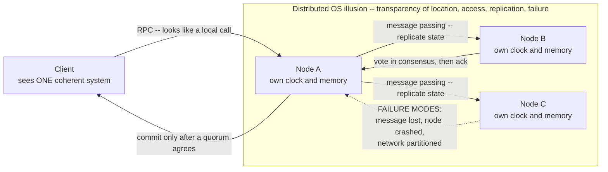

# 🌐 Distributed Operating Systems

> [!abstract] TL;DR
> A **distributed operating system** tries to make a collection of networked computers behave like **one coherent machine** — hiding, behind an illusion of **transparency** (of location, access, replication, and failure), the fact that the "computer" is really dozens of independent nodes with no shared memory and no shared clock. The moment you cross a machine boundary you lose everything a single-machine OS took for granted: the *only* way to communicate is **message passing** (over an unreliable, partitionable network), any node can **fail while others keep running** (partial failure), and there is **no global clock** to order events. Almost every hard idea in the field flows from those three facts — **logical clocks** (Lamport, vector) recover causal ordering; **RPC** makes a network call *look* local while quietly being slow and failure-prone; **consensus** (Paxos, Raft) lets nodes agree despite crashes; the **CAP theorem** and **FLP impossibility** mark the fundamental limits. In practice the monolithic "distributed OS" lost to **distributed-systems middleware and cluster managers** — Kubernetes, gRPC, distributed databases — but they inherit the same OS abstractions (processes, IPC, file systems, scheduling) re-imagined at cluster scale.

---

## Intuition

**Analogy:** A single-machine OS is the manager of **one office** — every worker (process) is in the same building, they share the same filing cabinets (memory), and there is one clock on the wall everyone reads. A **distributed OS** is the ambition to run a whole **city of offices** as if it were that single building: you hand it a task and it feels like *one* place, even though the work is scattered across branches on opposite sides of town.

But a city is not an office. Now the **only way offices talk is by mail** (message passing) — and mail can be **lost, delayed, or duplicated**. Each branch has **its own wall clock**, and they **disagree** by seconds, so "who did what first?" has no obvious answer. Worst of all, **any branch can burn down mid-task** without warning while the others keep working, oblivious — you sent a request and simply *never hear back*, and you cannot tell whether the request was lost, the reply was lost, or the branch is gone. The hard part of a distributed OS was never *sharing the work*; it is **coordinating under uncertainty and partial failure**. As Leslie Lamport put it: *"A distributed system is one in which the failure of a computer you didn't even know existed can render your own computer unusable."*

---

## How It Works

### The goal and the illusion: transparency

The dream of a *true* distributed OS is **single-system image**: you log into what looks like one enormous machine, and the OS transparently schedules your processes onto whichever physical node has capacity, migrates them, and lets them share files and communicate as if local. The measure of success is **transparency** — how many distribution details are hidden:

- **Access transparency** — local and remote resources are used through the *same* interface.
- **Location transparency** — you name a resource without knowing *which* node holds it.
- **Replication transparency** — several copies exist for durability and speed, but you see *one* logical object.
- **Failure transparency** — a node crashing is masked; the system keeps serving.
- **Migration / concurrency transparency** — objects can move, and many clients share them, without you noticing.

Full failure transparency is the one you can never quite buy — which is the whole problem below.

**True distributed OS vs. network OS vs. middleware.** Three arrangements are often confused:

| Approach | What the user sees | Examples |
|---|---|---|
| **Network OS** | Separate machines you explicitly log into; you *know* where things are. Sharing is opt-in. | Classic Unix + NFS, `ssh`, mounting a remote drive |
| **True distributed OS** | *One* machine; the kernel spans nodes and hides all of it. | Amoeba, Plan 9, Sprite, MOSIX — mostly research |
| **Middleware over a network OS** | An application-level layer fakes a unified system on top of ordinary per-node OSes. | gRPC, Kubernetes, distributed databases, Spark |

The monolithic distributed OS mostly **lost**: it turned out easier and more flexible to run a normal OS on each node and build the "distributed" part as **middleware and cluster managers** on top. That is the modern reality — the ideas survived, the single kernel did not.

### Why distribution is fundamentally hard

Three things that are *free* on one machine simply **do not exist** across nodes:

1. **No shared memory — message passing is the only channel.** On one host, two processes can share physical pages and communicate at memory speed (see [[Interprocess_Communication]]). Across hosts there is no shared address space at all; every interaction is an explicit **message copied over the network**, subject to latency, reordering, loss, and duplication.
2. **No global clock.** Each node's crystal drifts; even NTP-synchronized clocks disagree by milliseconds — larger than the time between many events. So you *cannot* order events on different nodes by wall-clock time.
3. **Partial failure.** On one machine a crash is total and honest — everything stops together. In a distributed system **some nodes fail while others keep running**, and a live node **cannot distinguish** "peer crashed" from "peer is slow" from "network is partitioned." That ambiguity, not raw failure, is what makes distributed algorithms hard.

Add **network partitions** (the network splits into groups that cannot talk) and **concurrency at scale** (thousands of nodes acting at once), and every simple assumption from the single-machine OS breaks.

### The architecture and its failure modes



The diagram shows the core loop: a client issues an **RPC** that *looks* like a local call; node A must **replicate** the change to B and C by message passing and get them to **agree** (consensus) before committing — but the dashed edge is the reality that any of those messages or nodes can vanish, and A cannot tell which.

### Time and ordering: logical clocks

Since there is no global clock, distributed systems track **causality** instead of wall-clock time. The key relation is Lamport's **happened-before** (`→`): event *a* → *b* if they are on the same node and *a* is first, or *a* is a *send* and *b* is its matching *receive* (plus transitivity). Events with **no** happened-before path either way are **concurrent**.

- **Lamport timestamps** — one integer counter per node: increment on every event; on receive, set `C = max(C, C_msg) + 1`. Guarantees `a → b ⇒ L(a) < L(b)`, giving a **total order consistent with causality** — but the converse fails, so it *cannot detect concurrency*.
- **Vector clocks** — one counter *per node* carried as a vector; component-wise `max` on receive, then bump your own entry. Now `a → b ⇔ VC(a) < VC(b)` component-wise, and if **neither vector dominates**, the events are provably **concurrent** — exactly the conflict signal Lamport clocks lose (see [[Vector_Clocks]]).
- **Physical synchronization** — **NTP** aligns clocks to within milliseconds over the internet; **PTP** reaches microseconds on a LAN; **TrueTime** (Google Spanner) bounds uncertainty with GPS and atomic clocks so it can wait out the error. These *reduce* skew but never eliminate it — logical clocks remain necessary for *ordering*.

Ordering is the **root problem**: replication, consistency, and consensus are all, at bottom, about agreeing on *the order things happened*.

### RPC: making a network call look local

**Remote Procedure Call** lets you write `result = service.method(args)` and have it execute on another machine. A **client stub** **marshals** (serializes) the arguments into a message, ships it over the network; a **server stub** **unmarshals**, calls the real function, and marshals the return value back. Frameworks like **gRPC** (HTTP/2 + Protobuf) and **Thrift** generate these stubs for you (see [[RPC]], [[gRPC]]).

The seductive lie is **RPC transparency** — the classic paper *"A Note on Distributed Computing"* warns you cannot pretend a remote call is a local one: it is **orders of magnitude slower**, it can **fail independently of your process** (network drop, server crash), and it forces **partial-failure** semantics onto what looks like an ordinary function. Well-designed RPC therefore exposes **timeouts, retries, and idempotency** rather than hiding them.

### Consensus and coordination

**Consensus** is getting a set of nodes to **agree on one value** despite crashes and message loss — the foundation of a **replicated state machine** (apply the same commands in the same order on every replica and they stay identical). **Paxos** proved it possible; **Raft** made it *understandable* by decomposing it into **leader election**, **log replication**, and **safety**, with a single elected **leader** ordering all writes and a **majority quorum** committing them (see [[Consensus_and_Raft]], [[Consensus_and_Quorums]]). Consensus underlies etcd, ZooKeeper, and the metadata layer of essentially every modern cluster.

### The limits: CAP and FLP

Two impossibility results fence the whole field:

- **CAP theorem** — under a network **partition** you must choose **Consistency** *or* **Availability**; you cannot have both while remaining partition-tolerant. A **CP** system rejects writes on the minority side to stay consistent; an **AP** system keeps serving and reconciles later (see [[CAP_Theorem]], and its refinement [[PACELC_Theorem]], which adds the latency-vs-consistency tradeoff *even when there is no partition*).
- **FLP impossibility** — in a **fully asynchronous** system (no bound on message delay), **no deterministic protocol can guarantee consensus if even one node may crash**, because a slow node is indistinguishable from a dead one. Real systems escape FLP not by breaking it but by adding **timeouts** (partial synchrony) or **randomization** — which is why every practical consensus protocol has a timeout somewhere.

### Distributed file systems, replication, and fault tolerance

The file abstraction (see [[File_Systems_and_Abstractions]]) extends across machines through **distributed file systems**: **NFS** (stateless, simple, weak consistency), **AFS** (whole-file client caching with callbacks), and modern **GFS/HDFS** (huge files, append-heavy, chunk replication for analytics) and **Ceph** (object, block, and file over one cluster). All wrestle the same trio: **caching** for speed, **replication** for durability and availability, and the **consistency** cost of keeping copies in agreement — themes developed further in this vault's *Modern File Systems and Storage* note (see [[Distributed_File_Systems]] on the system-design side).

Fault tolerance is built from a few primitives: **state-machine replication** (consensus-ordered command logs), **primary-backup** (one leader, standby followers), and **quorums** (require overlapping majorities so reads see the latest write — see [[Replication]], [[Replication_Strategies]]). Two thought experiments frame the limits: the **Two Generals problem** shows reliable agreement over a lossy channel is impossible with certainty, and the **Byzantine Generals problem** extends failure from crashes to *lying* nodes, requiring `3f + 1` nodes to tolerate `f` malicious ones (the basis of BFT and blockchains).

---

## Key Concepts

### Secondary (intuition level)
- A distributed OS wants many computers to **feel like one**. The hard part is not splitting the work but **coordinating** it when messages get lost and machines vanish.
- There is **no shared memory and no shared clock** across machines — everything is **mail** (messages), and the mail is unreliable.
- **Partial failure** is the villain: some parts keep running while others die, and you often **cannot tell which** happened.

### Undergraduate (mechanism level)
- **Transparency** goals: access, location, replication, failure, migration — the yardstick of "one system image."
- **Network OS vs. true distributed OS vs. middleware** — and why middleware (Kubernetes, gRPC, distributed DBs) won.
- **Logical clocks:** Lamport timestamps give a causal *total order* but cannot spot concurrency; **vector clocks** detect concurrent (conflicting) events. Physical sync (**NTP/PTP**) reduces but never removes skew.
- **RPC** mechanics: client/server **stubs**, **marshalling/serialization**, and why **RPC transparency is a fallacy** (slow, can fail independently).
- **Consensus**: replicated state machines, leaders, and **majority quorums**; **Raft** as the teachable form of Paxos.
- **CAP**: pick C or A under partition; strong vs. eventual consistency.

### Graduate (design and tension level)
- **FLP impossibility** and the escape hatches — **partial synchrony (timeouts)** and **randomization**; why "failure detectors" are the real object of study.
- **Consistency spectrum**: **linearizability** (single-copy, real-time order) → **sequential** → **causal** → **eventual**; each weaker model buys availability/latency (**PACELC**). Causal consistency is the strongest model still available under partition.
- **Quorum intersection** (`R + W > N`) and its failure modes; **read-repair**, **hinted handoff**, **anti-entropy**, and **CRDTs** for AP reconciliation.
- **Byzantine fault tolerance** (`3f + 1`), PBFT, and the crash-fault vs. Byzantine boundary that separates cluster consensus from blockchain consensus.
- **The end-to-end argument** and the *fallacies of distributed computing* (the network is reliable, latency is zero, bandwidth is infinite, topology is static, …) as design discipline.
- **Why OS abstractions reappear at cluster scale**: a **process** becomes a container/pod, **IPC** becomes RPC/message queues, the **file system** becomes a distributed/object store, the **scheduler** becomes a cluster scheduler (Kubernetes, Borg, Mesos). The OS course *is* the distributed-systems course, one layer up.

---

## Python Demo

We simulate **three nodes exchanging messages** and assign **both Lamport timestamps and vector clocks** to every event in a single causal pass. The Lamport clock yields a total order consistent with *happened-before*; the vector clock additionally lets us **detect concurrent (causally unordered) events** — the ordering information no shared physical clock can give us. We then draw the classic **space-time diagram** with both timestamps and highlight a concurrent pair. `numpy` + `matplotlib` only.

```python
# Logical clocks in a distributed system: Lamport timestamps + vector clocks.
# Three nodes (P0, P1, P2) exchange messages. We assign both clock types to
# every event, then use the VECTOR clocks to detect which event pairs are
# CONCURRENT (causally unordered) -- ordering a shared physical clock cannot
# provide. numpy + matplotlib only.
import numpy as np
import matplotlib.pyplot as plt

N = 3  # nodes P0, P1, P2

# Each event: (id, proc, kind, partner). kind in {"internal","send","recv"}.
# For a "recv", partner is the matching SEND id (whose message clock we merge).
# For a "send", partner is the matching RECV id (used only to draw the arrow).
# Events are listed in ONE causally-valid total order, so a single forward pass
# assigns clocks correctly (every recv appears after its matching send).
events = [
    ("e0a", 0, "internal", None),
    ("e2a", 2, "internal", None),
    ("e0b", 0, "send",     "e1a"),   # m1: P0 -> P1
    ("e1a", 1, "recv",     "e0b"),
    ("e0c", 0, "internal", None),
    ("e1b", 1, "send",     "e2b"),   # m2: P1 -> P2
    ("e1c", 1, "internal", None),
    ("e2b", 2, "recv",     "e1b"),
    ("e2c", 2, "send",     "e0d"),   # m3: P2 -> P0
    ("e0d", 0, "recv",     "e2c"),
]

lamport, vector = {}, {}          # event id -> int / vector
sent_L, sent_V  = {}, {}          # send id -> clock carried by its message
L = np.zeros(N, dtype=int)        # per-node Lamport counter
V = np.zeros((N, N), dtype=int)   # V[p] is node p's current vector clock

for eid, p, kind, partner in events:
    if kind == "recv":                     # merge the incoming message, then tick
        L[p] = max(L[p], sent_L[partner]) + 1
        V[p] = np.maximum(V[p], sent_V[partner])
        V[p, p] += 1
    else:                                  # internal or send: just tick
        L[p] += 1
        V[p, p] += 1
    lamport[eid], vector[eid] = int(L[p]), V[p].copy()
    if kind == "send":                     # remember what the message carries
        sent_L[eid], sent_V[eid] = int(L[p]), V[p].copy()

def relation(u, v):
    """Compare two events by their vector clocks."""
    a, b = vector[u], vector[v]
    le, ge = bool(np.all(a <= b)), bool(np.all(a >= b))
    if le and ge: return "equal"
    if le:        return "before"      # u -> v  (u happened-before v)
    if ge:        return "after"       # v -> u
    return "concurrent"                # neither dominates: causally unordered

# --- Report ---------------------------------------------------------------
ids = [e[0] for e in events]
print("event  Lamport  vector")
for eid in ids:
    print(f"{eid:5s}   {lamport[eid]:>4}    {list(vector[eid])}")

print("\nConcurrent (causally unordered) pairs -- vector clocks catch these,")
print("Lamport timestamps CANNOT:")
seen = set()
concurrent_pairs = []
for u in ids:
    for v in ids:
        if u < v and relation(u, v) == "concurrent":
            concurrent_pairs.append((u, v))
            print(f"  {u} {list(vector[u])}  ||  {v} {list(vector[v])}")

# --- Space-time diagram ---------------------------------------------------
xpos   = {eid: i for i, (eid, *_rest) in enumerate(events)}
colors = ["#d9534f", "#5cb85c", "#4a90d9"]

fig, ax = plt.subplots(figsize=(13, 6))
for p in range(N):
    ax.axhline(p, color="#cccccc", lw=1, zorder=1)
    ax.text(-0.8, p, f"P{p}", va="center", ha="right",
            fontsize=12, fontweight="bold", color=colors[p])

# message arrows (send -> recv)
for eid, p, kind, partner in events:
    if kind == "send":
        rproc = next(pp for (ee, pp, kk, pr) in events if ee == partner)
        ax.annotate("", xy=(xpos[partner], rproc), xytext=(xpos[eid], p),
                    arrowprops=dict(arrowstyle="-|>", color="#333333",
                                    lw=1.6, shrinkA=8, shrinkB=8), zorder=2)

# events + both timestamps
for eid, p, kind, partner in events:
    x = xpos[eid]
    ax.scatter(x, p, s=170, color=colors[p], edgecolor="black", zorder=3)
    ax.text(x, p + 0.22, f"L={lamport[eid]}", ha="center", fontsize=9)
    ax.text(x, p - 0.34, "[" + ",".join(map(str, vector[eid])) + "]",
            ha="center", fontsize=9, color="#555555")

# highlight one concurrent pair
if concurrent_pairs:
    u, v = ("e0c", "e1b") if ("e0c", "e1b") in concurrent_pairs else concurrent_pairs[0]
    pu = next(pp for (ee, pp, *_r) in events if ee == u)
    pv = next(pp for (ee, pp, *_r) in events if ee == v)
    ax.plot([xpos[u], xpos[v]], [pu, pv], ls="--", color="purple", lw=2, zorder=4)
    ax.text((xpos[u] + xpos[v]) / 2, (pu + pv) / 2 + 0.12, "CONCURRENT",
            ha="center", color="purple", fontsize=10, fontweight="bold")

ax.set_title("Logical clocks: Lamport (L) gives a causal total order; "
             "vector clocks [.,.,.] expose CONCURRENT events")
ax.set_xlabel("global event order  ->  (arrows are messages)")
ax.set_yticks([]); ax.set_ylim(-0.7, N - 0.3); ax.set_xlim(-1.2, len(events))
for s in ("top", "right", "left"):
    ax.spines[s].set_visible(False)
plt.tight_layout()
plt.savefig("logical_clocks_demo.png", dpi=110)
print("\nsaved logical_clocks_demo.png")
```

**What you see:** the printed table gives every event a Lamport integer (a clean total order — send always precedes its receive, `L(send) < L(recv)`) *and* a vector. The concurrency list then reveals what Lamport hides: for example `e0c` with vector `[3,0,0]` and `e1b` with `[2,2,0]` are **concurrent** — `3 > 2` on P0's axis but `0 < 2` on P1's, so **neither dominates**. Physically they happened "around the same time" with **no causal path** between them; a wall clock would have invented a spurious order, and Lamport timestamps (3 vs. 4) would *also* imply a false ordering. Only the vector clock correctly reports *"these are independent — potentially conflicting — updates."* That is precisely the signal DynamoDB, Riak, and Git rely on to detect divergent versions.

---

## Real-World Applications

> **Example — Kubernetes is a distributed OS in disguise.** Kubernetes takes the classic single-machine OS abstractions and re-implements them across a cluster: a **process** becomes a **pod**, the **scheduler** becomes the **kube-scheduler** placing pods on nodes, **files** become **persistent volumes** on distributed/object storage, and **IPC** becomes **Services + RPC**. Its brain, **etcd**, is a **Raft**-based replicated key-value store — the single source of truth kept consistent by consensus. When you `kubectl apply`, you are issuing an RPC that only commits after a quorum of etcd nodes agrees, which is exactly the commit path in the diagram above (see the *Containers and OS-Level Virtualization* note in this vault for the per-node substrate).

- **Google Spanner** — a globally distributed database that offers **external consistency (linearizability)** across continents by pairing Paxos-replicated shards with **TrueTime**, which *bounds* clock uncertainty and waits it out rather than pretending clocks agree — the physical-clock and consensus ideas combined.
- **Amazon Dynamo / DynamoDB / Riak** — **AP** systems that accept writes on any replica and use **vector clocks / version vectors** to detect concurrent updates, then resolve with last-writer-wins or client-side merge (see [[Vector_Clocks]], [[CAP_Theorem]]).
- **Apache Kafka & ZooKeeper / KRaft** — a replicated log whose controller uses consensus for leader election and partition assignment; consumers rely on **offsets** as a per-partition logical order.
- **gRPC across microservices** — the marshalling/stub/timeout machinery of RPC at planet scale; every service call is a remote call dressed as a local one, with retries and deadlines making partial failure explicit (see [[RPC]], [[gRPC]]).
- **HDFS / GFS / Ceph** — distributed file systems replicating chunks across nodes with a metadata master, trading strict POSIX consistency for throughput and fault tolerance (see [[Distributed_File_Systems]]).
- **Git** — a *decentralized* system whose commit DAG is a vector clock: each commit records the parents it "knows about," and a merge commit is the reconciliation of two concurrent branches.

---

## Common Pitfalls

- **Believing RPC is just a local call.** The single most damaging assumption in distributed design. A remote call is ~10^3–10^6× slower and can **fail independently** of your process. Code that ignores timeouts, retries, and **idempotency** works in the demo and dies in production. Treat every RPC as "this may hang forever or half-succeed."
- **Ordering events by wall-clock time.** NTP skew is larger than the gap between many events; using `timestamp()` to decide "which write is newer" silently loses data whenever clocks disagree. Use **logical clocks** (or bounded-uncertainty clocks like TrueTime) for ordering, physical clocks only for human-readable time.
- **Confusing Lamport timestamps with vector clocks.** Lamport gives a total order but **cannot detect concurrency** — `L(a) < L(b)` does *not* mean `a → b`. Using Lamport clocks for conflict detection produces **false orderings** and clobbered writes. Reach for vector clocks when you must know "were these independent?"
- **Ignoring partial failure — the "it replied, so it worked" trap.** A missing reply does **not** mean the operation failed; the request may have succeeded and only the *ack* was lost. Retrying a non-idempotent operation then double-charges the customer. Design idempotent operations and dedup keys from day one.
- **Assuming you can have C, A, and P together.** Under a partition you *must* sacrifice consistency or availability — there is no third option (CAP). Teams that never decide end up **accidentally AP** (serving stale/conflicting data) while *believing* they are CP.
- **Rolling your own consensus.** "Just use a lock" or "pick the node with the highest ID" quietly violates safety under the exact partition and timing scenarios FLP warns about. Use a proven protocol (Raft/Paxos) or a system that embeds one (etcd, ZooKeeper) — see [[Consensus_and_Raft]].
- **Chatty, fine-grained RPC.** Because RPC *looks* local, developers make thousands of tiny remote calls in a loop; each pays full network latency. Batch, stream, or co-locate — the antipattern is the distributed cousin of the N+1 query problem.
- **Unbounded vector clocks.** In systems where nodes churn, per-node vectors grow without limit. Prune decommissioned entries or use dotted version vectors / HLCs.

---

## Related Concepts

- [[Interprocess_Communication]] — the single-machine root of everything here: message passing (`send`/`receive`) is the *only* model that survives crossing a machine boundary, since shared memory cannot. RPC is IPC generalized over the network.
- [[RPC]] — the mechanism that makes a remote call look local; stubs, marshalling, and the transparency fallacy discussed above.
- [[gRPC]] — a concrete production RPC framework (HTTP/2 + Protobuf) realizing that model.
- [[Consensus_and_Raft]] — how nodes agree on one value despite crashes; the foundation of replicated state machines and cluster metadata stores.
- [[Vector_Clocks]] — the causal-ordering machinery the Python demo builds; detects concurrent (conflicting) updates that Lamport clocks miss.
- [[CAP_Theorem]] — the C-or-A-under-partition constraint that shapes every distributed data system.
- [[PACELC_Theorem]] — CAP's refinement: even without a partition, you trade latency against consistency.
- [[Consistency_Patterns]] — strong, eventual, and causal consistency models in practice.
- [[Distributed_File_Systems]] — extending the file abstraction across nodes (NFS/GFS/HDFS/Ceph).
- [[Distributed_Transactions]] — coordinating atomic commits across nodes (2PC, Saga) atop this substrate.
- [[Replication]] — copying state for durability and availability; the context in which consensus and quorums operate.
- [[Consensus_and_Quorums]] — the database-side view of quorum intersection and agreement.
- [[Consistency_Models]] — the linearizability-to-eventual spectrum from the database vault.
- [[Replication_Strategies]] — leader-follower, multi-leader, and leaderless replication mechanics.
- [[File_Systems_and_Abstractions]] — the single-machine file model these distributed file systems generalize.
- [[Processes_and_the_Process_Model]] — the process abstraction that reappears as a pod/container at cluster scale.

*Forthcoming sibling notes in this vault (referenced above, not yet written): Networking in the Operating System, Containers and OS-Level Virtualization, Modern File Systems and Storage, and The Future of Operating Systems.*

---

## Review Questions

1. **(Conceptual)** A single-machine OS crashing takes *everything* down at once, yet we call that *easier* to handle than a distributed system where only one of fifty nodes fails. Explain precisely why **partial failure** is harder than total failure, and why the inability to distinguish "crashed" from "slow" is the crux — not the failure itself.
2. **(Scenario)** You have two events with Lamport timestamps `L(a) = 3` and `L(b) = 4`, and vector clocks `VC(a) = [3,0,0]`, `VC(b) = [2,2,0]`. Your teammate concludes "`a` happened before `b` because 3 < 4, so we can safely overwrite `a` with `b`." Show the vector-clock comparison, state the true relationship, and explain the data-loss bug this reasoning would cause in a multi-master store.
3. **(Trade-off)** Your service must stay available to users on both sides of a network partition *and* never show stale data. Prove — using CAP and, if you like, FLP — why you cannot have both, then describe two concrete architectures (one CP, one AP) and exactly what each gives up. Where would **TrueTime**-style bounded clocks let you cheat the tradeoff, and where would they not?

---

## Sources

- Andrew S. Tanenbaum & Maarten van Steen — *Distributed Systems: Principles and Paradigms* (3rd ed., 2017), Ch. 1–2 (goals, transparency, architectures) and Ch. 6 (coordination, logical clocks). [https://www.distributed-systems.net/](https://www.distributed-systems.net/)
- Leslie Lamport — "Time, Clocks, and the Ordering of Events in a Distributed System," *CACM* 21(7), 1978 — the happened-before relation and logical clocks. [https://lamport.azurewebsites.net/pubs/time-clocks.pdf](https://lamport.azurewebsites.net/pubs/time-clocks.pdf)
- Fischer, Lynch & Paterson — "Impossibility of Distributed Consensus with One Faulty Process," *JACM* 32(2), 1985 (the FLP result). [https://groups.csail.mit.edu/tds/papers/Lynch/jacm85.pdf](https://groups.csail.mit.edu/tds/papers/Lynch/jacm85.pdf)
- Ongaro & Ousterhout — "In Search of an Understandable Consensus Algorithm (Raft)," USENIX ATC 2014. [https://raft.github.io/raft.pdf](https://raft.github.io/raft.pdf)
- Waldo, Wyant, Wollrath & Kendall — "A Note on Distributed Computing," Sun Microsystems, 1994 — why RPC transparency is a fallacy. [https://scholar.harvard.edu/waldo/publications/note-distributed-computing](https://scholar.harvard.edu/waldo/publications/note-distributed-computing)
- Martin Kleppmann — *Designing Data-Intensive Applications* (O'Reilly, 2017), Ch. 8–9 (distributed troubles, consistency & consensus). [https://dataintensive.net/](https://dataintensive.net/)

---

#operating-systems #distributed-systems #rpc #logical-clocks #consensus
