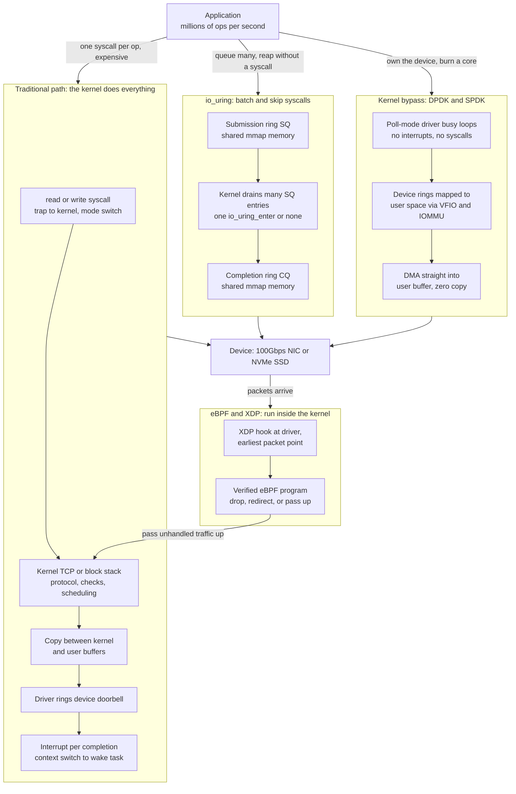

# 🚀 Kernel Bypass and Modern I/O

> [!abstract] TL;DR
> For decades the kernel mediated every I/O: an application made a **system call**, the kernel's network or block stack processed the request, data was **copied** between kernel and user buffers, and a **per-operation interrupt** plus **context switch** signalled completion. That path is fine at thousands of ops per second, but at the **millions of ops per second** demanded by NVMe SSDs and 100Gbps+ NICs, the *kernel itself becomes the bottleneck* — the per-op fixed costs dwarf the useful work. Modern high-performance I/O is a **spectrum of responses** to this, ordered by how radical they are: (1) **reduce syscalls** by batching; (2) **eliminate copies** with zero-copy primitives (`sendfile`, `splice`, `mmap`, `MSG_ZEROCOPY`); (3) **modernize the async API** with **io_uring** — shared **submission and completion ring buffers** in memory that let an app queue and reap thousands of operations with *zero syscalls per op* in the fast path; (4) **bypass the kernel entirely** with **DPDK/SPDK**, poll-mode user-space drivers that map the NIC or NVMe device directly into the process and busy-poll DMA rings, trading a dedicated core and all kernel services for the lowest possible latency; (5) push logic *into* the kernel at the driver hook with **eBPF/XDP**, running sandboxed programs before the stack for DDoS filtering and load balancing; and (6) bypass *both* kernels with **RDMA**, writing directly into a remote machine's memory. The universal trade-off: bypass buys throughput and latency by giving up the kernel's protection, sharing, and generality — so general apps keep the kernel, and only specialized data planes bypass it. The broader trend is the kernel fighting back — io_uring and eBPF are the kernel becoming *fast and programmable* to stay relevant.

---

## Intuition

**Analogy: the customs officer at a border.** Picture every package crossing an international border being inspected by a **customs officer** — a helpful, trustworthy official who checks each parcel, stamps it, logs it, and forwards it. When a few hundred packages cross per day, the officer is invaluable: they enforce the rules, protect everyone, and keep the flow orderly. But now imagine **millions of packages a second** arriving. The officer, no matter how skilled, physically cannot inspect each one — the line backs up for miles, and the *inspection itself*, not the trucks, is now the bottleneck. The border is jammed not because the road is slow but because every single package must stop at one desk.

The traditional kernel is that customs officer. Every `read`, `write`, `send`, and `recv` stops at the syscall desk: a **mode switch** into the kernel, the stack's bookkeeping, a **copy** of the data, and a completion **interrupt**. Each stop costs only a microsecond or two — negligible for a database doing thousands of ops, ruinous for a router or storage engine doing millions.

**Kernel bypass builds a pre-cleared express lane.** For trusted, high-volume traffic, you set up a dedicated channel that goes *straight from sender to receiver*, skipping the customs desk entirely. The trade is obvious and total: you get enormous throughput, but you also **give up everything the officer provided** — the inspection, the protection, the shared enforcement of rules. Now *you* are responsible for security, isolation, and correctness. That is the whole story of modern I/O: how much of the customs officer's job are you willing to take on yourself in exchange for speed?

---

## How It Works

### The problem: fixed costs per operation

Every operation on the classic path pays four costs that are *independent of how much useful work the op does* (see [[System_Calls_and_the_Kernel_Interface]] and [[IO_Systems_and_Device_Drivers]]):

1. **Syscall / mode-switch overhead.** Trapping user to kernel and back flushes pipelines, swaps privilege level, and — since Meltdown/Spectre mitigations — may flush TLBs and branch predictors. Order ~1000 cycles round-trip.
2. **Data-copy cost.** The kernel copies bytes between its own buffers and the user buffer to preserve the copy semantics of `read`/`write`. For small requests this can rival the syscall cost.
3. **Per-operation interrupt.** The device raises an interrupt on completion; the CPU takes it, dispatches a handler, and returns. At millions of interrupts/sec this causes **receive livelock** — the CPU does nothing but enter and leave handlers (see [[Interrupts_Traps_and_Dual_Mode_Operation]]).
4. **Context switch.** A blocking syscall sleeps the task; completion wakes it, invoking the scheduler and polluting caches — thousands of cycles of direct plus indirect cost.

At 3,000 IOPS these costs are invisible. At **3,000,000 IOPS** — routine for a modern NVMe drive or a 100Gbps NIC at small packet sizes — they are the *entire* CPU budget. The device is fast; the software framing around each op is the wall. Measuring exactly which of the four dominates for a given workload is the province of [[Performance_Analysis_and_OS_Tuning]].

### The spectrum of solutions

Solutions escalate in how much of the kernel they discard:

- **Reduce syscalls (batching).** `readv`/`writev`, `sendmmsg`/`recvmmsg`, and epoll cut the number of crossings. Good, but still one crossing per batch and still copies.
- **Eliminate copies (zero-copy).** `sendfile` and `splice` move file to socket without ever entering user space; `mmap` maps a file's pages directly; `MSG_ZEROCOPY` lets the NIC DMA from the user buffer and notify when it may be reused. These attack cost #2.
- **Modernize the async API: io_uring.** Two **shared ring buffers** — a **submission queue (SQ)** and a **completion queue (CQ)** — live in memory `mmap`'d between the app and the kernel. The app writes many operation descriptors into the SQ tail and reads results from the CQ head. In the fast path (`IORING_SETUP_SQPOLL`, a kernel side thread polling the SQ) it can submit and reap **thousands of ops with zero syscalls**. This is true async for *both* storage and network I/O, and it is displacing the older POSIX AIO and epoll models (see [[IO_Scheduling_and_io_uring]]). It attacks costs #1 and #4 through amortization, and with registered buffers, #2 as well.
- **Bypass the kernel entirely: DPDK / SPDK.** The **Data Plane Development Kit** maps the NIC's DMA descriptor rings directly into a user-space process using VFIO and the IOMMU, then **busy-polls** them in a tight loop — no syscalls, no interrupts, no kernel stack. It uses **huge pages** to cut TLB misses and **pins threads to cores** for locality (see [[NUMA_and_Memory_Bandwidth]]). **SPDK** is the storage analog for NVMe, polling submission/completion queues in user space (see [[Storage_Interfaces_NVMe_SATA]]). This eliminates *all four* costs but dedicates cores to spinning and abandons every kernel service. Dedicating whole cores to a busy-poll loop is the same isolation discipline used in [[Real_Time_and_Embedded_Operating_Systems]].
- **Program the kernel from inside: eBPF / XDP.** Rather than leaving the kernel, run a **sandboxed program inside it at the earliest hook**. **XDP (eXpress Data Path)** attaches an **eBPF** program at the driver's receive path, *before* the network stack, to `DROP`, `TX`, `REDIRECT`, or `PASS` each packet at line rate — the basis of modern DDoS scrubbing and L4 load balancing. eBPF more broadly is a safe in-kernel virtual machine, verified for termination and memory safety, used for networking, tracing, and security — a genuine kernel-extensibility revolution.
- **Bypass both kernels: RDMA.** **Remote Direct Memory Access** (InfiniBand, RoCE) lets one machine's NIC write directly into another machine's memory, bypassing *both* kernels and the remote CPU — the foundation of HPC interconnects and disaggregated datacenter storage (see [[Distributed_Operating_Systems]]).

### Contrasting the paths



The picture makes the spectrum literal: io_uring keeps the kernel but moves the *interface* into shared memory so most ops touch it without a trap; DPDK/SPDK remove the kernel from the data path completely; XDP inserts programmable logic *before* the stack so unwanted traffic never pays for the stack at all. Each is the right answer for a different point on the throughput-versus-generality curve.

---

## Key Concepts

**Secondary (intuition level).**
The kernel is a helpful inspector that checks every piece of I/O — great for safety, but at millions of operations a second the inspection itself becomes the traffic jam. **Kernel bypass** is an express lane that skips the inspector for trusted, high-volume traffic: much faster, but now the application must do the inspector's job of protecting itself. Three landmarks: **io_uring** (queue lots of work in shared memory and skip the per-op call to the kernel), **DPDK** (talk to the network card directly from your program), and **eBPF/XDP** (run tiny approved programs inside the kernel to filter traffic instantly).

**Undergraduate (mechanism level).**
- **The four per-op costs** — syscall/mode switch, data copy, per-op interrupt, and context switch — are fixed overheads that dominate once useful work per op is small and op rate is high.
- **Batching** — `writev`, `sendmmsg`, epoll amortize the syscall over many ops but still cross the boundary once per batch and still copy.
- **Zero-copy** — `sendfile`/`splice` move data kernel-to-kernel; `mmap` maps pages; `MSG_ZEROCOPY` DMAs from the user buffer. All remove redundant copies.
- **io_uring rings** — a shared **submission queue** and **completion queue** in `mmap`'d memory; the app posts descriptors and reaps results, with an optional kernel poll thread giving a **zero-syscall fast path**. Replaces POSIX AIO and, for many workloads, epoll.
- **Poll-mode drivers (DPDK/SPDK)** — user-space drivers busy-poll device rings instead of taking interrupts; no kernel stack, DMA lands in user buffers.
- **XDP / eBPF** — a verified in-kernel program at the driver hook processes packets before the stack (`DROP`/`REDIRECT`/`PASS`).
- **RDMA** — the remote NIC writes directly into remote memory, bypassing both kernels and the remote CPU.
- **The core trade** — bypass gains throughput and latency; it loses protection, sharing, generality, and portability, and shifts responsibility to the app.

**Graduate (systems level).**
- **Amortization math** — batched paths turn per-op cost `C_syscall + C_copy + C_ctx` into `C_syscall/B + C_copy + C_ctx/B`, so as batch `B` grows the path becomes **copy-bound**; only zero-copy (registered buffers, DMA-to-user) breaks the copy floor.
- **SQPOLL and busy-polling** — trading a dedicated CPU core (100% utilization even when idle) for the removal of syscalls and interrupt latency; a per-core-throughput vs total-CPU-efficiency decision.
- **IOMMU-gated user-space DMA** — VFIO plus the IOMMU confine a user-space driver's DMA to its own buffers, making bypass *safe* without kernel mediation (the security hinge; see [[OS_Security_and_Isolation]]).
- **Huge pages and NUMA locality** — 2MB/1GB pages cut TLB pressure for large ring/buffer pools; polling threads and their rings are pinned to the NIC's local NUMA node to avoid cross-socket DMA (see [[NUMA_and_Memory_Bandwidth]]).
- **eBPF as a safe kernel VM** — a static **verifier** proves termination and memory safety before JIT-compiling to native code, enabling in-kernel extensibility (networking, tracing, LSM security) without the crash risk of kernel modules — the modern answer to the microkernel/monolithic tension in [[OS_Structure_and_Kernel_Architectures]].
- **User-space TCP stacks** — mTCP, F-Stack, and Seastar/DPDK rebuild TCP on top of poll-mode drivers to keep protocol semantics while escaping the kernel's per-connection overhead (relates to [[TCP_Protocol]] and [[Networking_in_the_Operating_System]]).
- **AF_XDP** — a hybrid: kernel-fast-path XDP redirects raw frames into a user-space socket ring, giving near-DPDK speed while keeping the kernel driver and IOMMU.
- **The convergence trend** — io_uring modernizing the async API and eBPF making the kernel programmable are the monolithic kernel *co-opting* bypass ideas to stay competitive (ties to [[The_Future_of_Operating_Systems]]).

---

## Python Demo

```python
# Quantify the OVERHEAD that kernel bypass eliminates.
#
# We model the CPU cost to COMPLETE ONE I/O request as the sum of fixed
# per-op overheads, and compare three data planes as batch size grows:
#
#   1) Traditional (syscall per op) : full syscall + copy + context-switch
#                                     bill on EVERY op -> no amortization.
#   2) io_uring (batched submit)    : syscall + context-switch amortize over
#                                     the batch; data still copied.
#   3) Kernel bypass (polled)       : no syscall, no interrupt/wakeup, and DMA
#                                     lands in the user buffer -> zero copy;
#                                     only ring processing remains (but a whole
#                                     core is pinned busy-polling).
#
# Left  : throughput (ops/sec on one saturated core) vs batch size.
# Right : CPU cost per op (cycles) vs batch size.
# numpy + matplotlib only.

import numpy as np
import matplotlib.pyplot as plt

FREQ      = 3.0e9    # 3 GHz core: cycles per second
C_SYSCALL = 1200.0   # user->kernel->user mode-switch round trip (with mitigations)
C_COPY    = 600.0    # copy one small request buffer across the kernel boundary
C_CTX     = 3000.0   # block + wake + reschedule when a blocking syscall sleeps
C_POLL    = 150.0    # user-space ring/descriptor processing per op (bypass fast path)

# Batch = ops submitted/reaped per kernel crossing
B = np.unique(np.round(np.logspace(0, 3, 40)).astype(int))   # 1 .. 1000

# 1) Traditional: every op pays the full bill (one syscall + one wakeup per op)
cyc_trad = np.full_like(B, C_SYSCALL + C_COPY + C_CTX, dtype=float)

# 2) io_uring: syscall + context switch shared across the batch; copy remains
cyc_iou = C_SYSCALL / B + C_COPY + C_CTX / B

# 3) Bypass: no syscall, no wakeup, zero copy -> only ring processing
cyc_byp = np.full_like(B, C_POLL, dtype=float)

# Throughput one saturated core sustains = (cycles/sec) / (cycles per op)
thr_trad = FREQ / cyc_trad
thr_iou  = FREQ / cyc_iou
thr_byp  = FREQ / cyc_byp

fig, (ax1, ax2) = plt.subplots(1, 2, figsize=(13, 5))

# LEFT: throughput vs batch size
ax1.loglog(B, thr_trad, color="#DC2626", lw=2, marker="o", ms=3, label="Traditional: syscall per op")
ax1.loglog(B, thr_iou,  color="#1D4ED8", lw=2, marker="s", ms=3, label="io_uring: batched submit/reap")
ax1.loglog(B, thr_byp,  color="#065F46", lw=2, marker="^", ms=3, label="Kernel bypass: polled, zero-copy")
ax1.set_xlabel("Batch size (ops per kernel crossing, log)")
ax1.set_ylabel("Throughput (ops/sec on one core, log)")
ax1.set_title("Batching lifts io_uring toward the copy-bound ceiling;\nzero-copy polling sets the high-IOPS ceiling")
ax1.legend()
ax1.grid(True, which="both", alpha=0.3)

# RIGHT: CPU cost per op vs batch size
ax2.loglog(B, cyc_trad, color="#DC2626", lw=2, marker="o", ms=3, label="Traditional")
ax2.loglog(B, cyc_iou,  color="#1D4ED8", lw=2, marker="s", ms=3, label="io_uring")
ax2.loglog(B, cyc_byp,  color="#065F46", lw=2, marker="^", ms=3, label="Kernel bypass")
ax2.axhline(C_COPY, color="#1D4ED8", ls="--", alpha=0.5, label="copy-bound floor = 600")
ax2.set_xlabel("Batch size (ops per kernel crossing, log)")
ax2.set_ylabel("CPU cost per op (cycles, log)")
ax2.set_title("Per-op cost: batching amortizes syscall + context switch;\nonly zero-copy bypass beats the copy floor")
ax2.legend()
ax2.grid(True, which="both", alpha=0.3)

plt.tight_layout()
plt.savefig("kernel_bypass_throughput.png", dpi=110)
plt.show()

# --- Numeric takeaways ------------------------------------------------------
iou_256 = FREQ / (C_SYSCALL / 256 + C_COPY + C_CTX / 256)
print("Single-core throughput ceilings:")
print(f"  Traditional (any batch): {thr_trad[0] / 1e6:6.2f} M ops/s")
print(f"  io_uring at batch = 1  : {thr_iou[0]  / 1e6:6.2f} M ops/s")
print(f"  io_uring at batch = 256: {iou_256     / 1e6:6.2f} M ops/s")
print(f"  Kernel bypass          : {thr_byp[0]  / 1e6:6.2f} M ops/s")

ceiling_iou = FREQ / C_COPY                       # io_uring is copy-bound
b90 = B[np.argmax(thr_iou >= 0.9 * ceiling_iou)]  # batch to hit 90% of that
print(f"\nio_uring reaches 90% of its copy-bound ceiling at batch ~ {b90}")
print(f"Bypass ceiling is {thr_byp[0] / ceiling_iou:.1f}x io_uring's copy-bound ceiling")
print("Trade-off: bypass wins for high IOPS but pins a whole core at 100% even when idle.")
```

The two plots tell the whole spectrum. On the **left**, the traditional line is *flat*: syscall-per-op means batching cannot help, so it is stuck near ~0.6M ops/s per core no matter what. io_uring starts at the same point at batch=1 (identical costs) but **climbs steeply** as batching amortizes the syscall and context-switch overhead, then flattens against its **copy-bound ceiling** (~5M ops/s) — it can never beat the cost of copying each buffer. Kernel bypass is a *flat high ceiling* (~20M ops/s) because it pays none of the four costs, only cheap ring processing. The **crossover** is the headline: batched io_uring quickly overtakes traditional, but only zero-copy polling reaches the top tier that high-IOPS data planes need. The **right** plot is the same story in per-op cycles: traditional flat and expensive, io_uring decaying toward the dashed copy floor, bypass a flat low line beneath it. The catch the numbers hide — and the printout states — is that bypass's ceiling comes from **pinning a whole core at 100%**, so it only *wins* when the offered load is high enough to keep that core busy; at low IOPS the kernel path is the efficient choice.

---

## Real-World Applications

> **Example — an NVMe database on io_uring.** Modern storage engines (ScyllaDB via Seastar, and increasingly PostgreSQL and RocksDB) issue reads and writes through **io_uring**: they post hundreds of NVMe operations into the shared submission ring and reap completions from the completion ring with, in the SQPOLL fast path, *no syscall at all*. This turns the classic "one blocking `pread` per row" — a syscall and a context switch each — into a batched, zero-syscall pipeline, and is a major reason single nodes now sustain millions of IOPS against fast SSDs (see [[Storage_Interfaces_NVMe_SATA]], [[Disk_Scheduling_and_IO_Management]]).

- **DPDK in telecom and firewalls.** 5G user-plane functions, virtual routers, and NGFWs built on DPDK poll the NIC from user space to forward packets at 100Gbps+ line rate, dedicating cores to the data plane. This is the substrate of **Network Function Virtualization** (see [[Network_Function_Virtualization]], [[Software_Defined_Networking]]).
- **High-frequency trading.** Trading systems use DPDK and kernel-bypass NICs (Solarflare/OpenOnload) to shave microseconds off the tick-to-trade path, where the syscall and interrupt latency of the kernel stack is unacceptable.
- **Cloudflare / Meta DDoS mitigation with XDP.** Line-rate packet filters written as **eBPF/XDP** programs drop malicious traffic at the driver hook before it ever costs the stack a cycle — Cloudflare's L4Drop and Meta's Katran load balancer are production XDP (relates to [[Firewalls_and_IDS]]).
- **Cilium and eBPF service mesh.** Kubernetes networking, policy, and observability increasingly run as eBPF programs; Cilium replaces `iptables` and even sidecar proxies with in-kernel eBPF, tying kernel-bypass ideas to container networking (see [[Containers_and_OS_Level_Virtualization]], [[Service_Mesh]]).
- **RDMA in HPC and disaggregated storage.** InfiniBand/RoCE RDMA moves data directly between remote memories for MPI collectives and NVMe-over-Fabrics, bypassing both kernels and the remote CPU — foundational to modern AI training clusters (see [[Distributed_Operating_Systems]]).

---

## Common Pitfalls

- **Reaching for bypass at low load.** DPDK/SPDK pin a core at 100% busy-polling *whether or not there is traffic*. Below the crossover load, a plain kernel path (even blocking) uses far less total CPU. Bypass wins only when a core would be saturated anyway.
- **Assuming io_uring means zero-copy.** io_uring removes syscall and wakeup overhead, but by default buffered operations still copy. You must use **registered/fixed buffers** (and appropriate opcodes) to actually hit the zero-copy path; forgetting this leaves you at the copy-bound ceiling.
- **Ignoring the security shift.** Once you own the device, the kernel is no longer inspecting your DMA. Without a correctly configured **IOMMU/VFIO**, a bug in a user-space driver can DMA anywhere in physical memory. Bypass moves the entire protection burden onto your code — a theme of [[OS_Security_and_Isolation]].
- **eBPF verifier fights.** eBPF programs must pass a static verifier that proves bounded loops and safe memory access. Complex logic hits verifier limits (instruction count, state explosion); developers waste days restructuring code the verifier will accept. This is a feature, not a bug — it is what keeps in-kernel code safe.
- **NUMA-oblivious placement.** A DPDK polling thread on one socket driving a NIC attached to another pays cross-socket DMA and cache-coherence traffic that silently caps throughput. Pin threads, rings, and huge-page pools to the device's local NUMA node (see [[NUMA_and_Memory_Bandwidth]]).
- **Losing kernel services and expecting them back.** Bypass a NIC and you lose the kernel's TCP stack, netfilter, tcpdump, and routing. You either rebuild them in user space (mTCP, F-Stack) or do without — a real engineering cost teams underestimate.
- **Benchmarking with tiny batches or single connections.** io_uring and bypass shine under *high concurrency and batching*. A microbenchmark that submits one op at a time will show io_uring roughly equal to a plain syscall (exactly the batch=1 point in the demo) and conclude, wrongly, that it "doesn't help."
- **Head-of-line blocking in busy-poll loops.** A single expensive operation in a poll-mode loop stalls every other queued op on that core, because there is no preemption. Data-plane code must stay uniformly short and avoid syscalls that could sleep.

---

## Related Concepts

Verified vault links:

**Operating Systems — foundations**
- [[System_Calls_and_the_Kernel_Interface]] — the mode-switch cost per op is the primary overhead that batching (io_uring) and bypass (DPDK) exist to eliminate.
- [[IO_Systems_and_Device_Drivers]] — bypass replaces the classic in-kernel driver path with user-space poll-mode drivers; this note is the baseline it improves on.
- [[Interrupts_Traps_and_Dual_Mode_Operation]] — per-op interrupts cause receive livelock at high rates; poll-mode drivers deliberately disable interrupts and busy-poll instead.
- [[Disk_Scheduling_and_IO_Management]] — io_uring is the modern async submission interface layered above the block I/O path.
- [[OS_Structure_and_Kernel_Architectures]] — eBPF (safe in-kernel extension) and user-space drivers (microkernel-like isolation) are new answers to the monolithic-vs-microkernel debate.
- [[Threads_and_Concurrency_Models]] — io_uring displaces thread-per-connection and epoll event loops as the async concurrency substrate.
- [[Containers_and_OS_Level_Virtualization]] — eBPF now powers container networking, policy, and observability (Cilium), tying bypass to cloud-native infra.

**Operating Systems — modern & distributed siblings**
- [[Networking_in_the_Operating_System]] — the kernel network stack whose per-packet overhead XDP, DPDK, and user-space TCP stacks route around.
- [[Distributed_Operating_Systems]] — RDMA bypasses both kernels and the remote CPU to write directly into remote memory across a cluster.
- [[OS_Security_and_Isolation]] — bypass shifts DMA safety onto the app; the IOMMU/VFIO and eBPF's verifier are the mechanisms that keep it safe.
- [[Performance_Analysis_and_OS_Tuning]] — profiling which of the four per-op costs dominates is how you decide whether batching or full bypass is warranted.
- [[Real_Time_and_Embedded_Operating_Systems]] — dedicating and isolating cores for busy-poll data planes mirrors real-time CPU isolation.
- [[The_Future_of_Operating_Systems]] — io_uring and eBPF are the monolithic kernel co-opting bypass ideas to stay relevant.

**Computer Architecture**
- [[IO_Scheduling_and_io_uring]] — the detailed mechanics of the submission/completion rings this note summarizes.
- [[Storage_Interfaces_NVMe_SATA]] — NVMe submission/completion queues and doorbells are exactly what io_uring and SPDK drive at scale.
- [[Interrupts_and_DMA]] — DMA descriptor rings, MSI-X, and coalescing are the hardware substrate that DPDK maps directly into user space.
- [[Memory_Mapped_IO]] — mapping device doorbells and rings into a process's address space is how user-space drivers reach the hardware.
- [[Bus_Architectures_PCIe]] — PCIe configuration space and VFIO passthrough enable safe user-space device ownership.
- [[NUMA_and_Memory_Bandwidth]] — huge pages, thread pinning, and NUMA-local rings are essential to sustaining bypass throughput.

**Networking**
- [[Network_Function_Virtualization]] — DPDK poll-mode data planes are the foundation of virtualized routers, firewalls, and 5G functions.
- [[TCP_Protocol]] — user-space TCP stacks (mTCP, F-Stack) rebuild TCP on bypass drivers to keep protocol semantics without kernel overhead.
- [[Firewalls_and_IDS]] — XDP runs line-rate packet filtering and DDoS scrubbing before the network stack.
- [[Software_Defined_Networking]] — eBPF/XDP provide programmable, in-kernel data planes for SDN.
- [[Service_Mesh]] — eBPF (Cilium) enables sidecarless service meshes by moving L4/L7 logic into the kernel.

---

## Review Questions

1. **(Secondary)** Using the customs-officer analogy, explain why the traditional kernel becomes a bottleneck only at very high operation rates, and what an "express lane" (kernel bypass) gives up in exchange for speed. Name the three landmark technologies covered and one thing each does.
2. **(Undergraduate)** List the four fixed per-operation costs of the classic I/O path. For each, name a technique in the spectrum (batching, zero-copy, io_uring, DPDK) that reduces or eliminates it, and explain how io_uring's shared submission/completion rings achieve a *zero-syscall* fast path.
3. **(Undergraduate scenario)** A team benchmarks io_uring by submitting one request at a time and finds it no faster than blocking `pread`. Using the demo's cost model, explain why (what is the batch=1 cost?) and what they must change to see io_uring's benefit. Why can io_uring still not reach DPDK's throughput ceiling even with huge batches?
4. **(Graduate trade-off)** You must forward packets at 100Gbps. Compare DPDK (poll-mode user-space driver) against XDP (eBPF at the driver hook) against a user-space TCP stack. Discuss CPU dedication, loss of kernel services, security responsibility, and which you would choose for (a) a stateless DDoS filter and (b) a stateful L7 proxy.
5. **(Graduate)** Kernel bypass trades the kernel's protection, sharing, and generality for throughput. Explain how the IOMMU/VFIO makes user-space DMA *safe*, why eBPF's verifier makes in-kernel extension *safe*, and argue whether io_uring and eBPF represent the monolithic kernel successfully "co-opting" bypass, or a temporary stage before more radical user-space designs.

---

## Sources

- Axboe, J. *Efficient IO with io_uring* (design document / kernel documentation), and the Linux kernel `io_uring` man pages (`io_uring_setup(2)`, `io_uring_enter(2)`). https://kernel.dk/io_uring.pdf
- The Linux Kernel Documentation — *io_uring* and *XDP / AF_XDP* subsystem docs. https://docs.kernel.org/
- DPDK Project. *Data Plane Development Kit — Programmer's Guide* (poll-mode drivers, EAL, huge pages, VFIO). https://doc.dpdk.org/guides/
- Høiland-Jørgensen, T. et al. *The eXpress Data Path: Fast Programmable Packet Processing in the Operating System Kernel*, CoNEXT 2018. https://dl.acm.org/doi/10.1145/3281411.3281443
- Jeong, E. et al. *mTCP: A Highly Scalable User-level TCP Stack for Multicore Systems*, NSDI 2014. https://www.usenix.org/conference/nsdi14/technical-sessions/presentation/jeong
- Gregg, B. *BPF Performance Tools* (Addison-Wesley, 2019) — eBPF as a safe in-kernel VM for tracing, networking, and security.

---

#operating-systems #kernel-bypass #io-uring #dpdk #ebpf
