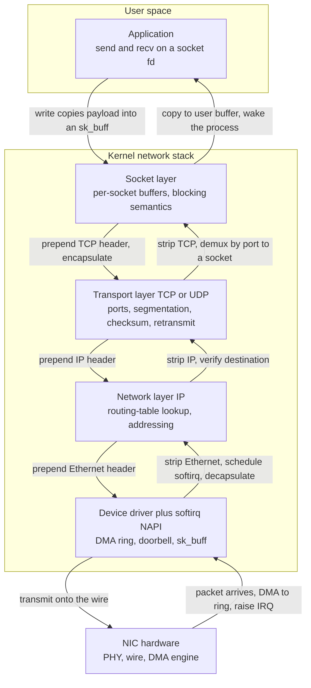

# 🌐 Networking in the Operating System

> [!abstract] TL;DR
> Networking is one of the OS kernel's core jobs: it exposes a single universal endpoint — the **socket** — and behind it runs a **layered protocol stack** (socket layer, transport TCP/UDP, IP/network layer, device/link layer with the NIC driver) that turns an application's `send`/`recv` into wire-ready packets and back. Going **down** the stack the kernel **encapsulates** the payload in nested headers (TCP, then IP, then Ethernet); coming **up** it **decapsulates** them, demultiplexing to the right socket by port. Because sockets are **file descriptors**, the same `read`/`write`/`close` surface covers local IPC and a connection to the far side of the planet — "everything is a file" reaching over the wire. The whole thing is a masterpiece of abstraction and a performance liability: at high packet rates the **per-packet cost** (interrupts, protocol processing, and copies between kernel and user space) becomes the bottleneck, which is why the kernel invented interrupt coalescing, **NAPI**, and offloads (checksum, TSO/GSO/GRO, RSS) — and why the fastest systems now **bypass the kernel entirely** with DPDK, XDP/eBPF, io_uring, and user-space TCP.

---

## Intuition

**Analogy:** The kernel's network stack is a **postal sorting facility bolted onto the back of your house**. Your application walks up to the **socket window** and hands over a letter — just the data, no envelope. It never touches an envelope itself. The facility takes the letter and wraps it in envelopes *within* envelopes: first a **transport envelope** stamped with a port number (which apartment in the destination building this is for — TCP if it must arrive reliably and in order, UDP if speed matters more than guarantees), then an **IP envelope** stamped with the destination street address, then an **Ethernet envelope** stamped with the next physical mailbox on the wire. Only then does it go out to the truck (the NIC) and onto the road.

At the far end the *same facility runs in reverse*. A truck drops a bundle of envelopes; a worker unwraps the Ethernet layer, reads the IP address to confirm it belongs here, unwraps the IP layer, reads the port on the transport envelope to decide *which resident's mailbox* this belongs in, unwraps it, and finally drops the bare letter into that resident's slot and rings their doorbell (wakes the process). Two truths fall out of the picture. First, the resident (the app) works with **bare letters and a single window** — it never learns the envelope rituals, which is why the *same* socket call reaches a program next door or a server across an ocean. Second, the facility does *real work per letter* — wrapping, routing, unwrapping, sorting, ringing doorbells — so when letters arrive by the millions per second, the **sorting facility itself**, not the road, becomes the jam.

---

## How It Works

### Sockets: the universal endpoint

Everything begins with the **socket** — the OS's single abstraction for a communication endpoint, created by `socket(domain, type, protocol)`. A socket is deliberately built as a **file descriptor**: the kernel returns a small integer that indexes into the process's open-file table, exactly like a file or a pipe. This is the "everything is a file" philosophy from [[File_Systems_and_Abstractions]] extended over the network — once you hold the descriptor, `read`, `write`, `close`, `poll`, and `dup` all work on it, so a socket slots into pipelines, `select` loops, and inheritance across `fork` with no special cases. Switch the `domain` from `AF_UNIX` (local IPC, see [[Interprocess_Communication]]) to `AF_INET` (IPv4) and the *same API* now speaks to another machine — the socket is the seam where local and remote IPC unify.

The canonical call sequence divides into a **server side** and a **client side**, and every step is a [[System_Calls_and_the_Kernel_Interface|system call]] that traps into the kernel:

1. **`socket()`** — allocate an endpoint; nothing is on the wire yet.
2. **`bind()`** — pin the socket to a local address and port (the server's "which window am I").
3. **`listen()`** — mark a TCP socket passive and size the accept backlog queue.
4. **`accept()`** — block until a completed connection arrives, then return a *new* socket fd for that one peer (the listening socket keeps listening).
5. **`connect()`** — the client actively initiates; for TCP this drives the three-way handshake.
6. **`send()` / `recv()`** (or `write`/`read`) — move bytes; **`close()`** tears the endpoint down.

### The in-kernel protocol stack

Behind that thin API sits a **layered implementation** that maps almost one-for-one onto the [[OSI_Reference_Model|OSI / TCP-IP model]]:

- **Socket layer** — the top, protocol-independent glue: it owns the per-socket **send and receive buffers**, enforces blocking/non-blocking semantics, and demultiplexes incoming data to the correct socket.
- **Transport layer** — [[TCP_Protocol|TCP]] (reliable, ordered byte stream: sequence numbers, acknowledgements, retransmission, flow and congestion control) or [[UDP_Protocol|UDP]] (a thin, unreliable datagram wrapper). See [[Transport_Layer]]. This layer owns **ports**, the 16-bit numbers that let one IP address host thousands of independent conversations.
- **Network layer** — [[Network_Layer|IP]]: addressing, fragmentation, and the **routing-table lookup** that decides which interface and next hop a packet takes.
- **Link/device layer** — the [[Data_Link_Layer|Ethernet]] framing plus the **NIC driver**, which speaks DMA rings and doorbells to the hardware (the mechanics live in [[IO_Systems_and_Device_Drivers]]).

**Encapsulation** is what "going down" means: each layer prepends its own header to the buffer handed down from above, so the payload is wrapped in nested headers `[Ethernet [IP [TCP [data]]]]`. **Decapsulation** is the reverse on receive — each layer strips and interprets its own header, then hands the shrinking remainder up. The app only ever sees the innermost `data`.



### The receive path (the hard, asynchronous direction)

Receiving is where the kernel earns its keep, because packets arrive **unbidden** and must be handled without a process asking:

1. A packet lands on the NIC; the hardware **DMAs** it straight into a pre-posted **ring buffer** in kernel memory (no CPU byte-copy — see the DMA discussion in [[IO_Systems_and_Device_Drivers]]).
2. The NIC **raises an interrupt**. The driver's top-half handler runs in [[Interrupts_Traps_and_Dual_Mode_Operation|interrupt context]], does the bare minimum, and schedules deferred work.
3. Protocol processing runs in a **softirq** (`NET_RX_SOFTIRQ`) — the deferred "bottom half" — which pulls packets off the ring, wraps each in an **sk_buff** (`mbuf` on BSD), and pushes it *up* the stack: IP checks and routes it, TCP/UDP validate the checksum and find the connection.
4. The transport layer **demultiplexes by the 4-tuple** (source IP, source port, dest IP, dest port) to the owning socket and appends the data to that socket's receive buffer.
5. The kernel **wakes any process blocked** in `recv`/`epoll` on that socket; the process then copies the data from kernel buffer to user buffer and resumes.

The critical performance twist lives in step 2–3. Under a flood of packets, one interrupt *per packet* melts a CPU into a state called **receive livelock** — it spends all its time entering and leaving interrupt handlers and never drains the queue. Linux's answer is **NAPI**: on the first packet the driver **disables that queue's interrupts and switches to polling**, draining a *batch* of packets in one softirq pass, then re-enabling interrupts only when the queue drains. Interrupts amortize; throughput stops collapsing.

### The transmit path and kernel data structures

Transmit is comparatively calm because the application drives it: `write` **copies** the payload from user space into a kernel **socket buffer**, TCP carves it into segments sized to the path MTU (or hands a giant buffer to the NIC for **TSO/GSO** to segment in hardware), IP consults the **routing table** for the next hop, and the driver enqueues the frame on a transmit ring and rings the doorbell. Threading all of this is the **`sk_buff`** — the universal packet container that carries the data plus pointers to each header, passed by reference (not copied) as it travels the layers, so adding or stripping a header is just a pointer move. Alongside it live the **routing table** (Linux FIB), the **socket hash tables** for demux, and **connection tracking** (conntrack) for stateful firewalling and NAT.

### TCP lives in the kernel

For TCP, the kernel implements a full **connection state machine** (`LISTEN → SYN_SENT → ESTABLISHED → … → TIME_WAIT`), per-connection **retransmission timers**, **flow control** via the advertised receive window, and **congestion control** (CUBIC, BBR) that continuously estimates how fast the network path can absorb data. All of this state — one control block per connection — sits in kernel memory, which is exactly why a machine with a million connections spends a lot of RAM and CPU inside the kernel. See [[TCP_Protocol]] for the algorithmic detail.

---

## Key Concepts

**Secondary (intuition level).**
A **socket** is the single "window" your program talks to for all networking; it behaves like a file, so you `read` and `write` it. The kernel wraps your data in layers of headers to send it (**encapsulation**) and peels them off when it arrives (**decapsulation**), using the **port number** to decide which program a packet belongs to. Sending is easy because your program asks for it; **receiving is hard** because packets show up on their own and the kernel must handle an interrupt, sort the packet, and wake the right program — millions of times a second at high speed.

**Undergraduate (mechanism level).**
- **Socket API** — `socket`/`bind`/`listen`/`accept`/`connect`/`send`/`recv`/`close`; sockets as **file descriptors** unifying local and remote IPC.
- **The four kernel layers** — socket, transport (TCP/UDP + ports), network (IP + routing), link (Ethernet + NIC driver) — and their mapping to OSI/TCP-IP.
- **Encapsulation / decapsulation** — nested headers `[Ethernet [IP [TCP [data]]]]` added going down, stripped going up.
- **Receive path** — NIC DMA to ring buffer → interrupt → driver top-half → softirq/NAPI → IP → transport → **demux by 4-tuple** → wake process.
- **Transmit path** — `write` copy into socket buffer → TCP segmentation → IP routing → driver → NIC.
- **`sk_buff` / `mbuf`** — the packet container passed by reference; the routing table and socket hash tables for demux.
- **`select`/`poll`/`epoll`/`kqueue`** — how one thread waits on thousands of sockets at once.

**Graduate (systems level).**
- **NAPI and interrupt coalescing** — poll-under-load and one IRQ per batch to escape per-packet interrupt overhead and receive livelock.
- **The copy tax and context switches** — every `recv` typically copies kernel → user and may context-switch; at line rate this dominates the CPU budget. Zero-copy paths (`sendfile`, `splice`, `MSG_ZEROCOPY`) fight it.
- **Offloads** — **checksum offload**, **TSO/GSO** (segment big buffers late/in hardware on TX), **GRO/LRO** (coalesce many small received frames into one super-frame *before* protocol processing on RX), and **RSS** (hash flows across many hardware queues and cores).
- **The C10K / C10M problem** — scaling from ten thousand to ten million concurrent connections forces event-driven I/O and eventually kernel bypass.
- **Kernel bypass** — **DPDK** (poll-mode user-space drivers), **XDP/eBPF** (a programmable hook at the earliest RX point), **io_uring** (async submission rings that batch syscalls), and full **user-space TCP** stacks — trading generality and safety for latency (the planned *Kernel_Bypass_and_Modern_IO* note).
- **Network namespaces and virtual networking** — per-container isolated stacks, **veth** pairs, and software **bridges** that make containers first-class network citizens (the planned *Containers_and_OS_Level_Virtualization* note).
- **The stack as attack surface** — in-kernel **netfilter/nftables** firewalling and conntrack, and why a bug in packet parsing is a remote kernel exploit (the planned *OS_Security_and_Isolation* note).

---

## Python Demo

```python
# Modeling the OS network stack as a PER-PACKET pipeline, and why small
# packets starve throughput while batching (NAPI/coalescing) and large
# packets (GSO/GRO offloads) rescue it.
#
# Cost model (CPU cycles) for ONE received packet of payload size S bytes:
#   - interrupt entry/exit .......... C_IRQ   (amortized by coalescing factor K)
#   - protocol processing ........... C_PROTO (IP+TCP demux, sk_buff alloc/free;
#                                              amortized by GRO batch factor G)
#   - copy kernel -> user ........... C_BYTE * S   (grows with the data)
#
# Achievable packets/sec on one saturated 3 GHz core = FREQ / cycles_per_packet.
# Throughput  = pps * S * 8 bits.  We also compute how many cores it takes to
# sustain a 10 Gbps line rate at each packet size.
# numpy + matplotlib only.

import numpy as np
import matplotlib.pyplot as plt

FREQ    = 3.0e9      # cycles/sec on one core (3 GHz)
C_IRQ   = 3000.0     # cycles per hardware interrupt (save/dispatch/restore)
C_PROTO = 2200.0     # cycles of per-packet protocol + sk_buff work
C_BYTE  = 0.30       # cycles to copy one byte kernel -> user
LINE    = 10.0e9     # 10 Gbps target line rate (bits/sec)

# Payload sizes: 64 B (min Ethernet) .. 64 KB (a GSO/GRO super-packet)
S = np.geomspace(64, 65536, 300)

def stack(S, K=1, G=1):
    """cycles per packet with IRQ coalescing K and GRO batch G."""
    return C_IRQ / K + C_PROTO / G + C_BYTE * S

# Three regimes -----------------------------------------------------------
cyc_base  = stack(S, K=1,  G=1)     # baseline: 1 IRQ + full proto per packet
cyc_coal  = stack(S, K=32, G=1)     # interrupt coalescing / NAPI: 1 IRQ per 32 pkts
cyc_off   = stack(S, K=32, G=16)    # + GRO/GSO: protocol work shared over 16 pkts

pps_base, pps_coal, pps_off = FREQ / cyc_base, FREQ / cyc_coal, FREQ / cyc_off
gbps_base = pps_base * S * 8 / 1e9
gbps_coal = pps_coal * S * 8 / 1e9
gbps_off  = pps_off  * S * 8 / 1e9

# Cores needed to sustain 10 Gbps at each packet size --------------------
pps_needed  = LINE / (S * 8)                 # packets/sec required for line rate
cores_base  = pps_needed / pps_base
cores_coal  = pps_needed / pps_coal
cores_off   = pps_needed / pps_off

# Plot -------------------------------------------------------------------
fig, (ax1, ax2) = plt.subplots(1, 2, figsize=(13, 5))

ax1.loglog(S, pps_base, color="#DC2626", lw=2, label="baseline: 1 IRQ + full proto / pkt")
ax1.loglog(S, pps_coal, color="#1D4ED8", lw=2, label="NAPI / coalescing: 1 IRQ / 32 pkts")
ax1.loglog(S, pps_off,  color="#065F46", lw=2, label="+ GRO/GSO offload: proto / 16 pkts")
ax1.set_xlabel("Packet payload size (bytes, log)")
ax1.set_ylabel("Achievable packets/sec on one core (log)")
ax1.set_title("Small packets hit a per-packet ceiling;\nbatching raises it")
ax1.legend(fontsize=8)
ax1.grid(True, which="both", alpha=0.3)

ax2.loglog(S, cores_base, color="#DC2626", lw=2, label="baseline")
ax2.loglog(S, cores_coal, color="#1D4ED8", lw=2, label="NAPI / coalescing")
ax2.loglog(S, cores_off,  color="#065F46", lw=2, label="+ GRO/GSO offload")
ax2.axhline(1.0, ls="--", color="gray", alpha=0.8, label="1 core budget")
ax2.set_xlabel("Packet payload size (bytes, log)")
ax2.set_ylabel("CPU cores needed for 10 Gbps (log)")
ax2.set_title("CPU cost to hold line rate:\nsmall packets are brutal without offloads")
ax2.legend(fontsize=8)
ax2.grid(True, which="both", alpha=0.3)

plt.tight_layout()
plt.savefig("kernel_network_stack.png", dpi=110)
plt.show()

# Numeric takeaways ------------------------------------------------------
i64 = 0                       # 64-byte packets (index of smallest size)
print("At 64-byte packets, achievable packets/sec on ONE core:")
print(f"  baseline            : {pps_base[i64]:12,.0f} pps")
print(f"  NAPI / coalescing   : {pps_coal[i64]:12,.0f} pps")
print(f"  + GRO/GSO offload   : {pps_off[i64]:12,.0f} pps")
print(f"\nCores to sustain 10 Gbps at 64-byte packets:")
print(f"  baseline            : {cores_base[i64]:6.2f} cores")
print(f"  NAPI / coalescing   : {cores_coal[i64]:6.2f} cores")
print(f"  + GRO/GSO offload   : {cores_off[i64]:6.2f} cores")
```

**What you see.** The left plot shows the whole problem in one shape: for **small packets** the per-packet fixed cost (`C_IRQ + C_PROTO`) dominates, so achievable packets-per-second flattens into a **hard ceiling** — the CPU can process only so many *packets*, regardless of how little each carries, and multiplying a tiny payload by that ceiling yields dismal throughput. Baseline (one interrupt and full protocol processing per packet) sits lowest; **NAPI/coalescing** lifts the ceiling by amortizing the interrupt over a batch; adding **GRO/GSO** (sharing protocol work across a merged super-packet) lifts it again. The right plot recasts the same physics as a budget: sustaining 10 Gbps with 64-byte packets needs *several cores* in the baseline model but drops **under one core** once batching and offloads apply. This is precisely why the kernel stack becomes the bottleneck at 100 Gbps+ and why kernel-bypass frameworks exist — when even the amortized per-packet cost is too high, the only remaining move is to remove the kernel from the hot path entirely.

---

## Real-World Applications

> **Example — nginx on Linux serving a million connections.** nginx never blocks a thread per connection; it registers every socket fd with **`epoll`** and runs a small pool of worker processes, each pinned to a core. Incoming packets are spread across the NIC's hardware queues by **RSS** so different cores handle different flows without contention; **GRO** coalesces bursts of small segments before they climb the TCP stack, and **TSO/GSO** lets the kernel hand oversized buffers to the NIC on the way out. Static files are served with **`sendfile`**, a zero-copy path that splices page-cache pages straight to the socket without a kernel→user→kernel round trip. Every one of those is a named mitigation for a cost the demo quantifies.

- **Kafka and databases.** High-throughput brokers lean on `sendfile`/`splice` to move log segments from disk to socket without copying through user space — the copy tax the demo charges per byte, eliminated.
- **Container networking (Docker/Kubernetes).** Each pod gets its own **network namespace** — a private, isolated instance of the entire stack (its own interfaces, routing table, and firewall). A **veth** pair stitches the namespace to a host **bridge** or to Open vSwitch, so containers get real IPs while sharing one kernel (the planned *Containers_and_OS_Level_Virtualization* note).
- **Cloudflare / high-performance edges.** They run **XDP/eBPF** programs that inspect and drop DDoS packets at the *earliest* point in the driver, before an sk_buff is even allocated — cutting the per-packet cost to near zero for traffic that will be discarded anyway.
- **DPDK trading and telecom systems.** Latency-critical 100 Gbps workloads map the NIC's DMA rings into a **user-space poll-mode driver**, burning a dedicated core to spin on the rings and bypass the kernel stack completely — the endpoint of the demo's argument.
- **io_uring servers.** Modern async servers batch `recv`/`send` submissions and completions through shared rings, amortizing the syscall crossing that otherwise recurs per operation (see [[IO_Scheduling_and_io_uring]]).

---

## Common Pitfalls

- **Interrupt-per-packet at high rate (receive livelock).** A NIC that interrupts faster than a core can drain it makes zero forward progress. The fix is **NAPI/coalescing** — poll a batch per softirq, re-enable interrupts only when idle. Never leave a 10G+ NIC in raw interrupt mode.
- **Copying bulk data through user space.** Every `read`/`write` pays the kernel↔user copy the demo charges per byte; for file-to-socket transfer that is pure waste. Use `sendfile`/`splice`/`MSG_ZEROCOPY` for zero-copy paths.
- **Small packets at line rate.** Line rate in *bits* is easy; line rate in *packets* is the real limit. 64-byte packets can be 20x harder than 1500-byte ones on the same link — always reason in **packets-per-second**, not just Gbps, and enable GRO/GSO to raise the packet ceiling.
- **A thread (or `select`) per connection.** Blocking a thread per socket exhausts memory and scheduler capacity at the **C10K** wall; `select`/`poll` are additionally O(n) per call. Use **`epoll`/`kqueue`** (O(ready)) for many connections.
- **TIME_WAIT and ephemeral-port exhaustion.** A client opening huge numbers of short TCP connections piles up sockets in `TIME_WAIT` and runs out of ephemeral ports. Reuse connections (keep-alive, pools) rather than tuning `tcp_tw_reuse` blindly.
- **Ignoring NUMA and IRQ affinity.** If a NIC's interrupts land on one node while the handling thread runs on another, every packet crosses the interconnect. Pin IRQ affinity, RSS queues, and worker threads to the same NUMA node (see [[IO_Systems_and_Device_Drivers]]).
- **Treating the stack as trusted.** The network stack parses attacker-controlled bytes in kernel mode; a parsing bug is a **remote kernel exploit**. Keep the kernel patched, filter early with netfilter/XDP, and minimize exposed protocols (the planned *OS_Security_and_Isolation* note).

---

## Related Concepts

Verified vault links:

- [[Interprocess_Communication]] — sockets are the IPC mechanism that spans machines; local Unix-domain sockets and network sockets share one API, so networking is IPC generalized over the wire.
- [[System_Calls_and_the_Kernel_Interface]] — every `socket`/`bind`/`send`/`recv` is a syscall trap; the syscall boundary is where the copy and context-switch costs are paid.
- [[File_Systems_and_Abstractions]] — sockets are file descriptors under "everything is a file", which is why `read`/`write`/`poll`/`close` work uniformly on them.
- [[Interrupts_Traps_and_Dual_Mode_Operation]] — the NIC interrupt and softirq/NAPI receive path are built directly on the interrupt and top-half/bottom-half machinery.
- [[IO_Systems_and_Device_Drivers]] — the NIC driver, DMA ring buffers, interrupt coalescing, and offloads are the device-layer foundation of the stack.
- [[Distributed_Operating_Systems]] — networking is the substrate distributed systems run on; sockets and message passing over the stack are how nodes communicate once you cross a machine boundary.
- [[IO_Scheduling_and_io_uring]] — io_uring's async submission rings are a leading answer to the per-syscall overhead of `recv`/`send` at scale.
- [[TCP_Protocol]] — the transport-layer algorithm (handshake, retransmission, flow and congestion control) that the kernel implements as a per-connection state machine.
- [[UDP_Protocol]] — the thin, unreliable datagram alternative that skips TCP's state and cost.
- [[Transport_Layer]] — the OSI transport layer and ports, realized here as the kernel's TCP/UDP demux by 4-tuple.
- [[Network_Layer]] — IP addressing, routing, and fragmentation, the layer below transport in the kernel stack.
- [[OSI_Reference_Model]] — the layered model the kernel implementation mirrors (socket/transport/network/link).
- [[Data_Link_Layer]] — Ethernet framing and the link layer the NIC driver drives.

Planned Operating Systems sibling notes this connects to (create and back-link when written): *Kernel_Bypass_and_Modern_IO*, *Performance_Analysis_and_OS_Tuning*, *Containers_and_OS_Level_Virtualization*, *OS_Security_and_Isolation*.

---

## Review Questions

1. **(Secondary)** Using the postal-sorting-facility analogy, explain what a socket is, what encapsulation and decapsulation mean, and why the *receiving* side of networking is harder for the OS than the sending side. Why can the same `read`/`write` calls talk to a program next door and a server across the world?
2. **(Undergraduate)** Walk a received TCP segment from the moment it hits the NIC to the moment `recv()` returns in the application: name every stage (DMA, interrupt, softirq/NAPI, IP, TCP demux, socket buffer, wakeup, copy) and state at which stage the packet is demultiplexed to the right socket and by what key.
3. **(Undergraduate scenario)** A server saturates a CPU core while pushing only 2 Gbps of *64-byte* UDP packets, yet the same core easily pushes 9 Gbps of 1500-byte packets. Using the demo's per-packet cost model, explain what dominates the small-packet case and name two mechanisms (one on RX, one on TX) that would raise the achievable packet rate.
4. **(Graduate trade-off)** Interrupt coalescing/NAPI, GRO/GSO, and RSS each attack a different term in the per-packet cost. Explain what each one amortizes or parallelizes, and why, even with all three, a 100 Gbps line of minimum-size packets still pushes teams toward kernel bypass (DPDK/XDP). What exactly does bypass give up in exchange for the latency?
5. **(Graduate)** Contrast the in-kernel TCP stack with a user-space TCP stack (e.g., over DPDK) on four axes: per-packet CPU overhead, the copy/context-switch tax, security/attack surface, and operational generality (firewalls, tcpdump, namespaces). When is the kernel stack the *right* choice despite being the bottleneck?

---

## Sources

- Bovet, D. & Cesati, M. *Understanding the Linux Kernel*, 3rd ed. (O'Reilly, 2005) — Ch. 18–19: the network stack, sk_buff, and socket layer. [https://www.oreilly.com/library/view/understanding-the-linux/0596005652/](https://www.oreilly.com/library/view/understanding-the-linux/0596005652/)
- Stevens, W. R., Fenner, B., Rudoff, A. *UNIX Network Programming, Vol. 1: The Sockets Networking API*, 3rd ed. (Addison-Wesley, 2003) — the definitive socket-API reference. [https://www.pearson.com/](https://www.pearson.com/)
- Salim, J. H., Olsson, R., Kuznetsov, A. "Beyond Softnet" (USENIX ALS, 2001) — the paper introducing **NAPI** and the receive-livelock problem it solves. [https://www.usenix.org/legacy/events/als01/full_papers/jamal/jamal.pdf](https://www.usenix.org/legacy/events/als01/full_papers/jamal/jamal.pdf)
- Kegel, D. "The C10K Problem." — the classic survey of scalable I/O event notification (select/poll/epoll/kqueue). [http://www.kegel.com/c10k.html](http://www.kegel.com/c10k.html)
- The Linux Foundation. *Scaling in the Linux Networking Stack* (kernel docs: RSS, RPS, RFS) and the `socket(7)`, `tcp(7)`, `epoll(7)` manual pages. [https://www.kernel.org/doc/html/latest/networking/scaling.html](https://www.kernel.org/doc/html/latest/networking/scaling.html)
- DPDK Project. *Programmer's Guide* — poll-mode drivers and the case for user-space kernel bypass. [https://doc.dpdk.org/guides/prog_guide/](https://doc.dpdk.org/guides/prog_guide/)

---

#operating-systems #network-stack #sockets #tcp-ip #kernel-networking
